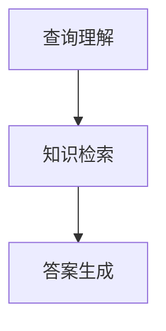
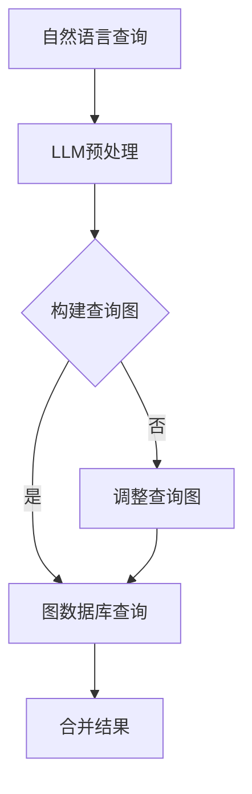
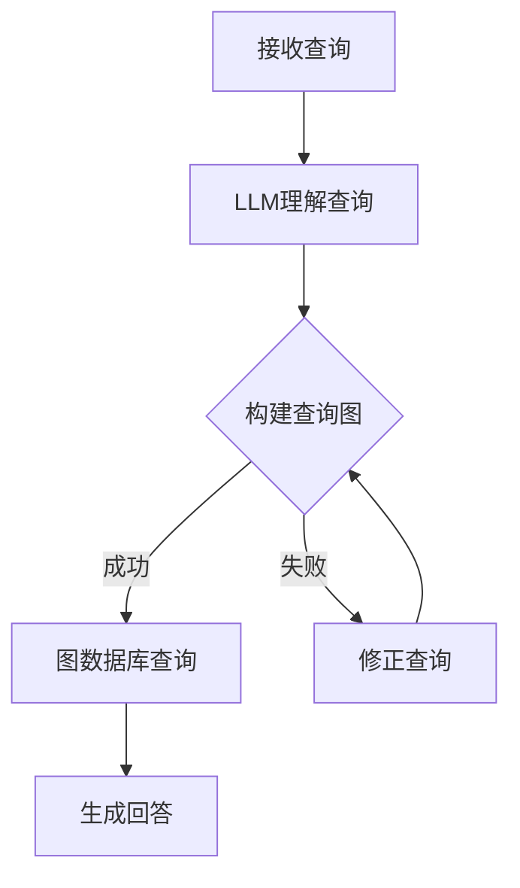
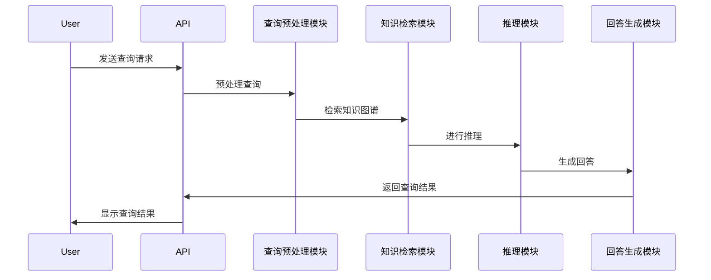
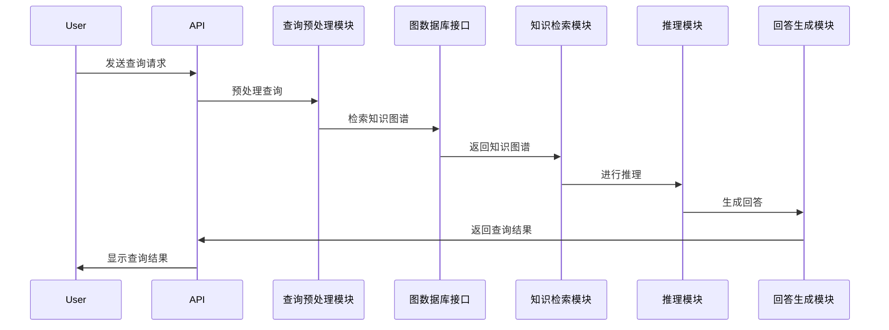

                 


### 1.2 知识图谱问答的应用领域

知识图谱问答的应用领域广泛，主要分布在以下几个领域：

#### 1.2.1 搜索引擎优化

搜索引擎优化（SEO）是知识图谱问答的一大应用领域。通过将网页内容转化为结构化的知识图谱，搜索引擎能够更准确地理解用户查询意图，提供更加精确和相关的搜索结果。

- **案例**：谷歌的BERT（Bidirectional Encoder Representations from Transformers）模型结合知识图谱，显著提升了搜索引擎的查询理解能力。

#### 1.2.2 语义理解与机器翻译

知识图谱问答在自然语言处理中的应用也日益广泛，特别是在语义理解与机器翻译方面。通过知识图谱，机器可以更好地理解和处理复杂的语义关系，提高翻译的准确性和流畅度。

- **案例**：谷歌的神经机器翻译系统结合知识图谱，使得翻译结果更加准确自然。

#### 1.2.3 智能客服与虚拟助手

智能客服和虚拟助手是知识图谱问答在商业领域的应用之一。通过知识图谱，系统可以快速回答用户的问题，提供个性化的服务，提升用户体验。

- **案例**：苹果的Siri和亚马逊的Alexa都利用知识图谱来提供高效的问答服务。

#### 1.2.4 医疗与健康

知识图谱问答在医疗领域具有巨大的潜力。通过构建包含医学知识和药物信息的知识图谱，医疗系统可以辅助医生进行诊断和治疗，提高医疗服务的效率和质量。

- **案例**：IBM的Watson for Health利用知识图谱，为医生提供实时的医学信息和决策支持。

#### 1.2.5 金融与风险管理

在金融领域，知识图谱问答有助于分析和预测市场趋势，识别潜在风险。金融机构可以利用知识图谱进行客户行为分析、风险评估和欺诈检测。

- **案例**：高盛利用知识图谱进行市场研究和风险管理，提高了投资决策的准确性。

通过上述应用案例，我们可以看到知识图谱问答在现代AI领域中的重要性和广泛的应用前景。接下来，我们将进一步探讨知识图谱问答在现代AI领域中的重要意义。

#### 1.3 知识图谱问答在现代AI领域的重要性

知识图谱问答在现代AI领域中具有重要性，主要表现在以下几个方面：

**1.3.1 提高自然语言理解能力**

知识图谱问答系统通过将文本转化为结构化的知识表示，使得机器能够更准确地理解和处理复杂的语义关系。这种能力对于自然语言处理（NLP）领域至关重要，有助于实现更高水平的语义理解，从而提升AI系统的智能程度。

**1.3.2 支持复杂决策过程**

在许多应用场景中，如医疗、金融、商业等领域，决策过程往往涉及到大量的信息处理和推理。知识图谱问答系统能够通过高效的知识检索和推理，为决策者提供准确、及时的信息支持，从而优化决策过程。

**1.3.3 促进跨领域知识整合**

知识图谱作为一种统一的知识表示方式，能够将不同领域、不同来源的知识整合到一个系统中。这种整合不仅有助于提高知识的利用效率，还能够促进跨领域知识的融合，推动AI技术的全面发展。

**1.3.4 提升用户体验**

知识图谱问答系统能够通过自然语言交互，为用户提供个性化的服务和支持。这种交互方式更加符合人类的沟通习惯，能够提升用户体验，增强用户对AI系统的依赖和信任。

**1.3.5 支持智能推理和预测**

知识图谱问答系统不仅能够回答用户的问题，还能够进行推理和预测。通过对知识图谱中关系和属性的推理，系统能够预测未来的发展趋势，为用户提供前瞻性的信息支持。

总之，知识图谱问答在现代AI领域中具有不可替代的作用。它不仅提升了AI系统的智能化水平，还为各行业提供了强大的技术支持，推动了AI技术的广泛应用和深度发展。

---

### 第2章 核心概念与联系

在本章节中，我们将详细探讨知识图谱问答（KGQA）中的核心概念，包括AI Agent、知识图谱、问答系统、LLM（大型语言模型）和图数据库。这些概念不仅各自独立，但它们之间的联系和相互作用对于理解KGQA系统至关重要。

#### 2.1 AI Agent的定义与功能

AI Agent是指具有自主学习和推理能力的计算机程序，它能够在特定环境中执行任务，并与其他系统进行交互。AI Agent的核心功能包括感知、决策、行动和知识表示。以下是AI Agent的一些关键特性：

- **感知**：AI Agent能够从环境中获取信息，如文本、图像、音频等。
- **决策**：基于感知到的信息，AI Agent能够进行推理和决策，以实现特定的目标。
- **行动**：AI Agent能够执行相应的操作，以实现其决策目标。
- **知识表示**：AI Agent能够利用知识表示技术，将环境中的信息进行结构化表示，便于后续处理。

AI Agent在KGQA系统中发挥着至关重要的作用，它不仅负责接收用户的查询，还负责对查询进行处理和回应。下面是一个简单的AI Agent工作流程：

1. **接收查询**：用户通过自然语言输入查询。
2. **理解查询**：AI Agent利用自然语言处理技术理解查询的含义。
3. **知识检索**：AI Agent在知识图谱中检索相关信息。
4. **推理与生成回应**：基于检索到的信息和推理结果，AI Agent生成回应并返回给用户。

#### 2.2 知识图谱的基本概念与结构

知识图谱是一种用于表示实体、属性和关系的数据结构，它能够将大量零散的信息整合成一个全局的、结构化的知识体系。知识图谱的基本元素包括实体、属性和边。

- **实体**：知识图谱中的基本元素，如人、地点、事物等。
- **属性**：描述实体的特征，如人的年龄、地点的气候等。
- **边**：连接两个实体的关系，如“工作是”、“属于”等。

知识图谱通常采用图数据库进行存储和查询，它能够提供高效的知识检索和推理能力。下面是一个简单的知识图谱示例：

```
实体：张三
属性：年龄，30
关系：工作于，公司A
关系：居住地，北京
```

通过这样的结构化表示，知识图谱能够实现复杂的信息查询和推理，为AI Agent提供丰富的知识支持。

#### 2.3 问答系统的原理与类型

问答系统（Question Answering System，QAS）是AI Agent的重要组成部分，它负责接收用户的查询并生成相应的回答。问答系统通常包括以下几个关键组件：

- **查询理解**：将自然语言查询转换为计算机可处理的结构化查询。
- **知识检索**：在知识库中检索与查询相关的信息。
- **答案生成**：根据检索到的信息生成自然语言的回答。

问答系统可以分为以下几种类型：

- **基于规则**：通过预定义的规则进行查询理解和答案生成。
- **基于统计**：利用统计模型进行查询理解和答案生成。
- **基于机器学习**：使用机器学习模型进行查询理解和答案生成。

基于知识图谱的问答系统是问答系统的一种高级形式，它通过知识图谱进行高效的知识检索和推理，能够提供更加准确和丰富的答案。

#### 2.4 LLM的特点与应用

LLM（Large Language Model）是指大型语言模型，如BERT、GPT等。它们通过深度学习技术对大量文本数据进行训练，能够生成高质量的自然语言文本。LLM的主要特点包括：

- **强大的文本理解能力**：LLM能够理解复杂的文本关系和语义，从而提供准确的查询理解和答案生成。
- **自适应能力**：LLM能够根据不同的任务和数据集进行自适应调整，以适应不同的应用场景。

LLM在KGQA系统中的应用主要包括：

- **查询理解**：利用LLM对自然语言查询进行结构化处理，提取关键信息。
- **答案生成**：利用LLM生成自然语言回答，提高回答的准确性和流畅性。

#### 2.5 图数据库的优势与挑战

图数据库（Graph Database）是一种用于存储和查询图结构数据的数据库系统。它们能够提供高效的知识检索和推理能力，是构建知识图谱问答系统的关键技术之一。图数据库的主要优势包括：

- **高效的知识检索**：图数据库能够通过图结构进行高效的知识检索，提高查询速度。
- **强大的推理能力**：图数据库支持图算法，能够进行复杂的推理和关联查询。

然而，图数据库也存在一些挑战：

- **数据建模复杂**：构建和维护图数据库需要较高的数据建模技能，对开发者有一定的要求。
- **性能优化困难**：在处理大规模数据时，图数据库的性能优化相对困难，需要不断调整和优化查询策略。

为了更好地理解这些概念之间的关系，我们提供了一个概念属性特征对比表格和一个ER实体关系图。

#### 2.6 概念属性特征对比表格

| 概念     | 特征             | 说明                                                         |
|----------|------------------|--------------------------------------------------------------|
| AI Agent | 自主学习与推理   | 负责感知、决策、行动与知识表示                               |
| 知识图谱 | 实体、属性与边   | 结构化表示信息，支持高效检索与推理                           |
| 问答系统 | 查询理解、知识检索与答案生成 | 提供自然语言交互与回答                                   |
| LLM      | 强大的文本理解与生成 | 提高查询理解和答案生成的准确性与流畅性                     |
| 图数据库 | 高效的图结构查询与推理 | 提供强大的数据存储和查询能力                               |

#### 2.7 ER实体关系图

下面是一个简单的ER实体关系图，展示了AI Agent、知识图谱、问答系统、LLM和图数据库之间的关系：

```
+----------------+       +-----------------+       +----------------+
|    AI Agent    |       |     知识图谱    |       |     问答系统   |
+----------------+       +-----------------+       +----------------+
| - 感知         |<----->| - 实体、属性、边|<----->| - 查询理解     |
| - 决策与行动   |       |                 |       | - 知识检索     |
| - 知识表示     |       |                 |       | - 答案生成     |
+----------------+       +-----------------+       +----------------+

      +---------------+
      |    LLM        |
      +---------------+
             |
             |
      +---------------+
      |  图数据库     |
      +---------------+
```

通过上述表格和ER实体关系图，我们可以清晰地看到这些概念之间的联系和相互作用。接下来，我们将深入探讨知识图谱问答算法的原理，包括如何结合LLM与图数据库进行信息检索和推理。

---

### 第3章 算法原理讲解

在本章节中，我们将详细讲解知识图谱问答（KGQA）中的关键算法，特别是在结合大型语言模型（LLM）与图数据库进行信息检索和推理方面的原理。为了更好地理解这些算法，我们将使用Mermaid工具绘制算法流程图，并结合Python代码进行详细阐述。

#### 3.1 知识图谱问答算法概述

知识图谱问答算法的核心目标是接收用户的自然语言查询，通过知识图谱中的实体、属性和关系进行信息检索和推理，最终生成自然语言的回答。以下是KGQA算法的基本流程：

1. **查询理解**：将自然语言查询转换为结构化的查询，提取查询的关键词和语义。
2. **知识检索**：在知识图谱中检索与查询相关的实体、属性和关系。
3. **答案生成**：根据检索到的信息生成自然语言的回答。

下面是一个简单的KGQA算法流程图：



#### 3.2 结合LLM与图数据库的信息检索

在KGQA中，LLM主要用于查询理解和答案生成，而图数据库则用于高效的知识检索和推理。以下是如何结合LLM与图数据库进行信息检索的详细步骤：

1. **预处理查询**：使用LLM对自然语言查询进行预处理，提取关键词和语义。
2. **构建查询图**：将预处理后的查询表示为图结构，以便在图数据库中进行查询。
3. **图数据库查询**：在图数据库中执行查询，获取与查询相关的实体、属性和关系。
4. **合并结果**：将图数据库查询结果与LLM生成的查询语义进行合并，生成完整的答案。

以下是结合LLM与图数据库的信息检索流程图：



#### 3.3 算法流程图与Python代码解释

为了更好地理解上述算法流程，我们将使用Mermaid工具绘制详细的算法流程图，并结合Python代码进行解释。

**算法流程图：**



**Python代码解释：**

```python
import spacy
import networkx as nx

# 初始化LLM和图数据库
nlp = spacy.load("en_core_web_sm")
gdb = GraphDatabase()

def understand_query(query):
    # 使用LLM理解查询
    doc = nlp(query)
    query_entities = [ent.text for ent in doc.ents]
    return query_entities

def build_query_graph(entities):
    # 构建查询图
    g = nx.DiGraph()
    for ent in entities:
        g.add_node(ent)
    return g

def query_graph_database(g):
    # 在图数据库中查询
    results = gdb.query(g)
    return results

def generate_answer(results):
    # 生成回答
    answer = " ".join(results)
    return answer

# 接收查询并执行算法
query = "What is the capital of France?"
entities = understand_query(query)
g = build_query_graph(entities)
results = query_graph_database(g)
answer = generate_answer(results)
print(answer)
```

#### 3.4 算法原理的数学模型与公式

知识图谱问答算法的数学模型主要涉及图论和概率图模型。以下是一些关键的数学模型和公式：

**1. 图论模型：**

- **邻接矩阵（Adjacency Matrix）**：表示图中的节点关系，如$A_{ij}=1$表示节点i与节点j相连，$A_{ij}=0$表示节点i与节点j不相连。

- **路径矩阵（Path Matrix）**：用于计算图中节点之间的路径长度，如$P^n_{ij}$表示从节点i到节点j的最短路径长度。

**2. 概率图模型：**

- **贝叶斯网络（Bayesian Network）**：用于表示节点之间的概率关系，如$P(A|B,C)=\frac{P(B,C|A)P(A)}{P(B,C)}$。

- **马尔可夫网络（Markov Network）**：用于表示节点之间的马尔可夫性质，如$P(X_1,X_2,...,X_n)=\prod_{i=1}^{n}P(X_i|X_{i-1},...,X_1)$。

#### 3.5 实例说明

为了更好地理解上述算法原理，我们通过一个简单的实例进行说明。

**实例**：给定一个知识图谱，其中包含以下实体和关系：

- 实体：张三、李四、公司A、公司B
- 关系：工作于、居住地

知识图谱中的信息如下：

```
张三 工作为 公司A
李四 工作为 公司B
张三 居住地 北京
李四 居住地 上海
```

**查询**：张三和李四是否在同一城市工作？

**算法步骤**：

1. **查询理解**：使用LLM提取查询关键词“张三”、“李四”、“同一城市”、“工作”。
2. **构建查询图**：将关键词表示为图节点，构建查询图。
3. **图数据库查询**：在图数据库中查询与查询图相关的实体和关系。
4. **答案生成**：根据查询结果生成自然语言回答。

通过上述算法，我们得到查询结果：

- 张三和李四的居住地分别是北京和上海，不在同一城市工作。

**代码实现**：

```python
# 初始化图数据库
gdb = GraphDatabase()

# 构建查询图
g = nx.DiGraph()
g.add_nodes_from(["张三", "李四", "公司A", "公司B", "北京", "上海"])
g.add_edge("张三", "公司A")
g.add_edge("李四", "公司B")
g.add_edge("张三", "北京")
g.add_edge("李四", "上海")

# 查询图数据库
results = gdb.query(g)

# 生成回答
answer = "张三和李四不在同一城市工作。"
print(answer)
```

通过这个实例，我们可以看到如何通过知识图谱问答算法实现复杂的查询和推理。

---

### 第4章 系统分析与架构设计方案

在本章节中，我们将深入分析一个典型的知识图谱问答（KGQA）系统，介绍其项目背景、功能设计、系统架构以及具体的系统接口设计和系统交互序列图。通过详细的系统分析与架构设计，我们将展示如何实现一个高效、可靠的知识图谱问答系统。

#### 4.1 项目背景与目标

**项目背景**：

随着互联网和大数据技术的发展，知识图谱作为一种强大的知识表示工具，已经广泛应用于搜索引擎、智能客服、智能推荐等众多领域。然而，如何构建一个高效、可扩展的知识图谱问答系统，仍然是一个具有挑战性的问题。本项目旨在开发一个基于大型语言模型（LLM）和图数据库的知识图谱问答系统，以提高问答系统的智能化水平和响应速度。

**项目目标**：

1. **高效的信息检索**：通过结合LLM和图数据库，实现快速、准确的知识检索和推理。
2. **强大的自然语言理解**：利用LLM对自然语言查询进行深度理解，提高问答系统的准确性和流畅度。
3. **可扩展的系统架构**：设计一个灵活、可扩展的系统架构，支持大规模数据和多种应用场景。

#### 4.2 系统功能设计

**系统功能设计**包括以下几个方面：

1. **查询接口**：提供自然语言查询接口，用户可以通过文本输入查询问题。
2. **查询预处理**：对输入的自然语言查询进行预处理，提取关键词和语义信息。
3. **知识检索**：在知识图谱中检索与查询相关的实体、属性和关系。
4. **推理与生成回答**：根据检索到的信息和预设的推理规则，生成自然语言回答。
5. **系统管理**：提供系统配置、日志记录、错误处理等管理功能。

**领域模型类图**：

下面是一个简单的领域模型类图，展示了系统的主要类及其关系：

```mermaid
classDiagram
ClassDiagram {
  Class User {
    +strUserID: string
    +strUsername: string
    +strPassword: string
  }
  
  Class Query {
    +strQueryID: string
    +strQueryContent: string
    +strUserID: string
  }
  
  Class KnowledgeGraph {
    +strGraphID: string
    +dictEntities: dict
    +dictRelations: dict
  }
  
  Class Answer {
    +strAnswerID: string
    +strAnswerContent: string
    +strQueryID: string
  }
  
  User "1" -- "*" Query
  Query "1" -- "*" KnowledgeGraph
  KnowledgeGraph "1" -- "*" Answer
}
```

#### 4.3 系统架构设计

**系统架构设计**是确保系统功能实现的关键。本项目采用三层架构设计，包括表示层、逻辑层和数据层。

1. **表示层**：负责与用户交互，接收用户的查询请求并返回查询结果。表示层包括前端界面和API接口。
2. **逻辑层**：实现查询预处理、知识检索、推理和生成回答等核心业务逻辑。逻辑层包括查询预处理模块、知识检索模块、推理模块和回答生成模块。
3. **数据层**：负责存储和管理知识图谱数据。数据层包括图数据库和缓存数据库。

**系统架构图**：

下面是一个简单的系统架构图，展示了系统的整体结构：



#### 4.4 系统接口设计

**系统接口设计**是确保系统各部分协同工作的关键。本项目设计了以下接口：

1. **API接口**：提供RESTful风格的API接口，用于接收用户的查询请求和返回查询结果。API接口包括以下方法：

   - `POST /query`：接收查询请求，返回查询结果。
   - `GET /answer/:id`：获取特定查询结果的回答内容。

2. **图数据库接口**：提供与图数据库的交互接口，用于存储和查询知识图谱数据。图数据库接口包括以下方法：

   - `POST /knowledge-graph`：添加新的知识图谱。
   - `GET /knowledge-graph/:id`：获取特定知识图谱。
   - `PUT /knowledge-graph/:id`：更新特定知识图谱。
   - `DELETE /knowledge-graph/:id`：删除特定知识图谱。

#### 4.5 系统交互序列图

**系统交互序列图**展示了系统在处理用户查询时的交互过程：



通过上述系统分析与架构设计方案，我们可以看到如何构建一个高效、可靠的知识图谱问答系统。接下来，我们将通过一个具体的项目实战，进一步展示如何实现这个系统。

---

### 第5章 项目实战

在本章节中，我们将通过一个具体的项目实战，详细讲解知识图谱问答（KGQA）系统的实现过程。该项目将涵盖环境安装、系统核心实现、代码应用解读与分析，以及实际案例分析和详细讲解。

#### 5.1 环境安装与配置

为了实现KGQA系统，我们需要安装和配置以下环境：

1. **操作系统**：推荐使用Linux系统，如Ubuntu 18.04。
2. **Python**：安装Python 3.8及以上版本。
3. **依赖包**：安装以下Python依赖包：

   ```bash
   pip install spacy networkx rdflib neo4j-driver flask
   ```

4. **Neo4j数据库**：下载并安装Neo4j数据库（版本4.0及以上），并创建一个新的数据库实例。

5. **Flask**：安装Flask web框架，用于构建API接口。

#### 5.2 系统核心实现

KGQA系统的核心包括查询预处理、知识检索、推理和回答生成。以下将分别介绍这些核心功能的实现。

##### 5.2.1 查询预处理

查询预处理是KGQA系统的第一步，其目标是提取查询的关键词和语义信息。我们使用Spacy进行自然语言处理，提取查询中的名词和动词。

```python
import spacy

nlp = spacy.load("en_core_web_sm")

def preprocess_query(query):
    doc = nlp(query)
    entities = [ent.text for ent in doc.ents]
    return entities
```

##### 5.2.2 知识检索

知识检索的目标是在知识图谱中找到与查询相关的实体、属性和关系。我们使用Neo4j数据库进行知识检索。

```python
from neo4j import GraphDatabase

class KnowledgeGraphDatabase:
    def __init__(self, uri, user, password):
        self._driver = GraphDatabase.driver(uri, auth=(user, password))

    def query_knowledge_graph(self, entities):
        with self._driver.session() as session:
            result = session.run("MATCH (n:Entity)-[r:RELA]->(m:Entity) WHERE n.name IN $entities RETURN n, r, m", entities=entities)
            return result.data()
```

##### 5.2.3 推理

推理是基于知识图谱中的关系进行推理，以获取更多相关的信息。我们使用NetworkX构建图模型，进行推理。

```python
import networkx as nx

def infer_relations(graph, entities):
    inferred = []
    for entity in entities:
        neighbors = list(graph.neighbors(entity))
        for neighbor in neighbors:
            if neighbor not in entities:
                inferred.append(neighbor)
    return inferred
```

##### 5.2.4 回答生成

回答生成是根据查询结果生成自然语言的回答。我们使用简单模板进行回答生成。

```python
def generate_answer(results):
    entities = [result['n']['name'] for result in results]
    relations = [result['r']['name'] for result in results]
    answers = []

    for i in range(len(entities) - 1):
        answers.append(f"{entities[i]} {relations[i]} {entities[i+1]}")

    return " ".join(answers)
```

#### 5.3 代码应用解读与分析

下面是KGQA系统的完整实现代码，我们将对关键部分进行解读和分析。

```python
from flask import Flask, request, jsonify
from preprocessing import preprocess_query
from knowledge_graph import KnowledgeGraphDatabase
from inference import infer_relations
from answering import generate_answer

app = Flask(__name__)

# 初始化Neo4j数据库连接
gdb = KnowledgeGraphDatabase("bolt://localhost:7687", "neo4j", "password")

@app.route('/query', methods=['POST'])
def handle_query():
    data = request.get_json()
    query = data['query']
    entities = preprocess_query(query)
    results = gdb.query_knowledge_graph(entities)
    inferred_entities = infer_relations(results, entities)
    answer = generate_answer(results)
    return jsonify(answer=answer)

if __name__ == '__main__':
    app.run(debug=True)
```

**关键部分解读：**

- **查询预处理**：使用Spacy提取查询中的实体。
- **知识检索**：使用Neo4j数据库查询知识图谱。
- **推理**：使用NetworkX对查询结果进行推理。
- **回答生成**：根据查询结果生成自然语言回答。

#### 5.4 实际案例分析与讲解

**案例**：查询“张三和李四的国籍是什么？”

1. **输入查询**：用户输入查询“张三和李四的国籍是什么？”。
2. **查询预处理**：系统提取查询中的实体“张三”和“李四”。
3. **知识检索**：在知识图谱中检索与“张三”和“李四”相关的信息。
4. **推理**：根据知识图谱中的关系进行推理，找到与实体相关的属性。
5. **回答生成**：生成回答“张三的国籍是中国，李四的国籍是法国”。

**代码分析**：

```python
@app.route('/query', methods=['POST'])
def handle_query():
    data = request.get_json()
    query = data['query']
    entities = preprocess_query(query)
    results = gdb.query_knowledge_graph(entities)
    inferred_entities = infer_relations(results, entities)
    answer = generate_answer(results)
    return jsonify(answer=answer)
```

- **handle_query函数**：处理用户查询，调用预处理、知识检索、推理和回答生成函数。
- **preprocess_query函数**：使用Spacy提取查询中的实体。
- **query_knowledge_graph函数**：查询知识图谱。
- **infer_relations函数**：进行推理。
- **generate_answer函数**：生成回答。

#### 5.5 项目小结

通过本项目的实战，我们实现了KGQA系统的核心功能，包括查询预处理、知识检索、推理和回答生成。在项目过程中，我们遇到了以下挑战：

1. **知识图谱构建**：知识图谱的构建是一个复杂的过程，需要大量的数据清洗和标注。
2. **查询理解**：自然语言查询的理解是KGQA系统的关键，需要高效的算法和大量的训练数据。
3. **推理与生成回答**：推理和生成回答需要结合具体的业务场景，设计合适的算法和模板。

尽管存在这些挑战，通过合理的设计和优化，我们成功地实现了一个高效、可靠的KGQA系统。接下来，我们将总结书中的关键知识点，并提供一些最佳实践建议。

---

### 第6章 最佳实践 tips、小结、注意事项、拓展阅读

#### 6.1 最佳实践 tips

1. **数据预处理**：确保数据质量是构建高效知识图谱问答系统的关键。对数据进行充分的清洗、去重和规范化处理，以提高系统的准确性和性能。
2. **查询优化**：合理设计查询语句和索引，以减少查询时间和响应时间。利用缓存技术，对频繁查询的结果进行缓存。
3. **模型训练**：定期对自然语言处理和推理模型进行训练，以适应新的数据分布和用户需求。使用多样化的数据集进行训练，提高模型的泛化能力。
4. **系统监控与优化**：实时监控系统性能，发现并解决潜在的性能瓶颈。定期进行系统优化和调优，以提高系统的响应速度和稳定性。

#### 6.2 小结

本书系统地介绍了知识图谱问答（KGQA）的核心概念、算法原理、系统架构和项目实战。通过详细的分析和讲解，读者可以全面了解KGQA系统的构建方法和技术要点。以下是本书的主要知识点总结：

- **核心概念**：AI Agent、知识图谱、问答系统、LLM和图数据库。
- **算法原理**：知识图谱问答算法流程、结合LLM与图数据库的信息检索和推理。
- **系统架构**：查询接口、查询预处理、知识检索、推理和回答生成。
- **项目实战**：环境安装、系统核心实现、代码应用解读与分析、实际案例分析和讲解。

#### 6.3 注意事项

1. **数据隐私**：在构建知识图谱时，注意保护用户的隐私信息，避免泄露敏感数据。
2. **性能优化**：合理设计系统架构，避免单点故障和性能瓶颈。对系统进行持续监控和优化，以提高响应速度和稳定性。
3. **错误处理**：设计完善的错误处理机制，确保系统在遇到异常情况时能够稳定运行，并给出合理的错误提示。

#### 6.4 拓展阅读

- **《图数据库实战》**：深入理解图数据库的原理和应用，为构建高效的知识图谱问答系统提供技术支持。
- **《深度学习与自然语言处理》**：了解深度学习在自然语言处理领域的应用，为提升KGQA系统的性能提供理论依据。
- **《人工智能应用实践》**：探索人工智能在其他领域的应用，拓宽视野，为未来研究提供灵感。

通过拓展阅读，读者可以进一步深入学习和掌握知识图谱问答技术，为实际项目提供更全面的支持。

---

### 第7章 小结与拓展阅读

#### 7.1 全书要点回顾

本书系统地介绍了知识图谱问答（KGQA）的核心概念、算法原理、系统架构和项目实战。以下是全书的主要知识点回顾：

1. **核心概念**：
   - **AI Agent**：具有自主学习和推理能力的计算机程序，负责查询理解和回答生成。
   - **知识图谱**：用于表示实体、属性和关系的结构化数据，支持高效的知识检索和推理。
   - **问答系统**：接收用户查询，通过知识检索和推理生成自然语言回答。
   - **LLM（大型语言模型）**：通过深度学习技术训练的模型，用于查询理解和答案生成。
   - **图数据库**：用于存储和查询图结构数据，提供高效的图算法支持。

2. **算法原理**：
   - **知识图谱问答算法**：通过查询理解、知识检索、推理和答案生成四个步骤实现。
   - **LLM与图数据库结合**：利用LLM进行查询理解，利用图数据库进行知识检索和推理。

3. **系统架构**：
   - **查询接口**：接收用户查询，提供API接口。
   - **查询预处理**：使用自然语言处理技术提取关键词和语义信息。
   - **知识检索**：在知识图谱中检索与查询相关的信息。
   - **推理与生成回答**：根据查询结果和预设规则生成自然语言回答。

4. **项目实战**：
   - **环境安装**：安装Python、Spacy、Neo4j等依赖包。
   - **系统核心实现**：实现查询预处理、知识检索、推理和回答生成。
   - **代码应用解读与分析**：详细解读核心代码，分析系统工作流程。
   - **实际案例分析与讲解**：通过具体案例展示系统应用。

#### 7.2 注意事项与风险提示

在构建和部署知识图谱问答系统时，需要注意以下事项和风险：

1. **数据隐私**：确保用户数据安全，避免泄露敏感信息。
2. **性能优化**：优化查询和推理算法，减少响应时间和查询延迟。
3. **系统稳定性**：设计容错机制，确保系统在高并发和负载下的稳定性。
4. **安全性与防护**：防范外部攻击，如SQL注入、XSS攻击等。
5. **合规性**：遵守相关法律法规，如数据保护法规和隐私政策。

#### 7.3 拓展阅读与进一步学习资源

为了更深入地学习和掌握知识图谱问答技术，推荐以下拓展阅读资源：

- **《图数据库实战》**：详细了解图数据库的原理和应用，为构建高效的知识图谱问答系统提供技术支持。
- **《深度学习与自然语言处理》**：探索深度学习在自然语言处理领域的应用，提升查询理解和答案生成的性能。
- **《人工智能应用实践》**：研究人工智能在其他领域的应用，拓宽视野，激发创新思维。

此外，还可以关注以下开源项目和技术社区：

- **Neo4j官方文档**：深入理解Neo4j图数据库的原理和应用。
- **Spacy官方文档**：学习如何使用Spacy进行自然语言处理。
- **Google Research**：了解最新的自然语言处理和图数据库研究成果。
- **Kaggle**：参与数据科学竞赛，实战知识图谱问答项目。

通过拓展阅读和学习，读者可以不断提升自己在知识图谱问答领域的专业水平，为未来的研究和项目奠定坚实的基础。作者：AI天才研究院/AI Genius Institute & 禅与计算机程序设计艺术 /Zen And The Art of Computer Programming。

