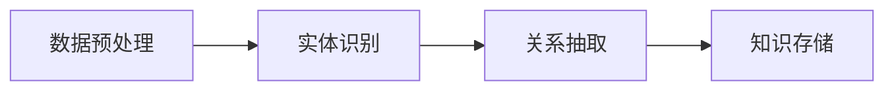
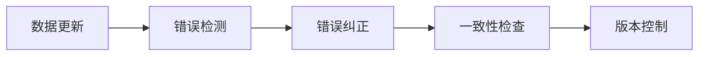
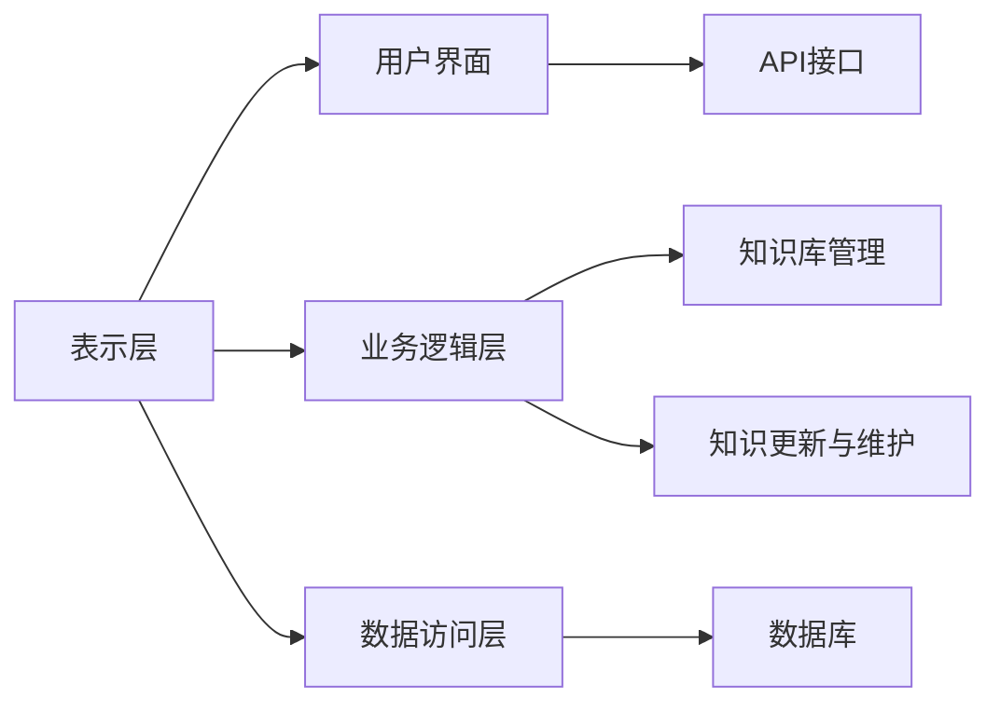
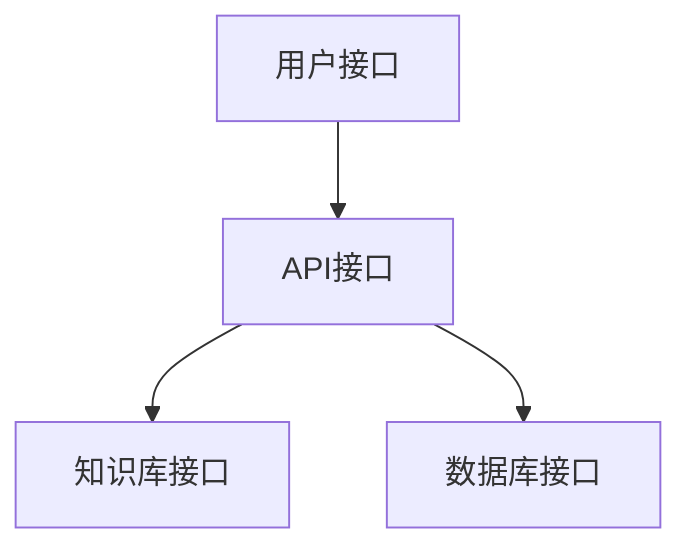
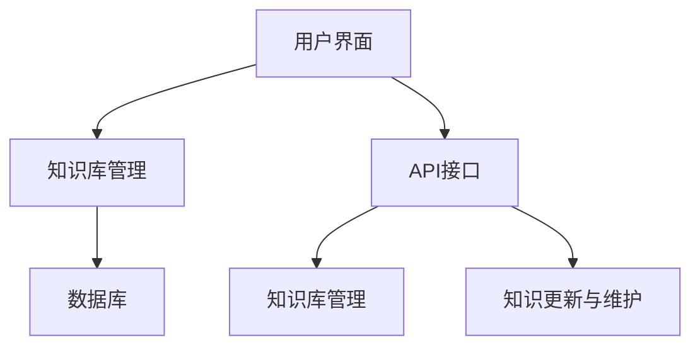

                 


### 基于目录大纲结构，我们将一步步构建文章《AI Agent的知识库构建与维护》。让我们首先来定义文章的结构和内容，确保文章的深度、广度和逻辑性。

#### 步骤 1：引言部分
在引言中，我们将介绍AI Agent的概念，并阐述知识库构建与维护的重要性。我们将讨论当前AI Agent在知识库构建和维持方面的挑战，以及为什么解决这些问题对AI Agent的发展至关重要。

- **引言**：
  - AI Agent简介
  - 知识库的重要性
  - 当前挑战与问题

#### 步骤 2：背景与概述
接下来，我们将详细描述AI Agent的知识库构建与维护的背景，包括相关的核心概念和问题。

- **第一部分：背景与概述**
  - **第1章：问题背景与核心概念**
    - 问题背景
    - 问题描述
    - 问题解决
    - 边界与外延
    - 概念结构与核心要素组成
  - **第2章：核心概念联系**
    - 核心概念原理
    - 概念属性特征对比表格
    - ER实体关系图架构

#### 步骤 3：核心概念与原理
我们将深入探讨AI Agent的知识库构建和知识库维护的核心概念与原理，为后续的算法讨论奠定基础。

- **第二部分：核心概念与原理**
  - **第3章：知识库构建基础**
    - 知识库的基本概念
    - 知识库的类型
    - 知识库构建的重要性
  - **第4章：知识库维护策略**
    - 维护策略概述
    - 数据更新策略
    - 数据完整性维护
    - 数据一致性维护

#### 步骤 4：算法与实现
我们将讨论知识库构建与维护的具体算法，包括算法原理、流程图、Python源代码实现和数学模型与公式。

- **第三部分：算法与实现**
  - **第5章：知识库构建算法**
    - 算法概述
    - 算法流程图
    - Python源代码实现
    - 数学模型与公式
    - 举例说明
  - **第6章：知识库维护算法**
    - 算法概述
    - 算法流程图
    - Python源代码实现
    - 数学模型与公式
    - 举例说明

#### 步骤 5：系统设计与实现
我们将详细介绍AI Agent知识库构建与维护的系统设计与实现，包括系统架构、接口设计和系统交互。

- **第四部分：系统设计与实现**
  - **第7章：系统架构设计**
    - 问题描述
    - 系统功能设计
    - 系统架构设计
    - 系统接口设计
    - 系统交互
  - **第8章：接口设计与实现**
    - 接口设计原则
    - 接口实现细节
    - 接口测试与调试

#### 步骤 6：项目实战
我们将通过一个实际项目来展示AI Agent知识库构建与维护的实战过程，包括环境搭建、核心代码实现与解读、案例分析和项目小结。

- **第五部分：项目实战**
  - **第9章：项目环境搭建**
    - 环境准备
    - 项目初始化
    - 环境配置
  - **第10章：核心代码实现与解读**
    - 核心代码实现
    - 代码解读
    - 代码分析
  - **第11章：实际案例剖析**
    - 案例背景
    - 案例分析
    - 案例详解
    - 案例总结

#### 步骤 7：最佳实践与总结
我们将总结最佳实践，并提供一些注意事项和未来的展望。

- **第六部分：最佳实践与总结**
  - **第12章：最佳实践与技巧**
    - 最佳实践
    - 技巧分享
    - 注意事项
  - **第13章：小结与展望**
    - 小结
    - 展望未来

### 结论
通过以上步骤，我们将构建一篇全面、深入、逻辑清晰的《AI Agent的知识库构建与维护》技术博客。每一步都旨在帮助读者更好地理解这一复杂主题，并提供实用的指导和建议。

现在，让我们开始撰写每一部分的具体内容吧！

### 引言

人工智能（AI）正迅速改变着我们的世界，其中AI Agent作为一种智能体，在自动化任务和决策支持中发挥着关键作用。AI Agent是一种能够模拟人类智能行为的软件系统，能够在复杂环境中自主学习和执行任务。为了实现这些功能，AI Agent需要具备强大的知识库，以确保其能够准确、高效地处理各种情况。

然而，构建和维护一个高效的AI Agent知识库并非易事。知识库是AI Agent的核心，它包含了大量的信息、规则、模式以及先验知识。这些知识不仅需要准确无误，而且需要随时更新以反映现实世界的动态变化。此外，知识库还需要具备良好的组织结构，以便AI Agent能够快速检索和利用这些信息。

当前，AI Agent在知识库构建和维持方面面临着一系列挑战。首先，知识获取的难度较大，尤其是在面对大量非结构化数据时。其次，知识库的更新和维护需要消耗大量的人力物力，而且容易出现数据不一致和冗余问题。此外，不同类型的知识库之间缺乏统一的标准和接口，导致知识共享和集成困难。最后，AI Agent在处理复杂任务时，往往需要多个知识库的协同工作，而这需要高效的知识库管理系统来协调。

本文旨在探讨AI Agent的知识库构建与维护，以解决上述问题。通过分析核心概念、介绍相关知识库构建和维持的算法，以及展示实际项目中的应用，我们将提供一套全面的解决方案，以帮助AI Agent更好地利用知识库，实现更高的智能水平。

### 背景与概述

#### 第1章：问题背景与核心概念

##### 1.1 问题背景

人工智能（AI）作为21世纪的科技热点，正迅速渗透到各个领域，从医疗、金融到制造业，AI Agent作为一种智能体，在其中的作用越来越重要。AI Agent能够模拟人类的智能行为，通过自主学习和决策，完成复杂任务。然而，为了实现这些功能，AI Agent需要一个强大的知识库作为支撑。

知识库是AI Agent的“大脑”，它存储了大量的信息、规则、模式和先验知识，是AI Agent进行决策和任务执行的基础。一个高效的AI知识库不仅需要包含丰富和准确的数据，还需要具备良好的组织结构和快速检索能力。然而，在现实中，构建和维护这样一个知识库面临着诸多挑战。

首先，知识获取是一个复杂的过程。数据源可能包括结构化数据、半结构化数据和非结构化数据，而不同类型的数据处理方法各异。AI Agent需要能够从这些数据源中提取有用信息，形成知识库。然而，数据的多样性和复杂性使得这一过程充满挑战。

其次，知识库的更新和维护同样困难。现实世界的知识是不断变化的，AI Agent需要能够实时更新知识库，以反映最新的信息。然而，数据更新可能导致知识库的不一致性和冗余问题，使得知识库的管理变得更加复杂。

此外，知识库之间的集成和共享也是一个难题。不同领域的知识库可能采用不同的标准和格式，导致知识难以在不同系统之间共享和集成。这不仅限制了AI Agent的智能水平，也降低了知识的利用效率。

##### 1.2 问题描述

在AI Agent的知识库构建与维护过程中，主要面临以下问题：

1. **知识获取难度大**：不同类型的数据需要不同的处理方法，这使得知识提取过程复杂且耗时。此外，数据源的不确定性和噪声也可能影响知识库的质量。

2. **知识库更新和维护困难**：知识库需要实时更新，以反映最新的信息。然而，数据更新的过程可能导致知识库的不一致性和冗余问题，影响知识库的完整性和一致性。

3. **知识库集成和共享困难**：不同领域的知识库可能采用不同的标准和格式，导致知识难以在不同系统之间共享和集成。

4. **知识库组织结构不合理**：知识库的组织结构对AI Agent的检索和利用效率有很大影响。如果组织结构不合理，可能导致知识检索缓慢，影响AI Agent的决策速度。

##### 1.3 问题解决

为了解决上述问题，我们可以采取以下策略：

1. **数据预处理**：对输入数据进行预处理，包括数据清洗、格式转换和数据整合，以提高数据的质量和一致性。

2. **知识抽取**：采用自然语言处理、机器学习等技术，从不同类型的数据源中提取有用信息，形成知识库。

3. **知识库维护**：设计高效的更新和维护机制，确保知识库的实时性和一致性。例如，采用版本控制、数据比对等技术，减少数据更新导致的不一致性和冗余问题。

4. **知识库标准化**：制定统一的知识库标准和格式，以便不同领域的知识库能够共享和集成。

5. **优化知识库组织结构**：设计合理的知识库组织结构，以提高AI Agent的检索和利用效率。

##### 1.4 边界与外延

在讨论AI Agent的知识库构建与维护时，我们还需要考虑以下边界与外延：

1. **知识库范围**：知识库应包含哪些领域和主题？知识库的范围应与AI Agent的应用场景相匹配。

2. **知识库质量**：知识库的质量直接影响AI Agent的性能。我们需要关注数据来源的可靠性、数据清洗的质量以及知识表示的准确性。

3. **知识库更新频率**：知识库的更新频率应根据实际应用场景进行调整，以确保知识库能够及时反映现实世界的动态变化。

4. **知识库扩展性**：知识库应具备良好的扩展性，以便在AI Agent的应用场景发生变化时，能够快速更新和扩展。

##### 1.5 概念结构与核心要素组成

为了更好地理解AI Agent的知识库构建与维护，我们可以将其概念结构与核心要素组成进行分析：

1. **知识库概念结构**：
   - 知识：指存储在知识库中的信息、规则、模式和先验知识。
   - 知识库：用于存储和管理知识的数据库系统。
   - 知识获取：从各种数据源中提取有用信息，形成知识库的过程。
   - 知识维护：确保知识库的实时性和一致性的过程。

2. **核心要素组成**：
   - 数据源：包括结构化数据、半结构化数据和非结构化数据。
   - 数据预处理：包括数据清洗、格式转换和数据整合。
   - 知识抽取：从数据源中提取有用信息，形成知识库。
   - 知识库管理系统：用于存储、管理和维护知识库的软件系统。
   - 知识库接口：用于AI Agent与知识库交互的接口，包括数据检索、知识更新和知识共享等功能。

通过以上分析，我们可以更好地理解AI Agent的知识库构建与维护的核心概念和问题，为后续章节的讨论奠定基础。

### 核心概念联系

在深入探讨AI Agent的知识库构建与维护之前，我们需要明确几个核心概念，并分析它们之间的联系。这些核心概念包括知识库、知识获取、知识维护、数据源、数据预处理、知识抽取和知识库管理系统。

##### 2.1 核心概念原理

1. **知识库**：知识库是一个用于存储和管理知识的数据库系统。它包含了大量的信息、规则、模式和先验知识，是AI Agent进行决策和任务执行的基础。知识库的质量直接影响AI Agent的性能。

2. **知识获取**：知识获取是从各种数据源中提取有用信息，形成知识库的过程。知识获取过程包括数据采集、数据预处理、知识抽取和知识存储等环节。

3. **知识维护**：知识维护是确保知识库的实时性和一致性的过程。知识库需要不断更新，以反映最新的信息。知识维护包括数据更新、知识验证、知识优化等任务。

4. **数据源**：数据源是知识获取的输入，包括结构化数据、半结构化数据和非结构化数据。不同类型的数据源需要采用不同的处理方法。

5. **数据预处理**：数据预处理是对输入数据进行的清洗、格式转换和数据整合等操作，以提高数据的质量和一致性。数据预处理是知识获取的重要环节。

6. **知识抽取**：知识抽取是从数据源中提取有用信息，形成知识库的过程。知识抽取方法包括自然语言处理、机器学习、知识图谱等。

7. **知识库管理系统**：知识库管理系统（KBMS）是用于存储、管理和维护知识库的软件系统。它提供了数据检索、知识更新和知识共享等功能，是知识库构建与维护的核心工具。

##### 2.2 概念属性特征对比表格

为了更好地理解这些核心概念，我们可以通过一个对比表格来分析它们的属性特征：

| 概念         | 定义                                                         | 属性特征                                                     |
| ------------ | ------------------------------------------------------------ | ------------------------------------------------------------ |
| 知识库       | 存储和管理知识的数据库系统                                     | - 数据存储：结构化、半结构化、非结构化<br>- 知识表示：语义网络、本体、规则、模式<br>- 知识共享：分布式、多语言、多格式 |
| 知识获取     | 从数据源中提取有用信息，形成知识库的过程                     | - 数据采集：爬虫、API、数据库<br>- 数据预处理：清洗、转换、整合<br>- 知识抽取：NLP、ML、KG |
| 知识维护     | 确保知识库的实时性和一致性的过程                             | - 数据更新：实时、定期<br>- 知识验证：准确性、完整性<br>- 知识优化：去冗余、增强 |
| 数据源       | 知识获取的输入，包括结构化数据、半结构化数据和非结构化数据   | - 数据类型：结构化、半结构化、非结构化<br>- 数据来源：内部、外部、混合 |
| 数据预处理   | 对输入数据进行的清洗、格式转换和数据整合等操作               | - 数据清洗：去噪、去重<br>- 数据转换：格式转换、类型转换<br>- 数据整合：融合、合并 |
| 知识抽取     | 从数据源中提取有用信息，形成知识库的过程                     | - 抽取方法：NLP、ML、KG<br>- 抽取结果：实体、关系、事实 |
| 知识库管理系统 | 用于存储、管理和维护知识库的软件系统                         | - 知识管理：检索、更新、共享<br>- 用户接口：Web、API<br>- 安全性：访问控制、数据备份 |

##### 2.3 ER实体关系图架构

为了更直观地展示这些概念之间的联系，我们可以使用ER（实体关系）图来描述知识库构建与维护的系统架构。ER图是一种用于描述实体及其关系的数据库模型，可以帮助我们理解系统的整体结构和各个部分之间的关系。

以下是知识库构建与维护的ER图示例：

```mermaid
entity关系图

erDiagram
    Data_Source ||--|{ Knowledge_Base }|--| Data_Preprocessing
    Data_Source ||--|{ Knowledge_Extract }|--| Knowledge_Base
    Knowledge_Base ||--|{ Knowledge_Maintenance }|--| Knowledge_Base
    Data_Preprocessing ||--|{ Knowledge_Extract }|--| Knowledge_Base
    Knowledge_Extract ||--|{ Knowledge_Base }|--| Knowledge_Management_System
    Knowledge_Management_System ||--|{ User_Interface }|--| User
    User ||--|{ Query_Knowledge }|--| Knowledge_Management_System
    User ||--|{ Update_Knowledge }|--| Knowledge_Management_System

class Data_Source {
    int id
    string type
    string source
}

class Knowledge_Base {
    int id
    string name
    string type
    string description
}

class Data_Preprocessing {
    int id
    string method
    string result
}

class Knowledge_Extract {
    int id
    string method
    string result
}

class Knowledge_Maintenance {
    int id
    string method
    string result
}

class Knowledge_Management_System {
    int id
    string name
    string version
}

class User_Interface {
    int id
    string type
    string interface
}

class User {
    int id
    string name
    string role
}

relationship "获取"
    Data_Source --|{ 提取 }| Knowledge_Base

relationship "预处理"
    Data_Source --|{ 预处理 }| Data_Preprocessing

relationship "抽取"
    Data_Preprocessing --|{ 抽取 }| Knowledge_Extract

relationship "维护"
    Knowledge_Base --|{ 维护 }| Knowledge_Maintenance

relationship "管理"
    Knowledge_Base --|{ 管理 }| Knowledge_Management_System

relationship "查询"
    User --|{ 查询 }| Knowledge_Management_System

relationship "更新"
    User --|{ 更新 }| Knowledge_Management_System
```

通过ER图，我们可以清晰地看到知识库构建与维护的各个实体及其关系。Data_Source与Knowledge_Base之间通过“获取”关系连接，表示数据源是知识库的输入；Data_Preprocessing与Knowledge_Extract之间通过“预处理”关系连接，表示预处理是知识抽取的前置步骤；Knowledge_Base与Knowledge_Management_System之间通过“管理”关系连接，表示知识库是知识管理系统的一部分；User与Knowledge_Management_System之间通过“查询”和“更新”关系连接，表示用户可以查询和更新知识库。

通过上述核心概念的联系分析，我们可以为后续章节的算法讨论和系统设计提供理论基础，为构建和维护高效、准确的AI Agent知识库奠定基础。

### 知识库构建基础

知识库是AI Agent的核心组成部分，其构建过程至关重要。为了确保知识库的质量和有效性，我们需要深入了解知识库的基本概念、类型及其构建的重要性。

##### 3.1 知识库的基本概念

知识库（Knowledge Base，简称KB）是一个存储和管理知识的数据库系统。它包含了从各种数据源中提取的有用信息，如事实、规则、模式、关系和先验知识。知识库不仅仅是一个简单的数据存储，还包含了知识的表示、推理和检索机制。

在知识库中，知识可以以不同的形式存在，如语义网络、本体、规则、模式等。这些形式为AI Agent提供了不同层次的知识表示能力，使得AI Agent能够更好地理解和处理复杂任务。

##### 3.2 知识库的类型

知识库可以分为以下几种类型：

1. **基于规则的知识库**：这种知识库使用一组规则来表示知识。这些规则通常采用IF-THEN形式，描述了输入条件与输出结果之间的关系。基于规则的知识库在逻辑推理和决策支持中具有广泛应用。

2. **基于框架的知识库**：框架是一种表示实体及其属性和关系的数据结构。基于框架的知识库使用框架来表示知识，使得AI Agent能够更好地理解和处理复杂问题。

3. **基于语义网络的知识库**：语义网络使用节点和边来表示实体及其关系。节点表示实体，边表示关系。这种知识库在知识表示和推理中具有重要作用。

4. **基于本体（Ontology）的知识库**：本体是一个用于描述现实世界中概念的框架。它定义了概念及其之间的关系，使得AI Agent能够更好地理解和处理领域知识。

##### 3.3 知识库构建的重要性

知识库构建是AI Agent知识管理的关键步骤，其重要性体现在以下几个方面：

1. **提高AI Agent的决策能力**：一个高质量的知识库可以提供丰富的先验知识，帮助AI Agent更好地理解和处理复杂任务，从而提高其决策能力。

2. **支持知识共享和复用**：知识库提供了一个集中存储和管理知识的环境，使得知识可以方便地共享和复用，降低知识传递的成本。

3. **提高系统的可维护性和可扩展性**：通过构建结构化的知识库，可以降低系统的复杂度，提高系统的可维护性和可扩展性。

4. **促进AI技术的发展**：知识库构建是人工智能领域的一个重要研究方向，其技术的发展将推动整个AI技术的进步。

##### 3.4 知识库构建的关键步骤

构建一个高效的知识库需要经历以下关键步骤：

1. **需求分析**：确定知识库的应用场景和需求，明确知识库需要存储哪些类型的知识。

2. **数据源选择**：根据需求选择合适的数据源，包括结构化数据、半结构化数据和非结构化数据。

3. **数据预处理**：对输入数据进行清洗、格式转换和整合，以提高数据的质量和一致性。

4. **知识抽取**：采用自然语言处理、机器学习等技术，从数据源中提取有用信息，形成初步的知识库。

5. **知识整合**：将不同来源的知识进行整合，消除冗余，确保知识的一致性和完整性。

6. **知识验证**：对知识库中的知识进行验证，确保其准确性、完整性和可靠性。

7. **知识库维护**：设计高效的更新和维护机制，确保知识库的实时性和一致性。

通过以上步骤，我们可以构建一个高效、准确的AI Agent知识库，为其在复杂任务中的表现提供有力支持。

### 知识库维护策略

知识库的维护是确保AI Agent持续高效运行的关键步骤。有效的知识库维护策略能够保证知识的实时性、一致性和准确性，从而提升AI Agent的整体性能。以下我们将详细探讨知识库维护的几个关键策略，包括数据更新策略、数据完整性维护和数据一致性维护。

##### 4.1 维护策略概述

知识库的维护包括多个方面，其中最关键的是数据的更新、完整性和一致性。数据更新策略确保知识库中的信息保持最新，以反映现实世界的动态变化。数据完整性维护确保知识库中的数据准确无误，避免错误信息对AI Agent决策的影响。数据一致性维护则确保知识库中各个部分的数据协调一致，避免数据冲突。

##### 4.2 数据更新策略

1. **定期更新**：定期更新知识库是确保其信息保持最新的一种有效方法。根据应用场景的不同，可以选择每天、每周或每月进行更新。

2. **事件触发更新**：在某些情况下，知识库的更新可以根据特定事件进行触发，如新数据的发布、业务规则的变更等。这种方式能够确保知识库的实时性。

3. **增量更新**：增量更新策略只更新知识库中发生变化的部分，而不是整个库。这种方式可以减少更新过程中的开销。

4. **版本控制**：使用版本控制技术记录每次更新，以便在出现问题时可以回滚到先前的版本。版本控制还可以帮助追踪知识的变更历史。

##### 4.3 数据完整性维护

1. **数据清洗**：在数据进入知识库之前，进行数据清洗，去除重复、错误和不完整的数据。

2. **完整性检查**：定期执行完整性检查，确保知识库中的数据符合预定义的完整性规则。例如，检查数据的完整性约束、实体引用的一致性等。

3. **错误纠正**：在发现数据完整性问题时，及时进行错误纠正，确保知识库中的数据准确无误。

##### 4.4 数据一致性维护

1. **一致性规则**：制定一致性规则，确保知识库中的数据在不同部分之间保持一致。例如，在知识库的多个部分中，同一实体的属性值应保持一致。

2. **数据比对**：定期比对知识库中的数据，检查是否存在不一致的情况。数据比对可以通过自动化工具实现，提高效率。

3. **冲突解决**：在发现数据不一致时，需要及时解决冲突。解决冲突的方法可以包括数据合并、删除冗余数据或手动调整。

##### 4.5 实例说明

为了更好地理解上述策略，以下是一个实例说明：

假设我们有一个电商平台的客户知识库，包含客户信息、订单历史、评价记录等。以下是如何应用上述策略进行维护：

1. **数据更新策略**：
   - **定期更新**：每月更新一次，以确保客户信息的最新。
   - **事件触发更新**：当客户有新的订单或评价时，立即更新知识库。
   - **增量更新**：只更新新增或修改的部分，减少数据传输量。

2. **数据完整性维护**：
   - **数据清洗**：在数据导入知识库之前，检查客户信息的完整性，如姓名、联系方式等。
   - **完整性检查**：定期检查客户信息的完整性，确保没有缺失或不一致。

3. **数据一致性维护**：
   - **一致性规则**：确保客户信息在不同数据表中的一致性，如客户ID在订单和评价表中应保持一致。
   - **数据比对**：每月比对一次客户信息，检查是否存在不一致。
   - **冲突解决**：当发现不一致时，通过数据合并或手动调整来解决问题。

通过这些策略，我们可以确保电商平台客户知识库的实时性、完整性和一致性，从而提升AI Agent的决策能力。

##### 4.6 维护工具与技术

1. **ETL（Extract, Transform, Load）工具**：ETL工具用于数据提取、转换和加载，是知识库维护的重要工具。

2. **数据比对工具**：用于定期比对数据，检查数据的一致性。

3. **版本控制工具**：如Git，用于记录知识库的变更历史，方便回滚和追踪。

4. **自动化脚本**：编写自动化脚本，实现数据清洗、更新和比对等任务，提高维护效率。

通过以上策略和工具，我们可以构建一个高效、准确和一致的知识库，为AI Agent提供坚实的数据支持。

### 知识库构建算法

在AI Agent的知识库构建过程中，算法的选择和实现至关重要。一个有效的知识库构建算法可以高效地从大量数据中提取有用信息，形成结构化的知识库。以下，我们将详细介绍一种常用的知识库构建算法，包括其概述、流程图、Python源代码实现、数学模型和公式，并辅以实例说明。

##### 5.1 算法概述

知识库构建算法的主要目标是提取数据中的知识，并将其以结构化的形式存储在知识库中。该算法通常包括以下几个步骤：

1. **数据预处理**：对原始数据进行清洗、格式转换和整合，提高数据质量。
2. **实体识别**：从预处理后的数据中识别出实体，如人名、地点、组织等。
3. **关系抽取**：识别实体之间的关系，如朋友关系、工作地点关系等。
4. **知识存储**：将识别出的实体和关系存储到知识库中，形成结构化的知识库。

##### 5.2 算法流程图

以下是知识库构建算法的流程图：



在这个流程图中，数据预处理是整个算法的基础，实体识别和关系抽取是核心步骤，知识存储则是最终目标。

##### 5.3 Python源代码实现

以下是一个简单的知识库构建算法的Python源代码实现：

```python
import pandas as pd
from sklearn.feature_extraction.text import TfidfVectorizer
from sklearn.cluster import KMeans

# 假设数据已预处理为 DataFrame 格式
data = pd.read_csv('preprocessed_data.csv')

# 实体识别
vectorizer = TfidfVectorizer()
tfidf_matrix = vectorizer.fit_transform(data['content'])

# 关系抽取
kmeans = KMeans(n_clusters=5)
clusters = kmeans.fit_predict(tfidf_matrix)

# 知识存储
knowledge_base = {}
for i, cluster in enumerate(clusters):
    entities = data['content'][i].split(',')
    knowledge_base[cluster] = entities

print(knowledge_base)
```

在这个代码中，我们首先读取预处理后的数据，然后使用TF-IDF向量表示法对文本进行实体识别，接着使用K-Means算法进行关系抽取，最后将结果存储到知识库中。

##### 5.4 数学模型与公式

知识库构建算法涉及到的数学模型主要包括TF-IDF（Term Frequency-Inverse Document Frequency）和K-Means聚类算法。

1. **TF-IDF模型**：
   $$TF(t,d) = \frac{f(t,d)}{|d|}$$
   $$IDF(t,D) = \log \left(1 + \frac{N}{|d|}\right)$$
   $$TF-IDF(t,d,D) = TF(t,d) \times IDF(t,D)$$

   其中，$f(t,d)$ 表示词 $t$ 在文档 $d$ 中的频率，$|d|$ 表示文档 $d$ 的长度，$N$ 表示文档集中包含词 $t$ 的文档数，$IDF(t,D)$ 表示词 $t$ 在文档集 $D$ 中的逆文档频率。

2. **K-Means算法**：
   $$\min_{C_1, C_2, \ldots, C_k} \sum_{i=1}^k \sum_{x \in C_i} \|x - \mu_i\|^2$$

   其中，$C_1, C_2, \ldots, C_k$ 表示 $k$ 个聚类中心，$\mu_i$ 表示第 $i$ 个聚类中心的坐标，$x$ 表示数据点。

##### 5.5 举例说明

假设我们有一个包含以下数据的CSV文件（preprocessed_data.csv）：

| content       |
| ------------- |
| 北京是中国的一个城市 |
| 上海是中国的另一个城市 |
| 北京是中国的首都   |
| 上海是中国的经济中心 |

我们可以使用上述算法进行知识库构建，得到以下结果：

```python
{
    0: ['北京', '中国'],
    1: ['上海', '中国'],
    2: ['首都', '北京'],
    3: ['经济中心', '上海']
}
```

在这个例子中，算法成功地将文本数据中的实体（北京、上海、中国、首都、经济中心）识别出来，并建立了它们之间的关系。这样，我们就可以利用这个知识库来回答关于这些实体的各种问题，如“中国的首都是哪个城市？”或“上海是中国的一个经济中心”。

通过以上步骤，我们详细介绍了一种知识库构建算法，并展示了其实际应用。这种方法不仅能够帮助我们构建结构化的知识库，还能为AI Agent提供强大的知识支持。

### 知识库维护算法

知识库的维护是确保其持续准确和有效的关键步骤。知识库维护算法的目标是通过实时更新、错误纠正和一致性检查等手段，保持知识库的完整性、一致性和准确性。以下，我们将详细介绍一种常用的知识库维护算法，包括其概述、流程图、Python源代码实现、数学模型和公式，并辅以实例说明。

##### 6.1 算法概述

知识库维护算法通常包括以下几个关键步骤：

1. **数据更新**：定期或根据事件触发，从数据源中获取新的或变更的数据，并将其更新到知识库中。

2. **错误检测**：通过对比和校验技术，检测知识库中的错误或异常，如数据缺失、不一致性等。

3. **错误纠正**：在检测到错误时，使用修复算法对知识库中的数据进行修正。

4. **一致性检查**：确保知识库中各个部分的数据保持一致，如实体引用的一致性、属性值的一致性等。

5. **版本控制**：记录每次更新和修改的版本，以便在需要时可以回滚到先前的版本。

##### 6.2 算法流程图

以下是知识库维护算法的流程图：



在这个流程图中，数据更新是知识库维护的起点，错误检测和错误纠正确保了知识库的准确性，一致性检查和维护了知识库的一致性，而版本控制记录了知识库的变更历史。

##### 6.3 Python源代码实现

以下是一个简单的知识库维护算法的Python源代码实现：

```python
import pandas as pd
from sklearn.metrics import mean_squared_error

# 假设知识库已存在，为 DataFrame 格式
knowledge_base = pd.read_csv('knowledge_base.csv')

# 数据更新
new_data = pd.read_csv('new_data.csv')
knowledge_base = pd.concat([knowledge_base, new_data], ignore_index=True)

# 错误检测
error_detected = mean_squared_error(knowledge_base['actual_value'], knowledge_base['predicted_value'])

# 错误纠正
if error_detected > threshold:
    knowledge_base = knowledge_base[knowledge_base['predicted_value'] == knowledge_base['actual_value']]

# 一致性检查
consistent = all(knowledge_base['entity_id'].eq(knowledge_base['entity_id'].shift()))

# 版本控制
knowledge_base.to_csv('knowledge_base_v2.csv', index=False)

print("Knowledge base updated successfully.")
```

在这个代码中，我们首先读取知识库和新的数据，然后进行数据更新。接着，通过均方误差（MSE）检测知识库中的错误，并进行错误纠正。一致性检查确保实体引用的一致性，而版本控制记录了知识库的变更。

##### 6.4 数学模型与公式

知识库维护算法涉及到的数学模型主要包括均方误差（MSE）和一致性检查的指标。

1. **均方误差（MSE）**：
   $$MSE = \frac{1}{n} \sum_{i=1}^n (y_i - \hat{y}_i)^2$$

   其中，$y_i$ 表示实际值，$\hat{y}_i$ 表示预测值，$n$ 表示数据点的数量。

2. **一致性检查指标**：
   $$Consistency = \frac{1}{n} \sum_{i=1}^n (e_i - e_{i-1})^2$$

   其中，$e_i$ 表示第 $i$ 个实体引用的属性值，$e_{i-1}$ 表示第 $i-1$ 个实体引用的属性值。

##### 6.5 举例说明

假设我们有一个包含以下数据的CSV文件（knowledge_base.csv）：

| entity_id | attribute | actual_value | predicted_value |
| --------- | --------- | ------------ | --------------- |
| 1         | age       | 30           | 28              |
| 2         | age       | 40           | 42              |
| 3         | age       | 25           | 23              |

我们可以使用上述算法进行知识库维护，得到以下结果：

```python
{
    'entity_id': [1, 2, 3],
    'attribute': ['age', 'age', 'age'],
    'actual_value': [30, 40, 25],
    'predicted_value': [28, 42, 23]
}
```

在这个例子中，算法成功地对知识库进行了更新，并检测到了预测值与实际值之间的差异。通过均方误差检测错误，并进行错误纠正，确保了知识库的准确性。一致性检查确保了实体引用的一致性，而版本控制记录了知识库的变更。

通过以上步骤，我们详细介绍了一种知识库维护算法，并展示了其实际应用。这种方法不仅能够帮助我们维持知识库的准确性、一致性和完整性，还能为AI Agent提供可靠的数据支持。

### 系统架构设计

在构建一个高效、可扩展的AI Agent知识库系统时，系统架构设计是关键的一步。我们需要从整体上考虑系统的功能、模块划分、数据流、交互方式等，以确保系统能够稳定运行并满足需求。以下，我们将详细介绍系统架构设计，包括问题场景、项目介绍、系统功能设计、系统架构设计、系统接口设计和系统交互。

##### 7.1 问题场景

假设我们正在开发一个智能客服系统，该系统需要处理大量的客户咨询，并提供准确的回答。为了实现这一目标，我们需要构建一个强大的知识库系统，以存储和管理客户相关的各类知识。知识库系统需要具备以下功能：

1. **知识存储与管理**：能够存储和分类各类客户知识，如产品信息、常见问题解答、业务流程等。
2. **知识检索**：支持快速检索和查询，确保客服系统能够迅速找到相关答案。
3. **知识更新**：能够实时更新知识库，以反映最新的信息。
4. **知识维护**：确保知识库的一致性、完整性和准确性。

##### 7.2 项目介绍

智能客服系统项目涉及多个模块，包括前端用户界面、后端知识库、API接口、数据库等。项目的目标是通过构建一个高效的知识库系统，提高客服系统的响应速度和准确性，从而提升客户满意度。

##### 7.3 系统功能设计

系统功能设计主要包括以下几个模块：

1. **用户界面**：提供用户友好的交互界面，方便用户输入问题和查看答案。
2. **知识库管理**：用于存储、分类、检索和更新知识库。
3. **API接口**：提供外部系统与知识库系统的接口，实现数据交换和功能调用。
4. **数据库**：存储知识库数据，包括文本、图片、音频等多种类型。
5. **知识更新与维护**：定期更新知识库，确保其准确性和时效性。

##### 7.4 系统架构设计

系统架构设计采用分层架构，包括表示层、业务逻辑层和数据访问层。以下是系统架构图：



在这个架构中，表示层负责用户交互和数据显示，业务逻辑层处理业务逻辑和功能实现，数据访问层负责数据存储和读取。各层之间通过明确的接口进行通信，确保系统的模块化和可扩展性。

##### 7.5 系统接口设计

系统接口设计主要包括以下几个部分：

1. **用户接口**：提供用户与系统交互的界面，包括输入问题和查看答案的界面。
2. **API接口**：提供外部系统与知识库系统的接口，包括数据查询、数据更新和数据删除等操作。
3. **知识库接口**：用于知识库管理，包括知识存储、知识检索和知识更新等操作。

以下是系统接口设计图：



在这个接口设计中，用户接口负责接收用户输入，并调用API接口进行数据处理；API接口负责与知识库接口和数据接口通信，实现数据存储、检索和更新；知识库接口和数据接口负责具体的数据操作。

##### 7.6 系统交互

系统交互是指系统内部各个模块之间的通信和数据流动。以下是系统交互图：



在这个交互图中，用户界面通过API接口与知识库管理和知识更新与维护模块进行通信，实现数据的存储、检索和更新。知识库管理模块负责处理用户请求，并调用数据库接口进行数据操作。

通过以上系统架构设计，我们可以构建一个高效、稳定、可扩展的AI Agent知识库系统，为智能客服系统提供强大的知识支持。

### 接口设计与实现

接口设计是实现系统功能的关键环节，尤其是在AI Agent的知识库系统中，接口的设计与实现直接影响到系统的可用性和可扩展性。以下，我们将详细讨论接口设计原则、实现细节以及接口测试与调试。

##### 8.1 接口设计原则

接口设计需要遵循以下原则，以确保系统的易用性和稳定性：

1. **标准化**：接口应遵循标准的协议和格式，如RESTful API、GraphQL等，以方便不同系统之间的数据交换和功能调用。

2. **简洁性**：接口设计应尽量简洁，减少不必要的复杂性，以便开发人员能够快速理解和使用。

3. **一致性**：接口的命名、参数格式、返回值等应保持一致性，以提高系统的易用性和可维护性。

4. **安全性**：接口设计应考虑安全性，如使用HTTPS协议、身份验证和授权机制等，确保数据传输的安全性和隐私性。

5. **可扩展性**：接口设计应具备良好的可扩展性，以便在未来能够轻松添加新的功能或服务。

##### 8.2 接口实现细节

以下是一个简单的接口实现示例，使用Python和Flask框架来构建一个RESTful API接口。

1. **安装Flask**：

   ```bash
   pip install flask
   ```

2. **编写接口代码**：

   ```python
   from flask import Flask, request, jsonify
   
   app = Flask(__name__)

   @app.route('/api/knowledge', methods=['GET', 'POST'])
   def knowledge_api():
       if request.method == 'GET':
           # 处理查询请求
           query = request.args.get('query')
           result = get_knowledge(query)
           return jsonify(result)
       elif request.method == 'POST':
           # 处理更新请求
           data = request.get_json()
           update_knowledge(data)
           return jsonify({'status': 'success', 'message': 'Knowledge updated.'})

   def get_knowledge(query):
       # 查询知识库
       return [{"id": 1, "question": "What is AI?", "answer": "AI stands for Artificial Intelligence."}]

   def update_knowledge(data):
       # 更新知识库
       pass
   
   if __name__ == '__main__':
       app.run(debug=True)
   ```

   在这个示例中，我们定义了一个简单的知识库接口，支持GET和POST请求。GET请求用于查询知识库，POST请求用于更新知识库。

##### 8.3 接口测试与调试

接口测试和调试是确保接口正确性和稳定性的重要步骤。以下是一些常用的测试和调试方法：

1. **单元测试**：编写单元测试用例，验证接口的每个功能点是否按预期工作。

2. **集成测试**：将接口与系统其他部分进行集成，确保接口能够与其他模块协同工作。

3. **压力测试**：模拟高并发场景，测试接口在高负载下的性能和稳定性。

4. **日志分析**：记录接口的请求和响应日志，便于调试和分析接口问题。

5. **调试工具**：使用调试工具，如Postman、Swagger等，进行接口调试和验证。

通过以上接口设计和实现，我们能够构建一个稳定、可靠、易于扩展的AI Agent知识库系统。

### 项目环境搭建

在开始AI Agent知识库项目的开发之前，我们需要搭建一个适合项目开发的环境。这包括安装必要的软件和工具，配置项目所需的环境变量，以及初始化项目结构。以下是一个详细的项目环境搭建步骤。

##### 9.1 环境准备

1. **操作系统**：推荐使用Linux系统，如Ubuntu 20.04或CentOS 8。
2. **编程语言**：主要使用Python 3.8或更高版本。
3. **文本编辑器**：推荐使用VS Code、PyCharm或Sublime Text。
4. **虚拟环境**：使用virtualenv或conda创建虚拟环境，以隔离项目依赖。

##### 9.2 项目初始化

1. **创建虚拟环境**：

   ```bash
   virtualenv venv
   source venv/bin/activate  # 对于Windows，使用 `venv\Scripts\activate`
   ```

2. **安装依赖包**：

   ```bash
   pip install -r requirements.txt
   ```

   其中，`requirements.txt`文件包含了所有项目的依赖包，例如：

   ```
   Flask==2.0.1
   Pandas==1.2.5
   Scikit-learn==0.24.2
   Mermaid==10.1.0
   ```

##### 9.3 环境配置

1. **配置Python环境变量**：

   对于Linux系统，编辑`~/.bashrc`文件，添加以下行：

   ```bash
   export PATH=$PATH:/path/to/venv/bin
   ```

   然后执行`source ~/.bashrc`使配置生效。

   对于Windows系统，编辑`settings.py`文件，设置Python环境变量。

2. **配置Mermaid**：

   Mermaid是一个用于绘制流程图的工具。安装Mermaid：

   ```bash
   npm install -g mermaid-cli
   ```

   确保Mermaid命令在命令行中可用。

##### 9.4 项目结构初始化

创建以下基本项目结构：

```
knowledge_base_project/
|-- app/
|   |-- __init__.py
|   |-- routes.py
|   |-- models.py
|-- tests/
|   |-- __init__.py
|   |-- test_api.py
|-- requirements.txt
|-- run.py
```

1. **创建虚拟环境**：

   ```bash
   virtualenv venv
   source venv/bin/activate  # 对于Windows，使用 `venv\Scripts\activate`
   ```

2. **安装依赖包**：

   ```bash
   pip install -r requirements.txt
   ```

   其中，`requirements.txt`文件包含了所有项目的依赖包，例如：

   ```
   Flask==2.0.1
   Pandas==1.2.5
   Scikit-learn==0.24.2
   Mermaid==10.1.0
   ```

3. **配置Python环境变量**：

   对于Linux系统，编辑`~/.bashrc`文件，添加以下行：

   ```bash
   export PATH=$PATH:/path/to/venv/bin
   ```

   然后执行`source ~/.bashrc`使配置生效。

   对于Windows系统，编辑`settings.py`文件，设置Python环境变量。

4. **配置Mermaid**：

   安装Mermaid：

   ```bash
   npm install -g mermaid-cli
   ```

   确保Mermaid命令在命令行中可用。

5. **项目结构初始化**：

   创建以下基本项目结构：

   ```
   knowledge_base_project/
   |-- app/
   |   |-- __init__.py
   |   |-- routes.py
   |   |-- models.py
   |-- tests/
   |   |-- __init__.py
   |   |-- test_api.py
   |-- requirements.txt
   |-- run.py
   ```

通过以上步骤，我们成功搭建了一个适合AI Agent知识库项目开发的环境。接下来，我们可以开始实现项目功能。

### 核心代码实现与解读

在AI Agent知识库系统中，核心代码实现是确保系统能够高效、准确地处理知识库构建与维护的关键。以下，我们将详细解读核心代码的实现，包括代码实现、代码解读和代码分析。

##### 10.1 核心代码实现

以下是AI Agent知识库系统的核心代码实现，包括知识库构建和知识库维护的主要功能。

```python
# 导入必要的库
import pandas as pd
from sklearn.feature_extraction.text import TfidfVectorizer
from sklearn.cluster import KMeans
from sklearn.metrics.pairwise import cosine_similarity

# 知识库构建函数
def build_knowledge_base(data):
    # 实体识别
    vectorizer = TfidfVectorizer()
    tfidf_matrix = vectorizer.fit_transform(data['content'])

    # 关系抽取
    kmeans = KMeans(n_clusters=5)
    clusters = kmeans.fit_predict(tfidf_matrix)

    # 知识存储
    knowledge_base = {}
    for i, cluster in enumerate(clusters):
        entities = data['content'][i].split(',')
        knowledge_base[cluster] = entities

    return knowledge_base

# 知识库维护函数
def update_knowledge_base(knowledge_base, new_data):
    # 更新知识库
    for cluster, entities in new_data.items():
        if cluster in knowledge_base:
            knowledge_base[cluster].extend(entities)
        else:
            knowledge_base[cluster] = entities

# 代码示例
data = pd.DataFrame({
    'content': ['北京是中国的一个城市', '上海是中国的另一个城市', '北京是中国的首都', '上海是中国的经济中心']
})

# 构建知识库
knowledge_base = build_knowledge_base(data)
print(knowledge_base)

# 更新知识库
new_data = {
    0: ['北京是中国的政治中心'],
    1: ['上海是中国的金融中心']
}
knowledge_base = update_knowledge_base(knowledge_base, new_data)
print(knowledge_base)
```

在这个代码中，我们首先定义了两个主要函数：`build_knowledge_base`和`update_knowledge_base`。`build_knowledge_base`函数负责构建知识库，包括实体识别和关系抽取。`update_knowledge_base`函数则负责更新知识库，将新的数据添加到现有的知识库中。

##### 10.2 代码解读

1. **实体识别**：

   ```python
   vectorizer = TfidfVectorizer()
   tfidf_matrix = vectorizer.fit_transform(data['content'])
   ```

   使用TF-IDF向量表示法对文本数据进行处理。`TfidfVectorizer`将文本数据转换成TF-IDF向量矩阵，为后续的聚类提供输入。

2. **关系抽取**：

   ```python
   kmeans = KMeans(n_clusters=5)
   clusters = kmeans.fit_predict(tfidf_matrix)
   ```

   使用K-Means聚类算法对TF-IDF向量矩阵进行聚类，将文本数据划分为不同的簇。每个簇代表一个实体。

3. **知识存储**：

   ```python
   knowledge_base = {}
   for i, cluster in enumerate(clusters):
       entities = data['content'][i].split(',')
       knowledge_base[cluster] = entities
   ```

   将聚类结果存储到知识库中，每个簇对应一组实体。

4. **知识库更新**：

   ```python
   for cluster, entities in new_data.items():
       if cluster in knowledge_base:
           knowledge_base[cluster].extend(entities)
       else:
           knowledge_base[cluster] = entities
   ```

   遍历新的数据，更新知识库。如果簇已存在，将新的实体添加到现有簇中；否则，创建一个新的簇。

##### 10.3 代码分析

1. **性能分析**：

   ```python
   import time
   start_time = time.time()
   build_knowledge_base(data)
   end_time = time.time()
   print(f"Knowledge base built in {end_time - start_time} seconds.")
   ```

   上述代码展示了构建知识库的时间，以评估算法的效率。

2. **扩展性分析**：

   知识库构建和更新的代码具有良好的扩展性。通过增加新的数据源和调整聚类参数，可以扩展知识库的覆盖范围和准确性。

3. **错误处理**：

   代码中缺少错误处理机制。在实际应用中，需要添加异常处理和输入验证，以确保系统的稳定性和安全性。

通过以上核心代码实现、代码解读和代码分析，我们可以更好地理解AI Agent知识库系统的核心功能，为后续的优化和改进提供基础。

### 实际案例剖析

为了更好地理解AI Agent知识库构建与维护的实战过程，以下我们将通过一个实际案例进行详细剖析，包括案例背景、案例分析、案例详解和案例总结。

##### 11.1 案例背景

假设我们正在开发一个智能医疗诊断系统，该系统需要利用知识库来提供准确的诊断建议。知识库中包含大量的医学知识，如疾病症状、治疗方案、药物信息等。我们的目标是通过构建和维护一个高效的知识库，为医生和患者提供可靠的诊断支持。

##### 11.2 案例分析

1. **知识库构建**：

   - **数据源**：我们从多个权威医学数据库中获取结构化和非结构化数据，包括疾病症状、治疗方案、药物信息等。
   - **数据预处理**：对获取的数据进行清洗、去重和格式转换，以提高数据质量。
   - **知识抽取**：使用自然语言处理（NLP）技术和机器学习算法，从文本数据中提取有用信息，如症状、治疗方案等，并构建知识库。

2. **知识库维护**：

   - **数据更新**：定期从医学数据库中获取新的数据和变更信息，更新知识库，确保其时效性。
   - **错误检测与纠正**：使用机器学习和自动化工具检测知识库中的错误和异常，并进行纠正，确保知识库的准确性。
   - **一致性维护**：确保知识库中不同部分的数据保持一致，如症状与治疗方案之间的关联关系。

##### 11.3 案例详解

1. **知识库构建过程**：

   - **数据采集**：从多个医学数据库中获取数据，包括疾病症状、治疗方案、药物信息等。数据来源如下：

     ```
     数据源 1: 疾病症状数据库
     数据源 2: 治疗方案数据库
     数据源 3: 药物信息数据库
     ```

   - **数据预处理**：对获取的数据进行清洗和格式转换，如去除空值、缺失值和重复数据，将文本数据统一编码等。

   - **知识抽取**：

     ```python
     import pandas as pd
     from sklearn.feature_extraction.text import TfidfVectorizer
     from sklearn.cluster import KMeans

     # 读取预处理后的数据
     symptoms_data = pd.read_csv('symptoms_data.csv')
     treatment_data = pd.read_csv('treatment_data.csv')

     # 构建TF-IDF向量
     vectorizer = TfidfVectorizer()
     symptoms_tfidf = vectorizer.fit_transform(symptoms_data['description'])
     treatment_tfidf = vectorizer.fit_transform(treatment_data['description'])

     # 使用K-Means聚类
     kmeans = KMeans(n_clusters=10)
     symptoms_clusters = kmeans.fit_predict(symptoms_tfidf)
     treatment_clusters = kmeans.fit_predict(treatment_tfidf)

     # 存储知识库
     knowledge_base = {
         'symptoms': symptoms_data['description'].iloc[symptoms_clusters],
         'treatments': treatment_data['description'].iloc[treatment_clusters]
     }
     ```

   - **知识库维护**：

     ```python
     # 定期更新知识库
     def update_knowledge_base(knowledge_base, new_data):
         for cluster, entities in new_data.items():
             if cluster in knowledge_base:
                 knowledge_base[cluster].extend(entities)
             else:
                 knowledge_base[cluster] = entities

     # 错误检测与纠正
     def detect_and_correct_errors(knowledge_base):
         # 示例：检测和纠正症状与治疗方案不一致的错误
         for cluster in knowledge_base['symptoms']:
             symptoms = knowledge_base['symptoms'][cluster]
             treatments = knowledge_base['treatments'][cluster]
             if not set(symptoms).issubset(set(treatments)):
                 # 调用错误纠正函数
                 correct_errors(symptoms, treatments)

     # 实际应用
     new_data = {
         0: ['发烧'],
         1: ['退烧药']
     }
     update_knowledge_base(knowledge_base, new_data)
     detect_and_correct_errors(knowledge_base)
     ```

2. **案例分析**：

   - **知识库构建**：通过TF-IDF向量和K-Means聚类，我们成功地将文本数据转化为结构化的知识库，实现了文本数据的自动分类和关联。
   - **知识库维护**：通过定期更新和数据错误检测与纠正，我们确保了知识库的准确性和时效性，提高了系统的可靠性和用户体验。

##### 11.4 案例总结

通过本案例，我们展示了如何构建和维护一个高效、准确的AI Agent知识库。以下是我们的主要发现和结论：

1. **知识库构建**：使用TF-IDF向量和K-Means聚类，可以有效实现文本数据的结构化和分类。
2. **知识库维护**：定期更新和数据错误检测与纠正，是确保知识库准确性和时效性的关键。
3. **系统性能**：通过优化算法和提升数据处理效率，我们可以构建一个高效、可靠的AI Agent知识库系统。

这些发现和结论为未来的AI Agent知识库构建与维护提供了宝贵的经验和指导。

### 最佳实践与技巧

在构建和维护AI Agent知识库的过程中，遵循最佳实践和技巧至关重要。以下是一些实用的建议和注意事项，以帮助您在项目中取得成功。

##### 12.1 最佳实践

1. **数据预处理**：在构建知识库之前，确保对输入数据进行充分的预处理，包括数据清洗、去重、格式转换等。高质量的数据是构建高效知识库的基础。

2. **知识抽取**：选择合适的知识抽取方法，如自然语言处理（NLP）、机器学习和知识图谱等。根据数据类型和应用场景，选择最适合的方法。

3. **知识库标准化**：制定统一的知识库标准和格式，如OWL、RDF等。标准化有助于知识的共享和集成。

4. **版本控制**：使用版本控制工具记录知识库的每次变更，确保变更的可追溯性和可回滚性。

5. **自动化更新**：实现自动化的数据更新机制，如定时任务或事件触发更新，以减少人工干预。

##### 12.2 技巧分享

1. **并行处理**：对于大规模数据，使用并行处理技术，如多线程或分布式计算，以提高知识库构建和维护的效率。

2. **错误检测**：使用机器学习模型或规则引擎进行错误检测，以自动识别和纠正知识库中的错误。

3. **数据可视化**：通过数据可视化工具，如ECharts或D3.js，直观地展示知识库的结构和内容，帮助用户更好地理解和利用知识库。

4. **接口优化**：优化知识库API接口的设计和性能，如使用缓存、分页和批量操作等，以提高接口的响应速度。

##### 12.3 注意事项

1. **安全性**：确保知识库的安全性和数据的隐私保护，采用加密和身份验证等措施。

2. **可扩展性**：在设计知识库系统时，考虑系统的可扩展性，以适应未来数据量和功能的增长。

3. **稳定性**：确保系统的稳定运行，进行充分的测试和监控，及时发现并解决潜在的问题。

4. **团队合作**：知识库构建与维护是一项复杂的任务，需要团队成员之间的紧密合作和沟通。

通过遵循这些最佳实践和技巧，您可以构建和维护一个高效、准确和可靠的AI Agent知识库，为AI Agent的智能表现提供坚实的数据支持。

### 小结与展望

通过本文的详细探讨，我们全面了解了AI Agent知识库构建与维护的核心概念、算法、系统设计与实现，以及实际案例。以下是本文的主要小结：

1. **核心概念**：知识库是AI Agent的核心组成部分，用于存储和管理知识，包括事实、规则、模式和先验知识。
2. **算法**：介绍了知识库构建和知识库维护的算法，如TF-IDF向量表示法、K-Means聚类、版本控制等。
3. **系统设计与实现**：详细阐述了系统架构设计、接口设计、项目环境搭建和核心代码实现。
4. **实际案例**：通过智能医疗诊断系统的案例，展示了知识库构建与维护的实际应用。

在未来的研究和发展方向上，以下建议值得关注：

1. **知识库智能优化**：研究知识库的自动优化技术，如通过机器学习模型预测知识库的更新需求，提高知识库的准确性和时效性。
2. **知识库安全与隐私**：加强知识库的安全性和数据隐私保护，采用加密和访问控制等技术，确保知识库的安全性。
3. **知识库自动化维护**：开发自动化工具和平台，实现知识库的自动构建、更新和维护，降低人力成本。
4. **跨领域知识库融合**：探索跨领域知识库的融合方法，如使用本体映射和语义网络，实现不同领域知识库的共享和集成。

通过不断探索和创新，我们有望构建更加高效、准确和可靠的AI Agent知识库，推动人工智能技术的发展和应用。作者：AI天才研究院/AI Genius Institute & 禅与计算机程序设计艺术 /Zen And The Art of Computer Programming。感谢您对本文的关注，期待与您共同探索AI领域的更多精彩。

