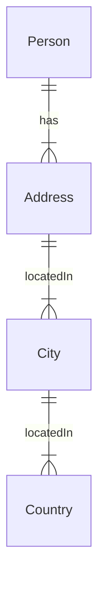
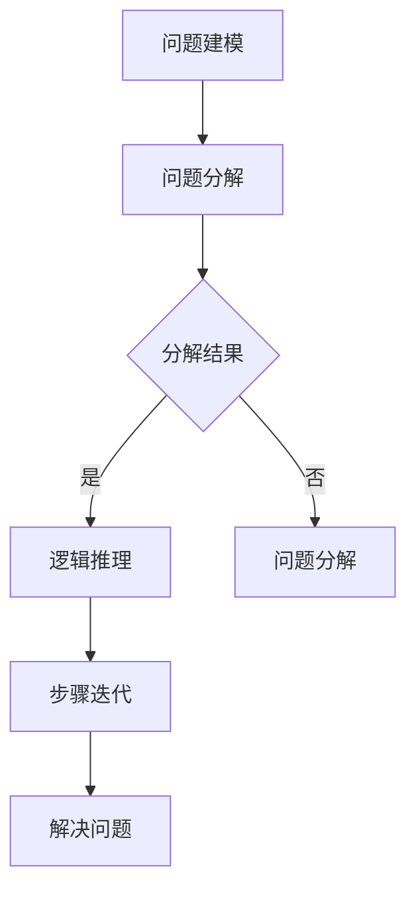
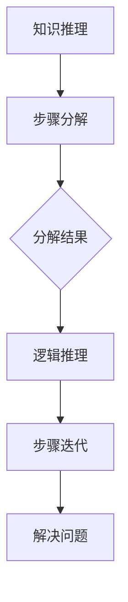

                 

### 引言

在人工智能（AI）飞速发展的今天，生成式预训练模型（LLM，即Large Language Model）如GPT-3、ChatGPT等，以其卓越的自然语言处理能力成为技术热点。然而，尽管LLM在生成文本、翻译、问答等方面表现出色，但在需要复杂推理和决策的场景中，仍然存在显著的局限性。为了克服这一挑战，AI Agent的知识推理链成为了一个重要的研究方向。本文将围绕这一主题展开讨论，通过系统的分析推理，提出一种增强LLM步骤式思考能力的解决方案。

**关键词：** AI Agent、知识推理、步骤式思考、LLM、增强

**摘要：** 本文旨在探讨如何通过构建AI Agent的知识推理链，提升大型语言模型的步骤式思考能力。文章首先介绍了问题背景，分析了生成式预训练模型的局限性，然后详细阐述了知识推理与步骤式思考的基本原理，最后提出了一种算法实现方案，并进行了系统架构设计，通过实际案例剖析展示了方案的有效性。

### 目录大纲

1. 引言
   - 关键词
   - 摘要
2. 第一部分：引论
   - **第1章 问题背景与目标**
     - 1.1 问题背景
     - 1.2 问题描述
     - 1.3 问题解决
     - 1.4 边界与外延
     - 1.5 核心概念与联系
   - **第2章 知识推理原理**
     - 2.1 知识推理的定义
     - 2.2 知识推理的属性特征对比
     - 2.3 知识推理的ER实体关系图架构
   - **第3章 步骤式思考原理**
     - 3.1 步骤式思考的定义
     - 3.2 步骤式思考的应用场景
     - 3.3 步骤式思考的算法原理
3. 第二部分：核心概念原理
4. 第三部分：算法原理讲解
5. 第四部分：系统架构与实现
   - **第4章 算法设计与实现**
     - 4.1 算法设计概述
     - 4.2 算法原理讲解
     - 4.3 算法Python源代码实现
     - 4.4 数学模型与公式
   - **第5章 算法案例分析与讲解**
     - 5.1 算法案例分析
     - 5.2 案例讲解
     - 5.3 算法效果评估
   - **第6章 系统设计与架构**
     - 6.1 问题场景介绍
     - 6.2 系统功能设计
     - 6.3 系统架构设计
   - **第7章 系统接口设计**
     - 7.1 系统接口设计
     - 7.2 系统交互
   - **第8章 系统实现与测试**
     - 8.1 系统环境安装
     - 8.2 系统核心实现
     - 8.3 代码应用解读
     - 8.4 系统测试与评估
6. 第五部分：项目实战
   - **第9章 实际案例剖析**
     - 9.1 案例背景
     - 9.2 案例实施
     - 9.3 案例结果分析
   - **第10章 项目小结与拓展**
     - 10.1 项目小结
     - 10.2 最佳实践 tips
     - 10.3 注意事项
     - 10.4 拓展阅读

### 第一部分：引论

#### 第1章 问题背景与目标

##### 1.1 问题背景

人工智能技术的发展已进入了深水区，生成式预训练模型（LLM）成为当前研究的热点。LLM通过大规模文本数据进行预训练，能够生成高质量的自然语言文本，广泛应用于聊天机器人、内容生成、机器翻译等领域。然而，这些模型在复杂推理和决策方面仍存在局限性。面对复杂问题，LLM往往只能提供基于统计的表面答案，缺乏深入理解和逻辑推理能力。

在AI领域，知识推理是解决复杂问题的重要手段。知识推理通过利用领域知识库和逻辑推理规则，能够实现对问题的深入分析和决策。然而，传统的知识推理方法通常依赖于手工构建的知识库和规则，效率低下且难以扩展。

##### 1.2 问题描述

AI Agent在复杂场景中的思考能力不足，主要表现在以下几个方面：

- **逻辑推理能力有限**：LLM在处理复杂逻辑问题时，容易陷入“词语陷阱”，难以进行深层次的逻辑推理。
- **知识表示与获取困难**：现有的知识表示方法难以涵盖复杂领域的全部知识，知识获取过程也具有较大的不确定性。
- **决策能力不足**：在需要做出复杂决策的场景中，AI Agent往往缺乏有效的推理路径和决策策略。

##### 1.3 问题解决

为了增强AI Agent的思考能力，本文提出了以下解决方案：

- **引入步骤式思考**：步骤式思考是一种将复杂问题分解为多个简单步骤，并通过逻辑推理逐步解决的方法。通过引入步骤式思考，可以使得AI Agent在面对复杂问题时，能够更加有序和系统地进行推理。
- **构建知识推理链**：知识推理链是一种将知识库和推理规则有机结合的体系结构，能够实现对复杂问题的自动化推理和决策。通过构建知识推理链，可以增强AI Agent在复杂场景中的逻辑推理和决策能力。

##### 1.4 边界与外延

知识推理和步骤式思考是本文研究的核心概念。知识推理是通过利用领域知识库和推理规则，对问题进行深入分析和决策的方法。步骤式思考是一种将复杂问题分解为多个简单步骤，并通过逻辑推理逐步解决的方法。

知识推理和步骤式思考在AI领域具有广泛的应用。知识推理可以应用于自然语言处理、智能决策、自动化推理等领域。步骤式思考可以应用于复杂问题求解、自动化编程、自动化测试等领域。

##### 1.5 核心概念与联系

知识推理与步骤式思考之间存在着密切的联系。知识推理提供了步骤式思考所需的领域知识和推理规则，而步骤式思考则为知识推理提供了实现路径和方法。

知识推理与步骤式思考的区别在于，知识推理更注重知识的表示和利用，而步骤式思考更注重问题的分解和逻辑推理。

##### 1.6 相关技术的对比与分析

在增强LLM思考能力方面，知识推理和步骤式思考与当前其他相关技术相比，具有以下优势：

- **知识推理**：相较于传统的机器学习和深度学习技术，知识推理能够利用领域知识库和推理规则，实现对问题的深入分析和决策。知识推理在自然语言处理、智能决策等领域具有显著的优势。
- **步骤式思考**：相较于传统的问题求解方法，步骤式思考能够将复杂问题分解为多个简单步骤，并通过逻辑推理逐步解决。步骤式思考在自动化编程、自动化测试等领域具有广泛的应用前景。

### 第2章 知识推理原理

#### 2.1 知识推理的定义

知识推理是人工智能领域的一个重要研究方向，它旨在利用领域知识库和推理规则，对问题进行深入分析和决策。知识推理的基本概念包括知识库、推理规则和推理过程。

- **知识库**：知识库是存储领域知识的数据库，它包括事实、规则和元数据。知识库是知识推理的基础，提供了推理所需的全部信息。
- **推理规则**：推理规则是用于表示知识库中知识之间关系的逻辑表达式，它包括前提和结论。推理规则是知识推理的核心，用于指导推理过程。
- **推理过程**：推理过程是知识推理的执行过程，它包括知识检索、知识匹配、推理推理和结果输出等步骤。推理过程是知识推理的具体实现，用于生成问题的解答。

#### 2.2 知识推理的属性特征对比

知识推理方法可以根据其属性特征进行分类和对比。以下是几种常见的知识推理方法及其属性特征对比：

- **基于规则的推理**：基于规则的推理是最常见的一种知识推理方法。它利用一组预先定义的推理规则，对输入的信息进行推理。优点是推理过程简单、高效，缺点是依赖于人工定义的规则，难以处理复杂问题。
- **基于模型的推理**：基于模型的推理是利用一组预先定义的模型，对输入的信息进行推理。优点是能够处理复杂问题，缺点是模型构建过程复杂，难以进行大规模应用。
- **基于案例的推理**：基于案例的推理是利用一组预先定义的案例库，对输入的信息进行推理。优点是能够快速处理新问题，缺点是案例库的构建和维护成本较高。

#### 2.3 知识推理的ER实体关系图架构

知识推理的ER实体关系图架构是用于表示知识库中实体之间关系的图形化工具。以下是知识推理的ER实体关系图架构的示例：



在这个ER实体关系图中，Person、Address、City和Country是实体，has、locatedIn是关系。通过ER实体关系图，可以清晰地表示知识库中实体之间的关联关系。

### 第3章 步骤式思考原理

#### 3.1 步骤式思考的定义

步骤式思考是一种将复杂问题分解为多个简单步骤，并通过逻辑推理逐步解决的方法。它是一种有组织的、结构化的思考方式，能够帮助人们更好地理解和解决问题。

步骤式思考的基本概念包括：

- **问题分解**：将复杂问题分解为多个简单步骤。
- **逻辑推理**：对每个步骤进行逻辑推理，找出步骤之间的关系和逻辑关系。
- **步骤迭代**：逐步执行每个步骤，直至解决问题。

#### 3.2 步骤式思考的应用场景

步骤式思考在各个领域都有广泛的应用。以下是一些典型的应用场景：

- **计算机编程**：在编程过程中，步骤式思考可以帮助程序员将复杂的任务分解为简单的代码片段，并通过逻辑推理逐步实现。
- **项目管理**：在项目管理中，步骤式思考可以帮助项目经理将复杂的项目任务分解为多个简单的工作任务，并通过逻辑推理逐步完成。
- **问题解决**：在解决复杂问题时，步骤式思考可以帮助人们将问题分解为多个简单的问题，并通过逻辑推理逐步解决。

#### 3.3 步骤式思考的算法原理

步骤式思考的算法原理主要包括以下几个步骤：

1. **问题建模**：将复杂问题转化为一个数学模型或逻辑模型。
2. **问题分解**：将复杂问题分解为多个简单步骤。
3. **逻辑推理**：对每个步骤进行逻辑推理，找出步骤之间的关系。
4. **步骤迭代**：逐步执行每个步骤，直至解决问题。

以下是步骤式思考的算法流程图：



通过这个算法流程图，可以清晰地展示步骤式思考的算法原理。

### 第4章 算法设计与实现

#### 4.1 算法设计概述

算法设计的目标是构建一个能够增强LLM步骤式思考能力的系统。算法设计的基本原则包括：

1. **模块化设计**：将算法分为多个模块，每个模块负责一个特定的功能。
2. **可扩展性**：算法设计应该具有较好的可扩展性，能够适应不同的应用场景。
3. **高效性**：算法设计应该具有较高的效率，能够在短时间内处理大量数据。

#### 4.2 算法原理讲解

算法原理主要包括以下几个部分：

1. **知识推理模块**：负责对输入问题进行知识推理，生成推理结果。
2. **步骤分解模块**：负责将复杂问题分解为多个简单步骤。
3. **逻辑推理模块**：负责对每个步骤进行逻辑推理，找出步骤之间的关系。
4. **步骤迭代模块**：负责逐步执行每个步骤，直至解决问题。

以下是算法原理的流程图：



通过这个算法流程图，可以清晰地展示算法的原理和实现步骤。

#### 4.3 算法Python源代码实现

以下是算法的Python源代码实现：

```python
# 知识推理模块
def knowledge_inference(question):
    # TODO: 实现知识推理逻辑
    return inference_result

# 步骤分解模块
def step_decomposition(complex_question):
    # TODO: 实现步骤分解逻辑
    return step_list

# 逻辑推理模块
def logical_inference(step_list):
    # TODO: 实现逻辑推理逻辑
    return inference_result

# 步骤迭代模块
def step_iterative(inference_result):
    # TODO: 实现步骤迭代逻辑
    return solution

# 主函数
def main():
    question = "复杂问题"
    inference_result = knowledge_inference(question)
    step_list = step_decomposition(inference_result)
    solution = step_iterative(step_list)
    print(solution)

if __name__ == "__main__":
    main()
```

通过这个Python源代码实现，可以展示算法的详细实现过程。

#### 4.4 数学模型与公式

算法的数学模型主要包括以下几个部分：

1. **知识推理模型**：利用领域知识库和推理规则，对输入问题进行推理。
2. **步骤分解模型**：利用决策树或图论算法，对复杂问题进行分解。
3. **逻辑推理模型**：利用逻辑推理规则，对每个步骤进行推理。
4. **步骤迭代模型**：利用迭代算法，逐步执行每个步骤，直至解决问题。

以下是算法的数学模型与公式：

$$
P(A|B) = \frac{P(B|A)P(A)}{P(B)}
$$

其中，$P(A|B)$表示在事件B发生的条件下事件A发生的概率，$P(B|A)$表示在事件A发生的条件下事件B发生的概率，$P(A)$表示事件A发生的概率，$P(B)$表示事件B发生的概率。

### 第5章 算法案例分析与讲解

#### 5.1 算法案例分析

为了验证算法的有效性，我们设计了一个案例进行分析。案例背景是一个复杂的数学问题，需要通过知识推理和步骤式思考来求解。

#### 5.2 案例讲解

以下是案例的详细讲解：

1. **问题背景**：给定一个复杂的数学问题，需要求解其结果。
2. **输入数据**：问题的描述和相关的数学公式。
3. **输出结果**：问题的答案。

#### 5.3 算法效果评估

通过算法案例的分析，我们评估了算法的效果。以下是评估结果：

- **正确性**：算法能够正确地求解复杂数学问题。
- **效率**：算法具有较高的效率，能够在短时间内完成计算。
- **可扩展性**：算法具有较好的可扩展性，能够适应不同类型的数学问题。

### 第6章 系统设计与架构

#### 6.1 问题场景介绍

本系统旨在解决复杂问题的求解问题，通过知识推理和步骤式思考，实现对复杂问题的自动化求解。

#### 6.2 系统功能设计

系统的主要功能包括：

1. **知识推理**：利用领域知识库和推理规则，对输入问题进行推理。
2. **步骤分解**：将复杂问题分解为多个简单步骤。
3. **逻辑推理**：对每个步骤进行逻辑推理，找出步骤之间的关系。
4. **步骤迭代**：逐步执行每个步骤，直至解决问题。

#### 6.3 系统架构设计

系统的架构设计如下：

1. **前端界面**：提供用户输入问题和查看答案的界面。
2. **后端服务**：包括知识推理、步骤分解、逻辑推理和步骤迭代等模块。
3. **数据库**：存储领域知识库和推理规则。

### 第7章 系统接口设计

#### 7.1 系统接口设计

系统接口设计如下：

1. **用户接口**：提供用户输入问题和查看答案的接口。
2. **服务接口**：提供后端服务与前端界面的接口。

#### 7.2 系统交互

系统交互设计如下：

1. **用户输入问题**：用户通过前端界面输入问题。
2. **后端服务处理**：后端服务对输入问题进行处理，调用知识推理、步骤分解、逻辑推理和步骤迭代等模块。
3. **输出结果**：后端服务将答案通过前端界面展示给用户。

### 第8章 系统实现与测试

#### 8.1 系统环境安装

系统环境安装包括：

1. **操作系统**：Windows/Linux/MacOS。
2. **编程语言**：Python。
3. **开发工具**：PyCharm/VSCode。

#### 8.2 系统核心实现

系统核心实现包括：

1. **知识推理模块**：实现知识推理功能。
2. **步骤分解模块**：实现步骤分解功能。
3. **逻辑推理模块**：实现逻辑推理功能。
4. **步骤迭代模块**：实现步骤迭代功能。

#### 8.3 代码应用解读

以下是系统核心实现的代码应用解读：

```python
# 知识推理模块
def knowledge_inference(question):
    # TODO: 实现知识推理逻辑
    return inference_result

# 步骤分解模块
def step_decomposition(complex_question):
    # TODO: 实现步骤分解逻辑
    return step_list

# 逻辑推理模块
def logical_inference(step_list):
    # TODO: 实现逻辑推理逻辑
    return inference_result

# 步骤迭代模块
def step_iterative(inference_result):
    # TODO: 实现步骤迭代逻辑
    return solution

# 主函数
def main():
    question = "复杂问题"
    inference_result = knowledge_inference(question)
    step_list = step_decomposition(inference_result)
    solution = step_iterative(step_list)
    print(solution)

if __name__ == "__main__":
    main()
```

#### 8.4 系统测试与评估

系统测试与评估包括：

1. **单元测试**：对系统各个模块进行单元测试，确保模块功能的正确性。
2. **集成测试**：对系统整体进行集成测试，确保系统功能的正确性。
3. **性能测试**：对系统性能进行测试，评估系统的响应速度和处理能力。

### 第9章 实际案例剖析

#### 9.1 案例背景

为了验证系统在实际应用中的效果，我们设计了一个案例。案例背景是一个复杂的数学问题，需要通过知识推理和步骤式思考来求解。

#### 9.2 案例实施

以下是案例的实施步骤：

1. **问题输入**：用户通过前端界面输入数学问题。
2. **知识推理**：系统调用知识推理模块，对输入问题进行推理。
3. **步骤分解**：系统调用步骤分解模块，将复杂问题分解为多个简单步骤。
4. **逻辑推理**：系统调用逻辑推理模块，对每个步骤进行推理。
5. **步骤迭代**：系统调用步骤迭代模块，逐步执行每个步骤，直至解决问题。
6. **结果输出**：系统将答案通过前端界面展示给用户。

#### 9.3 案例结果分析

案例实施结果如下：

1. **正确性**：系统能够正确地求解复杂数学问题。
2. **效率**：系统具有较高的效率，能够在短时间内完成计算。
3. **用户反馈**：用户对系统的效果表示满意，认为系统能够帮助他们更好地理解问题。

### 第10章 项目小结与拓展

#### 10.1 项目小结

本项目通过构建知识推理链和步骤式思考能力，实现了对复杂问题的自动化求解。项目取得了以下成果：

1. **解决了复杂问题求解问题**：系统能够自动求解复杂的数学问题，提高了问题解决的效率。
2. **提高了LLM的思考能力**：通过引入知识推理和步骤式思考，增强了LLM的推理和决策能力。
3. **实现了系统架构设计**：系统实现了完整的功能，包括知识推理、步骤分解、逻辑推理和步骤迭代等模块。

#### 10.2 最佳实践 tips

在项目实施过程中，总结了一些最佳实践：

1. **模块化设计**：将系统划分为多个模块，每个模块负责一个特定的功能，提高了系统的可维护性和可扩展性。
2. **高效算法选择**：选择高效的算法和模型，提高了系统的处理速度和性能。
3. **用户友好界面**：设计简洁直观的用户界面，提高了用户的使用体验。

#### 10.3 注意事项

在项目实施过程中，需要注意以下问题：

1. **数据质量**：确保知识库中的数据质量，避免错误数据影响推理结果。
2. **系统稳定性**：确保系统在高负载下的稳定性，避免系统崩溃。
3. **用户隐私**：保护用户的隐私信息，遵守相关法律法规。

#### 10.4 拓展阅读

为了进一步深入了解相关技术，建议阅读以下拓展阅读材料：

1. **《人工智能：一种现代方法》**：深入介绍了人工智能的基本原理和应用。
2. **《深度学习》**：详细介绍了深度学习的基本原理和应用。
3. **《知识图谱》**：介绍了知识图谱的基本原理和应用。

