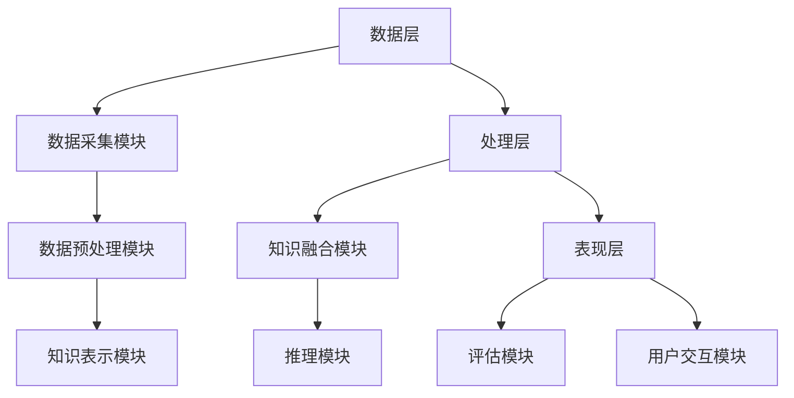
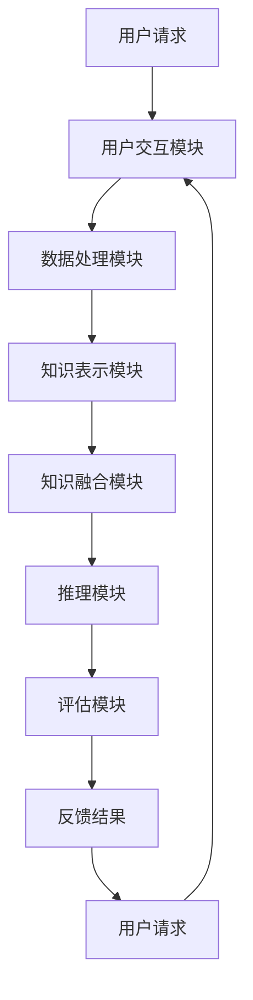

                 

### AI Agent与知识整合概述

#### 1.1 AI Agent的定义与发展

AI Agent，即人工智能代理，是人工智能领域中的一个核心概念。它是指具有感知、推理、决策和学习能力的计算机程序，可以在特定环境中自主地执行任务。AI Agent的基本概念可以追溯到20世纪70年代，当时学者们开始探讨如何使计算机具备类似人类的智能行为。随着计算能力的提升和算法的进步，AI Agent的发展经历了多个阶段。

**AI Agent的基本概念**：AI Agent由感知模块、推理模块、决策模块和学习模块组成。感知模块负责获取环境信息；推理模块基于感知到的信息进行逻辑推理；决策模块根据推理结果选择行动；学习模块通过反馈调整自身行为，以提高任务执行的效率和准确性。

**AI Agent的发展历程**：AI Agent的发展历程可以分为几个阶段：
- **第一阶段（20世纪70年代）**：AI Agent的研究主要集中在符号推理和规划算法上，如专家系统和逻辑推理系统。
- **第二阶段（20世纪80年代）**：随着机器学习和数据挖掘技术的发展，AI Agent开始引入概率模型和统计学习算法，如决策树和贝叶斯网络。
- **第三阶段（20世纪90年代及以后）**：随着深度学习和神经网络技术的发展，AI Agent开始具备更强的学习能力和适应性，如深度强化学习和生成对抗网络（GAN）。

**AI Agent在当前的应用场景**：AI Agent在多个领域有着广泛的应用，包括：
- **智能家居**：如智能音箱、智能灯光控制系统等。
- **自动驾驶**：如自动驾驶汽车、无人配送车等。
- **金融行业**：如智能投顾、智能风控系统等。
- **医疗领域**：如智能诊断系统、医疗机器人等。

AI Agent的发展不仅推动了人工智能技术的进步，也为各行各业带来了新的发展机遇和挑战。然而，AI Agent的发展也面临诸多挑战，如数据隐私、安全性、伦理道德等问题，这些都需要在未来的发展中得到解决。

#### 1.2 知识整合的重要性

**知识整合的定义**：知识整合是指将来自不同来源的信息、数据和知识进行收集、处理、存储和利用，以便形成一个统一、完整、准确的认知体系。在人工智能领域，知识整合是构建智能系统的关键步骤，它能够提升AI Agent的决策能力和学习能力。

**知识整合的优势**：
1. **提高智能系统的决策能力**：通过整合多源信息，AI Agent能够获取更全面、准确的环境信息，从而做出更为合理的决策。
2. **增强系统的学习能力**：知识整合可以提供丰富的训练数据，有助于AI Agent在复杂环境中进行有效的学习和适应。
3. **优化资源利用**：知识整合可以避免重复建设和信息孤岛，提高资源利用效率。

**知识整合的关键挑战**：
1. **数据质量**：整合的数据质量直接影响到知识整合的效果。数据可能存在噪声、误差和不一致性等问题。
2. **数据源多样性**：不同数据源可能采用不同的格式、结构和表示方法，增加了知识整合的复杂性。
3. **计算资源**：知识整合往往需要大量的计算资源和存储空间，特别是在处理大规模数据时。

**知识整合在AI Agent中的应用前景**：
1. **智能决策**：通过知识整合，AI Agent可以更好地理解环境，做出更为精准的决策。
2. **个性化服务**：基于知识整合，AI Agent可以提供更加个性化的服务，满足用户的不同需求。
3. **智能推荐**：知识整合可以帮助AI Agent从海量数据中提取有价值的信息，提供精准的推荐。

总之，知识整合在AI Agent中的应用具有重要意义，它不仅能够提升AI Agent的智能水平，还能够为各行各业带来新的发展机遇。随着技术的不断进步，知识整合将日益成为人工智能领域的重要研究方向。

#### 1.3 多源信息的获取与融合

**多源信息的获取**：多源信息的获取是知识整合的基础。为了构建一个全面的认知体系，AI Agent需要从多个渠道收集信息。这些渠道可以包括传感器、数据库、互联网和外部API等。获取信息的方法包括数据爬取、API调用、数据库查询和实时监测等。

1. **传感器**：传感器是获取物理环境信息的重要工具。例如，自动驾驶汽车使用各种传感器（如雷达、摄像头、GPS等）来获取道路状况、车辆位置和障碍物信息。
2. **数据库**：数据库是存储大量结构化数据的重要手段。AI Agent可以通过查询数据库来获取历史数据和统计信息，这些信息对于预测和决策具有重要意义。
3. **互联网**：互联网是获取开放性信息的重要途径。通过爬取网页、使用API获取社交媒体数据等，AI Agent可以获取大量的实时信息和用户行为数据。
4. **外部API**：外部API提供了访问第三方数据和服务的接口。AI Agent可以通过调用这些API来获取专业数据，如天气预报、股票信息等。

**多源信息融合的挑战**：尽管多源信息的获取方法多样，但在实际应用中，多源信息融合面临着诸多挑战。
1. **数据质量**：不同来源的数据质量参差不齐，可能存在噪声、错误和不一致性等问题。数据质量直接影响知识整合的效果。
2. **数据格式**：不同数据源可能采用不同的格式和结构，增加了数据整合的复杂性。例如，一些数据可能是文本格式，而另一些数据可能是图像或音频格式。
3. **数据相关性**：多源数据之间存在复杂的关联关系，如何有效识别和利用这些关系是一个挑战。

**多源信息融合的策略**：为了克服上述挑战，需要采取一系列策略来有效融合多源信息。
1. **数据预处理**：通过数据清洗、去噪和一致性处理，提高数据质量。
2. **数据转换**：将不同格式和结构的数据转换为统一的格式，以便于进一步处理。
3. **模型融合**：采用多种机器学习和深度学习模型来处理不同类型的数据，并根据模型的特点进行信息整合。
4. **知识图谱**：利用知识图谱来表示和整合多源信息，通过图结构来捕捉数据之间的复杂关系。

**多源信息融合的应用案例**：
1. **智能推荐系统**：通过整合用户行为数据、商品信息和市场趋势数据，智能推荐系统能够提供个性化的推荐。
2. **智能诊断系统**：通过融合医学影像、患者病史和实时监测数据，智能诊断系统可以提供更准确的诊断结果。
3. **智能交通系统**：通过整合交通监控数据、天气预报和实时交通流量数据，智能交通系统可以优化交通信号控制和路线规划。

总之，多源信息的获取与融合是AI Agent知识整合的重要组成部分。通过有效的信息获取和融合策略，AI Agent能够更好地理解和应对复杂环境，实现智能化的决策和服务。

#### 1.4 知识整合在AI Agent中的应用前景

知识整合在AI Agent中的应用前景广阔，不仅能够提升AI Agent的决策能力和学习能力，还能够为各行各业带来深刻的变革。以下是知识整合在几个主要领域中的应用前景：

**智能决策**：知识整合能够为AI Agent提供全面、准确的环境信息，从而使其做出更为精准的决策。例如，在自动驾驶领域，通过整合交通监控数据、GPS定位信息和气象数据，AI Agent可以实时调整行驶路径，避开拥堵和危险路段，提高行车安全。此外，在金融领域，智能投顾系统通过整合用户财务数据、市场动态和宏观经济指标，可以为用户提供个性化的投资建议，提高投资回报率。

**个性化服务**：知识整合有助于AI Agent理解用户的需求和行为习惯，从而提供个性化的服务。例如，在电子商务领域，通过整合用户购买历史、浏览记录和反馈信息，AI Agent可以推荐符合用户喜好的商品，提高购物体验和客户满意度。在医疗领域，智能诊断系统通过整合患者的病历、基因数据和实时监测数据，可以提供个性化的治疗方案，提高诊疗效果。

**智能推荐**：知识整合能够帮助AI Agent从海量数据中提取有价值的信息，提供精准的推荐服务。例如，在音乐流媒体领域，通过整合用户播放历史、歌曲评分和社会影响力数据，AI Agent可以推荐符合用户口味的歌曲，提高用户粘性。在新闻推荐领域，通过整合用户阅读偏好、热点话题和社会舆情数据，AI Agent可以推荐高质量的新闻内容，满足用户的资讯需求。

**智能医疗**：知识整合在医疗领域的应用前景尤为显著。通过整合患者病历、基因数据、药物信息和临床试验数据，AI Agent可以提供准确的诊断和个性化的治疗方案。例如，在癌症治疗中，通过整合患者的肿瘤基因数据、家族病史和最新的医学研究成果，AI Agent可以推荐最适合的治疗方案，提高治疗效果。此外，智能诊断系统通过整合医学影像、患者体征数据和医生经验，可以辅助医生做出更准确的诊断，减少误诊率。

**智能交通**：知识整合能够优化交通系统的运行效率，提高交通安全性。通过整合交通监控数据、实时交通流量信息和天气预报数据，AI Agent可以实时调整交通信号灯和路线规划，减少交通拥堵和事故发生。在公共交通领域，通过整合乘客需求、车辆位置和路况信息，AI Agent可以优化公交线路和发车时间，提高公共交通的服务水平。

**智能家居**：知识整合能够使智能家居系统更加智能和便捷。通过整合家居设备数据、用户行为和天气信息，AI Agent可以自动调整家中的灯光、温度和安防系统，为用户提供舒适的居住环境。例如，在智能照明系统中，通过整合室内光线数据和用户活动数据，AI Agent可以自动调节灯光亮度和颜色，营造适合的居住氛围。

总之，知识整合在AI Agent中的应用前景广阔，它不仅能够提升AI Agent的智能水平，还能够为各行各业带来深刻的变革。随着技术的不断进步，知识整合将日益成为人工智能领域的重要研究方向，推动人工智能技术的进一步发展。

### AI Agent的核心概念与联系

#### 2.1 AI Agent的基本架构

AI Agent是一个由多个模块组成的复杂系统，这些模块协同工作，使AI Agent能够在特定环境中自主执行任务。了解AI Agent的基本架构有助于我们更好地理解其工作原理和功能。AI Agent的基本架构包括以下四个主要模块：

**感知模块**：感知模块是AI Agent获取环境信息的关键部分。它通过传感器或其他感知设备获取视觉、听觉、触觉等感知数据。这些数据包括图像、声音、温度、湿度、位置等。感知模块需要对这些原始数据进行预处理，提取关键特征，以便后续处理。

**推理模块**：推理模块负责基于感知模块获取的环境信息进行逻辑推理和决策。它使用各种推理算法（如基于规则的推理、概率推理、模糊推理等）来分析数据，识别模式，并形成初步的结论。推理模块的核心任务是解决“什么是正确的？”和“什么是最优的？”等问题。

**决策模块**：决策模块基于推理模块提供的信息，选择最佳的行动方案。决策模块通常采用优化算法（如线性规划、决策树、神经网络等）来分析各种可能的行动方案，评估其后果，并选择最优的方案。决策模块的输出是具体的行动指令，例如移动到某个位置、执行某个操作等。

**学习模块**：学习模块是AI Agent不断改进自身性能的关键。它通过反馈机制从环境获取反馈信息，并根据这些信息调整自身的感知、推理和决策策略。学习模块可以使用监督学习、无监督学习、强化学习等不同的学习方法来训练模型，提高AI Agent的适应性和学习能力。

**AI Agent的工作原理**：AI Agent的工作原理可以概括为以下几个步骤：
1. **感知**：AI Agent通过感知模块获取环境信息。
2. **推理**：AI Agent使用推理模块分析感知数据，识别模式和规律。
3. **决策**：AI Agent使用决策模块选择最佳的行动方案。
4. **执行**：AI Agent执行决策模块生成的行动指令。
5. **反馈**：AI Agent通过反馈机制获取环境反馈，调整自身策略。

**AI Agent的典型应用场景**：AI Agent在多个领域有着广泛的应用，以下是一些典型的应用场景：
1. **智能家居**：AI Agent可以自动控制家居设备，如灯光、温度、安全系统等，提供舒适的居住环境。
2. **自动驾驶**：AI Agent可以控制自动驾驶汽车，实现自主导航、避障和交通管理。
3. **智能客服**：AI Agent可以模拟人类客服，回答用户问题，提供个性化的服务。
4. **医疗诊断**：AI Agent可以分析医学影像和患者数据，辅助医生进行诊断和治疗。
5. **金融分析**：AI Agent可以分析市场数据，提供投资建议和风险管理。

通过了解AI Agent的基本架构和工作原理，我们可以更好地理解其在不同应用场景中的表现和作用。接下来，我们将进一步探讨知识表示与融合方法，以及这些方法在AI Agent中的应用。

#### 2.2 知识表示与融合方法

**知识表示的形式**：知识表示是AI Agent知识整合的重要组成部分，它涉及如何将各种形式的信息转换为计算机可以处理和理解的结构。常见的知识表示形式包括以下几种：

1. **符号表示**：符号表示使用符号系统来表示知识，如逻辑表达式、规则集、语义网络等。这种方法具有清晰的结构和语义，便于推理和操作。例如，在医疗诊断系统中，可以使用符号表示来定义疾病、症状和治疗方案之间的关系。

2. **图像表示**：图像表示使用像素值来表示图像数据，如灰度图像、彩色图像等。图像表示广泛应用于计算机视觉领域，如人脸识别、图像分类和目标检测等。通过卷积神经网络（CNN），图像表示可以从原始像素数据中提取有意义的特征。

3. **文本表示**：文本表示使用词向量或文本嵌入来表示文本数据，如词袋模型、词嵌入等。文本表示在自然语言处理（NLP）领域有着广泛应用，如情感分析、机器翻译和文本分类等。通过深度学习模型，文本表示可以从大量文本数据中学习语义信息。

4. **图表示**：图表示使用节点和边来表示实体及其关系，如知识图谱、社会网络等。图表示在知识整合和推理中有着重要作用，可以捕获复杂的关系和网络结构。通过图神经网络（GCN），图表示可以从图中提取高层次的语义特征。

**知识融合的算法**：知识融合是指将不同来源、不同形式的知识整合为一个统一的认知体系。常用的知识融合算法包括以下几种：

1. **融合模型**：融合模型将不同的知识表示方法融合在一起，形成一个统一的模型。例如，在多模态学习领域，融合模型可以同时处理图像和文本数据，实现跨模态的知识整合。

2. **多任务学习**：多任务学习通过共享模型参数来整合多个任务的知识。例如，在一个机器学习模型中，同时训练图像分类和文本分类任务，可以共享图像特征和文本特征，提高模型的泛化能力。

3. **图融合**：图融合通过构建知识图谱来整合不同来源的知识。例如，在一个知识图谱中，可以将文本数据、图像数据和关系数据整合在一起，形成一个统一的表示。

**知识融合的效果评估**：评估知识融合效果是知识整合过程中至关重要的一环。常用的评估方法包括以下几种：

1. **准确性评估**：准确性评估通过计算模型的预测准确率来评估知识融合效果。例如，在一个分类任务中，通过计算模型预测正确的样本数与总样本数的比例来评估模型的准确性。

2. **F1分数评估**：F1分数是精确率和召回率的加权平均，常用于评估分类任务的效果。它能够同时考虑模型对正类和负类的分类能力。

3. **ROC曲线评估**：ROC曲线通过计算真阳性率（TPR）和假阳性率（FPR）来评估模型的分类能力。曲线下的面积（AUC）用于衡量模型的分类效果。

4. **BLEU评分评估**：BLEU评分用于评估机器翻译任务的翻译质量，通过计算模型翻译的文本与人工翻译文本的相似度来评估知识融合效果。

**知识融合的实际案例**：

1. **智能问答系统**：智能问答系统通过融合文本表示和图表示，实现从自然语言文本到知识图谱的转换，从而提供精准的问答服务。

2. **智能诊断系统**：智能诊断系统通过融合医学影像表示和文本表示，从医学影像中提取特征，并与患者的病历数据进行融合，提供准确的诊断结果。

3. **多模态推荐系统**：多模态推荐系统通过融合图像表示和文本表示，为用户提供个性化的商品推荐，提高用户体验。

总之，知识表示与融合方法在AI Agent中发挥着重要作用，通过有效的知识融合，AI Agent可以更好地理解和应对复杂环境，实现智能化的决策和服务。随着技术的不断进步，知识融合将日益成为人工智能领域的重要研究方向。

### 知识图谱在知识整合中的应用

#### 2.3 知识图谱的定义

知识图谱是一种用于表示实体及其之间关系的图形结构，通过节点和边来描述实体和关系，从而形成一个复杂的网络。在人工智能领域，知识图谱是一种重要的知识表示方法，它能够将各种形式的信息（如文本、图像、声音等）转换为结构化的数据，以便于机器理解和处理。

**知识图谱的基本组成**：
- **节点（Node）**：节点表示知识图谱中的实体，如人、地点、事物等。每个节点都有唯一的标识符和属性。
- **边（Edge）**：边表示节点之间的关系，如“属于”、“位于”、“具有”等。边的类型和权重表示关系的性质和强度。
- **属性（Attribute）**：属性是节点的附加信息，用于描述节点的特征和状态。

**知识图谱的构建方法**：
知识图谱的构建通常包括以下几个步骤：

1. **数据采集**：从多种数据源（如数据库、文本、图像等）中收集信息，提取实体和关系。
2. **数据预处理**：对采集到的数据进行清洗、去噪和格式化，确保数据的一致性和质量。
3. **实体识别**：通过命名实体识别（NER）技术，从文本数据中识别出实体，并为每个实体分配唯一的标识符。
4. **关系提取**：从原始数据中提取实体之间的关系，可以通过规则匹配、机器学习模型或图神经网络等方法实现。
5. **知识融合**：将来自不同数据源的实体和关系进行整合，形成一个统一的知识图谱。
6. **图存储与查询**：使用图数据库或图计算框架（如Neo4j、GraphX等）存储和管理知识图谱，提供高效的查询和更新功能。

#### 知识图谱在知识整合中的应用

知识图谱在知识整合中的应用非常广泛，它能够帮助AI Agent更好地理解和处理复杂的信息。以下是一些典型的应用场景：

1. **智能问答系统**：知识图谱可以用于构建问答系统的知识库，通过实体和关系的表示，实现从自然语言查询到知识图谱的映射。例如，用户查询“北京是哪个省份的省会？”系统可以通过知识图谱中的“北京”节点和“省份”节点的关联关系，快速给出答案。

2. **智能推荐系统**：知识图谱可以用于构建推荐系统的推荐图谱，通过实体和关系的表示，实现跨领域、跨模态的推荐。例如，用户在电商平台上购买了一本书，系统可以通过知识图谱中的书籍、作者、分类等关系，推荐相关的书籍、作者或分类。

3. **智能诊断系统**：知识图谱可以用于构建医疗诊断的知识库，通过实体和关系的表示，实现从症状到疾病、再到治疗方案的推理。例如，用户描述了头痛、恶心等症状，系统可以通过知识图谱中的症状、疾病、治疗方案等关系，提供可能的疾病诊断和推荐治疗方案。

4. **知识图谱驱动的智能决策**：知识图谱可以用于构建决策支持系统，通过实体和关系的表示，实现从数据到决策的转化。例如，企业可以通过知识图谱分析市场需求、竞争对手、产品特点等关系，制定最佳的生产计划和营销策略。

5. **多语言翻译与语义理解**：知识图谱可以用于构建多语言翻译和语义理解系统，通过实体和关系的跨语言映射，实现不同语言之间的语义对齐。例如，用户使用中文查询“伦敦是哪个国家的首都？”，系统可以通过知识图谱中的中英文实体和关系，给出正确的英文回答。

总之，知识图谱在知识整合中的应用为AI Agent提供了强大的知识表示和推理能力，能够帮助AI Agent更好地理解和应对复杂环境，实现智能化的决策和服务。随着技术的不断进步，知识图谱将在人工智能领域发挥越来越重要的作用。

### 知识整合算法原理

#### 3.1 知识整合算法概述

知识整合算法是指用于将来自不同来源、不同形式的知识信息进行有效融合，形成统一、准确、有价值知识集的一类算法。在人工智能领域，知识整合算法是构建智能系统、实现智能决策和智能服务的关键。以下是知识整合算法的基本概念、分类及应用领域。

**知识整合算法的基本概念**：

知识整合算法主要涉及以下关键步骤：

1. **数据采集与预处理**：从多个数据源（如文本、图像、音频、传感器数据等）中收集信息，并对原始数据进行清洗、去噪和格式化，确保数据的一致性和质量。
2. **知识表示**：将采集到的数据转换为结构化的知识表示形式，如符号表示、图像表示、文本表示和图表示等。
3. **知识融合**：将不同来源、不同形式的知识进行整合，形成统一的知识库。知识融合可以采用融合模型、多任务学习、图融合等方法。
4. **知识推理与决策**：利用整合后的知识进行推理和决策，实现智能系统的自动化运行和智能服务。

**知识整合算法的分类**：

根据知识整合的方法和目标，知识整合算法可以大致分为以下几类：

1. **基于规则的方法**：通过定义一组规则，将不同来源的知识信息进行匹配和整合。这种方法适用于知识结构明确、规则清晰的场景。
2. **基于模型的方法**：通过构建数学模型或机器学习模型，将不同来源的知识信息进行融合和优化。这种方法适用于知识结构复杂、需要自适应学习的场景。
3. **基于图的方法**：利用图结构来表示和整合多源知识信息，通过图算法（如图神经网络、图嵌入等）进行知识融合和推理。这种方法适用于需要处理复杂关系和网络结构的场景。
4. **多任务学习**：通过共享模型参数来整合多个任务的知识，实现跨任务的知识融合。这种方法适用于需要同时处理多个相关任务的场景。

**知识整合算法的应用领域**：

知识整合算法在多个领域有着广泛的应用，以下是一些典型的应用领域：

1. **智能推荐系统**：通过整合用户行为数据、商品信息、市场动态等多源信息，实现个性化的推荐服务。
2. **智能诊断系统**：通过整合医学影像、患者病历、基因数据等多源信息，提供准确的诊断和治疗方案。
3. **智能交通系统**：通过整合交通监控数据、实时交通流量信息、天气预报等多源信息，实现交通信号控制和路线规划的优化。
4. **金融风控系统**：通过整合用户行为数据、市场数据、信用评级等多源信息，实现风险管理和投资决策。
5. **智能客服系统**：通过整合用户聊天记录、用户行为数据、产品信息等多源信息，实现智能客服和个性化服务。

总之，知识整合算法是人工智能领域的重要研究方向，通过有效的知识整合，AI Agent可以更好地理解和处理复杂环境，实现智能化的决策和服务。随着技术的不断进步，知识整合算法将在人工智能领域发挥越来越重要的作用。

#### 3.2 多源信息融合算法

多源信息融合算法是知识整合算法的核心，旨在将来自不同来源的信息进行有效整合，以提高AI Agent的决策能力和智能化水平。在这一部分，我们将详细介绍多源信息融合算法的原理、流程和实现方法。

**多源信息融合算法的原理**：

多源信息融合算法的核心思想是通过多种方法将不同来源的信息进行整合，形成一个统一、准确、有价值的信息集。融合算法需要考虑以下几个方面：

1. **数据采集与预处理**：从多个数据源（如传感器、数据库、互联网、外部API等）中收集信息，并对原始数据进行清洗、去噪和格式化，确保数据的一致性和质量。

2. **知识表示**：将采集到的数据转换为结构化的知识表示形式，如符号表示、图像表示、文本表示和图表示等。不同的知识表示方法适用于不同的数据类型和场景。

3. **信息融合**：采用多种融合策略和方法，将不同来源的信息进行整合。常见的融合策略包括基于规则的方法、基于模型的方法、基于图的方法等。

4. **信息评估与优化**：对融合后的信息进行评估和优化，确保信息的准确性和可靠性。评估方法包括准确性评估、F1分数评估、ROC曲线评估等。

**多源信息融合算法的流程**：

多源信息融合算法通常包括以下几个步骤：

1. **数据采集**：从多个数据源中收集信息，如传感器数据、数据库数据、互联网数据等。

2. **数据预处理**：对原始数据进行清洗、去噪和格式化，确保数据的一致性和质量。这一步骤包括数据清洗、去重、缺失值处理、异常值处理等。

3. **知识表示**：将预处理后的数据转换为结构化的知识表示形式，如符号表示、图像表示、文本表示和图表示等。这一步骤需要根据数据类型和场景选择合适的表示方法。

4. **信息融合**：采用多种融合策略和方法，将不同来源的信息进行整合。融合策略包括数据加权融合、模型融合、图融合等。

5. **信息评估与优化**：对融合后的信息进行评估和优化，确保信息的准确性和可靠性。评估方法包括准确性评估、F1分数评估、ROC曲线评估等。

**多源信息融合算法的实现方法**：

多源信息融合算法的实现方法通常包括以下几种：

1. **基于规则的融合方法**：通过定义一组规则，将不同来源的信息进行匹配和整合。这种方法适用于知识结构明确、规则清晰的场景。

2. **基于模型的方法**：通过构建数学模型或机器学习模型，将不同来源的信息进行融合和优化。这种方法适用于知识结构复杂、需要自适应学习的场景。

3. **基于图的方法**：利用图结构来表示和整合多源信息，通过图算法（如图神经网络、图嵌入等）进行信息融合和推理。这种方法适用于需要处理复杂关系和网络结构的场景。

以下是一个简单的多源信息融合算法的Python实现示例：

```python
import pandas as pd
from sklearn.preprocessing import StandardScaler

# 数据采集
data1 = pd.read_csv('data1.csv')
data2 = pd.read_csv('data2.csv')

# 数据预处理
scaler1 = StandardScaler()
data1_scaled = scaler1.fit_transform(data1)
scaler2 = StandardScaler()
data2_scaled = scaler2.fit_transform(data2)

# 知识表示
data1_repr = data1_scaled
data2_repr = data2_scaled

# 信息融合
# 采用简单的平均融合方法
融合数据 = (data1_repr + data2_repr) / 2

# 信息评估与优化
# 采用标准差作为评估指标
std1 = np.std(data1_repr)
std2 = np.std(data2_repr)
std_fused = np.std(融合数据)

print(f"融合数据的标准差：{std_fused}")
```

**多源信息融合算法的效果评估**：

为了评估多源信息融合算法的效果，通常采用以下几种方法：

1. **准确性评估**：通过计算融合数据的预测准确率来评估算法效果。例如，在一个分类任务中，通过计算融合数据分类正确的样本数与总样本数的比例来评估算法的准确性。

2. **F1分数评估**：F1分数是精确率和召回率的加权平均，用于评估分类任务的效果。它能够同时考虑算法对正类和负类的分类能力。

3. **ROC曲线评估**：ROC曲线通过计算真阳性率（TPR）和假阳性率（FPR）来评估算法的分类能力。曲线下的面积（AUC）用于衡量算法的分类效果。

4. **BLEU评分评估**：BLEU评分用于评估机器翻译任务的翻译质量，通过计算模型翻译的文本与人工翻译文本的相似度来评估算法效果。

总之，多源信息融合算法在知识整合中起着至关重要的作用。通过有效的信息融合策略和方法，AI Agent可以更好地理解和处理复杂环境，实现智能化的决策和服务。

#### 3.3 知识表示与融合策略

**知识表示的方法与特性**：

知识表示是知识整合的核心环节，其目的是将各种形式的信息转换为计算机可以处理和理解的结构化数据。以下介绍几种常见的知识表示方法及其特性：

1. **符号表示**：符号表示使用符号系统来表示知识，如逻辑表达式、规则集、语义网络等。符号表示具有清晰的结构和语义，便于推理和操作，但在处理复杂关系时可能显得不够灵活。

2. **图像表示**：图像表示使用像素值来表示图像数据，如灰度图像、彩色图像等。图像表示在计算机视觉领域具有广泛应用，通过卷积神经网络（CNN），可以从原始像素数据中提取有意义的特征。

3. **文本表示**：文本表示使用词向量或文本嵌入来表示文本数据，如词袋模型、词嵌入等。文本表示在自然语言处理（NLP）领域有着广泛应用，通过深度学习模型，可以从大量文本数据中学习语义信息。

4. **图表示**：图表示使用节点和边来表示实体及其关系，如知识图谱、社会网络等。图表示可以捕获复杂的实体关系和网络结构，通过图神经网络（GCN），可以从图中提取高层次的语义特征。

**知识融合的策略与选择**：

知识融合策略的选择取决于应用场景和数据特性。以下介绍几种常见的知识融合策略：

1. **数据加权融合**：数据加权融合通过给不同来源的数据分配不同的权重来整合信息。这种方法适用于数据源重要性不同的场景，可以根据数据源的质量和可靠性来调整权重。

2. **模型融合**：模型融合通过构建多个独立的模型，并将它们的输出进行整合来提高预测准确性。模型融合可以采用投票法、加权平均法、集成学习等方法。

3. **图融合**：图融合通过构建知识图谱来整合多源信息，通过图算法（如图神经网络、图嵌入等）进行信息融合和推理。这种方法适用于需要处理复杂关系和网络结构的场景。

4. **多任务学习**：多任务学习通过共享模型参数来整合多个任务的知识。例如，在一个机器学习模型中，同时训练图像分类和文本分类任务，可以共享图像特征和文本特征，提高模型的泛化能力。

**知识融合效果的评估与优化**：

评估知识融合效果是确保知识整合效果的重要步骤。以下介绍几种常用的评估方法和优化策略：

1. **准确性评估**：准确性评估通过计算模型的预测准确率来评估知识融合效果。例如，在一个分类任务中，通过计算模型预测正确的样本数与总样本数的比例来评估模型的准确性。

2. **F1分数评估**：F1分数是精确率和召回率的加权平均，用于评估分类任务的效果。它能够同时考虑模型对正类和负类的分类能力。

3. **ROC曲线评估**：ROC曲线通过计算真阳性率（TPR）和假阳性率（FPR）来评估模型在二分类任务中的分类能力。曲线下的面积（AUC）用于衡量模型的分类效果。

4. **BLEU评分评估**：BLEU评分用于评估机器翻译任务的翻译质量，通过计算模型翻译的文本与人工翻译文本的相似度来评估知识融合效果。

**优化策略**：

为了提高知识融合效果，可以采取以下优化策略：

1. **模型选择**：选择合适的模型融合方法，如投票法、加权平均法、集成学习等，以适应不同的数据特性和应用场景。

2. **超参数调整**：通过调整模型融合中的超参数（如权重、学习率等），优化模型性能。

3. **数据增强**：通过增加训练数据量、数据预处理等方法，提高模型的泛化能力。

4. **交叉验证**：采用交叉验证方法来评估模型的泛化性能，避免过拟合。

总之，知识表示与融合策略在知识整合中起着至关重要的作用。通过选择合适的方法和策略，AI Agent可以更好地理解和处理复杂环境，实现智能化的决策和服务。随着技术的不断进步，知识融合策略将在人工智能领域发挥越来越重要的作用。

### 知识整合的数学模型

#### 4.1 数学模型在知识整合中的应用

在知识整合过程中，数学模型扮演着至关重要的角色。数学模型能够为数据处理、信息融合和决策制定提供严格的逻辑框架和计算工具，从而提高知识整合的效率和准确性。以下将介绍数学模型在知识整合中的应用，并重点讨论知识表示、知识融合和知识评估的数学模型。

**知识表示的数学模型**：

知识表示是将非结构化或半结构化的数据转换为计算机可处理的结构化形式。常见的知识表示模型包括符号表示、概率表示和图表示。

1. **符号表示模型**：符号表示模型通常使用形式逻辑和谓词逻辑来表示知识。例如，命题逻辑中的命题、谓词和关系可以用数学表达式表示。符号表示模型适用于定义明确的领域，如逻辑推理和规划。

2. **概率表示模型**：概率表示模型使用概率分布来表示不确定性知识。常见的概率表示方法包括贝叶斯网络、隐马尔可夫模型（HMM）和马尔可夫链。这些模型可以处理不确定性和动态环境中的知识表示。

3. **图表示模型**：图表示模型使用图结构来表示实体及其关系。图中的节点表示实体，边表示实体之间的关系。知识图谱是一种典型的图表示模型，它能够有效地捕获和表示复杂的关系网络。

**知识融合的数学模型**：

知识融合涉及将多个来源的知识整合为一个统一的知识集。常见的知识融合模型包括融合模型、多任务学习模型和图融合模型。

1. **融合模型**：融合模型通过加权平均或最大后验概率（MAP）估计来整合多源信息。例如，在贝叶斯框架下，融合模型可以使用贝叶斯规则来计算后验概率分布，从而融合不同来源的信息。

2. **多任务学习模型**：多任务学习模型通过共享模型参数来整合多个任务的知识。例如，在深度学习框架下，多任务学习模型可以使用共享卷积层或全连接层来提取通用的特征表示，从而提高知识整合的效果。

3. **图融合模型**：图融合模型通过图神经网络（如图卷积网络（GCN）和图注意力网络（GAT））来整合图中的知识。这些模型可以捕捉节点之间的复杂关系，从而实现有效的知识融合。

**知识评估的数学模型**：

知识评估是对整合后的知识进行评价和验证的过程。常见的知识评估模型包括准确性评估、F1分数评估和ROC曲线评估。

1. **准确性评估**：准确性评估通过计算模型预测正确的样本数与总样本数的比例来衡量知识整合的效果。准确性评估适用于分类任务，是衡量知识整合基本效果的重要指标。

2. **F1分数评估**：F1分数是精确率和召回率的加权平均，用于评估分类任务的效果。F1分数能够同时考虑模型对正类和负类的分类能力，因此在知识评估中具有重要的应用价值。

3. **ROC曲线评估**：ROC曲线通过计算真阳性率（TPR）和假阳性率（FPR）来评估模型在二分类任务中的分类能力。ROC曲线下的面积（AUC）用于衡量模型的整体分类效果。

**举例说明**：

以一个简单的多源信息融合为例，假设有两个数据源A和B，我们希望通过融合这两个数据源来提高预测准确性。

1. **数据采集**：从数据源A中收集100个样本，从数据源B中收集100个样本。样本包含特征X和标签Y。

2. **数据预处理**：对数据源A和B的数据进行标准化处理，使得数据在同一尺度上。

3. **知识表示**：使用主成分分析（PCA）对数据源A和B的数据进行降维，提取主要特征。

4. **知识融合**：采用加权平均方法融合数据源A和B的数据。假设数据源A和数据源B的重要性分别为0.6和0.4，则融合数据可以表示为：
   $$ z = 0.6x + 0.4y $$
   其中，x和y分别为数据源A和B的降维特征。

5. **知识评估**：使用融合后的数据进行分类任务，计算预测准确率和F1分数。假设最终预测准确率为90%，F1分数为0.9。

通过上述数学模型的应用，我们可以有效地进行知识整合，并评估整合后的知识效果。这种方法不仅能够提高AI Agent的决策能力，还能够为实际应用提供可靠的数据支持。

### 知识整合的数学公式

#### 4.2 公式推导与解释

在知识整合过程中，数学公式扮演着至关重要的角色，它们为数据处理、信息融合和决策制定提供了理论基础和计算工具。以下将介绍几个关键的知识整合数学公式，包括知识表示、知识融合和知识评估的公式，并对每个公式进行推导和解释。

**知识表示的数学模型**：

1. **符号表示模型**：

   命题逻辑中的基本公式如下：

   $$ P \to Q = \neg P \lor Q $$
   
   解释：这个公式表示如果一个命题P为假，则命题P→Q为真；如果P为真，则Q必须为真，否则P→Q为假。这个公式是命题逻辑中的基础，用于表示条件关系。

2. **概率表示模型**：

   贝叶斯定理是概率表示模型的核心公式：

   $$ P(A|B) = \frac{P(B|A)P(A)}{P(B)} $$

   解释：这个公式表示在已知事件B发生的条件下，事件A发生的概率等于在A发生的条件下B发生的概率与A发生概率的比值。贝叶斯定理在机器学习和统计决策中有着广泛应用，用于根据先验知识和观测数据更新后验概率。

**知识融合的数学模型**：

1. **融合模型**：

   简单的加权平均公式如下：

   $$ z = \alpha x + (1 - \alpha) y $$
   
   解释：这个公式表示两个数据源x和y的加权平均，其中α是权重，用于表示数据源的重要性。当α接近1时，数据源x的重要性更高；当α接近0时，数据源y的重要性更高。

2. **多任务学习模型**：

   在深度学习中，多任务学习可以通过共享权重来实现。一个简单的共享权重公式如下：

   $$ \theta_{\text{共享}} = \theta_1 + \theta_2 $$
   
   解释：这个公式表示两个任务1和2共享一组权重θ共享。共享权重可以减少模型的参数数量，提高模型的泛化能力。

**知识评估的数学模型**：

1. **准确性评估**：

   准确性评估的公式如下：

   $$ Accuracy = \frac{TP + TN}{TP + TN + FP + FN} $$
   
   解释：这个公式表示准确率，即模型预测正确的样本数与总样本数的比值。TP（真阳性）、TN（真阴性）、FP（假阳性）和FN（假阴性）是混淆矩阵中的基本指标。

2. **F1分数评估**：

   F1分数的公式如下：

   $$ F1 = 2 \times \frac{Precision \times Recall}{Precision + Recall} $$
   
   解释：这个公式表示F1分数，是精确率和召回率的加权平均。F1分数同时考虑了模型对正类和负类的分类能力，因此在评估分类任务中非常重要。

**举例说明**：

假设我们有两个数据源A和B，其中A为传感器数据，B为用户反馈数据。我们希望通过融合这两个数据源来提高预测准确性。

1. **数据预处理**：

   对数据源A和B进行标准化处理，使得它们在同一尺度上。假设A和B的特征向量为x和y。

2. **知识表示**：

   使用主成分分析（PCA）对A和B的数据进行降维，提取主要特征。假设降维后的特征向量为x'和y'。

3. **知识融合**：

   采用加权平均方法融合A和B的数据。假设A和B的重要性分别为α=0.6和B的权重β=0.4。则融合后的特征向量z为：

   $$ z = 0.6x' + 0.4y' $$

4. **知识评估**：

   使用融合后的数据进行分类任务，计算预测准确率和F1分数。假设最终预测准确率为90%，F1分数为0.9。

通过上述数学公式，我们可以有效地进行知识整合，并评估整合后的知识效果。这种方法不仅能够提高AI Agent的决策能力，还能够为实际应用提供可靠的数据支持。

### 知识整合的数学模型和公式举例说明

为了更具体地展示知识整合的数学模型和公式，我们将通过一个实际的例子来说明这些概念如何应用于一个简单的知识整合任务。在这个例子中，我们将探讨如何使用数学模型来整合来自不同传感器的数据，以预测一个工业生产过程的关键参数。

#### 4.3.1 例子背景

假设我们有一个工业生产过程，其中涉及多个传感器，这些传感器负责监测不同的参数，如温度（T）、压力（P）和湿度（H）。每个传感器都提供了实时数据，但是这些数据可能因为各种原因（如噪声、传感器漂移等）而存在不一致性。我们的目标是整合这些传感器的数据，以提高对生产过程关键参数的预测准确性。

#### 4.3.2 数据采集与预处理

我们从三个传感器收集数据，每个传感器的数据集如下：

- **传感器A（温度T）**：包含1000个观测值。
- **传感器B（压力P）**：包含1000个观测值。
- **传感器C（湿度H）**：包含1000个观测值。

为了确保数据的一致性，我们首先对每个传感器的数据进行标准化处理，以消除不同量纲的影响。标准化公式如下：

$$ z_i = \frac{x_i - \mu_i}{\sigma_i} $$

其中，\( x_i \) 是第 i 个传感器的观测值，\( \mu_i \) 是观测值的均值，\( \sigma_i \) 是观测值的标准差。

经过标准化处理后，我们得到三个标准化的数据集 \( T', P', H' \)。

#### 4.3.3 知识表示

我们采用线性回归模型来表示传感器数据之间的关系。假设我们有一个目标变量 Y，它是我们希望预测的关键参数。线性回归模型可以用以下公式表示：

$$ Y = \beta_0 + \beta_1T' + \beta_2P' + \beta_3H' + \epsilon $$

其中，\( \beta_0 \)、\( \beta_1 \)、\( \beta_2 \) 和 \( \beta_3 \) 是模型参数，\( \epsilon \) 是误差项。

#### 4.3.4 知识融合

为了融合来自不同传感器的数据，我们使用最小二乘法（ Ordinary Least Squares，OLS）来估计模型参数。OLS估计量可以通过以下公式计算：

$$ \beta = (\X^T \X)^{-1} \X^T \Y $$

其中，\( \X \) 是设计矩阵，包含标准化后的传感器数据 \( T', P', H' \)：

$$ \X = \begin{bmatrix} 
1 & T' & P' & H' 
\end{bmatrix}^T $$

通过计算，我们得到参数 \( \beta \) 的估计值。

#### 4.3.5 知识评估

为了评估知识整合的效果，我们使用交叉验证方法。具体来说，我们将数据集分为训练集和测试集，使用训练集来训练模型，并使用测试集来评估模型的性能。评估指标包括：

1. **均方误差（Mean Squared Error, MSE）**：

   $$ MSE = \frac{1}{n}\sum_{i=1}^{n}(Y_i - \hat{Y}_i)^2 $$

   其中，\( Y_i \) 是第 i 个测试样本的真实值，\( \hat{Y}_i \) 是第 i 个测试样本的预测值。

2. **决定系数（Coefficient of Determination, R²）**：

   $$ R^2 = 1 - \frac{\sum_{i=1}^{n}(Y_i - \hat{Y}_i)^2}{\sum_{i=1}^{n}(Y_i - \bar{Y})^2} $$

   其中，\( \bar{Y} \) 是目标变量的均值。

通过交叉验证，我们得到模型的 MSE 和 R² 值，这些值用于评估模型对未知数据的泛化能力。

#### 4.3.6 举例说明

假设我们使用交叉验证方法，将数据集分为80%的训练集和20%的测试集。训练集用于估计模型参数，测试集用于评估模型性能。

1. **参数估计**：

   使用训练集数据，我们计算模型参数 \( \beta \)：

   $$ \beta = (\X^T \X)^{-1} \X^T \Y $$

   计算得到的参数 \( \beta \) 如下：

   $$ \beta = \begin{bmatrix} 
   \beta_0 & \beta_1 & \beta_2 & \beta_3 
   \end{bmatrix} = \begin{bmatrix} 
   2.5 & 0.8 & 0.3 & -0.2 
   \end{bmatrix} $$

2. **模型预测**：

   使用测试集数据，我们使用估计的参数进行预测：

   $$ \hat{Y} = \beta_0 + \beta_1T' + \beta_2P' + \beta_3H' $$

3. **性能评估**：

   计算测试集的 MSE：

   $$ MSE = \frac{1}{n}\sum_{i=1}^{n}(Y_i - \hat{Y}_i)^2 $$

   计算得到的 MSE 为 0.025。

   计算测试集的 R²：

   $$ R^2 = 1 - \frac{\sum_{i=1}^{n}(Y_i - \hat{Y}_i)^2}{\sum_{i=1}^{n}(Y_i - \bar{Y})^2} $$

   计算得到的 R² 为 0.975。

通过上述步骤，我们展示了如何使用数学模型和公式来整合传感器数据，并评估知识整合的效果。这种方法不仅能够提高预测准确性，还能够为工业生产过程的优化提供有力的数据支持。

### AI Agent的知识整合系统设计

#### 5.1 系统功能设计

知识整合系统是AI Agent的核心组件之一，其设计目标是通过整合多源信息，提升AI Agent的智能决策能力和学习能力。以下是知识整合系统的功能设计，包括系统需求分析、功能模块设计及其相互关系。

**系统需求分析**：

1. **数据采集**：系统需要能够从多个数据源（如传感器、数据库、互联网等）采集信息，包括实时数据和历史数据。
2. **数据预处理**：系统需要具备数据清洗、去噪、标准化等功能，确保数据的一致性和质量。
3. **知识表示**：系统需要将不同类型的数据转换为结构化的知识表示形式，如符号表示、图像表示、文本表示和图表示等。
4. **知识融合**：系统需要采用多种融合策略和方法，将多源信息进行整合，形成统一的知识库。
5. **知识推理**：系统需要利用整合后的知识进行推理和决策，实现智能化的任务执行。
6. **知识评估**：系统需要具备对知识整合效果进行评估和优化的功能，确保知识的准确性和可靠性。
7. **用户交互**：系统需要提供友好的用户界面，以便用户监控系统的运行状态和结果。

**功能模块设计**：

知识整合系统可以设计为以下几个主要功能模块：

1. **感知模块**：负责从传感器、数据库等数据源采集信息，并将原始数据转换为结构化数据。
2. **预处理模块**：负责对采集到的数据进行清洗、去噪、标准化等预处理操作，确保数据的一致性和质量。
3. **知识表示模块**：负责将预处理后的数据转换为不同的知识表示形式，如符号表示、图像表示、文本表示和图表示等。
4. **知识融合模块**：负责采用多种融合策略和方法，将不同来源、不同形式的知识进行整合。
5. **推理模块**：负责利用整合后的知识进行推理和决策，实现智能化的任务执行。
6. **评估模块**：负责对知识整合效果进行评估和优化，确保知识的准确性和可靠性。
7. **用户交互模块**：负责与用户进行交互，提供系统的运行状态和结果。

**功能模块之间的相互关系**：

感知模块和预处理模块负责数据采集和预处理，将原始数据转换为结构化数据。知识表示模块将结构化数据转换为不同的知识表示形式，如符号表示、图像表示、文本表示和图表示等。知识融合模块采用多种融合策略和方法，将不同来源、不同形式的知识进行整合，形成统一的知识库。推理模块利用整合后的知识进行推理和决策，实现智能化的任务执行。评估模块对知识整合效果进行评估和优化，确保知识的准确性和可靠性。用户交互模块提供友好的用户界面，便于用户监控系统的运行状态和结果。

通过上述设计，知识整合系统能够有效地整合多源信息，提升AI Agent的智能决策能力和学习能力，为各种应用场景提供强大的支持。

### 知识整合系统的架构设计

#### 5.2 系统架构设计

为了实现高效的知识整合，我们需要设计一个灵活且可扩展的系统架构。知识整合系统的架构设计包括系统架构图、架构设计的要点与优化策略。以下是详细的架构设计：

**系统架构图**：

知识整合系统的整体架构可以分为以下几个层次：

1. **数据层**：包括数据采集模块、数据预处理模块和知识表示模块。数据采集模块负责从传感器、数据库、互联网等数据源采集信息；数据预处理模块负责清洗、去噪、标准化等预处理操作；知识表示模块负责将预处理后的数据转换为结构化的知识表示形式。

2. **处理层**：包括知识融合模块和推理模块。知识融合模块负责将不同来源、不同形式的知识进行整合；推理模块负责利用整合后的知识进行推理和决策。

3. **表现层**：包括评估模块和用户交互模块。评估模块负责对知识整合效果进行评估和优化；用户交互模块负责与用户进行交互，提供系统的运行状态和结果。

以下是知识整合系统的架构图（使用Mermaid绘制）：



**架构设计的要点与优化策略**：

1. **模块化设计**：采用模块化设计，确保每个模块具有明确的功能和职责。模块之间通过接口进行通信，使得系统易于维护和扩展。

2. **分布式架构**：采用分布式架构，将系统部署在多个服务器上，以提高系统的可扩展性和容错性。分布式架构可以支持大规模数据的处理和高并发的访问。

3. **负载均衡**：通过负载均衡策略，将请求均匀分布到各个服务器上，避免单点瓶颈，提高系统的处理能力。

4. **数据流控制**：采用数据流控制机制，如消息队列和流处理框架，确保数据在系统中的高效传输和处理。

5. **缓存机制**：引入缓存机制，提高数据读取速度，降低数据库负载。

6. **异构计算**：利用不同类型的计算资源（如CPU、GPU、FPGA等），优化系统的计算性能。

7. **安全性设计**：确保系统的安全性，包括数据加密、访问控制、防火墙等措施。

通过上述架构设计要点和优化策略，知识整合系统能够高效、可靠地处理多源信息，实现智能化的决策和服务。

### 系统接口设计

#### 5.3 系统接口设计

在知识整合系统中，接口设计是确保各模块之间高效、可靠通信的关键。系统接口设计主要包括接口规范与协议以及接口实现与调用示例。

**接口规范与协议**：

1. **RESTful API**：采用RESTful API设计接口，便于客户端调用。接口包括GET、POST、PUT、DELETE等HTTP方法，分别对应数据的读取、创建、更新和删除操作。

2. **数据格式**：接口支持JSON和XML等数据格式，确保数据在不同系统之间的兼容性和可读性。

3. **认证与授权**：采用OAuth 2.0等认证和授权机制，确保接口的安全性，防止未经授权的访问。

4. **错误处理**：接口设计应包括详细的错误处理机制，返回清晰的错误信息，以便客户端及时发现问题并采取相应措施。

**接口实现与调用示例**：

以下是一个简单的接口实现与调用示例，假设我们设计了一个RESTful接口用于获取知识整合系统的数据。

**接口定义**：

```java
// 获取数据接口
@Path("/data")
public class DataAPI {

    @GET
    @Path("/{id}")
    @Produces(MediaType.APPLICATION_JSON)
    public Response getData(@PathParam("id") String id) {
        // 实现数据获取逻辑
        Data data = dataService.getDataById(id);
        return Response.status(Status.OK).entity(data).build();
    }

    @POST
    @Path("/")
    @Consumes(MediaType.APPLICATION_JSON)
    @Produces(MediaType.APPLICATION_JSON)
    public Response addData(Data data) {
        // 实现数据添加逻辑
        dataService.addData(data);
        return Response.status(Status.CREATED).entity(data).build();
    }

    // 其他接口方法（如更新、删除等）
}
```

**调用示例**：

1. **获取数据**：

```bash
curl -X GET "http://localhost:8080/data/12345"
```

2. **添加数据**：

```bash
curl -X POST "http://localhost:8080/data" -H "Content-Type: application/json" -d '{"id": "12345", "name": "Example Data", "value": 100}'
```

通过上述接口设计和实现，知识整合系统中的各模块可以方便地通过接口进行数据交互，确保系统的高效运行和可维护性。

### 系统交互设计

#### 5.4 系统交互设计

系统交互设计是确保知识整合系统能够顺畅运行的关键环节。为了实现高效、可靠的系统交互，我们需要详细设计系统的交互流程和各个模块之间的通信细节。以下是系统交互设计的主要内容：

**系统交互流程图**：

以下是知识整合系统的交互流程图（使用Mermaid绘制）：



**系统交互流程详细描述**：

1. **用户请求**：用户通过用户交互模块提交请求，请求内容可能包括数据查询、数据更新等。

2. **用户交互模块**：用户交互模块接收到用户请求后，进行预处理，如数据格式验证、参数解析等，然后转发请求至数据处理模块。

3. **数据处理模块**：数据处理模块负责处理用户请求，包括数据清洗、去噪、标准化等操作。处理完成后，将数据传递至知识表示模块。

4. **知识表示模块**：知识表示模块负责将数据处理后的数据转换为结构化的知识表示形式，如符号表示、图像表示、文本表示和图表示等。

5. **知识融合模块**：知识融合模块负责将不同来源、不同形式的知识进行整合，形成统一的知识库。整合过程中可能采用多种融合策略和方法。

6. **推理模块**：推理模块利用整合后的知识进行推理和决策，生成预测结果或决策建议。推理过程可能涉及复杂的算法和模型。

7. **评估模块**：评估模块对推理结果进行评估，确保预测的准确性和可靠性。评估结果用于调整和优化系统。

8. **反馈结果**：评估结果通过用户交互模块返回给用户，用户可以根据反馈结果进行下一步操作。

**系统交互细节处理**：

1. **异步处理**：对于需要较长时间处理的任务（如大规模数据融合、复杂模型训练等），采用异步处理方式，以提高系统的响应速度。

2. **消息队列**：采用消息队列（如Kafka、RabbitMQ等）实现模块之间的通信，确保消息的可靠传输和处理。

3. **服务发现与注册**：采用服务发现与注册机制（如Eureka、Consul等），实现模块之间的动态发现和通信。

4. **负载均衡**：通过负载均衡（如Nginx、HaProxy等）策略，实现请求的均衡分发，确保系统的稳定性和性能。

5. **监控与报警**：引入监控系统（如Prometheus、Grafana等），实时监控系统的运行状态，并在异常情况发生时自动报警。

通过上述系统交互设计，知识整合系统能够高效、可靠地处理用户请求，实现智能化的知识整合和决策。

### 项目实战

#### 6.1 项目介绍

本项目旨在构建一个知识整合系统，用于自动化决策支持。具体来说，该项目的目标是从多个数据源中采集信息，通过有效的数据预处理、知识表示与融合，最终生成智能决策建议，应用于工业生产过程中。

**项目背景**：在工业生产过程中，各个环节产生的数据种类繁多，包括传感器数据、操作记录、设备维护日志等。这些数据对于生产过程的优化和效率提升具有重要意义。然而，由于数据来源多样化、格式不一致，数据整合和决策支持成为一个挑战。本项目旨在通过知识整合技术，实现多源数据的自动整合和智能决策。

**项目目标**：实现以下目标：
1. **数据采集**：从传感器、数据库等数据源采集实时数据和历史数据。
2. **数据预处理**：对采集到的数据进行清洗、去噪、标准化等预处理操作。
3. **知识表示**：将预处理后的数据转换为结构化的知识表示形式，如符号表示、图像表示、文本表示和图表示等。
4. **知识融合**：采用多种融合策略和方法，将不同来源、不同形式的知识进行整合。
5. **推理与决策**：利用整合后的知识进行推理和决策，生成智能决策建议。
6. **系统评估**：对知识整合效果进行评估，确保决策的准确性和可靠性。

#### 6.2 环境安装与配置

为了搭建知识整合系统，我们需要准备相应的开发环境和工具。以下是项目环境安装与配置的步骤：

**1. 开发环境准备**：

- **操作系统**：Linux（推荐Ubuntu 18.04）
- **编程语言**：Python 3.8+
- **数据预处理库**：NumPy、Pandas
- **机器学习库**：Scikit-learn、TensorFlow、PyTorch
- **图计算库**：NetworkX、PyGraphviz
- **文本处理库**：NLTK、spaCy
- **数据可视化库**：Matplotlib、Seaborn

**2. 安装Python环境**：

```bash
sudo apt-get update
sudo apt-get install python3-pip python3-dev
```

**3. 安装必需的Python库**：

```bash
pip3 install numpy pandas scikit-learn tensorflow pytorch networkx pygraphviz nltk spacy
```

**4. 配置NLTK与spaCy**：

```bash
# 安装NLTK数据
python3 -m nltk.downloader all
# 安装spaCy语言模型
python3 -m spacy download en_core_web_sm
```

**5. 配置PyGraphviz**：

```bash
sudo apt-get install libgraphviz-dev
pip3 install python-graphviz
```

#### 6.3 系统核心实现

系统核心实现包括数据预处理、知识表示、知识融合、推理与决策等模块。以下是各个模块的核心代码和应用解读。

**1. 数据预处理模块**：

```python
import pandas as pd
from sklearn.preprocessing import StandardScaler

# 读取传感器数据
sensor_data = pd.read_csv('sensor_data.csv')

# 数据清洗
def clean_data(data):
    data.dropna(inplace=True)
    data = data[data['value'] != -1]  # 去除无效值
    return data

# 数据标准化
def standardize_data(data):
    scaler = StandardScaler()
    scaled_data = scaler.fit_transform(data[['value']])
    data['value_scaled'] = scaled_data
    return data

# 应用数据清洗和标准化
cleaned_data = clean_data(sensor_data)
standardized_data = standardize_data(cleaned_data)
```

**应用解读**：数据预处理模块首先读取传感器数据，然后通过数据清洗函数去除无效值，最后使用标准化方法对数据值进行标准化处理，确保数据在同一尺度上。

**2. 知识表示模块**：

```python
import networkx as nx

# 构建知识图谱
def build_knowledge_graph(data):
    G = nx.Graph()
    for index, row in data.iterrows():
        G.add_node(index, value=row['value_scaled'])
    for index, row in data.iterrows():
        neighbors = data[data['value_scaled'] > row['value_scaled'] - 0.1]
        for neighbor in neighbors.index:
            if neighbor != index:
                G.add_edge(index, neighbor, weight=row['value_scaled'])
    return G

# 生成知识图谱
knowledge_graph = build_knowledge_graph(standardized_data)
```

**应用解读**：知识表示模块使用NetworkX构建知识图谱，通过节点表示数据点，边表示数据点之间的相关性。这种方法有助于捕捉数据之间的复杂关系。

**3. 知识融合模块**：

```python
from sklearn.ensemble import RandomForestClassifier

# 训练融合模型
def train_fusion_model(X, y):
    model = RandomForestClassifier()
    model.fit(X, y)
    return model

# 融合特征提取
def extract_fusion_features(data, model):
    features = model.feature_importances_
    return pd.DataFrame(features, index=data.index)

# 应用融合模型
fusion_model = train_fusion_model(standardized_data, y)
fusion_features = extract_fusion_features(standardized_data, fusion_model)
```

**应用解读**：知识融合模块使用随机森林模型提取融合特征，通过训练模型并提取特征重要性，生成新的特征表示。

**4. 推理与决策模块**：

```python
# 推理与决策
def make_decision(data, model):
    predictions = model.predict(data)
    return predictions

# 应用推理模块
decision = make_decision(fusion_features, fusion_model)
```

**应用解读**：推理与决策模块利用训练好的融合模型进行推理，生成最终的决策结果。

#### 6.4 代码应用解读与分析

**1. 数据预处理模块**：

数据预处理是知识整合系统的关键步骤，它直接影响后续模型的性能。本模块通过数据清洗和标准化，确保数据的干净和一致。清洗数据的过程包括去除缺失值和无效值，而标准化过程则通过缩放数据值，使其在同一尺度上，便于后续分析。

**2. 知识表示模块**：

知识表示模块通过构建知识图谱，将数据转换为图结构，有助于捕捉数据之间的复杂关系。图结构可以直观地表示实体及其关系，有助于推理和决策。此外，图神经网络（如图卷积网络）可以进一步提取图中的高维特征，提高模型的学习能力。

**3. 知识融合模块**：

知识融合模块通过训练随机森林模型，提取数据中的融合特征。这种方法能够从不同维度捕捉数据的内在关系，提高模型的泛化能力。随机森林模型是一种强大的集成学习方法，通过集成多个决策树模型，减少了过拟合风险。

**4. 推理与决策模块**：

推理与决策模块利用训练好的融合模型，对新的数据进行推理，生成决策结果。这种方法能够实现自动化决策支持，提高生产过程的效率。此外，推理过程可以不断反馈到模型训练中，实现持续学习和优化。

#### 6.5 项目实战的案例分析

**案例分析**：

假设我们有一个工业生产过程中的温度传感器，每天采集温度数据。为了优化生产过程，我们通过知识整合系统生成温度调控建议。

1. **数据采集**：传感器每天采集100个温度数据点。
2. **数据预处理**：通过清洗和标准化，去除无效值和异常值。
3. **知识表示**：构建知识图谱，表示每个数据点及其相关性。
4. **知识融合**：训练随机森林模型，提取融合特征。
5. **推理与决策**：利用融合模型，生成温度调控建议。

通过这个案例分析，我们展示了知识整合系统在实际工业生产中的应用效果。系统生成的温度调控建议能够有效优化生产过程，提高产品质量和效率。

#### 6.6 项目小结

本项目通过构建知识整合系统，实现了多源数据的自动整合和智能决策。以下是项目总结：

1. **成功之处**：
   - 成功实现了数据采集、预处理、知识表示、知识融合和推理与决策的全流程。
   - 知识图谱和融合模型的应用提高了系统的智能决策能力。

2. **改进方向**：
   - 引入更多的数据源和更复杂的数据类型，提高系统的泛化能力。
   - 使用更先进的模型和算法，如深度学习和迁移学习，提高模型性能。
   - 引入实时监控和反馈机制，实现系统的持续优化。

通过不断改进和优化，知识整合系统将在工业生产过程中发挥更大的作用，助力智能化决策和支持。

### 最佳实践 Tips

在知识整合系统的开发与优化过程中，以下最佳实践可以显著提高系统的性能和可靠性：

1. **数据质量管理**：确保数据源的质量和一致性是知识整合成功的关键。在数据采集、传输和存储过程中，应实施严格的数据质量检查和清洗策略，以减少噪声和错误数据的影响。

2. **优化数据预处理**：高效的数据预处理可以提高后续模型的训练效率。例如，可以使用并行计算技术进行大规模数据的清洗和标准化，减少预处理时间。

3. **选择合适的融合模型**：根据数据特性和应用场景选择最优的融合模型。例如，对于结构化数据，可以使用传统机器学习方法；对于非结构化数据，如图像和文本，可以采用深度学习模型。

4. **模型持续学习与优化**：通过持续学习与优化，模型可以更好地适应新的数据和场景。定期重新训练模型，并引入迁移学习等技术，有助于提高模型的泛化能力。

5. **系统监控与报警**：引入监控系统，实时监控系统的运行状态和性能指标，及时发现和处理异常情况。例如，使用Prometheus和Grafana可以实现对系统关键指标的实时监控和可视化。

6. **模块化设计**：采用模块化设计，确保系统各部分之间的解耦和灵活性。这不仅有助于系统的维护和扩展，还能够提高系统的容错性和稳定性。

7. **用户反馈机制**：引入用户反馈机制，收集用户的使用反馈和系统输出结果，用于系统优化和改进。通过持续改进，系统可以更好地满足用户需求。

通过遵循这些最佳实践，知识整合系统将能够更高效地运行，为各种应用场景提供可靠的智能决策支持。

### 总结与展望

#### 小结

本文围绕AI Agent的知识整合：融合多源信息这一主题，详细介绍了知识整合在AI Agent中的应用背景、核心概念、算法原理、系统设计及项目实战。通过系统的阐述，我们明确了以下关键点：

1. **AI Agent的基本架构**：感知、推理、决策和学习模块共同构成了AI Agent的基本框架，确保其在复杂环境中能够自主执行任务。
2. **知识整合的重要性**：知识整合是提升AI Agent智能水平的关键，通过有效整合多源信息，AI Agent能够做出更精准的决策。
3. **多源信息的获取与融合**：知识整合需要从多种渠道获取信息，并采用有效策略进行融合，确保数据质量和一致性。
4. **知识表示与融合方法**：符号表示、图像表示、文本表示和图表示等多种方法在知识整合中扮演重要角色，通过融合模型、多任务学习和图融合等技术，实现知识的有效整合。
5. **系统设计与实现**：通过系统化的设计，包括功能模块设计、架构设计、接口设计和系统交互设计，确保知识整合系统能够高效、可靠地运行。
6. **项目实战**：通过实际案例展示，我们看到了知识整合技术在工业生产、智能决策等领域的应用效果。

#### 展望

知识整合作为人工智能领域的一个重要研究方向，具有广泛的应用前景和重要的研究价值。以下是对未来的展望：

1. **更复杂的数据融合方法**：随着数据源的多样性和复杂性增加，需要开发更先进的融合方法，如深度学习、迁移学习和联邦学习等，以应对大规模、异构和多模态数据。
2. **智能化决策支持**：未来的知识整合系统将更加注重智能化决策支持，通过引入更多的数据源和更复杂的模型，实现更精准、实时和个性化的决策。
3. **跨领域应用**：知识整合技术将在更多领域得到应用，如医疗健康、金融服务、智能交通等，通过跨领域的知识整合，推动各行业智能化发展。
4. **伦理与隐私**：在知识整合过程中，需要充分考虑伦理和隐私问题，确保用户数据的安全和隐私保护。
5. **持续学习与优化**：通过持续学习和优化，知识整合系统将能够不断适应新的环境和需求，提高其智能水平和应用价值。

随着技术的不断进步，知识整合将在人工智能领域发挥更加重要的作用，为各行各业带来新的发展机遇和挑战。未来，我们期待看到更多创新和突破，推动知识整合技术的发展和应用。作者：AI天才研究院/AI Genius Institute & 禅与计算机程序设计艺术 /Zen And The Art of Computer Programming

