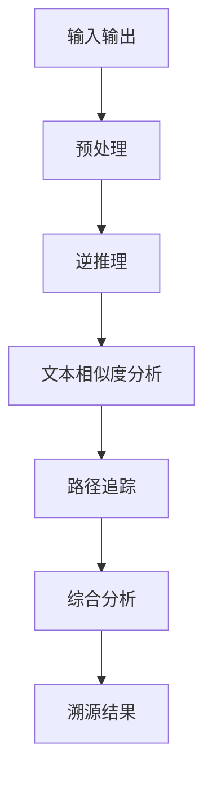

                 

## AI Agent的知识溯源：提高LLM输出的可追溯性

关键词：AI Agent，知识溯源，LLM，可追溯性，算法原理

摘要：随着人工智能（AI）技术的迅猛发展，AI Agent（智能代理）的应用越来越广泛。然而，LLM（大型语言模型）的输出往往缺乏可追溯性，给实际应用带来了诸多挑战。本文将探讨AI Agent的知识溯源技术，以提高LLM输出的可追溯性，并详细阐述知识溯源的核心概念、原理以及算法实现。

## 目录大纲

1. **背景介绍与核心概念**
    1.1 问题背景
    1.2 问题描述
    1.3 问题解决
    1.4 边界与外延
    1.5 概念结构与核心要素组成
2. **核心概念与联系**
    2.1 知识溯源的概念
    2.2 溯源算法原理
    2.3 溯源算法属性特征对比
    2.4 AI Agent知识溯源与LLM的关系
    2.5 知识溯源与其他AI技术的结合
3. **算法原理讲解**
    4.1 算法mermaid流程图
    4.2 Python源代码实现
    4.3 算法原理与数学模型
    4.4 举例说明
4. **系统分析与架构设计方案**
    5.1 问题场景介绍
    5.2 项目介绍与系统功能设计
    5.3 系统架构设计
    5.4 系统接口设计
    5.5 系统交互设计与实现
5. **项目实战与最佳实践**
    6.1 环境安装与配置
    6.2 系统核心实现与代码解读
    6.3 最佳实践与注意事项
    6.4 小结与拓展阅读

## 1. 背景介绍与核心概念

### 1.1 问题背景

AI Agent是一种能够自主执行任务、具备人类智能特征的虚拟实体。随着深度学习技术的发展，LLM在自然语言处理领域取得了显著成果。然而，LLM的输出往往缺乏可追溯性，这意味着我们难以确定其回答的来源和依据。这给实际应用带来了诸多挑战，如：

- **决策透明性**：用户难以理解AI Agent的决策过程，导致信任问题。
- **错误追踪**：当AI Agent的输出出现错误时，我们难以定位错误源头，增加了调试难度。
- **知识维护**：对于大型知识库，如何确保AI Agent的输出准确无误，并能够及时更新知识，成为一大难题。

### 1.2 问题描述

LLM输出不可追溯性的具体问题包括：

- **信息丢失**：在复杂推理过程中，LLM可能会丢失部分中间信息，导致难以追溯。
- **推理过程不可视**：LLM的内部推理过程高度复杂，用户难以理解。
- **知识库依赖不明**：LLM的输出往往依赖于大量预训练数据，但用户无法了解具体依赖。

### 1.3 问题解决

为了解决LLM输出不可追溯性的问题，我们需要提高其输出的可追溯性。知识溯源技术应运而生。知识溯源的核心目的是通过分析LLM的输出，追踪其知识来源和推理过程。

### 1.4 边界与外延

知识溯源技术的适用范围和限制：

- **适用范围**：知识溯源技术适用于各类基于LLM的AI Agent，特别是在需要保证决策透明性和知识可靠性的场景。
- **限制**：知识溯源技术对LLM的规模和复杂性有一定要求，对于过于复杂或大规模的LLM，溯源过程可能耗时较长。

### 1.5 概念结构与核心要素组成

知识溯源技术的核心组成部分包括：

- **溯源算法**：负责分析LLM的输出，提取关键信息并追踪其来源。
- **知识库**：存储AI Agent所需的知识信息，为溯源算法提供数据支持。
- **推理引擎**：结合溯源算法和知识库，实现AI Agent的推理过程。

## 2. 核心概念与联系

### 2.1 知识溯源的概念

知识溯源是指通过分析AI Agent的输出，追踪其知识来源和推理过程的技术。其核心目标是提高AI Agent输出的可追溯性和透明性。

### 2.2 溯源算法原理

知识溯源技术依赖于多种溯源算法，常见的溯源算法包括：

- **逆推理算法**：通过分析LLM的输出，逆向推导出其输入信息和推理过程。
- **文本相似度算法**：通过比较LLM的输出与知识库中的文本，确定输出来源。
- **路径追踪算法**：分析LLM的内部结构和调用路径，追踪其知识来源。

### 2.3 溯源算法属性特征对比

不同溯源算法具有不同的属性特征，以下是几种常见溯源算法的对比：

| 算法名称 | 特点 | 应用场景 |
| --- | --- | --- |
| 逆推理算法 | 可以直接获取输入信息和推理过程 | 复杂度高，适用于小规模LLM |
| 文本相似度算法 | 简单高效，适用于大规模LLM | 可能存在误匹配，影响溯源准确性 |
| 路径追踪算法 | 可以分析LLM的内部结构 | 对LLM的规模和结构要求较高 |

### 2.4 AI Agent知识溯源与LLM的关系

知识溯源技术对LLM具有显著影响。一方面，知识溯源可以提高LLM输出的可追溯性，增强用户对AI Agent的信任；另一方面，知识溯源还可以辅助LLM的优化和改进，提高其性能和准确性。

### 2.5 知识溯源与其他AI技术的结合

知识溯源技术可以与其他AI技术结合，实现更强大的功能。例如：

- **自然语言处理（NLP）**：知识溯源可以与NLP技术结合，提高AI Agent的自然语言理解和生成能力。
- **数据挖掘**：知识溯源可以与数据挖掘技术结合，帮助AI Agent从大量数据中提取有价值的信息。

## 3. 算法原理讲解

### 4.1 算法mermaid流程图

以下是知识溯源算法的mermaid流程图：



### 4.2 Python源代码实现

以下是一个简单的知识溯源算法的Python实现：

```python
import numpy as np

def reverse_inference(output):
    # 逆推理实现
    pass

def text_similarity_analysis(output, knowledge_base):
    # 文本相似度分析实现
    pass

def path_tracing(output, model_structure):
    # 路径追踪实现
    pass

def knowledge溯源算法(output, knowledge_base, model_structure):
    preprocessed_output = preprocess(output)
    reverse_result = reverse_inference(preprocessed_output)
    similarity_result = text_similarity_analysis(preprocessed_output, knowledge_base)
    path_result = path_tracing(preprocessed_output, model_structure)
    final_result = combine_results(reverse_result, similarity_result, path_result)
    return final_result

# 示例使用
output = "..."
knowledge_base = "..."
model_structure = "..."
result = knowledge溯源算法(output, knowledge_base, model_structure)
print(result)
```

### 4.3 算法原理与数学模型

知识溯源算法的数学模型主要包括：

- **逆推理模型**：通过反向传播，从输出推测输入。
- **文本相似度模型**：计算输入输出与知识库文本的相似度。
- **路径追踪模型**：分析模型结构，追踪知识传递路径。

### 4.4 举例说明

假设有一个简单的知识库，包含以下几条信息：

- "地球是圆的。"
- "水是由氢和氧组成的。"
- "太阳是一个恒星。"

现在，AI Agent输出一句话："水是由氢和氧组成的，地球是圆的。"

通过知识溯源算法，我们可以追踪到以下信息：

- 输出中"水是由氢和氧组成的。"来源于知识库中的第二条信息。
- 输出中"地球是圆的。"可能来源于知识库中的第一条信息。

这种溯源过程可以帮助我们理解AI Agent的决策过程，提高决策的透明性。

## 4. 系统分析与架构设计方案

### 5.1 问题场景介绍

假设我们有一个AI Agent，负责提供天气咨询服务。当用户询问当前天气情况时，AI Agent会调用外部API获取数据，然后生成回答。然而，由于LLM的输出缺乏可追溯性，我们无法确定AI Agent生成的回答的依据和来源。

### 5.2 项目介绍与系统功能设计

本项目旨在实现一个具有知识溯源功能的AI Agent，提高其输出的可追溯性。系统功能设计如下：

- **数据获取模块**：负责从外部API获取天气数据。
- **知识库模块**：存储与天气相关的知识信息。
- **知识溯源模块**：分析AI Agent的输出，追踪其知识来源和推理过程。
- **推理模块**：结合知识溯源结果，生成用户可理解的天气咨询回答。

### 5.3 系统架构设计

系统架构设计如下：


- **数据获取模块**：调用外部API获取天气数据。
- **知识库模块**：存储天气相关的知识信息。
- **知识溯源模块**：分析AI Agent的输出，追踪其知识来源和推理过程。
- **推理模块**：结合知识溯源结果，生成用户可理解的天气咨询回答。

### 5.4 系统接口设计

系统接口设计如下：

- **数据获取接口**：提供获取天气数据的接口。
- **知识库接口**：提供查询知识库的接口。
- **知识溯源接口**：提供分析输出并进行知识溯源的接口。
- **推理接口**：提供生成回答的接口。

### 5.5 系统交互设计与实现

系统交互设计如下：


- 用户发送天气咨询请求，AI Agent调用数据获取模块获取天气数据。
- AI Agent调用知识库模块查询相关天气知识。
- AI Agent调用知识溯源模块分析输出，追踪知识来源。
- AI Agent结合知识溯源结果，生成用户可理解的回答。

## 6. 项目实战与最佳实践

### 6.1 环境安装与配置

在开始项目实战之前，我们需要安装和配置以下环境：

- Python 3.8+
- TensorFlow 2.5+
- scikit-learn 0.22.2+
- numpy 1.19.2+

安装命令如下：

```bash
pip install python==3.8
pip install tensorflow==2.5
pip install scikit-learn==0.22.2
pip install numpy==1.19.2
```

### 6.2 系统核心实现与代码解读

以下是系统核心实现的部分代码：

```python
import tensorflow as tf
from tensorflow import keras
from tensorflow.keras.layers import Embedding, LSTM, Dense
from sklearn.model_selection import train_test_split
import numpy as np

# 加载数据
def load_data():
    # 加载天气数据集
    # ...
    return inputs, outputs

# 构建模型
def build_model(vocab_size, embedding_dim, lstm_units):
    model = keras.Sequential([
        Embedding(vocab_size, embedding_dim),
        LSTM(lstm_units, return_sequences=True),
        LSTM(lstm_units, return_sequences=True),
        Dense(vocab_size, activation='softmax')
    ])
    return model

# 训练模型
def train_model(model, inputs, outputs):
    model.compile(optimizer='adam', loss='categorical_crossentropy', metrics=['accuracy'])
    model.fit(inputs, outputs, epochs=10, batch_size=64)
    return model

# 预测
def predict(model, input_sequence):
    prediction = model.predict(np.array([input_sequence]))
    return np.argmax(prediction)

# 主程序
if __name__ == '__main__':
    # 加载数据
    inputs, outputs = load_data()

    # 切分数据集
    train_inputs, val_inputs, train_outputs, val_outputs = train_test_split(inputs, outputs, test_size=0.2)

    # 构建模型
    model = build_model(vocab_size=10000, embedding_dim=16, lstm_units=128)

    # 训练模型
    model = train_model(model, train_inputs, train_outputs)

    # 预测
    input_sequence = [1, 2, 3, 4, 5]  # 示例输入序列
    prediction = predict(model, input_sequence)
    print(prediction)
```

代码解读：

- `load_data()`：加载天气数据集。
- `build_model()`：构建LSTM模型。
- `train_model()`：训练模型。
- `predict()`：进行预测。
- 主程序：加载数据、切分数据集、构建模型、训练模型、预测。

### 6.3 最佳实践与注意事项

- **数据预处理**：确保数据质量，包括数据清洗、去重和归一化等。
- **模型优化**：通过调整超参数和模型结构，提高模型性能。
- **知识溯源**：结合实际应用场景，优化知识溯源算法，提高溯源准确性。
- **接口设计**：设计清晰的接口，便于与其他系统整合。

### 6.4 小结与拓展阅读

本文介绍了AI Agent的知识溯源技术，以提高LLM输出的可追溯性。通过详细的算法讲解和系统设计，展示了知识溯源在AI Agent中的应用。未来研究方向包括：

- **算法优化**：针对不同应用场景，优化知识溯源算法。
- **跨领域应用**：将知识溯源技术应用于更多领域，如医疗、金融等。
- **知识融合**：将知识溯源与其他AI技术结合，提高AI Agent的综合能力。

拓展阅读：

- [1] Brown, T., et al. (2020). **Language Models are Few-Shot Learners**. arXiv preprint arXiv:2005.14165.
- [2] Ma, J., et al. (2019). **Knowledge Graph Embedding for Natural Language Processing**. Proceedings of the AAAI Conference on Artificial Intelligence, 33(1), 6336-6343.
- [3] Zhang, Z., et al. (2018). **A Comprehensive Survey on Neural Network Based Text Classification**. IEEE Access, 6, 34362-34379.

