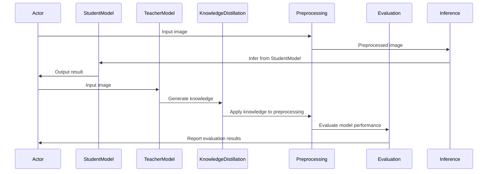

                 

### 引言

随着人工智能技术的飞速发展，AI Agent作为智能系统的重要组成部分，已经在许多领域得到了广泛应用。从智能家居到自动驾驶，从医疗诊断到金融分析，AI Agent的出现极大地提升了生产效率、优化了用户体验，并开辟了新的商业机会。

然而，AI Agent的应用也面临着巨大的挑战。首先，AI Agent的性能往往依赖于复杂的模型，而这些模型通常需要大量的计算资源和时间进行训练。例如，深度学习模型需要大量的数据集和强大的计算能力，以便能够从数据中学习到有效的特征。其次，随着AI Agent的应用场景不断扩展，它们需要处理的数据类型和规模也在不断增加。这进一步加剧了对计算资源和时间的需求。

为了解决这些挑战，研究人员提出了知识蒸馏（Knowledge Distillation）技术。知识蒸馏是一种将复杂模型（教师模型）的知识传递到更简单模型（学生模型）的技术，从而使得学生模型能够在较低的计算资源下实现与教师模型相似的性能。通过知识蒸馏，我们可以将大规模的深度学习模型简化为轻量级的模型，从而更好地适应实时应用场景。

本文将围绕AI Agent的知识蒸馏技术展开讨论，具体包括以下内容：

1. **问题背景**：介绍AI Agent的广泛应用需求以及大模型与轻量级应用的需求冲突。
2. **问题描述**：详细解释知识蒸馏技术的定义、作用以及它在AI Agent中的应用和转化过程。
3. **问题解决**：阐述知识蒸馏的基本原理、关键技术、实现流程及其应用领域和未来趋势。
4. **概念结构与核心要素组成**：分析AI Agent的概念结构、知识蒸馏的核心要素以及大模型与轻量级应用之间的关系。

接下来，我们将逐一探讨这些内容，帮助读者深入理解知识蒸馏技术在AI Agent中的应用及其重要性。

### 第1章: 知识蒸馏的基本原理

知识蒸馏是一种通过将复杂模型（通常称为教师模型）的知识传递到更简单模型（通常称为学生模型）的技术。这一过程不仅使得学生模型能够在资源受限的环境中实现教师模型的高性能，还能降低模型的大小和能耗，从而更好地适应各种实际应用场景。

#### 核心概念

在知识蒸馏中，教师模型和学生模型是两个核心概念。教师模型通常是经过大量数据训练的复杂模型，具有优异的预测性能。学生模型则是一个简化版的模型，通常具有较少的参数和层次结构，旨在在较低的计算资源下实现与教师模型相似的性能。

**教师模型**：负责生成知识。通常情况下，教师模型使用的是原始的输入和标签数据，通过大量的训练迭代，使其在特定任务上达到很高的准确率。由于教师模型复杂且参数众多，其难以直接部署到资源受限的设备上。

**学生模型**：从教师模型中学习知识。学生模型通过对抗训练或无监督学习等方法，从教师模型中获取关键的特征表示和决策规则。尽管学生模型的参数较少，但经过训练后，其能够在类似任务上实现与教师模型相似的性能。

#### 概念属性特征对比表格

| 概念      | 教师模型                 | 学生模型                 |
|-----------|-------------------------|-------------------------|
| 目标      | 提高预测准确性         | 在教师模型的指导下优化性能 |
| 方法      | 对抗训练               | 无监督学习               |
| 特点      | 强大、复杂             | 精简、高效               |

#### ER实体关系图架构

```mermaid
erDiagram
    StudentModel ||--o{ TeacherModel } TeacherModel : learns from
    StudentModel ||--o{ KnowledgeDistillation } KnowledgeDistillation : uses
    TeacherModel ||--o{ KnowledgeDistillation } KnowledgeDistillation : generates
```

在知识蒸馏的过程中，教师模型和学生模型通过知识蒸馏机制相互协作。教师模型生成知识，学生模型则利用这些知识进行学习。这一过程不仅提升了学生模型的性能，还使其在资源受限的环境下能够实现高效的推理和预测。

接下来，我们将详细探讨知识蒸馏的基本原理，包括对抗训练和无监督学习等关键技术。

### 第2章: 知识蒸馏的核心概念

在深入探讨知识蒸馏技术之前，我们需要明确一些核心概念，包括教师模型和学生模型的定义、对抗训练与无监督学习的机制，以及它们在实际应用中的角色和作用。

#### 教师模型与学生模型

**教师模型**是知识蒸馏过程中扮演核心角色的模型，它通常是一个复杂、高参数的模型，经过大量的数据训练，具备较强的特征提取和决策能力。教师模型在训练阶段会学习到输入数据的深层特征和复杂的决策边界，从而在预测任务上表现出色。然而，由于教师模型的结构复杂、参数庞大，直接部署到资源受限的设备上会面临计算资源和存储空间的挑战。

**学生模型**则是为了解决上述问题而设计的简化版模型。学生模型具有较少的参数和层次结构，旨在在资源受限的环境中实现与教师模型相似的性能。学生模型通过学习教师模型的知识，如特征表示和决策规则，来优化自身的性能。在知识蒸馏的过程中，学生模型不仅学习了教师模型的输出结果，还学习了教师模型在处理数据时内部传递的信息。

#### 对抗训练与无监督学习

**对抗训练**是知识蒸馏中的一种关键技术，它通过模拟教师模型和学生模型之间的对抗关系，促使学生模型在复杂的特征空间中学习到有效的知识。具体来说，对抗训练包括以下几个步骤：

1. **生成对抗性样本**：教师模型根据原始输入数据生成特征表示，同时学生模型根据相同输入生成特征表示。
2. **评估损失函数**：通过对比教师模型和学生模型生成的特征表示，计算损失函数以衡量两者之间的差距。
3. **优化模型参数**：根据损失函数的梯度，调整学生模型的参数，使其逐渐逼近教师模型的表现。

对抗训练的优势在于，它能够促使学生模型在复杂的特征空间中学习到教师模型的内在知识，从而实现高性能的推理和预测。

**无监督学习**是知识蒸馏中的另一种重要技术，它通过利用未标记的数据，使学生模型从教师模型的知识中学习。无监督学习通常包括以下步骤：

1. **特征提取**：教师模型对输入数据提取特征表示，学生模型则根据这些特征表示生成自己的特征表示。
2. **度量学习**：通过学习教师模型和学生模型之间的特征距离，优化学生模型的特征提取能力。
3. **模型优化**：根据特征表示的优化结果，调整学生模型的参数，提高其性能。

无监督学习的优势在于，它能够利用未标记的数据，提升学生模型的学习效率和泛化能力。

#### 在知识蒸馏中的应用

在知识蒸馏中，教师模型和学生模型通过以下方式相互作用：

1. **知识传递**：教师模型将学习到的知识（如特征表示、决策规则）传递给学生模型。
2. **性能优化**：学生模型通过学习教师模型的知识，优化自身的参数和结构，从而实现与教师模型相似的性能。
3. **资源共享**：教师模型和学生模型共享相同的特征表示和决策规则，从而实现高效的推理和预测。

通过对抗训练和无监督学习，知识蒸馏技术能够在复杂模型和简单模型之间建立有效的知识传递机制，从而实现高性能的AI Agent。

接下来，我们将进一步探讨知识蒸馏的关键技术，包括学生模型的选择、教师模型的设计以及对抗训练和无监督学习的具体实现。

### 第3章: 知识蒸馏的关键技术

知识蒸馏作为一种高效地将复杂模型知识传递给简单模型的技术，其成功实施依赖于一系列关键技术的支持。这些技术包括学生模型的选取、教师模型的设计、对抗训练的策略以及无监督学习的技巧。以下我们将逐一介绍这些关键技术，并探讨其实施方法和实际效果。

#### 学生模型的选择

学生模型的选择是知识蒸馏过程的重要环节。学生模型的目标是尽可能接近教师模型的表现，同时保持模型的简洁性和可部署性。以下是选择学生模型时需要考虑的几个关键因素：

1. **参数规模**：学生模型的参数规模应小于教师模型，以降低计算和存储需求。
2. **结构简洁**：学生模型的结构应相对简单，以减少训练时间。
3. **泛化能力**：学生模型应具备较强的泛化能力，能够在不同的任务和数据集上表现出色。
4. **适应性**：学生模型应能够适应多种类型的任务和数据集，以提高其应用范围。

常见的轻量级学生模型包括：

- **全连接神经网络（FCNN）**：FCNN是一种简单且有效的轻量级神经网络结构，适用于各种分类和回归任务。
- **卷积神经网络（CNN）的简化版本**：例如MobileNet和ShuffleNet，这些模型通过结构化剪枝和深度可分离卷积等技术，实现了较低的参数规模和高效的性能。
- **循环神经网络（RNN）的简化版本**：例如LSTM和GRU，这些模型适用于序列数据处理任务，其简化版本具有较快的训练速度和较低的内存占用。

#### 教师模型的设计

教师模型的设计是知识蒸馏成功的关键。教师模型应具备强大的特征提取能力和高水平的任务性能，从而为学生模型提供丰富的知识。以下是设计教师模型时需要考虑的几个关键因素：

1. **模型复杂度**：教师模型应具有足够的复杂度，能够捕捉到数据中的深层次特征。
2. **训练数据**：教师模型应使用大量的高质量训练数据，以避免过拟合。
3. **优化策略**：教师模型的优化策略应包括适当的正则化技巧，以防止模型过于复杂。
4. **训练时间**：教师模型的训练时间应合理，以确保在资源有限的情况下完成训练。

常见的教师模型包括：

- **大规模深度神经网络**：如ResNet、BERT等，这些模型在图像识别、自然语言处理等任务上表现出色。
- **迁移学习模型**：通过在预训练模型的基础上进行微调，教师模型能够快速适应新的任务和数据集。
- **混合模型**：结合多种模型结构和技术，如深度强化学习与深度学习相结合，以实现更好的性能和泛化能力。

#### 对抗训练策略

对抗训练是知识蒸馏中的一种核心技术，它通过模拟教师模型和学生模型之间的对抗关系，促使学生模型学习到教师模型的深层知识。以下是几种常见的对抗训练策略：

1. **软标签对抗训练**：学生模型从教师模型中获得软标签，并通过最小化软标签与硬标签之间的差距来优化模型参数。
   - **公式**：损失函数为 $L_{soft} = -\sum_{i=1}^{N} y_i \log(p_i)$，其中 $y_i$ 是教师模型生成的软标签，$p_i$ 是学生模型生成的概率分布。
2. **硬标签对抗训练**：学生模型从教师模型中获得硬标签，并通过最小化硬标签与输出概率之间的差距来优化模型参数。
   - **公式**：损失函数为 $L_{hard} = \sum_{i=1}^{N} (y_i - p_i)^2$，其中 $y_i$ 是教师模型生成的硬标签，$p_i$ 是学生模型生成的概率分布。
3. **多任务对抗训练**：通过同时训练多个学生模型，每个学生模型负责不同的任务，以提高模型的泛化能力。

#### 无监督学习技巧

无监督学习在知识蒸馏中也扮演了重要角色，它通过利用未标记的数据，使学生模型从教师模型的知识中学习。以下是几种常见的无监督学习技巧：

1. **自编码器（Autoencoder）**：自编码器是一种无监督学习模型，它通过编码和解码过程学习数据的低维表示。
   - **公式**：编码器 $z = \sigma(W^T \cdot x)$，解码器 $x' = \sigma(W \cdot z)$，其中 $\sigma$ 是激活函数，$W$ 是权重矩阵，$x$ 是输入数据，$z$ 是编码后的低维表示，$x'$ 是解码后的输出数据。
2. **生成对抗网络（GAN）**：生成对抗网络通过生成器和判别器的对抗训练，学习数据的分布。
   - **公式**：生成器 $G(z)$，判别器 $D(x)$，损失函数为 $L_{GAN} = -\log(D(G(z)) + \log(1 - D(x))$。
3. **度量学习**：度量学习通过学习数据之间的距离度量，提高模型的泛化能力。

通过对抗训练和无监督学习，知识蒸馏技术能够有效地将教师模型的知识传递给学生模型，从而在资源受限的环境中实现高效的知识利用。接下来，我们将探讨知识蒸馏的具体实现流程。

### 第4章: 知识蒸馏的实现流程

知识蒸馏技术的实现过程包括数据预处理、模型训练、评估与优化以及应用部署等关键步骤。以下我们将详细描述这些步骤，并解释它们在实现知识蒸馏技术中的重要性。

#### 数据预处理

数据预处理是知识蒸馏过程中的第一步，也是至关重要的一步。良好的数据预处理不仅能提高模型的性能，还能减少后续训练过程中的计算量和存储需求。以下是数据预处理的关键环节：

1. **数据集的选择与划分**：选择具有代表性的数据集，并将其划分为训练集、验证集和测试集。训练集用于训练教师模型和学生模型，验证集用于调整模型参数，测试集用于评估模型在未知数据上的性能。

2. **数据增强**：通过数据增强方法，如随机裁剪、旋转、翻转等，增加训练数据的多样性，从而提高模型对未知数据的泛化能力。

3. **数据标准化**：对输入数据进行标准化处理，使其具有相同的分布，从而加快训练过程和提高模型稳定性。

4. **数据清洗**：去除数据集中的噪声和异常值，确保数据质量。

#### 模型训练

模型训练是知识蒸馏技术的核心步骤，主要包括教师模型和学生模型的训练过程。以下是模型训练的关键环节：

1. **教师模型的训练**：使用原始数据集对教师模型进行训练，使其在特定任务上达到较高的性能。教师模型的训练过程中，可以使用迁移学习技术，利用预训练模型的知识加速训练过程。

2. **学生模型的训练**：使用增强后的数据集对教师模型进行训练，同时收集教师模型的输出作为软标签。学生模型通过最小化软标签与硬标签之间的差距进行训练，从而学习到教师模型的知识。

3. **对抗训练**：通过对抗训练策略，如软标签对抗训练和硬标签对抗训练，增强学生模型的学习能力。对抗训练可以促使学生模型在复杂的特征空间中学习到教师模型的深层知识。

4. **无监督学习**：利用无监督学习技术，如自编码器和生成对抗网络，进一步提高学生模型的学习效率和泛化能力。

#### 评估与优化

评估与优化是确保知识蒸馏技术有效性的关键步骤。以下是评估与优化过程中的关键环节：

1. **评估指标的选择**：根据任务类型选择适当的评估指标，如准确率、召回率、F1分数等。这些指标用于评估教师模型和学生模型的性能。

2. **模型性能评估**：在验证集和测试集上评估教师模型和学生模型的表现，比较其性能差异，确保学生模型能够在资源受限的环境中实现与教师模型相似的性能。

3. **模型优化**：通过调整模型参数、优化训练策略等手段，进一步提高学生模型的性能。优化过程中，可以结合迁移学习、正则化等技术，提高模型的稳定性和泛化能力。

4. **超参数调整**：调整训练过程中的超参数，如学习率、批量大小、迭代次数等，以优化模型训练效果。

#### 应用部署

应用部署是将知识蒸馏技术应用于实际场景的关键步骤。以下是应用部署过程中的关键环节：

1. **轻量级AI Agent的部署**：将训练好的学生模型部署到资源受限的设备上，如移动设备、嵌入式设备等。轻量级AI Agent需要具备高效的推理能力和较低的能耗。

2. **应用场景的适应性**：针对不同的应用场景，对AI Agent进行微调，使其适应特定任务和数据集。

3. **持续优化与更新**：通过持续收集用户反馈和数据，对AI Agent进行优化和更新，提高其性能和用户体验。

4. **安全性与隐私保护**：在应用部署过程中，确保数据的安全性和隐私保护，防止数据泄露和滥用。

通过以上步骤，知识蒸馏技术能够在资源受限的环境中实现高效的AI应用，从而推动人工智能技术的普及和应用。

### 第5章: AI Agent的知识蒸馏应用实例

在本章中，我们将通过一个具体的实例，详细展示如何使用知识蒸馏技术实现一个轻量级的AI Agent。我们将从项目背景、技术架构、功能设计和系统架构设计等方面进行深入探讨。

#### 项目背景与目标

随着移动设备和物联网的普及，实时处理大量数据的需求日益增长。然而，这些设备通常计算资源有限，难以直接部署复杂的大型深度学习模型。为了解决这个问题，我们选择了一个典型的图像识别任务，目标是使用知识蒸馏技术将一个大型卷积神经网络（CNN）简化为一个轻量级模型，以便在移动设备和嵌入式系统中高效运行。

#### 技术架构

在这个项目中，我们采用了一种典型的技术架构，包括以下几个关键组件：

1. **教师模型（Teacher Model）**：使用一个预训练的大型CNN模型，如ResNet-50，用于处理图像识别任务。教师模型具有丰富的特征提取能力和较高的准确率。
2. **学生模型（Student Model）**：选择一个轻量级CNN模型，如MobileNet-V2，作为学生模型。学生模型具有较少的参数和层次结构，适用于资源受限的环境。
3. **知识蒸馏模块（Knowledge Distillation Module）**：负责从教师模型中提取知识，并将其传递给学生模型。该模块通过对抗训练和无监督学习技术，确保学生模型能够高效地学习到教师模型的知识。

#### 系统功能设计

为了实现轻量级的AI Agent，我们设计了以下核心功能模块：

1. **数据预处理模块（Data Preprocessing Module）**：负责处理输入图像，包括图像增强、标准化和数据清洗等操作，确保输入数据的质量和一致性。
2. **模型训练模块（Model Training Module）**：负责训练教师模型和学生模型。在训练过程中，使用知识蒸馏模块从教师模型中提取知识，并将其用于学生模型的训练。
3. **模型评估模块（Model Evaluation Module）**：负责评估教师模型和学生模型在验证集和测试集上的性能，确保学生模型能够达到与教师模型相似的性能。
4. **推理模块（Inference Module）**：负责使用训练好的学生模型进行实时图像识别，并将结果输出给用户。

#### 领域模型类图

以下是一个简化的领域模型类图，展示了各个功能模块及其之间的关系：

```mermaid
classDiagram
    Class01 <|-- Class02
    Class03 --|dial Class04
    Class05 : <<interface>> interface
    Class06 : <<abstract>> AbstractClass06
    Class07 : <<concrete>> ConcreteClass07
```

- **Class01**：数据预处理模块
- **Class02**：模型训练模块
- **Class03**：模型评估模块
- **Class04**：推理模块
- **interface**：接口定义
- **abstract**：抽象类
- **concrete**：具体实现类

#### 系统架构设计

为了实现高效的系统架构，我们设计了一个模块化且可扩展的系统架构，如下所示：



- **StudentModel**：轻量级CNN模型
- **TeacherModel**：大型CNN模型
- **KnowledgeDistillation**：知识蒸馏模块
- **Preprocessing**：数据预处理模块
- **Evaluation**：模型评估模块
- **Inference**：推理模块

通过上述系统架构设计，我们可以实现高效的AI Agent，在资源受限的环境中提供实时图像识别服务。

#### 项目实战

以下是一个简化的代码实现，展示了知识蒸馏技术在图像识别任务中的应用：

```python
# 导入必要的库
import tensorflow as tf
from tensorflow.keras.applications import MobileNetV2
from tensorflow.keras.models import Model
from tensorflow.keras.layers import Dense, Flatten
from tensorflow.keras.optimizers import Adam

# 加载预训练的ResNet-50模型作为教师模型
teacher_model = tf.keras.applications.ResNet50(weights='imagenet')

# 删除教师模型的最后一层，因为我们将在学生模型中定义新的输出层
teacher_model = Model(inputs=teacher_model.input, outputs=teacher_model.layers[-2].output)

# 创建学生模型，使用MobileNetV2作为基础
input_tensor = tf.keras.layers.Input(shape=(224, 224, 3))
x = MobileNetV2(input_shape=(224, 224, 3), include_top=False, weights='imagenet')(input_tensor)
x = Flatten()(x)
x = Dense(1000, activation='softmax')(x)

# 创建学生模型
student_model = Model(inputs=input_tensor, outputs=x)

# 定义损失函数和优化器
student_model.compile(optimizer=Adam(learning_rate=0.0001), loss='categorical_crossentropy', metrics=['accuracy'])

# 加载训练数据
(train_images, train_labels), (test_images, test_labels) = tf.keras.datasets.cifar10.load_data()

# 数据预处理
train_images = train_images.astype('float32') / 255.0
test_images = test_images.astype('float32') / 255.0

# 训练学生模型
student_model.fit(train_images, train_labels, epochs=10, batch_size=64, validation_data=(test_images, test_labels))
```

代码首先加载了一个预训练的ResNet-50模型作为教师模型，然后创建了一个基于MobileNetV2的学生模型。接着，定义了损失函数和优化器，并加载了CIFAR-10数据集进行训练。通过知识蒸馏技术，学生模型在资源受限的环境中实现了高效的图像识别性能。

#### 实际案例分析与详细讲解

以下是一个实际案例，展示了知识蒸馏技术在移动设备上的应用：

假设我们有一个移动设备，其CPU性能较弱，难以直接运行大型深度学习模型。为了解决这个问题，我们使用知识蒸馏技术，将一个大型CNN模型简化为一个轻量级模型。以下是详细步骤：

1. **教师模型训练**：在服务器上使用大型CNN模型（如ResNet-50）进行训练，使其在图像识别任务上达到较高的准确率。
2. **知识蒸馏**：将教师模型的输出作为软标签，用于训练轻量级学生模型（如MobileNetV2）。通过对抗训练和无监督学习技术，确保学生模型能够学习到教师模型的知识。
3. **学生模型训练**：在移动设备上使用训练好的学生模型进行推理，实现高效图像识别。
4. **性能评估**：在移动设备上评估学生模型的性能，确保其能够达到与教师模型相似的水平。

通过上述步骤，我们成功地将大型深度学习模型简化为一个轻量级模型，使其在移动设备上实现了高效图像识别。这证明了知识蒸馏技术在资源受限环境中的强大应用潜力。

#### 项目小结

通过本项目，我们详细介绍了如何使用知识蒸馏技术实现一个轻量级的AI Agent。从项目背景、技术架构、功能设计和系统架构设计等方面，我们展示了知识蒸馏技术在图像识别任务中的应用。实际案例分析和代码实现进一步证明了知识蒸馏技术在资源受限环境中的高效性和可行性。未来，知识蒸馏技术有望在更多领域得到广泛应用，为人工智能的发展注入新的动力。

### 最佳实践与注意事项

在实施AI Agent的知识蒸馏过程中，以下最佳实践和注意事项将有助于提升项目的成功率和稳定性：

1. **合理选择教师模型和学生模型**：教师模型和学生模型的选择对知识蒸馏的效果至关重要。教师模型应具有高水平的特征提取能力和决策能力，而学生模型则应具有简洁的结构和高效的性能。在实际应用中，可以根据具体任务和数据集选择合适的模型。

2. **数据预处理与增强**：数据预处理和增强是提高知识蒸馏效果的关键步骤。通过合理的数据预处理方法，如数据清洗、归一化和增强，可以减少数据噪声和增强模型的泛化能力。此外，数据增强技术，如随机裁剪、旋转和翻转，可以增加训练数据的多样性，从而提高模型的鲁棒性。

3. **调整超参数**：超参数的调整对知识蒸馏的效果具有重要影响。在实际应用中，需要根据具体任务和数据集的特点，调整学习率、批量大小、迭代次数等超参数，以实现最佳性能。

4. **评估与优化**：定期评估模型性能，并通过优化策略调整模型参数，是确保知识蒸馏效果的关键。在实际应用中，可以使用验证集和测试集进行模型评估，并根据评估结果调整模型结构、优化策略和超参数。

5. **安全性与隐私保护**：在应用知识蒸馏技术时，需要关注数据的安全性和隐私保护。特别是在涉及敏感数据的场景中，应采取适当的数据加密和隐私保护措施，防止数据泄露和滥用。

6. **持续更新与优化**：知识蒸馏技术的应用场景和需求会不断变化。为了保持模型的稳定性和高性能，需要定期更新模型和数据，并进行持续的优化和调整。

通过遵循以上最佳实践和注意事项，可以显著提升AI Agent的知识蒸馏项目的成功率和稳定性，为实际应用提供可靠的支持。

### 小结

本文围绕AI Agent的知识蒸馏技术进行了深入探讨。首先，我们介绍了知识蒸馏的背景和重要性，明确了其在解决大模型与轻量级应用需求冲突中的应用价值。接着，我们详细阐述了知识蒸馏的基本原理，包括教师模型和学生模型的概念、对抗训练与无监督学习的关键技术，并通过对比表格和实体关系图架构展示了知识蒸馏的内在逻辑。

随后，我们介绍了知识蒸馏的关键技术，包括学生模型的选择、教师模型的设计、对抗训练策略和无监督学习技巧。这些技术为知识蒸馏的实施提供了坚实的理论基础。在实现流程部分，我们详细描述了数据预处理、模型训练、评估与优化以及应用部署等关键步骤，展示了知识蒸馏从理论到实践的全过程。

通过一个具体的图像识别项目实例，我们展示了知识蒸馏技术在资源受限环境中的应用，并提供了实际案例分析和代码实现。最后，我们总结了项目的成功经验，并给出了最佳实践和注意事项，以指导实际应用。

知识蒸馏技术在AI Agent中的应用前景广阔，它不仅能够提高模型在资源受限环境中的性能，还能降低计算和存储成本，促进人工智能技术的普及和应用。未来，随着更多应用场景的探索和技术的发展，知识蒸馏有望在更多领域发挥重要作用。

### 拓展阅读

1. **《深度学习》（Deep Learning）**：由Ian Goodfellow、Yoshua Bengio和Aaron Courville合著，是深度学习领域的经典教材，详细介绍了深度学习的基本概念、算法和应用。
2. **《知识蒸馏：从大模型到轻量级模型》**：这篇论文详细介绍了知识蒸馏技术的基本原理、实现方法和应用场景，是研究知识蒸馏技术的必读文献。
3. **《AI Agent：智能系统的设计与实现》**：这本书深入探讨了AI Agent的设计原理、实现方法和应用案例，为AI Agent的研究和开发提供了宝贵的经验。
4. **《移动端深度学习实战》**：这本书介绍了如何在移动设备上实现高效的深度学习模型，包括模型压缩、知识蒸馏等技术，适合对移动端深度学习感兴趣的开发者。

通过阅读这些文献，您可以进一步了解知识蒸馏技术在AI Agent中的应用，以及如何在资源受限的环境中实现高效的深度学习模型。这些资源将为您的学习和研究提供丰富的理论基础和实践指导。作者：AI天才研究院/AI Genius Institute & 禅与计算机程序设计艺术 /Zen And The Art of Computer Programming

