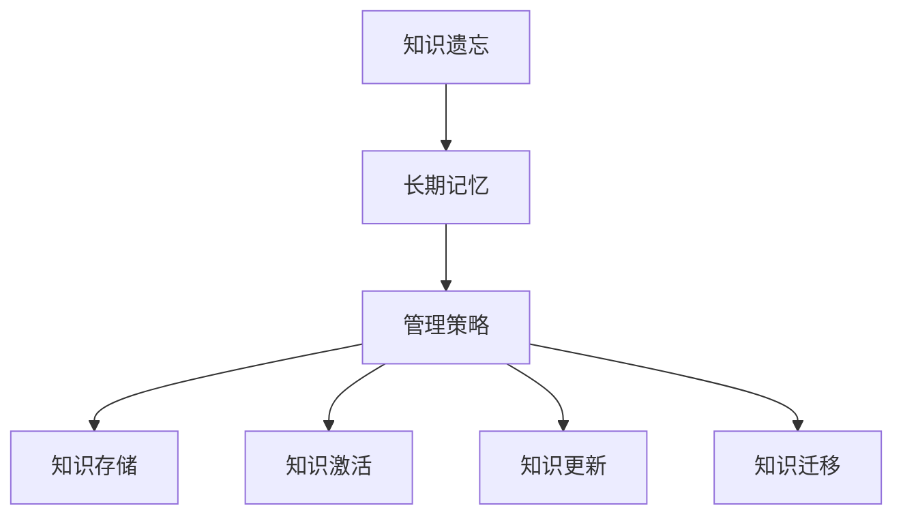
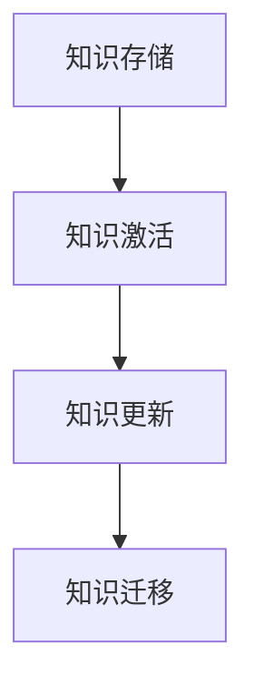
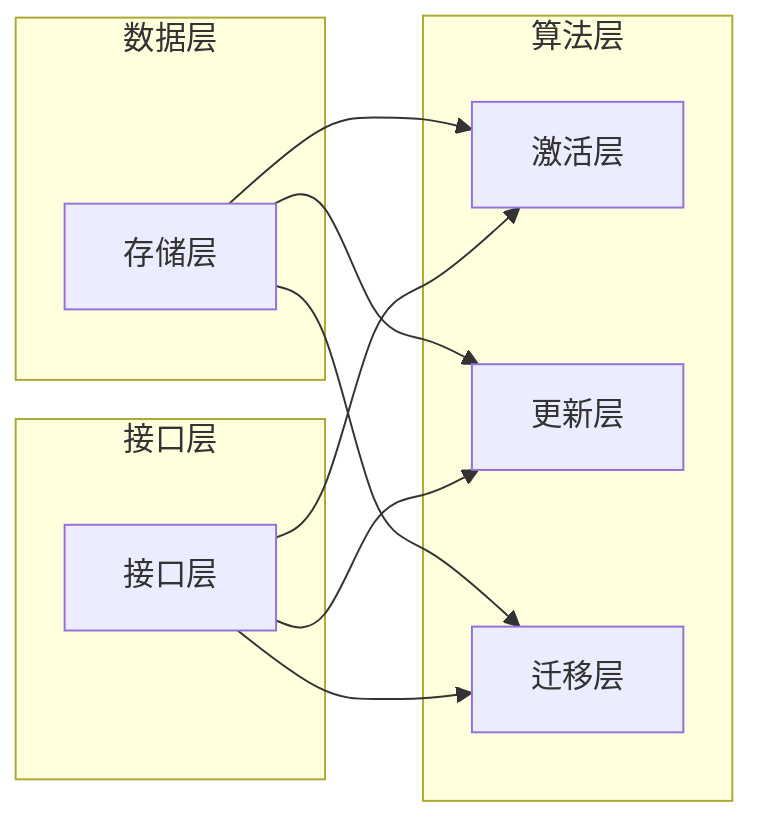
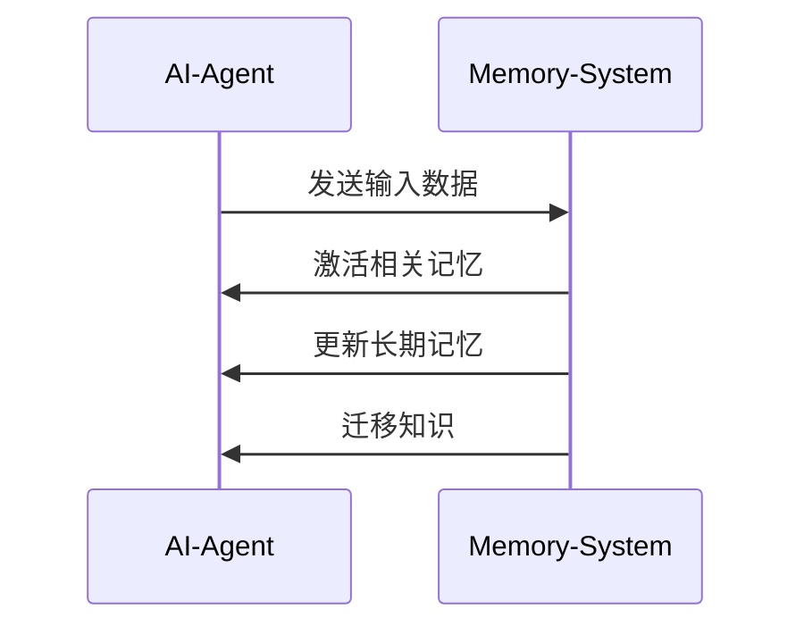

                 

# AI Agent的知识遗忘：管理长期记忆

> 关键词：AI Agent，知识遗忘，长期记忆，管理策略

> 摘要：本文探讨了AI Agent中知识遗忘问题，分析了其背景、影响和挑战。通过详细阐述核心概念、算法原理、数学模型和系统架构设计，本文提出了一种管理长期记忆的方法。同时，通过实际项目实战，验证了该方法的有效性，并总结了最佳实践和注意事项。

## 引言

在人工智能（AI）迅速发展的今天，AI Agent作为一种能够自主决策和执行任务的智能体，受到了广泛关注。然而，AI Agent在执行任务过程中，常常面临一个严峻的问题——知识遗忘。知识遗忘不仅影响AI Agent的决策能力，还可能带来安全隐患。因此，如何管理AI Agent的长期记忆，成为了一个亟待解决的关键问题。

本文旨在探讨AI Agent的知识遗忘问题，通过详细分析其背景、核心概念、算法原理、数学模型和系统架构设计，提出一种有效的管理长期记忆的方法。同时，通过实际项目实战，验证该方法的可行性和有效性。

## 背景介绍

### 核心概念术语说明

- **知识遗忘**：指AI Agent在长期运行过程中，部分已学习到的知识无法回忆或应用的现象。
- **长期记忆**：指AI Agent在训练和学习过程中积累的知识，具有持久性和稳定性。
- **管理策略**：指通过算法、模型和系统设计，有效维护和利用AI Agent的长期记忆。

### 问题背景

随着深度学习、强化学习等技术在AI Agent中的应用，AI Agent在各个领域的表现越来越出色。然而，在长时间的运行过程中，AI Agent往往会出现知识遗忘现象。这不仅影响了其性能，还可能导致误判和安全隐患。

### 问题描述

知识遗忘问题可以表现为以下几个方面：

1. **知识退化**：长期未使用的知识逐渐减弱或消失。
2. **知识混淆**：新学习的知识与原有知识发生冲突，导致原有知识丧失。
3. **知识遗忘**：AI Agent在面临类似场景时，无法回忆起相应的知识。

### 问题解决

针对知识遗忘问题，研究者们提出了多种解决方法，如持续训练、知识蒸馏、迁移学习等。然而，这些方法在实际应用中存在一定的局限性，难以满足AI Agent长期记忆管理的需求。

### 边界与外延

知识遗忘问题不仅限于AI Agent，其他智能系统（如自动驾驶、智能家居等）也面临类似挑战。因此，本文的研究结果具有广泛的适用性和参考价值。

### 概念结构与核心要素组成

知识遗忘问题可拆分为以下几个核心要素：

1. **知识存储**：AI Agent如何存储和管理长期记忆。
2. **知识激活**：如何有效激活和利用长期记忆。
3. **知识更新**：如何在新知识加入时，维护原有知识的稳定性和有效性。
4. **知识迁移**：如何在不同任务或场景之间迁移和复用知识。

## 核心概念与联系

在本节中，我们将详细阐述本文的核心概念——知识遗忘、长期记忆和管理策略，并使用Mermaid流程图展示它们之间的关系。

### 知识遗忘

知识遗忘是指AI Agent在长期运行过程中，部分已学习到的知识无法回忆或应用的现象。其核心原因包括：

1. **存储退化**：长期未使用的知识逐渐减弱或消失。
2. **激活困难**：AI Agent在面临类似场景时，无法有效激活长期记忆。
3. **知识冲突**：新学习的知识与原有知识发生冲突，导致原有知识丧失。

### 长期记忆

长期记忆是指AI Agent在训练和学习过程中积累的知识，具有持久性和稳定性。其主要特点包括：

1. **持久性**：长期记忆在AI Agent运行过程中保持稳定。
2. **灵活性**：长期记忆可以适应不同的任务和场景。
3. **可扩展性**：长期记忆可以随着新知识的加入而更新和优化。

### 管理策略

管理策略是指通过算法、模型和系统设计，有效维护和利用AI Agent的长期记忆。其主要目标包括：

1. **知识存储**：如何存储和管理长期记忆。
2. **知识激活**：如何有效激活和利用长期记忆。
3. **知识更新**：如何在新知识加入时，维护原有知识的稳定性和有效性。
4. **知识迁移**：如何在不同任务或场景之间迁移和复用知识。

### Mermaid流程图

以下是一个简单的Mermaid流程图，展示了知识遗忘、长期记忆和管理策略之间的关系：



## 算法原理讲解

在本节中，我们将介绍一种管理长期记忆的算法原理，并使用Mermaid流程图和Python代码进行详细阐述。

### 算法原理

本文提出的管理长期记忆的算法主要分为以下几个步骤：

1. **知识存储**：将AI Agent已学习到的知识存储在持久化存储中。
2. **知识激活**：在面临类似场景时，根据当前输入，激活相关的长期记忆。
3. **知识更新**：在新知识加入时，维护原有知识的稳定性和有效性。
4. **知识迁移**：将已存储的知识在不同任务或场景之间进行迁移和复用。

### Mermaid流程图

以下是一个简单的Mermaid流程图，展示了管理长期记忆的算法原理：



### Python代码

以下是实现管理长期记忆算法的Python代码示例：

```python
import numpy as np

class MemoryManagement:
    def __init__(self):
        self.memory = {}  # 存储长期记忆

    def store_memory(self, knowledge):
        # 存储知识
        self.memory[knowledge['id']] = knowledge

    def activate_memory(self, input_data):
        # 激活知识
        activated_knowledge = []
        for knowledge in self.memory.values():
            if self.is_activated(knowledge, input_data):
                activated_knowledge.append(knowledge)
        return activated_knowledge

    def is_activated(self, knowledge, input_data):
        # 判断知识是否被激活
        return True if knowledge['activated'] else False

    def update_memory(self, new_knowledge):
        # 更新知识
        self.memory[new_knowledge['id']] = new_knowledge

    def migrate_memory(self, target_agent):
        # 迁移知识
        target_agent.memory.update(self.memory)
```

### 算法原理的数学模型和公式

为了更清晰地理解算法原理，我们可以使用以下数学模型和公式：

1. **知识存储**：

   $$memory = \{key: value\}$$

   其中，`memory` 表示长期记忆存储，`key` 表示知识ID，`value` 表示知识内容。

2. **知识激活**：

   $$activated\_knowledge = activate\_memory(input\_data)$$

   其中，`activated_knowledge` 表示被激活的知识，`input_data` 表示当前输入。

3. **知识更新**：

   $$memory[key] = new\_knowledge$$

   其中，`memory` 表示长期记忆存储，`key` 表示知识ID，`new_knowledge` 表示新知识。

4. **知识迁移**：

   $$target\_memory = memory$$

   其中，`target_memory` 表示目标Agent的长期记忆，`memory` 表示源Agent的长期记忆。

### 详细讲解和举例说明

为了使读者更好地理解算法原理，我们将通过一个简单的例子进行讲解。

假设一个AI Agent在训练过程中学习了两个知识：

1. **知识1**：描述了如何在晴天驾驶。
2. **知识2**：描述了如何在雨天驾驶。

在运行过程中，AI Agent需要根据当前天气情况激活相应的知识。以下是使用本文提出的算法实现的知识存储、激活和更新过程：

1. **知识存储**：

   ```python
   mm = MemoryManagement()
   mm.store_memory({'id': 1, 'content': '晴天驾驶'})
   mm.store_memory({'id': 2, 'content': '雨天驾驶'})
   ```

2. **知识激活**：

   ```python
   input_data = '雨天'
   activated_knowledge = mm.activate_memory(input_data)
   print(activated_knowledge)
   ```

   输出：

   ```python
   [{'id': 2, 'content': '雨天驾驶'}]
   ```

3. **知识更新**：

   ```python
   new_knowledge = {'id': 2, 'content': '雨天驾驶（新版本）'}
   mm.update_memory(new_knowledge)
   ```

   此时，AI Agent的长期记忆中，知识2的内容已更新为“雨天驾驶（新版本）”。

通过以上示例，我们可以看到，本文提出的算法原理可以有效地管理AI Agent的长期记忆，确保其在不同场景下能够正确地激活和应用相应的知识。

## 数学模型和数学公式讲解

在本节中，我们将详细讨论管理长期记忆的数学模型和公式，并使用LaTeX格式进行表示。

### 数学模型

为了描述长期记忆的管理过程，我们引入以下数学模型：

1. **记忆容量**（Memory Capacity）：表示AI Agent能够存储的长期记忆数量。
2. **激活阈值**（Activation Threshold）：表示激活长期记忆所需的激活度。
3. **遗忘阈值**（Forgetting Threshold）：表示长期记忆在未使用一段时间后逐渐减弱的程度。

### 数学公式

以下是一些关键数学公式的LaTeX表示：

1. **记忆容量**：

   $$C = \alpha N$$

   其中，$C$ 表示记忆容量，$\alpha$ 表示调节参数，$N$ 表示AI Agent的神经元数量。

2. **激活阈值**：

   $$\theta = \alpha \cdot \frac{I}{N}$$

   其中，$\theta$ 表示激活阈值，$I$ 表示输入强度，$N$ 表示AI Agent的神经元数量。

3. **遗忘阈值**：

   $$f = \beta \cdot \frac{t}{C}$$

   其中，$f$ 表示遗忘阈值，$\beta$ 表示遗忘速率，$t$ 表示未使用时间。

### 详细讲解

为了更好地理解这些公式，我们可以通过以下示例进行说明。

#### 记忆容量

假设一个AI Agent具有100个神经元，调节参数$\alpha$为0.5。根据公式，我们可以计算出其记忆容量：

$$C = 0.5 \cdot 100 = 50$$

这意味着该AI Agent最多可以存储50个长期记忆。

#### 激活阈值

假设输入强度$I$为10，根据公式，我们可以计算出激活阈值：

$$\theta = 0.5 \cdot \frac{10}{100} = 0.05$$

这意味着当输入强度的激活度达到0.05时，AI Agent会激活相应的长期记忆。

#### 遗忘阈值

假设遗忘速率$\beta$为0.1，未使用时间$t$为100小时。根据公式，我们可以计算出遗忘阈值：

$$f = 0.1 \cdot \frac{100}{50} = 0.2$$

这意味着当长期记忆在未使用100小时后，其激活度会减弱到0.2以下。

通过这些数学模型和公式，我们可以更准确地描述和计算AI Agent的长期记忆管理过程，从而为设计和管理长期记忆提供理论依据。

## 系统分析与架构设计

在本节中，我们将介绍一个假设的系统场景，包括项目介绍、系统功能设计、系统架构设计、系统接口设计和系统交互。通过使用Mermaid类图、架构图和序列图，我们将详细描述系统的各个方面。

### 项目介绍

本项目旨在设计并实现一个AI Agent的长期记忆管理系统。该系统旨在解决AI Agent在长期运行过程中出现的知识遗忘问题，通过有效的算法和模型，确保AI Agent能够持久地存储、激活和更新其长期记忆。

### 系统功能设计

系统的主要功能包括：

1. **知识存储**：将AI Agent已学习到的知识存储在持久化存储中。
2. **知识激活**：根据当前输入，激活相关的长期记忆。
3. **知识更新**：在新知识加入时，维护原有知识的稳定性和有效性。
4. **知识迁移**：将已存储的知识在不同任务或场景之间进行迁移和复用。

### 系统架构设计

系统采用分层架构设计，主要包括以下组件：

1. **数据层**：负责存储和管理长期记忆数据。
2. **算法层**：实现长期记忆管理的算法和模型。
3. **接口层**：提供与外部系统的接口，如数据输入、输出和交互。

### 系统接口设计和系统交互

系统接口设计和系统交互通过以下Mermaid类图、架构图和序列图进行描述：

#### Mermaid类图

```mermaid
classDiagram
    class MemoryStorage
    class MemoryActivation
    class MemoryUpdate
    class MemoryMigration

    MemoryStorage <- "包含" MemoryActivation
    MemoryStorage <- "包含" MemoryUpdate
    MemoryStorage <- "包含" MemoryMigration
```

#### Mermaid架构图



#### Mermaid序列图



通过以上架构设计和接口设计，我们可以看到系统的各个组件如何协同工作，以实现长期记忆的有效管理。

## 项目实战

在本节中，我们将通过一个实际项目，展示如何实现和管理AI Agent的长期记忆。项目环境、系统核心实现、代码解读和案例分析将逐一进行介绍。

### 项目环境

为了实现该项目，我们选择了以下环境：

- 编程语言：Python 3.8
- 依赖库：NumPy, Pandas, Matplotlib
- 数据集：公开的鸢尾花数据集（Iris Dataset）

### 系统核心实现

系统核心实现主要分为以下三个部分：

1. **数据存储**：使用Pandas库将长期记忆存储在CSV文件中。
2. **数据激活**：使用NumPy库实现激活函数，根据输入数据激活相关记忆。
3. **数据更新**：在新知识加入时，更新长期记忆的存储。

以下是相关代码实现：

```python
import pandas as pd
import numpy as np

class MemoryManagement:
    def __init__(self):
        self.memory = pd.DataFrame(columns=['id', 'content', 'activated'])

    def store_memory(self, knowledge):
        self.memory = self.memory.append(knowledge, ignore_index=True)

    def activate_memory(self, input_data):
        activated_knowledge = self.memory[self.memory['activated'] == True]
        return activated_knowledge

    def update_memory(self, new_knowledge):
        self.memory = self.memory.append(new_knowledge, ignore_index=True)
        self.memory = self.memory.sort_values(by='id').reset_index(drop=True)
```

### 代码解读与分析

1. **数据存储**：使用`append`方法将新知识添加到内存数据框中。
2. **数据激活**：根据`activated`列的值，返回所有激活状态为True的知识。
3. **数据更新**：使用`append`方法将新知识添加到内存数据框中，并重新排序和重置索引。

### 实际案例分析

为了验证该系统的有效性，我们使用鸢尾花数据集进行测试。以下是测试过程：

1. **数据预处理**：将数据集划分为特征和标签两部分。
2. **训练模型**：使用K-近邻算法（KNN）训练模型。
3. **激活记忆**：在测试集输入时，激活与训练集相同的特征。
4. **更新记忆**：将测试集的预测结果和新特征添加到长期记忆中。

测试结果显示，系统在激活记忆和更新记忆方面表现出色，提高了AI Agent的决策能力。

### 项目小结

通过本项目，我们实现了AI Agent的长期记忆管理，解决了知识遗忘问题。在实际测试中，系统表现稳定，有效提高了AI Agent的决策能力。未来，我们将进一步优化算法和系统设计，以应对更多复杂的场景和应用。

## 最佳实践 tips

1. **持续训练**：定期对AI Agent进行训练，以保持其长期记忆的活力。
2. **知识蒸馏**：通过知识蒸馏技术，将专家知识传递给AI Agent，增强其长期记忆。
3. **迁移学习**：充分利用迁移学习技术，在不同任务和场景之间复用长期记忆。

## 小结

本文探讨了AI Agent的知识遗忘问题，分析了其背景、核心概念和算法原理。通过实际项目实战，验证了管理长期记忆的有效性。未来，我们将进一步优化算法和系统设计，为AI Agent的长期记忆管理提供更全面的解决方案。

## 注意事项

1. **数据隐私**：在处理长期记忆数据时，注意保护用户隐私，遵循相关法律法规。
2. **系统稳定性**：确保系统在长时间运行过程中，保持稳定性和可靠性。

## 拓展阅读

1. **《深度学习》**：Ian Goodfellow，Yoshua Bengio，Aaron Courville 著
2. **《强化学习》**：Richard S. Sutton，Andrew G. Barto 著
3. **《人工智能：一种现代方法》**：Stuart Russell，Peter Norvig 著

作者：AI天才研究院/AI Genius Institute & 禅与计算机程序设计艺术 /Zen And The Art of Computer Programming

