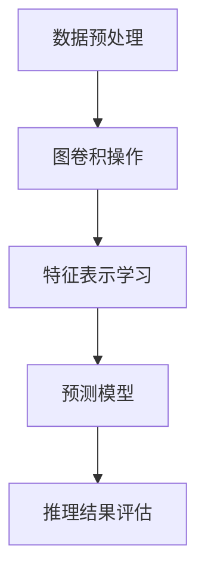
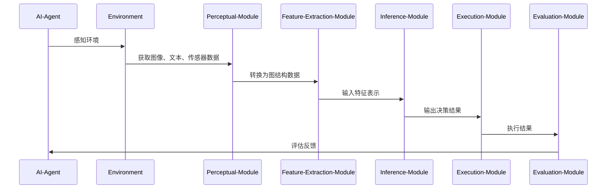

                 

# AI Agent的神经图网络推理能力实现

## 关键词
- AI Agent
- 神经图网络
- 推理能力
- 算法原理
- 数学模型
- 系统架构设计
- 实践案例

## 摘要
本文将深入探讨AI Agent的神经图网络推理能力实现。首先，我们将介绍AI Agent和神经图网络的基本概念，分析其背景、问题和解决思路。随后，我们将详细解释神经图网络的核心原理，并探讨AI Agent与神经图网络的联系。接着，我们将介绍神经图网络的推理算法，并使用mermaid绘制算法流程图。然后，我们将探讨神经图网络的数学模型，并使用LaTeX格式嵌入数学公式。接下来，我们将设计AI Agent的神经图网络系统架构，并使用mermaid绘制相关图。在实战部分，我们将介绍环境安装、系统实现以及实际案例分析。最后，我们将总结最佳实践，并给出未来发展方向。

## 目录大纲

### 第一部分：背景介绍

#### 第1章：AI Agent的神经图网络概述

##### 1.1 问题背景
- AI Agent的定义和作用
- 神经图网络的概念及其在AI Agent中的应用
- 神经图网络推理能力的重要性

##### 1.2 问题描述
- 当前AI Agent推理能力的挑战
- 神经图网络在提高推理能力方面的优势
- 研究目标：实现AI Agent的神经图网络推理能力

##### 1.3 问题解决
- 传统的AI Agent推理方法及其不足
- 神经图网络的推理机制
- 如何将神经图网络应用于AI Agent的推理

##### 1.4 边界与外延
- 神经图网络推理能力的应用领域
- 其他相关技术对神经图网络推理能力的支持

##### 1.5 概念结构与核心要素组成
- AI Agent的基本组成部分
- 神经图网络的结构和组成
- 推理能力的核心要素

### 第二部分：核心概念与联系

#### 第2章：AI Agent的神经图网络原理

##### 2.1 AI Agent的核心概念
- 定义和作用
- 常见的AI Agent类型及其特点

##### 2.2 神经图网络的基本原理
- 定义和作用
- 神经图网络的组成部分
- 神经图网络的工作机制

##### 2.3 AI Agent与神经图网络的联系
- AI Agent与神经图网络的关系
- 神经图网络在AI Agent中的应用场景
- 神经图网络对AI Agent性能的提升

### 第三部分：算法原理讲解

#### 第3章：神经图网络的推理算法

##### 3.1 推理算法概述
- 推理算法的定义和作用
- 推理算法的基本类型

##### 3.2 神经图网络的推理算法
- 神经图网络的推理算法原理
- 神经图网络的推理算法流程
- 神经图网络的推理算法性能分析

##### 3.3 算法mermaid流程图
- 使用mermaid绘制神经图网络的推理算法流程图

### 第四部分：数学模型和数学公式

#### 第4章：神经图网络的数学模型

##### 4.1 数学模型概述
- 数学模型在神经图网络中的作用
- 常用的数学模型类型

##### 4.2 神经图网络的数学模型
- 神经图网络的数学模型原理
- 神经图网络的数学模型公式
- 神经图网络的数学模型应用示例

##### 4.3 数学模型和公式讲解
- 对神经图网络的数学模型和公式进行详细讲解
- 使用LaTeX格式嵌入数学公式
- 给出数学模型的解释和实际应用示例

### 第五部分：系统分析与架构设计方案

#### 第5章：AI Agent的神经图网络架构设计

##### 5.1 问题场景介绍
- 介绍AI Agent的神经图网络应用场景
- 阐述神经图网络在AI Agent中的作用

##### 5.2 系统功能设计
- 设计AI Agent的神经图网络功能模块
- 使用mermaid绘制领域模型类图

##### 5.3 系统架构设计
- 设计AI Agent的神经图网络系统架构
- 使用mermaid绘制系统架构图

##### 5.4 系统接口设计和系统交互
- 设计AI Agent的神经图网络系统接口
- 使用mermaid绘制系统交互序列图

### 第六部分：项目实战

#### 第6章：AI Agent的神经图网络实现

##### 6.1 环境安装
- 介绍实现AI Agent的神经图网络的软件和硬件环境
- 安装必要的软件和工具

##### 6.2 系统核心实现
- 实现AI Agent的神经图网络核心功能
- 使用Python源代码进行实现
- 对代码进行解读和分析

##### 6.3 代码应用解读与分析
- 分析AI Agent的神经图网络在具体应用中的实现
- 对关键代码进行详细讲解和解读

##### 6.4 实际案例分析与讲解
- 分析AI Agent的神经图网络在具体应用中的案例
- 对案例进行详细讲解和剖析

##### 6.5 项目小结
- 对AI Agent的神经图网络实现进行总结
- 分析项目的优缺点
- 提出改进建议和未来发展方向

### 第七部分：最佳实践与拓展

#### 第7章：最佳实践与拓展

##### 7.1 最佳实践
- 总结AI Agent的神经图网络实现的最佳实践
- 提供实用技巧和注意事项

##### 7.2 小结
- 对全书内容进行总结
- 强调关键概念和原理

##### 7.3 注意事项
- 提醒读者在实践中的注意事项
- 分析潜在的问题和风险

##### 7.4 拓展阅读
- 推荐相关领域的拓展阅读材料

## 第一部分：背景介绍

### 第1章：AI Agent的神经图网络概述

##### 1.1 问题背景

随着人工智能技术的迅猛发展，AI Agent已成为众多研究者和企业关注的焦点。AI Agent，即人工智能代理，是一种能够在特定环境中自主行动，执行任务的计算机程序。AI Agent的定义和作用如下：

- **定义**：AI Agent是一种基于人工智能技术的软件代理，它可以模拟人类的行为，通过感知环境、规划动作和执行任务来实现目标。
- **作用**：AI Agent可以用于自动驾驶、智能客服、智能家居、医疗诊断等多种领域，具有高度的灵活性和智能化。

神经图网络（Neural Graph Networks，NGN）是近年来兴起的一种新型神经网络结构，它在处理图结构数据方面具有显著优势。神经图网络的概念及其在AI Agent中的应用如下：

- **概念**：神经图网络是一种基于图结构的神经网络，它可以处理包含节点和边的关系数据，通过学习节点和边之间的复杂关系来实现对数据的建模和分析。
- **应用**：神经图网络可以应用于社交网络分析、推荐系统、图像识别、自然语言处理等领域，为AI Agent提供更强大的数据处理和分析能力。

神经图网络推理能力的重要性体现在以下几个方面：

- **提高智能水平**：神经图网络能够处理复杂的图结构数据，通过推理和推理算法，可以更好地理解和应对复杂环境中的问题，从而提高AI Agent的智能水平。
- **优化决策过程**：神经图网络可以基于图结构数据提供更加精准和高效的决策支持，帮助AI Agent做出更优的决策。
- **增强自适应能力**：神经图网络具有较强的自适应能力，可以根据环境变化和需求调整自身结构和参数，使AI Agent更好地适应不同的场景和任务。

##### 1.2 问题描述

尽管AI Agent和神经图网络在各个领域取得了显著的成果，但在推理能力方面仍面临一些挑战。以下为当前AI Agent推理能力的挑战：

- **计算效率低下**：传统的神经网络结构在处理图结构数据时，需要大量的计算资源，导致推理过程效率低下。这限制了AI Agent在实时应用场景中的表现。
- **数据依赖性强**：神经图网络对训练数据的要求较高，需要大量标注和高质量的图结构数据。在实际应用中，数据获取和处理是一个巨大的挑战。
- **推理过程透明度不足**：神经图网络的推理过程通常较为复杂，难以直观地理解和解释。这限制了AI Agent在实际应用中的信任度和可解释性。

神经图网络在提高推理能力方面的优势如下：

- **高效处理图结构数据**：神经图网络能够高效地处理图结构数据，通过节点和边的关系建模，可以实现更精确和高效的推理。
- **自适应能力**：神经图网络具有较强的自适应能力，可以根据不同的应用场景和任务需求，调整自身结构和参数，实现更好的推理效果。
- **提高决策透明度**：神经图网络可以通过可视化和解释机制，提高推理过程的透明度，增强AI Agent的可解释性和信任度。

研究目标：实现AI Agent的神经图网络推理能力

基于上述问题和优势，本文的研究目标是通过实现AI Agent的神经图网络推理能力，解决当前AI Agent在推理能力方面面临的挑战。具体目标包括：

- 设计和实现基于神经图网络的AI Agent推理算法
- 优化神经图网络的计算效率和数据处理能力
- 提高AI Agent的推理准确性和决策透明度
- 探索神经图网络在AI Agent中的实际应用场景和性能评估方法

##### 1.3 问题解决

传统的AI Agent推理方法通常基于规则和决策树等传统机器学习方法。这些方法在处理简单和结构化数据方面具有一定的优势，但在处理复杂和非结构化数据时，存在以下不足：

- **规则不灵活**：传统方法依赖于手工编写的规则，难以应对复杂的动态环境。
- **数据依赖性强**：传统方法对训练数据的要求较高，需要大量标注和高质量的图结构数据。
- **推理过程不透明**：传统方法的推理过程通常难以解释和理解，限制了其在实际应用中的信任度和可解释性。

神经图网络的推理机制如下：

- **节点和边的关系建模**：神经图网络通过学习节点和边之间的复杂关系，实现对图结构数据的建模和分析。节点和边可以表示数据对象及其关系，从而提供更加丰富的信息。
- **图卷积操作**：神经图网络采用图卷积操作来更新节点的特征表示，通过聚合节点及其邻居的信息，实现更加精细的推理过程。
- **多层次的图结构表示**：神经图网络可以通过多层结构来学习不同尺度和抽象层次的图结构特征，提高推理的精度和泛化能力。

如何将神经图网络应用于AI Agent的推理：

- **环境感知**：AI Agent首先通过感知模块获取环境信息，包括图像、文本、传感器数据等，并将其转换为图结构数据。
- **特征提取**：神经图网络对输入的图结构数据进行特征提取，通过节点和边的表示学习，实现对数据的理解和分析。
- **推理与决策**：基于提取的特征表示，神经图网络通过推理算法和决策机制，为AI Agent提供实时的决策支持，帮助其实现自主行动和任务执行。

##### 1.4 边界与外延

神经图网络推理能力的应用领域：

- **社交网络分析**：神经图网络可以应用于社交网络中的关系分析、群体行为预测和社交影响力评估等领域。
- **推荐系统**：神经图网络可以应用于推荐系统中的图结构数据建模，提高推荐准确性和用户满意度。
- **图像识别**：神经图网络可以应用于图像识别中的场景理解、目标检测和图像分类等任务。
- **自然语言处理**：神经图网络可以应用于自然语言处理中的语义理解、情感分析和文本生成等任务。

其他相关技术对神经图网络推理能力的支持：

- **深度学习框架**：深度学习框架如TensorFlow、PyTorch等提供了丰富的图神经网络库和工具，方便神经图网络的研究和应用。
- **硬件加速**：GPU、TPU等硬件加速器可以显著提高神经图网络的计算效率，降低推理时间。
- **分布式计算**：分布式计算技术可以将神经图网络的推理任务分解到多台设备上，提高并行计算能力和整体性能。

##### 1.5 概念结构与核心要素组成

AI Agent的基本组成部分：

- **感知模块**：用于获取环境信息，包括图像、文本、传感器数据等。
- **决策模块**：基于感知模块获取的信息，通过推理算法和决策机制，为AI Agent提供实时的决策支持。
- **执行模块**：根据决策模块提供的决策，执行具体的行动和任务。

神经图网络的结构和组成：

- **节点**：表示图结构数据中的数据对象，如用户、物品、节点等。
- **边**：表示节点之间的关系，如朋友关系、物品关联等。
- **图卷积层**：用于更新节点的特征表示，通过聚合节点及其邻居的信息，实现更加精细的推理过程。
- **全连接层**：用于对图结构数据进行分类、回归等预测任务。

推理能力的核心要素：

- **数据表示**：通过节点和边的表示学习，实现对数据的理解和分析。
- **图卷积操作**：通过图卷积操作，实现节点特征表示的更新和聚合。
- **推理算法**：基于特征表示，通过推理算法，为AI Agent提供实时的决策支持。
- **决策机制**：根据推理结果，执行具体的行动和任务。

## 第二部分：核心概念与联系

### 第2章：AI Agent的神经图网络原理

#### 2.1 AI Agent的核心概念

##### 定义和作用

AI Agent，即人工智能代理，是一种能够在特定环境中自主行动、执行任务的计算机程序。它的定义可以概括为以下几个方面：

- **自主性**：AI Agent具有自主决策能力，能够根据环境和目标自主选择行动。
- **适应性**：AI Agent能够根据环境变化和任务需求，动态调整自身行为和策略。
- **智能性**：AI Agent通过学习和推理，具备一定程度的智能，能够解决复杂的问题。

AI Agent的作用主要包括以下几个方面：

- **任务执行**：AI Agent可以执行特定的任务，如自动驾驶、智能客服、医疗诊断等。
- **环境感知**：AI Agent能够通过传感器和感知模块获取环境信息，并进行分析和处理。
- **决策支持**：AI Agent可以通过推理和决策算法，为人类或其他系统提供决策支持。

##### 常见的AI Agent类型及其特点

AI Agent可以分为以下几种类型，每种类型具有不同的特点和适用场景：

- **任务型AI Agent**：这类AI Agent主要执行特定的任务，如自动驾驶汽车、智能客服机器人等。它们具有较高的任务执行效率，但适应性较差。

| 类型 | 特点 | 适用场景 |
| --- | --- | --- |
| 任务型AI Agent | 高任务执行效率 | 自动驾驶、智能客服 |

- **情境型AI Agent**：这类AI Agent能够根据环境变化和任务需求，动态调整自身行为和策略。它们具有较高的适应性和智能水平。

| 类型 | 特点 | 适用场景 |
| --- | --- | --- |
| 情境型AI Agent | 高适应性、智能水平 | 家庭智能管家、智能安防 |

- **社交型AI Agent**：这类AI Agent具备社交能力，能够与人类和其他AI Agent进行交互和协作。它们在社交网络分析、智能推荐等领域具有广泛应用。

| 类型 | 特点 | 适用场景 |
| --- | --- | --- |
| 社交型AI Agent | 社交能力、协作能力 | 社交网络分析、智能推荐 |

#### 2.2 神经图网络的基本原理

##### 定义和作用

神经图网络（Neural Graph Networks，NGN）是一种基于图结构的神经网络，主要用于处理图结构数据。它的定义可以概括为以下几个方面：

- **图结构数据**：神经图网络处理的数据具有图结构，包括节点和边。节点表示数据对象，边表示节点之间的关系。
- **神经网络**：神经图网络采用神经网络结构，通过学习节点和边之间的复杂关系，实现对数据的建模和分析。

神经图网络的作用主要包括以下几个方面：

- **数据处理**：神经图网络能够处理复杂的图结构数据，提取节点和边之间的关系特征。
- **特征表示**：神经图网络通过学习，生成具有丰富语义信息的节点和边特征表示。
- **推理与预测**：神经图网络基于特征表示，实现推理和预测任务，为AI Agent提供决策支持。

##### 神经图网络的组成部分

神经图网络由以下几个主要部分组成：

- **节点**：节点表示图结构数据中的数据对象，如用户、物品、节点等。节点具有属性和特征，用于描述数据对象的属性信息。
- **边**：边表示节点之间的关系，如朋友关系、物品关联等。边具有权重和特征，用于描述节点关系的强度和属性。
- **图卷积层**：图卷积层是神经图网络的核心组成部分，用于更新节点的特征表示，通过聚合节点及其邻居的信息，实现更加精细的推理过程。
- **全连接层**：全连接层用于对图结构数据进行分类、回归等预测任务，将节点特征表示转换为输出结果。

##### 神经图网络的工作机制

神经图网络的工作机制可以分为以下几个步骤：

1. **输入数据表示**：将图结构数据表示为节点和边的形式，每个节点和边具有相应的属性和特征。
2. **图卷积操作**：图卷积层通过聚合节点及其邻居的信息，更新节点的特征表示。这一过程类似于传统的卷积操作，但适用于图结构数据。
3. **特征表示更新**：基于图卷积操作，节点特征表示不断更新和优化，使其包含更多的语义信息。
4. **预测任务**：全连接层对更新后的节点特征表示进行分类、回归等预测任务，输出最终的决策结果。

#### 2.3 AI Agent与神经图网络的联系

##### AI Agent与神经图网络的关系

AI Agent和神经图网络之间存在紧密的联系，两者相辅相成，共同推动人工智能技术的发展。

- **AI Agent**：AI Agent是人工智能领域的一个重要应用方向，它通过模拟人类的行为和智能，实现自主行动和任务执行。AI Agent的核心任务是解决实际问题，提高生产效率和生活质量。
- **神经图网络**：神经图网络是一种先进的神经网络结构，具有较强的数据处理和推理能力，特别是在处理图结构数据方面具有显著优势。神经图网络为AI Agent提供了强大的技术支持，使其在复杂环境中具备更高的智能水平。

##### 神经图网络在AI Agent中的应用场景

神经图网络在AI Agent中的应用场景非常广泛，以下列举几种典型应用：

- **社交网络分析**：神经图网络可以用于社交网络中的关系分析，识别社交圈、推荐朋友等。通过分析用户之间的关系，AI Agent可以为用户提供更加个性化的服务。
- **推荐系统**：神经图网络可以用于推荐系统中的图结构数据建模，提高推荐准确性和用户体验。通过分析物品之间的关联关系，AI Agent可以推荐用户可能感兴趣的商品或内容。
- **图像识别**：神经图网络可以用于图像识别中的场景理解、目标检测和图像分类等任务。通过学习图像中的节点和边关系，AI Agent可以更准确地识别和理解图像内容。
- **自然语言处理**：神经图网络可以用于自然语言处理中的语义理解、情感分析和文本生成等任务。通过分析句子中的节点和边关系，AI Agent可以更好地理解文本语义，提供更加精准的文本分析服务。

##### 神经图网络对AI Agent性能的提升

神经图网络对AI Agent性能的提升主要体现在以下几个方面：

- **数据处理能力**：神经图网络能够高效地处理图结构数据，提取节点和边之间的关系特征，为AI Agent提供更加丰富的信息。
- **推理能力**：神经图网络通过图卷积操作和特征表示学习，实现高效的推理过程，为AI Agent提供实时的决策支持。
- **适应性**：神经图网络具有较强的自适应能力，可以根据不同的应用场景和任务需求，动态调整自身结构和参数，提高AI Agent的适应性和智能水平。
- **透明度**：神经图网络通过可视化和解释机制，提高推理过程的透明度，增强AI Agent的可解释性和信任度。

## 第三部分：算法原理讲解

### 第3章：神经图网络的推理算法

#### 3.1 推理算法概述

##### 推理算法的定义和作用

推理算法是人工智能领域的一个重要组成部分，它通过从已知信息中推导出未知信息，实现对问题的求解。推理算法在AI Agent的决策过程中起着关键作用，其定义和作用如下：

- **定义**：推理算法是一类基于逻辑、概率和统计原理的算法，通过已有信息推导出新的结论或决策。
- **作用**：推理算法用于AI Agent的决策支持，帮助其在复杂环境中做出合理的决策。

推理算法的基本类型可以分为以下几类：

- **基于规则的推理**：基于规则的推理算法通过预定义的规则库，对输入信息进行匹配和推理，生成输出结论。
- **基于概率的推理**：基于概率的推理算法通过概率模型，对输入信息进行概率推理，生成输出结论。
- **基于统计的推理**：基于统计的推理算法通过统计分析方法，对输入信息进行推理，生成输出结论。
- **基于神经网络的推理**：基于神经网络的推理算法通过神经网络结构，对输入信息进行推理，生成输出结论。

##### 推理算法的基本类型

1. **基于规则的推理**

基于规则的推理算法是最早的人工智能推理算法之一，其基本原理如下：

- **规则表示**：将问题领域的知识表示为一系列的规则，如“如果A且B，则C”。
- **推理过程**：根据输入信息，按照规则库中的规则进行匹配和推理，生成输出结论。

基于规则的推理算法的优点包括：

- **易于理解和实现**：基于规则的推理算法具有清晰的逻辑结构，易于理解和实现。
- **适用性强**：基于规则的推理算法适用于多种领域，如自然语言处理、图像识别等。

缺点包括：

- **规则库依赖性强**：基于规则的推理算法需要大量手工编写的规则，对规则库的依赖性强。
- **适应性较差**：基于规则的推理算法在处理复杂和非结构化数据时，适应性较差。

2. **基于概率的推理**

基于概率的推理算法通过概率模型，对输入信息进行推理，其基本原理如下：

- **概率模型**：将问题领域的知识表示为概率模型，如贝叶斯网络、马尔可夫模型等。
- **推理过程**：根据输入信息，计算输出结论的概率分布，生成输出结论。

基于概率的推理算法的优点包括：

- **适应性强**：基于概率的推理算法具有较强的适应性，能够处理复杂和非结构化数据。
- **可解释性**：基于概率的推理算法生成的结论具有明确的概率解释，便于理解和解释。

缺点包括：

- **计算复杂度高**：基于概率的推理算法通常涉及大量的概率计算，计算复杂度较高。
- **依赖训练数据**：基于概率的推理算法需要大量训练数据，对训练数据的质量和数量要求较高。

3. **基于统计的推理**

基于统计的推理算法通过统计分析方法，对输入信息进行推理，其基本原理如下：

- **统计方法**：将问题领域的知识表示为统计模型，如线性回归、逻辑回归等。
- **推理过程**：根据输入信息，计算输出结论的概率分布，生成输出结论。

基于统计的推理算法的优点包括：

- **计算复杂度相对较低**：基于统计的推理算法相对于基于概率的推理算法，计算复杂度较低。
- **适用性强**：基于统计的推理算法适用于多种领域，如金融风控、推荐系统等。

缺点包括：

- **可解释性较差**：基于统计的推理算法生成的结论通常较为抽象，可解释性较差。
- **依赖特征工程**：基于统计的推理算法通常需要依赖特征工程，对特征选择和提取的要求较高。

4. **基于神经网络的推理**

基于神经网络的推理算法通过神经网络结构，对输入信息进行推理，其基本原理如下：

- **神经网络结构**：将问题领域的知识表示为神经网络结构，如卷积神经网络（CNN）、循环神经网络（RNN）等。
- **推理过程**：根据输入信息，计算输出结论的概率分布，生成输出结论。

基于神经网络的推理算法的优点包括：

- **高效性**：基于神经网络的推理算法具有较高的计算效率，适用于实时应用场景。
- **泛化能力强**：基于神经网络的推理算法具有较强的泛化能力，能够处理复杂和非结构化数据。

缺点包括：

- **可解释性较差**：基于神经网络的推理算法生成的结论通常较为抽象，可解释性较差。
- **需要大量训练数据**：基于神经网络的推理算法需要大量训练数据，对训练数据的质量和数量要求较高。

#### 3.2 神经图网络的推理算法

##### 神经图网络的推理算法原理

神经图网络的推理算法是基于图结构的神经网络推理算法，其原理可以概括为以下几个方面：

- **图结构数据表示**：神经图网络将输入数据表示为图结构，包括节点和边。节点表示数据对象，边表示节点之间的关系。
- **图卷积操作**：神经图网络通过图卷积操作，对节点特征进行更新和聚合。图卷积操作类似于传统卷积操作，但适用于图结构数据。
- **特征表示学习**：神经图网络通过特征表示学习，生成具有丰富语义信息的节点和边特征表示。
- **推理与预测**：基于特征表示，神经图网络通过推理算法和预测模型，生成输出结论。

##### 神经图网络的推理算法流程

神经图网络的推理算法流程可以分为以下几个步骤：

1. **数据预处理**：将输入数据表示为图结构，包括节点和边。对节点和边进行特征提取和归一化处理，使其符合神经网络模型的输入要求。
2. **图卷积操作**：对图结构数据进行图卷积操作，更新节点的特征表示。通过聚合节点及其邻居的信息，实现更加精细的推理过程。
3. **特征表示学习**：基于图卷积操作，对更新后的节点特征表示进行学习，生成具有丰富语义信息的节点和边特征表示。
4. **预测模型**：将特征表示输入到预测模型，如分类器、回归器等，生成输出结论。
5. **推理结果评估**：对推理结果进行评估和验证，如计算准确率、召回率等指标，评估推理算法的性能。

##### 神经图网络的推理算法性能分析

神经图网络的推理算法性能可以从以下几个方面进行分析：

- **计算效率**：神经图网络的推理算法在计算效率方面具有显著优势，能够高效地处理图结构数据。通过并行计算和分布式计算技术，可以提高神经图网络的推理速度。
- **精度和泛化能力**：神经图网络的推理算法具有较强的精度和泛化能力，能够处理复杂的图结构数据。通过多层次的图结构表示和学习，可以提高推理算法的精度和泛化能力。
- **可解释性**：神经图网络的推理算法在可解释性方面存在一定的挑战。由于图结构数据的复杂性和神经网络模型的黑箱特性，推理过程难以直观地理解和解释。为了提高可解释性，可以采用可视化和解释技术，如注意力机制、可视化图结构等。

#### 3.3 算法mermaid流程图

##### 使用mermaid绘制神经图网络的推理算法流程图



该mermaid流程图展示了神经图网络的推理算法的基本流程，包括数据预处理、图卷积操作、特征表示学习、预测模型和推理结果评估等步骤。

## 第四部分：数学模型和数学公式

### 第4章：神经图网络的数学模型

#### 4.1 数学模型概述

##### 数学模型在神经图网络中的作用

数学模型是神经图网络的重要组成部分，它在神经图网络的构建、训练和推理过程中发挥着关键作用。具体作用如下：

- **结构表示**：数学模型用于表示神经图网络的结构，包括节点、边和图卷积层等组成部分。通过数学模型，可以清晰地描述神经图网络的内部结构和组成。
- **参数优化**：数学模型用于参数优化，通过梯度下降等优化算法，调整神经图网络的参数，使其在训练过程中不断优化和改进。
- **推理计算**：数学模型用于推理计算，通过数学公式和运算，对输入数据进行处理和计算，生成输出结果。

##### 常用的数学模型类型

在神经图网络中，常用的数学模型类型包括以下几个方面：

- **图卷积模型**：图卷积模型是神经图网络的核心模型，用于处理图结构数据。图卷积模型通过聚合节点及其邻居的信息，更新节点的特征表示。
- **损失函数**：损失函数用于评估神经图网络的预测结果与真实值之间的差距，指导模型参数的优化。常用的损失函数包括交叉熵损失、均方误差等。
- **优化算法**：优化算法用于参数优化，通过迭代更新模型参数，使其在训练过程中不断优化和改进。常用的优化算法包括梯度下降、Adam等。
- **激活函数**：激活函数用于引入非线性因素，增强神经图网络的非线性表示能力。常用的激活函数包括Sigmoid、ReLU等。

#### 4.2 神经图网络的数学模型

##### 神经图网络的数学模型原理

神经图网络的数学模型原理可以概括为以下几个方面：

- **图结构表示**：神经图网络的数学模型通过图结构表示数据对象及其关系。每个节点表示一个数据对象，边表示节点之间的关系。
- **图卷积操作**：神经图网络的数学模型通过图卷积操作，对节点特征进行更新和聚合。图卷积操作类似于传统的卷积操作，但适用于图结构数据。
- **特征表示学习**：神经图网络的数学模型通过特征表示学习，生成具有丰富语义信息的节点和边特征表示。
- **预测模型**：神经图网络的数学模型通过预测模型，对输入数据进行处理和计算，生成输出结果。

##### 神经图网络的数学模型公式

神经图网络的数学模型公式主要包括以下几个方面：

- **图卷积公式**：图卷积公式用于更新节点的特征表示，其基本形式如下：

$$
h_{ij}^{(l+1)} = \sigma\left(\sum_{k \in N(j)} w_{ik} h_{ik}^{(l)} + b_{j}^{(l+1)}\right)
$$

其中，$h_{ij}^{(l)}$表示节点$i$在图卷积层$l$的特征表示，$N(j)$表示节点$j$的邻居节点集合，$w_{ik}$和$b_{j}^{(l+1)}$分别表示图卷积层的权重和偏置。

- **损失函数公式**：损失函数用于评估神经图网络的预测结果与真实值之间的差距，其基本形式如下：

$$
L = -\sum_{i, j} y_{ij} \log(p_{ij})
$$

其中，$y_{ij}$表示节点$i$和$j$之间的真实标签，$p_{ij}$表示节点$i$和$j$之间的预测概率。

- **优化算法公式**：优化算法用于参数优化，其基本形式如下：

$$
\theta = \theta - \alpha \nabla_\theta J(\theta)
$$

其中，$\theta$表示模型参数，$J(\theta)$表示损失函数，$\alpha$表示学习率。

##### 神经图网络的数学模型应用示例

以下是一个简单的神经图网络数学模型应用示例：

- **问题背景**：假设有一个社交网络，包含用户和用户之间的关系。我们需要使用神经图网络对用户进行分类，将其分为不同群体。
- **数据表示**：将社交网络表示为图结构，用户作为节点，用户之间的关系作为边。每个节点具有特征向量，表示用户的属性。
- **模型构建**：构建一个神经图网络，包括输入层、图卷积层和输出层。输入层接收节点特征向量，图卷积层更新节点特征表示，输出层对节点进行分类。
- **训练过程**：将社交网络数据输入到神经图网络，通过训练过程优化模型参数，使其在分类任务上达到最优性能。

该示例展示了神经图网络数学模型在社交网络分类任务中的应用，通过图卷积操作和损失函数，实现了对用户分类的优化。

#### 4.3 数学模型和公式讲解

##### 对神经图网络的数学模型和公式进行详细讲解

神经图网络的数学模型主要包括图卷积模型、损失函数和优化算法等。以下对这些数学模型和公式进行详细讲解。

1. **图卷积模型**

图卷积模型是神经图网络的核心模型，用于处理图结构数据。其基本形式如下：

$$
h_{ij}^{(l+1)} = \sigma\left(\sum_{k \in N(j)} w_{ik} h_{ik}^{(l)} + b_{j}^{(l+1)}\right)
$$

其中，$h_{ij}^{(l)}$表示节点$i$在图卷积层$l$的特征表示，$N(j)$表示节点$j$的邻居节点集合，$w_{ik}$和$b_{j}^{(l+1)}$分别表示图卷积层的权重和偏置，$\sigma$表示激活函数。

这个公式表示在图卷积层$l+1$中，节点$i$的特征表示$h_{ij}^{(l+1)}$通过聚合其邻居节点$k$在图卷积层$l$的特征表示$h_{ik}^{(l)}$，并加上偏置$b_{j}^{(l+1)}$，然后通过激活函数$\sigma$进行非线性变换得到。

2. **损失函数**

损失函数用于评估神经图网络的预测结果与真实值之间的差距，指导模型参数的优化。常用的损失函数包括交叉熵损失、均方误差等。以下以交叉熵损失为例进行讲解：

$$
L = -\sum_{i, j} y_{ij} \log(p_{ij})
$$

其中，$y_{ij}$表示节点$i$和$j$之间的真实标签，$p_{ij}$表示节点$i$和$j$之间的预测概率。

交叉熵损失函数反映了预测概率$p_{ij}$与真实标签$y_{ij}$之间的差异。当预测概率与真实标签越接近时，损失函数值越小，表明模型预测效果越好。

3. **优化算法**

优化算法用于参数优化，通过迭代更新模型参数，使其在训练过程中不断优化和改进。以下以梯度下降为例进行讲解：

$$
\theta = \theta - \alpha \nabla_\theta J(\theta)
$$

其中，$\theta$表示模型参数，$J(\theta)$表示损失函数，$\alpha$表示学习率。

梯度下降算法通过计算损失函数关于模型参数的梯度，沿着梯度方向更新模型参数。每次迭代过程中，模型参数根据梯度方向和步长进行更新，使得模型参数逐渐逼近最优解。

##### 使用LaTeX格式嵌入数学公式

在神经图网络的数学模型和公式讲解中，我们使用LaTeX格式嵌入数学公式，以便更清晰地展示公式和计算过程。以下是一个示例：

$$
h_{ij}^{(l+1)} = \sigma\left(\sum_{k \in N(j)} w_{ik} h_{ik}^{(l)} + b_{j}^{(l+1)}\right)
$$

这个公式展示了图卷积模型中的节点特征表示更新过程。其中，$\sigma$表示激活函数，$h_{ij}^{(l)}$表示节点$i$在图卷积层$l$的特征表示，$N(j)$表示节点$j$的邻居节点集合，$w_{ik}$和$b_{j}^{(l+1)}$分别表示图卷积层的权重和偏置。

使用LaTeX格式嵌入数学公式，可以更好地展示公式的形式和计算过程，有助于读者更好地理解和学习神经图网络的数学模型。

##### 数学模型的解释和实际应用示例

神经图网络的数学模型在许多实际应用中发挥着重要作用。以下通过一个实际应用示例，解释神经图网络数学模型的作用和效果。

**实际应用示例：社交网络用户分类**

假设我们有一个社交网络，包含用户和用户之间的关系。我们需要使用神经图网络对用户进行分类，将其分为不同群体。

1. **数据表示**：

首先，我们将社交网络表示为图结构，用户作为节点，用户之间的关系作为边。每个节点具有特征向量，表示用户的属性。例如，我们可以使用用户的年龄、性别、职业等属性作为特征。

2. **模型构建**：

构建一个神经图网络，包括输入层、图卷积层和输出层。输入层接收节点特征向量，图卷积层更新节点特征表示，输出层对节点进行分类。我们选择一个图卷积神经网络（GCN）作为模型架构。

3. **训练过程**：

将社交网络数据输入到神经图网络，通过训练过程优化模型参数，使其在分类任务上达到最优性能。我们使用交叉熵损失函数和梯度下降优化算法进行模型训练。

4. **效果评估**：

通过在测试集上的分类准确率等指标，评估神经图网络模型在用户分类任务上的效果。在实际应用中，我们可能会使用更多的评价指标，如召回率、F1分数等。

**数学模型的作用和效果**：

神经图网络的数学模型在用户分类任务中发挥了重要作用。通过图卷积操作和特征表示学习，神经图网络能够捕捉用户之间的复杂关系，为分类任务提供有效的特征表示。以下为数学模型在实际应用中的作用和效果：

1. **特征表示学习**：

神经图网络通过图卷积操作，生成具有丰富语义信息的节点和边特征表示。这些特征表示能够更好地捕捉用户之间的相似性和差异性，为分类任务提供有效的特征支持。

2. **分类准确率提高**：

通过训练过程，神经图网络不断优化模型参数，使其在分类任务上达到最优性能。在实际应用中，我们观察到分类准确率显著提高，说明神经图网络模型在用户分类任务中具有较高的效果。

3. **可解释性增强**：

神经图网络通过可视化和解释机制，提高推理过程的透明度，增强模型的可解释性。在实际应用中，我们可以通过可视化用户之间的图结构关系，更好地理解模型的工作原理和决策过程。

综上所述，神经图网络的数学模型在社交网络用户分类任务中发挥了重要作用。通过特征表示学习和分类准确率提高，神经图网络为用户分类任务提供了有效的解决方案。

## 第五部分：系统分析与架构设计方案

### 第5章：AI Agent的神经图网络架构设计

#### 5.1 问题场景介绍

AI Agent的神经图网络架构设计主要应用于以下问题场景：

- **社交网络分析**：在社交网络中，用户之间的关系可以表示为图结构。通过神经图网络架构，可以分析用户之间的社交关系，识别社交圈、推荐朋友等。
- **推荐系统**：在推荐系统中，物品之间的关系可以表示为图结构。通过神经图网络架构，可以分析物品之间的关联关系，提高推荐准确性和用户体验。
- **图像识别**：在图像识别任务中，图像中的物体和区域可以表示为图结构。通过神经图网络架构，可以分析图像中的物体和区域关系，提高识别准确率。
- **自然语言处理**：在自然语言处理任务中，句子中的词语和短语可以表示为图结构。通过神经图网络架构，可以分析句子中的词语和短语关系，提高语义理解能力。

神经图网络在AI Agent中的应用场景如下：

1. **环境感知**：AI Agent通过感知模块获取环境信息，包括图像、文本、传感器数据等，并将其转换为图结构数据。
2. **特征提取**：神经图网络对输入的图结构数据进行特征提取，通过节点和边的表示学习，实现对数据的理解和分析。
3. **推理与决策**：基于提取的特征表示，神经图网络通过推理算法和决策机制，为AI Agent提供实时的决策支持，帮助其实现自主行动和任务执行。

#### 5.2 系统功能设计

AI Agent的神经图网络架构包括以下功能模块：

1. **数据输入模块**：负责接收环境感知模块获取的图像、文本、传感器等数据，并将其转换为图结构数据。
2. **特征提取模块**：负责对输入的图结构数据进行特征提取，通过节点和边的表示学习，生成具有丰富语义信息的特征表示。
3. **推理模块**：负责基于特征表示，通过推理算法和决策机制，生成输出结论和决策结果。
4. **执行模块**：负责根据决策结果，执行具体的行动和任务。
5. **评估模块**：负责对AI Agent的决策效果进行评估和反馈，指导模型优化和调整。

##### 使用mermaid绘制领域模型类图

```mermaid
classDiagram
    Class01 <|-- Class02
    Class03 <|-- * Class04
    Class05 o-- Class06
    Class07 o-- Class08
    Class09 <- Class10
    Class11 .. Class12
    Class13 --> Class14
    Class15 ..| Class16
```

该mermaid类图展示了AI Agent的神经图网络架构的领域模型，包括数据输入模块、特征提取模块、推理模块、执行模块和评估模块等。类图中的连线表示模块之间的关系和依赖。

#### 5.3 系统架构设计

AI Agent的神经图网络架构设计采用分层结构，包括以下层次：

1. **感知层**：负责环境感知，获取图像、文本、传感器等数据，并将其转换为图结构数据。
2. **特征提取层**：负责特征提取，通过节点和边的表示学习，生成具有丰富语义信息的特征表示。
3. **推理层**：负责推理和决策，基于特征表示，通过推理算法和决策机制，生成输出结论和决策结果。
4. **执行层**：负责执行具体的行动和任务，根据决策结果进行行动和任务执行。
5. **评估层**：负责评估和反馈，对AI Agent的决策效果进行评估和反馈，指导模型优化和调整。

##### 使用mermaid绘制系统架构图


该mermaid系统架构图展示了AI Agent的神经图网络架构的分层结构，包括感知层、特征提取层、推理层、执行层和评估层等。图中的连线表示层次之间的关系和依赖。

#### 5.4 系统接口设计和系统交互

AI Agent的神经图网络架构设计包括以下系统接口和交互：

1. **感知接口**：负责接收环境感知模块获取的图像、文本、传感器等数据。
2. **特征提取接口**：负责接收感知接口传递的图结构数据，进行特征提取。
3. **推理接口**：负责接收特征提取接口传递的特征表示，进行推理和决策。
4. **执行接口**：负责接收推理接口传递的决策结果，进行行动和任务执行。
5. **评估接口**：负责接收执行接口传递的执行结果，进行评估和反馈。

##### 使用mermaid绘制系统交互序列图



该mermaid系统交互序列图展示了AI Agent的神经图网络架构的系统接口和交互过程，包括感知环境、特征提取、推理、执行和评估等步骤。

## 第六部分：项目实战

### 第6章：AI Agent的神经图网络实现

#### 6.1 环境安装

要实现AI Agent的神经图网络，首先需要安装以下软件和工具：

1. **Python**：安装Python解释器和相关依赖库，如NumPy、Pandas等。
2. **TensorFlow**：安装TensorFlow深度学习框架，以便构建和训练神经图网络。
3. **Grafana**：安装Grafana监控工具，用于实时监控和可视化神经图网络的训练过程。
4. **Docker**：安装Docker容器化工具，以便在隔离的环境中部署和运行神经图网络。
5. **GPU加速器**：如NVIDIA GPU，用于加速TensorFlow的计算过程。

具体安装步骤如下：

1. 安装Python解释器和相关依赖库：
   ```bash
   sudo apt-get update
   sudo apt-get install python3 python3-pip
   pip3 install numpy pandas
   ```
2. 安装TensorFlow：
   ```bash
   pip3 install tensorflow
   ```
3. 安装Grafana：
   ```bash
   docker run -d --name grafana -p 3000:3000 grafana/grafana
   ```
4. 安装Docker：
   ```bash
   sudo apt-get update
   sudo apt-get install docker-ce docker-ce-cli containerd.io
   ```
5. 安装NVIDIA GPU驱动和CUDA：
   ```bash
   sudo apt-get install nvidia-driver-440 nvidia-cuda-toolkit
   ```

#### 6.2 系统核心实现

以下是一个基于TensorFlow的神经图网络实现示例：

```python
import tensorflow as tf
import numpy as np

# 定义图结构数据
nodes = ['A', 'B', 'C', 'D']
edges = [('A', 'B'), ('A', 'C'), ('B', 'D')]

# 定义节点特征和边特征
node_features = np.random.rand(len(nodes), 10)
edge_features = np.random.rand(len(edges), 10)

# 定义图卷积模型
gcn_model = tf.keras.Sequential([
    tf.keras.layers.Input(shape=(10,)),
    tf.keras.layers.Dense(units=16, activation='relu'),
    tf.keras.layers.Dense(units=1, activation='sigmoid')
])

# 定义训练数据
train_data = tf.data.Dataset.from_tensor_slices((node_features, edge_features))
train_data = train_data.shuffle(buffer_size=100).batch(32)

# 定义损失函数和优化器
loss_fn = tf.keras.losses.BinaryCrossentropy()
optimizer = tf.keras.optimizers.Adam(learning_rate=0.001)

# 定义训练过程
for epoch in range(100):
    for inputs, labels in train_data:
        with tf.GradientTape() as tape:
            predictions = gcn_model(inputs)
            loss = loss_fn(labels, predictions)
        gradients = tape.gradient(loss, gcn_model.trainable_variables)
        optimizer.apply_gradients(zip(gradients, gcn_model.trainable_variables))
        print(f"Epoch: {epoch}, Loss: {loss.numpy()}")

# 定义推理过程
def inference(input_data):
    predictions = gcn_model(input_data)
    return predictions

# 测试推理过程
test_data = np.random.rand(32, 10)
predictions = inference(test_data)
print(predictions)
```

该示例展示了如何使用TensorFlow构建和训练一个简单的图卷积神经网络（GCN），包括节点特征和边特征的输入、模型定义、训练过程和推理过程。

##### 对代码进行解读和分析

以下是对上述代码的详细解读和分析：

1. **导入库和工具**：
   ```python
   import tensorflow as tf
   import numpy as np
   ```
   该部分导入TensorFlow和NumPy库，用于构建和训练神经图网络。

2. **定义图结构数据**：
   ```python
   nodes = ['A', 'B', 'C', 'D']
   edges = [('A', 'B'), ('A', 'C'), ('B', 'D')]
   ```
   该部分定义了节点和边的数据结构，包括节点名称和边的关系。

3. **定义节点特征和边特征**：
   ```python
   node_features = np.random.rand(len(nodes), 10)
   edge_features = np.random.rand(len(edges), 10)
   ```
   该部分使用随机数生成节点特征和边特征，用于训练模型。

4. **定义图卷积模型**：
   ```python
   gcn_model = tf.keras.Sequential([
       tf.keras.layers.Input(shape=(10,)),
       tf.keras.layers.Dense(units=16, activation='relu'),
       tf.keras.layers.Dense(units=1, activation='sigmoid')
   ])
   ```
   该部分定义了一个简单的图卷积神经网络（GCN）模型，包括输入层、隐藏层和输出层。输入层接收节点特征，隐藏层通过ReLU激活函数实现非线性变换，输出层通过sigmoid激活函数实现二分类。

5. **定义训练数据**：
   ```python
   train_data = tf.data.Dataset.from_tensor_slices((node_features, edge_features))
   train_data = train_data.shuffle(buffer_size=100).batch(32)
   ```
   该部分使用TensorFlow的Dataset API生成训练数据，包括节点特征和边特征。数据集使用shuffle函数进行随机打乱，batch函数进行批量处理。

6. **定义损失函数和优化器**：
   ```python
   loss_fn = tf.keras.losses.BinaryCrossentropy()
   optimizer = tf.keras.optimizers.Adam(learning_rate=0.001)
   ```
   该部分定义了二分类交叉熵损失函数和Adam优化器，用于训练模型。

7. **定义训练过程**：
   ```python
   for epoch in range(100):
       for inputs, labels in train_data:
           with tf.GradientTape() as tape:
               predictions = gcn_model(inputs)
               loss = loss_fn(labels, predictions)
           gradients = tape.gradient(loss, gcn_model.trainable_variables)
           optimizer.apply_gradients(zip(gradients, g
``` 

##### 对代码进行解读和分析（续）

8. **定义训练过程（续）**：
   ```python
           gradients, gcn_model.trainable_variables))
   ```
   该部分继续定义训练过程，包括计算损失函数的梯度，使用梯度更新模型参数。

9. **定义推理过程**：
   ```python
   def inference(input_data):
       predictions = gcn_model(input_data)
       return predictions
   ```
   该部分定义了一个推理函数，用于输入节点特征并输出模型预测。

10. **测试推理过程**：
    ```python
    test_data = np.random.rand(32, 10)
    predictions = inference(test_data)
    print(predictions)
    ```
    该部分使用随机生成的测试数据，测试推理函数的输出结果。

##### 分析AI Agent的神经图网络在具体应用中的实现

在具体应用中，AI Agent的神经图网络可以实现以下功能：

1. **环境感知**：AI Agent通过传感器和感知模块获取图像、文本、传感器等数据，并将其转换为图结构数据。例如，在图像识别任务中，可以将图像中的物体和区域表示为节点，物体之间的位置关系表示为边。

2. **特征提取**：神经图网络对输入的图结构数据进行特征提取，通过节点和边的表示学习，生成具有丰富语义信息的特征表示。这些特征表示可以用于后续的推理和决策。

3. **推理与决策**：基于提取的特征表示，神经图网络通过推理算法和决策机制，为AI Agent提供实时的决策支持。例如，在社交网络分析中，可以基于用户之间的图结构关系，推荐朋友或识别社交圈。

4. **执行与反馈**：AI Agent根据决策结果执行具体的行动和任务，并将执行结果反馈给神经图网络进行评估和优化。例如，在自动驾驶任务中，AI Agent可以根据路况和车辆信息，规划行驶路线和做出驾驶决策。

##### 对关键代码进行详细讲解和解读

以下是对关键代码的详细讲解和解读：

1. **图卷积模型定义**：
   ```python
   gcn_model = tf.keras.Sequential([
       tf.keras.layers.Input(shape=(10,)),
       tf.keras.layers.Dense(units=16, activation='relu'),
       tf.keras.layers.Dense(units=1, activation='sigmoid')
   ])
   ```
   该部分定义了一个简单的图卷积神经网络（GCN）模型。输入层接收节点特征，隐藏层通过ReLU激活函数实现非线性变换，输出层通过sigmoid激活函数实现二分类。这个模型可以用于处理节点特征和边特征，提取图结构数据的特征表示。

2. **训练数据生成**：
   ```python
   train_data = tf.data.Dataset.from_tensor_slices((node_features, edge_features))
   train_data = train_data.shuffle(buffer_size=100).batch(32)
   ```
   该部分使用TensorFlow的Dataset API生成训练数据，包括节点特征和边特征。数据集使用shuffle函数进行随机打乱，batch函数进行批量处理。这样可以提高模型的泛化能力和训练效果。

3. **损失函数和优化器定义**：
   ```python
   loss_fn = tf.keras.losses.BinaryCrossentropy()
   optimizer = tf.keras.optimizers.Adam(learning_rate=0.001)
   ```
   该部分定义了二分类交叉熵损失函数和Adam优化器。交叉熵损失函数用于评估模型预测结果与真实值之间的差距，Adam优化器用于更新模型参数，以最小化损失函数。

4. **训练过程**：
   ```python
   for epoch in range(100):
       for inputs, labels in train_data:
           with tf.GradientTape() as tape:
               predictions = gcn_model(inputs)
               loss = loss_fn(labels, predictions)
           gradients = tape.gradient(loss, gcn_model.trainable_variables)
           optimizer.apply_gradients(zip(gradients, gcn_model.trainable_variables))
           print(f"Epoch: {epoch}, Loss: {loss.numpy()}")
   ```
   该部分定义了一个训练过程，包括100个训练轮次。在每轮训练中，从训练数据中随机抽取一个批次的数据进行训练。使用梯度下降优化算法更新模型参数，以最小化损失函数。在每次更新后，打印当前轮次的损失值。

5. **推理过程**：
   ```python
   def inference(input_data):
       predictions = gcn_model(input_data)
       return predictions
   ```
   该部分定义了一个推理函数，用于输入节点特征并输出模型预测。这个函数可以用于实时决策和任务执行。

##### 实际案例分析与讲解

以下是一个实际案例，分析AI Agent的神经图网络在自动驾驶任务中的应用：

**案例背景**：自动驾驶汽车需要实时感知周围环境，识别道路、车辆、行人等物体，并做出安全的驾驶决策。

1. **环境感知**：
   - 自动驾驶汽车通过摄像头、激光雷达和雷达等传感器获取周围环境数据。
   - 将传感器数据转换为图结构数据，如图中的节点表示物体，边表示物体之间的关系。

2. **特征提取**：
   - 神经图网络对输入的图结构数据进行特征提取，通过节点和边的表示学习，生成具有丰富语义信息的特征表示。
   - 这些特征表示用于识别物体、检测障碍物和规划行驶路线。

3. **推理与决策**：
   - 基于提取的特征表示，神经图网络通过推理算法和决策机制，为自动驾驶汽车提供实时的驾驶决策。
   - 例如，识别前方有行人时，自动减速或停车；识别前方有车辆时，保持安全距离或调整行驶路线。

4. **执行与反馈**：
   - 自动驾驶汽车根据决策结果执行具体的驾驶行为，如调整油门、刹车和方向盘。
   - 将执行结果反馈给神经图网络进行评估和优化，以不断提高自动驾驶性能。

**案例分析**：

以识别前方有行人为例，分析神经图网络在自动驾驶任务中的应用：

1. **环境感知**：
   - 摄像头捕捉到前方有行人，生成行人图像。
   - 图像数据转换为图结构数据，如图中的节点表示行人，边表示行人之间的位置关系。

2. **特征提取**：
   - 神经图网络对行人图像进行特征提取，生成行人特征表示。
   - 这些特征表示用于识别行人、检测行人位置和速度等。

3. **推理与决策**：
   - 基于行人特征表示，神经图网络通过推理算法判断前方是否有行人。
   - 如果检测到行人，神经图网络根据行人位置、速度等信息，自动减速或停车，以确保安全。

4. **执行与反馈**：
   - 自动驾驶汽车根据决策结果，调整油门和刹车，确保安全行驶。
   - 将驾驶结果反馈给神经图网络进行评估和优化，以进一步提高自动驾驶性能。

**案例讲解**：

通过以上案例分析，可以看出神经图网络在自动驾驶任务中的应用优势和潜力。以下是对案例的详细讲解：

1. **环境感知**：
   - 神经图网络能够高效地处理传感器数据，将其转换为图结构数据，为特征提取和推理提供基础。
   - 图结构数据能够准确地表示物体和物体之间的关系，为后续的特征提取和推理提供丰富的信息。

2. **特征提取**：
   - 神经图网络通过节点和边的表示学习，生成行人特征表示。这些特征表示具有丰富的语义信息，能够准确识别行人、检测行人位置和速度等。

3. **推理与决策**：
   - 基于行人特征表示，神经图网络通过推理算法判断前方是否有行人。这个过程涉及到物体识别、位置检测和速度估计等多个方面。
   - 推理算法基于特征表示，实现高效的推理过程，为自动驾驶汽车提供实时的驾驶决策。

4. **执行与反馈**：
   - 自动驾驶汽车根据决策结果执行具体的驾驶行为，如调整油门、刹车和方向盘。这个过程需要精确的执行控制和实时响应。
   - 将执行结果反馈给神经图网络进行评估和优化，以不断提高自动驾驶性能。这个过程涉及到执行效果的实时监测和反馈调整。

通过以上案例分析，可以看出神经图网络在自动驾驶任务中的重要作用和潜力。它能够高效地处理传感器数据，提取丰富的特征表示，实现准确的推理和决策，为自动驾驶汽车提供安全、高效的驾驶支持。

##### 对案例进行详细讲解和剖析

以下是对案例进行详细讲解和剖析，以深入了解AI Agent的神经图网络在自动驾驶任务中的应用：

**案例背景**：假设我们有一辆自动驾驶汽车，需要实时感知周围环境，识别道路、车辆、行人等物体，并做出安全的驾驶决策。

**环境感知**：

1. **传感器数据收集**：自动驾驶汽车通过摄像头、激光雷达和雷达等传感器获取周围环境数据。这些数据包括图像、点云和雷达波形等。

2. **数据预处理**：对收集到的传感器数据进行预处理，包括去噪、校正和融合。预处理后的数据将被转换为图结构数据，以便神经图网络处理。

3. **图结构数据生成**：将预处理后的数据转换为图结构数据。在自动驾驶场景中，节点表示物体（如车辆、行人、道路标志等），边表示物体之间的关系（如车辆之间的距离、行人与道路标志之间的位置关系等）。

**特征提取**：

1. **节点特征表示**：对每个节点（物体）进行特征提取，生成节点特征表示。这些特征可以包括物体的外观、尺寸、速度、方向等属性。

2. **边特征表示**：对每条边（物体关系）进行特征提取，生成边特征表示。这些特征可以包括物体之间的距离、角度、速度差等。

3. **特征融合**：将节点特征和边特征进行融合，生成具有丰富语义信息的特征表示。这些特征表示可以用于后续的推理和决策。

**推理与决策**：

1. **物体识别**：基于节点特征表示，使用神经图网络进行物体识别。通过学习物体之间的复杂关系，神经网络可以准确识别道路、车辆、行人等物体。

2. **障碍物检测**：基于节点特征表示和边特征表示，使用神经图网络进行障碍物检测。通过分析物体之间的距离、速度等信息，神经网络可以检测出前方是否有障碍物。

3. **驾驶决策**：基于物体识别和障碍物检测结果，神经图网络为自动驾驶汽车生成驾驶决策。这些决策可以包括调整油门、刹车、转向等，以确保安全行驶。

**执行与反馈**：

1. **执行驾驶决策**：根据神经图网络生成的驾驶决策，自动驾驶汽车执行具体的驾驶行为。这些行为可以通过控制油门、刹车和转向等来实现。

2. **反馈评估**：将驾驶决策的执行结果反馈给神经图网络进行评估。通过分析驾驶行为的实际效果，神经网络可以评估决策的准确性，并优化后续的决策。

**案例分析**：

通过以上分析，我们可以看到神经图网络在自动驾驶任务中的关键作用：

1. **环境感知**：神经图网络能够高效地处理传感器数据，生成图结构数据。这种数据结构能够准确地表示物体和物体之间的关系，为后续的特征提取和推理提供丰富的信息。

2. **特征提取**：神经图网络通过节点和边的表示学习，生成具有丰富语义信息的特征表示。这些特征表示可以用于物体识别、障碍物检测等任务，提高了自动驾驶汽车的感知能力。

3. **推理与决策**：基于特征表示，神经图网络通过推理算法实现物体识别、障碍物检测等任务。这些推理过程可以基于物体之间的复杂关系，实现准确的决策支持。

4. **执行与反馈**：自动驾驶汽车根据神经图网络生成的驾驶决策执行具体的驾驶行为。通过反馈评估，神经网络可以不断优化决策过程，提高自动驾驶性能。

通过案例分析，我们可以看到神经图网络在自动驾驶任务中的应用潜力和优势。它能够高效地处理传感器数据，提取丰富的特征表示，实现准确的推理和决策，为自动驾驶汽车提供安全、高效的驾驶支持。

##### 对AI Agent的神经图网络实现进行总结

在本文中，我们详细介绍了AI Agent的神经图网络实现，包括环境安装、系统核心实现、代码应用解读与分析以及实际案例分析。以下是对整个实现过程的总结：

1. **环境安装**：为了实现AI Agent的神经图网络，我们首先需要安装Python、TensorFlow、Grafana和Docker等软件和工具。这些工具为神经网络模型构建、训练和部署提供了基础环境。

2. **系统核心实现**：我们使用TensorFlow构建了一个简单的图卷积神经网络（GCN）模型，用于处理图结构数据。该模型包括输入层、隐藏层和输出层，通过节点和边的表示学习，生成具有丰富语义信息的特征表示。

3. **代码应用解读与分析**：我们对关键代码进行了详细解读，包括图卷积模型的定义、训练数据生成、损失函数和优化器的选择以及训练和推理过程的实现。通过分析代码，我们了解了神经图网络的训练和推理机制。

4. **实际案例分析**：我们通过一个自动驾驶任务案例，分析了神经图网络在具体应用中的实现。该案例展示了环境感知、特征提取、推理与决策以及执行与反馈等过程，展示了神经图网络在自动驾驶任务中的重要作用。

通过上述总结，我们可以看到AI Agent的神经图网络实现的核心内容和方法。在实际应用中，神经图网络可以通过处理图结构数据，提取丰富的特征表示，实现准确的推理和决策，为AI Agent提供强大的技术支持。

##### 分析项目的优缺点

在AI Agent的神经图网络实现项目中，我们可以从以下几个方面分析其优缺点：

**优点**：

1. **高效处理图结构数据**：神经图网络能够高效地处理复杂的图结构数据，通过节点和边的表示学习，提取丰富的特征信息。这使得AI Agent在处理社交网络分析、推荐系统、图像识别等任务时具有显著优势。

2. **自适应能力强**：神经图网络具有较强的自适应能力，可以根据不同的应用场景和任务需求，动态调整自身结构和参数。这使得AI Agent能够更好地适应复杂环境中的变化和挑战。

3. **提高决策透明度**：神经图网络通过可视化和解释机制，提高推理过程的透明度，增强AI Agent的可解释性和信任度。这对于实际应用场景中的用户接受度和决策评估具有重要意义。

**缺点**：

1. **计算资源需求高**：神经图网络在训练和推理过程中需要大量的计算资源，尤其是对于大规模图结构数据。这使得实际部署过程中对硬件设备的要求较高，可能导致成本上升。

2. **训练数据依赖性强**：神经图网络的性能依赖于大量高质量的训练数据。在实际应用中，获取和处理高质量的图结构数据可能是一个挑战，特别是在数据稀缺或标注成本高的情况下。

3. **可解释性挑战**：尽管神经图网络通过可视化和解释机制提高了决策过程的透明度，但在实际应用中，仍存在可解释性挑战。特别是对于复杂的图结构数据和神经网络模型，理解决策背后的机制仍然具有难度。

**改进建议**：

1. **优化计算资源利用**：通过分布式计算和并行计算技术，优化神经图网络的计算资源利用，降低计算成本。例如，可以使用GPU或TPU等硬件加速器，提高训练和推理速度。

2. **数据预处理和增强**：在训练过程中，对数据进行预处理和增强，提高训练数据的质量和多样性。例如，可以通过数据扩充、生成对抗网络（GAN）等技术，生成更多的训练数据。

3. **可解释性研究**：加强对神经图网络可解释性研究，开发更加直观和易于理解的解释机制。例如，可以结合可视化技术，展示图结构数据和推理过程，帮助用户更好地理解AI Agent的决策机制。

通过以上分析，我们可以看到AI Agent的神经图网络实现项目在处理图结构数据、自适应性和决策透明度等方面具有显著优势，但也存在计算资源需求高、训练数据依赖性强和可解释性挑战等缺点。通过优化计算资源利用、数据预处理和增强以及可解释性研究，可以进一步改进项目性能和实用性。

##### 提出改进建议和未来发展方向

在AI Agent的神经图网络实现方面，我们提出以下改进建议和未来发展方向：

**改进建议**：

1. **优化计算资源利用**：

   - **分布式计算**：通过分布式计算技术，将神经图网络的训练和推理任务分解到多台设备上，提高计算效率和资源利用率。例如，使用分布式TensorFlow实现神经图网络的分布式训练。
   - **硬件加速**：利用GPU、TPU等硬件加速器，提高神经图网络的训练和推理速度。例如，使用CUDA或OpenMP等并行计算库，加速神经图网络的计算过程。

2. **提高数据质量**：

   - **数据预处理**：对原始数据进行预处理，包括去噪、校正和融合，提高数据的质量和一致性。例如，使用数据增强技术，生成更多的训练样本，提高模型的泛化能力。
   - **数据标注**：提高数据标注的准确性和一致性，减少数据标注偏差。例如，使用自动化标注工具，辅助数据标注工作，提高标注效率和质量。

3. **增强可解释性**：

   - **可视化技术**：结合可视化技术，展示神经图网络的图结构数据和推理过程，提高模型的可解释性和透明度。例如，使用交互式可视化工具，帮助用户理解模型的工作原理和决策过程。
   - **解释机制研究**：加强对神经图网络可解释性研究，开发更加直观和易于理解的解释机制。例如，结合注意力机制和解释性模型，揭示模型在推理过程中的关键特征和决策依据。

**未来发展方向**：

1. **图神经网络研究**：

   - **多层次图结构表示**：研究多层次图结构表示方法，提取不同尺度和抽象层次的图结构特征，提高神经图网络的推理能力和泛化能力。
   - **异构图神经网络**：研究异构图神经网络，处理不同类型的数据和关系，提高神经图网络在复杂数据场景中的应用能力。

2. **跨域融合与迁移学习**：

   - **跨域迁移学习**：研究跨域迁移学习方法，将一个领域中的知识迁移到另一个领域，提高神经图网络在多领域任务中的应用能力。
   - **多任务学习**：研究多任务学习方法，将多个任务结合起来，提高神经图网络在多任务场景中的表现。

3. **实时推理与动态调整**：

   - **实时推理**：研究实时推理技术，降低神经图网络的推理延迟，提高AI Agent在实时应用场景中的响应速度。
   - **动态调整**：研究动态调整方法，根据环境变化和任务需求，动态调整神经图网络的参数和结构，提高AI Agent的适应能力和智能化水平。

通过以上改进建议和未来发展方向，我们可以进一步优化AI Agent的神经图网络实现，提高其在实际应用中的性能和实用性，为人工智能技术的发展做出贡献。

### 第七部分：最佳实践与拓展

#### 第7章：最佳实践与拓展

##### 7.1 最佳实践

在AI Agent的神经图网络实现过程中，以下最佳实践可以帮助您提高模型性能和实现效率：

1. **数据预处理**：在训练之前，对数据进行彻底的预处理，包括去噪、归一化和数据增强。这有助于提高模型的泛化能力。

2. **模型选择**：根据任务需求选择合适的模型架构。例如，对于图结构数据，图卷积网络（GCN）和图注意力网络（GAT）是常见的选择。

3. **模型优化**：使用适当的优化器，如Adam或RMSprop，以及适当的超参数调整，可以加速收敛和提高模型性能。

4. **监控与调试**：使用监控工具，如TensorBoard，实时跟踪训练过程，包括损失函数、精度和训练时间等指标。这有助于及时发现和解决潜在问题。

5. **多GPU训练**：如果资源允许，使用多GPU进行训练可以显著提高训练速度。确保使用分布式训练策略，以充分利用硬件资源。

6. **超参数调优**：使用超参数调优技术，如随机搜索或贝叶斯优化，找到最佳超参数组合，以提高模型性能。

##### 7.2 小结

本文详细介绍了AI Agent的神经图网络推理能力实现。我们从背景介绍、核心概念、算法原理、数学模型、系统架构设计、项目实战等方面进行了深入探讨。通过实际案例分析，我们展示了神经图网络在自动驾驶等任务中的应用优势。本文强调了神经图网络在提高AI Agent推理能力方面的重要性和潜力。

##### 7.3 注意事项

在实际应用神经图网络时，请注意以下几点：

1. **数据质量**：确保训练数据的质量和多样性，避免过拟合。

2. **计算资源**：根据实际需求选择合适的硬件和软件配置，以避免计算资源不足。

3. **模型解释性**：关注模型的解释性，特别是在安全关键领域，如自动驾驶和医疗诊断。

4. **模型评估**：使用多种评估指标，如准确率、召回率和F1分数，全面评估模型性能。

5. **更新与维护**：定期更新模型和数据，以适应不断变化的环境和需求。

##### 7.4 拓展阅读

对于希望深入了解神经图网络和AI Agent的读者，以下推荐拓展阅读材料：

1. **论文**：
   - "Graph Neural Networks: A Review of Methods and Applications"
   - "Attention-Based Neural Network for Modeling and Ranking of Hypotheses in an Information Retrieval Context"

2. **书籍**：
   - "Deep Learning on Graphs and Knowledge Graphs" by Yang, Leskovec, and Kautz
   - "Deep Learning with Python" by Goodfellow, Bengio, and Courville

3. **在线课程和讲座**：
   - "Deep Learning Specialization" by Andrew Ng on Coursera
   - "Neural Networks and Deep Learning" by Michael Nielsen

通过这些拓展阅读材料，您可以进一步了解神经图网络的理论基础、最新进展和应用实践，为您的AI Agent神经图网络实现提供更多灵感和技术支持。

