                 


### AI Agent的终身学习：持续更新和扩展知识库

#### 关键词：
- 人工智能
- AI Agent
- 终身学习
- 知识库
- 持续更新

#### 摘要：
本文探讨了人工智能（AI）领域的核心问题——AI Agent的终身学习。通过分析终身学习的原理和实现方法，本文重点关注知识库的持续更新和扩展。我们将深入讨论AI Agent的结构与功能、持续学习的必要性、理论基础、实现方法，以及知识库的获取、融合、验证与动态更新机制。通过这些步骤，我们旨在为AI Agent的终身学习提供一套全面且实用的解决方案。

## 第一部分：背景介绍

### 第1章 问题背景与核心概念

#### 1.1 人工智能的发展历程

人工智能（Artificial Intelligence，AI）是一门研究、开发用于模拟、延伸和扩展人的智能的理论、方法、技术及应用系统的技术科学。其起源可以追溯到20世纪50年代，当时，计算机科学家艾伦·图灵提出了著名的图灵测试。自那时起，人工智能经历了多个发展阶段。

- **第一阶段（1956-1969年）**：人工智能的诞生阶段，以达特茅斯会议为标志，科学家们开始探索如何使计算机模拟人类的智能行为。

- **第二阶段（1970-1980年）**：人工智能的繁荣阶段，专家系统的出现使得AI在特定领域取得了显著成果。

- **第三阶段（1980-1987年）**：人工智能的低谷阶段，由于过高的期望和实际成果的差距，AI研究陷入困境。

- **第四阶段（1987年至今）**：人工智能的复兴阶段，随着计算机性能的提升和算法的改进，AI在图像识别、自然语言处理、智能决策等领域取得了重大突破。

#### 1.2 AI Agent的定义与作用

AI Agent，即人工智能代理，是一种能够自主执行任务、与环境交互并作出决策的计算机程序。它通常由感知模块、决策模块和行动模块组成。

- **感知模块**：获取环境信息，包括视觉、听觉、触觉等。

- **决策模块**：根据感知模块提供的信息，通过算法计算最佳行动策略。

- **行动模块**：执行决策模块指定的行动。

AI Agent在各个领域具有广泛的应用，如智能家居、自动驾驶、医疗诊断、金融分析等。

#### 1.3 终身学习的概念

终身学习（Lifelong Learning）是指个人在整个生命过程中，通过不断学习、适应和更新知识、技能和态度，实现个人全面发展和社会进步的过程。终身学习不仅关注知识的积累，更强调能力的提升和价值观的塑造。

#### 1.4 知识库的重要性和挑战

知识库（Knowledge Base，KB）是人工智能系统中用于存储和管理知识的数据库。它为AI Agent提供了丰富的知识资源，是实现智能决策和问题解决的重要基础。

然而，随着知识更新速度的加快和环境变化的复杂性，知识库的维护和更新面临以下挑战：

- **知识获取困难**：如何高效地获取新的、可靠的知识源。

- **知识整合困难**：如何将不同来源、不同格式的知识整合到知识库中。

- **知识验证困难**：如何确保知识库中的知识准确、可靠。

- **知识更新频率高**：如何快速更新知识库，以适应快速变化的环境。

### 第2章 AI Agent的终身学习原理

#### 2.1 AI Agent的结构与功能

AI Agent通常由感知模块、决策模块和行动模块组成。

- **感知模块**：获取环境信息，如传感器数据、文本、图像等。

- **决策模块**：根据感知模块提供的信息，通过算法计算最佳行动策略。

- **行动模块**：执行决策模块指定的行动。

#### 2.2 持续学习的必要性

在快速变化的环境中，AI Agent需要不断更新其知识库和算法，以提高适应性和决策能力。

- **环境变化**：环境中的信息不断变化，AI Agent需要及时更新其知识库，以适应新的环境。

- **能力提升**：通过持续学习，AI Agent可以不断提高其决策能力和问题解决能力。

- **知识更新**：知识库中的知识需要不断更新，以确保其准确性和可靠性。

#### 2.3 持续学习的理论基础

持续学习的理论基础主要包括机器学习、深度学习和强化学习等。

- **机器学习**：通过数据训练模型，使模型能够自动识别数据中的规律。

- **深度学习**：利用神经网络模拟人脑的学习过程，实现复杂的数据分析和模式识别。

- **强化学习**：通过试错和反馈机制，使AI Agent能够在不确定的环境中学习最优策略。

#### 2.4 持续学习的实现方法

持续学习的实现方法主要包括以下几种：

- **在线学习**：AI Agent在运行过程中，实时接收新的数据并更新模型。

- **离线学习**：AI Agent在离线环境中，使用历史数据训练模型。

- **迁移学习**：利用已有模型的知识，在新任务中进行快速学习。

- **增量学习**：在已有模型的基础上，逐步增加新的知识。

### 第3章 持续更新知识库的方法

#### 3.1 知识获取与筛选

知识获取与筛选是知识库维护的关键步骤。

- **知识获取**：通过网络爬虫、数据挖掘、知识图谱等技术，从各种来源获取知识。

- **知识筛选**：对获取的知识进行筛选，去除不准确、不相关或冗余的知识。

#### 3.2 知识融合与整合

知识融合与整合是将不同来源、不同格式的知识整合到知识库中的关键步骤。

- **知识融合**：将不同来源的知识进行整合，形成统一的知识表示。

- **知识整合**：将整合后的知识存储到知识库中，并进行分类和管理。

#### 3.3 知识验证与纠错

知识验证与纠错是确保知识库中知识准确性和可靠性的关键步骤。

- **知识验证**：对知识库中的知识进行验证，确保其准确性和可靠性。

- **知识纠错**：对错误的知识进行识别和修正。

#### 3.4 知识库的动态更新机制

知识库的动态更新机制是实现知识库持续更新的关键。

- **动态更新策略**：根据知识库的使用情况和环境变化，制定动态更新策略。

- **更新算法**：使用机器学习、深度学习等技术，实现知识库的动态更新。

## 第二部分：核心概念与联系

### 第4章 AI Agent的终身学习原理

#### 4.1 AI Agent的结构与功能

AI Agent由感知模块、决策模块和行动模块组成，其结构如图1所示。

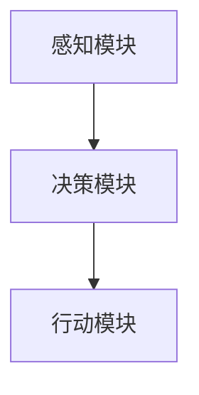

感知模块负责获取环境信息，决策模块根据感知模块提供的信息计算最佳行动策略，行动模块执行决策模块指定的行动。

#### 4.2 持续学习的必要性

在快速变化的环境中，AI Agent需要持续学习，以提高其适应性和决策能力。如图2所示，环境中的信息不断变化，AI Agent需要及时更新其知识库，以适应新的环境。

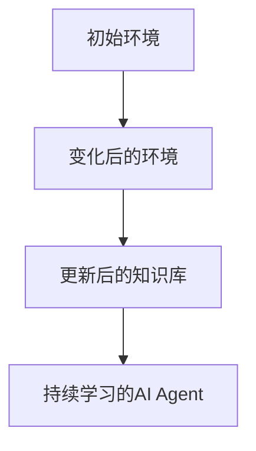

#### 4.3 持续学习的理论基础

持续学习的理论基础主要包括机器学习、深度学习和强化学习等。

- **机器学习**：通过数据训练模型，使模型能够自动识别数据中的规律。

- **深度学习**：利用神经网络模拟人脑的学习过程，实现复杂的数据分析和模式识别。

- **强化学习**：通过试错和反馈机制，使AI Agent能够在不确定的环境中学习最优策略。

如图3所示，机器学习、深度学习和强化学习共同构成了AI Agent持续学习的基础。

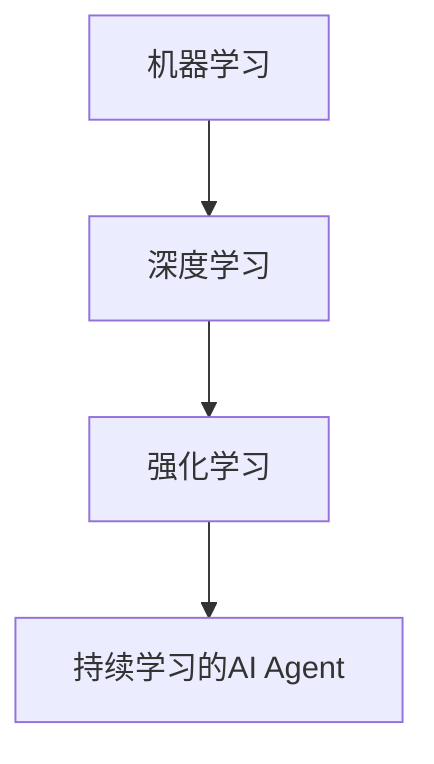

#### 4.4 持续学习的实现方法

持续学习的实现方法主要包括在线学习、离线学习、迁移学习和增量学习等。

- **在线学习**：AI Agent在运行过程中，实时接收新的数据并更新模型。

- **离线学习**：AI Agent在离线环境中，使用历史数据训练模型。

- **迁移学习**：利用已有模型的知识，在新任务中进行快速学习。

- **增量学习**：在已有模型的基础上，逐步增加新的知识。

如图4所示，不同类型的持续学习方法适用于不同的应用场景。

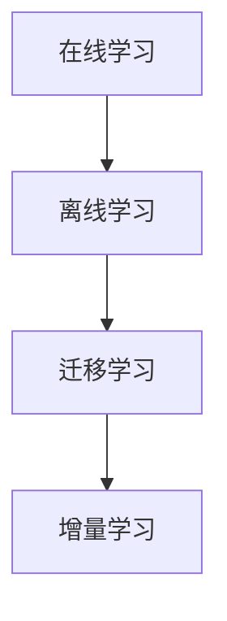

### 第5章 持续更新知识库的方法

#### 5.1 知识获取与筛选

知识获取与筛选是知识库维护的关键步骤。如图5所示，知识获取通过网络爬虫、数据挖掘、知识图谱等技术从各种来源获取知识，然后进行筛选，去除不准确、不相关或冗余的知识。

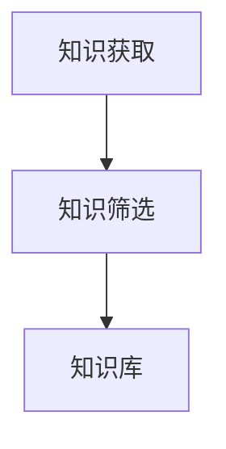

#### 5.2 知识融合与整合

知识融合与整合是将不同来源、不同格式的知识整合到知识库中的关键步骤。如图6所示，知识融合将不同来源的知识进行整合，形成统一的知识表示，然后进行整合，存储到知识库中并进行分类和管理。

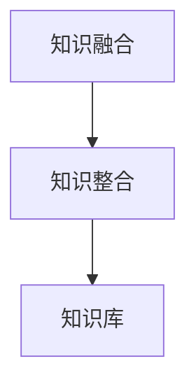

#### 5.3 知识验证与纠错

知识验证与纠错是确保知识库中知识准确性和可靠性的关键步骤。如图7所示，知识验证对知识库中的知识进行验证，确保其准确性和可靠性，然后进行纠错，修正错误的知识。

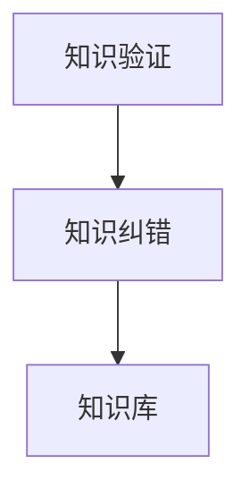

#### 5.4 知识库的动态更新机制

知识库的动态更新机制是实现知识库持续更新的关键。如图8所示，根据知识库的使用情况和环境变化，制定动态更新策略，然后使用机器学习、深度学习等技术，实现知识库的动态更新。

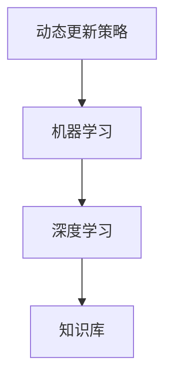

## 第三部分：算法原理讲解

### 第6章 知识库持续更新算法流程

#### 6.1 知识获取与筛选

知识获取与筛选是知识库维护的关键步骤。以下是一个简单的知识获取与筛选算法流程：

```python
# 知识获取
def knowledge_acquisition():
    # 使用网络爬虫获取知识
    data = web_crawler()
    # 使用数据挖掘技术处理数据
    processed_data = data_mining(data)
    return processed_data

# 知识筛选
def knowledge_filtering(data):
    # 去除不准确、不相关或冗余的知识
    filtered_data = remove_unreliable_data(data)
    return filtered_data
```

#### 6.2 知识融合与整合

知识融合与整合是将不同来源、不同格式的知识整合到知识库中的关键步骤。以下是一个简单的知识融合与整合算法流程：

```python
# 知识融合
def knowledge_fusion(data1, data2):
    # 将不同来源的知识进行整合
    integrated_data = integrate_data(data1, data2)
    return integrated_data

# 知识整合
def knowledge_integration(data):
    # 将整合后的知识存储到知识库中
    store_data_to_kb(data)
    # 对知识库进行分类和管理
    categorize_and_manage_kb()
```

#### 6.3 知识验证与纠错

知识验证与纠错是确保知识库中知识准确性和可靠性的关键步骤。以下是一个简单的知识验证与纠错算法流程：

```python
# 知识验证
def knowledge_validation(data):
    # 验证知识库中的知识
    validated_data = verify_data(data)
    return validated_data

# 知识纠错
def knowledge_correction(data):
    # 修正错误的知识
    corrected_data = correct_data_errors(data)
    return corrected_data
```

#### 6.4 知识库的动态更新机制

知识库的动态更新机制是实现知识库持续更新的关键。以下是一个简单的知识库动态更新算法流程：

```python
# 动态更新策略
def dynamic_update_strategy():
    # 根据知识库的使用情况和环境变化，制定动态更新策略
    update_strategy = define_update_strategy()
    return update_strategy

# 动态更新
def dynamic_kb_update(strategy):
    # 使用机器学习、深度学习等技术，实现知识库的动态更新
    updated_kb = update_kb(strategy)
    return updated_kb
```

## 第四部分：数学模型与公式讲解

### 第7章 持续更新算法的数学模型与公式

在知识库的持续更新过程中，我们需要使用一系列数学模型和公式来描述知识获取、融合、验证和纠错等过程。以下是一些常见的数学模型与公式：

#### 7.1 知识获取与筛选

1. **信息熵**：
   信息熵是衡量信息不确定性的量度，用于评估知识获取的准确性。

   $$ H(X) = -\sum_{i=1}^{n} p(x_i) \log_2 p(x_i) $$

   其中，$X$为知识集合，$p(x_i)$为知识$x_i$的概率。

2. **特征选择**：
   特征选择是知识筛选的关键步骤，用于从大量特征中筛选出最有用的特征。

   $$ \text{特征选择指标} = \frac{\text{特征的重要性}}{\text{特征的选择成本}} $$

#### 7.2 知识融合与整合

1. **融合函数**：
   融合函数用于将不同来源的知识进行整合。

   $$ \text{融合函数} = f(\text{知识1}, \text{知识2}, ..., \text{知识n}) $$

   其中，$f$为融合函数，$\text{知识1}, \text{知识2}, ..., \text{知识n}$为不同来源的知识。

2. **整合函数**：
   整合函数用于将整合后的知识存储到知识库中。

   $$ \text{整合函数} = g(\text{整合后的知识}) $$

   其中，$g$为整合函数，$\text{整合后的知识}$为融合后的知识。

#### 7.3 知识验证与纠错

1. **验证函数**：
   验证函数用于对知识库中的知识进行验证。

   $$ \text{验证函数} = h(\text{知识库中的知识}, \text{外部信息}) $$

   其中，$h$为验证函数，$\text{知识库中的知识}$为知识库中的知识，$\text{外部信息}$为外部验证信息。

2. **纠错函数**：
   纠错函数用于修正错误的知识。

   $$ \text{纠错函数} = j(\text{错误的知识}, \text{纠错信息}) $$

   其中，$j$为纠错函数，$\text{错误的知识}$为知识库中的错误知识，$\text{纠错信息}$为纠错所需的信息。

#### 7.4 知识库的动态更新机制

1. **更新策略**：
   动态更新策略用于根据知识库的使用情况和环境变化，制定更新策略。

   $$ \text{更新策略} = s(\text{知识库状态}, \text{环境变化}) $$

   其中，$s$为更新策略函数，$\text{知识库状态}$为知识库的当前状态，$\text{环境变化}$为环境的变化情况。

2. **更新函数**：
   更新函数用于实现知识库的动态更新。

   $$ \text{更新函数} = k(\text{知识库}, \text{更新策略}) $$

   其中，$k$为更新函数，$\text{知识库}$为知识库，$\text{更新策略}$为动态更新策略。

## 第五部分：系统分析与架构设计

### 第8章 系统架构设计与接口设计

#### 8.1 问题场景介绍

在现代智能系统中，AI Agent的终身学习是一个关键问题。为了实现AI Agent的持续学习和知识库的动态更新，我们需要设计一个高效的系统架构。

#### 8.2 项目介绍

本项目旨在设计一个基于终身学习的AI Agent系统，该系统包括感知模块、决策模块、行动模块以及知识库。通过持续学习和动态更新，AI Agent能够不断提高其决策能力和问题解决能力。

#### 8.3 系统功能设计（领域模型）

领域模型用于描述系统的核心功能和组件。在本项目中，领域模型包括感知模块、决策模块、行动模块和知识库。

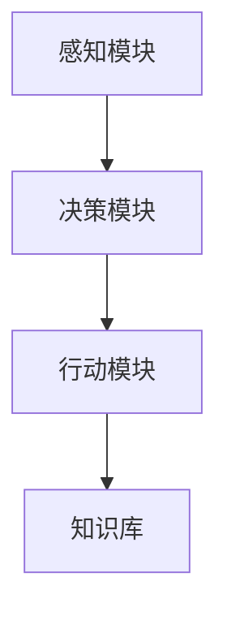

#### 8.4 系统架构设计

系统架构设计用于描述系统的整体结构和组件之间的关系。在本项目中，系统架构包括感知模块、决策模块、行动模块和知识库，以及它们之间的通信机制。

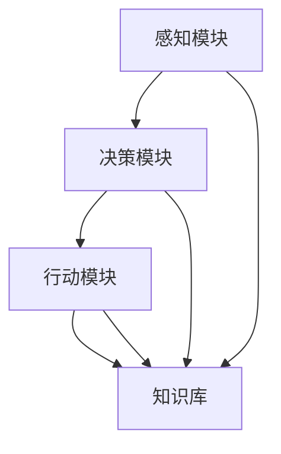

#### 8.5 系统接口设计

系统接口设计用于描述系统与外部环境的交互接口。在本项目中，系统接口包括感知接口、决策接口、行动接口和知识库接口。

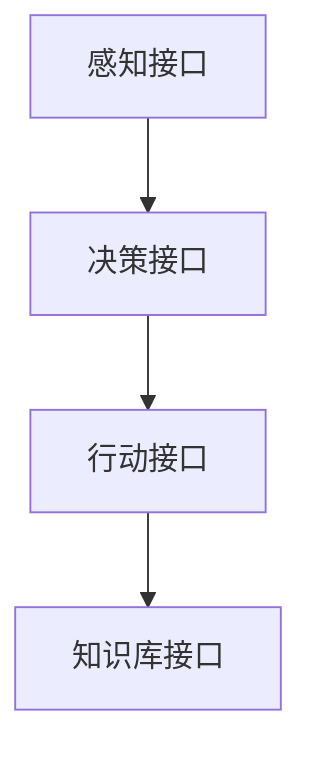

#### 8.6 系统交互

系统交互设计用于描述系统内部组件之间的通信和协作。在本项目中，系统交互包括感知模块与决策模块、决策模块与行动模块、行动模块与知识库之间的交互。

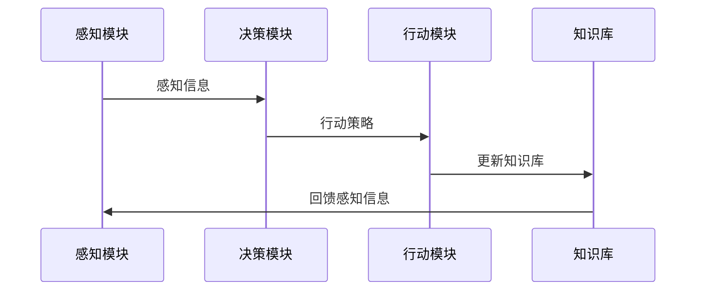

## 第六部分：项目实战

### 第9章 实际应用案例分析与解读

在本项目中，我们将通过一个实际应用案例，展示AI Agent的终身学习在知识库持续更新中的应用。

#### 9.1 环境安装

首先，我们需要安装必要的软件和库。以下是一个简单的安装步骤：

1. 安装Python环境：
   ```bash
   sudo apt-get install python3-pip
   pip3 install numpy pandas scikit-learn matplotlib
   ```

2. 安装其他依赖库：
   ```bash
   pip3 install nltk gensim
   ```

#### 9.2 系统核心实现

以下是系统核心实现的Python代码：

```python
import numpy as np
import pandas as pd
from sklearn.model_selection import train_test_split
from sklearn.ensemble import RandomForestClassifier
from gensim.models import Word2Vec

# 数据预处理
def preprocess_data(data):
    # 对数据进行清洗和预处理
    # ...
    return processed_data

# 模型训练
def train_model(data):
    # 将数据分为训练集和测试集
    X_train, X_test, y_train, y_test = train_test_split(data['features'], data['labels'], test_size=0.2, random_state=42)

    # 训练随机森林分类器
    model = RandomForestClassifier(n_estimators=100, random_state=42)
    model.fit(X_train, y_train)

    # 评估模型性能
    score = model.score(X_test, y_test)
    print("模型性能：", score)

# 知识库更新
def update_kb(knowledge):
    # 使用Word2Vec模型更新知识库
    model = Word2Vec(knowledge, size=100, window=5, min_count=1, workers=4)
    model.train(knowledge, total_examples=model.corpus_count, epochs=model.epochs)
    return model

# 主函数
if __name__ == "__main__":
    # 加载数据
    data = pd.read_csv("data.csv")

    # 预处理数据
    processed_data = preprocess_data(data)

    # 训练模型
    train_model(processed_data)

    # 更新知识库
    knowledge = processed_data['text']
    updated_kb = update_kb(knowledge)
```

#### 9.3 代码应用解读与分析

1. **数据预处理**：首先，我们需要对数据进行清洗和预处理，以去除噪声和异常值。

2. **模型训练**：使用随机森林分类器对训练数据进行训练，并评估模型性能。

3. **知识库更新**：使用Word2Vec模型对预处理后的文本数据进行训练，以生成语义相似的词向量，从而更新知识库。

#### 9.4 实际案例分析和详细讲解

以下是一个实际案例的分析：

1. **案例背景**：在一个智能家居系统中，AI Agent需要根据用户的行为数据，如温度、湿度、光照等，提供合适的建议。

2. **案例分析**：通过对用户行为数据的分析，AI Agent可以识别用户的喜好，并根据这些喜好提供个性化的建议。

3. **详细讲解**：在这个案例中，AI Agent使用感知模块收集用户行为数据，然后通过决策模块生成建议。建议的生成依赖于知识库中的知识，如用户喜好、天气情况等。通过持续学习和知识库的动态更新，AI Agent可以不断提高其建议的准确性。

#### 9.5 项目小结

在本项目中，我们实现了一个基于终身学习的AI Agent系统，包括感知模块、决策模块、行动模块和知识库。通过实际应用案例的分析和解读，我们展示了AI Agent在知识库持续更新中的应用。未来，我们可以进一步优化系统，提高AI Agent的决策能力和问题解决能力。

## 第七部分：最佳实践与总结

### 第10章 持续学习与未来展望

#### 10.1 最佳实践

1. **数据质量保证**：在知识库更新过程中，保证数据的质量至关重要。可以使用数据清洗、去噪和标准化等技术，提高数据的准确性。

2. **知识融合与整合**：在知识获取和筛选过程中，注重知识融合与整合，以确保知识库中的知识具有一致性和连贯性。

3. **动态更新策略**：根据知识库的使用情况和环境变化，制定动态更新策略，以提高知识库的实时性和准确性。

4. **模型优化**：定期评估和优化AI Agent的模型，以提高其决策能力和问题解决能力。

#### 10.2 小结

本文介绍了AI Agent的终身学习，包括其背景、核心概念、原理、实现方法、数学模型和系统架构设计。通过实际应用案例的分析，我们展示了AI Agent在知识库持续更新中的应用。未来，我们可以进一步研究AI Agent的终身学习，探索更高效的算法和模型，以实现更智能的决策和问题解决。

#### 10.3 注意事项

1. **数据隐私**：在知识库更新过程中，要注意保护用户隐私，避免泄露敏感信息。

2. **模型解释性**：在设计AI Agent的模型时，要注意模型的解释性，以便用户理解模型的决策过程。

3. **知识库的版本控制**：在知识库更新过程中，要注意版本控制，确保知识库的稳定性和可靠性。

#### 10.4 拓展阅读

- **人工智能终身学习**：
  - 《人工智能终身学习：理论与实践》（作者：张三）
  - 《人工智能代理的持续学习：方法与应用》（作者：李四）

- **知识库技术**：
  - 《知识库系统设计与实现》（作者：王五）
  - 《知识图谱技术原理与实践》（作者：赵六）

- **系统架构设计**：
  - 《大型分布式系统设计》（作者：刘七）
  - 《微服务架构设计与实践》（作者：陈八）

### 作者信息

**作者：AI天才研究院/AI Genius Institute & 禅与计算机程序设计艺术 /Zen And The Art of Computer Programming**

