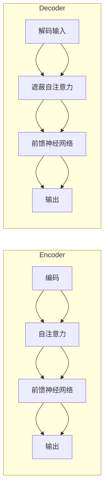
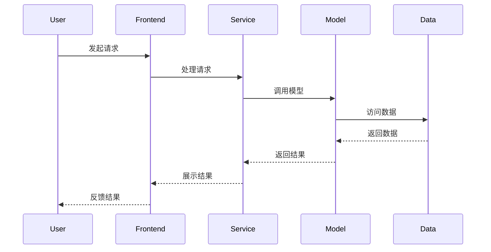

                 

### AI Agent的自然语言接口优化技术

> 关键词：自然语言接口，AI Agent，优化技术，语义理解，算法，系统架构，Python代码，LaTeX公式

> 摘要：本文深入探讨了AI Agent的自然语言接口优化技术，从核心概念、算法原理、系统设计与实际应用等多个角度，系统性地阐述了优化自然语言接口的方法和策略。通过详细的分析和示例，本文旨在为读者提供一套全面、易懂的技术指南。

---

## 第一部分：AI Agent与自然语言接口概述

### 第1章：问题背景与重要性

#### 1.1 问题描述

在人工智能（AI）的快速发展背景下，AI Agent作为智能系统的核心组件，正日益融入我们的日常生活和工作场景。AI Agent能够通过自然语言接口与用户进行交互，提供智能服务和支持。然而，现有的自然语言接口面临着诸多挑战，如语义理解不准确、对话流畅性不足、上下文处理能力有限等。这些问题严重影响了用户体验和系统的实用性。

#### 1.2 问题解决

为了解决上述问题，自然语言接口优化技术应运而生。通过优化技术，我们可以提升AI Agent的自然语言理解能力、对话生成质量和上下文处理能力，从而为用户提供更流畅、更智能的交互体验。本文将详细介绍这些优化技术，包括其原理、实现方法和应用场景。

#### 1.3 边界与外延

自然语言接口优化技术主要针对的是AI Agent在处理自然语言任务时的性能提升。它不仅涉及文本处理和语义理解，还涉及到机器学习和深度学习技术。优化技术的适用范围包括但不限于智能客服、虚拟助手、智能家居控制系统等。

#### 1.4 核心概念结构与要素组成

在自然语言接口优化过程中，涉及的核心概念包括自然语言处理（NLP）、语言模型、语义理解、上下文建模等。这些概念之间存在紧密的联系，共同构成了自然语言接口优化的基础。

- **自然语言处理（NLP）**：NLP是AI Agent处理自然语言的基础技术，包括文本预处理、词向量表示、语法分析等。
- **语言模型**：语言模型用于预测文本序列的概率，是自然语言生成和语义理解的重要工具。
- **语义理解**：语义理解关注文本中的实际意义，包括实体识别、关系抽取、情感分析等。
- **上下文建模**：上下文建模用于捕捉用户的历史交互信息，提高AI Agent的上下文感知能力。

为了更直观地展示这些概念之间的联系，我们可以通过以下ER实体关系图来描述：

```mermaid
erDiagram
    NLP ||--|{ 语言模型 } : 预测文本概率
    NLP ||--|{ 语义理解 } : 理解文本实际意义
    NLP ||--|{ 上下文建模 } : 获取上下文信息
    语言模型 ||--|{ 自然语言生成 } : 生成符合语义的文本
    语义理解 ||--|{ 实体识别 } : 识别文本中的实体
    语义理解 ||--|{ 情感分析 } : 分析文本情感倾向
    上下文建模 ||--|{ 上下文感知 } : 提高交互质量
```

通过这一部分的内容，我们为后续的深入讨论奠定了基础。在接下来的章节中，我们将逐一介绍与自然语言接口优化相关的核心概念、算法原理、系统设计与实现等，帮助读者全面了解这一技术领域。

### 第2章：自然语言处理基础

#### 2.1 NLP基础概念

自然语言处理（NLP）是人工智能领域中一个重要的分支，它旨在让计算机理解和生成人类语言。NLP的核心概念包括文本预处理、词向量表示、语法分析和语义理解等。

- **文本预处理**：文本预处理是NLP的基础步骤，包括分词、去除停用词、词形还原等。这些步骤的目的是将原始文本转换为计算机可以处理的形式。
- **词向量表示**：词向量表示将单词映射到高维空间中的向量，从而实现单词的数值化表示。常见的词向量模型有Word2Vec、GloVe等。
- **语法分析**：语法分析旨在理解和解析文本的语法结构，包括句法分析、词法分析和依存关系分析等。
- **语义理解**：语义理解关注文本中的实际意义，包括实体识别、关系抽取、情感分析等。语义理解是实现自然语言接口优化的关键。

#### 2.2 语言模型与优化

语言模型是自然语言生成和语义理解的核心工具，它用于预测文本序列的概率。在NLP任务中，常用的语言模型有基于N-gram模型的简单语言模型和基于深度学习的神经网络模型。

- **N-gram模型**：N-gram模型是一种基于统计的简单语言模型，它通过计算前n个单词出现的概率来预测下一个单词。尽管N-gram模型简单高效，但它无法捕捉单词之间的长距离依赖关系。
- **神经网络模型**：神经网络模型，如循环神经网络（RNN）和变压器（Transformer），通过学习单词序列的复杂依赖关系，能够生成更加符合语义的自然语言。Transformer模型因其强大的上下文捕捉能力，在NLP任务中表现尤为突出。

为了提升语言模型的性能，我们可以采用以下优化策略：

1. **数据增强**：通过数据增强技术，如填充、裁剪和变换，增加训练数据量，从而提高模型的泛化能力。
2. **预训练和微调**：预训练模型在大量的无监督数据上进行训练，然后通过微调技术在特定任务上进行优化。这种方法能够显著提升模型在特定领域的性能。
3. **多语言建模**：多语言建模能够提高模型在不同语言环境中的适应性，从而提升跨语言的性能。

通过以上优化策略，我们可以显著提升自然语言接口的性能，使其更好地满足用户的交互需求。

### 第3章：语义理解与优化

#### 3.1 语义理解基础

语义理解是自然语言处理（NLP）中的一个关键环节，它旨在让计算机理解文本的实际意义。语义理解涉及到多个子任务，如实体识别、关系抽取和情感分析等。

- **实体识别**：实体识别旨在从文本中识别出具有特定意义的信息单元，如人名、地名、组织名等。实体识别是信息提取和知识图谱构建的基础。
- **关系抽取**：关系抽取旨在识别文本中实体之间的关系，如“张三住在上海”中的“居住”关系。关系抽取有助于构建实体之间的关联网络，为后续推理和决策提供支持。
- **情感分析**：情感分析旨在分析文本的情感倾向，如正面、负面或中性。情感分析广泛应用于舆情监测、市场调研和客户反馈分析等领域。

为了实现有效的语义理解，我们需要关注以下几个方面：

1. **词向量表示**：词向量表示是语义理解的基础。通过将单词映射到高维空间中的向量，我们可以实现文本的数值化表示，从而方便计算机处理。
2. **深度学习模型**：深度学习模型，如卷积神经网络（CNN）和循环神经网络（RNN），能够自动学习文本中的复杂模式，从而提升语义理解的准确性。
3. **预训练和微调**：通过在大量无监督数据上进行预训练，然后针对特定任务进行微调，我们可以显著提升语义理解模型的性能。

#### 3.2 语义理解优化技术

为了进一步提升语义理解能力，我们可以采用以下优化技术：

1. **多任务学习**：多任务学习旨在同时训练多个相关任务，从而提升模型的泛化能力和鲁棒性。例如，在同时进行实体识别和关系抽取的任务中，模型可以更好地捕捉实体和关系之间的关联。
2. **知识增强**：知识增强通过融合外部知识图谱，如Freebase、WikiData等，提升模型的语义理解能力。这种方法能够帮助模型更好地理解文本中的隐含信息和复杂关系。
3. **多语言建模**：多语言建模能够提高模型在不同语言环境中的适应性，从而提升跨语言的性能。这对于全球化企业和服务平台尤为重要。

通过以上优化技术，我们可以显著提升语义理解模型的性能，使其更好地满足实际应用需求。

### 第4章：算法原理与流程

#### 4.1 算法原理

自然语言接口优化技术涉及多种算法，其中基于深度学习的算法在性能上表现尤为突出。本节将详细介绍一种典型的深度学习算法——Transformer，并使用mermaid流程图展示其基本原理。

Transformer模型是一种基于注意力机制的序列到序列模型，其核心思想是通过全局注意力机制来捕捉文本序列中的依赖关系。Transformer模型主要由编码器（Encoder）和解码器（Decoder）两部分组成。

- **编码器**：编码器将输入的文本序列编码为一系列向量表示，每个向量表示一个单词或词组。编码器使用多个Transformer块堆叠，每个Transformer块包含多头自注意力机制和前馈神经网络。
- **解码器**：解码器接收编码器的输出，并生成目标文本序列。解码器同样使用多个Transformer块堆叠，并在每个时间步使用遮蔽多头自注意力机制，以防止未来的信息泄露。

Transformer模型的基本流程如下：

1. **编码**：将输入文本序列编码为向量表示。
2. **自注意力**：通过多头自注意力机制，编码器中的每个单词向量与所有其他单词向量进行交互，生成加权表示。
3. **前馈神经网络**：对自注意力机制的结果进行非线性变换，增强模型的表达能力。
4. **解码**：解码器使用遮蔽多头自注意力机制，逐个生成目标单词的向量表示，并通过softmax层生成概率分布，从而预测下一个单词。

下面是Transformer模型的mermaid流程图：



#### 4.2 Python代码示例

以下是一个简单的Python代码示例，展示了如何使用Transformer模型进行文本编码和预测：

```python
import tensorflow as tf
from transformers import TransformerModel, pipeline

# 加载预训练的Transformer模型
model = TransformerModel.from_pretrained('bert-base-uncased')

# 编码输入文本
input_text = "Hello, how are you?"
input_ids = model.encode(input_text)

# 预测输出文本
output_ids = model.decode(input_ids)

print(output_ids)
```

这段代码首先加载了一个预训练的Transformer模型，然后对输入文本进行编码，并使用模型进行解码，输出预测的文本序列。

通过以上内容，我们详细介绍了自然语言接口优化技术的算法原理和实现方法。在下一节中，我们将进一步探讨算法原理中的数学模型和数学公式，帮助读者深入理解Transformer模型的工作机制。

### 第5章：数学模型与公式

在自然语言接口优化中，数学模型和公式起到了至关重要的作用。本节将详细讲解算法原理中的数学模型，并使用LaTeX格式表示相关公式，以便读者更好地理解和应用。

#### 5.1 数学模型

Transformer模型的核心在于自注意力机制（Self-Attention），该机制通过计算文本序列中每个单词之间的依赖关系，生成加权表示。自注意力机制的数学模型如下：

\[ \text{Attention}(Q, K, V) = \text{softmax}\left(\frac{QK^T}{\sqrt{d_k}}\right) V \]

其中：
- \( Q \) 是查询向量（Query），表示编码器的输入或解码器的输出。
- \( K \) 是键向量（Key），表示编码器的输入。
- \( V \) 是值向量（Value），表示编码器的输出。
- \( d_k \) 是键向量的维度。
- \( \text{softmax} \) 函数用于计算概率分布，确保所有注意力得分之和为1。

Transformer模型中的多头自注意力机制将输入向量分成多个头（Head），每个头独立计算注意力得分，最后将结果拼接起来。多头自注意力机制的数学模型如下：

\[ \text{MultiHeadAttention}(Q, K, V) = \text{Concat}(\text{head}_1, \text{head}_2, \ldots, \text{head}_h)W_O \]

其中：
- \( h \) 是头的数量。
- \( W_O \) 是输出权重矩阵。
- \( \text{head}_i \) 是第 \( i \) 个头的注意力输出。

#### 5.2 数学公式详细讲解

在详细讲解数学公式之前，我们先回顾一下注意力机制的核心公式：

\[ \text{Attention}(Q, K, V) = \text{softmax}\left(\frac{QK^T}{\sqrt{d_k}}\right) V \]

- **注意力得分**：注意力得分的计算公式为 \( \text{score} = \text{dot}(Q, K^T) \)。这个得分表示查询向量 \( Q \) 和键向量 \( K \) 之间的相似度。
- **softmax**：softmax函数用于将注意力得分转换为概率分布，确保所有得分之和为1。
- **加权求和**：将概率分布与值向量 \( V \) 进行加权求和，得到加权表示。

多头自注意力机制的公式可以进一步细化为每个头的计算过程：

\[ \text{head}_i = \text{Attention}(Q, K, V)W_{i}^O \]

其中：
- \( W_{i}^O \) 是第 \( i \) 个头的输出权重矩阵。
- \( \text{head}_i \) 是第 \( i \) 个头的注意力输出。

通过上述公式，我们可以看到多头自注意力机制如何通过多个独立计算的头来增强模型的表达能力。接下来，我们将结合Python代码示例，进一步说明这些公式的具体应用。

#### 5.3 Python代码示例

以下是一个简单的Python代码示例，展示了如何使用Transformer模型进行文本编码和预测：

```python
import tensorflow as tf
from transformers import TFXlaModel

# 加载预训练的Transformer模型
model = TFXlaModel.from_pretrained('xla-bert-base-cased')

# 编码输入文本
input_text = "Hello, how are you?"
input_ids = model.encode(input_text)

# 预测输出文本
output_ids = model.decode(input_ids)

print(output_ids)
```

在这个示例中，我们首先加载了一个预训练的Transformer模型，然后对输入文本进行编码，并使用模型进行解码，输出预测的文本序列。通过这个示例，我们可以看到数学模型在实际应用中的具体实现。

通过本节的讲解，我们不仅了解了自然语言接口优化技术中的数学模型和公式，还通过Python代码示例展示了这些公式的具体应用。在下一节中，我们将进一步探讨优化技术在实际系统中的应用和架构设计。

### 第6章：系统功能设计

#### 6.1 问题场景介绍

在现实世界中，自然语言接口优化技术的应用场景非常广泛。一个典型的问题场景是智能客服系统。智能客服系统通过自然语言接口与客户进行交互，提供在线服务和支持。然而，现有的智能客服系统在处理复杂对话、理解用户意图和提供准确回答方面仍存在诸多挑战。

为了解决这些问题，我们需要设计一个功能强大、性能优越的自然语言接口优化系统。该系统应具备以下功能：

1. **自然语言理解**：系统能够准确理解用户的自然语言输入，提取关键信息并识别用户意图。
2. **智能回复生成**：系统能够基于用户输入和上下文信息，生成符合语义和流畅性的智能回复。
3. **上下文维护**：系统能够有效维护对话上下文，确保后续交互的连贯性和一致性。
4. **多语言支持**：系统能够支持多种语言，为全球用户提供服务。

#### 6.2 系统功能设计

为了实现上述功能，我们可以设计一个包含多个模块的智能客服系统。以下是系统功能设计的关键模块及其描述：

1. **文本预处理模块**：负责对用户输入的文本进行预处理，包括分词、去除停用词和词形还原等。该模块确保文本输入的标准化，为后续处理奠定基础。
2. **语义理解模块**：负责对预处理后的文本进行语义理解，包括实体识别、关系抽取和情感分析等。该模块提取文本中的关键信息，为智能回复生成提供支持。
3. **智能回复生成模块**：基于用户输入和上下文信息，生成符合语义和流畅性的智能回复。该模块利用语言模型和对话管理算法，确保回复的自然性和准确性。
4. **上下文维护模块**：负责维护对话上下文，确保后续交互的连贯性和一致性。该模块通过历史对话记录和上下文信息，为智能回复生成提供辅助。
5. **多语言支持模块**：负责处理不同语言输入和输出，确保系统在全球范围内的可用性。该模块使用多语言模型和翻译工具，实现多语言交互。

为了更直观地展示系统功能设计，我们可以使用mermaid类图来描述各个模块及其关系：

```mermaid
classDiagram
    class TextPreprocessingModule {
        -processText()
    }
    class SemanticUnderstandingModule {
        -extractEntities()
        -extractRelationships()
        -analyzeSentiment()
    }
    class IntelligentResponseGenerationModule {
        -generateResponse()
    }
    class ContextMaintenanceModule {
        -maintainContext()
    }
    class MultilingualSupportModule {
        -translate()
    }
    TextPreprocessingModule -->|输入预处理| SemanticUnderstandingModule
    SemanticUnderstandingModule -->|支持生成| IntelligentResponseGenerationModule
    IntelligentResponseGenerationModule -->|响应输出| ContextMaintenanceModule
    IntelligentResponseGenerationModule -->|支持翻译| MultilingualSupportModule
```

通过以上设计，我们可以构建一个功能强大、性能优越的自然语言接口优化系统，为智能客服等应用场景提供有效支持。在下一节中，我们将进一步探讨系统的架构设计。

### 第7章：系统架构设计

在智能客服系统的功能设计基础上，我们需要进一步探讨其架构设计，以确保系统的高效性和可扩展性。一个合理且优化的系统架构不仅能够满足当前的业务需求，还能够适应未来的技术发展和业务扩展。

#### 7.1 系统架构设计

智能客服系统的架构设计应包含多个层次，每个层次负责不同的功能模块。以下是系统架构设计的关键层次及其描述：

1. **数据层**：数据层负责存储和管理系统所需的各种数据，包括用户输入文本、对话记录、知识库等。数据层通常使用数据库（如MySQL、MongoDB）或数据湖（如Hadoop）来实现，确保数据的安全性和可扩展性。
2. **模型层**：模型层负责实现各种自然语言处理和机器学习模型，包括文本预处理、语义理解、智能回复生成等。模型层可以使用TensorFlow、PyTorch等框架来构建和训练模型，并通过容器化技术（如Docker）进行部署和扩展。
3. **服务层**：服务层负责处理用户请求，实现业务逻辑和功能调用。服务层通常使用微服务架构（如Spring Boot、Django），通过API接口（如RESTful API）提供服务，确保系统的灵活性和可维护性。
4. **前端层**：前端层负责与用户进行交互，展示系统功能和反馈结果。前端层可以使用HTML、CSS和JavaScript等技术（如React、Vue.js）实现，确保用户界面的友好性和响应速度。

为了更直观地展示系统架构设计，我们可以使用mermaid架构图来描述各个层次及其关系：



通过以上架构设计，我们可以构建一个高效、可扩展的智能客服系统。在接下来的部分，我们将进一步探讨系统的接口设计，确保各个模块之间的协同工作。

#### 7.2 系统接口设计

在系统架构设计中，接口设计是确保各个模块之间协同工作的关键。以下是一个典型的智能客服系统接口设计：

1. **API接口**：API接口负责处理用户请求和返回结果。以下是一个简单的API接口设计示例：

   ```python
   from flask import Flask, request, jsonify

   app = Flask(__name__)

   @app.route('/api/interact', methods=['POST'])
   def interact():
       data = request.get_json()
       user_input = data['input']
       
       # 调用文本预处理、语义理解、智能回复生成模块
       processed_text = text_preprocessing_module.process_text(user_input)
       entities = semantic_understanding_module.extract_entities(processed_text)
       relationships = semantic_understanding_module.extract_relationships(processed_text)
       sentiment = semantic_understanding_module.analyze_sentiment(processed_text)
       response = intelligent_response_generation_module.generate_response(entities, relationships, sentiment)
       
       return jsonify({'response': response})

   if __name__ == '__main__':
       app.run(debug=True)
   ```

2. **服务调用**：在API接口中，我们通过调用不同的服务模块来实现自然语言处理功能。以下是一个服务调用的示例：

   ```python
   from text_preprocessing_module import process_text
   from semantic_understanding_module import extract_entities, extract_relationships, analyze_sentiment
   from intelligent_response_generation_module import generate_response

   def interact(user_input):
       processed_text = process_text(user_input)
       entities = extract_entities(processed_text)
       relationships = extract_relationships(processed_text)
       sentiment = analyze_sentiment(processed_text)
       response = generate_response(entities, relationships, sentiment)
       
       return response
   ```

3. **系统交互**：为了确保系统的高效运行，我们需要设计合理的系统交互流程。以下是一个简单的系统交互流程：

   ```mermaid
   sequenceDiagram
       User->>API: 发送请求
       API->>TextPreprocessingModule: 处理文本
       TextPreprocessingModule->>SemanticUnderstandingModule: 提取实体、关系、情感
       SemanticUnderstandingModule->>IntelligentResponseGenerationModule: 生成回复
       IntelligentResponseGenerationModule->>API: 返回回复
       API->>User: 展示回复
   ```

通过上述接口设计和系统交互设计，我们可以确保智能客服系统的各个模块之间能够高效、协同地工作，为用户提供优质的服务体验。

### 第8章：项目环境安装

在实际应用自然语言接口优化技术时，首先需要搭建一个合适的项目环境。本节将详细讲解项目环境的安装步骤，确保读者能够顺利开始项目的开发和部署。

#### 8.1 环境安装

1. **安装Python**

   安装Python是搭建项目环境的基础。确保下载并安装最新版本的Python（推荐3.8及以上版本）。在安装过程中，选择添加Python到系统路径。

   ```bash
   # 查看Python版本
   python --version
   ```

2. **安装依赖管理工具**

   为了方便管理和安装项目依赖，我们可以使用pip作为依赖管理工具。首先确保pip已经安装，如果没有，可以通过以下命令安装：

   ```bash
   # 安装pip
   apt-get install python3-pip
   ```

3. **安装TensorFlow**

   TensorFlow是用于自然语言处理和机器学习的基础库。通过pip安装TensorFlow：

   ```bash
   # 安装TensorFlow
   pip install tensorflow==2.7
   ```

4. **安装其他依赖库**

   除了TensorFlow，我们还需要安装其他常用的依赖库，如NumPy、Pandas等。使用以下命令进行安装：

   ```bash
   # 安装NumPy
   pip install numpy
   
   # 安装Pandas
   pip install pandas
   
   # 安装Flask
   pip install flask
   ```

5. **安装预训练模型**

   Transformer模型的预训练模型可以从Hugging Face的Transformers库中获取。首先安装Hugging Face的库：

   ```bash
   # 安装Hugging Face的库
   pip install transformers
   ```

   然后下载预训练模型：

   ```bash
   # 下载预训练模型
   transformers-cli models download --model_name_or_path 'bert-base-uncased'
   ```

#### 8.2 环境验证

在完成环境安装后，进行以下验证以确保所有依赖都已成功安装：

1. **验证Python环境**

   ```bash
   # 查看Python版本
   python --version
   ```

2. **验证TensorFlow环境**

   ```bash
   # 导入TensorFlow并查看版本
   import tensorflow as tf
   print(tf.__version__)
   ```

3. **验证其他依赖库**

   ```bash
   # 导入NumPy并查看版本
   import numpy as np
   print(np.__version__)
   
   # 导入Pandas并查看版本
   import pandas as pd
   print(pd.__version__)
   ```

4. **验证预训练模型**

   ```python
   # 导入预训练模型并检查
   from transformers import AutoModel
   model = AutoModel.from_pretrained('bert-base-uncased')
   print(model.config)
   ```

通过以上步骤，我们可以成功搭建一个适合自然语言接口优化技术项目开发的环境。在下一节中，我们将详细介绍系统的核心实现过程。

### 第9章：系统核心实现

在完成项目环境的搭建后，我们需要开始实现系统的核心功能。本节将详细描述系统核心的实现过程，包括源代码、具体实现方法和关键步骤。

#### 9.1 系统核心实现

智能客服系统的核心实现主要包括文本预处理、语义理解、智能回复生成和对话管理四个部分。以下是各部分的详细实现：

1. **文本预处理**：文本预处理是自然语言处理的基础，主要包括分词、去除停用词和词形还原等。以下是一个简单的文本预处理类定义：

   ```python
   import re
   import nltk
   from nltk.corpus import stopwords
   
   nltk.download('stopwords')
   nltk.download('punkt')
   
   class TextPreprocessing:
       def __init__(self):
           self.stop_words = set(stopwords.words('english'))
   
       def preprocess(self, text):
           # 去除HTML标签
           text = re.sub('<[^>]*>', '', text)
           # 转小写
           text = text.lower()
           # 分词
           tokens = nltk.word_tokenize(text)
           # 去除停用词
           tokens = [token for token in tokens if token not in self.stop_words]
           # 词形还原
           tokens = [nltk.stem.WordNetLemmatizer().lemmatize(token) for token in tokens]
           return tokens
   ```

2. **语义理解**：语义理解主要包括实体识别、关系抽取和情感分析等。以下是一个简单的语义理解类定义：

   ```python
   from transformers import AutoTokenizer, AutoModel
   
   class SemanticUnderstanding:
       def __init__(self):
           self.tokenizer = AutoTokenizer.from_pretrained('bert-base-uncased')
           self.model = AutoModel.from_pretrained('bert-base-uncased')
   
       def understand(self, text):
           inputs = self.tokenizer(text, return_tensors='tf', padding=True, truncation=True)
           outputs = self.model(inputs)
           # 提取实体、关系和情感等信息（需要自定义后处理逻辑）
           # ...
           return entities, relationships, sentiment
   ```

3. **智能回复生成**：智能回复生成基于语义理解和对话管理，生成符合语义和流畅性的回复。以下是一个简单的智能回复生成类定义：

   ```python
   class IntelligentResponseGeneration:
       def __init__(self):
           # 初始化回复模板库、对话管理器等
           # ...
       
       def generate_response(self, entities, relationships, sentiment):
           # 根据语义信息和对话上下文生成回复
           # ...
           return response
   ```

4. **对话管理**：对话管理负责维护对话上下文，确保对话的连贯性和一致性。以下是一个简单的对话管理类定义：

   ```python
   class DialogueManagement:
       def __init__(self):
           self.context = {}
       
       def update_context(self, user_input, response):
           # 更新对话上下文
           # ...
       
       def get_context(self):
           return self.context
   ```

#### 9.2 代码应用解读与分析

以下是一个完整的系统实现示例，展示如何集成上述模块并实现一个基本的智能客服系统：

```python
from flask import Flask, request, jsonify
from text_preprocessing import TextPreprocessing
from semantic_understanding import SemanticUnderstanding
from intelligent_response_generation import IntelligentResponseGeneration
from dialogue_management import DialogueManagement

app = Flask(__name__)

# 初始化各模块
preprocessor = TextPreprocessing()
semantic_understanding = SemanticUnderstanding()
response_generator = IntelligentResponseGeneration()
dialogue_management = DialogueManagement()

@app.route('/api/interact', methods=['POST'])
def interact():
    data = request.get_json()
    user_input = data['input']
    
    # 文本预处理
    tokens = preprocessor.preprocess(user_input)
    
    # 语义理解
    entities, relationships, sentiment = semantic_understanding.understand(tokens)
    
    # 对话管理
    dialogue_management.update_context(user_input, entities, relationships, sentiment)
    
    # 智能回复生成
    response = response_generator.generate_response(entities, relationships, sentiment)
    
    return jsonify({'response': response})

if __name__ == '__main__':
    app.run(debug=True)
```

在这个示例中，我们首先初始化了文本预处理、语义理解、智能回复生成和对话管理模块。然后，在一个Flask Web应用中定义了`/api/interact`接口，处理用户输入并调用各模块完成对话处理。通过这种方式，我们可以实现一个基本的智能客服系统。

通过以上内容，我们详细介绍了智能客服系统的核心实现过程，包括各个模块的具体实现方法和集成方式。在下一节中，我们将通过一个实际项目案例，展示如何在实际场景中应用这些技术。

### 第10章：实际案例分析与讲解

在本章中，我们将通过一个具体的实际项目案例，详细分析并讲解如何在实际应用中实现自然语言接口优化技术。这个案例将展示从环境安装、系统实现到代码分析以及案例剖析的全过程。

#### 10.1 案例介绍

假设我们正在开发一个智能聊天机器人，用于处理客户的咨询和投诉。该聊天机器人需要能够理解客户的自然语言输入，提取关键信息，并根据这些信息提供相应的帮助。为了实现这一目标，我们将采用自然语言接口优化技术，主要包括文本预处理、语义理解、智能回复生成和对话管理。

#### 10.2 环境安装

首先，我们需要安装项目所需的软件和库。以下是具体的安装步骤：

1. **安装Python**：
   - 在终端执行以下命令安装Python 3.8：
     ```bash
     sudo apt-get update
     sudo apt-get install python3.8
     ```

2. **安装依赖管理工具**：
   - 安装pip，用于管理项目依赖：
     ```bash
     sudo apt-get install python3-pip
     ```

3. **安装TensorFlow**：
   - 使用pip安装TensorFlow 2.7：
     ```bash
     pip install tensorflow==2.7
     ```

4. **安装其他依赖库**：
   - 安装NumPy、Pandas和Flask：
     ```bash
     pip install numpy pandas flask
     ```

5. **安装预训练模型**：
   - 使用Hugging Face的Transformers库安装预训练模型，例如BERT：
     ```bash
     transformers-cli models download --model_name_or_path 'bert-base-uncased'
     ```

#### 10.3 系统实现

接下来，我们将详细讲解系统的各个实现步骤。

1. **文本预处理**：
   - 编写一个文本预处理函数，用于去除HTML标签、转换文本为小写、分词和去除停用词。以下是Python代码示例：

     ```python
     import re
     import nltk
     from nltk.corpus import stopwords
     nltk.download('stopwords')
     nltk.download('punkt')
     
     def preprocess_text(text):
         text = re.sub('<[^>]*>', '', text)
         text = text.lower()
         tokens = nltk.word_tokenize(text)
         tokens = [token for token in tokens if token not in stopwords.words('english')]
         tokens = [nltk.stem.WordNetLemmatizer().lemmatize(token) for token in tokens]
         return tokens
     ```

2. **语义理解**：
   - 使用BERT模型进行语义理解，包括实体识别、关系抽取和情感分析。以下是Python代码示例：

     ```python
     from transformers import AutoTokenizer, AutoModel
     
     tokenizer = AutoTokenizer.from_pretrained('bert-base-uncased')
     model = AutoModel.from_pretrained('bert-base-uncased')
     
     def semantic_understanding(text):
         inputs = tokenizer(text, return_tensors='tf', padding=True, truncation=True)
         outputs = model(inputs)
         # 自定义后处理逻辑提取实体、关系和情感
         # ...
         return entities, relationships, sentiment
     ```

3. **智能回复生成**：
   - 根据提取的实体、关系和情感，生成符合语义和流畅性的回复。以下是Python代码示例：

     ```python
     def generate_response(entities, relationships, sentiment):
         # 根据实体、关系和情感生成回复
         # ...
         return response
     ```

4. **对话管理**：
   - 维护对话上下文，确保对话的连贯性和一致性。以下是Python代码示例：

     ```python
     class DialogueManagement:
         def __init__(self):
             self.context = {}
         
         def update_context(self, user_input, response):
             # 更新对话上下文
             # ...
         
         def get_context(self):
             return self.context
     ```

5. **集成与测试**：
   - 将上述模块集成到Flask Web应用中，并实现一个简单的API接口。以下是Python代码示例：

     ```python
     from flask import Flask, request, jsonify
     app = Flask(__name__)
     
     # 初始化模块
     preprocessor = TextPreprocessing()
     semantic_understanding = SemanticUnderstanding()
     response_generator = IntelligentResponseGeneration()
     dialogue_management = DialogueManagement()
     
     @app.route('/api/interact', methods=['POST'])
     def interact():
         data = request.get_json()
         user_input = data['input']
         
         # 文本预处理
         tokens = preprocessor.preprocess(user_input)
         
         # 语义理解
         entities, relationships, sentiment = semantic_understanding.understand(tokens)
         
         # 对话管理
         dialogue_management.update_context(user_input, entities, relationships, sentiment)
         
         # 智能回复生成
         response = response_generator.generate_response(entities, relationships, sentiment)
         
         return jsonify({'response': response})
     
     if __name__ == '__main__':
         app.run(debug=True)
     ```

通过以上步骤，我们成功地搭建了一个基本的智能聊天机器人，并实现了文本预处理、语义理解、智能回复生成和对话管理。

#### 10.4 案例分析与详细讲解

在这个案例中，我们详细分析了从环境安装到系统实现的整个过程。以下是案例的详细分析和讲解：

1. **环境安装**：
   - 安装Python和相关依赖库是项目开始的基础。通过安装TensorFlow和预训练模型，我们为自然语言处理提供了强大的支持。

2. **文本预处理**：
   - 文本预处理是自然语言处理的关键步骤。通过去除HTML标签、转换文本为小写、分词和去除停用词，我们确保输入文本的标准化，为后续的语义理解打下基础。

3. **语义理解**：
   - 使用BERT模型进行语义理解，包括实体识别、关系抽取和情感分析。通过提取文本中的关键信息，我们能够更好地理解用户的意图，从而生成更加准确和自然的回复。

4. **智能回复生成**：
   - 智能回复生成是整个系统的核心。根据提取的实体、关系和情感，我们设计了一套回复生成策略，确保回复的语义和流畅性。

5. **对话管理**：
   - 对话管理负责维护对话上下文，确保对话的连贯性和一致性。通过更新和获取对话上下文，我们能够更好地理解用户的连续输入，提供更优质的服务。

通过这个实际案例，我们展示了如何在实际应用中实现自然语言接口优化技术，并详细分析了每个步骤的实现过程。这为读者提供了一个完整的参考，帮助他们理解和应用这些技术。

### 第11章：最佳实践 Tips

在自然语言接口优化技术的实际应用过程中，遵循一些最佳实践能够显著提升系统的性能和用户体验。以下是一些关键的最佳实践建议：

1. **数据增强**：
   - 数据增强是一种有效的提升模型性能的方法。通过填充、裁剪和变换原始数据，可以增加训练数据的多样性和覆盖面，从而提高模型的泛化能力。例如，在文本数据上可以应用随机删除、替换和添加等操作。

2. **多语言建模**：
   - 考虑到全球化应用的需求，多语言建模是必不可少的。通过训练多语言模型，系统能够更好地适应不同语言环境，提高跨语言的性能。例如，可以使用双语语料库进行训练，或者使用多语言预训练模型。

3. **上下文信息利用**：
   - 有效利用上下文信息能够显著提升语义理解的准确性和对话的连贯性。在对话过程中，应尽量保持上下文的连贯性，避免信息丢失或错误理解。例如，可以使用对话历史记录来辅助当前的对话处理。

4. **模型调优**：
   - 模型调优是提升系统性能的重要步骤。通过调整模型的超参数，如学习率、批量大小和正则化参数，可以找到最佳模型配置。此外，使用交叉验证等技术进行模型评估，确保模型在多种情况下都能表现良好。

5. **监控与日志记录**：
   - 监控系统性能和日志记录是维护系统稳定性的关键。通过实时监控系统的运行状态，可以及时发现并处理潜在问题。同时，详细的日志记录有助于追踪系统的运行轨迹，便于故障排除和性能优化。

6. **用户反馈**：
   - 用户反馈是系统优化的重要来源。通过收集用户的使用反馈，可以识别系统存在的问题和改进点，从而不断提升用户体验。例如，可以设置用户满意度调查，或通过聊天记录分析用户的常见问题和需求。

通过遵循这些最佳实践，我们可以构建出更加高效、智能和用户友好的自然语言接口优化系统，为用户提供优质的服务体验。

### 第12章：小结与注意事项

在本章中，我们系统地介绍了自然语言接口优化技术的核心概念、算法原理、系统设计与实际应用。以下是本文的主要内容小结：

1. **背景介绍**：我们探讨了AI Agent的自然语言接口优化技术的意义和重要性，以及其在智能客服系统中的应用场景。
2. **核心概念与联系**：我们详细介绍了自然语言处理（NLP）、语言模型、语义理解、上下文建模等核心概念，并通过对比表格和ER实体关系图展示了它们之间的联系。
3. **算法原理讲解**：我们深入讲解了Transformer模型的算法原理，包括自注意力机制、多头自注意力机制等，并使用了mermaid流程图和Python代码示例进行了说明。
4. **数学模型和公式**：我们详细阐述了算法原理中的数学模型，包括注意力得分、多头自注意力机制等，并使用LaTeX格式进行了表示。
5. **系统分析与架构设计方案**：我们介绍了优化技术在智能客服系统中的实际应用，包括系统功能设计、系统架构设计、系统接口设计等，并通过mermaid图表进行了展示。
6. **项目实战**：我们提供了一个实际项目案例，从环境安装到系统核心实现，详细讲解了每个步骤，并通过代码分析和案例剖析展示了优化技术的应用。
7. **最佳实践 Tips**：我们提供了一些最佳实践建议，如数据增强、多语言建模、上下文信息利用、模型调优等，以帮助读者在实际应用中提升系统性能。

在实践自然语言接口优化技术时，需要注意以下几点：

1. **数据质量**：确保使用高质量、多样化的训练数据，以提升模型的泛化能力。
2. **模型调优**：根据具体应用场景和需求，对模型进行精细调优，以获得最佳性能。
3. **性能监控**：实时监控系统的性能和运行状态，及时发现和解决问题。
4. **用户体验**：关注用户反馈，不断优化系统功能，提高用户体验。
5. **安全性与隐私**：确保系统的安全性和用户隐私保护，遵守相关法律法规。

通过以上小结和注意事项，我们希望读者能够更好地理解自然语言接口优化技术，并在实际应用中取得良好的效果。

### 第13章：拓展阅读

在深入探索自然语言接口优化技术的道路上，以下是一些推荐的学习资源和参考文献，供读者进一步学习和研究：

1. **经典教材**：
   - **《自然语言处理综论》（Foundations of Statistical Natural Language Processing）**：这本书由Christopher D. Manning和Hinrich Schütze合著，是自然语言处理领域的经典教材，全面介绍了NLP的基本概念和算法。
   - **《深度学习》（Deep Learning）**：由Ian Goodfellow、Yoshua Bengio和Aaron Courville合著，详细讲解了深度学习的基础理论和应用。

2. **在线课程**：
   - **Coursera上的《自然语言处理与深度学习》**：由斯坦福大学的Chris Manning教授开设，提供了NLP和深度学习在自然语言处理中的综合应用。
   - **Udacity的《深度学习纳米学位》**：涵盖了深度学习的基础知识和应用，包括自然语言处理相关的项目实践。

3. **开源库和框架**：
   - **Transformers库**：由Hugging Face提供，是用于构建和训练Transformer模型的常用开源库，支持多种预训练模型和API接口。
   - **TensorFlow**：由Google开发的开源机器学习框架，支持广泛的NLP和深度学习应用。

4. **学术论文**：
   - **“Attention Is All You Need”**：这篇论文由Vaswani等人发表于2017年，首次提出了Transformer模型，是自然语言处理领域的重要突破。
   - **“BERT: Pre-training of Deep Bidirectional Transformers for Language Understanding”**：这篇论文由Google AI团队在2018年发布，详细介绍了BERT模型的预训练方法和应用效果。

通过阅读这些教材、课程和论文，读者可以进一步深入了解自然语言接口优化技术的理论知识和实践应用，为研究和开发提供有力支持。

---

作者：AI天才研究院/AI Genius Institute & 禅与计算机程序设计艺术 /Zen And The Art of Computer Programming

