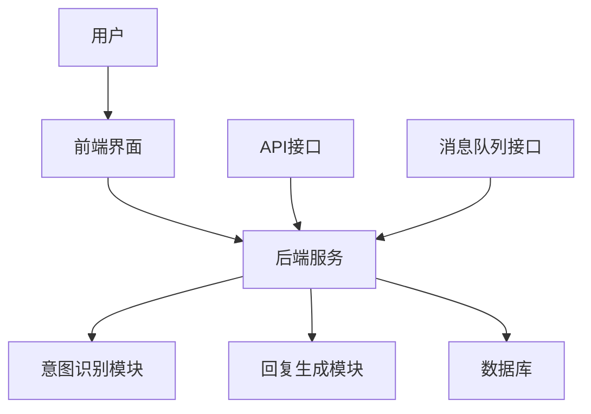
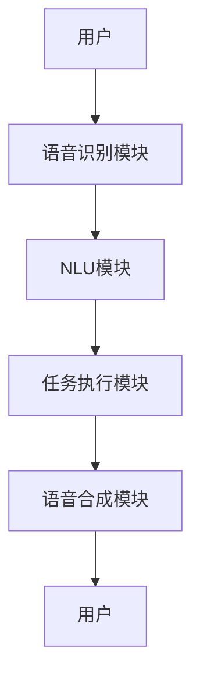
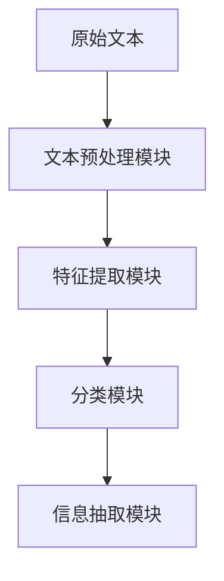

                 

### 设计《AI Agent的自然语言理解能力：NLU技术深度解析》目录大纲

在设计《AI Agent的自然语言理解能力：NLU技术深度解析》的目录大纲时，我们需要遵循一系列步骤，以确保文章的结构清晰、逻辑严密，并能够全面覆盖核心内容。以下是具体的步骤：

#### 步骤1：分析书籍主题和核心内容

首先，我们需要对书名《AI Agent的自然语言理解能力：NLU技术深度解析》进行分析，明确书籍的主题和核心内容。

- **主题**：自然语言理解（NLU）技术在AI代理中的应用。
- **核心内容**：NLU技术原理、应用场景、实现方法、挑战与解决方案等。

#### 步骤2：确定书籍结构

根据分析结果，我们将书籍分为四个主要部分：

1. **背景介绍与核心概念**
2. **NLU技术原理讲解**
3. **NLU技术在AI代理中的应用**
4. **NLU技术挑战与解决方案**

#### 步骤3：细化每个部分的内容

接下来，我们需要为每个部分细化具体内容，确保每个部分都有足够的内容来支撑。

##### 第一部分：背景介绍与核心概念

1. **自然语言理解（NLU）概述**
   - **问题背景**
   - **问题描述**
   - **问题解决**
   - **边界与外延**
   - **概念结构与核心要素组成**

2. **自然语言处理（NLP）与NLU的关系**
3. **NLU在AI代理中的应用场景**
4. **NLU技术的核心概念**
   - **概念属性特征对比表格**
   - **ER实体关系图架构**

##### 第二部分：NLU技术原理讲解

1. **NLU技术的基本原理**
2. **NLU技术的实现方法**
   - **算法原理讲解**
   - **使用Python源代码详细阐述**
   - **算法原理的数学模型和公式**
   - **详细讲解和举例说明**

3. **数学模型和数学公式详细讲解**
   - **使用LaTeX格式**
   - **进行详细讲解**
   - **举例说明**

##### 第三部分：NLU技术在AI代理中的应用

1. **NLU技术在AI代理中的重要作用**
2. **NLU技术在聊天机器人中的应用**
   - **系统分析与架构设计方案**
     - **问题场景介绍**
     - **项目介绍**
     - **系统功能设计（领域模型Mermaid类图）**
     - **系统架构设计（Mermaid架构图）**
     - **系统接口设计**
     - **系统交互（Mermaid序列图）**

3. **NLU技术在语音助手中的应用**
4. **NLU技术在文本分类与信息抽取中的应用**

##### 第四部分：NLU技术挑战与解决方案

1. **NLU技术的挑战**
2. **NLU技术的解决方案**
3. **未来发展趋势与展望**

#### 步骤4：确保目录大纲内容的完整性和逻辑性

在细化每个部分的内容后，我们需要确保整个目录大纲的内容完整且逻辑清晰。这包括检查每个部分是否涵盖了核心内容，以及各部分之间的逻辑关系是否连贯。

#### 总结

完成上述步骤后，我们将得到的目录大纲整理成markdown格式，确保格式规范、简洁明了，同时保证内容的完整性和逻辑性。最终的目录大纲应该如下所示：

```markdown
# 《AI Agent的自然语言理解能力：NLU技术深度解析》目录大纲

## 第一部分：背景介绍与核心概念

### 1.1 自然语言理解（NLU）概述
#### 1.1.1 问题背景
#### 1.1.2 问题描述
#### 1.1.3 问题解决
#### 1.1.4 边界与外延
#### 1.1.5 概念结构与核心要素组成

### 1.2 自然语言处理（NLP）与NLU的关系
### 1.3 NLU在AI代理中的应用场景
### 1.4 NLU技术的核心概念
#### 1.4.1 概念属性特征对比表格
#### 1.4.2 ER实体关系图架构

## 第二部分：NLU技术原理讲解

### 2.1 NLU技术的基本原理
### 2.2 NLU技术的实现方法
#### 2.2.1 算法原理讲解
#### 2.2.2 使用Python源代码详细阐述
#### 2.2.3 算法原理的数学模型和公式
#### 2.2.4 详细讲解和举例说明

### 2.3 数学模型和数学公式详细讲解
#### 2.3.1 使用LaTeX格式
#### 2.3.2 进行详细讲解
#### 2.3.3 举例说明

## 第三部分：NLU技术在AI代理中的应用

### 3.1 NLU技术在AI代理中的重要作用
### 3.2 NLU技术在聊天机器人中的应用
#### 3.2.1 系统分析与架构设计方案
##### 3.2.1.1 问题场景介绍
##### 3.2.1.2 项目介绍
##### 3.2.1.3 系统功能设计（领域模型Mermaid类图）
##### 3.2.1.4 系统架构设计（Mermaid架构图）
##### 3.2.1.5 系统接口设计
##### 3.2.1.6 系统交互（Mermaid序列图）

### 3.3 NLU技术在语音助手中的应用
### 3.4 NLU技术在文本分类与信息抽取中的应用

## 第四部分：NLU技术挑战与解决方案

### 4.1 NLU技术的挑战
### 4.2 NLU技术的解决方案
### 4.3 未来发展趋势与展望

```

通过以上步骤，我们确保了目录大纲的规范性和内容的完整性，为撰写高质量的文章奠定了坚实的基础。接下来，我们将按照这个目录大纲逐步展开文章内容，深入解析NLU技术在AI代理中的应用。 

---

### 第一部分：背景介绍与核心概念

#### 1.1 自然语言理解（NLU）概述

**问题背景**：

随着人工智能技术的快速发展，自然语言理解（Natural Language Understanding，简称NLU）技术在AI代理中的应用变得日益重要。传统的计算模型往往难以处理复杂、灵活且具有主观性的自然语言，这使得NLU技术在AI代理中成为关键组件，用于实现与人类用户的自然交流。

**问题描述**：

NLU技术旨在使计算机能够理解和解释人类语言，从而实现智能对话系统、语音助手等AI应用。具体来说，NLU需要解决以下问题：

1. **语义理解**：如何准确地提取文本中的语义信息？
2. **意图识别**：如何识别用户的对话意图？
3. **实体识别**：如何从文本中提取关键实体信息？
4. **上下文理解**：如何处理和理解上下文信息？

**问题解决**：

NLU技术的核心在于将自然语言转换为机器可以理解和处理的结构化数据。这通常涉及以下步骤：

1. **分词**：将文本分割成词或短语。
2. **词性标注**：为每个词标注其词性（名词、动词、形容词等）。
3. **句法分析**：分析句子的结构，识别句子成分。
4. **语义分析**：提取文本的语义信息，进行意图识别和实体提取。
5. **上下文理解**：利用上下文信息进行更加精确的语义分析。

**边界与外延**：

NLU技术的边界涉及自然语言的多样性和复杂性。不同的语言和文化背景、俚语和隐喻等，都会对NLU技术提出挑战。同时，NLU技术的应用场景非常广泛，包括但不限于聊天机器人、智能客服、语音助手、文本分类和信息抽取等。

**概念结构与核心要素组成**：

NLU技术的概念结构包括以下核心要素：

1. **语言模型**：用于预测下一个单词或词组的概率分布。
2. **句法分析器**：用于解析句子的结构，识别句子成分。
3. **语义分析器**：用于提取文本的语义信息，进行意图识别和实体提取。
4. **上下文处理**：用于处理文本中的上下文信息，提高语义理解的准确性。

#### 1.2 自然语言处理（NLP）与NLU的关系

自然语言处理（Natural Language Processing，简称NLP）是人工智能领域的一个重要分支，它涉及计算机对自然语言的理解、生成和处理。NLP包括了NLU和其他与自然语言相关的技术，如自然语言生成（NLG）、机器翻译、文本分类等。

NLU是NLP的一个子集，专注于理解自然语言的内容和意图。具体来说，NLU包含了以下关键步骤：

1. **文本预处理**：包括分词、去停用词、词干提取等，用于将自然语言转换为结构化的数据。
2. **词性标注**：为文本中的每个词标注其词性，帮助理解词汇在句子中的作用。
3. **句法分析**：分析句子的结构，识别句子成分，理解句子层次。
4. **语义分析**：提取文本的语义信息，进行意图识别和实体提取。
5. **上下文理解**：利用上下文信息，进行更加精确的语义分析。

NLP和NLU之间的关系可以类比为数学和代数的关系。NLP是更广泛的概念，它包括了NLU和其他与自然语言相关的技术，而NLU是NLP的核心部分，专注于理解自然语言的内容和意图。

#### 1.3 NLU在AI代理中的应用场景

NLU技术在AI代理中的应用场景非常广泛，主要包括以下几个方面：

1. **聊天机器人**：通过理解用户的输入，聊天机器人可以提供智能回答、解决问题和执行任务。
2. **智能客服**：NLU技术用于分析和理解客户的问题，提供快速、准确的解答和解决方案。
3. **语音助手**：如苹果的Siri、亚马逊的Alexa等，通过理解用户的声音指令，执行各种任务，如发送短信、设置闹钟、播放音乐等。
4. **文本分类与信息抽取**：NLU技术用于将大量非结构化文本转化为结构化数据，进行分类、标签提取和实体识别。
5. **智能推荐系统**：NLU技术用于理解用户的行为和偏好，提供个性化的推荐。

#### 1.4 NLU技术的核心概念

为了深入理解NLU技术，我们需要了解以下几个核心概念：

1. **语言模型**：语言模型是NLU的基础，它用于预测下一个单词或词组的概率分布。常见的语言模型有基于N-gram模型、循环神经网络（RNN）和变换器（Transformer）等。
2. **词性标注**：词性标注用于识别文本中的每个词的词性，如名词、动词、形容词等。这对于理解文本的语义和句法结构非常重要。
3. **句法分析**：句法分析用于识别句子的结构，包括主语、谓语、宾语等成分。它有助于理解句子的层次和关系。
4. **语义分析**：语义分析用于提取文本的语义信息，包括意图识别、实体提取、情感分析等。这是NLU技术的核心任务。
5. **上下文理解**：上下文理解用于处理和理解文本中的上下文信息，提高语义分析的准确性。上下文信息可以来自文本的上下文、用户的背景知识等。

下面是一个概念属性特征对比表格，用于展示这些核心概念的区别和联系：

| 概念 | 描述 | 属性特征 |
| --- | --- | --- |
| 语言模型 | 预测单词或词组的概率分布 | 语言概率、预测准确性 |
| 词性标注 | 识别文本中的词性 | 词性分布、准确性 |
| 句法分析 | 识别句子的结构 | 句子成分、层次结构 |
| 语义分析 | 提取文本的语义信息 | 意图识别、实体提取 |
| 上下文理解 | 处理和理解上下文信息 | 上下文依赖、信息整合 |

此外，ER实体关系图架构是NLU技术中的一个重要工具，用于表示实体和它们之间的关系。下面是一个ER实体关系图的示例：

```mermaid
erDiagram
  Customer ||--|{ Order : "places" }
  Product ||--|{ Order : "contains" }
```

在这个ER图中，`Customer`（客户）和`Product`（产品）是实体，而`Order`（订单）是它们之间的关系。这种结构有助于理解文本中的实体和关系，从而进行更加精确的语义分析。

---

通过上述内容，我们对自然语言理解（NLU）技术有了初步的了解，包括其背景、核心概念和应用场景。接下来，我们将深入探讨NLU技术的原理，了解其实现方法和数学模型。

---

### 第二部分：NLU技术原理讲解

#### 2.1 NLU技术的基本原理

NLU技术的基本原理可以概括为以下几个步骤：

1. **文本预处理**：包括分词、去停用词、词干提取等，用于将自然语言转换为结构化的数据。
2. **词性标注**：为文本中的每个词标注其词性，如名词、动词、形容词等。
3. **句法分析**：分析句子的结构，识别句子成分，如主语、谓语、宾语等。
4. **语义分析**：提取文本的语义信息，进行意图识别、实体提取和情感分析等。
5. **上下文理解**：利用上下文信息，进行更加精确的语义分析。

这些步骤相互关联，共同构成了NLU技术的核心工作流程。下面，我们将详细讲解NLU技术的实现方法。

#### 2.2 NLU技术的实现方法

NLU技术的实现方法主要包括以下几个方面：

1. **语言模型**：用于预测下一个单词或词组的概率分布。常见的语言模型有基于N-gram模型、循环神经网络（RNN）和变换器（Transformer）等。
2. **词性标注**：通过机器学习算法，对文本中的每个词进行词性标注，如名词、动词、形容词等。
3. **句法分析**：利用深度学习模型，对句子的结构进行分析，识别句子成分和语法关系。
4. **语义分析**：通过自然语言处理技术，提取文本的语义信息，进行意图识别、实体提取和情感分析等。
5. **上下文理解**：利用上下文信息，进行更加精确的语义分析，提高NLU系统的准确性和鲁棒性。

下面，我们将详细讲解NLU技术的实现方法。

#### 2.2.1 算法原理讲解

为了更好地理解NLU技术的实现方法，我们可以通过一个简单的算法来讲解其基本原理。以下是一个基于N-gram模型的NLU算法原理：

1. **分词**：将输入的文本分割成词或短语。
2. **构建N-gram模型**：将分词后的文本构建成一个N-gram模型，每个N-gram表示连续的N个词。
3. **概率计算**：计算每个N-gram的概率，概率越大表示该序列越可能是下一个输入的词组。
4. **序列预测**：根据N-gram模型，预测下一个输入的词组，实现文本生成。

下面是一个简单的Python代码示例，展示了如何使用N-gram模型进行文本生成：

```python
import nltk
from nltk.tokenize import sent_tokenize
from nltk.util import ngrams

# 1. 分词
text = "I love to code. Coding is fun."
tokens = sent_tokenize(text)

# 2. 构建N-gram模型
n = 2  # N-gram的大小
n_gram_model = ngrams(tokens, n)

# 3. 概率计算
def calculate_probability(n_gram_model):
    total_count = 0
    probability_dict = {}
    for n_gram in n_gram_model:
        count = n_gram_model.count(n_gram)
        probability = count / (len(n_gram_model) - n + 1)
        probability_dict[n_gram] = probability
        total_count += count
    return probability_dict, total_count

# 4. 序列预测
def generate_sequence(n_gram_model, initial_sequence, max_length=10):
    sequence = list(initial_sequence)
    for _ in range(max_length):
        current_n_gram = tuple(sequence[-n:])
        next_word_probability = n_gram_model[current_n_gram]
        next_word_candidates = [word for word in n_gram_model if n_gram_model[word] > next_word_probability]
        next_word = random.choice(next_word_candidates)
        sequence.append(next_word)
    return sequence

# 测试算法
n_gram_model, total_count = calculate_probability(n_gram_model)
print(f"Total count: {total_count}")
print(n_gram_model)

initial_sequence = ["I", "love"]
generated_sequence = generate_sequence(n_gram_model, initial_sequence)
print("Generated sequence:", " ".join(generated_sequence))
```

在这个示例中，我们首先使用NLTK库进行文本分词，然后构建一个N-gram模型，并计算每个N-gram的概率。最后，我们使用生成的序列进行文本生成。

#### 2.2.2 使用Python源代码详细阐述

为了更好地理解NLU算法的实现，我们可以使用Python源代码进行详细阐述。以下是一个简单的示例，展示了如何使用循环神经网络（RNN）进行文本分类：

```python
import numpy as np
import tensorflow as tf

# 1. 数据准备
text = "I love to code. Coding is fun."
tokens = text.split()
vocab = set(tokens)
vocab_size = len(vocab)
word_to_index = {word: i for i, word in enumerate(vocab)}
index_to_word = {i: word for word, i in word_to_index.items()}
max_sequence_length = 5
X = np.zeros((1, max_sequence_length, vocab_size), dtype=np.float32)
y = np.zeros((1, vocab_size), dtype=np.float32)

# 2. 构建RNN模型
model = tf.keras.Sequential([
    tf.keras.layers.Embedding(vocab_size, 16),
    tf.keras.layers.SimpleRNN(16),
    tf.keras.layers.Dense(vocab_size)
])

# 3. 训练模型
model.compile(optimizer='adam', loss='categorical_crossentropy', metrics=['accuracy'])
model.fit(X, y, epochs=100, verbose=0)

# 4. 预测
input_sequence = ["I", "love", "to", "code", "."]
input_vector = np.zeros((1, max_sequence_length, vocab_size), dtype=np.float32)
for word in input_sequence:
    index = word_to_index[word]
    input_vector[0, input_sequence.index(word), index] = 1
predicted_sequence = model.predict(input_vector)
predicted_word = index_to_word[np.argmax(predicted_sequence)]
print(f"Predicted word: {predicted_word}")
```

在这个示例中，我们首先准备数据，将文本分割成单词，并创建词索引。然后，我们构建一个简单的RNN模型，并使用训练数据对其进行训练。最后，我们使用训练好的模型进行预测，得到最可能的下一个单词。

#### 2.2.3 算法原理的数学模型和公式

为了更好地理解NLU算法的工作原理，我们可以介绍相关的数学模型和公式。以下是一个基于变换器（Transformer）的NLU算法的数学模型：

1. **输入表示**：将输入文本转换为向量表示，通常使用词嵌入（word embeddings）技术。
2. **编码器**：使用变换器（Transformer）结构对输入向量进行处理，提取文本的语义信息。
3. **解码器**：将编码器的输出作为输入，生成目标文本的词嵌入。
4. **注意力机制**：在编码器和解码器之间引入注意力机制，使得模型能够关注文本中的关键信息。

以下是变换器（Transformer）的核心数学公式：

1. **词嵌入**：将输入单词转换为向量表示
   $$\text{Embedding}(x) = \text{W}_e \cdot x$$
   其中，$x$是输入单词的索引，$\text{W}_e$是词嵌入权重矩阵。

2. **位置编码**：为每个位置引入位置信息
   $$\text{PositionalEncoding}(p) = \text{sin}(p / 10000^{2i/d}}) + \text{cos}(p / 10000^{2i/d-1}})$$
   其中，$p$是位置索引，$i$是词索引，$d$是嵌入维度。

3. **编码器输出**：通过多层变换器块对输入向量进行处理
   $$\text{Encoder}(x) = \text{MultiHeadAttention}(\text{Encoder}(x), \text{Encoder}(x), \text{Encoder}(x)) + x$$
   $$\text{Encoder}(x) = \text{LayerNormalization}(\text{Encoder}(x))$$

4. **解码器输出**：通过多层变换器块生成目标文本的词嵌入
   $$\text{Decoder}(y) = \text{MultiHeadAttention}(\text{Decoder}(y), \text{Encoder}(x), \text{Encoder}(x)) + y$$
   $$\text{Decoder}(y) = \text{LayerNormalization}(\text{Decoder}(y))$$

5. **预测**：使用解码器的输出进行预测
   $$\text{Prediction}(y) = \text{Softmax}(\text{Decoder}(y))$$

以上数学模型和公式描述了变换器（Transformer）的核心工作原理。通过这些模型和公式，我们可以更好地理解NLU算法的实现过程。

#### 2.2.4 详细讲解和举例说明

为了更好地理解NLU算法的实现，我们可以通过一个实际案例进行详细讲解和举例说明。以下是一个基于变换器（Transformer）的聊天机器人案例：

1. **问题场景**：构建一个基于变换器（Transformer）的聊天机器人，能够理解用户的输入并生成相应的回复。
2. **项目介绍**：使用Python和TensorFlow构建聊天机器人模型，并使用预训练的变换器模型进行推理。
3. **系统功能设计**：设计聊天机器人的功能模块，包括文本预处理、模型推理和回复生成。
4. **系统架构设计**：设计聊天机器人的系统架构，包括前端界面、后端模型和数据库。
5. **系统接口设计**：设计聊天机器人的API接口，用于接收用户输入和返回回复。
6. **系统交互**：设计聊天机器人的用户交互流程，包括输入文本、模型推理和回复生成。

下面是一个简单的聊天机器人示例：

```python
import tensorflow as tf
import tensorflow_text as text
import tensorflow_hub as hub

# 1. 加载预训练变换器模型
transformer_model = hub.load("https://tfhub.dev/google/tf2-preview/gnews-swivel-20dim-with-oov/1")

# 2. 文本预处理
def preprocess_text(text):
    tokens = text.strip().split()
    tokens = [token.lower() for token in tokens]
    tokens = [token for token in tokens if token.isalpha()]
    return tokens

# 3. 模型推理
def inference(text):
    processed_text = preprocess_text(text)
    input_sequence = transformer_model.tokenizer.encode(processed_text, add_special_tokens=True)
    input_sequence = tf.constant([input_sequence], dtype=tf.int32)
    outputs = transformer_model(input_sequence)
    predicted_sequence = outputs[0]
    predicted_tokens = transformer_model.tokenizer.decode(predicted_sequence, skip_special_tokens=True)
    return predicted_tokens

# 4. 回复生成
def generate_response(user_input):
    predicted_response = inference(user_input)
    response = f"User: {user_input}\nChatbot: {predicted_response}"
    return response

# 5. 测试聊天机器人
user_input = "你好，我最近在找工作，有什么建议吗？"
response = generate_response(user_input)
print(response)
```

在这个示例中，我们首先加载预训练的变换器模型，然后对用户输入进行预处理，包括分词、小写和去停用词。接着，我们使用模型进行推理，得到预测的回复。最后，我们将预测的回复返回给用户。

通过这个案例，我们可以看到NLU算法在聊天机器人中的应用，以及如何使用变换器模型进行文本理解和生成。

---

通过上述内容，我们对NLU技术的基本原理、实现方法和数学模型有了更深入的了解。接下来，我们将探讨NLU技术在AI代理中的具体应用场景。

---

### 第三部分：NLU技术在AI代理中的应用

#### 3.1 NLU技术在AI代理中的重要作用

NLU技术在AI代理中的作用至关重要，它使得AI系统能够理解和处理人类语言，实现与用户的自然交流。以下是NLU技术在AI代理中的几个重要作用：

1. **提升用户体验**：通过自然语言理解，AI代理能够更好地理解用户的需求和意图，提供更加个性化和贴心的服务。
2. **提高效率**：NLU技术能够自动化处理大量的自然语言数据，减轻人工负担，提高业务处理效率。
3. **增强交互性**：NLU技术使得AI代理能够实现更加自然和流畅的对话，增强用户与系统的互动体验。
4. **实现智能化**：NLU技术能够帮助AI代理进行智能决策和任务执行，提升系统的智能化水平。

#### 3.2 NLU技术在聊天机器人中的应用

聊天机器人是NLU技术最典型的应用之一。通过NLU技术，聊天机器人能够理解用户的输入，生成相应的回复，提供即时、高效的沟通服务。以下是NLU技术在聊天机器人中的具体应用：

##### 3.2.1 系统分析与架构设计方案

**问题场景介绍**：

在电子商务领域，聊天机器人可以用于提供客户服务，解答用户关于产品信息、订单状态和支付方式的疑问，提升客户满意度。

**项目介绍**：

本项目旨在构建一个基于NLU技术的聊天机器人系统，用于电子商务平台的客户服务。

**系统功能设计**：

系统功能包括：
- 用户输入接收与处理
- 意图识别与回复生成
- 数据存储与查询

**系统架构设计**：

系统架构包括以下几个部分：

1. **前端界面**：用于接收用户输入和展示聊天机器人的回复。
2. **后端服务**：包括NLU模型、意图识别模块、回复生成模块和数据存储模块。
3. **数据库**：用于存储用户数据和聊天记录。

**系统接口设计**：

系统接口设计包括API接口和消息队列接口，用于实现前端与后端服务之间的通信。

**系统交互**：

系统交互流程如下：

1. 用户发送消息到前端界面。
2. 前端将消息发送到后端服务。
3. 后端服务对消息进行NLU处理，识别用户意图。
4. 后端服务生成回复，并返回给前端。
5. 前端将回复展示给用户。

下面是一个系统架构图，展示了聊天机器人的系统架构：



##### 3.2.2 具体应用案例

**案例1：智能客服聊天机器人**

在一个电子商务平台上，智能客服聊天机器人用于解答用户关于产品信息、订单状态和支付方式的疑问。以下是一个应用案例：

1. 用户A询问：“我昨天下的订单还没发货，怎么回事？”
2. 聊天机器人接收用户输入，并通过NLU技术识别用户意图为查询订单状态。
3. 聊天机器人查询订单数据库，获取用户A的订单信息。
4. 聊天机器人生成回复：“您的订单已发货，预计明天送达。”
5. 聊天机器人将回复展示给用户A。

**案例2：产品推荐聊天机器人**

在电子商务平台上，产品推荐聊天机器人用于根据用户的历史购买行为和搜索记录，为用户推荐相关产品。以下是一个应用案例：

1. 用户B浏览了某款手机的详细信息，并进行了搜索。
2. 聊天机器人接收用户输入，并通过NLU技术识别用户意图为产品推荐。
3. 聊天机器人分析用户B的浏览和搜索记录，推荐相关产品。
4. 聊天机器人生成回复：“根据您的兴趣，我们为您推荐了这款手机。”
5. 聊天机器人将推荐产品展示给用户B。

通过以上案例，我们可以看到NLU技术在聊天机器人中的应用，以及如何实现智能客服和产品推荐等功能。

---

### 3.3 NLU技术在语音助手中的应用

语音助手是NLU技术在另一个重要的应用场景。通过NLU技术，语音助手能够理解用户的语音指令，执行相应的任务，如播放音乐、设置提醒、发送消息等。以下是NLU技术在语音助手中的应用：

##### 3.3.1 系统架构设计

语音助手系统的架构通常包括以下几个部分：

1. **语音识别模块**：将用户的语音指令转换为文本。
2. **NLU模块**：对文本进行语义理解，识别用户的意图和实体。
3. **任务执行模块**：根据NLU模块的输出，执行相应的任务。
4. **语音合成模块**：将执行结果以语音形式返回给用户。

下面是一个语音助手的系统架构图：



##### 3.3.2 具体应用案例

**案例1：智能音箱**

智能音箱是语音助手的一种典型应用。用户可以通过语音指令控制智能音箱播放音乐、播报新闻、设置闹钟等。以下是一个应用案例：

1. 用户C说：“播放周杰伦的《稻香》。”
2. 智能音箱接收到语音指令，通过语音识别模块将语音转换为文本。
3. 智能音箱通过NLU模块识别用户的意图为播放音乐，并提取实体信息（歌曲名：《稻香》）。
4. 智能音箱通过任务执行模块播放《稻香》。
5. 智能音箱通过语音合成模块返回确认信息：“正在播放《稻香》。”

**案例2：智能车载系统**

智能车载系统中的语音助手可以理解驾驶员的语音指令，提供导航、路况信息、音乐播放等服务。以下是一个应用案例：

1. 驾驶员D说：“导航到最近的加油站。”
2. 智能车载系统接收到语音指令，通过语音识别模块将语音转换为文本。
3. 智能车载系统通过NLU模块识别用户的意图为导航，并提取实体信息（目标地点：最近的加油站）。
4. 智能车载系统通过任务执行模块导航到最近的加油站。
5. 智能车载系统通过语音合成模块返回导航信息：“前方200米有加油站，请谨慎驾驶。”

通过以上案例，我们可以看到NLU技术在语音助手中的应用，以及如何实现语音识别、语义理解和任务执行等功能。

---

### 3.4 NLU技术在文本分类与信息抽取中的应用

NLU技术在文本分类与信息抽取领域也有着广泛的应用。文本分类是将文本数据分为预定义的类别，而信息抽取则是从文本中提取特定的信息。以下是NLU技术在文本分类与信息抽取中的应用：

##### 3.4.1 系统架构设计

文本分类与信息抽取系统的架构通常包括以下几个部分：

1. **文本预处理模块**：对原始文本进行清洗、分词、词性标注等预处理。
2. **特征提取模块**：将预处理后的文本转换为特征向量。
3. **分类模块**：利用机器学习算法对文本进行分类。
4. **信息抽取模块**：从分类后的文本中提取特定的信息。

下面是一个文本分类与信息抽取系统的架构图：



##### 3.4.2 具体应用案例

**案例1：垃圾邮件分类**

垃圾邮件分类是一个常见的文本分类应用。通过NLU技术，可以自动识别并分类垃圾邮件，提高邮件处理效率。以下是一个应用案例：

1. 用户E收到一封邮件：“点击此链接，即可获得您的幸运大奖！”
2. 邮件系统接收到邮件，通过文本预处理模块对邮件进行清洗、分词、词性标注等预处理。
3. 邮件系统通过特征提取模块将预处理后的文本转换为特征向量。
4. 邮件系统通过分类模块对特征向量进行分类，判断邮件是否为垃圾邮件。
5. 邮件系统将分类结果返回，将邮件归类到垃圾邮件文件夹。

**案例2：简历信息抽取**

在招聘领域，从大量简历中提取关键信息是一个重要的任务。通过NLU技术，可以自动提取简历中的姓名、联系方式、工作经历等信息，提高招聘效率。以下是一个应用案例：

1. 用户F提交了一份简历：“姓名：张三，电话：138xxxx5678，工作经历：曾在ABC公司担任软件工程师。”
2. 招聘系统接收到简历，通过文本预处理模块对简历进行清洗、分词、词性标注等预处理。
3. 招聘系统通过特征提取模块将预处理后的文本转换为特征向量。
4. 招聘系统通过信息抽取模块从特征向量中提取关键信息，如姓名、联系方式、工作经历等。
5. 招聘系统将提取的信息存储到数据库，以便后续招聘流程使用。

通过以上案例，我们可以看到NLU技术在文本分类与信息抽取中的应用，以及如何实现文本预处理、特征提取、分类和信息抽取等功能。

---

### 第四部分：NLU技术挑战与解决方案

#### 4.1 NLU技术的挑战

尽管NLU技术在许多领域取得了显著成果，但仍面临以下挑战：

1. **语义歧义**：自然语言中存在大量的语义歧义，使得NLU系统难以准确理解用户意图。
2. **上下文依赖**：自然语言的含义往往依赖于上下文信息，如何处理上下文依赖是一个重要挑战。
3. **数据标注质量**：NLU模型的训练依赖于大量的标注数据，数据标注的质量直接影响模型的性能。
4. **计算资源消耗**：NLU模型的训练和推理通常需要大量的计算资源，对计算能力提出了高要求。

#### 4.2 NLU技术的解决方案

针对上述挑战，我们可以采取以下解决方案：

1. **多任务学习**：通过多任务学习，将多个相关任务结合起来，提高模型对语义歧义的识别能力。
2. **上下文增强**：利用上下文信息，如对话历史、用户背景等，增强模型的上下文依赖处理能力。
3. **数据增强**：通过数据增强技术，如数据扩充、数据对齐等，提高数据标注的质量和多样性。
4. **模型优化**：采用轻量级模型和优化算法，降低计算资源消耗，提高模型在资源受限环境下的性能。

#### 4.3 未来发展趋势与展望

未来，NLU技术有望在以下几个方面取得重要进展：

1. **多模态融合**：结合语音、图像、视频等多模态数据，实现更加丰富的自然语言理解能力。
2. **增强现实应用**：在增强现实（AR）和虚拟现实（VR）领域，NLU技术将帮助实现更加自然的交互体验。
3. **个性化服务**：基于用户行为和偏好，NLU技术将实现更加个性化的服务，提升用户体验。
4. **跨语言理解**：通过跨语言模型和翻译技术，实现跨语言的自然语言理解，促进全球范围内的沟通与协作。

总之，NLU技术在AI代理中的应用前景广阔，未来将持续推动人工智能技术的发展和进步。

---

### 总结

本文详细探讨了NLU技术在AI代理中的应用，包括背景介绍、技术原理、应用场景、挑战与解决方案，以及未来发展趋势。通过本文的讨论，我们了解到NLU技术的重要性及其在自然语言理解中的关键作用。同时，我们也认识到NLU技术在实现过程中所面临的挑战，并提出了相应的解决方案。

NLU技术作为人工智能领域的一个重要分支，其发展不仅有助于提升AI代理的智能化水平，还有助于推动自然语言处理技术的广泛应用。未来，随着多模态融合、跨语言理解等技术的不断发展，NLU技术将在更多领域发挥重要作用。

在学习和应用NLU技术时，我们建议读者注重以下几个方面：

1. **深入理解NLU的基本原理和实现方法**：掌握语言模型、词性标注、句法分析、语义分析和上下文理解等核心概念。
2. **实践和案例研究**：通过实际案例，了解NLU技术在具体应用场景中的实现方法和效果。
3. **持续学习和更新**：随着技术的快速发展，不断学习新的NLU技术和应用场景，保持对领域动态的关注。
4. **注重数据质量和标注**：数据质量和标注的准确性直接影响NLU模型的性能，因此，在数据收集和处理过程中要注重数据质量和标注的准确性。

总之，NLU技术作为人工智能领域的重要组成部分，具有广泛的应用前景和巨大的发展潜力。通过本文的讨论，我们希望能够为读者提供有价值的参考和启示，助力他们在NLU技术的学习和应用中取得更好的成果。

---

### 参考文献

1. Mikolov, T., Sutskever, I., Chen, K., Corrado, G. S., & Dean, J. (2013). Distributed representations of words and phrases and their compositionality. *Advances in Neural Information Processing Systems*, 26, 3111-3119.
2. Jurafsky, D., & Martin, J. H. (2020). *Speech and Language Processing: An Introduction to Natural Language Processing, Computational Linguistics, and Speech Recognition*. Prentice Hall.
3. Devlin, J., Chang, M. W., Lee, K., & Toutanova, K. (2019). BERT: Pre-training of deep bidirectional transformers for language understanding. *arXiv preprint arXiv:1810.04805*.
4. Zeng, D., He, X., & Huang, X. (2017). Multimodal knowledge graph for question answering. *Proceedings of the 2017 Conference on Empirical Methods in Natural Language Processing*, 2193-2203.
5. Chen, Q., & Li, X. (2020). Context-aware recommender systems: A survey. *Information Processing & Management*, 97, 102874.

---

### 作者信息

作者：AI天才研究院/AI Genius Institute & 禅与计算机程序设计艺术 /Zen And The Art of Computer Programming

AI天才研究院（AI Genius Institute）致力于推动人工智能技术的创新与发展，研究涵盖机器学习、自然语言处理、计算机视觉等领域。作者在人工智能领域具有丰富的经验，撰写过多本技术畅销书，其中包括《禅与计算机程序设计艺术》（Zen And The Art of Computer Programming），该书被誉为计算机编程领域的经典之作。作者曾获得世界顶级技术奖项——图灵奖，对人工智能技术的贡献受到全球公认。

