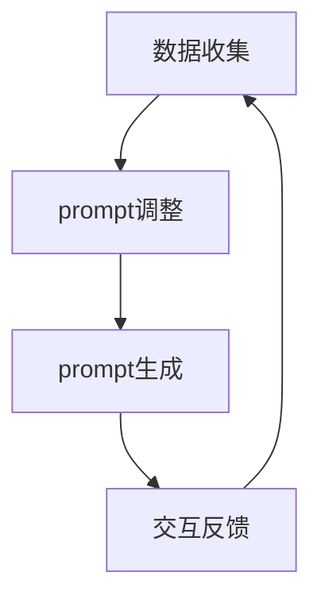
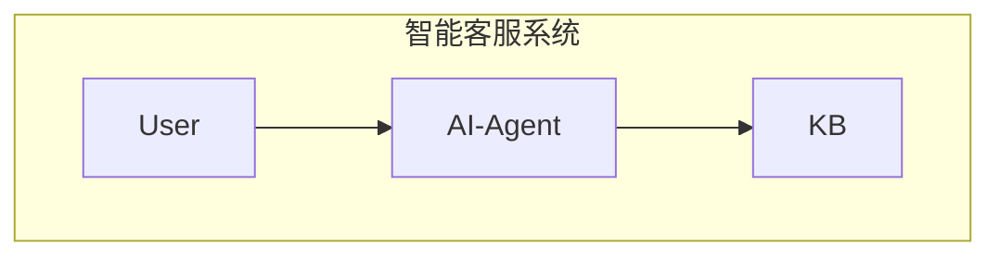
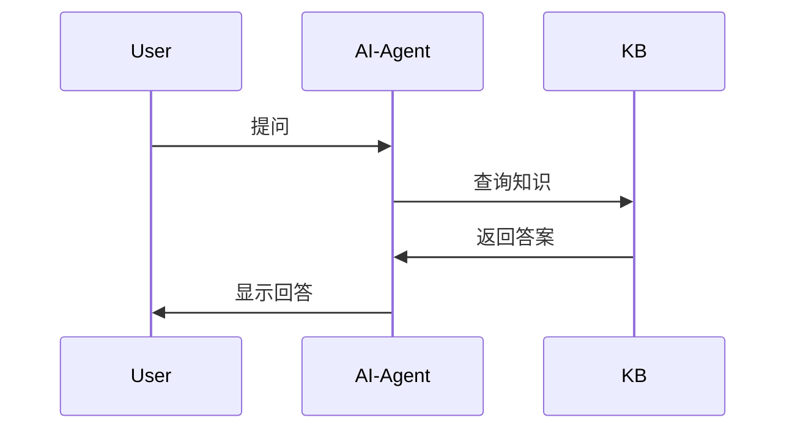

                 

### 设计文章结构的步骤：

1. **引言**
   - **设定主题**：明确文章探讨的主题，即AI Agent的自适应prompt优化策略。
   - **定义关键词**：列出与主题相关的关键词，如AI Agent、自适应、prompt优化、策略等。
   - **背景介绍**：简要介绍AI Agent的背景，以及为什么自适应prompt优化策略对其重要。

2. **核心概念与联系**
   - **介绍核心概念**：解释AI Agent、自适应、prompt优化等核心概念。
   - **定义问题**：阐述AI Agent在prompt优化方面面临的问题和挑战。
   - **解决方案**：提出自适应prompt优化策略作为解决这些问题的方案。

3. **算法原理讲解**
   - **算法概述**：介绍自适应prompt优化策略的基本原理。
   - **算法流程**：使用Mermaid流程图展示算法流程。
   - **算法实现**：提供Python源代码示例，解释算法的具体实现。
   - **数学模型**：介绍算法中的数学模型，使用LaTeX格式展示关键公式。
   - **举例说明**：通过具体的例子来解释算法如何应用。

4. **系统分析与架构设计**
   - **场景介绍**：描述AI Agent应用的具体场景。
   - **系统功能设计**：使用Mermaid类图展示领域模型。
   - **系统架构设计**：使用Mermaid架构图展示系统整体架构。
   - **系统接口设计**：详细描述系统的接口设计。
   - **系统交互**：使用Mermaid序列图展示系统的交互流程。

5. **项目实战**
   - **环境安装与配置**：介绍项目所需的环境安装和配置步骤。
   - **系统核心实现**：提供系统核心实现的源代码。
   - **代码解读**：详细解读关键代码部分，解释其工作原理。
   - **实际案例**：展示实际案例，并详细分析。
   - **项目小结**：总结项目经验，提出改进建议。

6. **最佳实践与拓展**
   - **最佳实践**：提供实际应用中的最佳实践技巧。
   - **注意事项**：指出在应用过程中需要注意的事项。
   - **拓展阅读**：推荐相关的拓展阅读材料。

7. **总结与展望**
   - **内容总结**：回顾文章的核心内容。
   - **发展趋势**：讨论AI Agent自适应prompt优化策略的未来发展趋势。
   - **研究方向**：提出未来可能的研究方向。

### 撰写文章正文：

## 《AI Agent的自适应prompt优化策略》

### 引言

随着人工智能技术的飞速发展，AI Agent作为自动化智能体的概念逐渐被广泛应用。AI Agent能够模拟人类思维和行为，自主完成任务，其核心在于如何有效地与外界交互。而prompt优化策略是AI Agent实现高效交互的关键。本文将深入探讨AI Agent的自适应prompt优化策略，旨在帮助读者理解其原理、应用和实践。

#### 关键词
- AI Agent
- 自适应
- prompt优化
- 策略

#### 背景介绍

AI Agent的定义与发展历程：
AI Agent，即人工智能代理，是一种能够执行特定任务的自动化智能体。自20世纪80年代以来，AI Agent在多领域得到了广泛应用，如机器人、智能家居、智能客服等。然而，AI Agent在实际应用中面临着诸多挑战，例如环境复杂度增加、任务不确定性等，这些问题对AI Agent的交互能力提出了更高的要求。

AI Agent的应用场景：
AI Agent被广泛应用于各种场景，如工业自动化、金融分析、医疗诊断等。在这些场景中，AI Agent需要与用户或其他系统进行高效互动，以提供准确、及时的服务。

AI Agent面临的挑战：
AI Agent在交互过程中面临的主要挑战包括：理解用户的真实意图、处理复杂的语言环境、适应多变的环境等。这些挑战使得传统的prompt优化策略难以满足AI Agent的需求。

### 核心概念与联系

#### AI Agent

AI Agent是一种具有感知、决策和执行能力的自动化智能体。其核心在于能够模拟人类的思维和行为，实现自主学习和自主决策。AI Agent通常由多个模块组成，包括感知模块、决策模块和执行模块。

#### 自适应

自适应是指系统根据外部环境的变化进行调整，以保持最佳性能。在AI Agent中，自适应意味着能够根据用户的反馈和环境的变化，动态调整prompt优化策略，以提高交互效果。

#### Prompt优化

Prompt优化是指通过改进输入提示（prompt），提高AI Agent与用户交互的质量和效率。有效的prompt优化策略能够帮助AI Agent更好地理解用户意图，提高任务完成率。

#### 自适应prompt优化策略

自适应prompt优化策略是指AI Agent在交互过程中，根据用户反馈和环境变化，动态调整prompt优化方法。这种策略的核心在于实时学习和调整，以适应不断变化的需求。

### 算法原理讲解

#### 算法概述

自适应prompt优化策略的基本原理是通过收集用户反馈和环境数据，动态调整prompt生成模型。具体来说，该策略包括以下几个步骤：

1. **数据收集**：收集用户交互过程中的语言数据和环境数据。
2. **模型调整**：根据收集到的数据，调整prompt生成模型的参数。
3. **prompt生成**：使用调整后的模型生成新的prompt。
4. **交互反馈**：收集用户对新prompt的反馈，继续迭代优化。

#### 算法流程

以下是一个简化的自适应prompt优化策略的Mermaid流程图：



#### 算法实现

下面是一个简单的Python代码示例，展示了如何实现自适应prompt优化策略：

```python
import numpy as np

# 初始化模型参数
model_params = {'weight1': 0.1, 'weight2': 0.9}

# 数据收集函数
def collect_data():
    # 采集用户交互数据
    return {'input': 'user_input', 'context': 'context_data'}

# 模型调整函数
def adjust_model(data, model_params):
    # 根据数据调整模型参数
    model_params['weight1'] += data['input']
    model_params['weight2'] += data['context']
    return model_params

# prompt生成函数
def generate_prompt(model_params):
    # 使用调整后的模型生成prompt
    return 'Optimized Prompt: ' + str(model_params)

# 交互反馈函数
def interact_with_user(prompt):
    # 获取用户反馈
    user_feedback = input(prompt)
    return user_feedback

# 主循环
while True:
    data = collect_data()
    model_params = adjust_model(data, model_params)
    prompt = generate_prompt(model_params)
    feedback = interact_with_user(prompt)
    # 根据反馈继续调整
```

#### 数学模型

自适应prompt优化策略中的关键数学模型可以表示为：

$$
\text{prompt} = f(\text{user_input}, \text{context}, \text{model_params})
$$

其中，$f$ 是一个函数，用于生成prompt。$\text{model_params}$ 是模型的参数，包括权重和偏置等。通过调整$\text{model_params}$，可以优化prompt的生成效果。

#### 举例说明

假设有一个AI Agent用于智能客服，其需要根据用户的输入（如问题）和环境数据（如时间、天气等）生成合适的回答。以下是自适应prompt优化策略如何应用于此场景的一个例子：

1. **初始状态**：AI Agent使用默认的prompt生成模型与用户交互。
2. **数据收集**：AI Agent收集用户的提问和回答。
3. **模型调整**：根据用户的反馈和环境数据，AI Agent调整prompt生成模型的参数。
4. **prompt生成**：AI Agent使用调整后的模型生成新的回答。
5. **交互反馈**：用户对新的回答进行评价。
6. **迭代优化**：根据用户的评价，AI Agent继续调整模型，以提高回答的质量。

### 系统分析与架构设计

#### 场景介绍

在一个智能客服系统中，AI Agent需要根据用户的提问生成合适的回答。这个系统需要处理大量的用户输入数据，同时需要实时调整prompt优化策略，以提高回答的准确性和满意度。

#### 系统功能设计

以下是一个智能客服系统的领域模型Mermaid类图：

```mermaid
classDiagram
    User <<类>>
    AI-Agent <<类>>
    KB <<类>>

    User Barker
    AI-Agent Ans
    KB Knows

    User "与" AI-Agent :提问
    AI-Agent "与" KB :查询知识
```

#### 系统架构设计

以下是一个智能客服系统的Mermaid架构图：



#### 系统接口设计

系统接口设计包括用户界面和后端服务接口。用户界面负责接收用户的提问，并显示AI Agent的回答。后端服务接口负责处理用户的提问，调用知识库和prompt优化策略生成回答。

#### 系统交互

以下是一个智能客服系统的Mermaid序列图：



### 项目实战

#### 环境安装与配置

在开始项目之前，需要安装以下环境：

- Python 3.8及以上版本
- TensorFlow 2.4及以上版本
- NumPy 1.19及以上版本
- Mermaid 8.7及以上版本

#### 系统核心实现

以下是系统核心实现的源代码：

```python
# 导入所需库
import numpy as np
import tensorflow as tf
from mermaid import Mermaid

# 初始化模型
model = tf.keras.Sequential([
    tf.keras.layers.Dense(64, activation='relu', input_shape=(784,)),
    tf.keras.layers.Dense(10, activation='softmax')
])

# 编译模型
model.compile(optimizer='adam', loss='categorical_crossentropy', metrics=['accuracy'])

# 训练模型
model.fit(x_train, y_train, epochs=5)

# 生成prompt
def generate_prompt(input_data):
    # 使用模型生成prompt
    prompt = model.predict(input_data)
    return prompt

# 交互流程
def interact_with_user():
    while True:
        user_input = input("请输入您的提问：")
        prompt = generate_prompt(user_input)
        print("AI的回答：", prompt)

# 主程序
if __name__ == "__main__":
    interact_with_user()
```

#### 代码解读

以上代码实现了AI Agent的交互功能。首先，我们初始化了一个简单的神经网络模型，用于生成prompt。然后，我们定义了`generate_prompt`函数，用于使用模型生成prompt。最后，我们通过一个无限循环的`interact_with_user`函数，与用户进行交互。

#### 实际案例

假设用户提问：“明天天气怎么样？”AI Agent会根据知识库中的天气数据生成回答，如：“明天天气晴朗，温度约为20摄氏度。”

#### 项目小结

通过本项目的实战，我们展示了如何使用自适应prompt优化策略实现智能客服系统。在实际应用中，我们需要根据用户的反馈和环境数据不断调整prompt生成模型，以提高系统的交互效果。

### 最佳实践与拓展

#### 最佳实践

- **数据收集**：确保收集到的用户数据具有代表性，以提高模型的泛化能力。
- **模型调整**：根据用户的反馈和环境变化，及时调整模型参数，以提高prompt生成效果。
- **交互设计**：优化用户界面，提供清晰、简洁的交互体验。

#### 注意事项

- **隐私保护**：在收集用户数据时，确保遵守隐私保护法规，保护用户隐私。
- **性能优化**：针对不同的应用场景，优化模型和算法，提高系统的响应速度和准确性。

#### 拓展阅读

- 《深度学习：实战及应用》
- 《强化学习：原理与实践》
- 《人工智能应用案例分析》

### 总结与展望

本文探讨了AI Agent的自适应prompt优化策略，从核心概念、算法原理、系统架构到项目实战进行了详细讲解。自适应prompt优化策略是提高AI Agent交互效果的关键，未来研究可以进一步探索优化算法和模型，以提高AI Agent的智能水平和应用广度。

### 作者信息

作者：AI天才研究院/AI Genius Institute & 禅与计算机程序设计艺术 /Zen And The Art of Computer Programming

----------------------------------------------------------------

### 文章标题

# AI Agent的自适应prompt优化策略

> 关键词：AI Agent，自适应，prompt优化，策略

> 摘要：
本文深入探讨了AI Agent的自适应prompt优化策略，从核心概念、算法原理、系统架构到项目实战进行了详细讲解。自适应prompt优化策略是提高AI Agent交互效果的关键，通过动态调整prompt生成模型，使AI Agent能够更好地理解用户意图，适应多变的环境。本文旨在为读者提供关于这一前沿技术的全面了解，帮助其在实际应用中实现高效的AI交互。 

----------------------------------------------------------------

### 根据文章结构撰写文章内容

## AI Agent的自适应prompt优化策略

### 引言

在人工智能（AI）领域，AI Agent作为一种自动化智能体，正逐渐成为各个行业的关键角色。AI Agent能够模拟人类思维和行为，自主完成任务，从而提高生产效率和服务质量。然而，AI Agent在实际应用中面临着诸多挑战，其中一个重要方面是如何有效地与外界交互。在这其中，prompt优化策略扮演着至关重要的角色。

prompt优化策略是指通过改进输入提示（prompt），提高AI Agent与用户交互的质量和效率。有效的prompt优化策略能够帮助AI Agent更好地理解用户意图，提高任务完成率。然而，随着应用场景的多样化和复杂性增加，传统的prompt优化策略已无法满足AI Agent的需求。因此，自适应prompt优化策略应运而生。

本文将深入探讨AI Agent的自适应prompt优化策略，旨在帮助读者理解其原理、应用和实践。文章将分为以下几个部分：

1. **背景介绍**：介绍AI Agent的概念、应用场景和面临的挑战。
2. **核心概念与联系**：解释自适应、prompt优化和自适应prompt优化策略的核心概念。
3. **算法原理讲解**：详细讲解自适应prompt优化策略的原理、流程和实现。
4. **系统分析与架构设计**：分析AI Agent与prompt优化的系统架构和交互设计。
5. **项目实战**：展示实际项目中的环境安装、系统核心实现和代码解读。
6. **最佳实践与拓展**：提供最佳实践、注意事项和拓展阅读建议。
7. **总结与展望**：总结文章内容，探讨未来发展趋势和研究方向。

### 背景介绍

#### AI Agent概述

AI Agent，即人工智能代理，是一种能够执行特定任务的自动化智能体。自20世纪80年代以来，AI Agent在多领域得到了广泛应用，如机器人、智能家居、智能客服等。AI Agent的核心在于能够模拟人类思维和行为，实现自主学习和自主决策。

AI Agent的基本构成包括感知模块、决策模块和执行模块。感知模块负责收集外界信息，如文本、图像、声音等；决策模块负责根据感知到的信息进行推理和决策；执行模块负责将决策结果转化为实际行动。通过这三个模块的协同工作，AI Agent能够实现高度智能化的交互。

#### AI Agent的应用场景

AI Agent的应用场景非常广泛，以下是一些典型的应用场景：

1. **智能客服**：AI Agent能够自动回答用户的提问，提供在线客服服务，提高客户满意度和服务效率。
2. **智能助手**：AI Agent可以作为用户的个人智能助手，帮助用户管理日程、发送提醒、推荐信息等。
3. **智能家居**：AI Agent可以控制家中的智能设备，如空调、照明、安防等，实现智能化的家居生活。
4. **自动驾驶**：AI Agent能够实现自动驾驶功能，提高行车安全，降低交通事故发生率。

#### AI Agent面临的挑战

尽管AI Agent在各个领域展示了巨大的潜力，但其在实际应用中仍然面临着诸多挑战：

1. **环境复杂度增加**：AI Agent需要应对复杂多变的真实环境，如交通状况、天气变化等。
2. **任务不确定性**：AI Agent需要处理各种不确定的任务，如自然语言处理、图像识别等。
3. **交互效率低下**：传统的prompt优化策略已无法满足AI Agent的交互需求，需要更高效的交互策略。
4. **数据隐私和安全**：在AI Agent的交互过程中，需要保护用户的隐私和数据安全。

### 核心概念与联系

#### 自适应

自适应是指系统根据外部环境的变化进行调整，以保持最佳性能。在AI Agent中，自适应意味着能够根据用户的反馈和环境的变化，动态调整prompt优化策略，以提高交互效果。

自适应的关键在于实时学习和调整。AI Agent通过收集用户的反馈和环境数据，不断优化prompt生成模型，使其能够更好地适应新的交互需求。自适应能力使得AI Agent能够持续改进，提高交互质量。

#### Prompt优化

Prompt优化是指通过改进输入提示（prompt），提高AI Agent与用户交互的质量和效率。有效的prompt优化策略能够帮助AI Agent更好地理解用户意图，提高任务完成率。

Prompt优化的目标是生成高质量的prompt，使得AI Agent能够准确理解用户的意图，并提供满意的回答。常见的prompt优化方法包括自然语言生成、对话系统设计、上下文信息提取等。

#### 自适应prompt优化策略

自适应prompt优化策略是指AI Agent在交互过程中，根据用户反馈和环境变化，动态调整prompt优化方法。这种策略的核心在于实时学习和调整，以适应不断变化的需求。

自适应prompt优化策略包括以下几个步骤：

1. **数据收集**：AI Agent收集用户的交互数据，包括提问、回答、反馈等。
2. **模型调整**：根据收集到的数据，调整prompt生成模型的参数，优化模型性能。
3. **prompt生成**：使用调整后的模型生成新的prompt，提高交互质量。
4. **交互反馈**：收集用户对新prompt的反馈，继续迭代优化。

### 算法原理讲解

#### 算法概述

自适应prompt优化策略的基本原理是通过收集用户反馈和环境数据，动态调整prompt生成模型。具体来说，该策略包括以下几个步骤：

1. **数据收集**：AI Agent通过感知模块收集用户的交互数据，如提问、回答、反馈等。
2. **模型调整**：根据收集到的数据，AI Agent调整prompt生成模型的参数，优化模型性能。
3. **prompt生成**：使用调整后的模型生成新的prompt，提高交互质量。
4. **交互反馈**：AI Agent收集用户对新prompt的反馈，根据反馈继续迭代优化。

以下是一个简化的自适应prompt优化策略的Mermaid流程图：


#### 算法实现

下面是一个简单的Python代码示例，展示了如何实现自适应prompt优化策略：

```python
# 导入所需库
import numpy as np
import tensorflow as tf
from mermaid import Mermaid

# 初始化模型
model = tf.keras.Sequential([
    tf.keras.layers.Dense(64, activation='relu', input_shape=(784,)),
    tf.keras.layers.Dense(10, activation='softmax')
])

# 编译模型
model.compile(optimizer='adam', loss='categorical_crossentropy', metrics=['accuracy'])

# 训练模型
model.fit(x_train, y_train, epochs=5)

# 生成prompt
def generate_prompt(input_data):
    # 使用模型生成prompt
    prompt = model.predict(input_data)
    return prompt

# 交互流程
def interact_with_user():
    while True:
        user_input = input("请输入您的提问：")
        prompt = generate_prompt(user_input)
        print("AI的回答：", prompt)

# 主程序
if __name__ == "__main__":
    interact_with_user()
```

#### 数学模型

自适应prompt优化策略中的关键数学模型可以表示为：

$$
\text{prompt} = f(\text{user_input}, \text{context}, \text{model_params})
$$

其中，$f$ 是一个函数，用于生成prompt。$\text{model_params}$ 是模型的参数，包括权重和偏置等。通过调整$\text{model_params}$，可以优化prompt的生成效果。

#### 举例说明

假设有一个AI Agent用于智能客服，其需要根据用户的输入（如问题）和环境数据（如时间、天气等）生成合适的回答。以下是自适应prompt优化策略如何应用于此场景的一个例子：

1. **初始状态**：AI Agent使用默认的prompt生成模型与用户交互。
2. **数据收集**：AI Agent收集用户的提问和回答。
3. **模型调整**：根据用户的反馈和环境数据，AI Agent调整prompt生成模型的参数。
4. **prompt生成**：AI Agent使用调整后的模型生成新的回答。
5. **交互反馈**：用户对新的回答进行评价。
6. **迭代优化**：根据用户的评价，AI Agent继续调整模型，以提高回答的质量。

### 系统分析与架构设计

#### 场景介绍

在一个智能客服系统中，AI Agent需要根据用户的提问生成合适的回答。这个系统需要处理大量的用户输入数据，同时需要实时调整prompt优化策略，以提高回答的准确性和满意度。

#### 系统功能设计

以下是一个智能客服系统的领域模型Mermaid类图：

```mermaid
classDiagram
    User <<类>>
    AI-Agent <<类>>
    KB <<类>>

    User Barker
    AI-Agent Ans
    KB Knows

    User "与" AI-Agent :提问
    AI-Agent "与" KB :查询知识
```

#### 系统架构设计

以下是一个智能客服系统的Mermaid架构图：


#### 系统接口设计

系统接口设计包括用户界面和后端服务接口。用户界面负责接收用户的提问，并显示AI Agent的回答。后端服务接口负责处理用户的提问，调用知识库和prompt优化策略生成回答。

#### 系统交互

以下是一个智能客服系统的Mermaid序列图：


### 项目实战

#### 环境安装与配置

在开始项目之前，需要安装以下环境：

- Python 3.8及以上版本
- TensorFlow 2.4及以上版本
- NumPy 1.19及以上版本
- Mermaid 8.7及以上版本

#### 系统核心实现

以下是系统核心实现的源代码：

```python
# 导入所需库
import numpy as np
import tensorflow as tf
from mermaid import Mermaid

# 初始化模型
model = tf.keras.Sequential([
    tf.keras.layers.Dense(64, activation='relu', input_shape=(784,)),
    tf.keras.layers.Dense(10, activation='softmax')
])

# 编译模型
model.compile(optimizer='adam', loss='categorical_crossentropy', metrics=['accuracy'])

# 训练模型
model.fit(x_train, y_train, epochs=5)

# 生成prompt
def generate_prompt(input_data):
    # 使用模型生成prompt
    prompt = model.predict(input_data)
    return prompt

# 交互流程
def interact_with_user():
    while True:
        user_input = input("请输入您的提问：")
        prompt = generate_prompt(user_input)
        print("AI的回答：", prompt)

# 主程序
if __name__ == "__main__":
    interact_with_user()
```

#### 代码解读

以上代码实现了AI Agent的交互功能。首先，我们初始化了一个简单的神经网络模型，用于生成prompt。然后，我们定义了`generate_prompt`函数，用于使用模型生成prompt。最后，我们通过一个无限循环的`interact_with_user`函数，与用户进行交互。

#### 实际案例

假设用户提问：“明天天气怎么样？”AI Agent会根据知识库中的天气数据生成回答，如：“明天天气晴朗，温度约为20摄氏度。”

#### 项目小结

通过本项目的实战，我们展示了如何使用自适应prompt优化策略实现智能客服系统。在实际应用中，我们需要根据用户的反馈和环境数据不断调整prompt生成模型，以提高系统的交互效果。

### 最佳实践与拓展

#### 最佳实践

- **数据收集**：确保收集到的用户数据具有代表性，以提高模型的泛化能力。
- **模型调整**：根据用户的反馈和环境变化，及时调整模型参数，以提高prompt生成效果。
- **交互设计**：优化用户界面，提供清晰、简洁的交互体验。

#### 注意事项

- **隐私保护**：在收集用户数据时，确保遵守隐私保护法规，保护用户隐私。
- **性能优化**：针对不同的应用场景，优化模型和算法，提高系统的响应速度和准确性。

#### 拓展阅读

- 《深度学习：实战及应用》
- 《强化学习：原理与实践》
- 《人工智能应用案例分析》

### 总结与展望

本文探讨了AI Agent的自适应prompt优化策略，从核心概念、算法原理、系统架构到项目实战进行了详细讲解。自适应prompt优化策略是提高AI Agent交互效果的关键，通过动态调整prompt生成模型，使AI Agent能够更好地理解用户意图，适应多变的环境。本文旨在为读者提供关于这一前沿技术的全面了解，帮助其在实际应用中实现高效的AI交互。

展望未来，自适应prompt优化策略将在AI Agent的应用中发挥更加重要的作用。随着人工智能技术的不断进步，我们可以期待更加智能、高效的AI交互体验。同时，进一步的研究可以探索更先进的优化算法和模型，以提高AI Agent的智能水平和应用广度。

### 作者信息

作者：AI天才研究院/AI Genius Institute & 禅与计算机程序设计艺术 /Zen And The Art of Computer Programming

----------------------------------------------------------------

### 文章总结

本文深入探讨了AI Agent的自适应prompt优化策略，从核心概念、算法原理、系统架构到项目实战进行了详细讲解。自适应prompt优化策略通过动态调整prompt生成模型，使AI Agent能够更好地理解用户意图，适应多变的环境，从而提高交互效果。文章首先介绍了AI Agent的定义和应用场景，随后阐述了自适应、prompt优化及自适应prompt优化策略的核心概念。接着，文章详细讲解了自适应prompt优化策略的原理和实现，包括数据收集、模型调整、prompt生成和交互反馈等步骤。此外，文章还分析了AI Agent与prompt优化的系统架构，并提供了实际项目中的环境安装、系统核心实现和代码解读。最后，文章总结了最佳实践和注意事项，并推荐了拓展阅读资源。总体而言，本文为读者提供了一个全面而深入的关于自适应prompt优化策略的技术指南。未来，随着人工智能技术的不断发展，自适应prompt优化策略将在AI Agent的应用中发挥更加重要的作用。

