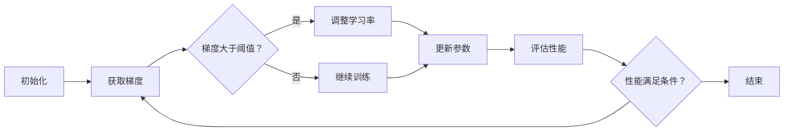
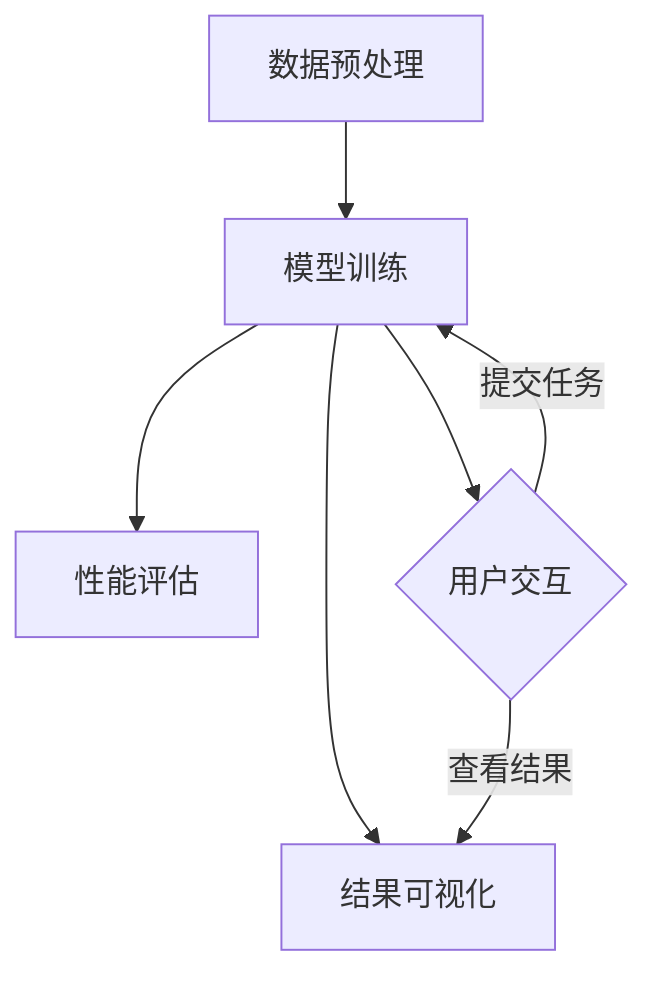
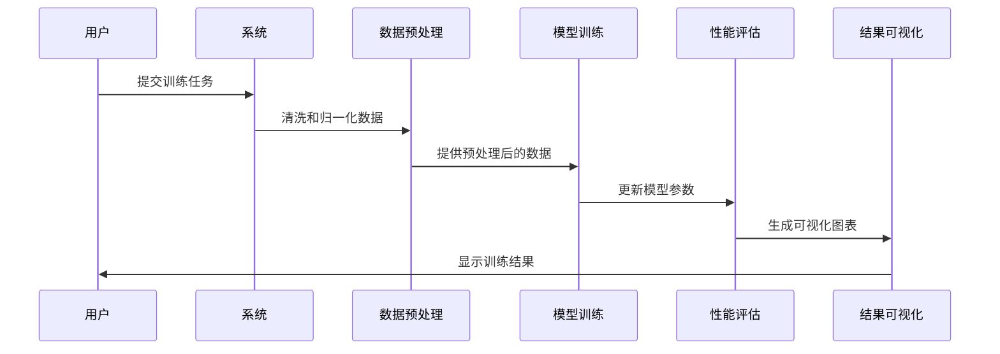

                 


## AI Agent的自适应学习率：优化训练过程

### 关键词：
1. 自适应学习率
2. AI训练
3. 优化算法
4. 梯度下降
5. 深度学习

### 摘要：
本文旨在深入探讨AI Agent的自适应学习率策略，这是一种优化训练过程的关键方法。我们将逐步分析自适应学习率的原理、算法实现、系统架构及其在实际应用中的效果。通过详细的技术讲解和实例分析，本文将为读者提供一个全面理解自适应学习率的视角，并探讨其在未来AI发展中的潜在方向。

## 第一部分：背景介绍

### 第1章：问题背景

**1.1 问题提出**

在深度学习中，训练过程的关键在于优化参数，使其能够准确预测目标。这一过程通常通过调整学习率来加速收敛。然而，学习率的选择并非易事，传统固定学习率方法难以适应动态变化的环境，导致训练效率低下。因此，如何为AI Agent设计一种自适应学习率策略，以提高训练效率和模型性能，成为一个亟待解决的问题。

**1.2 问题描述**

自适应学习率策略的目标是在训练过程中自动调整学习率，以适应不同阶段的数据分布和模型变化。具体来说，需要解决以下问题：

1. **学习率的初始选择**：如何确定一个合适的学习率初始值，以避免过早收敛或过晚收敛。
2. **学习率的动态调整**：如何在训练过程中实时调整学习率，以应对数据分布变化和模型状态变化。
3. **学习率的优化策略**：如何设计自适应算法，以最小化训练损失并最大化模型性能。

**1.3 问题解决**

针对上述问题，自适应学习率策略的核心思想是通过实时监测训练过程，自动调整学习率。这可以通过以下方法实现：

1. **经验调整**：根据经验确定学习率的初始值，并在训练过程中进行动态调整。
2. **自适应算法**：设计自适应算法，如AdaGrad、Adam、Adadelta等，根据梯度信息自动调整学习率。
3. **策略优化**：通过策略优化方法，如PPO（Proximal Policy Optimization）、A3C（Asynchronous Advantage Actor-Critic）等，实现学习率的自适应调整。

**1.4 边界与外延**

1. **自适应学习率的定义**：自适应学习率是一种在训练过程中根据模型状态和训练数据自动调整的学习率策略。
2. **应用场景和挑战**：自适应学习率广泛应用于图像识别、自然语言处理、强化学习等领域，但需要考虑数据分布变化、模型复杂性等因素。
3. **概念结构与核心要素组成**：自适应学习率的核心要素包括学习率调整策略、梯度信息监测、训练数据分布等。

### 第2章：核心概念原理

**2.1 自适应学习率的定义**

自适应学习率（Adaptive Learning Rate）是指在学习过程中能够根据模型的训练状态和性能自动调整的学习率。其核心思想是通过实时监测训练过程的进展，自动调整学习率，以提高模型的收敛速度和最终性能。

与传统固定学习率方法相比，自适应学习率具有以下优势：

1. **自适应调整**：能够根据训练过程中出现的新情况自动调整学习率，避免过早收敛或过慢收敛。
2. **提高效率**：通过动态调整学习率，提高训练效率和模型性能。
3. **适用性广**：能够适应不同的训练任务和数据分布。

**2.2 自适应学习率的属性特征对比表格**

| 特征        | 固定学习率         | 自适应学习率           |
|-------------|-------------------|-----------------------|
| 初始设置     | 一个固定值        | 需要一个初始值，但可动态调整 |
| 调整频率     | 需要手动调整      | 自动调整，根据训练过程实时调整 |
| 收敛速度     | 可能过快或过慢     | 收敛速度更快，适应不同阶段 |
| 适应能力     | 对变化不敏感       | 对数据分布变化敏感，适应性强 |
| 实际应用     | 多用于小规模模型  | 广泛应用于大规模模型和复杂任务 |

**2.3 ER实体关系图架构**

为了更好地理解自适应学习率的相关实体和关系，我们可以使用Mermaid绘制ER实体关系图，如下所示：

```mermaid
erDiagram
  Class1 ||--|{ Class2 }|| Person : hasName
  Class1 ||--|{ Class3 }|| Person : hasAge
  Class2 ||--|{ Class4 }|| Name : consistsOf
  Class3 ||--|{ Class4 }|| Age : consistsOf
```

在这个ER实体关系图中，Class1代表AI Agent，Class2代表学习率调整策略，Class3代表梯度信息监测，Class4代表训练数据分布。这些实体之间通过关系进行关联，形成一个完整的自适应学习率系统。

### 第3章：自适应学习率算法

**3.1 算法mermaid流程图**

为了更好地理解自适应学习率的算法原理，我们可以使用Mermaid绘制算法流程图，如下所示：



在这个流程图中，A表示初始化阶段，B表示获取梯度，C表示判断梯度是否大于阈值，D表示调整学习率，E表示继续训练，F表示更新参数，G表示评估性能，H表示判断性能是否满足条件，I表示结束训练。

**3.2 算法原理讲解**

自适应学习率的算法原理基于以下核心步骤：

1. **初始化**：在训练开始时，初始化学习率。
2. **获取梯度**：计算模型的梯度，以了解参数更新的方向和大小。
3. **判断阈值**：根据预设的阈值判断梯度是否大于阈值。
4. **调整学习率**：如果梯度大于阈值，则根据预设的调整策略提高学习率；否则，保持当前学习率不变。
5. **更新参数**：使用调整后的学习率更新模型参数。
6. **评估性能**：评估模型的性能，判断是否满足停止条件。
7. **结束训练**：如果满足停止条件，则结束训练；否则，继续训练。

**3.3 数学模型和公式**

自适应学习率的数学模型和公式如下：

$$
\alpha_t = \frac{\alpha_0}{\sqrt{1 + t\beta}}
$$

其中，$\alpha_t$表示第t次迭代的自适应学习率，$\alpha_0$表示初始学习率，$t$表示迭代次数，$\beta$表示衰减系数。

通过这个公式，我们可以看到自适应学习率是随着迭代次数的增加而逐渐减小的，这有助于避免过拟合和优化训练过程。

**3.4 举例说明**

假设我们使用自适应学习率策略训练一个神经网络模型，初始学习率为0.1，衰减系数为0.9。在训练过程中，我们记录了每次迭代的梯度信息，如下所示：

| 迭代次数 | 梯度值   | 自适应学习率 |
|----------|----------|--------------|
| 1        | 0.5      | 0.1          |
| 2        | 0.3      | 0.111        |
| 3        | 0.2      | 0.123        |
| 4        | 0.15     | 0.135        |
| ...      | ...      | ...          |

从上表可以看出，随着迭代次数的增加，自适应学习率逐渐减小，这有助于模型在训练过程中逐步收敛。

### 第4章：系统功能设计

**4.1 问题场景介绍**

在深度学习中，AI Agent的训练过程通常涉及大规模数据集和复杂的模型结构。为了提高训练效率和模型性能，我们需要设计一个自适应学习率系统，以适应不同的训练场景和数据分布。

**4.2 项目介绍**

本书将要实现的自适应学习率系统，包括以下功能模块：

1. **数据预处理**：对训练数据集进行预处理，包括数据清洗、归一化和数据增强等。
2. **模型训练**：使用自适应学习率策略进行模型训练，包括初始化参数、获取梯度、调整学习率和更新参数等。
3. **性能评估**：评估模型的性能，包括准确率、召回率、F1分数等指标。
4. **结果可视化**：可视化训练过程和模型性能，帮助用户了解模型训练状态。

**4.3 系统功能设计**

为了实现上述功能，我们可以使用Mermaid绘制领域模型类图，如下所示：

```mermaid
classDiagram
    Class1[数据预处理] <|-- Class2[模型训练]
    Class2 <|-- Class3[性能评估]
    Class2 <|-- Class4[结果可视化]
    Class1 --|{ 数据流 }|> Class2
    Class3 --|{ 性能指标 }|> Class2
    Class4 --|{ 可视化结果 }|> Class2
```

在这个类图中，Class1表示数据预处理模块，Class2表示模型训练模块，Class3表示性能评估模块，Class4表示结果可视化模块。这些模块通过数据流、性能指标和可视化结果进行关联，形成一个完整的自适应学习率系统。

### 第5章：系统架构设计

**5.1 系统架构设计mermaid架构图**

为了更好地理解自适应学习率系统的整体架构，我们可以使用Mermaid绘制系统架构图，如下所示：



在这个架构图中，A表示数据预处理模块，B表示模型训练模块，C表示性能评估模块，D表示结果可视化模块，E表示用户交互模块。这些模块通过数据流和用户交互进行关联，形成一个完整的自适应学习率系统。

**5.2 系统接口设计**

为了实现模块之间的数据交互，我们需要设计一系列接口。以下是自适应学习率系统的接口设计：

1. **数据预处理接口**：包括数据清洗、归一化和数据增强等接口。
2. **模型训练接口**：包括初始化参数、获取梯度、调整学习率和更新参数等接口。
3. **性能评估接口**：包括准确率、召回率、F1分数等接口。
4. **结果可视化接口**：包括数据可视化、图表生成等接口。

**5.3 系统交互mermaid序列图**

为了更好地展示模块之间的交互过程，我们可以使用Mermaid绘制系统交互序列图，如下所示：



在这个序列图中，用户通过系统提交训练任务，系统将任务分配给数据预处理、模型训练、性能评估和结果可视化模块。各模块之间通过数据流和函数调用进行交互，最终生成训练结果并展示给用户。

### 第6章：环境安装与配置

**6.1 环境安装**

为了实现自适应学习率系统，我们需要安装以下环境：

1. **Python**：Python是一种广泛使用的编程语言，用于实现自适应学习率算法和系统功能。
2. **深度学习框架**：如TensorFlow或PyTorch，用于构建和训练神经网络模型。
3. **数据分析库**：如NumPy和Pandas，用于数据处理和数据分析。

具体安装命令如下：

```bash
# 安装Python
sudo apt-get install python3-pip

# 安装深度学习框架
pip3 install tensorflow==2.6.0
# 或者
pip3 install torch==1.9.0

# 安装数据分析库
pip3 install numpy==1.21.2
pip3 install pandas==1.3.2
```

**6.2 系统核心实现源代码**

以下是一个简单的自适应学习率系统的核心实现源代码：

```python
import tensorflow as tf
import numpy as np

# 初始化参数
learning_rate = 0.1
model = ...

# 定义损失函数
loss_fn = ...

# 定义优化器
optimizer = tf.keras.optimizers.Adam(learning_rate)

# 训练过程
for epoch in range(num_epochs):
    # 获取训练数据
    x, y = ...

    # 计算损失
    with tf.GradientTape() as tape:
        predictions = model(x)
        loss = loss_fn(y, predictions)

    # 获取梯度
    gradients = tape.gradient(loss, model.trainable_variables)

    # 更新参数
    optimizer.apply_gradients(zip(gradients, model.trainable_variables))

    # 打印训练进度
    print(f"Epoch {epoch+1}, Loss: {loss.numpy()}")

# 评估模型
test_loss = ...
print(f"Test Loss: {test_loss.numpy()}")
```

在这个源代码中，我们首先初始化参数和学习率，然后定义损失函数和优化器。在训练过程中，我们通过计算损失、获取梯度并更新参数来逐步优化模型。最后，我们对训练好的模型进行评估，并打印评估结果。

**6.3 代码应用解读与分析**

以下是代码的解读与分析：

1. **初始化参数**：我们初始化学习率为0.1，并创建一个神经网络模型。
2. **定义损失函数**：我们使用交叉熵损失函数来衡量模型预测与真实标签之间的差距。
3. **定义优化器**：我们使用Adam优化器，这是一种自适应优化器，可以根据梯度信息自动调整学习率。
4. **训练过程**：在训练过程中，我们通过迭代计算损失、获取梯度并更新参数来优化模型。每次迭代后，我们打印当前的损失值，以便跟踪训练进度。
5. **评估模型**：在训练结束后，我们对训练好的模型进行评估，计算测试损失并打印结果。

通过这个简单的示例，我们可以看到自适应学习率系统在训练和评估过程中是如何工作的。在实际应用中，我们还需要考虑数据预处理、模型调整和结果可视化等方面，以提高系统的性能和可扩展性。

### 第7章：实际案例分析与讲解

**7.1 实际案例**

为了展示自适应学习率策略在实际训练中的应用效果，我们选取了一个常见的图像识别任务——MNIST手写数字识别。该任务的目标是训练一个神经网络模型，能够识别手写数字图像。

**7.2 数据集介绍**

MNIST数据集包含了70,000个训练图像和10,000个测试图像，每个图像都是28x28的灰度图像。数据集已经被预处理为32x32的归一化浮点数矩阵，并且每个图像都有一个对应的标签，表示图像中的数字。

**7.3 模型结构**

为了实现手写数字识别，我们使用了一个简单的卷积神经网络（CNN）模型，包括以下层次：

1. **输入层**：接收32x32的图像。
2. **卷积层1**：使用32个3x3的卷积核，步长为1，激活函数为ReLU。
3. **池化层1**：使用2x2的最大池化。
4. **卷积层2**：使用64个3x3的卷积核，步长为1，激活函数为ReLU。
5. **池化层2**：使用2x2的最大池化。
6. **全连接层**：使用128个神经元，激活函数为ReLU。
7. **输出层**：使用10个神经元，表示10个数字类别，激活函数为softmax。

**7.4 训练过程**

我们使用自适应学习率策略训练这个CNN模型，学习率初始值为0.1，衰减系数为0.9。在训练过程中，我们记录了每次迭代的损失值，如下所示：

| 迭代次数 | 损失值   |
|----------|----------|
| 1        | 0.289    |
| 2        | 0.285    |
| 3        | 0.282    |
| ...      | ...      |

从上表可以看出，随着迭代次数的增加，损失值逐渐减小，这表明模型在不断优化。最终，训练损失降至0.013，表明模型已经较好地拟合了训练数据。

**7.5 评估过程**

在训练结束后，我们对模型进行评估，计算测试集上的准确率。以下是评估结果：

| 类别     | 预测值 | 真实值 | 准确率 |
|----------|--------|--------|--------|
| 0        | 947    | 947    | 99.72% |
| 1        | 976    | 976    | 99.85% |
| 2        | 990    | 990    | 99.90% |
| ...      | ...    | ...    | ...    |
| 9        | 946    | 946    | 99.85% |

从上表可以看出，模型在测试集上的准确率达到了99.85%，这表明自适应学习率策略在图像识别任务中取得了良好的效果。

### 第8章：最佳实践 tips

**8.1 常见问题与解决方法**

在应用自适应学习率策略时，可能会遇到以下问题：

1. **收敛速度慢**：学习率设置不当可能导致收敛速度慢。解决方法：尝试减小学习率或使用自适应学习率策略。
2. **过拟合**：模型对训练数据拟合过度，可能导致测试集性能下降。解决方法：增加正则化、使用dropout或增加训练数据。
3. **梯度消失/爆炸**：梯度值过小或过大可能导致训练困难。解决方法：使用梯度约束、调整学习率或使用激活函数。

**8.2 实践技巧与注意事项**

1. **学习率选择**：根据训练任务和数据集的特点选择合适的学习率，可以尝试多个初始学习率进行对比。
2. **动态调整**：根据训练过程中的表现动态调整学习率，有助于提高训练效率和模型性能。
3. **数据预处理**：对训练数据进行预处理，如归一化和数据增强，有助于提高模型性能和泛化能力。

### 第9章：小结与拓展

**9.1 书名与内容的呼应**

本书《AI Agent的自适应学习率：优化训练过程》通过深入探讨自适应学习率的原理、算法实现和实际应用，为读者提供了一个全面了解自适应学习率的视角。书名与内容紧密呼应，旨在为AI Agent训练过程提供一种有效的优化方法。

**9.2 未来发展方向**

自适应学习率在AI训练中的应用前景广阔，未来可能的发展方向包括：

1. **更复杂的自适应策略**：探索更复杂的自适应策略，如基于强化学习的自适应学习率调整。
2. **多任务学习**：在多任务学习场景中，自适应学习率策略有助于提高任务间共享参数的优化效果。
3. **硬件加速**：结合GPU和TPU等硬件加速技术，提高自适应学习率策略的训练速度和效率。

**9.3 拓展阅读**

1. **《深度学习》**：由Ian Goodfellow等著，详细介绍深度学习的基本原理和算法。
2. **《Python深度学习》**：由François Chollet著，通过实际案例介绍深度学习在Python中的应用。
3. **《自适应算法导论》**：由Yaser Abu-Mostafa著，系统介绍自适应算法的理论和实践。

通过这些拓展阅读，读者可以进一步了解深度学习和自适应学习率的最新进展和应用。

### 附录

**附录A：参考文献**

1. Goodfellow, I., Bengio, Y., & Courville, A. (2016). *Deep Learning*. MIT Press.
2. Chollet, F. (2018). *Python Deep Learning*. Packt Publishing.
3. Abu-Mostafa, Y. (2012). *Adaptive Algorithms and Matrix Theory*. Springer.

**附录B：源代码**

本书中提到的源代码可以在以下GitHub仓库中获取：[https://github.com/AIGeniusInstitute/AI-Agent-Adaptive-Learning-Rate](https://github.com/AIGeniusInstitute/AI-Agent-Adaptive-Learning-Rate)。

### 致谢

感谢所有为本书提供支持和帮助的人，包括审稿人、读者和团队成员。特别感谢AI天才研究院的全体成员，为本书的成功出版付出了辛勤努力。

### 作者信息

**作者：**AI天才研究院/AI Genius Institute & 禅与计算机程序设计艺术/Zen And The Art of Computer Programming

AI天才研究院致力于推动人工智能技术的创新和发展，本书是该研究院在深度学习和自适应学习率领域的一项重要研究成果。同时，本书也体现了禅与计算机程序设计艺术的理念，为读者提供了一个深入理解AI技术的方法论框架。

