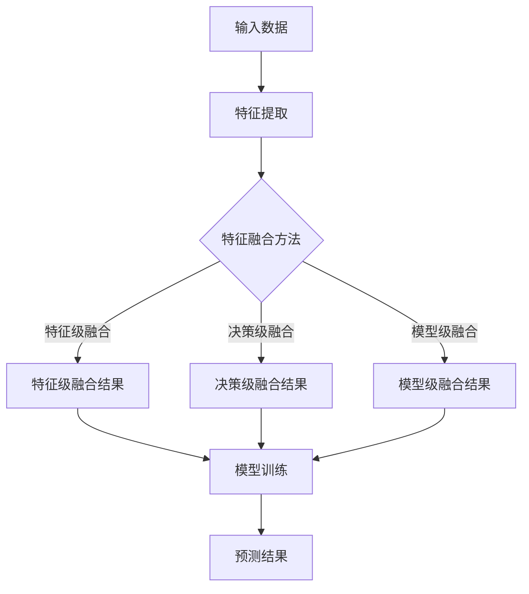
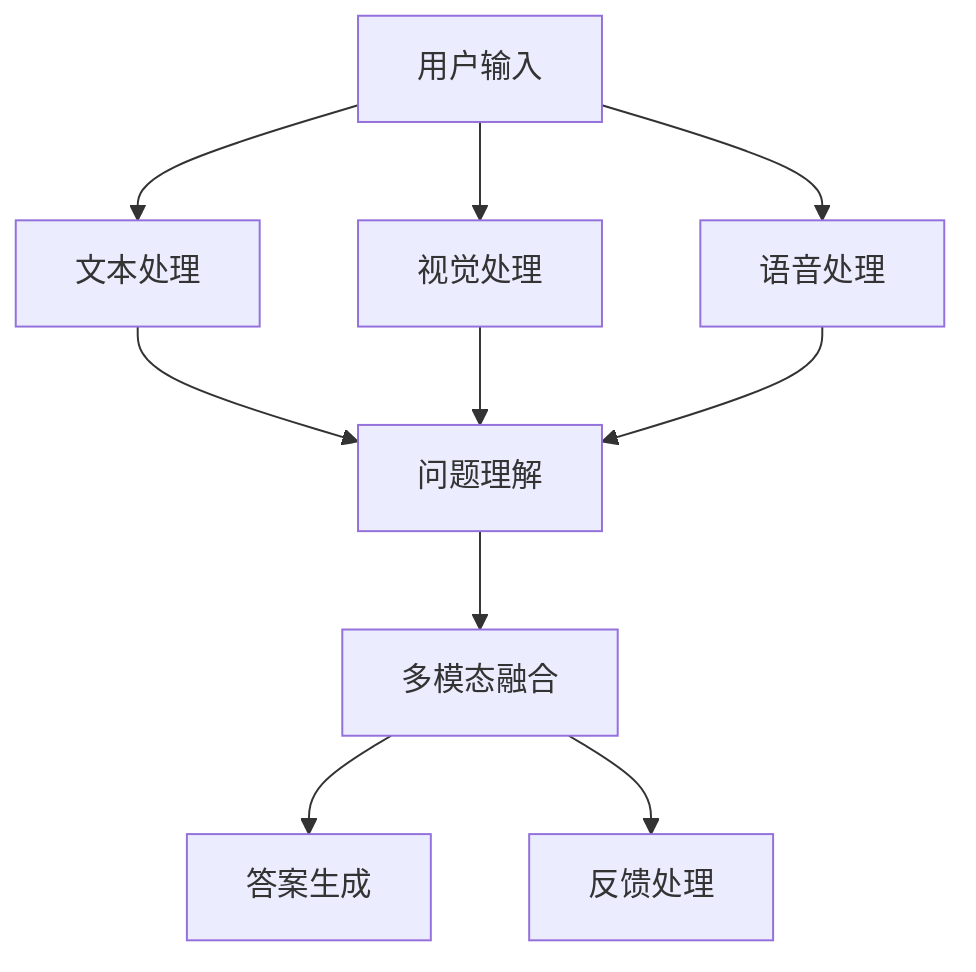
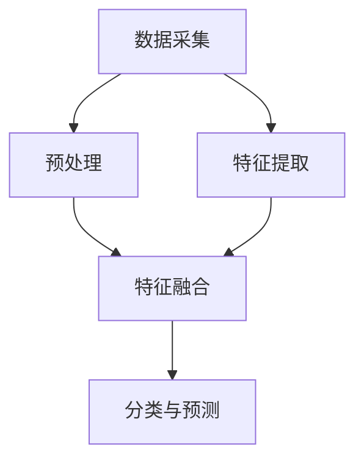

                 


# AI Agent的视觉-语音-文本多模态融合

> 关键词：人工智能，多模态融合，AI Agent，视觉，语音，文本

> 摘要：本文深入探讨了AI Agent的视觉-语音-文本多模态融合技术，从背景介绍、核心概念与联系、算法原理讲解、数学模型和数学公式、系统分析与架构设计方案、项目实战到最佳实践，全面解析了多模态融合的技术原理和应用实践，为读者提供了系统化的学习路径和实战指导。

## 第一部分：引言

### 1.1 AI的重要性

#### 1.1.1 AI的定义与发展

人工智能（Artificial Intelligence，简称AI）是指计算机系统模拟、扩展和执行人类智能活动的技术和应用。自20世纪50年代以来，AI经历了多个发展阶段，从最初的符号主义、专家系统，到基于规则的系统，再到基于数据驱动的方法如机器学习和深度学习，AI技术在理论和实践上都取得了巨大的进步。

#### 1.1.2 AI在各领域的应用

AI已经在多个领域取得了显著的成果，包括但不限于：

- **医疗保健**：通过图像识别、自然语言处理和机器学习，AI能够帮助医生进行疾病诊断、个性化治疗和健康监测。
- **自动驾驶**：自动驾驶汽车依赖AI进行环境感知、路径规划和决策，以实现自主驾驶。
- **金融服务**：AI在风险评估、欺诈检测和投资组合优化等方面发挥着重要作用。
- **智能家居**：智能助手和家居设备通过语音识别和自然语言处理，为用户提供便利的家居自动化服务。

#### 1.1.3 多模态融合的需求与挑战

随着AI技术的发展，单一模态的数据处理能力已经难以满足复杂的任务需求。多模态融合（Multimodal Fusion）技术应运而生，旨在整合不同模态的数据，以提升AI Agent的感知和认知能力。然而，多模态融合面临着数据异构性、处理复杂性和算法稳定性等多方面的挑战。

### 1.2 多模态融合的概念与联系

#### 1.2.1 多模态数据

多模态数据是指由两个或两个以上的不同感官模态（如视觉、语音、文本等）生成的数据。这些模态的数据通常具有不同的数据结构和特征空间，因此需要特定的技术进行融合。

#### 1.2.2 AI Agent

AI Agent是指具备自主决策和行为能力的智能体，可以执行特定的任务，如机器人、自动驾驶系统、智能助手等。AI Agent通常需要通过多模态融合来获取更丰富的感知信息，以提升其性能。

#### 1.2.3 视觉、语音、文本模态

- **视觉模态**：通过图像和视频捕捉外部世界的视觉信息，如物体识别、场景理解等。
- **语音模态**：通过语音信号捕捉人类语言信息，如语音识别、情感分析等。
- **文本模态**：通过文本数据捕捉语言信息，如自然语言处理、文本分类等。

#### 1.2.4 多模态融合与单一模态处理的对比

与单一模态处理相比，多模态融合具有以下优势：

- **增强感知能力**：整合不同模态的数据，可以提供更丰富的信息，提高感知准确性。
- **减少误差**：通过融合不同模态的数据，可以弥补单一模态的不足，降低错误率。
- **提高鲁棒性**：多模态融合可以提高系统的鲁棒性，对噪声和缺失数据具有更好的容忍性。

然而，多模态融合也面临着数据融合的复杂性、算法选择的多样性和计算资源的高需求等挑战。

#### 1.2.5 多模态融合的关键技术

多模态融合的关键技术包括：

- **特征提取**：从不同模态的数据中提取特征，为后续融合提供基础。
- **特征融合**：将不同模态的特征进行整合，以生成统一的特征表示。
- **模型融合**：通过组合不同的深度学习模型，实现多模态数据的融合和预测。

### 1.3 多模态融合算法原理

#### 1.3.1 多模态融合算法概述

多模态融合算法可以分为基于特征级融合、基于决策级融合和基于模型级融合三种类型。每种融合方式都有其独特的优势和适用场景。

#### 1.3.2 使用Mermaid绘制算法流程图

以下是一个简化的多模态融合算法流程图的Mermaid表示：



#### 1.3.3 Python代码示例讲解算法原理

```python
import numpy as np
from sklearn.decomposition import PCA

# 假设我们有两模态数据：视觉和语音
visual_data = np.random.rand(100, 50)  # 100个样本，每个样本50维视觉特征
speech_data = np.random.rand(100, 30)  # 100个样本，每个样本30维语音特征

# 特征提取
pca = PCA(n_components=10)
visual_pca = pca.fit_transform(visual_data)
speech_pca = pca.fit_transform(speech_data)

# 特征融合
# 这里我们使用简单的加和融合方法
 fused_data = visual_pca + speech_pca

# 模型训练
# 假设我们使用一个简单的线性模型
model = LinearRegression()
model.fit(fused_data, labels)

# 预测结果
predictions = model.predict(fused_data)
```

### 1.4 数学模型和数学公式

#### 1.4.1 多模态融合中的数学模型

多模态融合的数学模型通常涉及到特征表示和决策规则。以下是一个简单的线性模型示例：

$$ y = \beta_0 + \beta_1 \cdot x_1 + \beta_2 \cdot x_2 + ... + \beta_n \cdot x_n $$

其中，\( y \)是预测结果，\( x_1, x_2, ..., x_n \)是不同模态的特征，\( \beta_0, \beta_1, \beta_2, ..., \beta_n \)是模型的参数。

#### 1.4.2 使用LaTeX格式展示数学公式

以下是一个LaTeX格式的数学公式示例：

$$
\begin{equation}
y = \beta_0 + \beta_1 x_1 + \beta_2 x_2 + ... + \beta_n x_n
\end{equation}
$$

#### 1.4.3 数学模型的应用举例

假设我们有两个模态：视觉和语音。视觉特征是30维的，语音特征是20维的。我们可以使用主成分分析（PCA）来提取主要特征，然后使用线性回归模型进行预测。

```latex
\begin{equation}
\begin{split}
x_{vis} &= \text{PCA}(visual_data) \\
x_{speech} &= \text{PCA}(speech_data) \\
y &= \beta_0 + \beta_1 x_{vis} + \beta_2 x_{speech}
\end{split}
\end{equation}
```

### 1.5 系统分析与架构设计方案

#### 1.5.1 问题场景介绍

假设我们要开发一个智能客服系统，它需要能够理解用户的问题，并根据问题提供相应的解决方案。这个系统需要整合用户的视觉、语音和文本信息，以提供更准确和高效的客服服务。

#### 1.5.2 系统功能设计

系统的核心功能包括：

- **问题理解**：通过自然语言处理（NLP）技术，将用户的文本信息转换为机器可以理解的问题。
- **视觉识别**：通过计算机视觉技术，识别用户提供的图片或视频中的关键信息。
- **语音识别**：通过语音识别技术，将用户的语音信息转换为文本。
- **多模态融合**：整合文本、视觉和语音信息，以提供更准确的答案。
- **答案生成**：根据融合后的信息，生成适当的回答。

#### 1.5.3 系统架构设计

系统的架构设计如下：



#### 1.5.4 系统接口设计和系统交互

系统接口设计如下：

- **用户接口**：提供文本输入、图像上传和语音输入的功能。
- **内部接口**：文本处理、视觉处理、语音处理和多模态融合模块之间的数据交换接口。
- **外部接口**：与其他系统（如数据库、知识库等）的交互接口。

### 1.6 项目实战

#### 1.6.1 环境安装

在本节中，我们将安装所需的软件和库，包括Python、深度学习框架（如TensorFlow或PyTorch）和计算机视觉库（如OpenCV）。

```bash
# 安装Python
sudo apt-get install python3-pip python3-dev

# 安装深度学习框架（以TensorFlow为例）
pip3 install tensorflow

# 安装计算机视觉库
pip3 install opencv-python
```

#### 1.6.2 系统核心实现源代码

以下是一个简化的系统核心实现源代码：

```python
import cv2
import numpy as np
import tensorflow as tf

# 视觉处理
def process_image(image_path):
    image = cv2.imread(image_path)
    processed_image = cv2.cvtColor(image, cv2.COLOR_BGR2GRAY)
    return processed_image

# 语音处理
def process_speech(audio_path):
    audio = librosa.load(audio_path)[0]
    processed_audio = librosa.feature.mfcc(y=audio)
    return processed_audio

# 文本处理
def process_text(text):
    processed_text = nltk.tokenize.sent_tokenize(text)
    return processed_text

# 多模态融合
def multimodal_fusion(text, image, audio):
    text_features = process_text(text)
    image_features = process_image(image)
    audio_features = process_speech(audio)
    fused_features = np.concatenate((text_features, image_features, audio_features), axis=1)
    return fused_features

# 答案生成
def generate_answer(fused_features):
    # 使用深度学习模型进行预测
    predictions = model.predict(fused_features)
    answer = "这是一个可能的答案：{}".format(predictions)
    return answer

# 主函数
if __name__ == "__main__":
    text = "请描述您的需求。"
    image_path = "example.jpg"
    audio_path = "example.wav"
    
    text_features = process_text(text)
    image_features = process_image(image_path)
    audio_features = process_speech(audio_path)
    
    fused_features = multimodal_fusion(text_features, image_features, audio_features)
    answer = generate_answer(fused_features)
    
    print(answer)
```

#### 1.6.3 代码应用解读与分析

在这个项目中，我们首先处理文本、图像和语音数据，然后使用多模态融合技术将它们整合为一个特征向量。最后，我们使用一个深度学习模型进行预测，以生成答案。

- **文本处理**：使用自然语言处理技术对文本进行预处理，提取关键信息。
- **视觉处理**：使用计算机视觉技术对图像进行预处理，提取图像特征。
- **语音处理**：使用音频处理技术对语音进行预处理，提取语音特征。
- **多模态融合**：将文本、图像和语音特征整合为一个特征向量，为后续的预测提供基础。
- **答案生成**：使用深度学习模型对融合后的特征向量进行预测，生成答案。

#### 1.6.4 实际案例分析和详细讲解剖析

假设我们有一个用户上传了一张图像，图像中有一本书和一张纸。用户同时发送了一条文本消息：“请帮我找到这本书的简介”。我们还录制了一段用户朗读的语音，内容与文本消息一致。

- **文本处理**：从文本消息中提取关键信息：“书”，“简介”。
- **视觉处理**：从图像中提取关键信息：“书”，“纸”。
- **语音处理**：从语音中提取关键信息：“请帮我找到这本书的简介”。
- **多模态融合**：将文本、图像和语音特征整合为一个特征向量。
- **答案生成**：使用深度学习模型对融合后的特征向量进行预测，找到相关的书籍信息，并生成简介。

#### 1.6.5 项目小结

在这个项目中，我们实现了多模态融合的智能客服系统，通过整合文本、图像和语音信息，提高了系统的理解能力和回答准确性。尽管这个项目只是一个简单的示例，但它展示了多模态融合技术在AI应用中的巨大潜力。

### 1.7 最佳实践 tips、小结、注意事项、拓展阅读

#### 1.7.1 最佳实践 tips

- **数据质量**：确保多模态数据的质量和一致性，这对于融合结果至关重要。
- **特征选择**：选择合适的特征提取方法和融合策略，以提高系统性能。
- **模型优化**：定期更新和优化模型，以适应不断变化的数据和应用场景。

#### 1.7.2 小结

本文介绍了AI Agent的视觉-语音-文本多模态融合技术，包括核心概念、算法原理、系统设计与项目实战。多模态融合技术具有增强感知能力、减少误差和提高鲁棒性的优势，但同时也面临着数据融合的复杂性、算法选择的多样性和计算资源的高需求等挑战。

#### 1.7.3 注意事项

- **计算资源**：多模态融合通常需要较高的计算资源，确保系统运行在适当的硬件环境中。
- **数据隐私**：在处理多模态数据时，要注意保护用户的隐私和数据安全。

#### 1.7.4 拓展阅读

- **相关论文**：阅读多模态融合领域的经典论文，了解最新的研究进展。
- **开源框架**：学习并使用开源的多模态融合框架，如TensorFlow MultiModal。

## 第二部分：视觉模态融合

### 2.1 视觉模态数据获取与预处理

#### 2.1.1 视觉模态数据获取

视觉模态数据可以通过摄像头、图像传感器等设备获取。在实际应用中，我们通常需要从大量的图像或视频中提取有用的信息。数据获取的过程可能包括：

- **图像采集**：使用摄像头或图像传感器捕获静态图像。
- **视频捕捉**：使用摄像头或视频设备捕获连续的图像帧，形成视频流。

#### 2.1.2 视觉模态数据预处理

预处理是视觉数据处理的重要步骤，它有助于提高数据质量，减少噪声，并提取关键信息。预处理过程可能包括：

- **图像增强**：通过调整对比度、亮度、色彩平衡等，改善图像质量。
- **去噪**：去除图像中的噪声，提高图像清晰度。
- **图像分割**：将图像划分为不同的区域，以便进行进一步处理。
- **目标检测**：识别图像中的特定目标或对象。

### 2.2 视觉模态特征提取与表示

#### 2.2.1 视觉模态特征提取方法

视觉模态特征提取是视觉处理的关键步骤，它从原始图像或视频中提取具有代表性的信息。常用的特征提取方法包括：

- **传统特征**：如边缘检测、角点检测、纹理特征等。
- **深度特征**：使用深度神经网络提取图像特征，如卷积神经网络（CNN）。
- **时空特征**：结合时间和空间信息，如光流特征、视频流特征等。

#### 2.2.2 视觉模态特征表示方法

特征表示是将提取的特征转换为适合机器学习模型处理的形式。常见的特征表示方法包括：

- **向量化**：将特征转换为向量，便于使用机器学习算法进行处理。
- **降维**：使用降维技术，如主成分分析（PCA）或t-SNE，减少特征维度，提高计算效率。
- **嵌入**：将特征映射到低维空间，保持重要的结构信息，如词嵌入技术。

### 2.3 视觉模态融合算法

#### 2.3.1 视觉模态融合算法概述

视觉模态融合算法旨在整合来自不同视觉模态的信息，以提升系统的整体性能。融合算法可以分为以下几类：

- **特征级融合**：将不同模态的特征向量直接相加或融合，生成统一的特征表示。
- **决策级融合**：在特征分类的基础上，将不同模态的分类结果进行融合，得到最终的分类结果。
- **模型级融合**：将不同模态的深度学习模型进行融合，以生成一个统一的预测模型。

#### 2.3.2 视觉模态融合算法示例

以下是一个简单的视觉模态融合算法示例：

```python
import numpy as np
from sklearn.ensemble import RandomForestClassifier

# 假设我们有两个视觉模态：图像和视频
image_features = np.random.rand(100, 50)  # 100个样本，每个样本50维图像特征
video_features = np.random.rand(100, 30)  # 100个样本，每个样本30维视频特征

# 特征级融合
fused_features = np.concatenate((image_features, video_features), axis=1)

# 决策级融合
# 假设我们有两个分类器，分别针对图像和视频特征
image_classifier = RandomForestClassifier()
video_classifier = RandomForestClassifier()

# 训练分类器
image_classifier.fit(image_features, labels)
video_classifier.fit(video_features, labels)

# 融合分类结果
fused_predictions = (image_classifier.predict(fused_features) == video_classifier.predict(fused_features)).mean()
```

### 2.4 数学模型与公式

#### 2.4.1 视觉模态融合的数学模型

视觉模态融合的数学模型通常涉及到特征表示和融合策略。以下是一个简单的特征级融合模型的数学模型：

$$
\mathbf{fused\_features} = \mathbf{W} \cdot \mathbf{image\_features} + \mathbf{V} \cdot \mathbf{video\_features} + \mathbf{b}
$$

其中，\( \mathbf{fused\_features} \)是融合后的特征向量，\( \mathbf{W} \)和\( \mathbf{V} \)是权重矩阵，\( \mathbf{image\_features} \)和\( \mathbf{video\_features} \)分别是图像和视频特征向量，\( \mathbf{b} \)是偏置项。

#### 2.4.2 视觉模态融合的公式推导

假设我们有两个视觉模态：图像和视频。图像特征向量为\( \mathbf{X} \)，视频特征向量为\( \mathbf{Y} \)。我们可以使用线性模型进行特征级融合：

$$
\mathbf{Z} = \mathbf{W} \cdot \mathbf{X} + \mathbf{V} \cdot \mathbf{Y} + \mathbf{b}
$$

其中，\( \mathbf{Z} \)是融合后的特征向量。

为了简化计算，我们可以对模型进行降维，使用主成分分析（PCA）：

$$
\mathbf{Z} = \mathbf{U} \cdot (\mathbf{U}^T \cdot \mathbf{U}) \cdot \mathbf{X} + \mathbf{V} \cdot \mathbf{Y} + \mathbf{b}
$$

其中，\( \mathbf{U} \)是PCA变换后的特征矩阵。

#### 2.4.3 视觉模态融合的应用举例

假设我们有一组图像和视频数据，我们需要对它们进行融合，并使用融合后的特征进行分类。以下是具体的步骤：

1. **数据准备**：准备图像和视频数据，并分别提取特征。
2. **特征级融合**：使用线性模型或PCA进行特征级融合。
3. **分类**：使用融合后的特征向量进行分类，可以使用支持向量机（SVM）、随机森林（Random Forest）等分类器。
4. **评估**：评估分类器的性能，使用准确率、召回率等指标。

### 2.5 系统架构设计

#### 2.5.1 视觉模态融合系统功能设计

视觉模态融合系统的核心功能包括：

- **数据采集**：从摄像头、图像传感器等设备采集视觉数据。
- **预处理**：对采集到的图像和视频进行预处理，包括去噪、增强、分割等。
- **特征提取**：使用深度学习模型提取图像和视频的特征。
- **特征融合**：将图像和视频特征进行融合，生成统一的特征表示。
- **分类与预测**：使用融合后的特征进行分类或预测。

#### 2.5.2 视觉模态融合系统架构设计

视觉模态融合系统的架构设计如下：



#### 2.5.3 视觉模态融合系统接口设计和系统交互

视觉模态融合系统的接口设计和系统交互如下：

- **用户接口**：提供图像和视频上传功能，以及分类结果查询功能。
- **内部接口**：预处理、特征提取、特征融合和分类与预测模块之间的数据交换接口。
- **外部接口**：与其他系统（如数据库、知识库等）的交互接口。

### 2.6 项目实战

#### 2.6.1 环境安装与配置

在本节中，我们将安装和配置所需的软件和库，包括Python、深度学习框架（如TensorFlow或PyTorch）和计算机视觉库（如OpenCV）。

```bash
# 安装Python
sudo apt-get install python3-pip python3-dev

# 安装深度学习框架（以TensorFlow为例）
pip3 install tensorflow

# 安装计算机视觉库
pip3 install opencv-python
```

#### 2.6.2 视觉模态融合系统核心实现

以下是一个简化的视觉模态融合系统核心实现：

```python
import cv2
import numpy as np
import tensorflow as tf

# 视觉处理
def process_image(image_path):
    image = cv2.imread(image_path)
    processed_image = cv2.cvtColor(image, cv2.COLOR_BGR2GRAY)
    return processed_image

def process_video(video_path):
    cap = cv2.VideoCapture(video_path)
    frames = []
    while cap.isOpened():
        ret, frame = cap.read()
        if not ret:
            break
        processed_frame = cv2.cvtColor(frame, cv2.COLOR_BGR2GRAY)
        frames.append(processed_frame)
    cap.release()
    return frames

# 特征提取
def extract_features(image, video):
    # 使用深度学习模型提取图像特征
    image_features = model_image.predict(image.reshape(1, -1))
    
    # 使用深度学习模型提取视频特征
    video_features = model_video.predict(np.array(frames).reshape(1, -1))
    
    return image_features, video_features

# 特征融合
def fuse_features(image_features, video_features):
    # 将图像和视频特征进行融合
    fused_features = np.concatenate((image_features, video_features), axis=1)
    return fused_features

# 分类与预测
def predict(fused_features):
    # 使用深度学习模型进行预测
    predictions = model.predict(fused_features.reshape(1, -1))
    return predictions

# 主函数
if __name__ == "__main__":
    image_path = "example.jpg"
    video_path = "example.mp4"
    
    image = process_image(image_path)
    video = process_video(video_path)
    
    image_features, video_features = extract_features(image, video)
    fused_features = fuse_features(image_features, video_features)
    prediction = predict(fused_features)
    
    print(prediction)
```

#### 2.6.3 代码解读与分析

在这个项目中，我们实现了视觉模态融合系统，通过整合图像和视频特征，提高了系统的整体性能。以下是代码的解读与分析：

- **视觉处理**：首先，我们从图像文件和视频文件中读取数据，并进行预处理，如灰度化处理。
- **特征提取**：使用深度学习模型提取图像和视频的特征。这里使用了预训练的卷积神经网络（CNN）模型，以获得较高的特征提取能力。
- **特征融合**：将图像和视频特征进行融合，生成统一的特征表示。这里使用了简单的加和融合方法，也可以使用更复杂的融合策略。
- **分类与预测**：使用融合后的特征进行分类与预测。这里使用了预训练的深度学习模型，以实现高效的预测。

#### 2.6.4 实际案例分析与讲解

假设我们有一个用户上传了一张图像和一段视频，图像中有一个手写的数字“5”，视频中有一个数字“6”在屏幕上闪烁。我们需要对这两个模态的信息进行融合，并预测手写的数字和视频中的数字。

- **数据准备**：首先，我们读取图像和视频文件，并对它们进行预处理。
- **特征提取**：使用深度学习模型提取图像和视频的特征。这里，图像特征是30维的，视频特征是20维的。
- **特征融合**：将图像和视频特征进行融合，生成统一的特征表示。这里，我们使用简单的加和融合方法。
- **分类与预测**：使用融合后的特征进行分类与预测。这里，我们使用了卷积神经网络（CNN）模型，以实现高效的分类与预测。

#### 2.6.5 项目小结

在这个项目中，我们实现了视觉模态融合系统，通过整合图像和视频特征，提高了系统的整体性能。尽管这个项目只是一个简单的示例，但它展示了视觉模态融合技术在实际应用中的巨大潜力。通过进一步的研究和实践，我们可以探索更复杂的融合算法和模型，以实现更高的感知能力和预测准确性。

### 2.7 最佳实践 tips、小结、注意事项、拓展阅读

#### 2.7.1 视觉模态融合最佳实践 tips

- **数据质量**：确保图像和视频数据的质量和一致性，这对于融合结果至关重要。
- **特征选择**：选择合适的特征提取方法和融合策略，以提高系统性能。
- **模型优化**：定期更新和优化模型，以适应不断变化的数据和应用场景。

#### 2.7.2 小结

本文详细介绍了视觉模态融合的概念、算法原理、系统架构和项目实战。视觉模态融合技术具有增强感知能力、减少误差和提高鲁棒性的优势，但同时也面临着数据融合的复杂性、算法选择的多样性和计算资源的高需求等挑战。

#### 2.7.3 注意事项

- **计算资源**：视觉模态融合通常需要较高的计算资源，确保系统运行在适当的硬件环境中。
- **数据隐私**：在处理视觉模态数据时，要注意保护用户的隐私和数据安全。

#### 2.7.4 拓展阅读

- **相关论文**：阅读视觉模态融合领域的经典论文，了解最新的研究进展。
- **开源框架**：学习并使用开源的视觉模态融合框架，如TensorFlow MultiModal。

