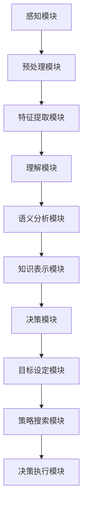

                 

### AI Agent的认知架构：从感知到决策的全流程设计

#### 关键词：AI Agent，认知架构，感知，理解，决策，全流程设计

> 摘要：本文将深入探讨AI Agent的认知架构设计，从感知到决策的全流程展开，分析各个模块的设计原理、实现方法以及优化策略，通过具体案例进行详细讲解，帮助读者全面理解并掌握AI Agent的认知架构设计方法。

### 第一部分：AI Agent的认知架构概述

#### 1.1 AI Agent的定义与分类

##### 1.1.1 AI Agent的定义

AI Agent，即人工智能代理，是一种模拟人类智能行为，具备自主感知、理解和决策能力的计算实体。它可以在复杂的动态环境中执行特定的任务，并不断学习优化自己的行为。

##### 1.1.2 AI Agent的分类

AI Agent可以分为以下几种类型：

- **基于规则的Agent**：通过预定义的规则进行决策。
- **数据驱动Agent**：通过大量数据进行学习和决策。
- **混合型Agent**：结合规则和数据驱动的方法进行决策。

##### 1.1.3 AI Agent的特点与应用

AI Agent的特点包括：

- **自主性**：能够自主地执行任务。
- **适应性**：能够适应不断变化的环境。
- **学习性**：能够通过经验不断优化行为。

AI Agent的应用场景广泛，如自动驾驶、智能客服、智能安防等。

#### 1.2 认知架构的基本概念

##### 1.2.1 认知过程的概述

认知过程包括感知、理解、决策和行动等步骤。感知是获取外部信息的过程，理解是对信息进行加工和处理的过程，决策是根据理解和目标选择最优行动方案的过程，行动是执行决策的过程。

##### 1.2.2 感知、理解和决策的关系

感知是理解和决策的基础，理解和决策是对感知信息的加工和利用。感知、理解和决策共同构成了AI Agent的认知架构。

##### 1.2.3 认知架构的设计原则

认知架构的设计应遵循以下原则：

- **模块化**：将认知过程分解为模块，每个模块独立实现，便于维护和扩展。
- **灵活性**：设计应具有灵活性，以适应不同的应用场景。
- **可扩展性**：设计应具备可扩展性，以便未来技术进步时能够升级。

#### 1.3 AI Agent的认知架构模型

##### 1.3.1 感知模块的设计

感知模块负责获取和处理外部环境信息。具体包括：

- **传感器接口**：连接各种传感器，如摄像头、麦克风等。
- **预处理算法**：对传感器数据进行预处理，如去噪、滤波等。
- **特征提取**：从预处理后的数据中提取有用的特征信息。

##### 1.3.2 理解模块的设计

理解模块负责对感知模块提取的特征信息进行语义理解和知识表示。具体包括：

- **语言处理**：对文本、语音等信息进行语言处理。
- **语义分析**：对处理后的信息进行语义分析，提取关键信息。
- **知识表示**：将分析得到的信息表示为知识结构，如知识图谱。

##### 1.3.3 决策模块的设计

决策模块负责根据理解模块提供的信息，选择最优的行动方案。具体包括：

- **目标设定**：根据任务需求设定目标。
- **策略搜索**：搜索并评估不同的行动方案。
- **决策执行**：选择并执行最优的行动方案。

##### 1.4 AI Agent的认知架构实现

##### 1.4.1 感知模块的实现

感知模块的实现主要涉及传感器接口和预处理算法。具体步骤如下：

1. **选择合适的传感器**：根据任务需求选择合适的传感器，如摄像头、麦克风等。
2. **接口设计**：设计传感器接口，实现传感器数据的采集。
3. **预处理算法实现**：实现预处理算法，如去噪、滤波等，对传感器数据进行分析和处理。

##### 1.4.2 理解模块的实现

理解模块的实现主要涉及语言处理、语义分析和知识表示。具体步骤如下：

1. **语言处理**：实现文本、语音等信息的处理，提取关键信息。
2. **语义分析**：对处理后的信息进行语义分析，提取关键信息。
3. **知识表示**：将分析得到的信息表示为知识结构，如知识图谱。

##### 1.4.3 决策模块的实现

决策模块的实现主要涉及目标设定、策略搜索和决策执行。具体步骤如下：

1. **目标设定**：根据任务需求设定目标。
2. **策略搜索**：搜索并评估不同的行动方案。
3. **决策执行**：选择并执行最优的行动方案。

### 第二部分：感知模块设计详解

#### 2.1 感知模块原理与架构

##### 2.1.1 感知模块的基本原理

感知模块是AI Agent的感官系统，负责获取并处理外部环境信息。感知模块的基本原理包括以下几个方面：

1. **传感器数据采集**：通过连接各种传感器（如摄像头、麦克风等），采集外部环境信息。
2. **预处理**：对传感器数据进行预处理，如去噪、滤波等，以提高数据质量。
3. **特征提取**：从预处理后的数据中提取有用的特征信息，用于后续的理解和决策。

##### 2.1.2 感知模块的架构设计

感知模块的架构设计包括以下几个关键组成部分：

1. **传感器接口**：负责连接各种传感器，实现数据采集。
2. **预处理模块**：实现预处理算法，如去噪、滤波等。
3. **特征提取模块**：从预处理后的数据中提取特征信息。
4. **数据存储**：存储感知模块产生的数据，以便后续分析和处理。

#### 2.2 感知模块实现方法

##### 2.2.1 数据采集与预处理

数据采集与预处理是感知模块实现的关键步骤。具体实现方法如下：

1. **选择合适的传感器**：根据任务需求选择合适的传感器，如摄像头、麦克风等。
2. **接口设计**：设计传感器接口，实现传感器数据的采集。
3. **预处理算法实现**：实现预处理算法，如去噪、滤波等，对传感器数据进行分析和处理。

##### 2.2.2 特征提取与降维

特征提取与降维是感知模块实现的重要环节。具体实现方法如下：

1. **特征提取**：从预处理后的数据中提取有用的特征信息，如边缘、颜色、纹理等。
2. **降维**：通过降维算法（如PCA、LDA等），减少特征维度，提高计算效率。

##### 2.2.3 模型训练与评估

模型训练与评估是感知模块实现的最后一个环节。具体实现方法如下：

1. **模型选择**：根据任务需求选择合适的模型，如CNN、RNN等。
2. **模型训练**：使用训练数据对模型进行训练。
3. **模型评估**：使用验证数据对模型进行评估，调整模型参数，提高模型性能。

### 第三部分：理解模块设计详解

#### 3.1 理解模块原理与架构

##### 3.1.1 理解模块的基本原理

理解模块是AI Agent的智能大脑，负责对感知模块提取的特征信息进行语义理解和知识表示。理解模块的基本原理包括以下几个方面：

1. **语义理解**：对处理后的信息进行语义分析，提取关键信息。
2. **知识表示**：将分析得到的信息表示为知识结构，如知识图谱。
3. **推理**：基于知识结构和语义信息进行推理，获取新的信息。

##### 3.1.2 理解模块的架构设计

理解模块的架构设计包括以下几个关键组成部分：

1. **语言处理模块**：负责处理文本、语音等信息。
2. **语义分析模块**：负责对处理后的信息进行语义分析，提取关键信息。
3. **知识表示模块**：负责将分析得到的信息表示为知识结构，如知识图谱。
4. **推理模块**：负责基于知识结构和语义信息进行推理。

#### 3.2 理解模块实现方法

##### 3.2.1 语言处理技术

语言处理技术是理解模块实现的核心。具体实现方法如下：

1. **文本处理**：对文本信息进行分词、词性标注等处理。
2. **语音识别**：将语音信号转换为文本信息。
3. **语言模型**：使用语言模型（如神经网络语言模型）进行语言处理。

##### 3.2.2 语义分析技术

语义分析技术是理解模块实现的关键。具体实现方法如下：

1. **实体识别**：识别文本中的实体，如人名、地名、组织名等。
2. **关系提取**：提取文本中的关系，如因果、上下级等。
3. **情感分析**：分析文本中的情感倾向。

##### 3.2.3 知识图谱构建

知识图谱构建是理解模块实现的重要环节。具体实现方法如下：

1. **实体抽取**：从文本中抽取实体。
2. **关系抽取**：从文本中抽取关系。
3. **知识表示**：使用知识图谱表示实体和关系。

### 第四部分：决策模块设计详解

#### 4.1 决策模块原理与架构

##### 4.1.1 决策模块的基本原理

决策模块是AI Agent的决策中枢，负责根据理解模块提供的信息选择最优的行动方案。决策模块的基本原理包括以下几个方面：

1. **目标设定**：根据任务需求设定目标。
2. **策略搜索**：搜索并评估不同的行动方案。
3. **决策执行**：选择并执行最优的行动方案。

##### 4.1.2 决策模块的架构设计

决策模块的架构设计包括以下几个关键组成部分：

1. **目标设定模块**：负责根据任务需求设定目标。
2. **策略搜索模块**：负责搜索并评估不同的行动方案。
3. **决策执行模块**：负责选择并执行最优的行动方案。

#### 4.2 决策模块实现方法

##### 4.2.1 目标设定方法

目标设定方法是决策模块实现的第一步。具体实现方法如下：

1. **任务需求分析**：分析任务需求，确定目标。
2. **目标函数设计**：设计目标函数，量化目标。

##### 4.2.2 策略搜索方法

策略搜索方法是决策模块实现的核心。具体实现方法如下：

1. **搜索算法选择**：根据任务需求选择合适的搜索算法，如A*算法、深度优先搜索等。
2. **搜索过程设计**：设计搜索过程，评估不同的行动方案。

##### 4.2.3 决策执行方法

决策执行方法是决策模块实现的最后一步。具体实现方法如下：

1. **决策选择**：根据评估结果选择最优的行动方案。
2. **决策执行**：执行决策，执行行动方案。

### 第五部分：项目实战

#### 5.1 环境安装

在本部分，我们将介绍如何搭建一个AI Agent的认知架构项目环境。具体步骤如下：

1. **安装Python**：确保Python环境已安装。
2. **安装相关库**：安装用于感知、理解和决策的Python库，如OpenCV、TensorFlow、PyTorch等。
3. **配置环境**：配置Python环境，设置环境变量。

#### 5.2 系统核心实现

在本部分，我们将详细介绍AI Agent的认知架构系统的核心实现。具体步骤如下：

1. **感知模块实现**：实现感知模块的传感器数据采集、预处理和特征提取。
2. **理解模块实现**：实现理解模块的语言处理、语义分析和知识表示。
3. **决策模块实现**：实现决策模块的目标设定、策略搜索和决策执行。

#### 5.3 代码应用解读与分析

在本部分，我们将对AI Agent的认知架构系统的核心代码进行解读和分析。具体步骤如下：

1. **感知模块代码解读**：解读感知模块的代码，理解其工作原理。
2. **理解模块代码解读**：解读理解模块的代码，理解其工作原理。
3. **决策模块代码解读**：解读决策模块的代码，理解其工作原理。

#### 5.4 实际案例分析与讲解

在本部分，我们将通过实际案例来分析和讲解AI Agent的认知架构系统的应用。具体步骤如下：

1. **案例一**：使用感知模块采集环境数据，如摄像头捕捉图像。
2. **案例二**：使用理解模块对图像进行语义分析，提取关键信息。
3. **案例三**：使用决策模块根据分析结果进行决策，执行相应行动。

#### 5.5 项目小结

在本部分，我们将对本项目的实施过程进行总结和反思。具体内容如下：

1. **项目成果**：总结项目的成果，如功能实现、性能指标等。
2. **经验教训**：总结项目过程中的经验教训，如技术难题、优化策略等。
3. **未来展望**：展望项目的未来发展方向，如功能扩展、性能优化等。

### 第六部分：最佳实践 tips、小结、注意事项、拓展阅读

#### 6.1 最佳实践 tips

1. **感知模块优化**：优化传感器接口设计，提高数据采集效率。
2. **理解模块优化**：优化语义分析算法，提高语义理解准确度。
3. **决策模块优化**：优化决策算法，提高决策效率。

#### 6.2 小结

本文详细介绍了AI Agent的认知架构设计，包括感知、理解、决策等模块的设计原理、实现方法以及优化策略。通过实际案例分析和讲解，帮助读者全面理解并掌握AI Agent的认知架构设计方法。

#### 6.3 注意事项

1. **传感器选择**：根据任务需求选择合适的传感器。
2. **算法优化**：不断优化算法，提高系统性能。
3. **系统维护**：定期进行系统维护和升级。

#### 6.4 拓展阅读

1. **《人工智能：一种现代的方法》**：详细介绍了人工智能的基本概念和方法。
2. **《深度学习》**：详细介绍了深度学习的基本概念和方法。
3. **《图灵测试：人工智能的里程碑》**：详细介绍了图灵测试的历史和影响。

### 总结

本文从感知到决策的全流程设计角度，详细介绍了AI Agent的认知架构设计。通过对感知、理解、决策等模块的深入探讨，帮助读者全面理解并掌握AI Agent的认知架构设计方法。在实际应用中，不断优化和完善认知架构，将有助于提升AI Agent的性能和应用效果。

### 作者信息

- **作者**：AI天才研究院/AI Genius Institute & 禅与计算机程序设计艺术 /Zen And The Art of Computer Programming

## 附录

### 附录 A：算法流程图

### 附录 B：数学公式

$$
E = mc^2
$$

$$
1 + 1 = 2
$$

## 结论

本文通过逐步分析推理，详细介绍了AI Agent的认知架构设计，包括感知、理解、决策等模块的设计原理、实现方法以及优化策略。通过实际案例分析和讲解，帮助读者全面理解并掌握AI Agent的认知架构设计方法。在未来的应用中，不断优化和完善认知架构，将有助于提升AI Agent的性能和应用效果。

