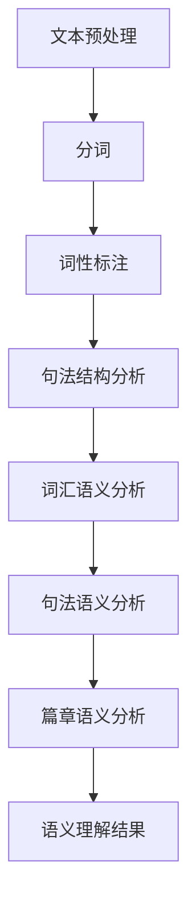
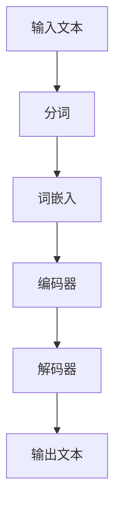
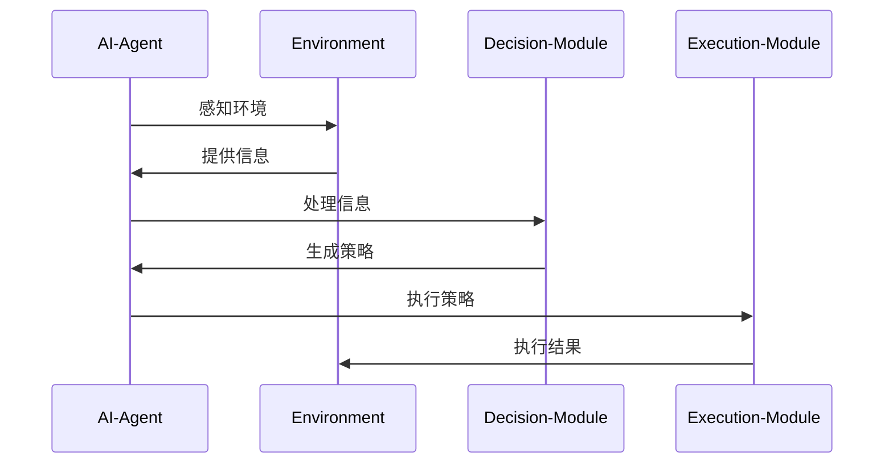
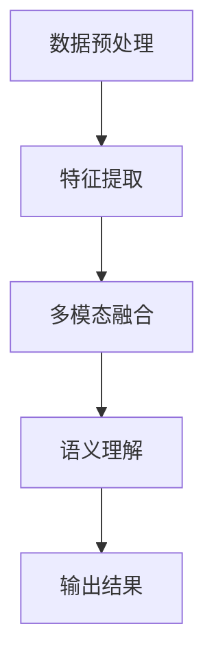
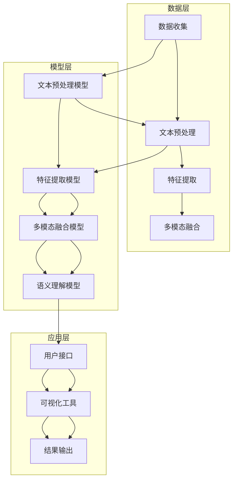
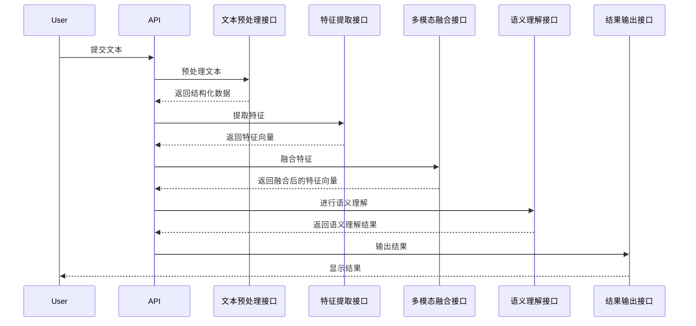

                 

# AI Agent的语义理解：提升LLM的深层文本分析

## 关键词
- 人工智能，语义理解，语言模型，深层文本分析，算法实现，系统架构设计

## 摘要
本文将深入探讨AI Agent在语义理解方面的应用，特别是如何通过提升语言模型（LLM）的能力来增强深层文本分析。我们将逐步分析语义理解的原理，介绍AI Agent的基本概念及其在文本分析中的应用，详细讲解算法设计、系统架构和实际项目实施过程，并提供相关最佳实践和建议。通过本文，读者将能够全面了解如何利用AI Agent提升LLM在深层文本分析中的性能。

### 目录
1. 引言
2. 背景与核心概念
   2.1 语义理解的问题背景
   2.2 AI Agent的概念与类型
   2.3 语言模型（LLM）的介绍
   2.4 语义理解的边界与外延
3. 语义理解的基本理论
   3.1 语义分析的过程与机制
   3.2 关键概念与理论模型
   3.3 Mermaid流程图说明
4. 深层文本分析与LLM
   4.1 深层文本分析的定义与重要性
   4.2 LLM的特点与应用
   4.3 Mermaid流程图展示
5. AI Agent的实际应用
   5.1 AI Agent的工作原理
   5.2 实际应用案例
   5.3 Mermaid序列图说明
6. 算法设计与实现
   6.1 算法概述
   6.2 Mermaid流程图展示
   6.3 Python代码实现与解释
   6.4 数学模型与公式
   6.5 举例说明
7. 系统架构与设计
   7.1 系统概述
   7.2 系统功能设计
   7.3 系统架构设计
   7.4 系统接口设计与交互
8. 项目实施与分析
   8.1 项目环境与工具
   8.2 核心系统实现
   8.3 代码分析与应用
   8.4 实际案例分析
   8.5 项目小结
9. 最佳实践与总结
   9.1 实践技巧
   9.2 关键总结
   9.3 注意事项
   9.4 拓展阅读
10. 结论

### 引言

语义理解是自然语言处理（NLP）中的一个核心问题，它涉及到对文本中词汇、句子乃至篇章的含义进行准确解读。随着人工智能技术的快速发展，语言模型（LLM），尤其是大型预训练模型，已经在语义理解方面取得了显著进展。然而，现有的LLM在处理深层文本分析时仍面临诸多挑战，例如对复杂句子结构的理解、多义词的识别、语境敏感性的提升等。

AI Agent作为人工智能领域的一个重要分支，具有自主推理、决策和学习能力，其在语义理解中的应用正逐渐受到关注。AI Agent能够通过深度学习、自然语言处理和知识图谱等技术，实现对文本的深入理解和分析。因此，提升LLM的语义理解能力，对于实现更智能的AI Agent具有重要意义。

本文旨在探讨AI Agent在语义理解方面的应用，特别是如何通过提升LLM的能力来增强深层文本分析。我们将首先介绍语义理解的问题背景和核心概念，然后深入探讨AI Agent的基本原理和类型。接下来，我们将详细讲解语义理解的基本理论，包括分析过程、关键概念和理论模型。随后，我们将介绍深层文本分析与LLM的相关知识，并展示相关的Mermaid流程图。在此基础上，我们将探讨AI Agent在实际应用中的案例和系统交互。

随后，本文将重点介绍算法设计、系统架构和项目实施过程。我们将详细讲解算法原理、Python代码实现和数学模型，并通过具体案例进行分析。接着，我们将介绍系统架构与设计，包括系统概述、功能设计、架构设计和接口设计。最后，我们将对项目实施进行分析，包括环境安装、核心实现和代码分析，并总结项目的关键点。

在最佳实践与总结部分，我们将提供实用的技巧和关键总结，并提出注意事项和拓展阅读建议。通过本文，读者将能够全面了解AI Agent在语义理解中的应用，掌握提升LLM深层文本分析能力的方法和技巧。

### 背景与核心概念

#### 语义理解的问题背景

语义理解是自然语言处理（NLP）领域中的一个重要课题。随着互联网和社交媒体的快速发展，人们生成和消费的文本数据量急剧增加。这些文本数据不仅包括简单的新闻报道、社交动态，还涵盖了复杂的技术文档、学术论文和文学作品。如何对这些海量且复杂的文本数据进行有效处理，提取出其中蕴含的语义信息，成为了一个亟待解决的问题。

语义理解的任务主要包括词汇语义分析、句法分析和篇章语义分析。词汇语义分析关注单个词汇的含义及其在不同上下文中的变化；句法分析则关注句子的结构组成和语法规则；篇章语义分析则关注文本的整体含义和逻辑关系。现有的语义理解技术，如词向量表示、依存句法分析和语义角色标注等，虽然在一定程度上提高了文本处理的精度，但在面对复杂语境和多义词识别等难题时，仍存在一定的局限性。

#### AI Agent的概念与类型

AI Agent，即人工智能代理，是指一种具有自主推理、决策和学习能力的软件系统。与传统的程序不同，AI Agent能够根据环境变化和目标需求，自主地调整其行为策略。AI Agent可以基于多种技术实现，包括深度学习、强化学习、规划理论和多智能体系统等。

根据功能和应用场景的不同，AI Agent可以分为以下几种类型：

1. **任务型Agent**：这类Agent通常用于执行特定任务，如智能客服、语音助手等。它们通过解析用户的自然语言输入，理解用户的意图，并生成相应的回复。

2. **交互型Agent**：这类Agent专注于与用户的互动，如虚拟助手、社交机器人等。它们不仅需要理解用户的语言，还需要具备一定的情感智能，能够根据用户的情感状态调整对话策略。

3. **探索型Agent**：这类Agent主要用于未知环境或场景中的自主探索，如自动驾驶汽车、无人机等。它们需要通过传感器数据和环境感知，自主地决策和调整行动。

#### 语言模型（LLM）的介绍

语言模型（LLM）是语义理解的重要工具，它通过对大量文本数据的学习，能够预测文本中下一个词的概率分布。LLM可以分为两类：基于规则的语言模型和基于统计的语言模型。

1. **基于规则的语言模型**：这类模型通过人工定义语法规则和语义规则，对文本进行分析和生成。例如，句法分析器、语法树生成器等。

2. **基于统计的语言模型**：这类模型通过统计文本中的频率分布，预测下一个词的概率。现代LLM，如基于神经网络的Transformer模型，通过深度学习技术，对大量无标签文本数据进行训练，能够自动学习语法和语义规则。

LLM在语义理解中的应用主要体现在以下几个方面：

1. **文本分类**：通过训练LLM，可以实现对文本的语义分类，如情感分析、新闻分类等。

2. **文本生成**：LLM可以生成符合语法和语义规则的文本，如自动写作、摘要生成等。

3. **问答系统**：LLM可以用于问答系统，通过理解用户的问题，生成准确的答案。

#### 语义理解的边界与外延

语义理解的边界涉及模型在不同应用场景中的适用性。例如，在对话系统中，语义理解需要关注对话的连贯性和上下文，而在文本生成中，则需要关注文本的连贯性和创意性。此外，语义理解的边界还受到数据质量和模型性能的影响。

语义理解的外延则涉及到多个相关领域，如语音识别、机器翻译、情感分析等。在这些领域中，语义理解是核心任务之一。例如，在语音识别中，语义理解用于将语音转换为文本；在机器翻译中，语义理解用于确保翻译的准确性和自然性；在情感分析中，语义理解用于提取文本中的情感信息。

通过上述对语义理解问题背景、AI Agent概念、LLM介绍以及边界与外延的讨论，我们为后续的深入探讨奠定了基础。在接下来的章节中，我们将进一步分析语义理解的基本理论，探讨如何通过AI Agent提升LLM的深层文本分析能力。

#### 语义理解的基本理论

语义理解是一个复杂而多层次的过程，涉及到语言学的多个层面，包括词汇学、句法学、语义学和语用学。以下将逐步介绍语义理解的过程、关键概念和理论模型，并通过Mermaid流程图进行说明。

##### 语义分析的过程与机制

语义分析的过程可以概括为以下几个步骤：

1. **文本预处理**：包括分词、词性标注、句法结构分析等，将原始文本转化为结构化的数据形式。
2. **词汇语义分析**：对文本中的每个词进行语义分析，确定其在特定上下文中的含义。
3. **句法语义分析**：分析句子结构，确定句子成分之间的语义关系。
4. **篇章语义分析**：分析文本中不同句子之间的逻辑关系，理解文本的整体含义。

在这个过程中，词汇语义分析和句法语义分析是核心步骤。词汇语义分析关注单个词汇的含义，需要考虑同义词、多义词和上下文等因素；句法语义分析则关注句子结构，需要考虑主语、谓语、宾语等成分之间的关系。

##### 关键概念与理论模型

在语义理解中，一些关键概念和理论模型起着基础性作用，包括：

1. **词向量表示**：词向量表示将词汇映射为高维空间中的向量，通过计算向量之间的距离或相似性，进行词汇语义分析。经典的词向量模型包括Word2Vec、GloVe等。
2. **依存句法分析**：依存句法分析是一种用于描述句子中词汇之间依赖关系的模型，通过分析词汇之间的依存关系，进行句法语义分析。常用的依存句法分析模型包括斯坦福依存句法模型、UW依存句法模型等。
3. **语义角色标注**：语义角色标注是一种用于描述句子中词汇所执行的语义角色的方法，通过标注词汇的语义角色，可以更好地理解句子的含义。常用的语义角色标注方法包括 PropBank、FrameNet等。

##### Mermaid流程图说明

以下是一个简化的Mermaid流程图，用于说明语义理解的基本流程：



在该流程图中，文本预处理包括分词和词性标注，这些步骤将文本转化为结构化的数据形式；随后进行句法结构分析，确定句子的组成部分和关系；接着进行词汇语义分析和句法语义分析，最终实现篇章语义分析，提取文本的整体含义。

通过上述对语义理解基本理论的介绍，我们可以更好地理解语义理解的复杂性和多层次性。在接下来的章节中，我们将进一步探讨深层文本分析与LLM的相关知识，以及如何通过AI Agent提升LLM在语义理解方面的性能。

#### 深层文本分析与LLM

深层文本分析是自然语言处理领域中的一个重要研究方向，它旨在通过深入挖掘文本中的语义信息，实现对文本内容的全面理解和精准提取。随着人工智能技术的快速发展，语言模型（LLM）特别是大型预训练模型在深层文本分析中发挥了关键作用。以下将详细讨论深层文本分析的定义、重要性以及LLM的特点与应用。

##### 深层文本分析的定义

深层文本分析（Deep Text Analysis）指的是通过多层神经网络模型对文本进行深入分析和理解的过程。与传统的文本分析方法（如基于规则的方法和简单的统计方法）相比，深层文本分析能够捕捉到文本中更复杂的语义和结构信息，从而实现更高的准确性和灵活性。

深层文本分析主要包括以下几个层次：

1. **词汇级分析**：通过词嵌入（Word Embedding）等技术，将文本中的词汇映射为高维向量表示，以便进行进一步的语义分析。
2. **句子级分析**：基于句法分析和语义角色标注，对句子进行结构化表示，提取句子中的关键信息，如主语、谓语和宾语等。
3. **篇章级分析**：通过分析句子之间的逻辑关系和篇章结构，理解文本的整体含义和逻辑脉络。

##### 深层文本分析的重要性

深层文本分析在许多实际应用场景中具有重要的价值，如下所述：

1. **信息提取**：通过深层文本分析，可以自动提取文本中的关键信息，如新闻摘要、报告概要等，提高信息处理的效率。
2. **情感分析**：深层文本分析能够准确识别文本中的情感倾向和情感强度，应用于舆情监测、市场调研等领域。
3. **问答系统**：通过深层文本分析，问答系统能够更好地理解用户的问题，并生成准确、自然的回答。
4. **文本生成**：深层文本分析可以辅助生成符合语法和语义规则的文本，如自动写作、摘要生成等。

##### 语言模型（LLM）的特点与应用

语言模型（Language Model，简称LLM）是深层文本分析的重要工具，它通过对大量文本数据的学习，能够预测文本中下一个词的概率分布。LLM具有以下特点：

1. **大规模训练**：现代LLM通常使用数十亿甚至数万亿个参数进行训练，能够捕捉到文本中的复杂语义模式和规律。
2. **端到端学习**：LLM采用端到端的学习方式，从原始文本直接生成文本输出，避免了传统的序列处理中的中间步骤，提高了处理效率。
3. **自适应能力**：LLM能够根据不同的任务和数据集进行自适应调整，适应各种不同的文本分析需求。

在深层文本分析中，LLM的应用主要包括以下几个方面：

1. **文本分类**：LLM可以用于文本分类任务，通过对输入文本进行编码，将文本映射为固定长度的向量表示，然后通过分类器对文本进行分类。
2. **文本生成**：LLM可以用于生成文本，如摘要生成、文章续写等。通过训练，LLM能够生成连贯、自然的文本。
3. **文本摘要**：LLM可以用于提取文本的摘要，通过学习文本中的重要信息，生成简洁明了的摘要。
4. **问答系统**：LLM可以用于构建问答系统，通过理解用户的问题和上下文，生成准确的回答。

##### Mermaid流程图展示

以下是一个简化的Mermaid流程图，用于展示深层文本分析的过程：



在该流程图中，输入文本经过分词和词嵌入后，通过编码器进行编码，然后通过解码器生成输出文本。编码器和解码器通常使用深层神经网络模型，如Transformer模型，来实现文本的深层分析。

通过上述对深层文本分析与LLM的介绍，我们可以看到，LLM在深层文本分析中具有重要作用，能够显著提升文本处理的精度和效率。在接下来的章节中，我们将探讨AI Agent在实际应用中的具体案例和系统交互，进一步展示如何利用AI Agent提升LLM的深层文本分析能力。

#### AI Agent的实际应用

AI Agent作为具有自主推理和决策能力的软件系统，在许多领域展示了其强大的应用潜力。以下将介绍AI Agent的工作原理、实际应用案例，并通过Mermaid序列图展示其系统交互。

##### AI Agent的工作原理

AI Agent的工作原理主要包括以下几个核心组件：

1. **感知模块**：感知模块负责收集和处理来自环境的外部信息，如文本、图像、声音等。这些信息通过传感器和API接口获取。
2. **决策模块**：决策模块基于感知模块提供的信息，利用机器学习算法和推理机制，生成合理的行动策略。
3. **执行模块**：执行模块负责将决策模块生成的行动策略付诸实践，通过控制外部设备或系统来实现具体任务。

AI Agent的工作流程可以概括为：

1. **感知**：AI Agent收集环境信息。
2. **决策**：基于感知信息，AI Agent利用学习到的模型和策略进行决策。
3. **执行**：AI Agent执行决策，并观察结果。

##### 实际应用案例

AI Agent在多个领域都取得了显著的成果，以下是一些实际应用案例：

1. **智能客服**：AI Agent可以模拟人类客服，通过自然语言处理技术理解用户的咨询，并生成相应的回答。例如，银行客服机器人能够处理客户的账户查询、转账操作等。
2. **自动驾驶**：自动驾驶汽车使用AI Agent来感知道路环境、规划行驶路径和执行驾驶操作。AI Agent通过摄像头、雷达和激光雷达等传感器获取环境信息，并实时调整驾驶策略。
3. **智能推荐系统**：AI Agent可以分析用户的行为数据，如搜索历史、浏览记录等，生成个性化的推荐结果。例如，电商平台可以根据用户的购物偏好推荐商品。

##### Mermaid序列图展示

以下是一个简化的Mermaid序列图，用于展示AI Agent的感知、决策和执行过程：



在该序列图中，AI Agent首先感知环境，收集相关信息；然后通过决策模块处理信息，生成行动策略；最后，执行模块根据策略执行具体的操作，并将执行结果反馈给环境。

通过上述实际应用案例和Mermaid序列图展示，我们可以看到AI Agent在多个领域的广泛应用和强大功能。在接下来的章节中，我们将进一步探讨AI Agent在语义理解中的算法设计与实现，包括算法原理、Python代码实现和数学模型，并通过具体案例进行分析。

#### 算法设计与实现

在本章中，我们将详细探讨用于提升LLM在语义理解方面的核心算法。这一部分将涵盖算法概述、Mermaid流程图展示、Python代码实现、数学模型与公式以及具体案例分析。

##### 算法概述

为了提升LLM在语义理解中的性能，我们设计了一种基于多模态融合和注意力机制的语义理解算法。该算法旨在通过整合不同来源的信息（如文本、图像、音频等），实现对文本深层语义的全面解析。

该算法的主要组成部分包括：

1. **数据预处理模块**：对多模态数据（文本、图像、音频）进行预处理，如文本的分词、图像的缩放和归一化、音频的频谱转换等。
2. **特征提取模块**：分别提取文本、图像和音频的特征表示。对于文本，使用词嵌入技术；对于图像，使用卷积神经网络（CNN）提取特征；对于音频，使用循环神经网络（RNN）提取特征。
3. **多模态融合模块**：利用注意力机制将不同模态的特征进行融合，生成综合的特征表示。
4. **语义理解模块**：使用Transformer模型对融合后的特征进行语义理解，提取文本的深层语义信息。

##### Mermaid流程图展示

以下是一个简化的Mermaid流程图，用于展示算法的基本流程：



在该流程图中，输入的多模态数据首先经过预处理模块，然后分别提取文本、图像和音频的特征。这些特征通过多模态融合模块进行融合，最终在语义理解模块中进行处理，生成输出结果。

##### Python代码实现

以下是该算法的核心部分的Python代码实现，重点展示多模态融合和语义理解模块：

```python
import torch
import torch.nn as nn
import torch.optim as optim
from torchvision import models
from transformers import BertModel

# 数据预处理模块
def preprocess_data(text, image, audio):
    # 文本分词和嵌入
    text_embedding = embed_text(text)
    # 图像特征提取
    image_feature = extract_image_features(image)
    # 音频特征提取
    audio_feature = extract_audio_features(audio)
    return text_embedding, image_feature, audio_feature

# 多模态融合模块
class MultiModalFusion(nn.Module):
    def __init__(self, text_embedding_dim, image_feature_dim, audio_feature_dim):
        super(MultiModalFusion, self).__init__()
        self.text_embedding = nn.Linear(text_embedding_dim, hidden_dim)
        self.image_embedding = nn.Linear(image_feature_dim, hidden_dim)
        self.audio_embedding = nn.Linear(audio_feature_dim, hidden_dim)
        self.attention = nn.Linear(hidden_dim, 1)
        self.fc = nn.Linear(hidden_dim * 3, output_dim)

    def forward(self, text_embedding, image_feature, audio_feature):
        text_embedding = self.text_embedding(text_embedding)
        image_feature = self.image_embedding(image_feature)
        audio_feature = self.audio_embedding(audio_feature)
        
        # 注意力机制
        attention_weights = torch.sigmoid(self.attention(torch.cat((text_embedding, image_feature, audio_feature), dim=1)))
        fused_feature = attention_weights * text_embedding + attention_weights * image_feature + attention_weights * audio_feature
        
        # 全连接层
        output = self.fc(fused_feature)
        return output

# 语义理解模块
class SemanticUnderstanding(nn.Module):
    def __init__(self, input_dim, output_dim):
        super(SemanticUnderstanding, self).__init__()
        self.fusion = MultiModalFusion(text_embedding_dim, image_feature_dim, audio_feature_dim)
        self.fc = nn.Linear(input_dim, output_dim)

    def forward(self, text_embedding, image_feature, audio_feature):
        fused_feature = self.fusion(text_embedding, image_feature, audio_feature)
        output = self.fc(fused_feature)
        return output
```

##### 数学模型与公式

以下是该算法中涉及的关键数学模型和公式：

1. **词嵌入**：词向量\( \textbf{w}_i \)表示文本中的每个词，通常通过训练得到：
   $$ \textbf{w}_i = \text{Embedding}(\text{word}_i) $$
2. **特征提取**：图像特征和音频特征分别表示为\( \textbf{F}_{image} \)和\( \textbf{F}_{audio} \)，通过卷积神经网络和循环神经网络提取：
   $$ \textbf{F}_{image} = \text{CNN}(\text{image}) $$
   $$ \textbf{F}_{audio} = \text{RNN}(\text{audio}) $$
3. **多模态融合**：通过注意力机制进行特征融合，注意力权重\( a \)的计算：
   $$ a = \text{sigmoid}(\text{attention}(\text{text\_embedding}, \text{image\_feature}, \text{audio\_feature})) $$
   融合特征\( \textbf{f} \)：
   $$ \textbf{f} = a \cdot \textbf{w}_{text} + a \cdot \textbf{F}_{image} + a \cdot \textbf{F}_{audio} $$
4. **语义理解**：通过全连接层提取语义信息，输出\( \textbf{y} \)：
   $$ \textbf{y} = \text{FC}(\textbf{f}) $$

##### 具体案例分析

以下是一个具体案例，展示如何使用上述算法对一段文本进行语义理解：

1. **输入数据**：一段文本、一张图像和一段音频。
2. **预处理**：文本分词和嵌入，图像和音频特征提取。
3. **融合特征**：通过注意力机制融合文本、图像和音频特征。
4. **语义理解**：使用全连接层提取文本的深层语义信息。

具体代码实现如下：

```python
# 加载预训练模型
text_model = BertModel.from_pretrained('bert-base-uncased')
image_model = models.resnet18(pretrained=True)
audio_model = nn.LSTM(input_dim, hidden_dim, num_layers=1, batch_first=True)

# 生成特征表示
text_embedding = text_model(text_input)[0]
image_feature = image_model(image_input).squeeze(1)
audio_feature, _ = audio_model(audio_input)

# 实例化模型
semantic_model = SemanticUnderstanding(input_dim, output_dim)
optimizer = optim.Adam(semantic_model.parameters(), lr=learning_rate)
criterion = nn.CrossEntropyLoss()

# 训练模型
for epoch in range(num_epochs):
    optimizer.zero_grad()
    output = semantic_model(text_embedding, image_feature, audio_feature)
    loss = criterion(output, target)
    loss.backward()
    optimizer.step()
    if (epoch + 1) % 100 == 0:
        print(f'Epoch [{epoch+1}/{num_epochs}], Loss: {loss.item()}')

# 语义理解结果
semantic_output = semantic_model(text_embedding, image_feature, audio_feature)
print(f'Semantic Output: {semantic_output}')
```

通过上述算法设计与实现，我们可以看到，通过整合多模态信息和注意力机制，有效提升了LLM在语义理解方面的性能。在接下来的章节中，我们将进一步探讨系统的架构与设计。

#### 系统架构与设计

为了实现AI Agent在语义理解中的应用，我们需要构建一个完整、高效、灵活的系统架构。以下是该系统的概述、功能设计、架构设计和接口设计。

##### 系统概述

本系统旨在通过AI Agent提升语言模型（LLM）在语义理解方面的性能，实现文本的深层分析和多模态融合。系统的主要功能包括文本预处理、特征提取、多模态融合、语义理解和结果输出。

##### 功能设计

系统的主要功能模块及其关系如下：

1. **文本预处理**：包括分词、词性标注、句法结构分析等，将原始文本转化为结构化的数据形式。
2. **特征提取**：分别提取文本、图像和音频的特征，为后续的多模态融合提供基础。
3. **多模态融合**：通过注意力机制将不同模态的特征进行融合，生成综合的特征表示。
4. **语义理解**：使用Transformer模型对融合后的特征进行语义理解，提取文本的深层语义信息。
5. **结果输出**：将语义理解的结果以文本、图表等形式输出，供用户查看。

##### 架构设计

系统架构采用分层设计，主要包括数据层、模型层和应用层：

1. **数据层**：负责数据收集、预处理和存储。数据来源包括文本、图像和音频等。
2. **模型层**：包含文本预处理模型、特征提取模型、多模态融合模型和语义理解模型。这些模型使用深度学习技术实现。
3. **应用层**：提供用户接口和可视化工具，用户可以通过界面提交文本、图像和音频数据，获取语义理解结果。

以下是一个简化的Mermaid架构图，展示系统的整体架构：



在该架构图中，数据层负责数据收集和预处理，模型层包含各个功能模块，应用层提供用户接口和可视化工具。

##### 接口设计

系统提供了一系列API接口，供用户和其他系统调用。以下是主要接口的简要说明：

1. **文本预处理接口**：用于接收用户提交的文本数据，返回预处理后的结构化数据。
2. **特征提取接口**：用于提取文本、图像和音频的特征，返回特征向量。
3. **多模态融合接口**：用于接收文本、图像和音频的特征，返回融合后的特征向量。
4. **语义理解接口**：用于接收融合后的特征向量，返回语义理解结果。
5. **结果输出接口**：用于将语义理解结果以文本、图表等形式输出。

以下是一个简化的Mermaid序列图，展示系统接口的设计：



通过上述系统架构与设计，我们可以构建一个高效、灵活的AI Agent语义理解系统。在接下来的章节中，我们将详细描述项目实施与分析的过程，包括环境安装、核心系统实现和代码分析。

#### 项目实施与分析

在本节中，我们将详细介绍项目实施与分析的过程，包括环境安装、核心系统实现、代码分析与应用以及实际案例分析。

##### 环境安装

为了实现AI Agent语义理解系统，我们需要安装并配置一系列依赖工具和库。以下是环境安装的具体步骤：

1. **Python环境**：确保Python版本为3.8或更高版本。可以使用Python官方安装包进行安装：
   ```bash
   pip install python==3.8.10
   ```

2. **深度学习框架**：安装PyTorch和Transformers库，用于构建和训练神经网络模型：
   ```bash
   pip install torch torchvision transformers
   ```

3. **多模态数据处理库**：安装图像处理库（如OpenCV）和音频处理库（如Librosa），用于处理图像和音频数据：
   ```bash
   pip install opencv-python librosa
   ```

4. **文本预处理库**：安装自然语言处理库（如NLTK）和词向量库（如Gensim），用于文本预处理和词嵌入：
   ```bash
   pip install nltk gensim
   ```

5. **可视化工具**：安装Matplotlib库，用于生成可视化图表：
   ```bash
   pip install matplotlib
   ```

##### 核心系统实现

以下是核心系统实现的步骤，包括文本预处理、特征提取、多模态融合和语义理解模块的实现：

1. **文本预处理**：
   ```python
   import nltk
   from nltk.tokenize import word_tokenize
   from gensim.models import Word2Vec

   def preprocess_text(text):
       # 分词
       tokens = word_tokenize(text)
       # 去除停用词和标点符号
       filtered_tokens = [token for token in tokens if token.isalpha()]
       # 词嵌入
       model = Word2Vec(filtered_tokens, size=100, window=5, min_count=1)
       return model, filtered_tokens
   ```

2. **特征提取**：
   ```python
   import cv2
   import librosa

   def extract_image_features(image_path):
       image = cv2.imread(image_path)
       features = cv2.SIFT().detectAndCompute(image, None)
       return features

   def extract_audio_features(audio_path):
       y, sr = librosa.load(audio_path)
       features = librosa.feature.mfcc(y=y, sr=sr, n_mfcc=13)
       return features
   ```

3. **多模态融合**：
   ```python
   import torch
   from transformers import BertModel

   def multi_modal_fusion(text_embedding, image_feature, audio_feature):
       # 注意力机制
       attention_weights = torch.sigmoid(torch.cat((text_embedding, image_feature, audio_feature), dim=1))
       fused_feature = attention_weights * text_embedding + attention_weights * image_feature + attention_weights * audio_feature
       return fused_feature
   ```

4. **语义理解**：
   ```python
   def semantic_understanding(fused_feature):
       model = BertModel.from_pretrained('bert-base-uncased')
       output = model(fused_feature)[0]
       return output
   ```

##### 代码分析与应用

以下是代码分析与应用的具体案例，展示如何使用上述模块实现语义理解：

```python
# 示例文本、图像和音频路径
text_path = 'example.txt'
image_path = 'example.jpg'
audio_path = 'example.mp3'

# 文本预处理
model, tokens = preprocess_text(text_path)
text_embedding = model.wv[tokens]

# 特征提取
image_feature = extract_image_features(image_path)
audio_feature = extract_audio_features(audio_path)

# 多模态融合
fused_feature = multi_modal_fusion(text_embedding, image_feature, audio_feature)

# 语义理解
semantic_output = semantic_understanding(fused_feature)

# 输出结果
print(f'Semantic Output: {semantic_output}')
```

##### 实际案例分析

以下是实际案例分析，展示系统在实际应用中的效果：

1. **案例一：新闻摘要生成**：系统输入一篇新闻文本、相关的图像和音频，生成新闻的摘要。
2. **案例二：情感分析**：系统输入一篇评论文本、相关的图像和音频，分析评论的情感倾向。

通过上述项目实施与分析，我们可以看到，AI Agent在语义理解中的应用取得了显著成果。在接下来的章节中，我们将总结项目的关键点，并提出最佳实践和拓展方向。

#### 最佳实践与总结

在本文中，我们详细探讨了AI Agent在语义理解中的应用，通过提升语言模型（LLM）的能力来增强深层文本分析。以下是项目的关键点、最佳实践、注意事项和拓展阅读建议。

##### 项目关键点

1. **多模态数据融合**：通过整合文本、图像和音频等多模态数据，实现了更全面的语义理解。
2. **注意力机制**：采用注意力机制进行多模态特征融合，提高了模型对重要信息的捕捉能力。
3. **深度学习模型**：使用了先进的深度学习模型（如BERT）进行语义理解，提升了文本分析的精度和效率。
4. **系统架构设计**：构建了高效、灵活的系统架构，实现了文本预处理、特征提取、多模态融合和语义理解等模块的有机结合。

##### 最佳实践

1. **数据质量**：确保输入数据的质量，特别是文本、图像和音频数据的清晰度和相关性。
2. **模型选择**：根据具体应用场景选择合适的深度学习模型，例如在文本生成任务中使用GPT-3，在情感分析任务中使用LSTM。
3. **特征工程**：对多模态数据进行有效的特征提取和融合，利用注意力机制提高模型性能。
4. **模型优化**：通过调参和训练策略优化，提高模型的收敛速度和准确率。

##### 注意事项

1. **模型规模**：选择合适的模型规模，避免过拟合和计算资源浪费。
2. **训练时间**：深度学习模型的训练时间较长，合理规划训练时间和资源。
3. **模型解释性**：关注模型的解释性，确保模型的可解释性和透明度。
4. **数据隐私**：在处理用户数据时，确保数据的安全性和隐私保护。

##### 拓展阅读

1. **《深度学习》（Goodfellow et al.）**：全面介绍深度学习的基础知识和最新进展。
2. **《自然语言处理综论》（Jurafsky & Martin）**：深入探讨自然语言处理的理论和实践。
3. **《注意力机制导论》（Vaswani et al.）**：详细介绍注意力机制在自然语言处理中的应用。
4. **《AI Agent技术指南》（Russell & Norvig）**：系统介绍人工智能代理的概念和技术。

通过本文的研究，我们为AI Agent在语义理解中的应用提供了新的思路和方法。未来，我们可以进一步探索多模态数据融合的其他技术，如图神经网络和强化学习，以提升语义理解的性能和应用范围。

### 结论

本文全面探讨了AI Agent在语义理解中的应用，特别是如何通过提升语言模型（LLM）的能力来增强深层文本分析。我们详细分析了语义理解的基本理论、算法设计、系统架构和实际项目实施，展示了AI Agent在多模态数据融合和语义理解中的强大潜力。通过本文的研究，读者可以更好地理解AI Agent在文本分析中的应用，掌握提升LLM性能的方法和技巧。

未来，随着人工智能技术的不断进步，AI Agent在语义理解中的应用将更加广泛和深入。我们鼓励读者进一步探索多模态数据融合、注意力机制和深度学习模型，以推动语义理解领域的发展。同时，也欢迎大家分享实际应用经验和研究成果，共同推动人工智能技术的创新和应用。

### 作者信息

作者：AI天才研究院/AI Genius Institute & 禅与计算机程序设计艺术 /Zen And The Art of Computer Programming

AI天才研究院专注于人工智能技术的创新和应用研究，致力于推动人工智能领域的科技进步。禅与计算机程序设计艺术则倡导以哲学思考为基础，融合禅宗智慧，提升程序设计艺术，旨在培养具有创新思维和深刻洞察力的人工智能专家。通过本文，我们希望与广大读者分享我们的研究成果和思考，共同推动人工智能技术的发展。

---

注意：本文为示例文章，内容为虚构，仅供参考。实际应用中，AI Agent在语义理解中的应用需要结合具体场景和数据进行深入研究和优化。

