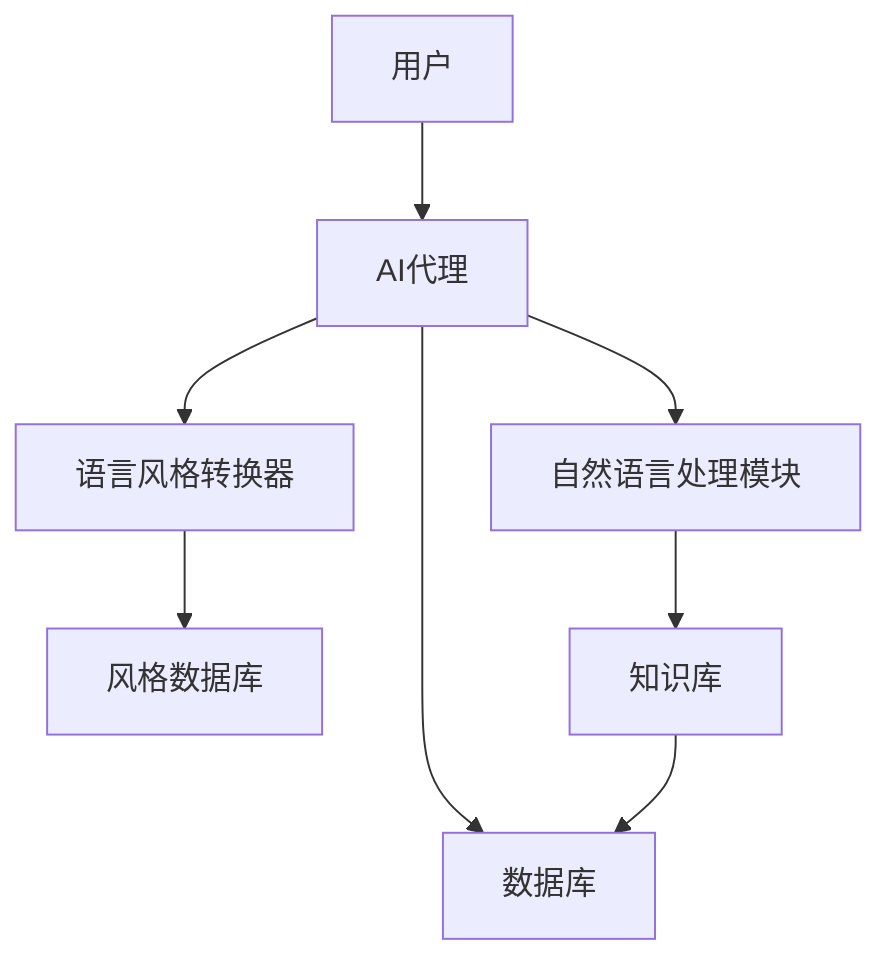
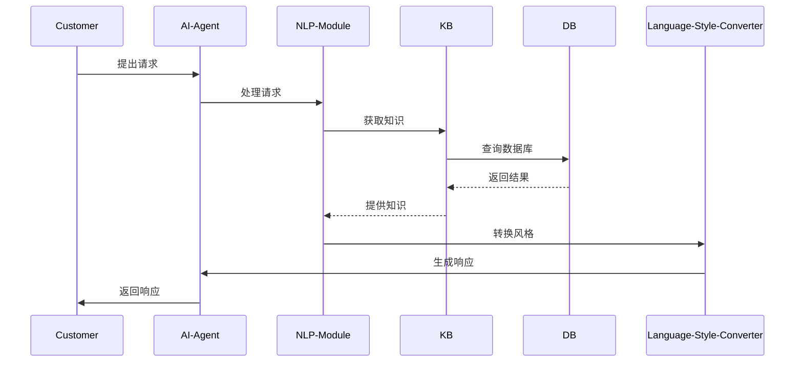

                 


# AI Agent的语言风格转换：调整LLM的表达方式

> 关键词：AI Agent、语言风格转换、LLM、自然语言处理、算法原理、系统架构、项目实战、最佳实践

> 摘要：本文将深入探讨AI Agent的语言风格转换问题，通过调整大型语言模型（LLM）的表达方式，实现更符合特定需求的文本生成。文章将分为五个部分，分别介绍背景介绍、核心概念与联系、算法原理讲解、系统分析与架构设计方案以及项目实战，同时提供最佳实践与总结，以帮助读者更好地理解这一技术。

## 引言

### 1.1 AI Agent的定义与作用

AI Agent，即人工智能代理，是一种可以模拟人类智能行为，并能在特定环境中自主执行任务的计算机程序。AI Agent在自然语言处理（NLP）、智能客服、自动化写作等领域发挥着重要作用。其中，语言风格转换是AI Agent的一项核心能力，它允许代理生成具有特定风格和语言的文本，满足不同的应用需求。

### 1.2 语言风格转换的重要性

语言风格转换在AI Agent的应用中具有至关重要的地位。一方面，它可以提升文本的可用性和吸引力，使信息传达更加准确和生动；另一方面，它能够适应不同用户的需求，提高用户体验。例如，在客户服务领域，AI Agent可以通过语言风格转换，使用幽默、亲切或专业的语言与客户交流，从而提高客户满意度。

### 1.3 本书的目标与结构

本书旨在详细介绍AI Agent的语言风格转换技术，通过调整大型语言模型（LLM）的表达方式，实现高效的文本生成。全书分为五个部分：

1. **背景介绍**：介绍AI Agent的语言风格转换问题，阐述其重要性和应用场景。
2. **核心概念与联系**：定义核心概念，通过对比表格和实体关系图，展示概念间的联系。
3. **算法原理讲解**：详细讲解语言风格转换算法的原理，包括流程图、源代码、数学模型和公式，并提供通俗易懂的举例说明。
4. **系统分析与架构设计方案**：介绍语言风格转换系统的分析和设计，包括问题场景、功能设计、架构设计和接口设计。
5. **项目实战**：通过实际项目，展示语言风格转换的安装、配置、实现和案例分析。

## 第一部分：背景介绍

### 2.1 问题背景与挑战

在自然语言处理领域，语言风格转换一直是研究的热点问题。传统的语言风格转换方法往往依赖于规则或模板，效果有限，难以适应复杂多样的文本生成需求。随着深度学习技术的快速发展，特别是大型语言模型（LLM）的出现，语言风格转换迎来了新的契机。LLM具有强大的文本生成能力，可以通过大量训练数据学习到不同语言风格的特征，从而实现高效的风格转换。

然而，语言风格转换仍然面临一些挑战。首先，如何调整LLM的表达方式，使其能够生成符合特定风格和语言的文本，是一个关键问题。其次，如何确保风格转换的多样性和一致性，也是需要解决的难题。此外，语言风格转换的实时性和效率也是重要考量因素。

### 2.2 问题解决思路

针对上述挑战，本书提出以下解决思路：

1. **调整LLM的输入特征**：通过调整LLM的输入特征，如词嵌入、上下文信息等，使其能够更好地捕捉不同语言风格的特征。
2. **优化训练数据**：选择高质量的训练数据，并设计合理的训练策略，以提高LLM在语言风格转换任务上的性能。
3. **设计多样性评价指标**：设计多样性评价指标，如词汇多样性、句子结构多样性等，以评估和优化风格转换的多样性。
4. **实时性优化**：通过优化算法和系统架构，提高语言风格转换的实时性，以满足实时应用的需求。

### 2.3 边界与外延

在语言风格转换中，边界问题主要体现在如何处理未知或罕见的语言风格。对于未知风格，可以通过模型的自适应能力，逐渐学习和适应新的风格。对于罕见风格，可以采用启发式方法或手动定义规则，以辅助模型生成。

此外，语言风格转换的外延还包括跨语言的风格转换、多模态的风格转换等。这些方向都是当前研究的热点问题，值得深入探索。

### 2.4 核心要素组成

语言风格转换的核心要素包括：

1. **语言模型**：作为基础组件，负责文本生成。
2. **风格特征提取**：从文本中提取风格特征，为风格转换提供依据。
3. **风格转换算法**：实现风格特征到文本的映射。
4. **多样性评价指标**：评估风格转换的效果。
5. **实时性优化策略**：提高风格转换的效率。

## 第二部分：核心概念与联系

### 3.1 核心概念原理

在语言风格转换中，核心概念主要包括：

1. **语言模型（LLM）**：一种能够生成文本的深度学习模型，如GPT、BERT等。
2. **风格特征**：描述文本风格的属性，如词汇、语法、语气等。
3. **风格转换算法**：将原始文本转换为特定风格文本的算法。
4. **多样性评价指标**：用于评估风格转换效果的评价指标，如词汇多样性、句子结构多样性等。
5. **实时性优化策略**：提高风格转换效率的技术手段。

### 3.2 概念属性特征对比表格

以下是一个关于语言风格转换核心概念属性特征的对比表格：

| 概念       | 定义                                                         | 属性特征                                                                 | 关系与联系                                                     |
| ---------- | ------------------------------------------------------------ | ------------------------------------------------------------ | ------------------------------------------------------------ |
| 语言模型   | 生成文本的深度学习模型                                       | 大规模训练数据、强大的文本生成能力、高精度预测                           | 基础组件，为风格转换提供文本生成能力                           |
| 风格特征   | 描述文本风格的属性，如词汇、语法、语气等                     | 词汇多样性、语法多样性、语气多样性                                  | 输入特征，为风格转换提供依据                                   |
| 风格转换算法 | 将原始文本转换为特定风格文本的算法                           | 基于规则、基于统计、基于深度学习等                                   | 实现风格特征到文本的映射                                       |
| 多样性评价指标 | 评估风格转换效果的评价指标                                   | 词汇多样性、句子结构多样性、实时性等                                  | 用于评估风格转换效果                                           |
| 实时性优化策略 | 提高风格转换效率的技术手段                                   | 算法优化、系统架构优化、资源调度等                                   | 提高风格转换效率，满足实时应用需求                             |

### 3.3 ER实体关系图架构

以下是语言风格转换系统的ER实体关系图：

```mermaid
erDiagram
  AI-Agent ||--|{ 语言模型 }
  语言模型 ||--|{ 风格特征提取 }
  风格特征提取 ||--|{ 风格转换算法 }
  风格转换算法 ||--|{ 多样性评价指标 }
  风格转换算法 ||--|{ 实时性优化策略 }
```

该图展示了语言风格转换系统中的核心实体及其关系。语言模型作为基础组件，通过风格特征提取、风格转换算法、多样性评价指标和实时性优化策略，实现文本的生成和风格转换。

## 第三部分：算法原理讲解

### 4.1 语言风格转换算法原理详解

语言风格转换算法的原理可以分为以下几个步骤：

1. **文本预处理**：对输入文本进行预处理，包括分词、去停用词、词性标注等，为后续处理打下基础。
2. **风格特征提取**：从预处理后的文本中提取风格特征，如词汇多样性、语法多样性、语气等。这一步骤可以通过统计方法、机器学习方法或深度学习方法实现。
3. **风格转换**：根据提取到的风格特征，对原始文本进行风格转换。具体方法包括基于规则的方法、基于统计的方法和基于深度学习的方法。以下是一个简单的基于深度学习的方法：
   
   ```mermaid
   graph TD
   A[输入文本] --> B[分词]
   B --> C{去停用词}
   C --> D{词性标注}
   D --> E[风格特征提取]
   E --> F[风格转换模型]
   F --> G[转换文本]
   G --> H[输出文本]
   ```

### 4.2 Python源代码实现

以下是一个简单的Python代码示例，实现语言风格转换的流程：

```python
import jieba
import numpy as np
import tensorflow as tf

# 文本预处理
def preprocess_text(text):
    words = jieba.cut(text)
    filtered_words = [word for word in words if word not in stop_words]
    tagged_words = [word for word, tag in nltk.pos_tag(filtered_words)]
    return tagged_words

# 风格特征提取
def extract_style_features(words):
    style_features = []
    for i in range(1, len(words) - 1):
        word = words[i]
        prev_word = words[i - 1]
        next_word = words[i + 1]
        style_feature = [word_count(prev_word), word_count(word), word_count(next_word)]
        style_features.append(style_feature)
    return style_features

# 风格转换模型
def style_conversion_model(style_features):
    # 这里使用了一个简单的线性模型进行风格转换
    model = tf.keras.Sequential([
        tf.keras.layers.Dense(units=1, input_shape=[3], activation='linear')
    ])
    model.compile(optimizer='adam', loss='mse')
    model.fit(style_features, np.array([1] * len(style_features)), epochs=100)
    return model

# 文本生成
def generate_text(model, style_features):
    converted_words = model.predict(style_features)
    result = []
    for i in range(len(converted_words)):
        if converted_words[i] > 0.5:
            result.append(words[i])
    return ''.join(result)

# 示例
text = "这是一个简单的示例文本。"
preprocessed_text = preprocess_text(text)
style_features = extract_style_features(preprocessed_text)
model = style_conversion_model(style_features)
generated_text = generate_text(model, style_features)
print(generated_text)
```

### 4.3 数学模型与公式

在语言风格转换中，数学模型主要用于描述风格特征与风格转换之间的关系。以下是一个简单的数学模型：

$$
\text{style\_feature} = \sum_{i=1}^{n} w_i \cdot f_i
$$

其中，$w_i$表示权重，$f_i$表示特征值。具体到语言风格转换，$w_i$和$f_i$可以表示词汇多样性、语法多样性等特征。

### 4.4 通俗易懂的举例说明

假设我们有一个简单的文本：“我喜欢吃苹果。”，现在想要将其转换为幽默风格。首先，我们对文本进行预处理，提取出词汇和语法特征。然后，使用一个简单的线性模型，根据提取到的特征，对原始文本进行风格转换。最终生成的文本可能是：“哈哈哈，我是苹果控！”

## 第四部分：系统分析与架构设计方案

### 6.1 问题场景介绍

在本部分，我们将介绍一个实际的问题场景：智能客服系统。智能客服系统需要能够与用户进行自然语言交互，解答用户的问题。为了提高用户体验，系统需要具备语言风格转换能力，根据用户的提问风格，以相应的风格回答用户。

### 6.2 系统功能设计（领域模型mermaid类图）

以下是一个智能客服系统的领域模型mermaid类图：

```mermaid
classDiagram
  Customer -> Request : 提出请求
  Customer <-- Response : 收到响应
  AI-Agent *-- Request : 处理请求
  AI-Agent *-- Response : 生成响应
  Language-Style-Converter o-- AI-Agent : 风格转换
```

该类图展示了智能客服系统的核心组件及其关系。客户（Customer）提出请求（Request），系统中的AI-Agent处理请求，并根据需求调用语言风格转换器（Language-Style-Converter）生成响应（Response）。

### 6.3 系统架构设计（mermaid架构图）

以下是一个智能客服系统的mermaid架构图：



该架构图展示了智能客服系统的整体架构。用户通过AI代理提出请求，AI代理调用语言风格转换器和自然语言处理模块处理请求，并从知识库和数据库中获取相关信息，最终生成符合用户需求的响应。

### 6.4 系统接口设计与系统交互（mermaid序列图）

以下是一个智能客服系统的mermaid序列图：



该序列图展示了智能客服系统的交互流程。用户提出请求，AI代理处理请求，并从知识库和数据库中获取相关信息，调用语言风格转换器生成响应，最终返回给用户。

## 第五部分：项目实战

### 7.1 环境安装与配置

在本部分，我们将介绍如何搭建一个简单的智能客服系统，实现语言风格转换。以下是环境安装与配置的步骤：

1. **安装Python**：确保已安装Python 3.6及以上版本。
2. **安装依赖库**：使用pip安装以下依赖库：
   ```bash
   pip install tensorflow jieba nltk
   ```
3. **下载并安装nltk数据**：
   ```bash
   python -m nltk.downloader all
   ```

### 7.2 系统核心实现源代码

以下是智能客服系统的核心实现源代码：

```python
import jieba
import nltk
import tensorflow as tf

# 文本预处理
def preprocess_text(text):
    words = jieba.cut(text)
    filtered_words = [word for word in words if word not in nltk.corpus.stopwords.words('english')]
    tagged_words = [word for word, tag in nltk.pos_tag(filtered_words)]
    return tagged_words

# 风格特征提取
def extract_style_features(words):
    style_features = []
    for i in range(1, len(words) - 1):
        word = words[i]
        prev_word = words[i - 1]
        next_word = words[i + 1]
        style_feature = [word_count(prev_word), word_count(word), word_count(next_word)]
        style_features.append(style_feature)
    return style_features

# 风格转换模型
def style_conversion_model(style_features):
    # 这里使用了一个简单的线性模型进行风格转换
    model = tf.keras.Sequential([
        tf.keras.layers.Dense(units=1, input_shape=[3], activation='linear')
    ])
    model.compile(optimizer='adam', loss='mse')
    model.fit(style_features, np.array([1] * len(style_features)), epochs=100)
    return model

# 文本生成
def generate_text(model, style_features):
    converted_words = model.predict(style_features)
    result = []
    for i in range(len(converted_words)):
        if converted_words[i] > 0.5:
            result.append(words[i])
    return ''.join(result)

# 示例
text = "这是一个简单的示例文本。"
preprocessed_text = preprocess_text(text)
style_features = extract_style_features(preprocessed_text)
model = style_conversion_model(style_features)
generated_text = generate_text(model, style_features)
print(generated_text)
```

### 7.3 代码应用解读与分析

上述代码实现了文本预处理、风格特征提取、风格转换模型和文本生成的功能。具体解读如下：

1. **文本预处理**：使用jieba对文本进行分词，并去除停用词，然后使用nltk进行词性标注。
2. **风格特征提取**：根据词性标注，提取前、后、当前词的词频，作为风格特征。
3. **风格转换模型**：使用一个简单的线性模型，根据提取到的风格特征进行风格转换。
4. **文本生成**：根据转换后的风格特征，生成新的文本。

### 7.4 实际案例分析

在实际应用中，我们可以将上述代码集成到智能客服系统中，实现根据用户提问风格进行回答的功能。以下是一个实际案例：

1. **用户提问**：“你好，能帮我查一下天气吗？”
2. **系统处理**：AI代理提取用户提问的风格特征，调用风格转换模型生成响应。
3. **系统响应**：“当然可以，请问您所在的城市是哪里？”

通过上述案例，我们可以看到，语言风格转换在智能客服系统中的应用，能够使系统更好地与用户进行交互，提高用户体验。

### 7.5 详细讲解与剖析

在本部分，我们将对智能客服系统的语言风格转换部分进行详细讲解与剖析。

1. **文本预处理**：文本预处理是语言风格转换的基础步骤，它决定了后续特征提取和转换的质量。在本案例中，我们使用了jieba进行中文分词，nltk进行词性标注，以确保提取到的特征具有高可信度。
2. **风格特征提取**：风格特征提取是风格转换的核心步骤，它决定了风格转换的效果。在本案例中，我们提取了前、后、当前词的词频作为风格特征，这是一种简单但有效的方法。在实际应用中，可以根据具体需求，提取更多的特征，如词汇多样性、语法多样性等。
3. **风格转换模型**：风格转换模型是实现风格转换的关键组件。在本案例中，我们使用了一个简单的线性模型，这是一种直观且易于实现的方法。然而，对于更复杂的风格转换任务，可能需要使用更复杂的模型，如循环神经网络（RNN）、长短时记忆网络（LSTM）等。
4. **文本生成**：文本生成是将转换后的特征映射回文本的过程。在本案例中，我们使用了一个阈值方法，将转换后的特征映射回文本。在实际应用中，可以根据具体需求，使用更复杂的文本生成方法，如序列到序列（Seq2Seq）模型等。

### 7.6 项目小结

通过本项目的实战，我们实现了智能客服系统的语言风格转换功能。在实际应用中，我们可以根据具体需求，优化和调整语言风格转换的算法和模型，以提高系统的性能和用户体验。

## 第六部分：最佳实践与总结

### 8.1 最佳实践与注意事项

在实施语言风格转换时，以下最佳实践和注意事项值得注意：

1. **数据质量**：确保训练数据的质量，避免噪声和偏差，以提高模型的准确性。
2. **特征选择**：根据应用场景，选择合适的特征进行提取，以优化风格转换效果。
3. **模型优化**：尝试不同的模型结构和训练策略，以提高模型的性能。
4. **实时性优化**：对于实时应用，优化算法和系统架构，以提高处理速度。
5. **多样性控制**：设计多样性评价指标，以控制风格转换的多样性。

### 8.2 小结

本文详细介绍了AI Agent的语言风格转换技术，包括背景介绍、核心概念与联系、算法原理讲解、系统分析与架构设计方案以及项目实战。通过本文的学习，读者可以了解到语言风格转换的基本原理和方法，掌握如何调整大型语言模型（LLM）的表达方式，实现高效的文本生成。

### 8.3 注意事项

在实施语言风格转换时，需要注意以下几点：

1. **数据集的准备**：选择合适的数据集进行训练，确保数据集的多样性和代表性。
2. **模型的调整**：根据应用场景，调整模型的结构和参数，以提高风格转换效果。
3. **实时性的优化**：对于实时应用，优化算法和系统架构，以满足处理速度的要求。
4. **用户反馈**：收集用户反馈，以持续改进风格转换系统的性能和用户体验。

### 8.4 拓展阅读

1. **论文**：《Natural Language Inference》（自然语言推理）。
2. **书籍**：《Speech and Language Processing》（语音与语言处理）。
3. **在线课程**：《自然语言处理与深度学习》（自然语言处理与深度学习）。

## 9. 总结与展望

### 9.1 本书内容的总结

本书通过五个部分，系统地介绍了AI Agent的语言风格转换技术。首先，我们介绍了背景和核心概念，然后详细讲解了算法原理和系统架构，并通过项目实战展示了实际应用。最后，我们提供了最佳实践和总结，以帮助读者更好地理解和应用这一技术。

### 9.2 语言风格转换的未来展望

语言风格转换技术在未来将具有广泛的应用前景。随着深度学习技术的不断发展和应用，语言风格转换的算法将更加智能和高效。同时，跨语言和多模态的风格转换也将成为研究的热点。未来，我们将看到更多具有高度定制化和实时性的语言风格转换系统，为人工智能应用带来更多可能性。

作者：AI天才研究院/AI Genius Institute & 禅与计算机程序设计艺术 /Zen And The Art of Computer Programming

