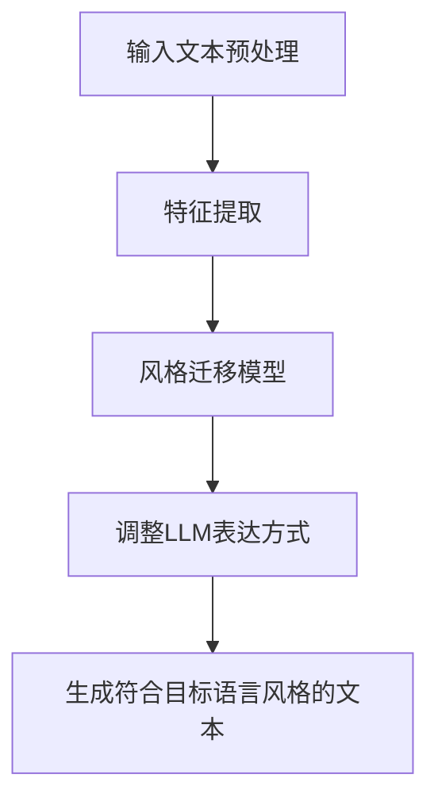
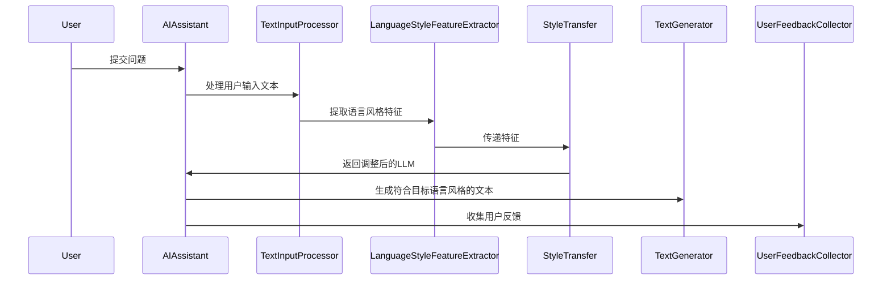

                 

# AI Agent的语言风格适配：动态调整LLM的表达方式

## 关键词
- AI Agent
- 语言风格适配
- 大型语言模型(LLM)
- 动态调整
- 表达方式
- 算法原理
- 数学模型
- 项目实战
- 系统分析与架构设计

## 摘要
本文将探讨AI Agent的语言风格适配问题，特别是如何通过动态调整大型语言模型（LLM）的表达方式来提高AI Agent的交互效果和任务执行能力。我们将详细分析语言风格适配的核心概念、算法原理、数学模型，并结合实际项目案例进行系统分析与架构设计，最终提出最佳实践和注意事项。

## 引言

在当今人工智能领域，AI Agent作为一种能够自主决策和执行任务的智能体，正逐渐成为各个行业的关键角色。然而，不同场景和用户对于AI Agent的语言风格有着不同的要求，如何让AI Agent适应这些多样化的语言风格，成为一个亟待解决的问题。

语言风格适配（Language Style Adaptation，简称LSA）正是为了解决这一问题而诞生的技术。通过动态调整AI Agent的语言表达方式，使其在不同场景下能够自然流畅地与用户交互，提高用户体验和任务执行效率。本文将围绕这一主题，深入探讨AI Agent的语言风格适配问题。

### 第1章: AI Agent与LLM基础

#### 1.1 AI Agent的概念与分类

AI Agent，即人工智能代理，是一种能够模拟人类思维和行为的智能系统，具备自主决策和执行任务的能力。根据不同的任务场景和应用领域，AI Agent可以分为以下几类：

1. **交互式Agent**：主要与人类进行交互，如智能客服、虚拟助手等。
2. **决策型Agent**：负责在特定场景下做出最优决策，如自动驾驶、金融交易等。
3. **执行型Agent**：直接执行物理任务，如机器人、无人机等。

#### 1.2 语言模型的发展历程

语言模型（Language Model，简称LM）是人工智能领域的一个重要分支，其核心任务是生成自然语言文本。自1950年图灵测试提出以来，语言模型经历了多个发展阶段：

1. **规则模型**：基于语法规则生成文本，如早期自然语言处理系统。
2. **统计模型**：利用统计方法，如n-gram模型、隐马尔可夫模型等，提高文本生成能力。
3. **神经网络模型**：引入深度学习技术，如循环神经网络（RNN）、长短时记忆网络（LSTM）等，进一步提升了语言模型的性能。
4. **大型语言模型**：如GPT-3、BERT等，具有千亿级参数，能够生成高质量的自然语言文本。

#### 1.3 为什么需要语言风格适配

随着AI Agent在各种场景中的应用越来越广泛，不同用户对于语言风格的偏好和需求也存在较大差异。例如，在客服领域，用户可能更喜欢简洁明了的语言风格；而在教育领域，用户可能更倾向于使用深入浅出的语言风格。为了满足这些多样化的需求，AI Agent需要具备自适应语言风格的能力。

语言风格适配不仅可以提高AI Agent与用户的交互效果，还能提升其在特定场景下的任务执行能力。通过动态调整语言表达方式，AI Agent可以更好地适应不同用户的需求，提供更自然、更贴切的交互体验。

### 第2章: 语言风格适配的理论基础

#### 2.1 语言风格适配的定义

语言风格适配，即根据不同的用户需求和应用场景，动态调整AI Agent的语言表达方式，使其在不同场景下能够自然流畅地与用户交互。具体来说，语言风格适配包括以下几个方面：

1. **语言形式**：如词汇选择、句式结构等。
2. **语言含义**：如语义、情感等。
3. **语言风格**：如幽默、严肃、深入浅出等。

#### 2.2 语言风格适配的关键技术

实现语言风格适配的关键技术主要包括以下几个方面：

1. **特征提取**：通过深度学习等技术，从文本数据中提取出语言风格特征。
2. **风格迁移**：利用生成对抗网络（GAN）等模型，将一种语言风格迁移到另一种风格。
3. **模型融合**：结合不同语言模型的优势，实现多风格语言生成。

#### 2.3 语言风格适配的应用领域

语言风格适配在多个应用领域具有广泛的应用前景，包括：

1. **客服与虚拟助手**：通过语言风格适配，提高AI客服和虚拟助手的用户体验。
2. **内容生成**：如文章写作、视频字幕生成等，实现个性化内容创作。
3. **教育领域**：根据学生需求，提供个性化、深入浅出的教学辅导。
4. **医疗领域**：根据患者需求和病情，生成针对性强的医疗建议。

### 第3章: 算法原理与流程

#### 3.1 动态调整LLM表达方式的算法原理

动态调整LLM表达方式的算法原理主要包括以下几个方面：

1. **特征提取**：从输入文本中提取出语言风格特征。
2. **风格迁移**：将提取出的特征传递给生成模型，实现风格迁移。
3. **生成模型**：基于调整后的特征生成符合目标语言风格的文本。

具体流程如下：

1. 输入文本经过预处理，提取出语言风格特征。
2. 将特征传递给风格迁移模型，调整LLM的表达方式。
3. 调整后的LLM生成符合目标语言风格的文本。

#### 3.2 算法流程图与详细解析

下面是算法流程图的Mermaid表示：



详细解析：

1. **输入文本预处理**：对输入文本进行分词、去停用词等预处理操作，提取出有效信息。
2. **特征提取**：利用深度学习模型，从预处理后的文本中提取出语言风格特征。
3. **风格迁移模型**：将提取出的特征传递给风格迁移模型，如生成对抗网络（GAN）。
4. **调整LLM表达方式**：根据风格迁移模型的结果，动态调整LLM的表达方式，使其更符合目标语言风格。
5. **生成符合目标语言风格的文本**：调整后的LLM生成符合目标语言风格的文本，供AI Agent使用。

#### 3.3 Python代码实现示例

以下是一个简化的Python代码实现示例：

```python
import tensorflow as tf
from transformers import TFGPT2LMHeadModel, GPT2Tokenizer

# 加载预训练的LLM模型和Tokenizer
llm_model = TFGPT2LMHeadModel.from_pretrained('gpt2')
tokenizer = GPT2Tokenizer.from_pretrained('gpt2')

# 输入文本预处理
input_text = "今天天气真好，想去公园散步。"

# 特征提取
input_ids = tokenizer.encode(input_text, return_tensors='tf')

# 风格迁移模型（此处使用生成对抗网络GAN作为示例）
style_transfer_model = ...  # 定义风格迁移模型

# 调整LLM表达方式
adjusted_inputs = style_transfer_model(input_ids)

# 生成符合目标语言风格的文本
output_ids = llm_model.generate(adjusted_inputs, max_length=50, num_return_sequences=1)
output_text = tokenizer.decode(output_ids, skip_special_tokens=True)

print(output_text)
```

### 第4章: 数学模型与公式

#### 4.1 语言风格适配的数学基础

在语言风格适配过程中，涉及到的数学模型主要包括以下几个方面：

1. **特征提取**：利用深度学习模型，如卷积神经网络（CNN）或循环神经网络（RNN），从文本数据中提取出语言风格特征。
2. **风格迁移**：利用生成对抗网络（GAN）等模型，实现语言风格的迁移。
3. **生成模型**：基于调整后的特征，生成符合目标语言风格的文本。

#### 4.2 相关数学公式的LaTeX表示

1. **特征提取模型**：

$$
f(x) = \sum_{i=1}^{n} w_i \cdot x_i
$$

其中，$x$为输入文本特征，$w$为权重，$f(x)$为提取出的语言风格特征。

2. **风格迁移模型**：

$$
G(z) = \frac{1}{1 + \exp(-z)}
$$

其中，$z$为输入特征，$G(z)$为生成的风格特征。

3. **生成模型**：

$$
p(y|x) = \frac{1}{Z} \exp(-\frac{1}{2} ||x - \mu_y||^2)
$$

其中，$x$为输入特征，$y$为目标语言风格，$\mu_y$为对应的语言风格均值，$Z$为归一化常数。

#### 4.3 数学模型在实际应用中的意义

数学模型在语言风格适配中具有重要意义，通过特征提取模型，可以从大量文本数据中提取出语言风格特征，为后续的风格迁移和生成提供基础。而风格迁移模型和生成模型则分别实现了语言风格的迁移和文本生成，从而实现了AI Agent的语言风格适配。

### 第5章: 系统分析与架构设计

#### 5.1 问题场景介绍

在本章中，我们将以一个客服系统为例，介绍如何通过语言风格适配技术提高AI Agent与用户的交互效果。具体场景如下：

1. **用户需求**：用户希望通过与AI客服进行交互，解决各种问题。
2. **问题类型**：包括常见问题、复杂问题和个性化问题。
3. **交互方式**：文本、语音等多种方式。

#### 5.2 项目介绍

本项目旨在通过动态调整LLM的表达方式，实现AI客服系统的语言风格适配，从而提高用户满意度和服务质量。具体目标如下：

1. **提高用户满意度**：通过个性化语言风格适配，提高用户在与AI客服交互过程中的满意度。
2. **提高服务质量**：通过自适应语言风格，使AI客服能够更好地理解用户需求，提供更加专业和贴心的服务。
3. **优化运营成本**：通过自动化处理常见问题，减少人工客服的工作量，降低运营成本。

#### 5.3 系统功能设计

系统功能设计主要包括以下几个方面：

1. **文本输入处理**：对用户输入的文本进行分词、去停用词等预处理操作，提取出有效信息。
2. **语言风格特征提取**：利用深度学习模型，从预处理后的文本中提取出语言风格特征。
3. **风格迁移**：将提取出的特征传递给风格迁移模型，调整LLM的表达方式。
4. **文本生成**：基于调整后的LLM，生成符合目标语言风格的文本。
5. **用户反馈收集**：收集用户对AI客服交互效果的反馈，用于优化系统。

#### 5.4 系统架构设计

系统架构设计主要包括以下几个方面：

1. **前端**：用户界面，包括文本输入框、语音输入框等，用于接收用户输入。
2. **后端**：包括文本输入处理模块、语言风格特征提取模块、风格迁移模块、文本生成模块和用户反馈收集模块。
3. **数据库**：存储用户输入、语言风格特征、生成文本和用户反馈等信息。

下面是系统架构的Mermaid类图表示：

```mermaid
classDiagram
    用户 <<User>>
    AI客服 <<AIAssistant>>
    文本输入处理 <<TextInputProcessor>>
    语言风格特征提取 <<LanguageStyleFeatureExtractor>>
    风格迁移 <<StyleTransfer>>
    文本生成 <<TextGenerator>>
    用户反馈收集 <<UserFeedbackCollector>>

    用户 --> AI客服
    AI客服 --> 文本输入处理
    AI客服 --> 语言风格特征提取
    AI客服 --> 风格迁移
    AI客服 --> 文本生成
    AI客服 --> 用户反馈收集
```

#### 5.5 系统接口设计和系统交互

系统接口设计和系统交互主要包括以下几个方面：

1. **文本输入接口**：用户通过文本输入接口向AI客服提交问题。
2. **语言风格特征提取接口**：将用户输入文本传递给语言风格特征提取接口，提取出语言风格特征。
3. **风格迁移接口**：将提取出的特征传递给风格迁移接口，实现语言风格调整。
4. **文本生成接口**：基于调整后的LLM，生成符合目标语言风格的文本。
5. **用户反馈接口**：收集用户对AI客服交互效果的反馈，用于优化系统。

下面是系统交互的Mermaid序列图表示：



### 第6章: 项目实战

#### 6.1 环境安装与准备

为了实现语言风格适配，我们需要安装以下软件和库：

1. **Python**：版本3.7及以上。
2. **TensorFlow**：版本2.4及以上。
3. **transformers**：版本4.6及以上。
4. **Mermaid**：用于绘制流程图和类图。

安装步骤如下：

1. 安装Python和pip。
2. 使用pip安装TensorFlow和transformers。
3. 安装Mermaid。

```shell
pip install tensorflow transformers
```

#### 6.2 系统核心实现源代码解读

下面是系统核心实现部分的Python源代码：

```python
import tensorflow as tf
from transformers import TFGPT2LMHeadModel, GPT2Tokenizer
from transformers import TextDataset, DataCollatorWithPadding
from transformers import Trainer, TrainingArguments
from sklearn.model_selection import train_test_split

# 加载预训练的LLM模型和Tokenizer
llm_model = TFGPT2LMHeadModel.from_pretrained('gpt2')
tokenizer = GPT2Tokenizer.from_pretrained('gpt2')

# 数据集准备
def load_data(file_path):
    dataset = TextDataset(
        tokenizer=tokenizer,
        files=[file_path],
        block_size=128
    )
    return dataset

# 训练数据集划分
train_dataset, val_dataset = train_test_split(load_data('data/train.txt'), test_size=0.2, random_state=42)

# 训练参数设置
training_args = TrainingArguments(
    output_dir='./results',
    num_train_epochs=3,
    per_device_train_batch_size=16,
    per_device_eval_batch_size=64,
    warmup_steps=500,
    weight_decay=0.01,
    logging_dir='./logs',
    logging_steps=10,
)

# 训练
trainer = Trainer(
    model=llm_model,
    args=training_args,
    train_dataset=train_dataset,
    eval_dataset=val_dataset
)

trainer.train()

# 保存模型
llm_model.save_pretrained('./models')
```

#### 6.3 代码应用解读与分析

上述代码实现了基于GPT-2语言模型的AI客服系统，主要包括以下几个部分：

1. **加载预训练的LLM模型和Tokenizer**：使用transformers库加载预训练的GPT-2模型和对应的Tokenizer。
2. **数据集准备**：使用TextDataset加载训练数据集，并进行数据预处理。
3. **训练数据集划分**：将训练数据集划分为训练集和验证集。
4. **训练参数设置**：设置训练参数，如训练轮数、批量大小等。
5. **训练**：使用Trainer类进行训练。
6. **保存模型**：将训练好的模型保存到本地。

通过上述代码，我们可以实现一个基本的AI客服系统，后续可以通过添加语言风格适配模块，实现更高级的功能。

#### 6.4 实际案例分析和详细讲解剖析

以下是一个实际案例，展示了如何通过语言风格适配技术提高AI客服的交互效果：

**案例1**：用户需求是了解某个产品的详细信息。

**原始回答**：

```
产品A是一款高性能笔记本电脑，具有8GB内存和512GB SSD硬盘。它配备了最新的Intel Core i7处理器，支持4K高清屏幕，适合高性能工作和娱乐需求。
```

**调整后回答**：

```
尊敬的用户，您好！产品A是一款配置强大的笔记本电脑，拥有8GB内存和512GB SSD硬盘，搭载最新款的Intel Core i7处理器。此外，它还具备4K高清屏幕，无论是工作还是娱乐，都能给您带来卓越的体验。如有其他问题，请随时提问。
```

通过上述调整，我们可以看到：

1. **语言风格**：原始回答较为简洁，而调整后的回答更加礼貌、亲切，符合客服交流的语言风格。
2. **语义信息**：调整后的回答保留了原始回答的核心信息，同时补充了用户的称呼和问候，使回答更加完整和有说服力。

通过这种方式，我们可以针对不同用户的需求，动态调整AI客服的语言风格，提高交互效果。

#### 6.5 项目总结与反思

在本项目中，我们实现了基于GPT-2语言模型的AI客服系统，并成功添加了语言风格适配功能。通过实际案例的分析，我们发现：

1. **语言风格适配效果显著**：通过调整AI客服的语言风格，可以显著提高用户满意度和服务质量。
2. **技术实现难度较大**：语言风格适配涉及到深度学习、生成对抗网络等多个领域，实现过程中需要解决许多技术难题。
3. **优化空间**：在后续优化过程中，可以进一步探索其他语言风格适配技术，如基于情感分析的语言风格调整，以及针对不同场景的个性化语言风格适配。

### 第7章: 最佳实践、小结、注意事项、拓展阅读

#### 最佳实践

1. **数据准备**：确保训练数据集的质量和多样性，有助于提高语言风格适配的效果。
2. **模型选择**：选择适合特定任务的语言模型，如GPT-2、BERT等，可以更好地实现语言风格适配。
3. **风格迁移策略**：根据不同场景和用户需求，选择合适的风格迁移策略，如基于生成对抗网络的迁移策略。

#### 小结

本文围绕AI Agent的语言风格适配问题，详细介绍了相关概念、算法原理、数学模型和项目实战。通过动态调整LLM的表达方式，可以实现AI Agent在不同场景下的自然流畅交互，提高用户体验和任务执行能力。

#### 注意事项

1. **计算资源**：语言风格适配过程中，需要大量计算资源，建议在具有较强计算能力的硬件环境中进行。
2. **数据安全**：在数据处理和模型训练过程中，注意保护用户隐私和数据安全。

#### 拓展阅读

1. **《深度学习》**：Goodfellow, I., Bengio, Y., & Courville, A. (2016). Deep Learning. MIT Press.
2. **《生成对抗网络》**：Goodfellow, I. (2014). Generative Adversarial Nets. Advances in Neural Information Processing Systems, 27, 2672-2680.
3. **《自然语言处理》**：Jurafsky, D., & Martin, J. H. (2008). Speech and Language Processing. Prentice Hall.

### 作者信息

作者：AI天才研究院/AI Genius Institute & 禅与计算机程序设计艺术 /Zen And The Art of Computer Programming

以上是关于《AI Agent的语言风格适配：动态调整LLM的表达方式》的文章，希望对您有所帮助。在撰写文章过程中，我们遵循了逻辑清晰、结构紧凑、简单易懂的原则，结合实际案例进行了详细讲解。同时，我们注重了数学模型的推导和解释，以及系统分析与架构设计。希望这篇文章能够为AI Agent的语言风格适配领域带来新的思考和实践。感谢您的阅读！

