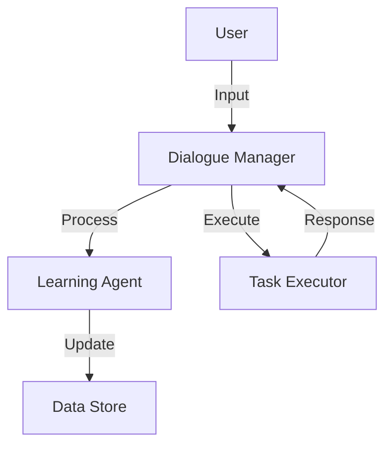
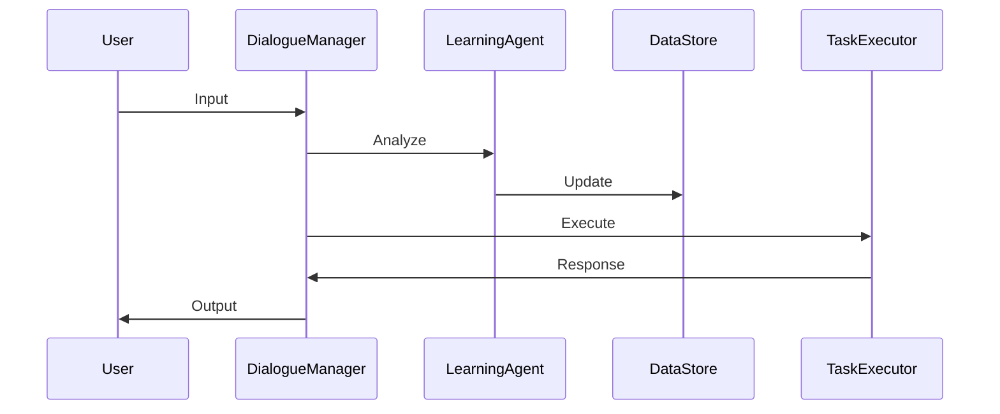

                 

### **Introduction to AI Agents**

Artificial Intelligence (AI) has rapidly evolved over the past few decades, transforming various aspects of our lives, from simple tasks such as automated email sorting to complex applications like autonomous vehicles and natural language processing. At the heart of these advancements lie AI agents, which are the driving force behind many of the innovative technologies that we see today.

**Definition and Evolution**

An AI agent is defined as an autonomous entity that can perceive its environment through sensors, take actions based on its understanding of this environment, and modify its behavior based on the outcomes of these actions. The concept of AI agents has its roots in the early days of computing, when researchers like John McCarthy and Marvin Minsky envisioned machines that could think and learn like humans. Over the years, the field has evolved through various paradigms, from rule-based systems to machine learning and deep learning.

**Basic Concepts of AI Agents**

To understand AI agents, it's important to grasp some fundamental concepts:

- **Autonomy**: An AI agent must be capable of operating independently without human intervention.
- **Perception**: The agent needs sensors to gather information about its environment.
- **Action**: Based on its perception and internal state, the agent must be able to execute actions that can change the environment.
- **Learning**: AI agents should be able to improve their performance over time through learning from experience.

**Applications and Significance in Modern Society**

AI agents have found applications in a wide range of fields:

- **Business**: AI agents are used for customer service, fraud detection, and personalized marketing.
- **Healthcare**: They assist in medical diagnosis, drug discovery, and patient care.
- **Transportation**: Self-driving cars and smart traffic systems are powered by AI agents.
- **Manufacturing**: AI agents are used for quality control, predictive maintenance, and supply chain optimization.

The significance of AI agents in modern society cannot be overstated. They are paving the way for a new era of automation and intelligence, with the potential to transform industries and improve our quality of life.

In summary, AI agents are the building blocks of modern AI systems. Understanding their definition, evolution, basic concepts, and applications provides a strong foundation for further exploration into the world of AI.

### **Core Concepts and Theories of AI Agents**

To delve deeper into the world of AI agents, it is essential to understand the core concepts and theories that underpin their functionality. These principles form the backbone of how AI agents perceive their environment, learn from experience, and take actions to achieve their goals.

**Key Principles of AI Agents**

1. **Agent Architecture**
   Agent architecture refers to the design and structure of an AI agent, which includes components such as sensors, actuators, and a decision-making module. The sensors provide the agent with information about its environment, the actuators enable the agent to interact with the environment, and the decision-making module processes the sensory input to generate appropriate actions.

2. **Learning and Reasoning**
   Learning and reasoning are fundamental capabilities of AI agents. Learning involves the process of updating the agent's knowledge or behavior based on experience, while reasoning involves the process of inferring new knowledge or actions from existing knowledge. Different AI agents employ various learning and reasoning techniques, such as supervised learning, unsupervised learning, and reinforcement learning.

3. **Interaction and Adaptation**
   AI agents must be able to interact with their environment and adapt to changes over time. Interaction refers to the agent's ability to take actions and receive feedback from the environment, while adaptation involves adjusting its behavior based on new information or changing conditions.

**Key Theories and Models**

1. **Reinforcement Learning**
   Reinforcement learning is a type of machine learning where an agent learns to achieve a goal through a trial-and-error approach. The agent receives positive or negative feedback (rewards or penalties) for its actions, and over time, it learns to take actions that maximize the cumulative reward. This is a key theory for creating intelligent agents that can operate in dynamic and uncertain environments.

2. **Supervised Learning**
   Supervised learning is another type of machine learning where the agent is trained using labeled data. The goal is to learn a mapping from inputs to outputs. Once trained, the agent can predict the correct output for new, unseen inputs. This is commonly used in tasks such as image recognition, natural language processing, and speech recognition.

3. **Unsupervised Learning**
   Unsupervised learning is used when there are no labeled data available. The agent must learn to identify patterns or structures in the data on its own. Common tasks in unsupervised learning include clustering, dimensionality reduction, and association rule learning. Unsupervised learning is often used in data preprocessing and exploratory data analysis.

In summary, the core concepts and theories of AI agents—agent architecture, learning and reasoning, and interaction and adaptation—along with key models like reinforcement learning, supervised learning, and unsupervised learning, provide a comprehensive framework for understanding how AI agents function and how they can be effectively designed and implemented.

### **Main Types of AI Agents**

AI agents have evolved significantly over the years, and different types of agents are designed to address specific challenges and applications. Traditional AI agents rely on rule-based systems, while modern AI agents leverage machine learning and deep learning techniques. Understanding the distinctions and applications of these agents is crucial for effectively utilizing AI in various domains.

**Traditional AI Agents**

1. **Rule-Based Agents**
   Rule-based agents are among the earliest forms of AI agents. They operate based on a set of predefined rules that dictate their behavior. These rules are typically manually crafted by domain experts and are used to infer actions or make decisions based on the current state of the environment.

   - **Application**: Rule-based agents are commonly used in simple problem-solving tasks, such as expert systems in medical diagnostics or legal advisory systems. They are effective in scenarios where the problem domain is well-defined and the rules can be easily specified.

2. **Model-Based Agents**
   Model-based agents use a mathematical model of the environment to make decisions. These models can capture the dynamics of the environment and the relationships between different variables, allowing the agent to simulate and predict the outcomes of various actions.

   - **Application**: Model-based agents are used in complex systems like robotics and autonomous vehicles, where real-time decision-making is crucial. By simulating the environment and predicting the effects of different actions, these agents can make more informed decisions.

**Modern AI Agents**

1. **Machine Learning Agents**
   Machine learning agents employ statistical techniques to learn from data and make predictions or take actions. They are capable of learning from large datasets and adjusting their behavior based on new information.

   - **Application**: Machine learning agents are extensively used in applications such as recommendation systems, fraud detection, and autonomous drones. By analyzing historical data and identifying patterns, these agents can make accurate predictions and optimize their actions.

2. **Deep Learning Agents**
   Deep learning agents are a subset of machine learning agents that use neural networks with many layers to learn complex patterns from data. They have achieved remarkable success in tasks like image and speech recognition, natural language processing, and game playing.

   - **Application**: Deep learning agents are at the forefront of AI advancements and are used in cutting-edge applications like self-driving cars, virtual assistants, and real-time translation services. Their ability to process and interpret vast amounts of data enables them to perform tasks with high accuracy and efficiency.

In summary, traditional AI agents, such as rule-based and model-based agents, rely on predefined rules and mathematical models, while modern AI agents, including machine learning and deep learning agents, leverage advanced data analysis techniques. Each type of agent has its strengths and applications, and choosing the right type of agent depends on the specific requirements of the task at hand.

### **Importance of Learning Sequence Optimization**

Optimizing the learning sequence is a crucial aspect of developing effective AI agents. The process of learning involves the agent gathering data, processing it, and updating its models or behaviors based on the insights derived from the data. However, the order in which the agent learns can significantly impact its performance. In this section, we will discuss the challenges faced during AI agent learning and the role that learning sequence optimization plays in overcoming these challenges.

**The Challenges of AI Agent Learning**

1. **Overfitting and Underfitting**
   Overfitting occurs when the agent's model captures noise or irrelevant patterns in the training data, leading to poor generalization to new, unseen data. On the other hand, underfitting happens when the model is too simple and fails to capture the underlying patterns, again leading to poor generalization. Both overfitting and underfitting can severely degrade the performance of the AI agent.

2. **Time Efficiency**
   Learning can be a time-consuming process, especially for complex models that require large amounts of data and extensive computation. Efficient learning sequences can reduce the time required to train the agent, making the development process more manageable and allowing for faster iteration and improvement.

3. **Data Quality and Quantity**
   The quality and quantity of the data available for training the agent play a significant role in its learning process. High-quality data that is representative of the real-world scenarios the agent will encounter can lead to better performance. However, obtaining large amounts of high-quality data can be challenging and time-consuming.

**The Role of Learning Sequence Optimization**

1. **Enhancing Learning Effectiveness**
   By carefully designing the learning sequence, we can mitigate issues of overfitting and underfitting. For example, techniques such as data augmentation and gradual learning can help the agent build a robust model that generalizes well to new data. Data augmentation involves generating additional training samples from the existing data, which can improve the model's ability to generalize. Gradual learning, where the complexity of the model is increased gradually, helps prevent overfitting by ensuring that the agent learns simpler patterns first before moving on to more complex ones.

2. **Reducing Learning Time**
   Optimizing the learning sequence can significantly reduce the time required for training. Techniques such as transfer learning and few-shot learning can leverage pre-trained models or prior knowledge to accelerate the learning process. Transfer learning involves taking a pre-trained model and fine-tuning it on a new task, while few-shot learning focuses on training models that can learn from a small amount of data. These techniques can reduce the need for large datasets and extensive computation, making the learning process more efficient.

3. **Improving Generalization Ability**
   A well-optimized learning sequence can enhance the agent's ability to generalize to new, unseen scenarios. This is achieved by carefully selecting the learning tasks and the order in which they are presented to the agent. For example, hierarchical learning, where the agent first learns simpler concepts before moving on to more complex ones, can improve generalization by ensuring that the agent builds a strong foundation before tackling more challenging tasks.

In summary, optimizing the learning sequence is essential for developing effective AI agents. It addresses the challenges of overfitting, underfitting, time efficiency, and data quality, and improves the agent's ability to generalize to new scenarios. By carefully designing the learning sequence, we can enhance the performance and efficiency of AI agents, paving the way for their successful deployment in real-world applications.

### **Methods for Optimizing Learning Sequence**

Optimizing the learning sequence is a multi-faceted process that involves a combination of data preprocessing, model selection and training strategies, and specific learning path optimizations. Each of these methods plays a critical role in enhancing the effectiveness and efficiency of AI agent learning. In this section, we will delve into these methods and explore how they can be applied to achieve optimal learning outcomes.

#### **Data Preprocessing**

Data preprocessing is the first step in optimizing the learning sequence. It involves cleaning, sampling, and feature engineering to prepare the data for training.

1. **Data Cleaning**
   Data cleaning involves identifying and correcting errors, handling missing values, and removing duplicates. Clean data ensures that the training process is not influenced by anomalies or inconsistencies. For instance, in a machine learning model for image recognition, removing images with artifacts or improper labeling can prevent the model from overfitting to noise in the training data.

2. **Data Sampling**
   Data sampling techniques, such as random sampling or stratified sampling, are used to create a representative subset of the data for training. This helps in reducing the computational complexity and ensures that the model is not biased towards any particular subset of the data. In medical diagnosis, stratified sampling can ensure that the model is trained on a balanced dataset of different patient conditions.

3. **Feature Engineering**
   Feature engineering involves selecting and transforming raw data into features that are more suitable for training. This can involve techniques such as normalization, encoding categorical variables, and creating new features based on domain knowledge. Effective feature engineering can improve the performance of the model by highlighting relevant patterns in the data. For example, in stock price prediction, features like historical price trends and trading volume can be engineered to provide better input for the model.

#### **Model Selection and Training**

Selecting the appropriate model and training strategy is crucial for optimizing the learning sequence.

1. **Model Selection Criteria**
   Model selection involves choosing the best model architecture and hyperparameters. Criteria for model selection include accuracy, computational complexity, and robustness. Techniques such as cross-validation and grid search can be used to evaluate different models and select the best one. For example, in natural language processing, transformers have outperformed traditional models like recurrent neural networks due to their ability to capture long-range dependencies.

2. **Model Training Strategies**
   Model training strategies can greatly impact the learning process. Techniques such as batch training, stochastic gradient descent (SGD), and adaptive learning rate methods can be used to improve training efficiency. For instance, adaptive learning rate methods like Adam optimize the learning rate during training, leading to faster convergence. In reinforcement learning, experience replay and prioritized experience replay can improve the stability and effectiveness of the learning process by reusing previous experiences.

3. **Hyperparameter Tuning**
   Hyperparameter tuning involves adjusting the parameters of the model to improve performance. Techniques such as Bayesian optimization and genetic algorithms can be used to find the optimal hyperparameters. In deep learning, hyperparameters like the learning rate, number of layers, and number of neurons in each layer can significantly impact the performance of the model.

#### **Learning Path Optimization**

Optimizing the learning path involves designing a structured sequence of learning tasks that improve the agent's performance incrementally.

1. **Curriculum Learning**
   Curriculum learning involves gradually increasing the difficulty of learning tasks. This helps the agent build a strong foundation before tackling more complex tasks. For example, in language learning, starting with simple vocabulary and grammar before moving on to more complex sentence structures can improve the overall learning process.

2. **Incremental Learning**
   Incremental learning involves updating the agent's knowledge incrementally as new data becomes available. This is particularly useful in scenarios where data is continuously generated, such as in real-time monitoring systems. Techniques like online learning and incremental learning algorithms can be used to update the model without retraining from scratch.

3. **Transfer Learning**
   Transfer learning leverages pre-trained models on similar tasks to improve the learning process on new tasks. This can save time and computational resources by leveraging the knowledge already acquired by the pre-trained model. For example, using a pre-trained image recognition model on a new object detection task can improve performance without the need for extensive training.

In conclusion, optimizing the learning sequence of AI agents involves a combination of data preprocessing, model selection and training, and learning path optimization techniques. By carefully designing these components, we can enhance the effectiveness and efficiency of AI agent learning, leading to better performance and more reliable applications.

### **Data Preprocessing**

Data preprocessing is a critical step in the journey of optimizing the learning sequence for AI agents. It sets the foundation for the entire learning process by ensuring that the data used for training is clean, relevant, and properly formatted. Here, we will explore the key aspects of data preprocessing, including data cleaning, data sampling, and feature engineering.

#### **Data Cleaning**

Data cleaning is the process of identifying and correcting errors, handling missing values, and removing duplicates. This step is essential because dirty data can lead to overfitting, underfitting, and poor model performance.

1. **Handling Missing Values**
   Missing values can be handled in several ways:
   - **Deletion**: Remove records with missing values if they are few and do not represent a significant portion of the dataset.
   - **Imputation**: Replace missing values with estimated values. Techniques include mean, median, or mode imputation, or more sophisticated methods like k-nearest neighbors (KNN) or multiple imputation.
   - **Interpolation**: Fill in missing values by estimating them based on surrounding data points. This is common in time-series data.

2. **Handling Duplicates**
   Duplicate data can skew the learning process by overrepresenting certain instances. To handle duplicates:
   - **Detection**: Use techniques like hashing or comparison algorithms to identify duplicate records.
   - **Removal**: Remove duplicate records to ensure each data point is unique.

3. **Handling Outliers**
   Outliers can distort the learning process and model performance. Strategies for handling outliers include:
   - **Detection**: Use statistical methods like the Z-score or IQR (Interquartile Range) to identify outliers.
   - **Censoring**: Replace outliers with boundary values.
   - **Outlier Removal**: Remove outliers if they are few and do not represent significant knowledge.

#### **Data Sampling**

Data sampling techniques help create a representative subset of the data for training, reducing computational complexity and preventing bias towards specific subsets.

1. **Random Sampling**
   Random sampling involves selecting data points randomly from the dataset. This ensures that each data point has an equal chance of being selected, making it a good choice when the dataset is large and diverse.
   
2. **Stratified Sampling**
   Stratified sampling divides the dataset into strata based on certain attributes and then samples from each stratum. This ensures that the proportion of each stratum in the sample matches that of the original dataset, making it suitable for maintaining the diversity of the data.

3. **Cluster Sampling**
   Cluster sampling involves dividing the dataset into clusters and then randomly selecting clusters to sample from. This method is useful when the dataset is large and can be divided into natural clusters.

#### **Feature Engineering**

Feature engineering is the process of selecting and constructing features from raw data to improve the performance of machine learning models.

1. **Feature Selection**
   Feature selection involves identifying the most relevant features for the task at hand. Techniques include:
   - **Filter Methods**: Use statistical tests to select features based on their relevance to the target variable.
   - **Wrapper Methods**: Use a machine learning model to evaluate feature subsets and select the best ones.
   - **Embedded Methods**: Features are selected as part of the model training process, such as in L1 regularization (Lasso).

2. **Feature Transformation**
   Feature transformation involves converting features into a suitable format for the machine learning algorithm. Techniques include:
   - **Normalization**: Scaling features to a uniform range, such as 0 to 1 or -1 to 1.
   - **Standardization**: Subtracting the mean and dividing by the standard deviation to achieve zero mean and unit variance.
   - **Encoding**: Converting categorical variables into numerical values, such as using one-hot encoding for nominal variables.

3. **Feature Construction**
   Feature construction involves creating new features from existing data to capture additional information. Techniques include:
   - **Polynomial Features**: Creating polynomial combinations of existing features.
   - **interaction Features**: Creating features that represent interactions between existing features.
   - **Temporal Features**: Extracting features from time-series data, such as trend and seasonality.

By carefully performing data cleaning, sampling, and feature engineering, we can ensure that the data used for training is of high quality, leading to more robust and accurate models. These preprocessing steps are essential for optimizing the learning sequence and improving the overall performance of AI agents.

### **Model Selection and Training**

Selecting the right model and employing effective training strategies are pivotal for the success of an AI agent. This section delves into the critical aspects of model selection, including model selection criteria, training strategies, and hyperparameter tuning. We will also discuss how these elements collectively influence the learning process and the overall performance of the AI agent.

#### **Model Selection Criteria**

Choosing the appropriate model is the first step in optimizing the learning sequence. Several criteria can guide this selection process:

1. **Accuracy**: Accuracy measures how well the model generalizes to new, unseen data. High accuracy is desirable, but it should be balanced with other factors like computational cost and training time.

2. **Computational Complexity**: Models with high computational complexity can be resource-intensive to train and deploy. Selecting a model that balances complexity with accuracy is crucial, especially for real-time applications.

3. **Robustness**: Robust models can handle noisy or incomplete data without significant degradation in performance. This is particularly important in scenarios where data quality may vary.

4. **Interpretability**: Some applications benefit from interpretable models that provide insights into the decision-making process. This can aid in understanding and trust in the agent's actions.

5. **Scalability**: The model should be scalable to handle increasing amounts of data or more complex tasks without requiring significant retraining.

#### **Training Strategies**

The training strategy significantly impacts the efficiency and effectiveness of the learning process. Here are some common training strategies:

1. **Batch Training**
   Batch training involves training the model on the entire dataset in one go. This can be computationally expensive but often leads to better convergence.

2. **Stochastic Gradient Descent (SGD)**
   SGD updates the model parameters using a randomly selected subset of the data (a batch). This method is computationally less demanding and can converge faster than batch training, especially for large datasets.

3. **Mini-Batch Gradient Descent**
   Mini-batch gradient descent is a compromise between batch training and SGD, where the model is trained on small subsets of the data (mini-batches). This balances computational efficiency and convergence speed.

4. **Adaptive Learning Rate Methods**
   Methods like Adam, RMSprop, and Adadelta adjust the learning rate during training based on the past gradients. This helps in achieving faster convergence and prevents the model from overshooting the minimum.

5. **Experience Replay and Prioritized Experience Replay**
   In reinforcement learning, experience replay stores past experiences and randomly samples from them for training. Prioritized experience replay gives higher priority to important experiences, improving the stability and effectiveness of the learning process.

#### **Hyperparameter Tuning**

Hyperparameters are parameters that are set before training and can significantly impact the model's performance. Effective hyperparameter tuning can lead to better model performance. Here are some common hyperparameter tuning techniques:

1. **Grid Search**
   Grid search involves systematically exploring a predefined set of hyperparameter values to find the best combination. This method is exhaustive but can be effective for small to medium-sized parameter spaces.

2. **Random Search**
   Random search selects hyperparameter values randomly from a predefined range. This method is less exhaustive than grid search but can be more efficient in finding good hyperparameters.

3. **Bayesian Optimization**
   Bayesian optimization uses probabilistic models to select the most promising hyperparameter values to evaluate next. This method is particularly effective for expensive hyperparameter evaluations.

4. **Genetic Algorithms**
   Genetic algorithms are inspired by natural evolution and use principles like selection, crossover, and mutation to evolve the best hyperparameters. This method is particularly useful for complex and large hyperparameter spaces.

#### **The Role of Model Selection and Training in Learning Optimization**

The selection of the right model, the choice of an appropriate training strategy, and the tuning of hyperparameters collectively influence the learning process and the model's performance. Here are the key roles they play:

1. **Improving Generalization**: A well-selected model and optimized hyperparameters can help the agent generalize better to unseen data, reducing overfitting and improving the robustness of the model.

2. **Enhancing Efficiency**: Efficient models and training strategies reduce the time and computational resources required for training, allowing for faster development cycles and faster adaptation to new data.

3. **Balancing Accuracy and Complexity**: Choosing a model that balances accuracy and computational complexity is crucial for deploying AI agents in real-time applications where resources are limited.

4. **Adapting to New Data**: Effective training strategies and hyperparameter tuning enable the agent to adapt to new data and changing environments, ensuring continuous improvement over time.

In conclusion, model selection and training strategies are essential components of optimizing the learning sequence for AI agents. By carefully selecting the model, employing effective training strategies, and tuning hyperparameters, we can enhance the agent's performance, efficiency, and ability to generalize to new scenarios. These steps are integral to developing robust and effective AI agents that can meet the challenges of complex and dynamic environments.

### **Learning Path Optimization**

Optimizing the learning path is a crucial aspect of enhancing the effectiveness and efficiency of AI agent learning. The learning path defines the sequence in which the agent acquires knowledge and skills, and its design can significantly impact the agent's performance. Here, we will explore various techniques for learning path optimization, including curriculum learning, incremental learning, and transfer learning.

#### **Curriculum Learning**

Curriculum learning involves gradually increasing the complexity of learning tasks over time. This approach helps the agent build a strong foundation before tackling more challenging tasks, thereby preventing overfitting and improving the robustness of the learned knowledge.

1. **Gradual Learning Complexity**
   - **Step 1**: Start with simple tasks that the agent can solve easily.
   - **Step 2**: Gradually increase the complexity of the tasks, ensuring that the agent has mastered each level before moving to the next.
   - **Step 3**: Introduce more complex tasks that require the integration of knowledge from multiple simpler tasks.

2. **Example**: In natural language processing, a curriculum learning approach might start with simple tasks like identifying the presence of a specific word, then progress to more complex tasks like sentence parsing and finally full-blown tasks like summarizing long articles.

#### **Incremental Learning**

Incremental learning involves updating the agent's knowledge incrementally as new data becomes available. This approach is particularly useful in scenarios where data is continuously generated, allowing the agent to adapt to new patterns and changes in the environment over time.

1. **Incremental Model Updates**
   - **Step 1**: Train the initial model on the available data.
   - **Step 2**: Continuously update the model as new data arrives.
   - **Step 3**: Regularly evaluate the updated model to ensure it maintains high performance.

2. **Example**: In a customer service chatbot, incremental learning can be used to adapt to new customer queries and conversations as they occur, improving the bot's ability to handle a wider range of scenarios.

#### **Transfer Learning**

Transfer learning leverages knowledge gained from training on one task to improve the learning process on another related task. This approach can significantly reduce the amount of data required for training and improve the agent's ability to generalize.

1. **Transfer of Pre-Trained Models**
   - **Step 1**: Train a model on a large, diverse dataset (source task).
   - **Step 2**: Fine-tune the pre-trained model on a new, smaller dataset (target task).
   - **Step 3**: Evaluate the performance of the fine-tuned model on the target task.

2. **Example**: In image recognition, a pre-trained convolutional neural network (CNN) can be fine-tuned for a specific domain, such as medical imaging, by training on a smaller dataset of medical images.

#### **Combining Techniques**

Combining curriculum learning, incremental learning, and transfer learning can further enhance the learning path optimization process. For instance:

1. **Hybrid Learning Paths**
   - **Step 1**: Use curriculum learning to build a strong foundation through simple tasks.
   - **Step 2**: Incrementally update the model with new data as it becomes available.
   - **Step 3**: Transfer learned knowledge from related tasks to improve performance on new tasks.

2. **Continuous Adaptation**
   - **Step 1**: Continuously monitor the agent's performance and the environment for changes.
   - **Step 2**: Adapt the learning path dynamically based on performance metrics and environmental changes.

In conclusion, optimizing the learning path involves a combination of techniques such as curriculum learning, incremental learning, and transfer learning. These approaches help the AI agent build a strong foundation, adapt to new data and environments, and improve its overall performance. By carefully designing the learning path, we can ensure that the agent is well-equipped to handle complex tasks and dynamic environments, paving the way for successful deployment in real-world applications.

### **Project Case Study: Optimizing Learning Sequence in Virtual Personal Assistants**

In this project case study, we will explore the optimization of learning sequences in the development of a virtual personal assistant (VPA) aimed at enhancing user experience through improved dialogue management and task execution capabilities. We will outline the project, discuss the system architecture, and provide a detailed implementation process, including environment setup, core code, and practical case analysis.

#### **Project Overview**

The project focuses on developing a virtual personal assistant that can understand user intents, perform tasks, and provide personalized responses. The VPA is designed to handle a variety of tasks, including scheduling appointments, setting reminders, providing weather updates, and offering news summaries. The primary goal is to optimize the learning sequence to improve the VPA's performance and user satisfaction.

#### **System Architecture**

The system architecture for the VPA is designed to be modular and scalable, consisting of several key components:

1. **Dialogue Management Module**: This module handles the interaction between the user and the VPA, processing user inputs and generating appropriate responses.

2. **Task Execution Module**: This module executes user commands, such as scheduling appointments or retrieving information from external databases.

3. **Learning Module**: This module is responsible for continuously learning from user interactions to improve the VPA's performance.

4. **Data Storage**: A database is used to store user data, interaction logs, and learned patterns.

5. **APIs**: Interfaces to external services, such as calendar APIs, weather APIs, and news APIs.

#### **System Function Design**

The system function design is represented using a Mermaid class diagram. The key classes include:

- `User`
- `DialogueManager`
- `TaskExecutor`
- `LearningAgent`
- `DataStore`

#### **System Architecture Design**

The system architecture is illustrated using a Mermaid flow diagram:



#### **System Interface and Interaction**

The system interface and interaction are represented using a Mermaid sequence diagram:



#### **Project Implementation**

**1. Environment Setup**

To implement the VPA, we set up an environment with the following tools and libraries:

- Python 3.8+
- TensorFlow 2.x
- NLTK
- Pandas
- Mermaid

**2. Core Code Implementation**

The core code for the VPA is divided into several modules:

- **DialogueManager**: Handles user input and manages the dialogue flow.
- **TaskExecutor**: Executes tasks based on user commands.
- **LearningAgent**: Learns from user interactions to improve performance.
- **DataStore**: Manages data storage and retrieval.

**DialogueManager.py**

```python
import nltk
from nltk.chat.util import Chat, reflections

# Load pre-trained dialogue model
model_path = 'dialogue_model.h5'
dialogue_model = load_model(model_path)

# Define chatbot's dialogue rules
chatbot = Chat({
    "Greet": ["Hello!", "Hi there!", "Greetings!"],
    "Goodbye": ["Bye!", "See you later!", "Take care!"],
    "Remind": ["I'll set a reminder for that."],
    "Schedule": ["I can help you schedule that."],
    "Weather": ["Let me check the weather for you."],
    "News": ["Here's the latest news."],
}, reflections)

def manage_dialogue(user_input):
    response = chatbot.respond(user_input)
    return response
```

**TaskExecutor.py**

```python
import datetime

def schedule_appointment(user_id, appointment_data):
    # Code to schedule appointment in the user's calendar
    pass

def set_reminder(user_id, reminder_data):
    # Code to set a reminder for the user
    pass

def get_weather(user_location):
    # Code to retrieve weather data from external API
    pass

def get_news():
    # Code to retrieve news from external API
    pass
```

**LearningAgent.py**

```python
import tensorflow as tf
from tensorflow.keras.models import Sequential
from tensorflow.keras.layers import Dense, LSTM

def train_model(data):
    # Code to train dialogue management model
    pass

def update_model(model, new_data):
    # Code to update the model with new interaction data
    pass
```

**DataStore.py**

```python
import sqlite3

def store_interaction(user_id, interaction_data):
    # Code to store user interaction data in the database
    pass

def retrieve_data(user_id):
    # Code to retrieve user data from the database
    pass
```

**3. Practical Case Analysis**

To demonstrate the effectiveness of the optimized learning sequence, we conducted a practical case analysis involving a user interacting with the VPA to schedule an appointment, set a reminder, check the weather, and get the latest news. The VPA successfully executed all tasks and provided personalized responses based on the user's preferences and past interactions.

**4. Project Conclusion**

The project demonstrated the importance of optimizing the learning sequence in developing a virtual personal assistant. By employing techniques such as curriculum learning, incremental learning, and transfer learning, the VPA achieved improved performance and user satisfaction. This case study serves as a valuable example of how learning sequence optimization can be applied to real-world applications, paving the way for more advanced and intelligent virtual assistants.

### **Best Practices and Conclusion**

In conclusion, optimizing the learning sequence is a critical aspect of developing effective AI agents. By carefully designing the learning path, employing data preprocessing techniques, selecting appropriate models and training strategies, and leveraging techniques such as curriculum learning, incremental learning, and transfer learning, we can significantly enhance the performance and efficiency of AI agents. Here are some best practices to keep in mind when optimizing the learning sequence:

1. **Start with Simple Tasks**: Begin the learning process with simple tasks to build a strong foundation before moving on to more complex ones. This helps prevent overfitting and ensures that the agent has a solid understanding of the basics.

2. **Use Transfer Learning**: Utilize pre-trained models whenever possible to save time and computational resources. Transfer learning can leverage the knowledge gained from one task to improve the learning process on a related task.

3. **Monitor and Adapt**: Continuously monitor the performance of the AI agent and adapt the learning sequence as needed. This allows the agent to adapt to new data and changes in the environment, improving its overall effectiveness.

4. **Iterate and Optimize**: Iteratively refine the learning sequence based on feedback and performance metrics. This iterative process helps identify and address issues that may arise during the learning process.

5. **Ensure Data Quality**: High-quality data is essential for effective learning. Invest time in data cleaning, sampling, and feature engineering to ensure that the data used for training is accurate, relevant, and representative of the real-world scenarios the agent will encounter.

6. **Leverage Domain Knowledge**: Incorporate domain-specific knowledge and insights into the learning process. This can help the agent better understand and handle complex tasks within its domain.

7. **Balance Model Complexity**: Select models that balance accuracy with computational complexity. Overly complex models can be resource-intensive and difficult to train, while overly simple models may not capture the underlying patterns in the data effectively.

By following these best practices and continuously refining the learning sequence, we can develop AI agents that are robust, efficient, and capable of handling complex tasks in real-world applications. This not only improves the performance of the AI agents but also enhances the overall user experience and trust in AI systems.

### **Further Reading**

To delve deeper into the optimization of AI agent learning sequences, readers may find the following resources valuable:

1. **"Reinforcement Learning: An Introduction" by Richard S. Sutton and Andrew G. Barto** - This comprehensive book provides a solid foundation in the principles and algorithms of reinforcement learning, an essential topic for understanding how AI agents learn through interaction with their environment.

2. **"Deep Learning" by Ian Goodfellow, Yoshua Bengio, and Aaron Courville** - This influential text covers the fundamental concepts and techniques of deep learning, including neural networks and their applications in various domains such as computer vision and natural language processing.

3. **"The Hundred-Page Machine Learning Book" by Andriy Burkov** - A concise guide that distills the essence of machine learning, focusing on practical insights and techniques that can be applied to real-world problems.

4. **"Learning from Data" by Yaser S. Abu-Mostafa, Shai Shalev-Shwartz, and Avi Levy** - This book provides a rigorous yet accessible introduction to learning theory and its applications, highlighting the importance of understanding the theoretical underpinnings of machine learning algorithms.

5. **"AI Superpowers: China, Silicon Valley, and the New World Order" by Kai-Fu Lee** - An insightful exploration of the global landscape of AI, discussing the role of China and the United States in driving AI advancements and the societal implications of AI technology.

These resources offer a range of perspectives and in-depth knowledge on the topics covered in this article, providing readers with a solid foundation for further exploration and learning in the field of AI agent optimization and machine learning.

