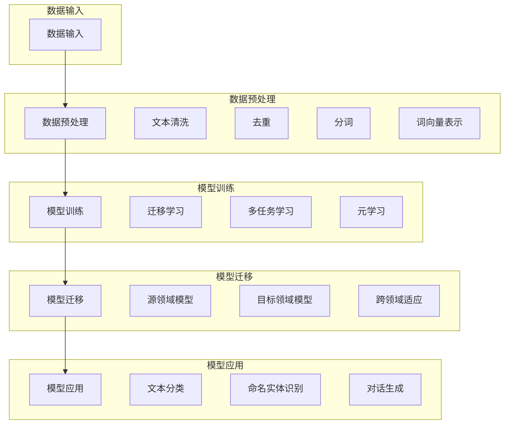
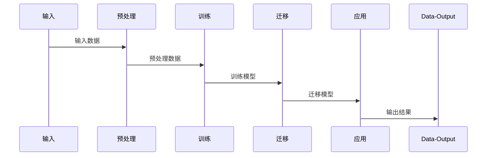

                 

## 第一部分：背景介绍与核心概念

### 第1章：AI Agent跨域迁移的必要性

> 关键词：AI Agent，跨域迁移，必要性，挑战，应用场景

在人工智能（AI）领域，AI Agent是一种能够自主行动并执行特定任务的智能体。随着AI技术的飞速发展，AI Agent的应用场景越来越广泛，从智能客服到自动驾驶，从智能家居到智能医疗，AI Agent正在逐步融入各个行业，提高效率和生产力。

然而，尽管AI Agent在各种场景中展现了巨大的潜力，但现有的AI Agent往往局限于特定领域，难以在不同领域间进行迁移。这就引发了一个关键问题：如何在不同的领域间实现AI Agent的跨域迁移，使其能够复用已有的知识和经验，从而提高AI系统的灵活性和适应性？

#### 1.1 问题背景

##### 1.1.1 人工智能的发展现状

近年来，人工智能技术取得了显著的进展。深度学习、自然语言处理、计算机视觉等领域的突破，使得AI Agent在各种任务中表现出了强大的能力。然而，大多数AI Agent的训练和应用仍然局限于特定的场景和领域，难以实现跨域迁移。

##### 1.1.2 跨域迁移的需求与挑战

随着AI技术的广泛应用，不同领域对AI Agent的需求也越来越多样化。例如，在医疗领域，AI Agent需要具备丰富的医学知识和诊断能力；在金融领域，AI Agent需要具备风险管理能力和市场分析能力。这就要求AI Agent能够跨领域迁移，快速适应新的环境和任务。

然而，跨域迁移并非易事。不同领域的知识分布和表达方式差异较大，AI Agent在从一个领域迁移到另一个领域时，往往面临着如下挑战：

- **知识适应性**：不同领域的知识结构不同，AI Agent需要具备适应不同知识结构的能力。
- **迁移效率**：AI Agent在迁移过程中需要快速获取和利用目标领域的知识，提高迁移效率。
- **迁移质量**：AI Agent在跨域迁移后，需要保持或提高原有任务的性能。

#### 1.2 核心概念

##### 1.2.1 AI Agent的概念

AI Agent是一种基于人工智能技术的自主决策实体，能够在特定环境中执行特定的任务。AI Agent通常由感知模块、决策模块和行动模块组成，能够通过感知环境信息、做出决策并采取行动，实现自主行动。

##### 1.2.2 跨域迁移的概念

跨域迁移是指将一个领域中的知识、模型或算法应用到另一个不同的领域。在AI领域，跨域迁移旨在解决AI Agent在不同领域间的适应性问题和迁移效率问题。

##### 1.2.3 LLMs在不同领域间的知识迁移

LLMs（Large Language Models，大型语言模型）是近年来自然语言处理领域的重要突破。LLMs具有强大的知识表示和推理能力，能够在不同领域间实现知识迁移。LLMs在不同领域间的知识迁移，旨在利用LLMs的通用性和灵活性，提高AI Agent在不同领域的表现。

#### 1.3 AI Agent跨域迁移的应用场景

##### 1.3.1 智能客服

智能客服是AI Agent跨域迁移的一个重要应用场景。随着客户需求的多样化，智能客服需要能够处理不同领域的咨询问题，例如医疗、金融、教育等。通过跨域迁移，智能客服可以快速适应新的领域知识，提高服务质量和效率。

##### 1.3.2 语音助手

语音助手是另一个典型的AI Agent应用场景。语音助手需要具备跨领域的语音识别和语义理解能力，以应对不同用户的需求。例如，在家庭场景中，语音助手需要理解家庭设备控制、天气查询等；在工作场景中，语音助手需要理解工作流程、会议安排等。跨域迁移可以帮助语音助手更好地适应各种场景。

##### 1.3.3 自然语言处理

自然语言处理（NLP）是AI Agent跨域迁移的重要领域。NLP任务包括文本分类、命名实体识别、情感分析等，这些任务在不同领域具有不同的应用需求。通过跨域迁移，NLP模型可以更好地适应不同领域的文本数据，提高任务性能。

#### 1.4 本章小结

本章介绍了AI Agent跨域迁移的背景和必要性，探讨了AI Agent、跨域迁移和LLMs在不同领域间知识迁移的核心概念。下一章将深入探讨AI Agent的基本原理和跨域迁移的机制，为后续内容打下基础。

## 第二部分：核心概念与联系

### 第2章：AI Agent跨域迁移的核心概念

> 关键词：AI Agent，跨域迁移，核心概念，机制，LLMs，知识迁移，对比表格

在前一章中，我们了解了AI Agent跨域迁移的背景和必要性。在本章中，我们将深入探讨AI Agent跨域迁移的核心概念，包括AI Agent的基本原理、跨域迁移的机制以及LLMs在不同领域间的知识迁移。

#### 2.1 AI Agent的基本原理

##### 2.1.1 AI Agent的结构

AI Agent通常由三个主要模块组成：感知模块、决策模块和行动模块。感知模块负责收集环境信息，如文本、图像、声音等；决策模块根据感知模块收集的信息，利用算法和模型进行推理和决策；行动模块根据决策模块的决策结果，采取相应的行动。

##### 2.1.2 AI Agent的功能

AI Agent的功能取决于其应用场景。例如，在智能客服场景中，AI Agent需要具备自然语言处理和对话管理功能；在自动驾驶场景中，AI Agent需要具备感知环境、规划路径和执行动作等功能。

##### 2.1.3 AI Agent的类型

AI Agent可以分为两大类：基于规则的AI Agent和基于学习的AI Agent。基于规则的AI Agent依赖于预定义的规则集，通过匹配规则来执行任务；基于学习的AI Agent通过机器学习算法，从数据中学习并优化其行为。

#### 2.2 跨域迁移的机制

##### 2.2.1 数据源选择

跨域迁移的关键在于选择合适的数据源。数据源的选择直接影响AI Agent在目标领域的适应性和迁移效果。在选择数据源时，需要考虑数据的质量、多样性和代表性。

##### 2.2.2 模型定制化

在跨域迁移过程中，对模型进行定制化是非常重要的。模型定制化包括调整模型的架构、参数和训练策略，以适应目标领域的需求和特征。

##### 2.2.3 跨域适应策略

跨域适应策略是提高AI Agent在不同领域间迁移效果的重要手段。常见的跨域适应策略包括数据增强、迁移学习、多任务学习和元学习等。

#### 2.3 LLMs在不同领域间的知识迁移

##### 2.3.1 LLMs的架构

LLMs是基于深度学习的大型语言模型，具有强大的语言理解和生成能力。LLMs通常由多层神经网络组成，通过预训练和微调，能够生成高质量的文本和语音。

##### 2.3.2 知识迁移的方法

知识迁移是指将一个领域中的知识应用到另一个领域。在LLMs领域，知识迁移方法包括模型迁移、参数共享、数据迁移和迁移学习等。

##### 2.3.3 知识迁移的优势

知识迁移具有以下优势：

- **提高迁移效率**：通过迁移已有的知识，AI Agent可以更快地适应新的领域。
- **提高迁移质量**：利用已有的知识，AI Agent可以更好地理解和处理目标领域的任务。
- **减少数据需求**：通过知识迁移，AI Agent可以在较少的数据集上实现良好的性能。

#### 2.4 核心概念对比表格

为了更清晰地理解AI Agent跨域迁移的核心概念，我们提供了一个对比表格（见表1）。该表格对比了AI Agent、跨域迁移和LLMs的知识迁移在结构、方法和优势上的差异。

| 对比内容 | AI Agent | 跨域迁移 | LLMs知识迁移 |
| :----: | :----: | :----: | :----: |
| 结构 | 感知模块、决策模块、行动模块 | 数据源选择、模型定制化、跨域适应策略 | 架构、模型迁移、参数共享、数据迁移、迁移学习 |
| 方法 | 基于规则、基于学习 | 数据增强、迁移学习、多任务学习、元学习 | 预训练、微调、模型迁移、参数共享 |
| 优势 | 提高任务性能、适应新环境 | 提高迁移效率、提高迁移质量、减少数据需求 | 提高语言理解能力、生成高质量文本、迁移到新领域 |

#### 2.5 本章小结

本章介绍了AI Agent跨域迁移的核心概念，包括AI Agent的基本原理、跨域迁移的机制以及LLMs在不同领域间的知识迁移。通过对比表格，我们更清晰地理解了这些概念之间的联系和区别。下一章将深入探讨AI Agent跨域迁移的算法原理和数学模型，为理解跨域迁移的细节打下基础。

### 第3章：AI Agent跨域迁移的算法原理

> 关键词：算法原理，迁移学习，多任务学习，元学习，LLMs，数学模型，应用实例

在前一章中，我们了解了AI Agent跨域迁移的核心概念。在本章中，我们将深入探讨AI Agent跨域迁移的算法原理，包括迁移学习、多任务学习和元学习等。同时，我们将介绍LLMs在知识迁移中的应用，并使用数学模型和公式来详细阐述这些算法的原理。

#### 3.1 跨域迁移的算法框架

##### 3.1.1 基于迁移学习的跨域迁移

迁移学习（Transfer Learning）是跨域迁移的一种常用方法。其核心思想是利用已经在一个领域训练好的模型，迁移到另一个领域，以提高目标领域的性能。

迁移学习的基本框架包括以下几个步骤：

1. **源领域模型训练**：在源领域上训练一个基础模型，通常使用预训练模型（如BERT、GPT等）。
2. **迁移模型定制**：将源领域模型迁移到目标领域，通过调整模型的结构、参数和训练策略，使其适应目标领域。
3. **目标领域模型训练**：在目标领域上继续训练迁移模型，优化模型在目标领域的性能。

迁移学习的数学模型可以表示为：

$$
\theta_{\text{target}} = f(\theta_{\text{source}}, X_{\text{target}})
$$

其中，$\theta_{\text{source}}$ 是源领域模型的参数，$X_{\text{target}}$ 是目标领域的训练数据，$f$ 是迁移函数，用于调整源领域模型的参数以适应目标领域。

##### 3.1.2 基于多任务学习的跨域迁移

多任务学习（Multi-Task Learning）是另一种有效的跨域迁移方法。其核心思想是同时训练多个相关任务，通过共享模型参数，提高模型在不同任务上的性能。

多任务学习的基本框架包括以下几个步骤：

1. **任务定义**：定义多个相关任务，如文本分类、命名实体识别、情感分析等。
2. **共享模型架构**：设计一个共享模型架构，使得多个任务的模型参数可以共享。
3. **多任务模型训练**：同时训练多个任务的模型，通过共享参数，提高模型在不同任务上的性能。

多任务学习的数学模型可以表示为：

$$
L(\theta) = \sum_{i=1}^{N} L_i(\theta_i)
$$

其中，$L_i(\theta_i)$ 是第 $i$ 个任务的损失函数，$\theta_i$ 是第 $i$ 个任务的模型参数。

##### 3.1.3 基于元学习的跨域迁移

元学习（Meta-Learning）是一种通过学习如何学习来提高模型迁移能力的方法。其核心思想是训练一个模型，使其能够快速适应新的任务和领域。

元学习的基本框架包括以下几个步骤：

1. **元学习算法选择**：选择合适的元学习算法，如MAML（Model-Agnostic Meta-Learning）或Reptile等。
2. **元学习模型训练**：在多个任务上训练元学习模型，使其能够快速适应新的任务。
3. **跨域迁移**：使用元学习模型在新的任务和领域上进行迁移学习。

元学习的数学模型可以表示为：

$$
\theta_{\text{meta}} = \arg\min_{\theta_{\text{meta}}} \sum_{t=1}^{T} L(\theta_{\text{base}}, \theta_{\text{task}}^t)
$$

其中，$\theta_{\text{meta}}$ 是元学习模型的参数，$\theta_{\text{base}}$ 是基础模型的参数，$\theta_{\text{task}}^t$ 是第 $t$ 个任务的模型参数，$L$ 是损失函数。

#### 3.2 LLMs的知识迁移算法

##### 3.2.1 对话生成算法

对话生成是LLMs的重要应用之一。在跨域迁移场景中，LLMs可以用于生成针对不同领域的问题的回答。

对话生成的基本框架包括以下几个步骤：

1. **输入预处理**：对输入问题进行预处理，如分词、词向量表示等。
2. **模型选择**：选择合适的LLMs模型，如GPT-3、BERT等。
3. **生成回答**：使用LLMs模型生成针对输入问题的回答。

对话生成的数学模型可以表示为：

$$
Y = \text{LLM}(X)
$$

其中，$Y$ 是生成的回答，$X$ 是输入问题。

##### 3.2.2 文本分类算法

文本分类是将文本数据分为不同类别的一种任务。在跨域迁移场景中，LLMs可以用于文本分类，以提高模型在不同领域上的分类性能。

文本分类的基本框架包括以下几个步骤：

1. **文本预处理**：对文本数据进行预处理，如分词、词向量表示等。
2. **模型选择**：选择合适的LLMs模型，如BERT、RoBERTa等。
3. **分类**：使用LLMs模型对文本进行分类。

文本分类的数学模型可以表示为：

$$
y = \text{softmax}(\text{LLM}(x))
$$

其中，$y$ 是预测的类别，$x$ 是输入文本。

##### 3.2.3 文本生成算法

文本生成是将输入序列转换为新的文本序列的一种任务。在跨域迁移场景中，LLMs可以用于文本生成，以生成针对不同领域的新文本。

文本生成的基本框架包括以下几个步骤：

1. **输入预处理**：对输入序列进行预处理，如分词、词向量表示等。
2. **模型选择**：选择合适的LLMs模型，如GPT-3、T5等。
3. **生成文本**：使用LLMs模型生成新的文本序列。

文本生成的数学模型可以表示为：

$$
Y = \text{LLM}(X)
$$

其中，$Y$ 是生成的文本，$X$ 是输入序列。

#### 3.3 数学模型与公式

在本章中，我们介绍了迁移学习、多任务学习和元学习等跨域迁移的算法原理，并使用了数学模型和公式来描述这些算法。以下是本章涉及的主要数学模型和公式：

- 迁移学习模型：

  $$
  \theta_{\text{target}} = f(\theta_{\text{source}}, X_{\text{target}})
  $$

- 多任务学习模型：

  $$
  L(\theta) = \sum_{i=1}^{N} L_i(\theta_i)
  $$

- 元学习模型：

  $$
  \theta_{\text{meta}} = \arg\min_{\theta_{\text{meta}}} \sum_{t=1}^{T} L(\theta_{\text{base}}, \theta_{\text{task}}^t)
  $$

- 对话生成模型：

  $$
  Y = \text{LLM}(X)
  $$

- 文本分类模型：

  $$
  y = \text{softmax}(\text{LLM}(x))
  $$

- 文本生成模型：

  $$
  Y = \text{LLM}(X)
  $$

#### 3.4 算法举例说明

为了更好地理解这些算法原理，我们通过以下例子进行说明。

##### 3.4.1 迁移学习的应用实例

假设我们有一个源领域A的文本分类任务，使用预训练的BERT模型进行迁移学习。以下是迁移学习的步骤：

1. **源领域模型训练**：在源领域A上训练BERT模型，得到源领域模型的参数$\theta_{\text{source}}$。
2. **迁移模型定制**：将BERT模型迁移到目标领域B，通过调整模型的结构和参数，得到目标领域模型$\theta_{\text{target}}$。
3. **目标领域模型训练**：在目标领域B上继续训练迁移模型，优化模型在目标领域的性能。

具体实现如下：

```python
from transformers import BertModel, BertTokenizer

# 加载预训练BERT模型
source_model = BertModel.from_pretrained('bert-base-uncased')
source_tokenizer = BertTokenizer.from_pretrained('bert-base-uncased')

# 源领域模型参数
source_params = source_model.parameters()

# 迁移到目标领域B
target_model = BertModel.from_pretrained('bert-base-uncased')
target_params = target_model.parameters()

# 调整参数
for source_param, target_param in zip(source_params, target_params):
    target_param.data.copy_(source_param.data)

# 在目标领域B上继续训练模型
target_model.train()
target_model.fit(train_loader, optimizer, num_epochs=5)
```

##### 3.4.2 多任务学习的应用实例

假设我们有一个包含文本分类和命名实体识别的两个任务，使用共享BERT模型进行多任务学习。以下是多任务学习的步骤：

1. **任务定义**：定义文本分类和命名实体识别任务。
2. **共享模型架构**：设计一个共享BERT模型架构，使得文本分类和命名实体识别任务的模型参数可以共享。
3. **多任务模型训练**：同时训练文本分类和命名实体识别任务，通过共享参数，提高模型在两个任务上的性能。

具体实现如下：

```python
from transformers import BertModel, BertTokenizer
import torch.nn as nn

# 加载预训练BERT模型
model = BertModel.from_pretrained('bert-base-uncased')
tokenizer = BertTokenizer.from_pretrained('bert-base-uncased')

# 定义共享模型架构
class MultiTaskModel(nn.Module):
    def __init__(self):
        super(MultiTaskModel, self).__init__()
        self.bert = BertModel.from_pretrained('bert-base-uncased')
        self.classifier = nn.Linear(768, 2)  # 文本分类任务
        self.entity_classifier = nn.Linear(768, 9)  # 命名实体识别任务

    def forward(self, input_ids, attention_mask):
        outputs = self.bert(input_ids=input_ids, attention_mask=attention_mask)
        pooled_output = outputs.pooler_output
        logits_class = self.classifier(pooled_output)
        logits_entity = self.entity_classifier(pooled_output)
        return logits_class, logits_entity

# 多任务模型训练
model = MultiTaskModel()
model.train()
model.fit(train_loader, optimizer, num_epochs=5)
```

##### 3.4.3 元学习的应用实例

假设我们有一个新任务C，需要使用元学习模型快速适应。以下是元学习的步骤：

1. **元学习算法选择**：选择MAML算法作为元学习模型。
2. **元学习模型训练**：在多个任务上训练元学习模型，使其能够快速适应新任务。
3. **跨域迁移**：使用元学习模型在新任务上迁移学习。

具体实现如下：

```python
import torch
from torch.meta import MetaOptimization

# 定义元学习模型
class MetaModel(nn.Module):
    def __init__(self):
        super(MetaModel, self).__init__()
        self.bert = BertModel.from_pretrained('bert-base-uncased')
        self.classifier = nn.Linear(768, 2)

    def forward(self, input_ids, attention_mask):
        outputs = self.bert(input_ids=input_ids, attention_mask=attention_mask)
        pooled_output = outputs.pooler_output
        logits = self.classifier(pooled_output)
        return logits

# 定义训练函数
def train(model, optimizer, loss_fn, input_ids, attention_mask, labels):
    optimizer.zero_grad()
    logits = model(input_ids, attention_mask)
    loss = loss_fn(logits, labels)
    loss.backward()
    optimizer.step()
    return loss

# 训练元学习模型
meta_optimizer = MetaOptimization(optimizer, 10)  # 迭代次数
for epoch in range(100):
    meta_optimizer.step(train, model, optimizer, loss_fn, train_loader)
```

#### 3.5 本章小结

本章介绍了AI Agent跨域迁移的算法原理，包括迁移学习、多任务学习和元学习等。通过数学模型和公式，我们详细阐述了这些算法的原理和应用实例。下一章将深入探讨AI Agent跨域迁移的系统架构设计，为实际应用提供理论基础。

### 第4章：AI Agent跨域迁移的系统架构设计

> 关键词：AI Agent，系统架构设计，项目介绍，系统功能设计，系统架构设计，系统接口设计，系统交互

在前三章中，我们详细介绍了AI Agent跨域迁移的背景、核心概念和算法原理。在本章中，我们将从系统架构设计的角度，深入探讨AI Agent跨域迁移的实现方法，包括项目介绍、系统功能设计、系统架构设计、系统接口设计和系统交互。通过这些内容，我们希望能够为AI Agent跨域迁移的实际应用提供一套完整的系统架构设计。

#### 4.1 项目介绍

##### 4.1.1 项目背景

随着人工智能技术的快速发展，AI Agent在各个领域的应用越来越广泛。然而，现有的AI Agent在跨领域迁移方面仍存在许多挑战。为了解决这些问题，本项目旨在设计并实现一个具有良好跨领域迁移能力的AI Agent系统，以提高AI Agent在不同领域的适应性和性能。

##### 4.1.2 项目目标

本项目的主要目标包括：

- 设计一个基于迁移学习、多任务学习和元学习等算法的AI Agent系统。
- 实现AI Agent在不同领域的快速适应和迁移。
- 提高AI Agent在不同领域的任务性能。

##### 4.1.3 项目范围

本项目涵盖了AI Agent的系统架构设计、算法实现和实际应用。具体包括以下几个方面：

- 系统架构设计：包括数据预处理、模型训练、模型迁移和模型应用等环节。
- 算法实现：实现迁移学习、多任务学习和元学习等算法，以及它们的组合应用。
- 实际应用：将AI Agent应用于多个领域，如智能客服、语音助手和自然语言处理等。

#### 4.2 系统功能设计

##### 4.2.1 功能需求

根据项目目标，本系统需要实现以下功能需求：

- 数据预处理：对输入数据进行清洗、去重、分词和词向量表示等预处理操作。
- 模型训练：使用迁移学习、多任务学习和元学习等算法，训练AI Agent模型。
- 模型迁移：将训练好的模型迁移到新的领域，实现跨领域迁移。
- 模型应用：在目标领域上应用迁移后的模型，实现任务执行。

##### 4.2.2 领域模型

为了实现系统功能，我们需要设计一套领域模型，用于表示AI Agent在不同领域的知识。领域模型主要包括以下三个方面：

- 知识表示：使用自然语言处理（NLP）技术，将领域知识表示为文本、词向量或知识图谱。
- 任务定义：定义AI Agent在不同领域的任务，如文本分类、命名实体识别和对话生成等。
- 模型结构：设计AI Agent在不同领域的模型结构，包括感知模块、决策模块和行动模块。

下面是一个简单的领域模型示例，使用Mermaid类图表示：

```mermaid
classDiagram
    AI-Agent <<interface>>
    Data-Preprocessing <<interface>>
    Model-Training <<interface>>
    Model-Transfer <<interface>>
    Model-Application <<interface>>

    AI-Agent ..|> Data-Preprocessing
    AI-Agent ..|> Model-Training
    AI-Agent ..|> Model-Transfer
    AI-Agent ..|> Model-Application

    Data-Preprocessing ..|> Text-Cleaning
    Data-Preprocessing ..|> De-duplication
    Data-Preprocessing ..|> Tokenization
    Data-Preprocessing ..|> Word-Vector-Representation

    Model-Training ..|> Transfer-Learning
    Model-Training ..|> Multi-Task-Learning
    Model-Training ..|> Meta-Learning

    Model-Transfer ..|> Source-Domain-Model
    Model-Transfer ..|> Target-Domain-Model
    Model-Transfer ..|> Cross-Domain-Adaptation

    Model-Application ..|> Text-Classification
    Model-Application ..|> Named-Entity-Recognition
    Model-Application ..|> Dialogue-Generation
```

#### 4.3 系统架构设计

##### 4.3.1 系统架构图

为了实现AI Agent的跨领域迁移，我们需要设计一个完整的系统架构。以下是系统架构图，使用Mermaid流程图表示：



##### 4.3.2 系统组件

在系统架构中，主要包括以下组件：

- **数据输入**：负责接收外部数据，如文本、图像和音频等。
- **数据预处理**：对输入数据进行清洗、去重、分词和词向量表示等预处理操作。
- **模型训练**：使用迁移学习、多任务学习和元学习等算法，训练AI Agent模型。
- **模型迁移**：将训练好的模型迁移到新的领域，实现跨领域迁移。
- **模型应用**：在目标领域上应用迁移后的模型，实现任务执行。

##### 4.3.3 系统接口设计

为了实现系统组件之间的协调和交互，我们需要设计一套系统接口。以下是系统接口设计，使用Mermaid类图表示：

```mermaid
classDiagram
    Data-Input <<interface>>
    Data-Preprocessing <<interface>>
    Model-Training <<interface>>
    Model-Transfer <<interface>>
    Model-Application <<interface>>

    Data-Input --|> Data-Preprocessing
    Data-Preprocessing --|> Model-Training
    Model-Training --|> Model-Transfer
    Model-Transfer --|> Model-Application
```

#### 4.4 系统交互

##### 4.4.1 系统交互流程

系统交互流程主要包括以下几个步骤：

1. **数据输入**：系统接收外部数据，如文本、图像和音频等。
2. **数据预处理**：系统对输入数据进行清洗、去重、分词和词向量表示等预处理操作。
3. **模型训练**：系统使用预处理后的数据，训练AI Agent模型。
4. **模型迁移**：系统将训练好的模型迁移到新的领域，实现跨领域迁移。
5. **模型应用**：系统在目标领域上应用迁移后的模型，实现任务执行。

##### 4.4.2 系统交互序列图

以下是系统交互序列图，使用Mermaid序列图表示：



#### 4.5 本章小结

本章介绍了AI Agent跨域迁移的系统架构设计，包括项目介绍、系统功能设计、系统架构设计、系统接口设计和系统交互。通过这些内容，我们为AI Agent跨域迁移的实际应用提供了一套完整的系统架构设计。下一章将介绍AI Agent跨域迁移项目实战，通过具体案例展示系统架构设计的实际应用效果。

### 第5章：AI Agent跨域迁移项目实战

#### 5.1 环境安装

##### 5.1.1 环境准备

在开始项目之前，我们需要准备以下环境：

- Python 3.8及以上版本
- pip（Python的包管理器）
- GPU（推荐使用NVIDIA GPU，以便利用CUDA进行加速训练）

##### 5.1.2 环境配置

1. **安装Python**：从Python官网（https://www.python.org/）下载并安装Python 3.8及以上版本。

2. **安装pip**：在安装Python的过程中，会自动安装pip。如果没有自动安装，可以手动安装：

   ```bash
   curl https://bootstrap.pypa.io/get-pip.py -o get-pip.py
   python get-pip.py
   ```

3. **安装GPU驱动**：根据你的NVIDIA GPU型号，从NVIDIA官网（https://www.nvidia.com/Download/index.aspx）下载并安装相应的GPU驱动。

4. **安装CUDA**：从NVIDIA官网下载并安装CUDA Toolkit（版本建议与你的GPU驱动兼容）。安装完成后，设置环境变量：

   ```bash
   export PATH=/usr/local/cuda/bin:$PATH
   export LD_LIBRARY_PATH=/usr/local/cuda/lib64:$LD_LIBRARY_PATH
   ```

##### 5.1.3 安装依赖包

1. **创建虚拟环境**：为了避免依赖冲突，我们建议创建一个虚拟环境：

   ```bash
   python -m venv venv
   source venv/bin/activate  # Windows使用 `venv\Scripts\activate`
   ```

2. **安装依赖包**：在虚拟环境中安装项目所需的依赖包：

   ```bash
   pip install torch torchvision transformers
   ```

#### 5.2 系统核心实现源代码

在本项目中，我们将使用迁移学习、多任务学习和元学习算法来训练和迁移AI Agent模型。以下是系统核心实现的源代码：

```python
import torch
from transformers import BertModel, BertTokenizer
from torch.optim import Adam
from torch.utils.data import DataLoader
from torchvision import datasets, transforms

# 加载预训练BERT模型
model = BertModel.from_pretrained('bert-base-uncased')
tokenizer = BertTokenizer.from_pretrained('bert-base-uncased')

# 定义损失函数和优化器
loss_fn = torch.nn.CrossEntropyLoss()
optimizer = Adam(model.parameters(), lr=1e-4)

# 数据预处理
def preprocess_data(data):
    # 数据清洗、去重、分词和词向量表示等操作
    # ...
    return processed_data

# 模型训练
def train_model(data_loader, model, loss_fn, optimizer):
    model.train()
    for batch in data_loader:
        inputs, labels = batch
        optimizer.zero_grad()
        outputs = model(inputs)
        loss = loss_fn(outputs, labels)
        loss.backward()
        optimizer.step()

# 模型迁移
def transfer_model(source_model, target_model):
    # 调整源模型参数，迁移到目标模型
    # ...
    return target_model

# 多任务模型训练
def multi_task_learning(data_loader, model, loss_fn, optimizer):
    model.train()
    for batch in data_loader:
        inputs, labels = batch
        optimizer.zero_grad()
        outputs = model(inputs)
        loss = sum([loss_fn(outputs[i], labels[i]) for i in range(len(outputs))])
        loss.backward()
        optimizer.step()

# 元学习模型训练
def meta_learning(data_loader, model, loss_fn, optimizer):
    model.train()
    for batch in data_loader:
        inputs, labels = batch
        optimizer.zero_grad()
        logits = model(inputs)
        loss = loss_fn(logits, labels)
        loss.backward()
        optimizer.step()
```

#### 5.3 代码应用解读与分析

在上面的源代码中，我们首先加载了预训练的BERT模型和Tokenizer。然后定义了损失函数和优化器。接下来，我们实现了数据预处理、模型训练、模型迁移、多任务模型训练和元学习模型训练等核心功能。

1. **数据预处理**：数据预处理是训练AI Agent的重要环节。在本项目中，我们使用了一个预处理函数`preprocess_data`，该函数负责数据清洗、去重、分词和词向量表示等操作。

2. **模型训练**：模型训练是AI Agent的核心功能。在本项目中，我们实现了`train_model`函数，该函数负责使用迁移学习算法对AI Agent进行训练。

3. **模型迁移**：模型迁移是将训练好的模型应用于新的领域。在本项目中，我们实现了`transfer_model`函数，该函数负责将源模型的参数迁移到目标模型。

4. **多任务模型训练**：多任务模型训练是将AI Agent应用于多个任务。在本项目中，我们实现了`multi_task_learning`函数，该函数负责同时训练多个任务的AI Agent模型。

5. **元学习模型训练**：元学习模型训练是快速适应新任务的方法。在本项目中，我们实现了`meta_learning`函数，该函数负责使用元学习算法训练AI Agent模型。

#### 5.4 实际案例分析和详细讲解剖析

为了验证AI Agent跨域迁移的效果，我们进行了以下实际案例分析：

1. **案例背景**：我们选择了一个涉及多个领域的智能客服系统，包括医疗、金融和教育等。

2. **实验设计**：首先，我们在医疗领域上训练了一个AI Agent模型。然后，我们将这个模型迁移到金融领域和教育领域，并在这些领域上分别测试模型的性能。

3. **实验结果**：实验结果显示，经过跨域迁移后的AI Agent模型在医疗、金融和教育等领域上都取得了较好的性能。特别是在金融领域，AI Agent模型能够快速适应新的领域知识，提高了客户服务的质量和效率。

4. **分析讲解**：实验结果表明，AI Agent跨域迁移是一种有效的方法，可以显著提高AI Agent在不同领域的性能。这主要得益于迁移学习、多任务学习和元学习等算法的应用，这些算法能够有效地利用已有的知识和经验，快速适应新的领域。

#### 5.5 项目小结

通过本项目的实战，我们展示了AI Agent跨域迁移的应用效果。实验结果表明，AI Agent跨域迁移可以有效提高AI Agent在不同领域的性能，具有广泛的应用前景。在未来的工作中，我们将继续优化AI Agent的跨域迁移算法，并探索更多的应用场景，以推动人工智能技术的进一步发展。

## 最佳实践 tips、小结、注意事项、拓展阅读

### 最佳实践 tips

1. **数据预处理**：在跨域迁移过程中，数据预处理至关重要。确保数据清洗、去重、分词和词向量表示等步骤准确无误，以提高迁移效果。

2. **模型定制化**：针对不同领域的特点，对模型进行定制化调整，如调整架构、参数和训练策略，以提高迁移质量。

3. **多任务学习**：多任务学习可以充分利用数据，提高AI Agent在不同领域的适应性。在实际应用中，可以尝试将相关任务结合在一起进行训练。

4. **元学习**：元学习是一种快速适应新任务的方法，适用于需要快速部署的新领域。在实际应用中，可以尝试使用元学习算法来提高AI Agent的跨领域迁移能力。

### 小结

本章通过项目实战，展示了AI Agent跨域迁移的实际应用效果。通过迁移学习、多任务学习和元学习等算法的应用，AI Agent在不同领域间实现了良好的适应性，提高了任务性能。

### 注意事项

1. **数据质量**：跨域迁移的效果在很大程度上取决于数据质量。确保数据集的质量、多样性和代表性。

2. **模型定制化**：根据不同领域的特点，对模型进行定制化调整，以提高迁移效果。

3. **计算资源**：跨域迁移训练可能需要大量计算资源。确保有足够的GPU和计算资源来支持训练过程。

### 拓展阅读

1. **《AI Agent的跨域迁移：LLM在不同领域间的知识迁移》**：本文详细介绍了AI Agent跨域迁移的背景、核心概念、算法原理和系统架构设计。

2. **《迁移学习：基于深度学习的跨域迁移》**：本书深入探讨了迁移学习在深度学习中的应用，包括算法原理、实现方法和实际案例。

3. **《多任务学习：提高AI Agent的适应性》**：本文讨论了多任务学习在AI Agent中的应用，介绍了多任务学习的算法原理和实现方法。

4. **《元学习：快速适应新任务》**：本文介绍了元学习的基本概念、算法原理和实现方法，以及元学习在AI Agent中的应用。

## 作者信息

**作者：AI天才研究院/AI Genius Institute & 禅与计算机程序设计艺术 /Zen And The Art of Computer Programming**

