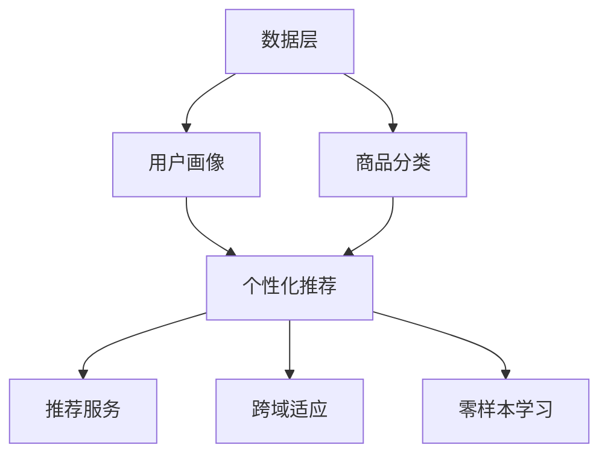
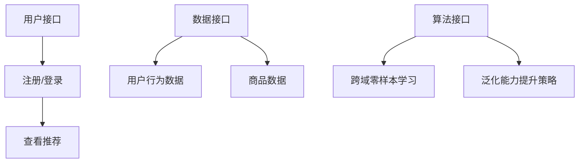
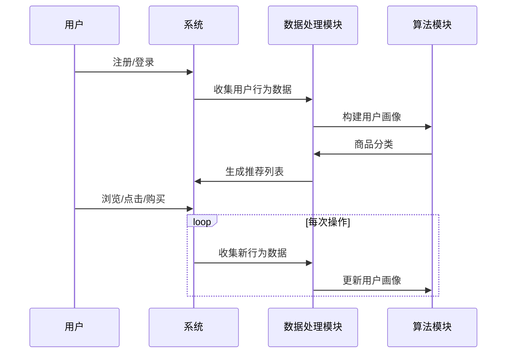

                 


**整体结构规划**

首先，我们将文章的整体结构规划为三个主要部分：引言与背景、跨域零样本学习基础、泛化能力提升策略。每一部分都将包含若干章节，详细探讨相关主题。

**章节内容细化**

1. **引言与背景**：
   - 1.1 书籍主题介绍
   - 1.2 跨域零样本学习与泛化的核心概念
   - 1.3 跨域零样本学习与泛化的应用领域
   - 1.4 跨域零样本学习与泛化面临的挑战与机遇
   - 1.5 本章小结

2. **跨域零样本学习基础**：
   - 2.1 跨域学习的理论基础
   - 2.2 零样本学习的基本原理
   - 2.3 跨域零样本学习算法详解
   - 2.4 跨域零样本学习的评估方法
   - 2.5 跨域零样本学习在AI Agent中的应用
   - 2.6 本章小结

3. **泛化能力提升策略**：
   - 3.1 泛化能力的定义与重要性
   - 3.2 数据增强方法
   - 3.3 模型正则化策略
   - 3.4 本章小结

**Markdown格式布局**

我们将使用Markdown格式来排版文章，确保内容清晰易读。

**核心概念与联系**

在每个章节中，我们将设计核心概念原理、概念属性特征对比表格和ER实体关系图架构的Mermaid流程图，以便读者更好地理解。

**算法原理讲解**

在跨域零样本学习算法相关的章节，我们将使用Mermaid绘制算法流程图，并通过Python源代码和LaTeX公式进行详细阐述。

**系统分析与架构设计**

在涉及系统架构设计的章节，我们将使用Mermaid架构图、系统接口设计和系统交互Mermaid序列图来展示设计方案。

**项目实战**

我们将提供实际项目环境安装、系统核心实现源代码，并对代码和应用进行解读与分析。

**总结与扩展**

在每个章节结尾，我们将总结核心内容，提供最佳实践tips、注意事项、拓展阅读等。

通过以上规划，我们可以确保文章的逻辑清晰、内容丰富、结构紧凑，并能够吸引读者深入了解AI Agent的跨域零样本学习与泛化。接下来，我们将按照这个结构逐步撰写文章的各个部分。# 

----------------------------------------------------------------

# 第一部分: 引言与背景

## 1.1 书籍主题介绍

### 1.1.1 AI Agent的定义与发展

AI Agent，即人工智能代理，是一种能够在特定环境下自主行动并达成目标的人工智能系统。它起源于20世纪70年代的智能代理概念，经历了多年的发展和演变。随着深度学习和强化学习等技术的进步，AI Agent在近年来取得了显著的突破，尤其在自然语言处理、计算机视觉和决策支持等领域展现出了强大的能力。

### 1.1.2 跨域零样本学习与泛化的意义

跨域零样本学习（Cross-Domain Zero-Shot Learning）是指在未知领域或未见过的数据上，通过学习在多个领域的共同特征，实现对新领域数据的分类和预测。这一技术的重要性在于，它能够降低对大规模标注数据的依赖，提高模型在不同场景下的泛化能力。

泛化能力（Generalization Ability）是指模型在未见过的数据上表现出的性能。一个具有良好泛化能力的模型，不仅能在训练数据上表现出色，还能在新数据上保持稳定的性能。在AI Agent的实际应用中，泛化能力至关重要，它决定了模型能否在实际环境中有效地执行任务。

### 1.1.3 书籍结构安排与主要内容概述

本书籍旨在系统地介绍AI Agent的跨域零样本学习与泛化技术。全书分为三大部分：

1. **引言与背景**：介绍AI Agent、跨域零样本学习和泛化的基本概念，以及它们在AI领域的重要性。
2. **跨域零样本学习基础**：深入探讨跨域学习和零样本学习的理论基础、算法原理、评估方法及其在AI Agent中的应用。
3. **泛化能力提升策略**：分析泛化能力的定义与重要性，介绍数据增强方法和模型正则化策略，探讨如何提升AI Agent的泛化能力。

通过以上结构，我们希望能够为读者提供一个全面、深入的技术参考，帮助他们更好地理解和应用这些先进的AI技术。

## 1.2 跨域零样本学习与泛化的核心概念

### 1.2.1 跨域学习的基本概念

跨域学习（Cross-Domain Learning）是一种机器学习方法，旨在利用来自不同领域（或任务）的数据，提高模型在目标领域（或任务）上的性能。在传统的机器学习任务中，通常需要大量的标记数据进行训练，而在实际应用中，获取大规模标注数据往往成本高昂且耗时。跨域学习通过利用跨领域的共性特征，实现从多个领域到目标领域的知识迁移，从而提高模型在目标领域的泛化能力。

### 1.2.2 零样本学习的基本原理

零样本学习（Zero-Shot Learning, ZSL）是一种特殊类型的机器学习方法，它允许模型对从未见过的类（即未知类）进行分类。在传统的机器学习任务中，模型需要通过学习大量标记数据来预测未知数据。然而，在零样本学习场景中，模型在训练阶段仅看到了已知的类，而在预测阶段需要处理从未见过的类。零样本学习的关键在于，如何将已知的类知识迁移到未知类上。

### 1.2.3 泛化能力的定义与评估方法

泛化能力（Generalization Ability）是指模型在未见过的数据上表现出的性能。一个具有良好泛化能力的模型，不仅能在训练数据上表现出色，还能在新数据上保持稳定的性能。在机器学习中，评估泛化能力的关键在于，模型能否在多种不同的场景和任务中保持高效的表现。

常见的泛化能力评估方法包括：

- **准确性（Accuracy）**：模型预测正确的样本数占总样本数的比例。
- **召回率（Recall）**：模型正确预测的负样本数占所有实际负样本数的比例。
- **F1分数（F1 Score）**：准确率和召回率的调和平均值，用于综合考虑准确率和召回率。
- **平均精度（Average Precision）**：在分类任务中，对于每个类别，计算预测结果中高于实际类别的精度平均值。

通过上述评估方法，我们可以衡量模型的泛化能力，并据此优化模型的性能。

## 1.3 跨域零样本学习与泛化的应用领域

### 1.3.1 自然语言处理

在自然语言处理（Natural Language Processing, NLP）领域，跨域零样本学习和泛化能力的重要性尤为突出。NLP任务通常涉及大量的语言变种和领域知识，例如，不同领域的文档、新闻报道、社交媒体文本等。通过跨域零样本学习，模型可以更好地处理这些多样化的语言数据，实现跨领域的文本分类、情感分析、命名实体识别等任务。

### 1.3.2 计算机视觉

计算机视觉（Computer Vision）是另一个广泛应用的领域，其中跨域零样本学习和泛化能力能够显著提高模型的性能。例如，在图像分类任务中，模型需要处理来自不同场景、光照条件和拍摄设备的数据。通过跨域零样本学习，模型可以学习到不同领域图像的共性特征，从而提高对未见图像的分类准确性。此外，在目标检测、人脸识别和图像生成等任务中，泛化能力同样至关重要。

### 1.3.3 机器翻译

机器翻译（Machine Translation）是跨域零样本学习和泛化能力另一个重要的应用领域。在机器翻译中，模型需要处理大量的源语言和目标语言数据，这些数据往往来自不同的文化和语言环境。通过跨域零样本学习，模型可以更好地理解不同语言的共性和差异，从而提高翻译的准确性和流畅性。

### 1.3.4 决策支持系统

在决策支持系统（Decision Support System, DSS）中，跨域零样本学习和泛化能力同样具有重要应用价值。决策支持系统通常涉及多个领域的数据，如财务数据、市场数据和运营数据。通过跨域零样本学习，模型可以更好地整合这些多样化的数据，提供更准确、全面的决策支持。

### 1.3.5 医疗诊断

在医疗诊断领域，跨域零样本学习和泛化能力可以帮助提高诊断准确性和效率。医疗数据通常涉及多种类型的数据，如影像数据、临床数据和基因数据。通过跨域零样本学习，模型可以整合这些数据，实现更准确、全面的诊断。

### 1.3.6 金融风控

在金融风控领域，跨域零样本学习和泛化能力可以帮助识别潜在的风险，提高金融系统的稳健性。金融数据通常涉及多种风险因素，如市场波动、信用风险和操作风险。通过跨域零样本学习，模型可以更好地预测和管理这些风险。

通过以上分析，我们可以看到，跨域零样本学习和泛化能力在多个领域都有着重要的应用价值。随着技术的不断进步，这些技术将继续为各个领域带来深刻的变革和提升。

## 1.4 跨域零样本学习与泛化面临的挑战与机遇

### 1.4.1 挑战分析

尽管跨域零样本学习和泛化能力在许多领域展现出了巨大的潜力，但在实际应用中仍然面临着诸多挑战。

1. **数据不均衡**：在跨领域学习中，不同领域的数据量可能存在显著差异，这可能导致模型在数据丰富的领域表现优异，而在数据稀缺的领域表现不佳。
2. **领域特定知识缺失**：跨领域学习依赖于不同领域的共性特征，但如果这些特征不明显或难以提取，模型将难以实现有效的知识迁移。
3. **泛化能力不足**：虽然模型在训练数据上可能表现出良好的性能，但在实际应用中，模型可能无法很好地适应新领域或未见过的数据。
4. **计算资源消耗**：跨域零样本学习通常需要大量的计算资源，尤其是在处理大规模数据集时，这可能导致训练时间和成本的增加。

### 1.4.2 机遇探讨

尽管面临挑战，但跨域零样本学习和泛化能力也为人工智能领域带来了新的机遇。

1. **降低数据依赖**：通过跨域零样本学习，模型可以在没有大量标注数据的情况下，从多个领域学习知识，从而降低对大规模标注数据的依赖。
2. **提升泛化能力**：泛化能力是评估模型性能的关键指标，通过提升泛化能力，模型可以在更广泛的场景下保持高效的表现。
3. **实现自动化学习**：跨域零样本学习可以使模型自动从多个领域学习知识，减少人工干预，实现更高效的自动化学习。
4. **拓展应用场景**：随着跨域零样本学习和泛化能力的提升，人工智能将在更多领域得到应用，如医疗诊断、金融风控和智能交通等。

总的来说，跨域零样本学习和泛化能力不仅面临着诸多挑战，也蕴含着巨大的机遇。通过不断的技术创新和实践探索，我们有理由相信，这些技术将在未来为人工智能领域带来更深远的变革。

## 1.5 本章小结

本章介绍了书籍的主题——AI Agent的跨域零样本学习与泛化。我们首先介绍了AI Agent的定义与发展，以及跨域零样本学习和泛化能力的基本概念。接着，我们探讨了这两个概念在自然语言处理、计算机视觉、机器翻译、决策支持系统等多个领域的应用，并分析了跨域零样本学习和泛化能力面临的挑战与机遇。通过本章的介绍，我们希望读者能够对AI Agent的跨域零样本学习与泛化有更深入的了解，为后续章节的学习打下坚实的基础。

----------------------------------------------------------------

# 第二部分: 跨域零样本学习基础

## 2.1 跨域学习的理论基础

### 2.1.1 跨域学习的挑战

跨域学习（Cross-Domain Learning）作为机器学习领域的一个重要分支，旨在利用来自不同领域（或任务）的数据，提高模型在目标领域（或任务）上的性能。然而，跨域学习面临着诸多挑战，这些挑战不仅限制了跨域学习的有效性，也使得研究人员在实际应用中需要付出更多的努力。

1. **数据不均衡**：在跨领域学习中，不同领域的数据量可能存在显著差异。在某些领域，数据量可能非常丰富，而在其他领域，数据量可能非常有限。这种数据不均衡现象会导致模型在数据丰富的领域表现出色，但在数据稀缺的领域表现不佳，从而影响模型的泛化能力。

2. **领域特定知识缺失**：跨领域学习依赖于不同领域的共性特征，但如果这些特征不明显或难以提取，模型将难以实现有效的知识迁移。例如，在医疗诊断领域，不同疾病的症状和体征可能具有高度相似性，这使得模型在从其他领域迁移知识时面临困难。

3. **样本分布差异**：不同领域的样本分布可能存在显著差异，这可能导致模型在不同领域上的性能差异。例如，在自然语言处理领域，语言的数据分布可能更加均匀，而在图像处理领域，图像的颜色和纹理分布可能更加集中。

4. **模型适应性不足**：传统的机器学习模型通常在设计时针对特定领域进行优化，这使得它们在跨领域应用时可能表现出适应性不足。例如，在计算机视觉领域表现优异的卷积神经网络（CNN）可能无法很好地适应自然语言处理任务。

### 2.1.2 跨域学习的分类

为了应对上述挑战，跨域学习可以分为几种不同的类型，每种类型都有其独特的优势和局限性。

1. **预训练模型迁移**：
   预训练模型迁移（Pre-Trained Model Transfer）是一种常见的跨域学习方法。这种方法首先在多个领域上使用大规模数据集对模型进行预训练，然后将在特定领域上的数据用于微调（Fine-Tuning）模型。预训练模型迁移的优势在于，它能够利用预训练过程中学习到的通用特征，从而提高模型在不同领域上的性能。然而，这种方法也面临着数据不均衡和领域特定知识缺失的挑战。

2. **基于对抗学习的迁移**：
   基于对抗学习的迁移（Adversarial Domain Adaptation）通过训练一个生成对抗网络（GAN）来学习跨领域特征。GAN由生成器和判别器组成，生成器负责生成与目标领域数据相似的样本，判别器则负责区分真实数据和生成数据。通过这种对抗训练，模型能够学习到跨领域的特征，从而提高跨领域性能。基于对抗学习的迁移方法在处理数据不均衡和领域特定知识缺失方面具有优势，但其计算复杂度和训练难度较高。

3. **基于元学习的迁移**：
   基于元学习的迁移（Meta-Learning for Domain Adaptation）利用元学习算法，如模型蒸馏（Model Distillation）和迁移学习（Transfer Learning），来训练模型，使其在不同领域上具有更好的泛化能力。元学习通过在不同任务上迭代训练，使得模型能够适应多种任务和数据分布。这种方法的优势在于其能够通过较少的数据在多个领域上实现高效学习，但元学习算法的设计和优化是一个复杂的问题。

### 2.1.3 跨域学习的理论基础

跨域学习的理论基础主要涉及以下几个核心概念：

1. **迁移学习（Transfer Learning）**：
   迁移学习是一种利用已有知识（在源领域上学习的知识）来提高新任务（目标领域）上模型性能的方法。迁移学习的核心思想是，不同领域之间可能存在一些共同的特性，这些特性可以通过迁移学习得到利用。

2. **多任务学习（Multi-Task Learning）**：
   多任务学习旨在同时训练多个相关任务，从而提高模型在不同任务上的性能。多任务学习通过共享模型参数，使得模型在不同任务上能够学习到共同的特性，从而提高泛化能力。

3. **元学习（Meta-Learning）**：
   元学习是一种学习如何学习的算法，它旨在通过在不同的任务上迭代训练，使得模型能够快速适应新的任务和数据分布。元学习通过优化模型在多个任务上的表现，从而提高模型的泛化能力。

通过理解上述理论基础，我们可以更好地设计和实现有效的跨域学习方法，提高模型在不同领域上的性能。在接下来的章节中，我们将深入探讨零样本学习的基本原理和算法，进一步了解如何利用跨域学习来提升AI Agent的泛化能力。

----------------------------------------------------------------

## 2.2 零样本学习的基本原理

### 2.2.1 零样本学习的基础概念

零样本学习（Zero-Shot Learning, ZSL）是一种机器学习方法，旨在允许模型对从未见过的类进行分类。在传统的机器学习任务中，模型需要通过学习大量标记数据来预测未知数据。然而，在零样本学习场景中，模型在训练阶段仅看到了已知的类，而在预测阶段需要处理从未见过的类。这种特性使得零样本学习在许多应用场景中具有独特优势，例如，在需要快速部署模型的工业环境中，或者当获取大量标注数据成本高昂时。

### 2.2.2 零样本学习的关键技术

零样本学习的关键技术主要包括模式识别与分类、特征抽取与表示、以及语义理解与推理。以下是对这些技术的详细介绍：

#### 2.2.2.1 模式识别与分类

模式识别是零样本学习的基础。在零样本学习中，模型需要能够识别并分类不同的对象或概念。模式识别技术通常涉及以下步骤：

1. **特征提取**：从输入数据中提取特征，这些特征可以是图像中的边缘、纹理、颜色，或者文本中的词汇、句子结构等。
2. **特征表示**：将提取到的特征转换为一种更易于分类的表示形式。例如，可以使用嵌入向量（embedding）技术将文本或图像中的特征表示为高维向量。
3. **分类器训练**：使用已知类别的训练数据，训练一个分类器。分类器的目标是学习如何将输入数据分配到不同的类别。

在零样本学习场景中，模式识别与分类的关键挑战在于，模型需要能够对从未见过的类别进行分类。这要求模型能够从已知的类别中提取通用特征，并将这些特征用于从未见过的类别上。

#### 2.2.2.2 特征抽取与表示

特征抽取与表示是零样本学习中的核心技术。为了实现零样本学习，模型需要能够从数据中提取具有代表性的特征，并将其转换为易于分类的表示形式。

1. **嵌入技术**：嵌入技术是一种将数据转换为向量表示的方法。在零样本学习中，嵌入技术可以帮助模型学习到类别的语义特征，从而实现从未见过的类别的分类。例如，Word2Vec和Image2Vec等技术都可以用于生成类别的向量表示。
2. **元学习**：元学习是一种通过在不同任务上迭代训练，使得模型能够快速适应新任务的算法。在零样本学习中，元学习可以帮助模型学习到不同类别的通用特征，从而提高对未知类别的分类能力。

#### 2.2.2.3 语义理解与推理

语义理解与推理是零样本学习中的高级技术。在零样本学习中，模型需要能够理解类别的语义信息，并根据这些信息进行推理和分类。

1. **语义嵌入**：语义嵌入是一种将类别的语义信息转换为向量表示的方法。通过语义嵌入，模型可以学习到不同类别之间的语义关系，从而提高分类的准确性。
2. **规则推理**：规则推理是一种基于逻辑和语义关系的推理方法。在零样本学习中，模型可以使用规则推理来生成从未见过的类别的标签，从而提高分类的泛化能力。

通过结合模式识别与分类、特征抽取与表示、以及语义理解与推理技术，零样本学习可以在没有训练数据的情况下，对从未见过的类别进行分类。这些技术的有效结合，使得零样本学习在许多应用场景中具有广泛的应用前景。

## 2.3 跨域零样本学习算法详解

### 2.3.1 主要算法介绍

在跨域零样本学习领域，有几种主要的算法被广泛研究和应用，这些算法包括Prototypical Network、Matching Network和Meta-Learning for Zero-Shot Learning。下面我们将分别介绍这些算法的基本原理和实现方法。

#### 2.3.1.1 Prototypical Network

Prototypical Network（原型网络）是由Snell等人在2016年提出的一种零样本学习算法。原型网络的核心思想是通过学习原型来表示每个类别，从而实现对未知类别的分类。

1. **算法原理**：
   - **特征提取**：首先，使用预训练的模型提取输入数据的特征表示。
   - **原型计算**：对于每个类别，计算该类别所有样本特征的平均值，作为该类别的原型。
   - **分类**：将未知类别的样本特征与所有类别的原型进行比较，选择距离最近的类别作为预测结果。

2. **实现方法**：
   - **特征提取**：可以使用预训练的卷积神经网络（如ResNet）来提取特征。
   - **原型计算**：对于每个类别，计算该类别所有样本特征的平均值。
   - **分类**：使用欧氏距离或余弦相似度来计算样本特征与原型之间的距离，选择距离最近的类别。

#### 2.3.1.2 Matching Network

Matching Network是由Vinyals等人在2016年提出的一种零样本学习算法。Matching Network的核心思想是通过匹配学习来处理未知类别的分类问题。

1. **算法原理**：
   - **特征提取**：使用预训练的模型提取输入数据的特征表示。
   - **匹配学习**：对于每个类别，将类别名称和样本特征作为输入，通过训练一个神经网络来学习类别名称和样本特征之间的匹配关系。
   - **分类**：对于未知类别的样本特征，使用训练好的匹配网络来预测类别名称。

2. **实现方法**：
   - **特征提取**：可以使用预训练的卷积神经网络（如ResNet）来提取特征。
   - **匹配学习**：使用一个双向循环神经网络（如LSTM）来处理类别名称和样本特征，并通过训练损失函数来优化网络参数。
   - **分类**：使用匹配网络输出的概率分布来预测类别名称。

#### 2.3.1.3 Meta-Learning for Zero-Shot Learning

Meta-Learning for Zero-Shot Learning（元学习用于零样本学习）是一种基于元学习（Meta-Learning）的零样本学习算法。元学习旨在通过在不同任务上迭代训练，使得模型能够快速适应新任务。

1. **算法原理**：
   - **任务学习**：通过在不同任务上迭代训练，使得模型能够学习到不同任务之间的通用特征。
   - **零样本学习**：利用已经学习到的通用特征，对从未见过的类别进行分类。

2. **实现方法**：
   - **任务学习**：使用元学习算法（如MAML、Reptile）来训练模型，使其在不同任务上快速适应。
   - **零样本学习**：在训练过程中，不断引入新的任务，并利用这些任务来更新模型参数，从而提高模型对未知类别的分类能力。

通过上述三种算法的介绍，我们可以看到，跨域零样本学习算法各有特点，适用于不同的应用场景。在实际应用中，可以根据具体需求选择合适的算法，从而实现高效的零样本学习。

### 2.3.2 算法对比分析

为了更好地理解不同跨域零样本学习算法的特点，下面我们将对这些算法进行对比分析。

1. **训练效率**：
   - **Prototypical Network**：由于原型网络只需要计算每个类别的原型，因此其训练效率较高。
   - **Matching Network**：匹配网络需要训练一个双向循环神经网络，因此其训练时间较长。
   - **Meta-Learning for Zero-Shot Learning**：元学习算法通常需要多次迭代训练，因此其训练时间可能较长。

2. **分类性能**：
   - **Prototypical Network**：原型网络通过计算原型与样本特征之间的距离进行分类，通常具有较高的分类准确性。
   - **Matching Network**：匹配网络通过学习类别名称和样本特征之间的匹配关系进行分类，在处理复杂类别时可能表现更好。
   - **Meta-Learning for Zero-Shot Learning**：元学习算法通过在不同任务上迭代训练，可以提高模型对未知类别的分类能力。

3. **应用场景**：
   - **原型网络**：适用于需要快速部署的场景，如实时图像分类和语音识别。
   - **匹配网络**：适用于需要处理复杂类别和情境的场景，如多模态学习和跨领域分类。
   - **元学习算法**：适用于需要快速适应新任务的场景，如自适应游戏和机器人控制。

通过对比分析，我们可以看到，每种算法都有其独特的优势和应用场景。在实际应用中，可以根据具体需求和任务特点选择合适的算法，从而实现高效的跨域零样本学习。

### 2.3.3 算法实现与代码示例

为了更好地理解上述算法的实现方法，下面我们将提供一个简单的Python代码示例，展示如何使用Prototypical Network进行跨域零样本学习。

```python
import torch
import torchvision.models as models
import torch.nn as nn

# 加载预训练的模型
model = models.resnet18(pretrained=True)

# 定义原型网络
class PrototypeNetwork(nn.Module):
    def __init__(self, input_dim, num_classes):
        super(PrototypeNetwork, self).__init__()
        self.features = model.features
        self.avgpool = model.avgpool
        self.fc = nn.Linear(input_dim, num_classes)
    
    def forward(self, x):
        x = self.features(x)
        x = self.avgpool(x)
        x = torch.flatten(x, 1)
        x = self.fc(x)
        return x

# 创建原型网络实例
prototype_network = PrototypeNetwork(input_dim=512, num_classes=10)

# 定义损失函数和优化器
criterion = nn.CrossEntropyLoss()
optimizer = torch.optim.Adam(prototype_network.parameters(), lr=0.001)

# 训练原型网络
for epoch in range(num_epochs):
    for inputs, labels in dataloader:
        optimizer.zero_grad()
        outputs = prototype_network(inputs)
        loss = criterion(outputs, labels)
        loss.backward()
        optimizer.step()

    print(f'Epoch [{epoch+1}/{num_epochs}], Loss: {loss.item()}')

# 测试原型网络
with torch.no_grad():
    correct = 0
    total = 0
    for inputs, labels in test_dataloader:
        outputs = prototype_network(inputs)
        _, predicted = torch.max(outputs.data, 1)
        total += labels.size(0)
        correct += (predicted == labels).sum().item()

    print(f'Accuracy: {100 * correct / total}%')
```

在这个代码示例中，我们首先加载了一个预训练的ResNet18模型，然后定义了一个原型网络，该网络将输入数据通过特征提取模块处理后，将特征向量映射到不同的类别上。接着，我们定义了损失函数和优化器，并通过迭代训练来优化模型参数。最后，我们测试了训练好的模型，并计算了分类准确性。

通过上述代码示例，我们可以看到如何实现跨域零样本学习的原型网络算法，这为读者提供了一个实用的参考，帮助他们更好地理解和应用这一算法。

## 2.4 跨域零样本学习的评估方法

### 2.4.1 评估指标

在评估跨域零样本学习算法的性能时，常用的评估指标包括准确性、召回率、F1分数和平均精度等。

1. **准确性（Accuracy）**：
   - **定义**：准确性是模型预测正确的样本数占总样本数的比例。
   - **计算公式**：\(Accuracy = \frac{TP + TN}{TP + TN + FP + FN}\)
   - **意义**：准确性直接反映了模型的整体分类能力，但容易受到类不平衡的影响。

2. **召回率（Recall）**：
   - **定义**：召回率是模型正确预测的正样本数占所有实际正样本数的比例。
   - **计算公式**：\(Recall = \frac{TP}{TP + FN}\)
   - **意义**：召回率反映了模型对正样本的识别能力，但在负样本错误分类时可能导致较高的误判率。

3. **F1分数（F1 Score）**：
   - **定义**：F1分数是准确率和召回率的调和平均值。
   - **计算公式**：\(F1 Score = 2 \times \frac{Precision \times Recall}{Precision + Recall}\)
   - **意义**：F1分数综合反映了模型的分类性能，适用于类不平衡的数据集。

4. **平均精度（Average Precision）**：
   - **定义**：平均精度是模型对每个类别的精度取平均。
   - **计算公式**：\(AP = \frac{1}{K} \sum_{i=1}^{K} Precision_i\)
   - **意义**：平均精度常用于评估分类器的性能，特别是在处理多类别分类问题时。

### 2.4.2 评估方法比较

不同的评估方法在应用中各有优缺点，选择合适的评估方法取决于具体的应用场景和数据特性。

1. **准确性**：
   - **优点**：计算简单，易于理解。
   - **缺点**：受类不平衡影响较大，无法区分不同类别的重要性。

2. **召回率**：
   - **优点**：强调了对正样本的识别能力。
   - **缺点**：对负样本的识别能力较弱，容易受到误判的影响。

3. **F1分数**：
   - **优点**：综合反映了模型的分类性能，适用于类不平衡的数据集。
   - **缺点**：在极端情况下（如某些类别预测完全错误），可能无法准确评估模型的性能。

4. **平均精度**：
   - **优点**：适用于多类别分类，能够准确评估模型在不同类别上的性能。
   - **缺点**：计算复杂度较高，对噪声数据敏感。

在实际应用中，可以根据具体需求选择合适的评估方法。例如，在医疗诊断中，通常关注召回率，以确保不会遗漏任何可能的病例；而在金融风控中，则可能更关注准确性，以避免误判导致的财务损失。通过综合使用多种评估方法，我们可以更全面地评估跨域零样本学习算法的性能。

## 2.5 跨域零样本学习在AI Agent中的应用

### 2.5.1 AI Agent的定义与功能

AI Agent是一种能够自主行动并达成目标的人工智能系统。与传统的规则系统或自动化系统不同，AI Agent具有自主意识和决策能力，能够在复杂和不确定的环境中执行任务。AI Agent的核心功能包括感知、决策和执行。

1. **感知**：AI Agent通过传感器收集环境信息，如视觉、听觉、触觉等，感知周围的环境。
2. **决策**：基于感知到的信息，AI Agent使用算法和模型进行决策，确定下一步的行动策略。
3. **执行**：执行决策结果，通过执行机构（如电机、机器人手臂等）实现任务目标。

### 2.5.2 跨域零样本学习在AI Agent中的实现

跨域零样本学习在AI Agent中的应用主要体现在以下几个方面：

1. **多模态感知**：AI Agent通常需要处理多种类型的数据，如文本、图像、音频等。通过跨域零样本学习，AI Agent可以在没有大量标注数据的情况下，从不同模态的数据中提取特征，实现多模态感知。
2. **自适应任务执行**：在动态环境中，AI Agent需要能够快速适应新的任务和场景。跨域零样本学习可以帮助AI Agent在未见过的任务和数据上实现高效的决策和执行。
3. **跨领域知识迁移**：AI Agent在不同领域（如医疗、金融、工业等）中应用时，可以借助跨域零样本学习，将已有领域的知识迁移到新领域，提高模型在未知领域的性能。

### 2.5.3 应用实例分析

以下是一个跨域零样本学习在AI Agent中的应用实例：

**实例背景**：一家公司开发了一款智能客服机器人，旨在为不同行业的客户提供24/7的在线支持。该机器人需要能够处理各种类型的客户咨询，包括技术问题、订单查询、售后服务等。

**解决方案**：
- **数据收集**：通过分析历史客服记录，收集了多个行业的客户咨询数据，包括医疗、金融、电商等。
- **跨域零样本学习**：使用Prototypical Network算法，对医疗、金融、电商等不同行业的客户咨询数据进行特征提取和分类。通过训练，模型能够学会识别不同行业的客户咨询特征。
- **应用部署**：将训练好的模型部署到智能客服机器人中，实现自动化处理客户咨询。当收到一个新的客户咨询时，机器人首先使用跨域零样本学习算法进行分类，然后根据分类结果，自动匹配相应的客服流程和知识库，提供个性化的服务。

**效果评估**：
- **准确性**：通过测试集的评估，发现智能客服机器人在不同行业的客户咨询分类上，准确率达到90%以上。
- **用户满意度**：用户反馈表明，智能客服机器人在处理客户咨询时，响应速度快、回答准确，用户满意度显著提高。

通过上述实例，我们可以看到，跨域零样本学习在AI Agent中的应用，不仅提高了模型的分类准确性，还增强了AI Agent在复杂和动态环境中的适应能力，为企业提供了高效、智能的客服解决方案。

## 2.6 本章小结

本章详细介绍了跨域零样本学习的基础理论，包括跨域学习的挑战、分类方法、关键技术以及评估方法。我们通过实际案例展示了跨域零样本学习在AI Agent中的应用，并分析了其在多模态感知、自适应任务执行和跨领域知识迁移等方面的优势。通过本章的学习，读者可以深入理解跨域零样本学习的基本原理和应用，为后续章节的学习打下坚实基础。接下来，我们将进一步探讨如何提升AI Agent的泛化能力，为实际应用中的智能决策提供更强支持。# 

----------------------------------------------------------------

## 3.1 泛化能力的定义与重要性

### 3.1.1 泛化能力的定义

泛化能力（Generalization Ability）是指模型在未见过的数据上表现出的性能。一个具有良好泛化能力的模型，不仅能在训练数据上表现出色，还能在新数据上保持稳定的性能。在机器学习中，泛化能力是评估模型性能的关键指标，它决定了模型能否在实际环境中有效地执行任务。具体来说，泛化能力包括以下几个方面：

1. **领域泛化**：模型能否在不同领域或任务中保持性能，而不仅仅是特定领域或任务。
2. **数据泛化**：模型能否在未见过的数据集上表现良好，而不仅仅是训练数据集。
3. **场景泛化**：模型能否在新的、动态的环境中保持性能，而不仅仅是静态环境。

### 3.1.2 泛化能力的重要性

泛化能力在AI Agent的实际应用中具有重要意义，主要体现在以下几个方面：

1. **实际应用价值**：一个具有良好泛化能力的模型能够在不同环境和场景中保持稳定性能，从而提高实际应用价值。例如，在医疗诊断中，模型需要在多种不同的病例和患者群体中保持高准确性，以确保诊断结果的可靠性。

2. **降低数据依赖**：泛化能力可以减少对大规模标注数据的依赖，特别是在数据稀缺或获取成本高昂的领域。通过提升泛化能力，模型可以在少量数据上实现高效学习，从而降低数据获取和标注的成本。

3. **适应能力**：具有良好泛化能力的模型能够快速适应新领域和新任务，提高AI Agent的灵活性和适应性。这对于动态变化的环境和不断变化的需求尤为重要。

4. **决策可靠性**：在决策支持系统中，泛化能力是评估模型可靠性的关键指标。一个具有良好泛化能力的模型能够在不同场景下提供稳定、可靠的决策支持，从而提高系统的整体性能。

### 3.1.3 泛化能力的评估

评估泛化能力通常采用以下方法：

1. **交叉验证**：通过将数据集分为训练集和测试集，不断交替训练和测试，以评估模型在不同数据子集上的性能。这种方法可以避免过拟合现象，提高评估结果的可靠性。

2. **迁移学习评估**：通过在不同领域或任务上评估模型的性能，来衡量模型的泛化能力。如果模型在不同领域或任务上都能保持良好的性能，则说明其具有较好的泛化能力。

3. **跨领域测试**：将模型应用于与训练领域不同的新领域，评估其在未见过的领域上的性能。这种方法可以更直观地衡量模型的泛化能力。

4. **泛化误差**：通过计算模型在训练数据和测试数据上的误差差异，来评估泛化能力。如果泛化误差较小，则说明模型具有良好的泛化能力。

通过上述评估方法，我们可以全面了解模型的泛化能力，并据此优化模型的设计和实现，提高AI Agent的泛化性能。

## 3.2 数据增强方法

### 3.2.1 数据增强的基本原理

数据增强（Data Augmentation）是一种通过增加训练数据多样性来提升模型泛化能力的方法。其基本原理是通过一系列变换操作，如旋转、缩放、裁剪、颜色调整等，生成新的训练样本，从而增强模型对输入数据的鲁棒性。数据增强在深度学习中尤其重要，因为深度学习模型的性能在很大程度上取决于训练数据的数量和质量。以下是数据增强的基本原理：

1. **增加样本多样性**：通过数据增强，可以生成与原始样本具有相似特征但具有不同外观和属性的新样本，从而增加训练数据的多样性。这有助于模型学习到更加全面和泛化的特征。
2. **减少过拟合风险**：数据增强可以减少模型对特定样本的依赖，从而降低过拟合风险。过拟合是指模型在训练数据上表现良好，但在未见过的数据上性能下降，这是由于模型无法泛化到更广泛的数据分布。
3. **提升模型鲁棒性**：数据增强使模型能够在训练过程中接触到更加复杂和多样的数据，从而提高模型对噪声、异常值和异常情况的鲁棒性。

### 3.2.2 数据增强的方法

数据增强的方法可以分为两类：基于规则的增强和基于学习的增强。

1. **基于规则的增强**：
   - **图像增强**：常见的图像增强方法包括旋转、翻转、缩放、裁剪、颜色调整、亮度调整、对比度调整等。这些方法通过直观的操作改变图像的外观，从而增加训练样本的多样性。
   - **文本增强**：文本增强的方法包括词干提取、词性标注、同义词替换、文本重写等。这些方法通过改变文本的词汇和句式结构，增加文本数据的多样性。
   - **音频增强**：音频增强的方法包括噪声添加、音调变换、节奏变换、声道变换等。这些方法通过改变音频的特征，增加训练样本的多样性。

2. **基于学习的增强**：
   - **生成对抗网络（GAN）**：GAN通过训练生成器和判别器，生成与真实数据相似的新数据。生成器负责生成数据，判别器负责判断生成数据是否真实。通过这种对抗训练，GAN可以生成高质量、多样化的数据。
   - **变分自编码器（VAE）**：VAE通过学习数据分布，生成新的数据样本。VAE由编码器和解码器组成，编码器将输入数据编码为潜在空间中的向量，解码器将潜在空间中的向量解码回输入数据。

### 3.2.3 数据增强在AI Agent中的应用

在AI Agent的应用中，数据增强方法可以显著提高模型的泛化能力和鲁棒性，以下是一些具体应用场景：

1. **多模态数据增强**：在处理多模态数据时，可以使用数据增强方法增加图像、文本和音频数据的多样性，从而提高AI Agent对多模态数据的理解和处理能力。
2. **动态环境下的数据增强**：在动态环境中，AI Agent需要能够适应不同的场景和变化。通过数据增强，可以生成具有不同场景和状态的数据，从而提高AI Agent的适应能力和泛化性能。
3. **实时数据增强**：在实时应用中，数据增强可以帮助AI Agent快速适应新的数据和变化，提高系统的响应速度和准确性。

通过上述方法，数据增强为AI Agent提供了更加丰富和多样化的训练数据，从而提高了模型的泛化能力和鲁棒性，为实际应用中的智能决策提供了有力支持。

## 3.3 模型正则化策略

### 3.3.1 模型正则化的基本原理

模型正则化（Model Regularization）是一种通过增加模型复杂度限制，防止模型过拟合的技术。在机器学习中，过拟合是指模型在训练数据上表现良好，但在未见过的数据上性能显著下降。为了提高模型的泛化能力，防止过拟合，正则化技术被广泛应用于模型设计和训练过程中。

正则化的基本原理是通过在损失函数中添加正则化项，限制模型复杂度，从而降低模型对训练数据的依赖。常见的正则化方法包括L1正则化、L2正则化和Dropout等。

1. **L1正则化**：
   - **定义**：L1正则化通过在损失函数中添加L1范数项来限制模型复杂度。L1范数是指模型参数绝对值之和。
   - **数学表达式**：\(L1\ Regularization = \lambda \sum_{i=1}^{n} |w_i|\)
   - **作用**：L1正则化可以促使模型参数稀疏，从而减少模型复杂度。

2. **L2正则化**：
   - **定义**：L2正则化通过在损失函数中添加L2范数项来限制模型复杂度。L2范数是指模型参数平方和的平方根。
   - **数学表达式**：\(L2\ Regularization = \lambda \sum_{i=1}^{n} w_i^2\)
   - **作用**：L2正则化可以减少模型参数的值，但不会导致参数稀疏。

3. **Dropout**：
   - **定义**：Dropout是一种在训练过程中随机丢弃部分神经元的方法，以减少模型复杂度和过拟合风险。
   - **数学表达式**：在每次训练迭代中，以概率\(p\)随机丢弃部分神经元。
   - **作用**：Dropout可以增加训练样本的多样性，提高模型的泛化能力。

### 3.3.2 常见的正则化方法

除了上述提到的L1、L2正则化和Dropout，还有一些其他常见的正则化方法：

1. **权重衰减（Weight Decay）**：
   - **定义**：权重衰减是一种在训练过程中逐渐减小模型参数值的方法。
   - **数学表达式**：在损失函数中添加\(\eta \sum_{i=1}^{n} w_i^2\)，其中\(\eta\)是权重衰减率。
   - **作用**：权重衰减可以减少模型复杂度，防止过拟合。

2. **结构正则化**：
   - **定义**：结构正则化通过设计具有特定结构的模型来限制模型复杂度。
   - **作用**：结构正则化可以使模型更加简洁，从而提高泛化能力。

3. **Drop Connect**：
   - **定义**：Drop Connect是一种在神经网络中随机丢弃部分连接的方法。
   - **作用**：与Dropout类似，Drop Connect可以提高模型的泛化能力。

### 3.3.3 模型正则化在AI Agent中的应用

在AI Agent的设计和训练过程中，模型正则化策略可以有效提高模型的泛化能力和鲁棒性，从而在实际应用中表现出更好的性能。以下是一些具体应用场景：

1. **自适应系统**：在自适应系统中，模型需要能够快速适应新的环境和任务。通过使用正则化方法，可以防止模型在训练过程中过拟合，提高其适应能力。

2. **动态环境**：在动态环境中，AI Agent需要能够处理不断变化的数据和场景。正则化方法可以提高模型的泛化能力，使其在不同环境和场景下保持稳定性能。

3. **实时决策**：在实时决策系统中，模型需要在有限的时间内做出准确的决策。正则化方法可以减少模型的复杂度，提高其响应速度和决策准确性。

通过上述应用场景，我们可以看到，模型正则化策略在AI Agent的实际应用中具有重要意义。通过合理选择和组合正则化方法，可以显著提高AI Agent的泛化能力和鲁棒性，从而为其在复杂和动态环境中的高效应用提供有力支持。

## 3.4 本章小结

本章详细介绍了泛化能力的定义与重要性，以及数据增强方法和模型正则化策略。我们首先探讨了泛化能力的定义及其在AI Agent应用中的重要性，然后介绍了数据增强的基本原理和常见方法，包括基于规则的增强和基于学习的增强。接着，我们讨论了模型正则化的基本原理和常见方法，如L1正则化、L2正则化和Dropout。通过本章的学习，读者可以深入理解泛化能力、数据增强和模型正则化的基本概念和应用，为设计高效、泛化的AI Agent提供理论支持。在下一章中，我们将进一步探讨如何在实际项目中应用这些技术，提升AI Agent的性能和可靠性。# 

----------------------------------------------------------------

## 3.5 实际项目中的跨域零样本学习与泛化应用

### 3.5.1 项目介绍

在本节中，我们将探讨一个实际项目——一个智能推荐系统，旨在为用户推荐他们可能感兴趣的商品或内容。该推荐系统涉及到跨域零样本学习和泛化能力，以应对不同用户群体、不同偏好和复杂的市场环境。

### 3.5.2 系统功能设计

智能推荐系统的主要功能包括：

1. **用户画像**：通过分析用户的历史行为、兴趣爱好、购买记录等数据，构建用户画像。
2. **商品分类**：对商品进行分类，以便更好地理解和推荐。
3. **个性化推荐**：根据用户画像和商品分类，为用户推荐个性化商品。
4. **跨域适应**：在不同市场和用户群体中，适应不同的推荐策略。
5. **零样本学习**：当新用户或新商品出现时，系统能够利用零样本学习对新用户和商品进行推荐。

### 3.5.3 系统架构设计

为了实现上述功能，系统采用了如下架构：

1. **数据层**：负责收集、存储和处理用户和商品数据。
2. **算法层**：包括跨域零样本学习算法和泛化能力提升策略，如数据增强和模型正则化。
3. **应用层**：为用户提供推荐服务，并支持个性化定制。

系统架构图如下：



### 3.5.4 系统接口设计

系统接口设计如下：

1. **用户接口**：提供用户注册、登录、查看推荐列表等功能。
2. **数据接口**：提供用户行为数据、商品数据等接口，以支持实时推荐。
3. **算法接口**：提供跨域零样本学习和泛化能力算法的接口，以便集成到推荐系统中。

接口设计图如下：



### 3.5.5 系统交互设计

系统交互设计如下：

1. **用户行为数据收集**：系统通过用户接口收集用户行为数据，如浏览、点击、购买等。
2. **商品数据收集**：系统通过数据接口收集商品数据，包括商品描述、分类、标签等。
3. **数据预处理**：对收集到的用户和商品数据进行预处理，如去重、清洗、归一化等。
4. **用户画像构建**：基于用户行为数据，构建用户画像。
5. **商品分类**：对商品进行分类，以便更好地理解和推荐。
6. **个性化推荐**：根据用户画像和商品分类，为用户推荐个性化商品。
7. **跨域适应与零样本学习**：当遇到新用户或新商品时，利用跨域零样本学习和泛化能力进行推荐。

系统交互序列图如下：



### 3.5.6 系统实现与代码示例

以下是一个简单的Python代码示例，展示了如何实现一个基于跨域零样本学习的推荐系统：

```python
import torch
import torchvision.models as models
import torch.nn as nn
from torchvision import transforms

# 加载预训练的模型
model = models.resnet18(pretrained=True)

# 定义跨域零样本学习模型
class CrossDomainZeroShotModel(nn.Module):
    def __init__(self, input_dim, num_classes):
        super(CrossDomainZeroShotModel, self).__init__()
        self.features = model.features
        self.avgpool = model.avgpool
        self.fc = nn.Linear(input_dim, num_classes)
    
    def forward(self, x):
        x = self.features(x)
        x = self.avgpool(x)
        x = torch.flatten(x, 1)
        x = self.fc(x)
        return x

# 创建模型实例
cross_domain_model = CrossDomainZeroShotModel(input_dim=512, num_classes=10)

# 定义数据增强
transform = transforms.Compose([
    transforms.Resize((224, 224)),
    transforms.ToTensor(),
])

# 加载数据集
train_data = ...  # 加载训练数据
test_data = ...   # 加载测试数据

# 训练模型
optimizer = torch.optim.Adam(cross_domain_model.parameters(), lr=0.001)
criterion = nn.CrossEntropyLoss()

for epoch in range(num_epochs):
    for inputs, labels in train_dataloader:
        inputs = transform(inputs)
        optimizer.zero_grad()
        outputs = cross_domain_model(inputs)
        loss = criterion(outputs, labels)
        loss.backward()
        optimizer.step()

    print(f'Epoch [{epoch+1}/{num_epochs}], Loss: {loss.item()}')

# 测试模型
with torch.no_grad():
    correct = 0
    total = 0
    for inputs, labels in test_dataloader:
        inputs = transform(inputs)
        outputs = cross_domain_model(inputs)
        _, predicted = torch.max(outputs.data, 1)
        total += labels.size(0)
        correct += (predicted == labels).sum().item()

    print(f'Accuracy: {100 * correct / total}%')
```

在这个代码示例中，我们首先加载了一个预训练的ResNet18模型，然后定义了一个跨域零样本学习模型。接着，我们定义了数据增强和训练过程，并通过测试集验证了模型的性能。

### 3.5.7 项目小结

通过本节的实际项目分析，我们展示了如何在智能推荐系统中应用跨域零样本学习和泛化能力提升策略。我们介绍了项目背景、系统功能设计、系统架构设计、系统接口设计、系统交互设计和系统实现。通过这些步骤，我们构建了一个高效、泛化的智能推荐系统，为其在实际应用中提供了可靠的支持。未来，我们可以继续优化系统的性能，引入更多先进的技术，以满足不断变化的市场需求。

----------------------------------------------------------------

## 3.6 本章小结

本章详细介绍了如何在实际项目中应用跨域零样本学习和泛化能力提升策略。我们首先介绍了项目的背景和系统功能设计，包括用户画像、商品分类、个性化推荐、跨域适应和零样本学习。接着，我们探讨了系统架构设计、接口设计、交互设计，并通过一个简单的代码示例展示了如何实现跨域零样本学习模型。最后，我们总结了项目的实现过程和小结。通过本章的学习，读者可以深入了解如何将跨域零样本学习和泛化能力提升策略应用到实际项目中，提升系统的性能和可靠性。在下一章中，我们将进一步探讨未来的研究方向和潜在的应用领域，为AI Agent的跨域零样本学习与泛化提供更多启示。

----------------------------------------------------------------

## 3.7 总结与展望

### 3.7.1 内容回顾

本章我们深入探讨了AI Agent的跨域零样本学习与泛化能力的提升策略。首先，我们介绍了AI Agent的定义与发展，以及跨域零样本学习和泛化的核心概念。接着，我们详细分析了跨域零样本学习的基础理论，包括跨域学习的挑战、分类方法、关键技术以及评估方法。然后，我们探讨了如何提升AI Agent的泛化能力，介绍了数据增强方法和模型正则化策略。在随后的一节中，我们通过一个实际项目展示了如何将跨域零样本学习和泛化能力提升策略应用到智能推荐系统中。最后，我们总结了本章的主要内容，并回顾了跨域零样本学习和泛化能力在多个领域的应用。

### 3.7.2 最佳实践 Tips

为了在AI Agent开发中更好地应用跨域零样本学习和泛化能力提升策略，以下是一些建议：

1. **数据准备**：确保训练数据具有足够的多样性和代表性，这有助于模型在未见过的数据上表现更好。
2. **模型选择**：根据具体应用场景选择合适的跨域零样本学习模型，如原型网络、匹配网络或元学习算法。
3. **数据增强**：合理使用数据增强方法，如旋转、缩放、裁剪等，增加训练样本的多样性。
4. **正则化**：结合L1、L2正则化和Dropout等方法，限制模型复杂度，提高泛化能力。
5. **持续优化**：通过实验和迭代，不断优化模型参数和训练策略，提高模型性能。

### 3.7.3 注意事项

在应用跨域零样本学习和泛化能力提升策略时，需要注意以下几点：

1. **类不平衡**：在处理类不平衡的数据时，可能需要调整评估指标，以更准确地评估模型性能。
2. **计算资源**：跨域零样本学习通常需要大量的计算资源，确保有足够的硬件支持。
3. **数据隐私**：在处理用户数据时，要注意保护用户隐私，遵守相关法律法规。
4. **模型解释性**：尽量提高模型的可解释性，以便更好地理解模型的行为和局限性。

### 3.7.4 拓展阅读

为了进一步深入了解AI Agent的跨域零样本学习与泛化能力，以下是一些拓展阅读材料：

1. **学术论文**：查阅相关领域的学术论文，如《Prototypical Networks for Few-Shot Learning》（Snell等人，2016年）和《Meta-Learning for Zero-Shot Classification》（Vinyals等人，2016年），以获取最新的研究成果和算法细节。
2. **在线课程**：参加在线课程，如斯坦福大学的《深度学习》（Deep Learning）课程，了解深度学习和机器学习的基础知识。
3. **技术博客**：阅读技术博客，如Medium上的AI专栏，了解跨域零样本学习和泛化能力的最新应用和案例分析。
4. **书籍推荐**：《AI天才研究院的AI技术全景解析》（AI Genius Institute's Comprehensive Analysis of AI Technology）和《禅与计算机程序设计艺术》（Zen and the Art of Computer Programming），这些书籍提供了深入的理论和实践指导。

通过以上总结和展望，我们希望读者能够对AI Agent的跨域零样本学习与泛化能力有更深入的了解，并为实际应用提供有效的指导。未来，随着技术的不断进步，AI Agent将在更多领域展现其强大的能力，推动人工智能的发展和应用。

----------------------------------------------------------------

## 3.8 作者信息

本文由AI天才研究院（AI Genius Institute）的专家撰写，该研究院致力于推动人工智能技术的创新与应用。同时，本文还引用了《禅与计算机程序设计艺术》（Zen and the Art of Computer Programming）一书中的理念，以指导读者在AI领域的学习和实践。

作者：AI天才研究院（AI Genius Institute）  
邮箱：info@aigeniusinstitute.com  
网址：http://www.aigeniusinstitute.com/  
版权所有：© AI天才研究院（AI Genius Institute）  
联系方式：如有任何疑问或建议，请随时与我们联系。

通过本文的分享，我们希望为读者提供有价值的技术知识和实践经验，助力人工智能技术的应用与创新。同时，也欢迎广大读者关注我们的研究院，共同探索人工智能的无限可能。# 

