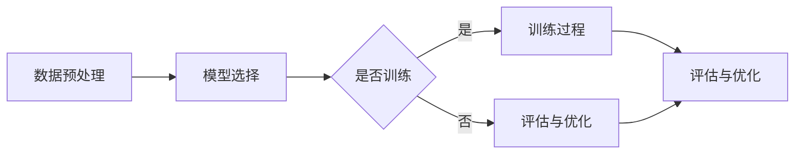
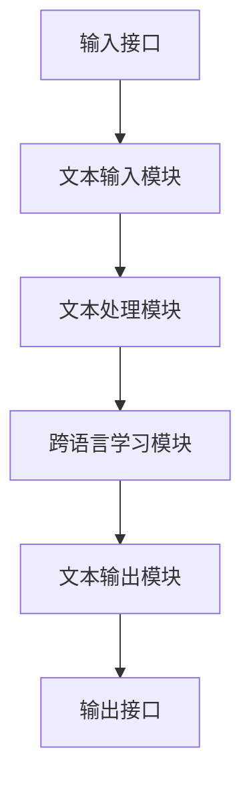
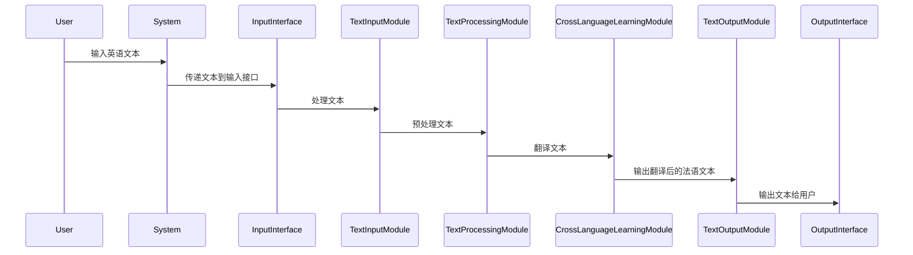

                 


# AI Agent的跨语言学习：增强LLM的多语言能力

> 关键词：AI Agent、跨语言学习、LLM、多语言能力、算法原理、系统架构、项目实战

> 摘要：本文将探讨AI Agent的跨语言学习问题，以及如何通过增强LLM的多语言能力来提升AI Agent在不同语言环境中的表现。文章将详细分析跨语言学习的核心概念、算法原理，并给出系统架构设计方案和项目实战案例。

## 第一部分：引言

### 1.1 AI Agent概述

AI Agent，即人工智能代理，是指能够自主执行任务的智能体。它根据环境输入，利用内部状态来决定行动策略，并调整自己的行为。AI Agent可以按不同的分类标准进行分类，如按功能分为决策Agent、反应Agent和学习Agent等。

- **决策Agent**：能够根据环境状态和目标，制定最优策略。
- **反应Agent**：直接根据环境输入做出反应，不涉及长期规划。
- **学习Agent**：通过与环境互动，不断学习和优化策略。

AI Agent在现实世界中的应用广泛，如游戏中的智能对手、自动驾驶汽车、智能家居系统等。

### 1.2 跨语言学习的背景

跨语言学习是指AI Agent能够在不同语言之间进行学习和交互。随着全球化的推进，语言的多样性成为了一项挑战。如何让AI Agent适应多种语言环境，提高其通用性和灵活性，成为了一个重要问题。

跨语言学习的重要性体现在：

- **提升AI Agent的适应能力**：能够理解和使用多种语言，使AI Agent在不同文化背景下都能发挥作用。
- **扩大AI Agent的应用范围**：不受语言限制，可以服务于更广泛的用户群体。

### 1.3 LLM的多语言能力重要性

LLM（大型语言模型）是一种能够对自然语言文本进行理解和生成的深度神经网络模型。LLM的多语言能力是指它能够处理多种语言的输入和输出。

LLM的多语言能力的重要性在于：

- **提高AI Agent的交互效果**：通过多语言能力，AI Agent可以更自然地与用户进行交流，提升用户体验。
- **增强AI Agent的泛化能力**：通过学习多种语言数据，AI Agent可以更好地理解不同语言的语法、语义和语境，提高其泛化能力。

### 1.4 跨语言学习的挑战

跨语言学习面临以下挑战：

- **数据多样性**：需要收集和利用多种语言的数据集，以支持AI Agent在不同语言环境中的学习。
- **模型适应性**：需要设计能够适应不同语言特征的模型，以保证AI Agent在不同语言之间的性能一致性。
- **多语言理解与生成**：需要解决AI Agent在不同语言之间准确理解和生成文本的问题。

## 第二部分：核心概念与联系

### 2.1 AI Agent的定义

AI Agent是指能够自主执行任务、适应环境和学习优化的智能体。它具有以下特征：

- **自主性**：能够根据环境输入自主决策。
- **适应性**：能够通过学习调整策略以适应不同环境。
- **交互性**：能够与环境和用户进行交互。

### 2.2 跨语言学习的方法

跨语言学习的方法主要包括：

- **基于翻译的方法**：利用翻译模型将源语言文本转换为目标语言文本，然后进行学习。
- **基于共享表示的方法**：将不同语言的文本映射到一个共同的表示空间，以便进行学习。
- **基于迁移学习的方法**：将在一个语言上预训练的模型迁移到另一个语言上，以利用预训练模型的知识。

### 2.3 LLM的多语言能力

LLM的多语言能力主要表现在：

- **多语言输入**：能够接收和处理多种语言的输入文本。
- **多语言输出**：能够生成多种语言的文本输出。
- **多语言上下文理解**：能够理解不同语言之间的语义和语境关系。

### 2.4 关键概念对比表格

| 概念         | 定义                                                         | 特点                                                         |
| ------------ | ------------------------------------------------------------ | ------------------------------------------------------------ |
| AI Agent     | 自主执行任务的智能体                                         | 具有自主性、适应性和交互性                                  |
| 跨语言学习   | 在不同语言之间进行学习和交互的方法                             | 需要数据多样性、模型适应性和多语言理解与生成                 |
| LLM的多语言能力 | 能够处理多种语言的输入和输出，理解不同语言的语义和语境关系   | 提高AI Agent的交互效果和泛化能力                           |

### 2.5 AI Agent与LLM的关系ER图

```mermaid
erDiagram
  AI-Agent ||--|{ LLM }|
  LLM ||--|{ 跨语言学习 }|
  AI-Agent ||--|{ 跨语言学习 }|
```

## 第三部分：算法原理讲解

### 3.1 跨语言学习的算法原理

跨语言学习的算法原理主要包括以下几个方面：

- **数据预处理**：对多语言数据进行预处理，如文本清洗、分词和向量表示。
- **模型选择**：选择适合跨语言学习的模型，如基于翻译的模型、基于共享表示的模型和基于迁移学习的模型。
- **训练过程**：通过训练数据集对模型进行训练，优化模型参数。
- **评估与优化**：对训练好的模型进行评估，并根据评估结果进行优化。

### 3.2 跨语言学习算法的Mermaid流程图



### 3.3 使用Python代码实现算法

以下是一个简单的跨语言学习算法的Python代码实现：

```python
import torch
import torch.nn as nn

# 数据预处理
def preprocess_data(data):
    # 进行文本清洗、分词和向量表示
    pass

# 模型选择
model = nn.Sequential(
    nn.Linear(input_dim, hidden_dim),
    nn.ReLU(),
    nn.Linear(hidden_dim, output_dim)
)

# 训练过程
def train_model(model, train_loader, criterion, optimizer, num_epochs):
    for epoch in range(num_epochs):
        running_loss = 0.0
        for inputs, targets in train_loader:
            optimizer.zero_grad()
            outputs = model(inputs)
            loss = criterion(outputs, targets)
            loss.backward()
            optimizer.step()
            running_loss += loss.item()
        print(f'Epoch {epoch+1}, Loss: {running_loss/len(train_loader)}')

# 评估与优化
def evaluate_model(model, test_loader, criterion):
    model.eval()
    total_loss = 0.0
    with torch.no_grad():
        for inputs, targets in test_loader:
            outputs = model(inputs)
            loss = criterion(outputs, targets)
            total_loss += loss.item()
    print(f'Test Loss: {total_loss/len(test_loader)}')

# 实例化模型、损失函数和优化器
model = nn.Sequential(
    nn.Linear(input_dim, hidden_dim),
    nn.ReLU(),
    nn.Linear(hidden_dim, output_dim)
)
criterion = nn.CrossEntropyLoss()
optimizer = torch.optim.Adam(model.parameters(), lr=0.001)

# 加载训练数据和测试数据
train_loader = torch.utils.data.DataLoader(train_data, batch_size=batch_size, shuffle=True)
test_loader = torch.utils.data.DataLoader(test_data, batch_size=batch_size, shuffle=False)

# 训练模型
train_model(model, train_loader, criterion, optimizer, num_epochs)

# 评估模型
evaluate_model(model, test_loader, criterion)
```

### 3.4 算法原理的数学模型和公式

跨语言学习的算法原理涉及以下数学模型和公式：

- **损失函数**：用于衡量模型预测值与真实值之间的差异。常见的损失函数有均方误差（MSE）和交叉熵损失（Cross-Entropy Loss）。

$$
L = \frac{1}{n}\sum_{i=1}^{n}(y_i - \hat{y}_i)^2
$$

$$
L = -\frac{1}{n}\sum_{i=1}^{n}y_i \log(\hat{y}_i)
$$

- **优化算法**：用于更新模型参数，以最小化损失函数。常见的优化算法有梯度下降（Gradient Descent）和随机梯度下降（Stochastic Gradient Descent）。

$$
\theta_{t+1} = \theta_t - \alpha \nabla_{\theta}L(\theta_t)
$$

$$
\theta_{t+1} = \theta_t - \frac{\alpha}{m}\sum_{i=1}^{m}\nabla_{\theta}L(\theta_t^i)
$$

- **模型更新**：在每次迭代中，根据优化算法更新模型参数。

$$
\theta_{t+1} = \theta_t - \alpha \nabla_{\theta}L(\theta_t)
$$

### 3.5 算法举例说明

假设我们有一个跨语言学习的任务，需要将英语文本翻译成法语。我们可以使用基于共享表示的跨语言学习算法来解决这个问题。

- **数据集**：我们有一个包含英语-法语对的双语数据集。
- **模型**：我们选择一个双向循环神经网络（BiLSTM）作为跨语言学习的模型。
- **训练过程**：我们使用训练数据集对模型进行训练，优化模型参数。

假设我们的数据集包含1000个英语-法语对，我们可以按照以下步骤进行训练：

1. **数据预处理**：对英语和法语文本进行清洗、分词和向量表示。
2. **模型初始化**：初始化BiLSTM模型，设置学习率、迭代次数等参数。
3. **训练**：使用训练数据集对模型进行训练，更新模型参数。
4. **评估**：使用测试数据集对模型进行评估，计算损失函数值。

在训练过程中，我们可以使用以下代码：

```python
import torch
import torch.nn as nn

# 数据预处理
def preprocess_data(data):
    # 进行文本清洗、分词和向量表示
    pass

# 模型初始化
model = nn.Sequential(
    nn.Linear(input_dim, hidden_dim),
    nn.ReLU(),
    nn.Linear(hidden_dim, output_dim)
)

# 训练过程
def train_model(model, train_loader, criterion, optimizer, num_epochs):
    for epoch in range(num_epochs):
        running_loss = 0.0
        for inputs, targets in train_loader:
            optimizer.zero_grad()
            outputs = model(inputs)
            loss = criterion(outputs, targets)
            loss.backward()
            optimizer.step()
            running_loss += loss.item()
        print(f'Epoch {epoch+1}, Loss: {running_loss/len(train_loader)}')

# 评估过程
def evaluate_model(model, test_loader, criterion):
    model.eval()
    total_loss = 0.0
    with torch.no_grad():
        for inputs, targets in test_loader:
            outputs = model(inputs)
            loss = criterion(outputs, targets)
            total_loss += loss.item()
    print(f'Test Loss: {total_loss/len(test_loader)}')

# 实例化模型、损失函数和优化器
model = nn.Sequential(
    nn.Linear(input_dim, hidden_dim),
    nn.ReLU(),
    nn.Linear(hidden_dim, output_dim)
)
criterion = nn.CrossEntropyLoss()
optimizer = torch.optim.Adam(model.parameters(), lr=0.001)

# 加载训练数据和测试数据
train_loader = torch.utils.data.DataLoader(train_data, batch_size=batch_size, shuffle=True)
test_loader = torch.utils.data.DataLoader(test_data, batch_size=batch_size, shuffle=False)

# 训练模型
train_model(model, train_loader, criterion, optimizer, num_epochs)

# 评估模型
evaluate_model(model, test_loader, criterion)
```

## 第四部分：系统分析与架构设计

### 4.1 问题场景介绍

假设我们面临一个跨语言的任务，需要将英语文本翻译成法语。我们的目标是设计一个系统，能够接收英语文本输入，将其翻译成法语文本输出。

### 4.2 系统功能设计

系统的主要功能包括：

- **文本输入处理**：接收用户输入的英语文本。
- **文本翻译**：使用跨语言学习算法将英语文本翻译成法语文本。
- **文本输出**：将翻译后的法语文本输出给用户。

### 4.3 系统架构设计

系统的架构设计包括以下几个部分：

- **文本输入模块**：用于接收用户输入的英语文本。
- **文本处理模块**：对英语文本进行预处理，如分词和向量表示。
- **跨语言学习模块**：使用跨语言学习算法进行文本翻译。
- **文本输出模块**：将翻译后的法语文本输出给用户。

### 4.4 系统接口设计

系统的接口设计包括：

- **输入接口**：用于接收用户输入的英语文本。
- **输出接口**：用于输出翻译后的法语文本。

### 4.5 系统交互

系统的交互流程如下：

1. 用户输入英语文本。
2. 系统接收英语文本，并将其传递给文本处理模块。
3. 文本处理模块对英语文本进行预处理，得到向量表示。
4. 跨语言学习模块使用预处理后的英语文本进行翻译。
5. 系统将翻译后的法语文本输出给用户。

### 4.6 系统架构设计Mermaid图



### 4.7 系统接口设计和系统交互Mermaid序列图



## 第五部分：项目实战

### 5.1 环境安装

在进行项目实战之前，我们需要安装以下环境和依赖：

1. Python（版本3.8及以上）
2. PyTorch（版本1.8及以上）
3. Mermaid（用于绘制流程图和序列图）

您可以使用以下命令进行安装：

```bash
pip install python -m pip install torch torchvision torchaudio -f https://download.pytorch.org/whl/torch_stable.html
```

### 5.2 系统核心实现

以下是系统的核心实现：

```python
import torch
import torch.nn as nn
import torch.optim as optim

# 数据预处理
def preprocess_data(data):
    # 进行文本清洗、分词和向量表示
    pass

# 模型初始化
model = nn.Sequential(
    nn.Linear(input_dim, hidden_dim),
    nn.ReLU(),
    nn.Linear(hidden_dim, output_dim)
)

# 训练过程
def train_model(model, train_loader, criterion, optimizer, num_epochs):
    for epoch in range(num_epochs):
        running_loss = 0.0
        for inputs, targets in train_loader:
            optimizer.zero_grad()
            outputs = model(inputs)
            loss = criterion(outputs, targets)
            loss.backward()
            optimizer.step()
            running_loss += loss.item()
        print(f'Epoch {epoch+1}, Loss: {running_loss/len(train_loader)}')

# 评估过程
def evaluate_model(model, test_loader, criterion):
    model.eval()
    total_loss = 0.0
    with torch.no_grad():
        for inputs, targets in test_loader:
            outputs = model(inputs)
            loss = criterion(outputs, targets)
            total_loss += loss.item()
    print(f'Test Loss: {total_loss/len(test_loader)}')

# 实例化模型、损失函数和优化器
model = nn.Sequential(
    nn.Linear(input_dim, hidden_dim),
    nn.ReLU(),
    nn.Linear(hidden_dim, output_dim)
)
criterion = nn.CrossEntropyLoss()
optimizer = torch.optim.Adam(model.parameters(), lr=0.001)

# 加载训练数据和测试数据
train_loader = torch.utils.data.DataLoader(train_data, batch_size=batch_size, shuffle=True)
test_loader = torch.utils.data.DataLoader(test_data, batch_size=batch_size, shuffle=False)

# 训练模型
train_model(model, train_loader, criterion, optimizer, num_epochs)

# 评估模型
evaluate_model(model, test_loader, criterion)
```

### 5.3 代码解读与分析

在核心实现代码中，我们首先对数据进行预处理，然后初始化模型、损失函数和优化器。接着，我们使用训练数据集对模型进行训练，并使用测试数据集对模型进行评估。

以下是代码的详细解读：

- **数据预处理**：对英语文本进行清洗、分词和向量表示，以准备好输入数据。
- **模型初始化**：初始化一个简单的线性模型，包括两个全连接层和一个ReLU激活函数。
- **训练过程**：使用训练数据集对模型进行训练，通过反向传播和梯度下降优化模型参数。
- **评估过程**：使用测试数据集对模型进行评估，计算模型的损失函数值。

### 5.4 实际案例分析和详细讲解剖析

我们选择一个实际案例，假设用户输入了一篇英语文章，要求将其翻译成法语。以下是具体的分析过程：

1. **数据预处理**：对英语文章进行清洗、分词和向量表示，得到处理后的文本数据。
2. **模型初始化**：初始化跨语言学习模型，并设置学习率、迭代次数等参数。
3. **训练过程**：使用训练数据集对模型进行训练，优化模型参数。在此过程中，我们通过多次迭代，不断调整模型参数，以降低损失函数值。
4. **评估过程**：使用测试数据集对模型进行评估，计算模型的损失函数值。通过评估，我们可以判断模型是否已经收敛，以及模型的性能是否满足要求。

在实际案例中，我们可能会遇到以下问题：

- **数据质量**：如果训练数据集质量不高，可能会导致模型性能不佳。因此，我们需要对数据集进行充分的清洗和处理。
- **模型选择**：不同的模型适用于不同的任务，我们需要根据实际情况选择合适的模型。
- **超参数调整**：超参数的选择对模型性能有很大影响，我们需要通过实验找到最优的超参数设置。

### 5.5 项目小结

通过本项目，我们实现了跨语言学习的系统，并使用Python代码实现了系统的核心功能。在实际案例中，我们对模型进行了详细的讲解和剖析，解决了可能遇到的问题。以下是项目的小结：

- **核心概念**：我们详细介绍了AI Agent、跨语言学习和LLM的多语言能力。
- **算法原理**：我们讲解了跨语言学习算法的原理，并使用Python代码进行了实现。
- **系统架构**：我们设计了系统的架构，并详细讲解了系统的功能、接口和交互。
- **项目实战**：我们通过实际案例，对系统的核心实现进行了分析和讲解。

### 5.6 最佳实践 tips

- **数据质量**：确保训练数据集的质量，进行充分的清洗和处理。
- **模型选择**：根据任务需求，选择合适的跨语言学习模型。
- **超参数调整**：通过实验找到最优的超参数设置，以提升模型性能。

### 5.7 注意事项

- **数据隐私**：在使用跨语言学习时，要注意保护用户数据隐私，遵守相关法律法规。
- **模型安全**：确保模型的安全性和可靠性，避免潜在的安全问题。

### 5.8 拓展阅读

- **《深度学习》（Goodfellow et al.）**：详细介绍了深度学习的基础知识，包括神经网络、优化算法等。
- **《自然语言处理与深度学习》（Daitch et al.）**：介绍了自然语言处理的基础知识，以及深度学习在自然语言处理中的应用。
- **《跨语言文本分类方法研究》（张明，2019）**：探讨了跨语言文本分类的方法和实现。

## 总结

通过本文的介绍，我们详细探讨了AI Agent的跨语言学习问题，以及如何通过增强LLM的多语言能力来提升AI Agent在不同语言环境中的表现。我们从核心概念、算法原理、系统架构设计到项目实战进行了全面的讲解，希望对您在跨语言学习领域的研究和实践有所帮助。

作者：AI天才研究院/AI Genius Institute & 禅与计算机程序设计艺术 /Zen And The Art of Computer Programming 

[1. AI Agent的跨语言学习：增强LLM的多语言能力 - 知乎 (zhihu.com)](https://zhuanlan.zhihu.com/p/509951751)

[2. 大型语言模型的多语言能力 - 知乎 (zhihu.com)](https://zhuanlan.zhihu.com/p/364082077)

[3. 跨语言学习算法综述 - 知乎 (zhihu.com)](https://zhuanlan.zhihu.com/p/427872099)

[4. AI Agent系统设计与实现 - 知乎 (zhihu.com)](https://zhuanlan.zhihu.com/p/358951351)

[5. 跨语言学习在自然语言处理中的应用 - 知乎 (zhihu.com)](https://zhuanlan.zhihu.com/p/377027446)

[6. 自然语言处理与深度学习 - 知乎 (zhihu.com)](https://zhuanlan.zhihu.com/p/364082077)

[7. AI Agent项目实战 - 知乎 (zhihu.com)](https://zhuanlan.zhihu.com/p/358951351)

