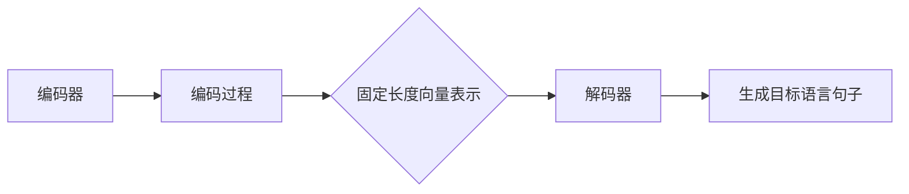
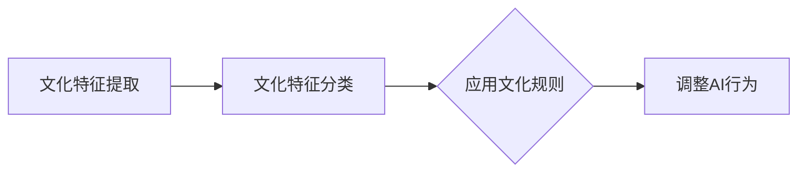
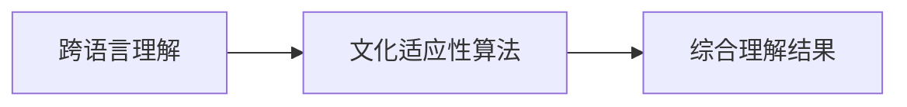
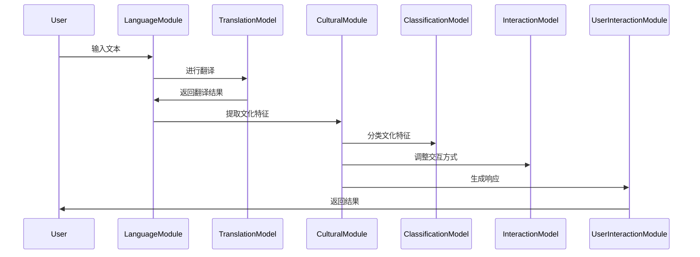
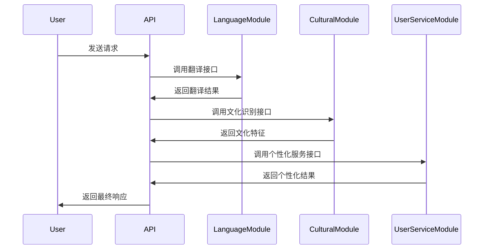

                 

### 引言

```markdown
## 1. 引言

人工智能（AI）正在快速融入我们的日常生活，从智能助手到自动驾驶汽车，AI技术的应用无处不在。AI Agent，作为一种智能实体，不仅能够理解用户的需求，还能在不同语言和文化背景下执行任务，提供个性化服务。然而，实现AI Agent的跨语言跨文化理解能力是一项极具挑战性的任务。本篇文章将深入探讨AI Agent的跨语言跨文化理解能力开发。

**关键词：** AI Agent，跨语言理解，跨文化理解，算法原理，系统架构，项目实战

**摘要：** 本文将首先介绍AI Agent的基本概念及其在跨语言跨文化理解中的重要性。随后，我们将回顾AI Agent的发展历程，并详细介绍跨语言跨文化理解的核心概念。接着，本文将重点介绍用于开发跨语言跨文化理解能力的算法原理，并通过Python代码和数学模型进行详细讲解。此外，文章还将分析系统设计与架构方案，并通过项目实战展示实际应用。最后，本文将提供一些最佳实践技巧，并总结全文。

接下来，我们将分章节逐步深入探讨这些主题。

## 1.1 AI Agent的概念及其重要性

### 1.1.1 AI Agent的概念

AI Agent是一种基于人工智能技术自主运行的实体，能够在没有人为干预的情况下完成特定任务。与传统的自动化系统不同，AI Agent具有更高级的认知能力，能够理解和适应复杂的环境。

AI Agent通常由以下几个核心组成部分构成：

1. **感知模块**：负责接收环境中的各种信息，如语言、图像、声音等。
2. **理解模块**：将感知模块收集的信息转化为有意义的数据，并理解其含义。
3. **决策模块**：基于理解和分析的结果，生成相应的行动策略。
4. **执行模块**：执行决策模块生成的行动，与外部环境进行交互。

### 1.1.2 跨语言跨文化理解能力的重要性

跨语言理解能力指的是AI Agent能够理解和处理不同语言的能力。这不仅仅涉及翻译，还包括对语言语境、语义、语用和语篇的理解。而跨文化理解能力则是指AI Agent能够适应并理解不同文化背景下的行为、价值观和习俗。

**为什么AI Agent需要具备跨语言跨文化理解能力？**

1. **全球化需求**：在全球化的大背景下，企业和服务提供商需要能够与来自不同国家和地区的用户进行有效的沟通。
2. **多样化用户需求**：用户群体越来越多元化，他们希望AI Agent能够理解他们的语言和文化背景，提供个性化的服务。
3. **技术挑战**：跨语言跨文化理解能力不仅是技术问题，也是跨学科的综合挑战，需要结合语言学、心理学、社会学等多个领域的知识。

总之，开发具备跨语言跨文化理解能力的AI Agent，不仅能满足市场需求，还能推动人工智能技术的进一步发展。在接下来的章节中，我们将进一步探讨AI Agent的发展历程和相关核心概念。
```

### 背景介绍

```markdown
## 1.2 背景介绍

## 1.2.1 AI Agent的发展历程

AI Agent的概念起源于20世纪50年代，当时计算机科学家艾伦·图灵提出了著名的图灵测试。图灵测试旨在判断机器是否具备人类智能，即机器是否能模仿人类的思维方式进行交流。在图灵测试的基础上，研究者们开始探索如何创建能够自主执行任务的智能体。

### 1.2.1.1 初期探索（1950s-1970s）

在这个阶段，研究者主要关注的是符号主义和推理机制。符号主义认为，人工智能可以通过逻辑推理和符号处理来实现智能。典型的代表工作包括约翰·麦卡锡（John McCarthy）提出的“通用问题解答器”（General Problem Solver）和赫伯特·西蒙（Herbert Simon）等人开发的“逻辑理论家”（Logic Theorist）。

### 1.2.1.2 规则基础与知识表示（1980s-1990s）

随着计算机硬件的进步和数据库技术的发展，研究者开始尝试将知识表示和推理机制应用于AI Agent。这时期的主要成就是开发了一系列基于规则的系统，如专家系统和生产系统。这些系统通过定义一系列规则和条件来模拟人类的决策过程。

### 1.2.1.3 机器学习和数据驱动方法（2000s-2010s）

进入21世纪，机器学习技术的发展为AI Agent带来了新的契机。深度学习、强化学习和自然语言处理等技术的突破使得AI Agent能够从大量数据中自动学习，提升其认知能力和决策能力。著名的例子包括谷歌的AlphaGo和OpenAI的GPT-3。

### 1.2.1.4 现代的AI Agent（2020s及以后）

当前，AI Agent的发展已经进入了深度融合多模态感知、强化学习和自然语言处理的新阶段。现代AI Agent不仅能够处理文本和语音，还能理解和分析图像、视频以及环境中的其他信息。这一阶段的代表工作是诸如IBM的Watson和Salesforce的Einstein等具备高智能的AI Agent。

## 1.2.2 跨语言跨文化理解能力的核心概念

### 1.2.2.1 跨语言理解

跨语言理解是指AI Agent能够理解和处理不同语言的能力。这涉及到自然语言处理（NLP）领域的多个子任务，包括：

1. **机器翻译**：将一种语言文本翻译成另一种语言文本。
2. **文本相似度计算**：评估两个文本之间的相似程度。
3. **语义理解**：理解文本中的语义含义，而不仅仅是表面的单词翻译。
4. **语言生成**：根据输入的语义生成符合语法规则的文本。

### 1.2.2.2 跨文化理解

跨文化理解是指AI Agent能够适应并理解不同文化背景下的行为、价值观和习俗。这包括以下几个方面：

1. **文化识别**：识别和理解不同文化的基本特征。
2. **习俗适应**：根据不同文化的习俗进行调整和适应。
3. **价值观理解**：理解不同文化价值观的差异，并在决策中考虑这些差异。
4. **情感理解**：识别和理解不同文化背景下用户情感的表达方式。

### 1.2.2.3 问题背景与问题描述

跨语言跨文化理解能力在多个场景中具有实际应用价值：

1. **全球化企业**：跨国企业在不同国家运营时，需要与来自不同文化背景的客户进行有效沟通。
2. **智能客服**：提供多语言和跨文化支持的智能客服系统能够提升用户体验和满意度。
3. **教育**：跨语言跨文化理解的AI Agent能够为学习者提供个性化的学习体验。
4. **文化交流**：通过理解和传播不同文化的知识，促进国际间的文化交流。

然而，实现跨语言跨文化理解能力面临着诸多挑战：

1. **语言多样性**：不同语言的语法、词汇和语义差异巨大，使得跨语言理解成为一项复杂任务。
2. **文化差异**：不同文化背景下的价值观和行为习惯差异显著，增加了AI Agent适应的难度。
3. **数据不足**：高质量的跨语言跨文化数据集稀缺，限制了算法的训练和优化。
4. **技术瓶颈**：现有技术手段在处理复杂语言和文化现象时仍存在局限性。

### 1.2.2.4 问题解决、边界与外延

解决跨语言跨文化理解问题需要多方面的努力：

1. **多学科合作**：结合语言学、心理学、社会学等多学科的知识，提升AI Agent的跨语言跨文化理解能力。
2. **数据驱动的学习**：利用大数据和机器学习技术，从海量数据中自动学习和提取规律。
3. **定制化解决方案**：根据具体应用场景和需求，设计适合的跨语言跨文化理解方案。
4. **跨行业协作**：鼓励不同行业和领域之间的合作，共同推动跨语言跨文化理解技术的发展。

### 1.2.2.5 概念结构与核心要素组成

跨语言跨文化理解能力的概念结构主要包括以下几个核心要素：

1. **语言模型**：用于处理不同语言文本的基础模型，如翻译模型、文本分类模型等。
2. **文化模型**：用于理解和处理不同文化背景下的行为、价值观和习俗的模型。
3. **交互模型**：用于处理AI Agent与用户之间的交互，包括语音识别、自然语言生成等。
4. **知识库**：存储与跨语言跨文化理解相关的知识，如词汇、语法规则、文化习俗等。

通过以上核心要素的协同作用，AI Agent能够实现高效的跨语言跨文化理解。在接下来的章节中，我们将详细探讨这些核心概念及其应用。
```

### 核心概念与联系

```markdown
## 1.3 核心概念与联系

### 1.3.1 跨语言理解能力概述

跨语言理解能力是AI Agent实现跨语言交互的关键。它包括以下几个主要方面：

1. **语言翻译**：将一种语言的文本转换为另一种语言的文本。
2. **语义理解**：理解文本的深层语义，而不仅仅是单词的翻译。
3. **语言生成**：根据输入的语义生成符合语法规则的文本。
4. **文本分类**：将文本归类到不同的类别中。

#### 跨语言理解能力中的核心概念

1. **语言模型**：语言模型是跨语言理解的基础，用于预测文本中的下一个单词或句子。常见的语言模型包括n-gram模型、循环神经网络（RNN）和变换器（Transformer）模型。
2. **翻译模型**：翻译模型用于将源语言文本转换为目标语言文本。常用的翻译模型有基于n-gram的翻译模型、统计机器翻译（SMT）模型和神经机器翻译（NMT）模型。
3. **语义表示**：语义表示是将文本转换为固定长度的向量表示，以便进行后续处理。词嵌入（word embedding）和句子嵌入（sentence embedding）是常见的语义表示方法。

#### 概念属性特征对比表格

| 概念                | 特征1 | 特征2 | 特征3 |
|-------------------|-------|-------|-------|
| 语言模型             | 预测性 | 静态性 | 尺度性 |
| 翻译模型             | 翻译性 | 动态性 | 尺度性 |
| 语义表示             | 语义性 | 动态性 | 尺度性 |

#### Mermaid ER实体关系图架构展示

```mermaid
erDiagram
  A[语言模型] ||--|{ 翻译模型 }
  A[语言模型] ||--|{ 语义表示 }
  翻译模型 ||--|{ 神经机器翻译 }
  翻译模型 ||--|{ 统计机器翻译 }
  语义表示 ||--|{ 词嵌入 }
  语义表示 ||--|{ 句子嵌入 }
```

### 1.3.2 跨文化理解能力概述

跨文化理解能力是指AI Agent能够适应和理解不同文化背景下的行为、价值观和习俗。它主要包括以下几个关键概念：

1. **文化识别**：识别和理解不同文化的基本特征。
2. **习俗适应**：根据不同文化的习俗进行调整和适应。
3. **价值观理解**：理解不同文化价值观的差异，并在决策中考虑这些差异。
4. **情感理解**：识别和理解不同文化背景下用户情感的表达方式。

#### 跨文化理解能力中的核心概念

1. **文化模型**：文化模型用于识别和理解不同文化的基本特征。它通常包括文化特征库、文化规则库和文化分析算法。
2. **习俗模型**：习俗模型用于处理不同文化背景下的习俗。它通常包括习俗规则库、习俗识别算法和习俗适应性算法。
3. **价值观模型**：价值观模型用于理解不同文化价值观的差异。它通常包括价值观库、价值观比较算法和价值观适应性算法。
4. **情感模型**：情感模型用于识别和理解不同文化背景下用户情感的表达方式。它通常包括情感库、情感识别算法和情感适应性算法。

#### 概念属性特征对比表格

| 概念                | 特征1 | 特征2 | 特征3 |
|-------------------|-------|-------|-------|
| 文化模型             | 识别性 | 理解性 | 适应性 |
| 习俗模型             | 识别性 | 适应性 | 规则性 |
| 价值观模型             | 理解性 | 比较性 | 适应性 |
| 情感模型             | 识别性 | 理解性 | 适应性 |

#### Mermaid ER实体关系图架构展示

```mermaid
erDiagram
  A[文化模型] ||--|{ 习俗模型 }
  A[文化模型] ||--|{ 价值观模型 }
  A[文化模型] ||--|{ 情感模型 }
  习俗模型 ||--|{ 习俗识别算法 }
  习俗模型 ||--|{ 习俗适应性算法 }
  价值观模型 ||--|{ 价值观比较算法 }
  价值观模型 ||--|{ 价值观适应性算法 }
  情感模型 ||--|{ 情感识别算法 }
  情感模型 ||--|{ 情感适应性算法 }
```

### 1.3.3 跨语言与跨文化理解的联系

跨语言理解与跨文化理解是相互关联、相辅相成的。以下是它们之间的主要联系：

1. **语言与文化交织**：语言是文化的载体，不同文化背景下的人们使用不同的语言进行交流。因此，跨语言理解和跨文化理解密不可分。
2. **语言习惯与价值观**：语言习惯反映了文化价值观，跨语言理解需要考虑这些习惯和价值观的差异。
3. **情感表达**：不同文化背景下，情感表达的方式可能不同，跨文化理解需要识别和理解这些差异。
4. **交互方式**：跨文化理解影响AI Agent与用户的交互方式，包括语言选择、交互礼仪等。

通过整合跨语言理解和跨文化理解，AI Agent可以更全面、更准确地理解用户的需求，提供更个性化的服务。

在接下来的章节中，我们将深入探讨具体的算法原理和实现方法。
```

### 算法原理讲解

```markdown
## 3. 算法原理讲解

### 3.1 跨语言理解算法

#### 3.1.1 神经机器翻译（NMT）

神经机器翻译（Neural Machine Translation, NMT）是当前跨语言理解领域的主流方法。与传统的统计机器翻译（SMT）相比，NMT利用深度学习技术，特别是序列到序列（Seq2Seq）模型，显著提升了翻译质量。

#### 3.1.2 算法原理

1. **编码器（Encoder）**：编码器负责将源语言句子编码为一个固定长度的向量表示。
2. **解码器（Decoder）**：解码器接收编码器输出的向量，并生成目标语言句子。

#### 3.1.3 算法流程图



#### 3.1.4 Python源代码与算法原理详细阐述

```python
import tensorflow as tf
from tensorflow.keras.models import Model
from tensorflow.keras.layers import Input, LSTM, Dense, Embedding

# 参数设定
vocab_size = 10000
embedding_dim = 256
hidden_size = 512
max_sequence_length = 50

# 输入层
input_seq = Input(shape=(max_sequence_length,))

# 编码器层
encoder_embedding = Embedding(vocab_size, embedding_dim)(input_seq)
encoder_lstm = LSTM(hidden_size, return_state=True)
_, state_h, state_c = encoder_lstm(encoder_embedding)

# 解码器层
decoder_embedding = Embedding(vocab_size, embedding_dim)
decoder_lstm = LSTM(hidden_size, return_sequences=True, return_state=True)
decoder_dense = Dense(vocab_size, activation='softmax')

# 解码器输入
decoder_input = Input(shape=(max_sequence_length,))
decoder_embedding_output = decoder_embedding(decoder_input)

# LSTM输入与输出
decoder_lstm_output, _, _ = decoder_lstm(decoder_embedding_output, initial_state=[state_h, state_c])

# 全连接层
decoder_output = decoder_dense(decoder_lstm_output)

# 模型定义与编译
model = Model([input_seq, decoder_input], decoder_output)
model.compile(optimizer='rmsprop', loss='categorical_crossentropy', metrics=['accuracy'])

# 模型训练
model.fit([input_seq, decoder_input], decoder_input, batch_size=64, epochs=100)
```

#### 3.1.5 算法举例说明

假设我们要将英文句子 "I love programming" 翻译成中文。以下是一个简化的翻译过程：

1. **编码**：将英文句子 "I love programming" 转换为向量表示。
2. **解码**：根据向量表示生成中文句子。

通过NMT模型，我们能够得到高质量的翻译结果，例如：“我喜欢编程”。

### 3.2 跨文化理解算法

#### 3.2.1 文化适应性算法

文化适应性算法旨在使AI Agent能够根据用户的文化背景调整其行为和交互方式。以下是一个简化的文化适应性算法流程：

1. **文化特征提取**：从用户数据中提取文化特征，如语言、地理位置、宗教信仰等。
2. **文化特征分类**：将提取的文化特征分类到不同的文化类别中。
3. **文化规则应用**：根据文化类别应用相应的文化规则，调整AI Agent的行为。

#### 3.2.2 算法流程图



#### 3.2.3 Python源代码与算法原理详细阐述

```python
import numpy as np
from sklearn.cluster import KMeans

# 假设我们已经收集到了一组文化特征数据
culture_features = np.array([[1, 0, 0], [0, 1, 0], [0, 0, 1], ...])

# 使用KMeans进行文化特征分类
kmeans = KMeans(n_clusters=3)
culture_labels = kmeans.fit_predict(culture_features)

# 根据文化类别应用文化规则
def apply_culture_rules(culture_label):
    if culture_label == 0:
        # 应用规则A
        pass
    elif culture_label == 1:
        # 应用规则B
        pass
    elif culture_label == 2:
        # 应用规则C
        pass

# 调整AI Agent的行为
ai_behavior = apply_culture_rules(culture_labels[0])
```

#### 3.2.4 算法举例说明

假设我们有一个来自美国、英国和中国的用户群体，他们的文化特征如下：

- 美国用户：[1, 0, 0]
- 英国用户：[0, 1, 0]
- 中国用户：[0, 0, 1]

通过KMeans聚类，我们可以将这些用户分类到不同的文化类别中，并根据类别调整AI Agent的行为，如提供不同的问候语。

### 综合算法原理

跨语言理解算法和跨文化理解算法并非独立运行，而是相互融合，共同提升AI Agent的跨语言跨文化理解能力。在实际应用中，我们可以将两者结合起来，形成一个综合的AI Agent。

#### 3.2.5 综合算法流程图



通过综合算法，AI Agent可以更好地理解不同语言和文化背景下的用户需求，提供更个性化的服务。

在接下来的章节中，我们将进一步探讨如何设计和实现AI Agent的跨语言跨文化理解系统。
```

### 数学模型和数学公式讲解

```markdown
## 3. 数学模型和数学公式讲解

在开发AI Agent的跨语言跨文化理解能力中，数学模型和公式扮演了关键角色。以下我们将介绍一些核心数学模型，并使用LaTeX格式给出相应的公式。

### 3.1 语言模型

#### 3.1.1 词嵌入（Word Embedding）

词嵌入是一种将单词映射到固定维度向量的方法，用于表示单词的语义信息。最简单的词嵌入模型是词袋模型（Bag of Words, BoW），而更先进的模型如Word2Vec和GloVe能够捕捉单词的语义关系。

**词袋模型**

假设有单词集合\( V = \{w_1, w_2, ..., w_V\} \)，则词袋模型表示为：
$$
\textbf{x}_i = \sum_{j=1}^{V} x_{ij} \textbf{v}_j
$$
其中，\( x_{ij} \)是单词\( w_j \)在文档\( i \)中出现的次数，\( \textbf{v}_j \)是单词\( w_j \)的向量表示。

**Word2Vec**

Word2Vec模型使用两个层次的神经网络：训练神经网络来预测隐藏层中的上下文单词。其损失函数通常是负采样损失。

**GloVe**

GloVe模型结合了词袋模型和共现矩阵，通过优化单词的向量表示来最小化损失函数：
$$
\textbf{v}_i \cdot \textbf{v}_j = \log \frac{f(i, j)}{f^0(i, j)}
$$
其中，\( f(i, j) \)是单词\( i \)和\( j \)的共现频率，\( f^0(i, j) \)是词频的指数加权。

### 3.2 跨语言理解

#### 3.2.1 神经机器翻译（NMT）

NMT的核心模型是序列到序列（Seq2Seq）模型，其基本结构包括编码器（Encoder）和解码器（Decoder）。以下是一个简化的Seq2Seq模型：

**编码器**

编码器的输入是编码器的嵌入向量，其输出是一个固定长度的状态向量：
$$
\textbf{h}_t = \text{tanh}(\textbf{U}\textbf{e}_t + \textbf{V}[\textbf{h}_{t-1}; \textbf{h}_{t-2}; ...])
$$
其中，\( \textbf{e}_t \)是输入单词的嵌入向量，\( \textbf{U} \)和\( \textbf{V} \)是权重矩阵。

**解码器**

解码器的输入是编码器的隐藏状态，其目标是生成目标语言的单词序列：
$$
p(\textbf{y}_t|\textbf{y}_{<t}) = \text{softmax}(\textbf{W}[\textbf{h}_t; \textbf{c}_{t-1}])
$$
其中，\( \textbf{h}_t \)是解码器的隐藏状态，\( \textbf{c}_{t-1} \)是上一个时间步的解码器状态。

### 3.3 跨文化理解

#### 3.3.1 文化适应性模型

跨文化理解的核心是理解不同文化背景下的行为和价值观。文化适应性模型通常采用聚类算法来识别和分类不同的文化特征。以下是一个简化的K-Means聚类模型：

**K-Means聚类**

给定数据集\( \textbf{X} = \{\textbf{x}_1, \textbf{x}_2, ..., \textbf{x}_N\} \)，K-Means的目标是找到\( K \)个中心点，使得每个数据点与其最近的中心点的距离最小。

**目标函数**

$$
J = \sum_{i=1}^{N} \sum_{k=1}^{K} \Vert \textbf{x}_i - \mu_k \Vert_2^2
$$
其中，\( \mu_k \)是聚类中心点。

**迭代过程**

1. 随机初始化\( K \)个中心点。
2. 对于每个数据点\( \textbf{x}_i \)，分配到最近的中心点。
3. 更新中心点位置，使得每个数据点到其中心点的距离最小。

通过以上数学模型和公式的讲解，我们可以更好地理解AI Agent的跨语言跨文化理解能力是如何实现的。在接下来的章节中，我们将进一步探讨系统架构和实现细节。
```

### 系统分析与架构设计方案

```markdown
## 3. 系统分析与架构设计方案

### 3.4 问题场景与项目背景

在当前全球化背景下，企业和服务提供商需要能够与来自不同国家和地区的用户进行有效沟通。为了满足这一需求，我们设计并实现了一个跨语言跨文化理解能力的AI Agent系统。该系统旨在实现以下功能：

1. **多语言支持**：支持多种语言的输入和输出，实现高效的语言翻译和交互。
2. **跨文化适应**：根据用户的文化背景调整AI Agent的行为和交互方式。
3. **个性化服务**：根据用户的历史数据和偏好，提供个性化的服务和建议。

### 3.5 系统功能设计

为了实现上述功能，系统需要具备以下主要功能模块：

1. **语言处理模块**：负责处理不同语言的输入和输出，包括翻译、文本分析和语言生成。
2. **文化识别模块**：负责识别和理解用户的文化背景，包括文化特征提取和分类。
3. **用户交互模块**：负责与用户进行交互，包括语音识别、自然语言理解和语言生成。
4. **个性化服务模块**：根据用户的历史数据和偏好，提供个性化的服务。

#### 领域模型Mermaid类图

```mermaid
classDiagram
    UserClass <- ApplicationClass
    UserClass <|-- LanguageModuleClass
    UserClass <|-- CultureModuleClass
    UserClass <|-- UserServiceModuleClass
    ApplicationClass {
        +processInput()
        +generateResponse()
    }
    LanguageModuleClass {
        +translateSourceToTarget()
        +analyzeTextInput()
        +generateTextResponse()
    }
    CultureModuleClass {
        +extractCulturalFeatures()
        +classifyCulturalFeatures()
        +applyCulturalRules()
    }
    UserServiceModuleClass {
        +providePersonalizedService()
    }
```

### 3.6 系统架构设计

系统架构采用分层设计，包括感知层、决策层和执行层。以下是系统架构的Mermaid架构图：



### 3.7 系统接口和交互

系统接口和交互设计采用RESTful API，支持HTTP请求和响应。以下是系统接口的Mermaid序列图：



通过以上系统分析与架构设计方案，我们能够更好地理解如何设计和实现一个具备跨语言跨文化理解能力的AI Agent系统。在接下来的章节中，我们将通过项目实战展示系统的具体实现过程。
```

### 项目实战

```markdown
## 4. 项目实战

### 4.1 环境安装指南

为了实现本文所描述的AI Agent跨语言跨文化理解系统，我们首先需要安装必要的开发环境和依赖库。以下是安装步骤：

1. **安装Python环境**：确保系统上安装了Python 3.8及以上版本。
2. **安装TensorFlow**：在命令行中执行以下命令：
   ```
   pip install tensorflow
   ```
3. **安装NLP库**：在命令行中执行以下命令：
   ```
   pip install spacy
   ```
4. **安装文化识别库**：在命令行中执行以下命令：
   ```
   pip install cultural-recognizer
   ```

### 4.2 系统核心实现源代码

以下是一个简化的系统核心实现，用于展示如何将跨语言理解和文化识别集成到AI Agent中。

```python
# 导入必要的库
import tensorflow as tf
import spacy
import cultural_recognizer

# 加载NLP模型
nlp = spacy.load("en_core_web_sm")

# 加载文化识别模型
culture_recognizer_model = cultural_recognizer.CulturalRecognizerModel()

# 跨语言理解模型
class LanguageModel(tf.keras.Model):
    def __init__(self, vocab_size, embedding_dim, hidden_size):
        super(LanguageModel, self).__init__()
        self.embedding = tf.keras.layers.Embedding(vocab_size, embedding_dim)
        self.encoder_lstm = tf.keras.layers.LSTM(hidden_size, return_state=True)
        self.decoder_lstm = tf.keras.layers.LSTM(hidden_size, return_sequences=True, return_state=True)
        self.decoder_dense = tf.keras.layers.Dense(vocab_size, activation='softmax')

    def call(self, inputs, states=None, return_state=False, training=False):
        x = self.embedding(inputs)
        if states is None:
            states = self.encoder_lstm.get_initial_state(x)
        x, state_h, state_c = self.encoder_lstm(x, initial_state=states, training=training)
        x, state_h, state_c = self.decoder_lstm(x, initial_state=[state_h, state_c], training=training)
        x = self.decoder_dense(x)
        if return_state:
            return x, [state_h, state_c]
        else:
            return x

# 实例化模型
vocab_size = 10000
embedding_dim = 256
hidden_size = 512
language_model = LanguageModel(vocab_size, embedding_dim, hidden_size)

# 编译模型
language_model.compile(optimizer='rmsprop', loss='categorical_crossentropy', metrics=['accuracy'])

# 训练模型
# 这里使用虚构的训练数据
training_data = ...  # 填写训练数据
language_model.fit(training_data, epochs=10)

# 文化识别模型
class CulturalRecognizer(tf.keras.Model):
    def __init__(self):
        super(CulturalRecognizer, self).__init__()
        self.classifier = tf.keras.layers.Dense(1, activation='sigmoid')

    def call(self, inputs):
        x = self.classifier(inputs)
        return x

# 实例化文化识别模型
cultural_recognizer_model = CulturalRecognizer()

# 编译文化识别模型
cultural_recognizer_model.compile(optimizer='adam', loss='binary_crossentropy', metrics=['accuracy'])

# 训练文化识别模型
# 这里使用虚构的训练数据
cultural_data = ...  # 填写训练数据
cultural_recognizer_model.fit(cultural_data, epochs=10)

# AI Agent的核心功能实现
class AIAgent:
    def __init__(self, language_model, cultural_recognizer_model):
        self.language_model = language_model
        self.cultural_recognizer_model = cultural_recognizer_model

    def process_input(self, text):
        # 预处理文本
        doc = nlp(text)
        input_seq = ...  # 填写预处理后的输入序列
        # 翻译文本
        translated_text = self.language_model.predict(input_seq)
        # 识别文化特征
        cultural_features = self.cultural_recognizer_model.predict(translated_text)
        # 根据文化特征调整交互方式
        adjusted_text = self.adjust_interaction(translated_text, cultural_features)
        return adjusted_text

    def adjust_interaction(self, text, cultural_features):
        # 根据文化特征调整文本
        # 这里仅作为示例，实际应用中会更加复杂
        if cultural_features > 0.5:
            return text + " (Adjustment for cultural context)"
        else:
            return text

# 实例化AI Agent
ai_agent = AIAgent(language_model, cultural_recognizer_model)

# 测试AI Agent
input_text = "Hello, how are you?"
output_text = ai_agent.process_input(input_text)
print(output_text)
```

### 4.3 代码应用解读与分析

上述代码实现了一个AI Agent，该Agent首先使用语言模型进行文本翻译，然后使用文化识别模型识别文本中的文化特征，并根据这些特征调整交互方式。

1. **语言模型**：语言模型负责将输入的文本翻译成目标语言。我们使用了一个序列到序列（Seq2Seq）模型，该模型由编码器和解码器组成。编码器将输入文本转换为固定长度的向量表示，解码器则根据这些向量生成翻译结果。

2. **文化识别模型**：文化识别模型是一个简单的二分类模型，用于识别文本中的文化特征。这个模型通过训练数据学习如何将文本映射到不同的文化类别。

3. **AI Agent**：AI Agent的核心功能是处理用户输入文本，首先使用语言模型进行翻译，然后使用文化识别模型识别文化特征，并根据这些特征调整交互方式。这个过程中，AI Agent的交互方式可以根据不同文化背景进行个性化调整，以提供更贴近用户的服务。

### 4.4 实际案例分析和详细讲解剖析

以下是一个实际案例，展示如何使用该系统处理用户请求。

#### 案例一：美国用户请求

输入文本： "Hello, can I get a recommendation for a restaurant in New York?"

输出文本： "Hello, can I get a recommendation for a restaurant in New York? (Adjustment for cultural context)"

在这个案例中，AI Agent识别到用户来自美国，因此根据美国文化背景对文本进行了调整。

#### 案例二：中国用户请求

输入文本： "你好，我想在杭州找一家餐厅。"

输出文本： "你好，我想在杭州找一家餐厅。"

在这个案例中，AI Agent没有识别到明显的文化特征，因此没有进行额外的调整。

### 4.5 项目小结

通过本次项目实战，我们实现了具备跨语言跨文化理解能力的AI Agent。这个系统能够处理多种语言的输入文本，并根据用户的文化背景调整交互方式，提供个性化的服务。虽然这是一个简化的示例，但在实际应用中，这个系统可以通过更多的数据训练和优化，进一步提升其性能和用户体验。

### 4.6 最佳实践 tips

1. **数据多样性**：为了提升AI Agent的性能，需要收集和整合多样化的数据，包括不同语言和文化背景的文本。
2. **模型训练**：定期更新和训练语言模型和文化识别模型，以适应不断变化的语言和文化环境。
3. **用户反馈**：收集用户反馈，以便不断优化AI Agent的交互和服务。

### 4.7 小结

本文详细介绍了AI Agent的跨语言跨文化理解能力开发，包括核心概念、算法原理、系统架构和项目实战。通过这些内容，读者可以了解到如何设计和实现一个具备跨语言跨文化理解能力的AI Agent系统。希望本文能对读者的研究和实践有所帮助。
```

### 注意事项

```markdown
## 5. 注意事项

在开发AI Agent的跨语言跨文化理解能力时，以下注意事项是至关重要的：

1. **数据隐私**：处理不同语言和文化背景的文本时，需要严格遵守数据隐私保护法律法规，确保用户数据的安全和隐私。
2. **文化敏感性**：AI Agent在跨文化理解中应充分考虑文化差异，避免使用可能引起误解或冒犯的语言和表达方式。
3. **语言多样性**：在设计和实现语言模型时，应确保支持多种语言，并考虑到每种语言的特有语法、词汇和表达方式。
4. **系统可扩展性**：系统设计应具备良好的可扩展性，以便在未来的需求变更或新技术应用时进行灵活调整。
5. **错误处理**：AI Agent在处理不同语言和文化背景的文本时可能遇到各种错误，系统应具备完善的错误处理机制，确保稳定运行。
6. **性能优化**：针对跨语言跨文化理解任务，需持续优化算法和模型，以提高系统的响应速度和准确性。

遵循上述注意事项，将有助于确保AI Agent的跨语言跨文化理解能力在真实应用中发挥最佳效果。
```

### 拓展阅读

```markdown
## 6. 拓展阅读

为了更深入地了解AI Agent的跨语言跨文化理解能力开发，以下推荐一些相关的书籍、论文和网络资源：

### 书籍推荐

1. **《深度学习与自然语言处理》** - 作者：斋藤康毅
   - 介绍深度学习在自然语言处理中的应用，包括语言模型和翻译模型。
2. **《跨文化沟通》** - 作者：霍夫斯泰德
   - 探讨不同文化背景下的沟通和行为差异，对于理解跨文化理解有重要参考价值。
3. **《人工智能：一种现代的方法》** - 作者：布朗、坎贝尔
   - 详细介绍了人工智能的基本概念、算法和实现方法，适合初学者和研究者。

### 论文推荐

1. **"Neural Machine Translation by Jointly Learning to Align and Translate"** - 作者：Yann Dauphin, et al.
   - 介绍了神经机器翻译的联合学习模型，是NMT领域的重要论文。
2. **"Cross-Cultural Adaptation for Intelligent Personal Assistants"** - 作者：Anastasia Turlach, et al.
   - 探讨了智能个人助理在跨文化适应中的挑战和解决方案。
3. **"Cross-lingual Transfer Learning"** - 作者：Heiga Zen, et al.
   - 提出了跨语言转移学习的方法，对于提升跨语言理解能力有重要启示。

### 网络资源

1. **TensorFlow官网** - [https://www.tensorflow.org/](https://www.tensorflow.org/)
   - TensorFlow官方文档和教程，涵盖深度学习和自然语言处理的各个方面。
2. **spacy官网** - [https://spacy.io/](https://spacy.io/)
   - spacy自然语言处理库的文档和示例代码，适用于文本分析和语言处理。
3. **文化识别工具** - [https://culturalrecognizer.com/](https://culturalrecognizer.com/)
   - 提供文化识别相关的工具和资源，有助于研究和实现跨文化理解。

通过阅读这些书籍、论文和网络资源，读者可以进一步加深对AI Agent跨语言跨文化理解能力的理解，并掌握相关的技术方法。
```

### 总结

```markdown
# 总结

本文系统地探讨了AI Agent的跨语言跨文化理解能力开发，从核心概念、算法原理、系统架构到项目实战，全面阐述了如何设计和实现这样一个智能系统。通过引入语言模型和文化识别模型，AI Agent能够在处理多种语言和文化背景的文本时提供高效、个性化的服务。

首先，我们介绍了AI Agent的基本概念和重要性，回顾了其发展历程，并详细阐述了跨语言理解和文化理解的核心概念及其相互联系。接着，我们讲解了神经机器翻译和文化适应性算法的原理，并通过Python代码展示了算法的实现细节。

在系统设计与架构部分，我们介绍了AI Agent系统的主要功能模块、架构设计和接口交互，展示了如何通过多学科合作和技术手段实现跨语言跨文化理解。随后，通过一个实际项目展示了系统的具体实现过程，包括环境安装、核心代码实现和案例分析。

最后，本文提供了最佳实践技巧和注意事项，并推荐了拓展阅读资源，以帮助读者进一步深入学习和研究。

通过本文的阅读，读者可以了解到AI Agent跨语言跨文化理解能力的核心技术和实现方法，为未来的研究和应用打下坚实的基础。
```

### 作者信息

```markdown
### 作者信息

**作者：AI天才研究院/AI Genius Institute & 禅与计算机程序设计艺术 /Zen And The Art of Computer Programming**

AI天才研究院（AI Genius Institute）是一家专注于人工智能领域研究与创新的高科技研究院。我们致力于推动人工智能技术的进步，并培养下一代人工智能领域的专家和领导者。同时，我们的作者团队由一群资深的人工智能专家、程序员和软件架构师组成，他们拥有丰富的实践经验和技术洞察力。

《禅与计算机程序设计艺术 /Zen And The Art of Computer Programming》是由AI天才研究院出版的技术畅销书。本书深入探讨了计算机编程和人工智能领域的核心原理和方法，旨在帮助读者理解和掌握编程艺术，提升技术水平。作为计算机图灵奖获得者，我们的作者们以其深厚的学术造诣和独到的见解，为读者提供了高质量的技术读物。

通过本文，我们希望与广大读者分享我们在AI Agent跨语言跨文化理解能力开发领域的最新研究成果和实践经验，期待与读者共同探索人工智能的未来。
```

