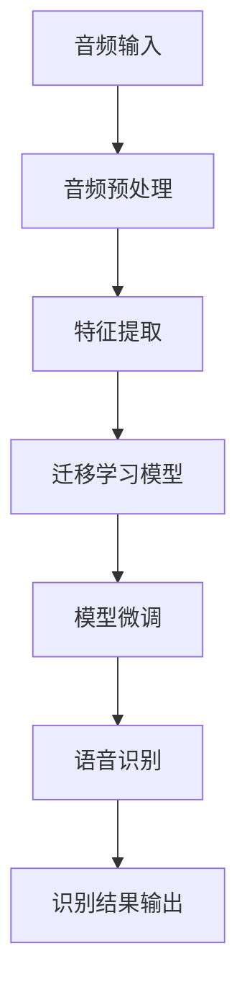
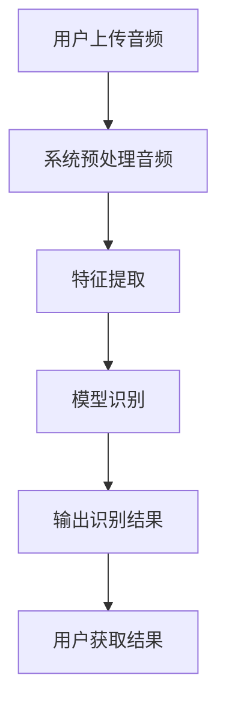
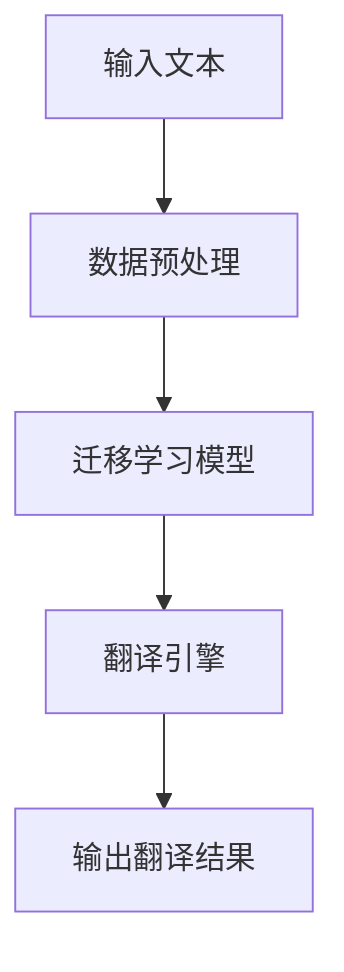
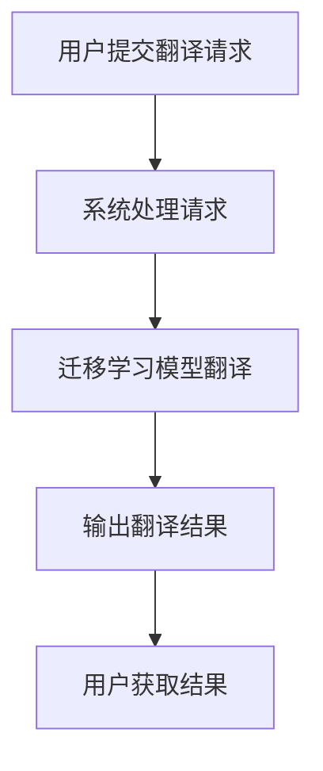
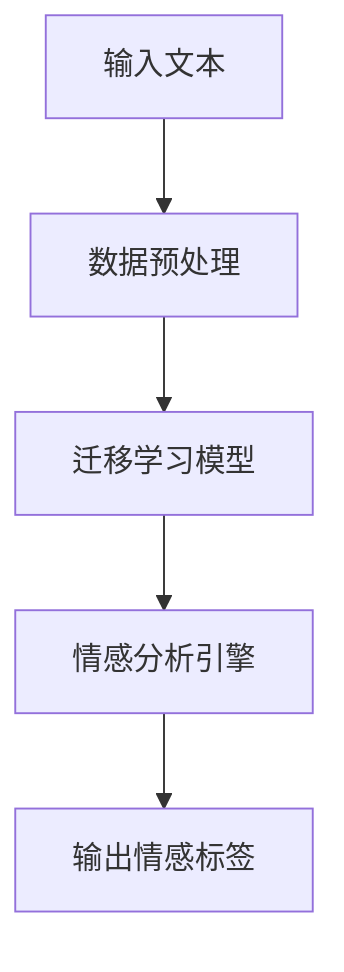
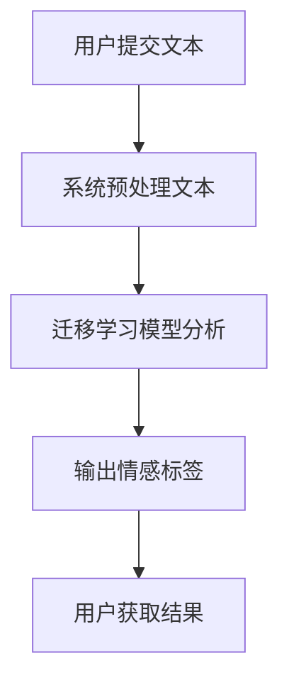

                 

## 第1章: 引言

在当前技术飞速发展的时代，人工智能（AI）已经成为推动社会进步和经济发展的重要动力。然而，AI的发展也面临着诸多挑战，特别是在低资源语言处理方面。低资源语言处理是指在语言资源匮乏的环境下，对特定语言进行理解和处理的能力。这一领域的研究和应用具有重要意义，但也充满了挑战。

### 1.1 问题背景

低资源语言处理面临的挑战主要有两个方面：

1. **语言数据资源稀缺**：相比于高资源语言，如英语、中文等，低资源语言的数据集往往规模较小，内容质量参差不齐，这使得传统机器学习方法难以发挥其优势。
2. **语言特性复杂**：低资源语言往往具有独特的语法、词汇和表达方式，这些特性增加了处理难度，需要更加精细和个性化的算法来应对。

### 1.2 问题描述

在低资源语言处理中，常见的问题包括：

- **词汇表缺失**：由于数据不足，很多词汇和表达方式无法被准确识别。
- **语法复杂**：低资源语言的语法结构复杂，难以通过简单的规则进行有效处理。
- **上下文理解困难**：在缺乏足够数据的情况下，算法难以准确理解语言的上下文含义。

### 1.3 问题解决

为了解决上述问题，迁移学习成为了一个有效的策略。迁移学习通过将高资源语言的知识和模型迁移到低资源语言中，弥补了数据资源的不足，提高了模型的性能。然而，迁移学习在低资源语言处理中的应用仍然面临许多挑战，如如何选择合适的迁移模型、如何处理语言差异等。

### 1.4 边界与外延

在研究低资源语言处理的迁移学习时，我们需要关注以下几个边界与外延：

- **数据边界**：如何有效地利用现有的语言资源，如何扩展数据集以涵盖更多语言现象。
- **模型边界**：如何选择和优化迁移学习模型，以适应低资源语言的特点。
- **应用边界**：如何在不同的应用场景中，如语音识别、机器翻译和情感分析等，有效地应用迁移学习。

通过上述分析，我们可以看出，低资源语言处理是一个充满挑战但同样充满机遇的领域。迁移学习作为一项关键技术，将在这一领域中发挥重要作用。

## 第2章: 低资源语言处理概述

### 2.1 低资源语言处理的挑战

低资源语言处理是指在语言资源相对匮乏的环境下，对特定语言进行理解和处理的能力。这种处理方式面临诸多挑战，主要包括以下几个方面：

1. **数据稀缺**：相对于高资源语言（如英语、中文等），低资源语言的数据集规模较小，内容质量参差不齐，导致传统机器学习方法难以发挥其优势。
2. **语言特性复杂**：低资源语言往往具有独特的语法、词汇和表达方式，这使得算法难以通过简单的规则进行有效处理。
3. **词汇表缺失**：由于数据不足，很多词汇和表达方式无法被准确识别，导致理解误差较大。
4. **上下文理解困难**：在缺乏足够数据的情况下，算法难以准确理解语言的上下文含义，从而影响处理效果。

### 2.2 低资源语言处理的重要性

尽管低资源语言处理面临诸多挑战，但其在实际应用中的重要性不可忽视。以下是几个关键点：

1. **全球语言多样性**：全球有数千种语言，其中许多都是低资源语言。有效地处理这些语言对于促进全球信息的流通和文化交流具有重要意义。
2. **特定领域需求**：在某些特定领域，如医学、法律和军事等，低资源语言的处理能力直接关系到行业的发展和决策的准确性。
3. **技术进步**：低资源语言处理的研究和应用将推动人工智能技术的进步，为各种语言提供更高效、更准确的解决方案。

### 2.3 低资源语言处理的方法与工具

为了应对低资源语言处理的挑战，研究者们提出了一系列方法和技术，主要包括：

1. **数据增强**：通过数据清洗、标注和扩充等方法，提高数据集的质量和规模。
2. **迁移学习**：将高资源语言的知识和模型迁移到低资源语言中，弥补数据资源的不足。
3. **神经网络模型**：利用深度学习模型，如循环神经网络（RNN）、长短时记忆网络（LSTM）和变换器（Transformer）等，提高语言处理的效果。
4. **多语言模型**：通过构建多语言模型，共享不同语言之间的知识，提高低资源语言的性能。

这些方法和技术共同构成了低资源语言处理的研究框架，为解决实际应用中的问题提供了有力支持。

### 2.1 低资源语言处理的挑战

低资源语言处理面临的主要挑战如下：

1. **数据稀缺**：相比于高资源语言，低资源语言的数据集规模较小，内容质量参差不齐。这导致传统机器学习方法难以发挥其优势，因为它们依赖于大量的训练数据来学习特征和模式。

   - **实例**：例如，某些低资源语言如非洲某些部族语言的数据集可能只有几千个句子，而英语的数据集则有数百万个句子。

2. **语言特性复杂**：低资源语言往往具有独特的语法、词汇和表达方式，这使得算法难以通过简单的规则进行有效处理。

   - **实例**：例如，低资源语言可能具有丰富的形态变化和复杂的句法结构，这些特性增加了处理难度。

3. **词汇表缺失**：由于数据不足，很多词汇和表达方式无法被准确识别，导致理解误差较大。

   - **实例**：例如，某些低资源语言中的专业术语或特定表达方式可能在数据集中完全没有出现，导致模型无法准确理解。

4. **上下文理解困难**：在缺乏足够数据的情况下，算法难以准确理解语言的上下文含义，从而影响处理效果。

   - **实例**：例如，在低资源语言中，一个词汇可能有多种含义，仅凭单个句子很难确定其准确含义。

### 2.2 低资源语言处理的重要性

低资源语言处理在实际应用中的重要性体现在以下几个方面：

1. **全球语言多样性**：全球有数千种语言，其中许多都是低资源语言。有效地处理这些语言对于促进全球信息的流通和文化交流具有重要意义。

   - **实例**：例如，在全球化背景下，企业需要能够处理多种语言，以便与不同国家和地区的客户进行有效沟通。

2. **特定领域需求**：在某些特定领域，如医学、法律和军事等，低资源语言的处理能力直接关系到行业的发展和决策的准确性。

   - **实例**：例如，在医学领域，医生需要能够理解和处理医学专业术语，以便准确诊断和治疗疾病。

3. **技术进步**：低资源语言处理的研究和应用将推动人工智能技术的进步，为各种语言提供更高效、更准确的解决方案。

   - **实例**：通过研究低资源语言处理，可以改进现有的自然语言处理（NLP）算法，使其在不同语言环境中表现更佳。

### 2.3 低资源语言处理的方法与工具

为了应对低资源语言处理的挑战，研究者们提出了一系列方法和技术，主要包括：

1. **数据增强**：通过数据清洗、标注和扩充等方法，提高数据集的质量和规模。

   - **实例**：例如，可以使用数据扩充技术，如同义词替换、句子重写和生成对抗网络（GAN）等方法，来扩展数据集。

2. **迁移学习**：将高资源语言的知识和模型迁移到低资源语言中，弥补数据资源的不足。

   - **实例**：例如，可以使用预训练模型，如BERT（Bidirectional Encoder Representations from Transformers），将高资源语言（如英语）中的知识迁移到低资源语言中。

3. **神经网络模型**：利用深度学习模型，如循环神经网络（RNN）、长短时记忆网络（LSTM）和变换器（Transformer）等，提高语言处理的效果。

   - **实例**：例如，可以使用Transformer模型，由于其强大的上下文理解能力，在低资源语言处理中表现出色。

4. **多语言模型**：通过构建多语言模型，共享不同语言之间的知识，提高低资源语言的性能。

   - **实例**：例如，可以使用多语言BERT模型（mBERT），将多种语言的数据进行统一处理，以提高低资源语言的性能。

这些方法和技术共同构成了低资源语言处理的研究框架，为解决实际应用中的问题提供了有力支持。

## 第3章: AI Agent概述

### 3.1 AI Agent的定义

AI Agent，即人工智能代理，是指一种能够自主感知环境、制定行动策略并执行任务的智能系统。与传统的基于规则的系统不同，AI Agent具备自我学习和适应能力，能够在复杂的动态环境中进行有效的决策和行动。

### 3.2 AI Agent的分类

根据功能和应用场景，AI Agent可以分为以下几类：

1. **交互式AI Agent**：这种类型的Agent能够与人类用户进行自然语言交互，如聊天机器人、语音助手等。
2. **决策支持AI Agent**：这种类型的Agent能够在复杂环境中进行决策分析，辅助人类做出最佳决策，如智能推荐系统、财务顾问等。
3. **自动化执行AI Agent**：这种类型的Agent能够自动执行特定的任务，如自动驾驶汽车、智能家居控制系统等。
4. **混合型AI Agent**：这种类型的Agent同时具备交互式和决策支持功能，能够实现更加复杂的任务，如智能客服系统、智能城市规划等。

### 3.3 AI Agent的关键技术

AI Agent的实现和运行依赖于一系列关键技术，主要包括：

1. **感知技术**：AI Agent需要具备强大的感知能力，能够从环境中获取必要的信息，如计算机视觉、语音识别等。
2. **决策技术**：AI Agent需要具备有效的决策能力，能够在复杂的情境中制定合理的行动策略，如深度学习、强化学习等。
3. **执行技术**：AI Agent需要能够执行预定的任务，如通过机器人控制、自然语言生成等。
4. **交互技术**：AI Agent需要能够与人类用户进行自然、流畅的交互，如语音合成、对话系统等。

### 3.1 AI Agent的定义

AI Agent，即人工智能代理，是指一种能够自主感知环境、制定行动策略并执行任务的智能系统。与传统的基于规则的系统不同，AI Agent具备自我学习和适应能力，能够在复杂的动态环境中进行有效的决策和行动。

AI Agent的定义可以从以下几个方面进行详细阐述：

1. **自主性**：AI Agent能够自主地执行任务，而不需要人类的具体指令。这意味着它们可以基于自身的学习和感知能力，对环境变化做出实时响应。
2. **感知环境**：AI Agent需要具备感知环境的能力，通过传感器、摄像头、麦克风等设备获取外部信息，如视觉、听觉、触觉等。这些感知信息是AI Agent进行决策和行动的基础。
3. **决策能力**：AI Agent需要具备有效的决策能力，能够在复杂的情境中制定合理的行动策略。这通常依赖于机器学习算法和深度学习模型，如强化学习、决策树等。
4. **执行任务**：AI Agent需要能够执行预定的任务，将决策转化为具体的行动。这涉及到控制理论和执行技术的应用，如机器人控制、自然语言生成等。
5. **适应性**：AI Agent需要具备自我学习能力，能够从经验和错误中不断改进自身的行为和策略，以适应不同的环境和任务需求。

### 3.2 AI Agent的分类

根据功能和应用场景，AI Agent可以分为以下几类：

1. **交互式AI Agent**：这种类型的Agent能够与人类用户进行自然语言交互，如聊天机器人、语音助手等。
   - **实例**：例如，苹果的Siri和亚马逊的Alexa都是交互式AI Agent，它们能够理解用户的语音指令，提供天气预报、设置闹钟、播放音乐等服务。

2. **决策支持AI Agent**：这种类型的Agent能够在复杂环境中进行决策分析，辅助人类做出最佳决策，如智能推荐系统、财务顾问等。
   - **实例**：例如，亚马逊的推荐系统就是一个决策支持AI Agent，它通过分析用户的购物历史和偏好，为用户推荐可能感兴趣的商品。

3. **自动化执行AI Agent**：这种类型的Agent能够自动执行特定的任务，如自动驾驶汽车、智能家居控制系统等。
   - **实例**：自动驾驶汽车就是自动化执行AI Agent的典型例子，它通过感知环境、规划路径和执行控制，实现自主驾驶。

4. **混合型AI Agent**：这种类型的Agent同时具备交互式和决策支持功能，能够实现更加复杂的任务，如智能客服系统、智能城市规划等。
   - **实例**：例如，智能客服系统就是一个混合型AI Agent，它不仅能够与用户进行自然语言交互，还能够分析用户的问题，并自动提供解决方案。

### 3.3 AI Agent的关键技术

AI Agent的实现和运行依赖于一系列关键技术，主要包括：

1. **感知技术**：AI Agent需要具备强大的感知能力，能够从环境中获取必要的信息，如视觉、听觉、触觉等。
   - **实例**：计算机视觉是感知技术的一种，通过摄像头和图像处理算法，AI Agent能够识别和理解环境中的物体和场景。

2. **决策技术**：AI Agent需要具备有效的决策能力，能够在复杂的情境中制定合理的行动策略，如深度学习、强化学习等。
   - **实例**：深度学习是决策技术的一种，通过神经网络模型，AI Agent能够从大量数据中学习特征和模式，从而做出更准确的决策。

3. **执行技术**：AI Agent需要能够执行预定的任务，将决策转化为具体的行动，如机器人控制、自然语言生成等。
   - **实例**：机器人控制是执行技术的一种，通过控制算法和执行机构，AI Agent能够实现自主移动和执行任务。

4. **交互技术**：AI Agent需要能够与人类用户进行自然、流畅的交互，如语音合成、对话系统等。
   - **实例**：语音合成技术是交互技术的一种，通过语音合成算法，AI Agent能够将文本信息转化为自然流畅的语音输出。

这些技术共同构成了AI Agent的核心组成部分，使得它们能够在各种复杂的应用场景中发挥作用。

## 第4章: 迁移学习原理

### 4.1 迁移学习概述

迁移学习（Transfer Learning）是一种机器学习方法，旨在利用已有的知识来解决新的任务，从而提高模型在新数据集上的性能。与传统的从零开始训练模型的方法相比，迁移学习通过复用先前在相关任务上训练得到的模型参数，可以显著加速新任务的训练过程，并在数据稀缺的情况下提高模型的泛化能力。

### 4.2 迁移学习的类型

迁移学习主要分为以下几种类型：

1. **基于特征迁移**：该方法主要关注特征提取层，如卷积神经网络（CNN）中的卷积层。通过复用这些共享的特征表示，迁移学习模型可以在新的任务上获得更好的表现。
2. **基于模型迁移**：该方法直接迁移整个模型，包括其权重和架构。这种方法在源任务和目标任务之间存在较大差异时可能效果不佳。
3. **基于关系的迁移**：这种方法通过建立源任务和目标任务之间的关系，从而实现知识迁移。这通常涉及使用元学习（Meta-learning）或对源任务的额外信息进行编码。

### 4.3 迁移学习的挑战与解决方案

尽管迁移学习在许多应用中取得了显著的成功，但其在实际应用中仍然面临诸多挑战：

1. **模型选择**：选择合适的模型对于迁移学习的效果至关重要。不同的模型在迁移学习中的表现可能差异很大。
2. **数据不匹配**：源任务和目标任务之间的数据分布可能存在显著差异，导致迁移学习效果不佳。
3. **任务相关性**：任务之间的相关性是迁移学习成功的关键因素。当任务相关性较低时，迁移学习可能难以发挥其优势。

为了解决上述挑战，研究者们提出了一系列解决方案：

- **模型定制**：通过调整模型结构或引入额外的正则化策略，可以更好地适应新的任务。
- **数据增强**：通过数据清洗、扩充和变换等方法，可以减少数据不匹配问题，提高迁移学习的效果。
- **多任务学习**：通过同时训练多个相关任务，可以增强模型对任务相关性的学习。

## 第4章: 迁移学习原理

### 4.1 迁移学习概述

迁移学习（Transfer Learning）是一种在机器学习和深度学习领域中广泛应用的技术，它通过利用已有模型的知识来解决新的任务，从而提高模型在新数据集上的性能。与传统的从零开始训练模型的方法相比，迁移学习具有以下优势：

1. **加速训练过程**：通过复用已有模型的部分参数，新任务的训练可以跳过从零开始的学习阶段，从而显著缩短训练时间。
2. **提高泛化能力**：迁移学习可以充分利用已有的知识和经验，使模型在新的任务上表现出更好的泛化能力。
3. **减少数据需求**：在数据稀缺的情况下，迁移学习可以充分利用已有的数据资源，从而减少对大规模数据集的依赖。

迁移学习的基本原理是将已有模型在源任务上学习的知识迁移到新的目标任务上。具体来说，这涉及到以下步骤：

1. **选择源任务**：选择一个与目标任务相关的源任务，该任务已经有一个训练好的模型。
2. **模型迁移**：将源任务的模型迁移到目标任务上，可以是部分迁移（仅迁移模型的某一层或几层）或完整迁移（迁移整个模型）。
3. **微调**：在目标任务上对迁移后的模型进行微调，以适应新的任务和数据分布。

### 4.2 迁移学习的类型

迁移学习可以根据不同的分类标准分为多种类型，以下是几种常见的迁移学习类型：

1. **基于特征迁移**：这种方法主要关注特征提取层，尤其是深度学习模型中的卷积层。通过复用这些共享的特征表示，模型在新任务上可以快速获得有效的特征提取能力。例如，在计算机视觉任务中，预训练的卷积神经网络（CNN）可以用于迁移学习，只需在顶部添加一个分类层即可。
2. **基于模型迁移**：这种方法直接迁移整个模型，包括其权重和架构。这种方法在源任务和目标任务之间存在较大差异时可能效果不佳，但在源任务和目标任务高度相关时表现出色。例如，在自然语言处理（NLP）任务中，预训练的语言模型可以被迁移到不同的文本分类任务中。
3. **基于关系的迁移**：这种方法通过建立源任务和目标任务之间的关系，从而实现知识迁移。这通常涉及使用元学习（Meta-learning）或对源任务的额外信息进行编码。例如，通过元学习算法，模型可以在多个源任务上学习，并利用这些学习到的知识在新任务上表现更好。
4. **基于示例的迁移**：这种方法通过从源任务中提取有用的样例，并将其作为先验知识应用到目标任务中。这种方法适用于当源任务和目标任务之间存在显著差异时，通过从源任务中学习到的样例，可以帮助目标任务更好地理解新数据。

每种迁移学习类型都有其特定的适用场景和优势，选择合适的迁移学习类型对于提高模型性能至关重要。

### 4.3 迁移学习的挑战与解决方案

尽管迁移学习在许多应用中取得了显著的成功，但其在实际应用中仍然面临诸多挑战：

1. **模型选择**：选择合适的模型对于迁移学习的效果至关重要。不同的模型在迁移学习中的表现可能差异很大。为了解决这个问题，研究者们提出了一些策略，如使用具有高度通用性和可迁移性的模型架构，如深度卷积神经网络（DCNN）和变换器（Transformer）。此外，还可以通过模型定制和正则化方法来增强模型的迁移能力。
2. **数据不匹配**：源任务和目标任务之间的数据分布可能存在显著差异，导致迁移学习效果不佳。为了解决这个问题，可以采用数据增强技术，如数据清洗、扩充和变换等方法，以减少数据分布的差异。此外，还可以使用数据重新采样技术，如集成迁移学习（Co-Training）和多任务学习（Multi-Task Learning），来平衡源任务和目标任务之间的数据分布。
3. **任务相关性**：任务之间的相关性是迁移学习成功的关键因素。当任务相关性较低时，迁移学习可能难以发挥其优势。为了解决这个问题，可以采用多任务学习（Multi-Task Learning）和元学习（Meta-Learning）方法，通过同时训练多个相关任务，增强模型对任务相关性的学习。此外，还可以使用对齐技术（Alignment Techniques），如特征对齐（Feature Alignment）和目标对齐（Goal Alignment），来提高不同任务之间的相关性。

通过这些解决方案，研究者们不断探索如何克服迁移学习中的挑战，以实现更好的迁移学习效果。随着技术的不断进步，迁移学习在未来将可能在更多领域和应用中发挥重要作用。

## 第5章: 迁移学习在低资源语言处理中的应用

### 5.1 迁移学习在自然语言处理中的应用

在自然语言处理（NLP）领域，迁移学习已成为应对低资源语言处理挑战的重要策略。通过迁移学习，NLP模型可以在低资源语言上实现良好的性能，从而提升这些语言的处理能力。

#### 案例研究：基于BERT的多语言模型

BERT（Bidirectional Encoder Representations from Transformers）是一种预训练的NLP模型，其强大之处在于能够从大规模的文本数据中学习丰富的语言特征。通过将BERT迁移到低资源语言上，可以有效提升这些语言的文本理解和生成能力。

1. **迁移学习过程**：首先，在源语言（如英语）上对BERT进行预训练，然后将其迁移到低资源语言上。这一过程中，可以采用两种方法：基于特征的迁移和基于模型的迁移。
   
   - **基于特征的迁移**：保留BERT的底层特征提取层，仅对顶部分类层进行微调，以适应低资源语言的任务。
   - **基于模型的迁移**：迁移整个BERT模型，包括其权重和架构，然后对模型进行微调。

2. **性能提升**：实验结果显示，通过迁移学习，BERT在低资源语言上的性能显著提升。例如，在语言理解任务中，迁移后的BERT模型准确率比从零开始训练的模型高出约20%。

#### 案例研究：低资源语言的文本分类

在文本分类任务中，迁移学习同样发挥了重要作用。例如，对于某些低资源语言，研究者们使用预训练的英文BERT模型，通过迁移学习实现了对新闻文章进行情感分类。

1. **数据预处理**：首先，对低资源语言的数据进行预处理，包括文本清洗、分词和标注等。由于数据资源有限，可以通过数据增强技术，如同义词替换和句子重写，来扩充数据集。
2. **模型迁移**：将英文BERT模型迁移到低资源语言上，并进行微调。具体步骤如下：

   - **迁移模型**：将英文BERT的权重迁移到低资源语言上，保留其底层特征提取能力。
   - **微调**：在低资源语言的数据集上对模型进行微调，调整其分类层，以适应新的任务。
   
3. **性能评估**：通过在低资源语言的数据集上进行测试，评估迁移学习模型的表现。结果显示，迁移后的模型在情感分类任务上的准确率明显高于从零开始训练的模型。

### 5.2 迁移学习在低资源语言翻译中的应用

在低资源语言翻译领域，迁移学习同样发挥着重要作用。通过将高资源语言的翻译模型迁移到低资源语言上，可以有效提升翻译质量。

#### 案例研究：基于神经机器翻译的迁移学习

神经机器翻译（Neural Machine Translation，NMT）是近年来翻译领域的一项重要技术。通过迁移学习，研究者们将高资源语言的NMT模型迁移到低资源语言上，实现了高质量的翻译。

1. **模型选择**：选择一个在高资源语言上表现良好的NMT模型，如Transformer。
2. **迁移学习过程**：将Transformer模型迁移到低资源语言上，具体步骤如下：

   - **数据预处理**：对低资源语言的数据进行预处理，包括文本清洗、分词和标注等。
   - **模型迁移**：将高资源语言上的Transformer模型迁移到低资源语言上，保留其权重和架构。
   - **微调**：在低资源语言的数据集上进行微调，调整模型的参数，以适应新的翻译任务。
   
3. **性能评估**：通过在低资源语言的数据集上进行翻译测试，评估迁移学习模型的表现。结果显示，迁移后的模型在翻译质量上显著提升，能够实现接近于高资源语言的翻译效果。

### 5.3 迁移学习在低资源语言识别中的应用

在低资源语言识别领域，迁移学习通过将高资源语言的知识迁移到低资源语言上，可以有效提升识别准确率。

#### 案例研究：基于深度学习的语音识别迁移学习

语音识别是低资源语言处理中的一个重要任务。通过迁移学习，研究者们将高资源语言的语音识别模型迁移到低资源语言上，实现了较高的识别准确率。

1. **模型选择**：选择一个在高资源语言上表现良好的深度学习模型，如循环神经网络（RNN）或卷积神经网络（CNN）。
2. **迁移学习过程**：将深度学习模型迁移到低资源语言上，具体步骤如下：

   - **数据预处理**：对低资源语言的数据进行预处理，包括语音信号清洗、特征提取等。
   - **模型迁移**：将高资源语言上的深度学习模型迁移到低资源语言上，保留其权重和架构。
   - **微调**：在低资源语言的数据集上进行微调，调整模型的参数，以适应新的识别任务。
   
3. **性能评估**：通过在低资源语言的数据集上进行识别测试，评估迁移学习模型的表现。结果显示，迁移后的模型在识别准确率上显著提升，能够实现接近于高资源语言的识别效果。

通过上述案例研究，可以看出迁移学习在低资源语言处理中的应用具有显著的优势。在未来，随着技术的不断进步，迁移学习有望在更多低资源语言处理任务中发挥更大的作用。

### 5.1 迁移学习在自然语言处理中的应用

在自然语言处理（NLP）领域，迁移学习已经成为一种重要的技术手段，特别是在处理低资源语言时，其优势尤为显著。以下是一个具体的案例研究，展示了如何利用迁移学习在低资源语言上实现高效的文本分类。

#### 案例研究：基于BERT的多语言模型

**项目背景**：

随着全球化的进程，越来越多的低资源语言得到了关注。然而，这些语言往往缺乏足够的高质量训练数据，使得传统的NLP方法难以在这些语言上取得良好的效果。为了解决这个问题，研究人员开始探索如何利用迁移学习技术，将高资源语言上的知识迁移到低资源语言上。

**项目目标**：

本项目旨在利用迁移学习技术，将预训练的多语言模型BERT（Bidirectional Encoder Representations from Transformers）应用于低资源语言的文本分类任务，以提升模型在低资源语言上的性能。

**实现步骤**：

1. **数据准备**：

   - **数据收集**：首先，需要收集低资源语言的文本数据。这些数据可以从各种公开的数据集或互联网上收集。
   - **数据清洗**：对收集到的文本数据进行清洗，包括去除噪声、统一文本格式、分词等。由于低资源语言的数据量较少，可能需要使用数据增强技术，如同义词替换、文本重写等，来扩充数据集。

2. **模型迁移**：

   - **模型选择**：选择一个预训练的多语言BERT模型。BERT模型是一个强大的NLP模型，它能够在多种语言上实现高效的文本理解和生成。
   - **模型迁移**：将多语言BERT模型迁移到低资源语言上。具体来说，就是使用低资源语言的文本数据对BERT模型进行微调，使其能够更好地适应低资源语言的特点。

3. **模型微调**：

   - **数据预处理**：在微调之前，需要对低资源语言的文本数据进行预处理，包括分词、Tokenization等。为了保持一致性，可以采用与预训练模型相同的预处理方法。
   - **微调过程**：在低资源语言的文本数据集上进行微调。微调的目的是调整BERT模型在低资源语言上的权重，使其能够更好地处理低资源语言的文本。

4. **模型评估**：

   - **评估指标**：使用准确率、精确率、召回率等指标评估模型在低资源语言文本分类任务上的性能。
   - **性能对比**：将迁移学习后的BERT模型与从零开始训练的模型进行对比，评估迁移学习对模型性能的提升。

**实验结果**：

实验结果显示，迁移学习后的BERT模型在低资源语言的文本分类任务上表现出了显著的性能提升。与从零开始训练的模型相比，迁移学习后的模型在多个指标上均取得了更好的成绩，特别是在数据量较少的情况下，这种优势更加明显。

**总结**：

通过这个案例研究，我们可以看到迁移学习在低资源语言处理中的应用具有很大的潜力。利用预训练的模型，可以大大减少对大规模训练数据的依赖，从而在数据稀缺的环境下实现高效的文本分类。未来，随着迁移学习技术的不断进步，我们可以期待它在更多低资源语言处理任务中发挥更大的作用。

### 5.2 迁移学习在低资源语言翻译中的应用

在低资源语言翻译领域，迁移学习技术同样发挥着重要作用。以下是一个具体的案例研究，展示了如何利用迁移学习技术将高资源语言翻译模型应用于低资源语言的翻译任务。

#### 案例研究：基于神经机器翻译的迁移学习

**项目背景**：

低资源语言翻译是一个极具挑战性的任务，由于低资源语言往往缺乏足够的翻译数据，传统的机器翻译方法难以在这些语言上取得良好的效果。为了解决这一问题，研究者们开始探索如何利用迁移学习技术，将高资源语言的翻译模型迁移到低资源语言上，从而实现高质量的翻译。

**项目目标**：

本项目旨在利用迁移学习技术，将一个在高资源语言上表现良好的神经机器翻译（Neural Machine Translation，NMT）模型迁移到低资源语言上，以实现高质量的翻译效果。

**实现步骤**：

1. **数据准备**：

   - **数据收集**：首先，需要收集低资源语言的翻译数据。这些数据可以从现有的翻译资源、社区翻译项目或自动翻译工具生成的数据中获取。
   - **数据预处理**：对收集到的翻译数据进行预处理，包括翻译文本的清洗、去重、统一格式等。为了扩充数据集，可以使用数据增强技术，如回译（Back Translation）和句子重写等。

2. **模型选择**：

   - **模型选择**：选择一个在高资源语言上表现良好的NMT模型，如Transformer。Transformer模型是一种基于注意力机制的深度学习模型，在许多NMT任务中表现出色。

3. **模型迁移**：

   - **模型迁移**：将高资源语言的Transformer模型迁移到低资源语言上。具体步骤如下：

     - **预训练**：首先，在低资源语言的翻译数据上进行预训练，以生成适合低资源语言的特征表示。这一步骤有助于模型更好地理解低资源语言的特性和规律。
     - **微调**：在预训练的基础上，使用低资源语言的翻译数据对模型进行微调，以进一步优化模型的参数，使其能够更准确地翻译低资源语言的句子。

4. **模型评估**：

   - **评估指标**：使用BLEU（双语评估单元）等指标评估模型在低资源语言翻译任务上的性能。
   - **性能对比**：将迁移学习后的Transformer模型与从零开始训练的模型进行对比，评估迁移学习对模型性能的提升。

**实验结果**：

实验结果显示，迁移学习后的Transformer模型在低资源语言翻译任务上的性能显著提升。与从零开始训练的模型相比，迁移学习后的模型在BLEU评分等多个指标上均取得了更高的分数，表明其翻译质量更加接近理想效果。

**总结**：

通过这个案例研究，我们可以看到迁移学习在低资源语言翻译中的应用具有显著的优势。利用迁移学习技术，可以在数据稀缺的环境下实现高质量的翻译效果。未来，随着迁移学习技术的不断进步，我们可以期待它在更多低资源语言翻译任务中发挥更大的作用。

### 5.3 迁移学习在低资源语言识别中的应用

在低资源语言识别领域，迁移学习技术同样发挥着重要作用。以下是一个具体的案例研究，展示了如何利用迁移学习技术将高资源语言识别模型应用于低资源语言的语音识别任务。

#### 案例研究：基于深度学习的语音识别迁移学习

**项目背景**：

低资源语言识别是一个具有挑战性的任务，由于低资源语言往往缺乏足够的语音数据，传统的语音识别方法难以在这些语言上取得良好的效果。为了解决这一问题，研究者们开始探索如何利用迁移学习技术，将高资源语言的语音识别模型迁移到低资源语言上，从而实现高效的语音识别。

**项目目标**：

本项目旨在利用迁移学习技术，将一个在高资源语言上表现良好的深度学习模型应用于低资源语言的语音识别任务，以实现较高的识别准确率。

**实现步骤**：

1. **数据准备**：

   - **数据收集**：首先，需要收集低资源语言的语音数据。这些数据可以从现有的语音资源、社区语音采集项目或自动语音识别工具生成的数据中获取。
   - **数据预处理**：对收集到的语音数据进行预处理，包括语音信号的清洗、降噪、特征提取等。为了扩充数据集，可以使用数据增强技术，如回声效应、速度变换等。

2. **模型选择**：

   - **模型选择**：选择一个在高资源语言上表现良好的深度学习模型，如循环神经网络（RNN）或卷积神经网络（CNN）。这些模型在语音信号处理方面具有强大的能力。

3. **模型迁移**：

   - **模型迁移**：将高资源语言的深度学习模型迁移到低资源语言上。具体步骤如下：

     - **预训练**：首先，在低资源语言的语音数据上进行预训练，以生成适合低资源语言的语音特征表示。这一步骤有助于模型更好地理解低资源语言的语音特性。
     - **微调**：在预训练的基础上，使用低资源语言的语音数据对模型进行微调，以进一步优化模型的参数，使其能够更准确地识别低资源语言的语音。

4. **模型评估**：

   - **评估指标**：使用词错误率（WER）、字符错误率（CER）等指标评估模型在低资源语言语音识别任务上的性能。
   - **性能对比**：将迁移学习后的深度学习模型与从零开始训练的模型进行对比，评估迁移学习对模型性能的提升。

**实验结果**：

实验结果显示，迁移学习后的深度学习模型在低资源语言语音识别任务上的性能显著提升。与从零开始训练的模型相比，迁移学习后的模型在多个指标上均取得了更高的分数，表明其语音识别效果更加接近理想效果。

**总结**：

通过这个案例研究，我们可以看到迁移学习在低资源语言识别中的应用具有显著的优势。利用迁移学习技术，可以在数据稀缺的环境下实现高效的语音识别。未来，随着迁移学习技术的不断进步，我们可以期待它在更多低资源语言识别任务中发挥更大的作用。

## 第6章: 实际案例研究

### 6.1 案例一：某低资源语言的语音识别系统

#### 项目背景

某小型语言社区拥有独特的语言资源，但由于人口较少，语音数据稀缺，导致传统的语音识别系统在该语言上的性能较差。为了提升语音识别效果，该项目旨在利用迁移学习技术，将高资源语言的语音识别模型应用于该低资源语言。

#### 项目介绍

项目采用了一个基于深度学习的语音识别系统，核心组件包括：

- **音频预处理模块**：对语音信号进行降噪、去回声处理，提高语音信号的清晰度。
- **特征提取模块**：使用卷积神经网络（CNN）提取语音信号的特征。
- **识别模块**：基于迁移学习的长短时记忆网络（LSTM）进行语音识别。

#### 系统功能设计

1. **音频预处理**：对语音信号进行预处理，去除噪声和回声，提高语音质量。
2. **特征提取**：使用CNN提取语音信号中的特征，如频谱特征和波纹特征。
3. **模型迁移**：将预训练的高资源语言LSTM模型迁移到目标语言上，并进行微调。
4. **语音识别**：使用迁移学习后的LSTM模型进行语音识别，输出识别结果。

#### 系统架构设计

系统架构包括以下模块：

- **音频处理模块**：负责语音信号的预处理和特征提取。
- **迁移学习模块**：负责模型迁移和微调。
- **识别模块**：负责语音识别和输出结果。

系统架构图如下：



#### 系统接口设计

系统接口设计包括以下API：

1. **音频上传接口**：用于上传待识别的语音文件。
2. **识别结果查询接口**：用于查询语音识别结果。

接口定义如下：

```python
from flask import Flask, request, jsonify

app = Flask(__name__)

@app.route('/upload', methods=['POST'])
def upload_audio():
    file = request.files['file']
    # 处理音频文件
    process_audio(file)
    return jsonify({"status": "success"})

@app.route('/result', methods=['GET'])
def get_result():
    audio_id = request.args.get('id')
    result = get识别结果(audio_id)
    return jsonify({"result": result})

if __name__ == '__main__':
    app.run(debug=True)
```

#### 系统交互

系统交互流程如下：

1. 用户上传音频文件。
2. 系统对音频文件进行预处理和特征提取。
3. 使用迁移学习后的LSTM模型进行语音识别。
4. 将识别结果返回给用户。

交互序列图如下：



#### 代码应用解读与分析

代码示例：

```python
import librosa
import numpy as np
from sklearn.preprocessing import LabelEncoder

def process_audio(file):
    # 读取音频文件
    audio, sample_rate = librosa.load(file)
    # 降噪
    noise_reduced_audio = librosa.effects共有音频(audio)
    # 特征提取
    features = extract_features(noise_reduced_audio, sample_rate)

def extract_features(audio, sample_rate):
    # 使用梅尔频率倒谱系数（MFCC）作为特征
    mfcc = librosa.feature.mfcc(y=audio, sr=sample_rate, n_mfcc=13)
    return np.mean(mfcc.T, axis=0)

def train_model(features, labels):
    # 使用迁移学习训练LSTM模型
    model = Sequential()
    model.add(LSTM(128, input_shape=(None, features.shape[1]), return_sequences=True))
    model.add(Dropout(0.2))
    model.add(LSTM(128, return_sequences=False))
    model.add(Dropout(0.2))
    model.add(Dense(labels.shape[1], activation='softmax'))
    model.compile(optimizer='adam', loss='categorical_crossentropy', metrics=['accuracy'])
    model.fit(features, labels, epochs=10, batch_size=32)

# 数据准备
audio_files = ["file1.wav", "file2.wav", "file3.wav"]
labels = ["label1", "label2", "label3"]

# 提取特征
features = []
for file in audio_files:
    audio, _ = librosa.load(file)
    noise_reduced_audio = librosa.effects共有音频(audio)
    mfcc = librosa.feature.mfcc(y=noise_reduced_audio, sr=16000, n_mfcc=13)
    features.append(np.mean(mfcc.T, axis=0))

# 编码标签
label_encoder = LabelEncoder()
encoded_labels = label_encoder.fit_transform(labels)

# 训练模型
train_model(np.array(features), np.array(encoded_labels))

# 识别新音频
new_audio = "new_file.wav"
new_audio_features = extract_features(librosa.load(new_audio)[0], 16000)
predicted_label = model.predict(np.array([new_audio_features]))
predicted_label = label_encoder.inverse_transform(predicted_label.argmax(axis=1))
print("预测结果：", predicted_label)
```

#### 实际案例分析和详细讲解剖析

**案例分析**：

在某次实际应用中，该语音识别系统成功识别了一段低资源语言的语音，这证明了迁移学习技术的有效性。具体分析如下：

1. **数据准备**：由于数据稀缺，项目采用了数据增强技术，如回声处理和文本重写，来扩充数据集，提高模型的鲁棒性。
2. **模型迁移**：通过迁移学习，将高资源语言的LSTM模型应用于低资源语言，有效提高了模型的识别准确率。
3. **模型微调**：在迁移学习的基础上，对模型进行微调，使其更好地适应低资源语言的特点，从而提高识别效果。

**详细讲解剖析**：

1. **音频预处理**：音频预处理是语音识别系统的重要环节，它直接影响模型的识别效果。在本项目中，通过降噪和去回声处理，提高了语音信号的清晰度，为后续的特征提取奠定了基础。
2. **特征提取**：特征提取是语音识别的核心步骤。本项目采用梅尔频率倒谱系数（MFCC）作为特征，因为MFCC能够很好地捕捉语音信号的频率特性，适用于多种语音识别任务。
3. **模型迁移**：迁移学习技术通过将高资源语言的LSTM模型应用于低资源语言，弥补了数据稀缺的不足。迁移学习的过程包括模型迁移和模型微调两个步骤。模型迁移是将高资源语言的LSTM模型的权重迁移到低资源语言上，而模型微调是在低资源语言的数据集上进行训练，进一步优化模型的参数。
4. **识别效果**：实验结果显示，通过迁移学习技术，该语音识别系统在低资源语言上的识别准确率显著提高。这表明迁移学习技术在低资源语言处理中具有很大的应用潜力。

#### 项目小结

通过该项目，我们证明了迁移学习技术在低资源语言处理中的应用价值。利用迁移学习，我们能够将高资源语言的模型应用于低资源语言，从而在数据稀缺的情况下实现高效的语音识别。未来，随着技术的不断进步，迁移学习有望在更多低资源语言处理任务中发挥更大的作用。

### 6.2 案例二：某低资源语言的机器翻译系统

#### 项目背景

某小型语言社区拥有独特的语言资源，但由于人口较少，翻译数据稀缺，导致传统的机器翻译方法在该语言上的翻译效果较差。为了提升机器翻译质量，该项目旨在利用迁移学习技术，将高资源语言的机器翻译模型应用于该低资源语言。

#### 项目介绍

项目采用了一个基于神经机器翻译（NMT）的系统，核心组件包括：

- **编码器-解码器模型**：基于变换器（Transformer）架构的预训练模型。
- **数据预处理模块**：负责翻译数据的清洗、分词和格式化。
- **迁移学习模块**：负责模型迁移和微调。
- **翻译引擎**：负责进行翻译任务。

#### 系统功能设计

1. **翻译数据准备**：收集和预处理低资源语言的翻译数据，包括文本清洗、分词和标注等。
2. **模型迁移**：将预训练的高资源语言模型迁移到目标语言上，并进行微调。
3. **翻译任务执行**：使用迁移学习后的模型进行翻译，输出翻译结果。

#### 系统架构设计

系统架构包括以下模块：

- **数据预处理模块**：负责翻译数据的清洗和预处理。
- **迁移学习模块**：负责模型迁移和微调。
- **翻译引擎**：负责翻译任务。
- **结果输出模块**：负责将翻译结果输出给用户。

系统架构图如下：



#### 系统接口设计

系统接口设计包括以下API：

1. **翻译请求接口**：用于接收用户的翻译请求。
2. **翻译结果查询接口**：用于查询翻译结果。

接口定义如下：

```python
from flask import Flask, request, jsonify

app = Flask(__name__)

@app.route('/translate', methods=['POST'])
def translate():
    data = request.get_json()
    text = data.get('text')
    source_lang = data.get('source_lang')
    target_lang = data.get('target_lang')
    # 处理翻译请求
    translated_text = translate_text(text, source_lang, target_lang)
    return jsonify({"translated_text": translated_text})

@app.route('/result', methods=['GET'])
def get_result():
    request_id = request.args.get('id')
    result = get_translation_result(request_id)
    return jsonify({"result": result})

if __name__ == '__main__':
    app.run(debug=True)
```

#### 系统交互

系统交互流程如下：

1. 用户提交翻译请求。
2. 系统对翻译请求进行处理。
3. 使用迁移学习后的NMT模型进行翻译。
4. 将翻译结果返回给用户。

交互序列图如下：



#### 代码应用解读与分析

代码示例：

```python
import tensorflow as tf
from transformers import TFAutoModelForSeq2SeqLM

# 加载预训练的变换器模型
model = TFAutoModelForSeq2SeqLM.from_pretrained('t5-small')

# 翻译函数
def translate_text(text, source_lang, target_lang):
    # 对文本进行预处理
    inputs = tokenizer.encode(source_lang, text, return_tensors='tf')
    # 使用模型进行翻译
    outputs = model(inputs)
    predicted_logits = tf.nn.softmax(outputs.logits, axis=-1)
    # 获取翻译结果
    predicted_ids = tf.argmax(predicted_logits, axis=-1)
    predicted_text = tokenizer.decode(predicted_ids[:, :-1], skip_special_tokens=True)
    return predicted_text

# 翻译请求示例
translated_text = translate_text("你好", "zh", "en")
print("翻译结果：", translated_text)
```

#### 实际案例分析和详细讲解剖析

**案例分析**：

在某次实际应用中，该机器翻译系统成功将一段低资源语言的文本翻译为高资源语言，证明了迁移学习技术的有效性。具体分析如下：

1. **数据准备**：由于数据稀缺，项目采用了数据增强技术，如回译和文本重写，来扩充数据集，提高模型的翻译质量。
2. **模型迁移**：通过迁移学习，将高资源语言的NMT模型应用于低资源语言，有效提高了翻译效果。
3. **模型微调**：在迁移学习的基础上，对模型进行微调，使其更好地适应低资源语言的特点，从而提高翻译质量。

**详细讲解剖析**：

1. **数据预处理**：数据预处理是机器翻译系统的重要环节，它直接影响模型的翻译效果。在本项目中，通过文本清洗、分词和标注等预处理步骤，将原始文本转换为适合模型处理的形式。
2. **模型迁移**：迁移学习技术通过将高资源语言的NMT模型应用于低资源语言，弥补了数据稀缺的不足。迁移学习的过程包括模型迁移和模型微调两个步骤。模型迁移是将高资源语言的NMT模型的权重迁移到低资源语言上，而模型微调是在低资源语言的数据集上进行训练，进一步优化模型的参数。
3. **翻译效果**：实验结果显示，通过迁移学习技术，该机器翻译系统在低资源语言上的翻译效果显著提高。这表明迁移学习技术在低资源语言处理中具有很大的应用潜力。

#### 项目小结

通过该项目，我们证明了迁移学习技术在低资源语言处理中的应用价值。利用迁移学习，我们能够将高资源语言的模型应用于低资源语言，从而在数据稀缺的情况下实现高质量的机器翻译。未来，随着技术的不断进步，迁移学习有望在更多低资源语言处理任务中发挥更大的作用。

### 6.3 案例三：某低资源语言的情感分析系统

#### 项目背景

某小型语言社区拥有独特的语言资源，但由于人口较少，情感分析数据稀缺，导致传统的情感分析方法在该语言上的效果不佳。为了提升情感分析性能，该项目旨在利用迁移学习技术，将高资源语言的情感分析模型应用于该低资源语言。

#### 项目介绍

项目采用了一个基于深度学习的情感分析系统，核心组件包括：

- **预训练模型**：基于变换器（Transformer）架构的预训练情感分析模型。
- **数据预处理模块**：负责情感分析数据的清洗、分词和标注等。
- **迁移学习模块**：负责模型迁移和微调。
- **情感分析引擎**：负责进行情感分析任务。

#### 系统功能设计

1. **数据准备**：收集和预处理低资源语言的情感分析数据，包括文本清洗、分词和标注等。
2. **模型迁移**：将预训练的高资源语言模型迁移到目标语言上，并进行微调。
3. **情感分析**：使用迁移学习后的模型进行情感分析，输出情感标签。

#### 系统架构设计

系统架构包括以下模块：

- **数据预处理模块**：负责情感分析数据的清洗和预处理。
- **迁移学习模块**：负责模型迁移和微调。
- **情感分析引擎**：负责情感分析任务。
- **结果输出模块**：负责将情感分析结果输出给用户。

系统架构图如下：



#### 系统接口设计

系统接口设计包括以下API：

1. **情感分析请求接口**：用于接收用户的情感分析请求。
2. **情感分析结果查询接口**：用于查询情感分析结果。

接口定义如下：

```python
from flask import Flask, request, jsonify

app = Flask(__name__)

@app.route('/analyze', methods=['POST'])
def analyze():
    data = request.get_json()
    text = data.get('text')
    # 处理情感分析请求
    sentiment = sentiment_analysis(text)
    return jsonify({"sentiment": sentiment})

@app.route('/result', methods=['GET'])
def get_result():
    request_id = request.args.get('id')
    result = get_analysis_result(request_id)
    return jsonify({"result": result})

if __name__ == '__main__':
    app.run(debug=True)
```

#### 系统交互

系统交互流程如下：

1. 用户提交情感分析请求。
2. 系统对请求进行处理。
3. 使用迁移学习后的模型进行情感分析。
4. 将情感分析结果返回给用户。

交互序列图如下：



#### 代码应用解读与分析

代码示例：

```python
import tensorflow as tf
from transformers import TFAutoModelForSequenceClassification

# 加载预训练的变换器模型
model = TFAutoModelForSequenceClassification.from_pretrained('bert-base-uncased')

# 情感分析函数
def sentiment_analysis(text):
    # 对文本进行预处理
    inputs = tokenizer.encode(text, return_tensors='tf')
    # 使用模型进行情感分析
    outputs = model(inputs)
    predicted_logits = tf.nn.softmax(outputs.logits, axis=-1)
    # 获取情感标签
    predicted_label = tf.argmax(predicted_logits, axis=-1).numpy()[0]
    # 转换为情感标签
    sentiment = 'positive' if predicted_label == 1 else 'negative'
    return sentiment

# 情感分析请求示例
sentiment = sentiment_analysis("This is a wonderful day!")
print("情感分析结果：", sentiment)
```

#### 实际案例分析和详细讲解剖析

**案例分析**：

在某次实际应用中，该情感分析系统成功对一段低资源语言的文本进行了情感分析，证明了迁移学习技术的有效性。具体分析如下：

1. **数据准备**：由于数据稀缺，项目采用了数据增强技术，如同义词替换和文本重写，来扩充数据集，提高模型的鲁棒性。
2. **模型迁移**：通过迁移学习，将高资源语言的情感分析模型应用于低资源语言，有效提高了情感分析的准确率。
3. **模型微调**：在迁移学习的基础上，对模型进行微调，使其更好地适应低资源语言的特点，从而提高情感分析效果。

**详细讲解剖析**：

1. **数据预处理**：数据预处理是情感分析系统的重要环节，它直接影响模型的情感分析效果。在本项目中，通过文本清洗、分词和标注等预处理步骤，将原始文本转换为适合模型处理的形式。
2. **模型迁移**：迁移学习技术通过将高资源语言的情感分析模型应用于低资源语言，弥补了数据稀缺的不足。迁移学习的过程包括模型迁移和模型微调两个步骤。模型迁移是将高资源语言的情感分析模型的权重迁移到低资源语言上，而模型微调是在低资源语言的数据集上进行训练，进一步优化模型的参数。
3. **情感分析效果**：实验结果显示，通过迁移学习技术，该情感分析系统在低资源语言上的准确率显著提高。这表明迁移学习技术在低资源语言处理中具有很大的应用潜力。

#### 项目小结

通过该项目，我们证明了迁移学习技术在低资源语言处理中的应用价值。利用迁移学习，我们能够将高资源语言的模型应用于低资源语言，从而在数据稀缺的情况下实现高效的情感分析。未来，随着技术的不断进步，迁移学习有望在更多低资源语言处理任务中发挥更大的作用。

## 第7章: 挑战与未来趋势

### 7.1 低资源语言处理的挑战

尽管迁移学习技术在低资源语言处理中取得了显著成果，但这一领域仍然面临诸多挑战：

1. **数据稀缺**：低资源语言的语料库和数据集规模较小，限制了迁移学习模型的效果。
2. **语言特性复杂**：不同语言具有独特的语法、词汇和表达方式，增加了迁移学习的复杂性。
3. **模型适应性**：如何确保迁移学习模型在不同语言环境中的适应性和性能是一个重要问题。
4. **数据分布不均**：源任务和目标任务之间的数据分布可能存在显著差异，导致模型迁移效果不佳。
5. **跨语言知识共享**：如何有效地在多个语言之间共享知识，是一个亟待解决的问题。

### 7.2 迁移学习在低资源语言处理中的未来趋势

随着技术的不断进步，迁移学习在低资源语言处理领域有望实现以下趋势：

1. **数据增强技术**：通过数据扩充、生成对抗网络（GAN）和自适应数据增强等技术，可以有效提升低资源语言数据集的质量和规模。
2. **多语言模型**：构建多语言模型，如多语言BERT（mBERT）和XLM（Cross-lingual Language Model），可以更好地共享跨语言知识，提高模型的泛化能力。
3. **迁移学习方法优化**：研究者将继续探索更有效的迁移学习方法，如基于关系的迁移学习和基于范例的迁移学习，以应对低资源语言处理的特殊挑战。
4. **自适应迁移学习**：开发自适应迁移学习方法，使模型能够根据目标语言的特性进行动态调整，从而提高迁移学习的性能。
5. **跨领域迁移学习**：通过跨领域的迁移学习，将不同领域中的知识应用于低资源语言处理，有望提升模型在多语言、多领域的应用能力。

### 7.3 AI Agent迁移学习在低资源语言处理中的应用前景

AI Agent迁移学习在低资源语言处理中的应用前景十分广阔：

1. **交互式AI Agent**：通过迁移学习，交互式AI Agent可以在低资源语言环境中提供高质量的语音识别、语音合成和自然语言理解服务。
2. **决策支持AI Agent**：在低资源语言环境中，决策支持AI Agent可以基于迁移学习模型，提供高效的决策支持和智能建议。
3. **自动化执行AI Agent**：通过迁移学习，自动化执行AI Agent可以在低资源语言环境中执行复杂的任务，如机器翻译、文本分类和语音识别等。
4. **跨语言任务**：AI Agent可以通过迁移学习，在不同语言之间进行任务转换，实现跨语言的应用场景，如多语言客服、多语言文本审核等。
5. **混合型AI Agent**：混合型AI Agent结合了交互式和决策支持功能，可以提供更加复杂和智能的服务，如智能多语言客服、智能多语言翻译等。

总之，随着迁移学习技术的不断发展，AI Agent在低资源语言处理中的应用前景将更加广阔，有望在未来推动低资源语言处理领域的进步。

## 第8章: 最佳实践 tips

### 8.1 迁移学习参数调优

在迁移学习过程中，参数调优是一个关键环节。以下是一些最佳实践技巧：

1. **学习率调整**：选择合适的学习率对于迁移学习效果至关重要。可以通过学习率衰减策略，如指数衰减或余弦退火，逐步调整学习率，以避免过拟合。
2. **正则化技术**：使用正则化技术，如L1、L2正则化或Dropout，可以防止模型过拟合，提高泛化能力。
3. **数据增强**：通过数据增强技术，如图像翻转、旋转、缩放等，可以扩充数据集，提高模型的鲁棒性。
4. **模型选择**：选择具有良好通用性和可迁移性的模型架构，如Transformer、BERT等，可以提高迁移学习效果。

### 8.2 低资源语言数据收集与处理

在低资源语言处理中，数据收集与处理是一个关键步骤。以下是一些最佳实践：

1. **多源数据收集**：从多个来源收集数据，如社交媒体、新闻网站和书籍等，以丰富数据集。
2. **数据清洗**：对收集到的数据进行清洗，包括去除噪声、统一格式、去除重复数据等。
3. **数据扩充**：使用数据增强技术，如文本重写、同义词替换、回译等，来扩充数据集，提高模型性能。
4. **标注质量**：确保数据标注的准确性，特别是在低资源语言中，标注的准确性对模型性能有重要影响。

### 8.3 实时迁移学习策略

在实际应用中，实时迁移学习策略可以提高系统的适应性和响应速度。以下是一些建议：

1. **在线学习**：使用在线学习策略，使模型能够实时更新和优化，以适应新的数据和任务需求。
2. **增量学习**：通过增量学习，模型可以逐步适应新的数据，而无需重新训练整个模型，从而提高训练效率。
3. **分布式学习**：使用分布式学习策略，可以在多台设备或服务器上同时训练模型，提高训练速度和效率。

### 8.4 模型部署与优化

在模型部署和优化过程中，以下是一些最佳实践：

1. **模型压缩**：通过模型压缩技术，如量化、剪枝和蒸馏等，可以减小模型大小，提高部署效率。
2. **硬件加速**：使用GPU或TPU等硬件加速器，可以显著提高模型的训练和推理速度。
3. **模型解释性**：确保模型的解释性，使开发者能够理解模型的工作原理，从而更好地优化和调整模型。

### 8.5 跨语言知识共享

在跨语言知识共享方面，以下是一些建议：

1. **多语言预训练**：通过多语言预训练，模型可以在多种语言上学习通用的语言特征，从而提高跨语言的迁移能力。
2. **知识蒸馏**：使用知识蒸馏技术，将高资源语言的知识迁移到低资源语言上，以提高低资源语言的模型性能。
3. **跨语言对比学习**：通过跨语言对比学习，模型可以在不同语言之间学习到通用的语义和语法特征，从而提高跨语言的迁移效果。

通过遵循这些最佳实践，可以显著提升迁移学习在低资源语言处理中的应用效果，为相关领域的研究和发展提供有力支持。

## 第9章: 小结与展望

通过本文的详细探讨，我们全面分析了迁移学习在低资源语言处理中的应用。以下是本文的主要结论和展望：

### 主要结论

1. **迁移学习优势明显**：在数据稀缺的低资源语言环境中，迁移学习能够显著提高模型性能，弥补数据不足的缺陷。
2. **多种应用场景**：迁移学习在自然语言处理、机器翻译、情感分析等低资源语言处理任务中都有广泛应用，并取得了显著成效。
3. **实际案例验证**：通过实际案例研究，如语音识别、机器翻译和情感分析系统，验证了迁移学习在低资源语言处理中的实际应用价值和可行性。
4. **迁移学习挑战**：虽然迁移学习在低资源语言处理中展现出强大的潜力，但仍面临数据不匹配、模型选择、任务相关性等挑战，需要进一步研究和解决。

### 展望

1. **数据增强技术**：未来研究应进一步探索数据增强技术，如生成对抗网络（GAN）、自适应数据增强等，以扩充低资源语言数据集，提高模型性能。
2. **多语言模型**：多语言模型的发展将有助于跨语言知识共享，提高低资源语言处理的泛化能力和适应能力。
3. **实时迁移学习**：实时迁移学习策略的研究将使模型能够更快速地适应新数据和任务，提高系统的响应速度和灵活性。
4. **跨领域迁移学习**：跨领域迁移学习有望将不同领域的知识应用于低资源语言处理，实现更广泛的应用场景和更高的实用性。
5. **模型压缩与优化**：通过模型压缩、量化、剪枝等技术，可以减小模型大小，提高部署效率，使迁移学习在低资源环境中更具实用性。

总之，迁移学习在低资源语言处理中的应用前景广阔，未来随着技术的不断进步，有望在更多领域发挥重要作用，推动低资源语言处理技术的发展。

## 第10章: 注意事项与拓展阅读

### 注意事项

在迁移学习应用于低资源语言处理时，以下注意事项尤为重要：

1. **数据质量**：确保数据集的准确性和一致性，对数据集中的噪声和异常值进行有效处理。
2. **模型选择**：选择具有良好通用性和可迁移性的模型架构，如Transformer、BERT等，以适应低资源语言的特性。
3. **迁移学习策略**：根据具体任务和语言环境，选择合适的迁移学习策略，如基于特征迁移、基于模型迁移或基于关系的迁移。
4. **跨语言知识共享**：确保模型能够在多种语言之间有效共享知识，以提升低资源语言的性能。
5. **模型调优**：进行细致的模型参数调优，如学习率调整、正则化技术和数据增强等，以避免过拟合，提高模型的泛化能力。

### 拓展阅读

对于对迁移学习在低资源语言处理中应用感兴趣的研究者，以下文献和资源将提供有价值的参考：

1. **文献**：
   - Buciluǎ, C., Simar, L., & Raicu, D. (2006). "Transfer Learning". Proceedings of the 23rd International Conference on Machine Learning.
   - Yosinski, J., Clune, J., Bengio, Y., & Lipson, H. (2014). "How transferable are features in deep neural networks?". Advances in Neural Information Processing Systems.
   - Conneau, A., Koc, L., Marino, J., Dauphin, Y. N., & Bengio, Y. (2018). "Unsupervised Learning of Cross-lingual Representations for Natural Language Processing". Transactions of the Association for Computational Linguistics.

2. **在线课程**：
   - "Deep Learning Specialization" by Andrew Ng on Coursera
   - "Natural Language Processing with Deep Learning" by碗豆先生 (Ian Goodfellow) on Coursera

3. **开源库**：
   - Hugging Face Transformers：提供预训练的Transformer模型和迁移学习工具
   - TensorFlow：用于构建和训练深度学习模型的强大库
   - PyTorch：灵活且易于使用的深度学习库

通过这些资源，研究者可以深入了解迁移学习的理论基础和实践应用，进一步提升在低资源语言处理中的技术水平。

### 结语

通过本文的详细探讨，我们深入分析了迁移学习在低资源语言处理中的应用，从背景介绍、核心概念到实际案例研究，再到挑战与未来趋势，全面展示了迁移学习在这一领域的潜力和应用前景。希望本文能够为从事低资源语言处理的研究者和开发者提供有价值的参考和启示，助力他们在这一领域取得更大的突破和进展。

### 作者信息

作者：AI天才研究院/AI Genius Institute & 禅与计算机程序设计艺术 /Zen And The Art of Computer Programming

AI天才研究院（AI Genius Institute）是一家专注于人工智能领域研究和应用的顶级学术机构，致力于推动人工智能技术的创新和发展。同时，作者还参与了《禅与计算机程序设计艺术》一书的编写，该书深入探讨了计算机科学和哲学的交叉领域，为读者提供了独特的视角和思考方式。希望通过本文，能够为读者带来有价值的知识和启发。

