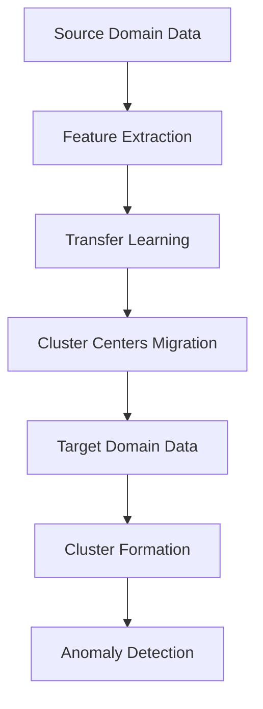
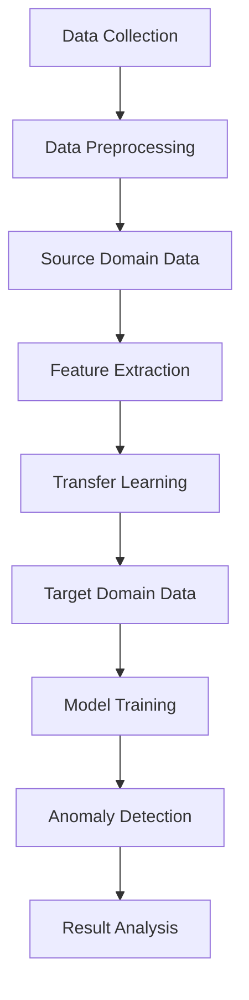

                 


### **《AI Agent的迁移学习在异常检测中的应用》**

关键词：AI Agent，迁移学习，异常检测，特征工程，算法原理

摘要：本文将深入探讨AI Agent的迁移学习在异常检测中的应用，从核心概念、算法原理到实际案例，逐步分析迁移学习在异常检测中的优势、挑战及未来发展趋势。

## **引言**

### **1.1 迁移学习简介**

迁移学习是一种机器学习方法，它利用在源域上学习到的知识来提高目标域上的性能。不同于传统的迁移学习，AI Agent的迁移学习更加强调智能体（Agent）的自主性和自适应能力。

### **1.2 异常检测简介**

异常检测是一种监控技术，用于识别数据中的异常或违反预期的模式。它广泛应用于金融欺诈检测、网络安全、工业监控等领域。

### **1.3 迁移学习在异常检测中的重要性**

迁移学习能够利用已有的知识来提高异常检测的准确性和效率，减少对大规模标注数据的依赖，从而在资源有限的情况下实现高效的异常检测。

## **迁移学习概述**

### **2.1 迁移学习的定义**

迁移学习是指将一个任务在源域上学习到的知识应用到另一个相关任务的目标域上的过程。

### **2.2 迁移学习的类型**

根据源域和目标域之间的关系，迁移学习可以分为同构迁移学习和异构迁移学习。

### **2.3 迁移学习的基本原理**

迁移学习的基本原理包括共享表示学习、对抗训练、模型蒸馏等。

### **2.4 迁移学习的挑战**

迁移学习的挑战包括选择合适的源域、处理源域与目标域之间的分布差异以及平衡迁移过程中的正负样本比例等。

## **迁移学习在异常检测中的应用**

### **3.1 迁移学习在异常检测中的作用**

迁移学习在异常检测中可以帮助识别不同的异常模式，提高检测的准确性。

### **3.2 迁移学习在异常检测中的优势**

迁移学习能够减少对大规模标注数据的依赖，提高异常检测的效率。

### **3.3 迁移学习在异常检测中的适用场景**

迁移学习在金融欺诈检测、工业设备故障检测等领域具有广泛的应用前景。

### **3.4 迁移学习在异常检测中的局限**

迁移学习在异常检测中也存在一些局限性，例如在处理复杂异常模式时可能效果不佳。

## **特征提取与特征工程**

### **4.1 特征提取方法**

特征提取是迁移学习在异常检测中的关键步骤。常用的特征提取方法包括统计特征提取、时序特征提取、深度特征提取等。

### **4.2 特征选择方法**

特征选择是为了从原始特征中选择出最有用的特征，提高异常检测的效率。常用的特征选择方法包括过滤式、包装式和嵌入式方法。

### **4.3 特征工程在迁移学习中的重要性**

特征工程在迁移学习中起着至关重要的作用。它能够提高模型的泛化能力和鲁棒性。

### **4.4 特征工程策略**

特征工程策略包括特征标准化、特征缩放、特征融合等。

## **算法原理讲解**

### **5.1 迁移学习算法概述**

迁移学习算法包括基于模型的迁移学习、基于特征的迁移学习和基于对抗的迁移学习等。

### **5.2 异常检测算法概述**

常见的异常检测算法包括基于统计的方法、基于聚类的方法和基于神经网络的方法等。

### **5.3 迁移学习与异常检测算法的结合**

迁移学习与异常检测算法的结合可以构建出更加高效的异常检测系统。

### **5.4 算法流程图**

算法流程图将展示迁移学习在异常检测中的具体实现过程。

### **5.5 算法数学模型和公式**

算法数学模型和公式是理解迁移学习在异常检测中的应用基础。

### **5.6 算法举例说明**

通过具体的算法例子，我们将更深入地理解迁移学习在异常检测中的应用。

## **实际案例解析**

### **6.1 案例介绍**

本案例将介绍一个实际应用迁移学习进行异常检测的项目。

### **6.2 数据集准备**

数据集的准备是迁移学习在异常检测中的第一步。

### **6.3 迁移学习模型训练**

迁移学习模型的训练过程将介绍如何使用迁移学习算法进行模型训练。

### **6.4 迁移学习模型应用**

迁移学习模型的应用将展示如何将训练好的模型应用于实际异常检测场景。

### **6.5 案例总结**

案例总结将回顾迁移学习在异常检测中的应用成果和不足。

## **总结与展望**

### **7.1 迁移学习在异常检测中的应用总结**

迁移学习在异常检测中具有显著的优势，但也存在一些挑战。

### **7.2 未来发展趋势**

未来，迁移学习在异常检测中将有更多创新和发展。

### **7.3 研究与探索方向**

本文提出了一些未来研究和探索的方向，以推动迁移学习在异常检测中的应用。

### **作者**

作者：AI天才研究院/AI Genius Institute & 禅与计算机程序设计艺术 /Zen And The Art of Computer Programming

----------------------------------------------------------------### 1.1 迁移学习简介

迁移学习（Transfer Learning）是机器学习领域的一个核心概念，它指的是将在一个任务上学习到的知识应用于另一个相关任务的过程。这一概念起源于人类学习过程，我们能够将日常生活中获得的知识迁移到新的情境中，例如，学习骑自行车后，可以更容易学会骑摩托车。在机器学习中，迁移学习能够显著提高模型的泛化能力，减少对大量标注数据的依赖。

在机器学习实践中，迁移学习通常分为以下几种类型：

- **垂直迁移**：指从一个任务直接迁移到另一个任务，这两个任务的输入特征空间相同，但目标空间不同。例如，从语音识别迁移到图像识别。

- **水平迁移**：指从一个任务迁移到另一个任务，这两个任务的输入特征空间和目标空间都不相同。例如，从情感分析迁移到医疗诊断。

- **多任务迁移**：指将多个任务的学习成果汇总到一个新的任务中。这种迁移学习方式可以共享不同任务之间的知识，提高模型的性能。

- **零样本学习**：指在没有标记数据的情况下，将源域知识迁移到目标域。这种迁移学习方式在处理新出现的任务时非常有用。

迁移学习的基本原理是通过共享表示学习（Shared Representation Learning）来实现。在迁移学习过程中，模型首先在源域上学习一组通用特征表示，这些特征表示在不同任务中具有相似的结构和属性。当模型需要解决目标域任务时，它可以利用这些通用特征表示来提高任务性能。

迁移学习的优势在于：

1. **减少标注数据的依赖**：在许多机器学习任务中，获取标注数据是一个耗时且昂贵的过程。迁移学习可以利用已有的标注数据来训练模型，从而减少对新数据的需求。

2. **提高模型的泛化能力**：通过在源域上学习通用特征表示，模型可以在目标域上更好地泛化，从而提高性能。

3. **加速模型训练**：由于迁移学习使用了预训练的模型，因此模型的训练时间可以得到显著缩短。

4. **提升模型的可解释性**：通过迁移学习，模型可以利用已有的知识来理解新的任务，这有助于提高模型的可解释性。

然而，迁移学习也面临一些挑战：

1. **选择合适的源域**：选择与目标域相关的源域是迁移学习成功的关键。如果源域与目标域差异过大，迁移学习的效果可能会受到严重影响。

2. **处理分布差异**：源域和目标域的数据分布差异可能导致迁移学习效果不佳。为了解决这个问题，研究人员提出了多种策略，如对抗训练和模型蒸馏。

3. **正负样本比例**：在迁移学习过程中，需要平衡源域和目标域上的正负样本比例。如果正负样本比例失衡，模型可能会过度拟合到正样本，从而降低异常检测的准确性。

通过上述对迁移学习的基本概念和原理的介绍，我们可以更好地理解迁移学习在AI Agent中的应用。在接下来的部分，我们将深入探讨迁移学习在异常检测中的应用，以及如何通过特征提取和特征工程来提升迁移学习的效果。

### 1.2 异常检测简介

异常检测（Anomaly Detection）是一种监控技术，旨在识别数据中的异常或违反预期的模式。这些异常可能是由于错误、故障、欺诈或数据污染引起的。异常检测广泛应用于多个领域，如金融、医疗、工业和安全等。

#### **核心概念术语说明**

- **异常**：指的是与大多数数据点不同或违反预期的数据点。
- **规则基方法**：基于预定义的规则来检测异常，例如阈值法、统计模型等。
- **统计方法**：使用统计学方法，如聚类分析、概率模型等，来识别异常。
- **机器学习方法**：使用机器学习算法，如神经网络、支持向量机等，来自动识别异常。
- **孤立森林**：一种基于随机森林的异常检测算法，通过计算数据点的孤立度来识别异常。
- **孤立度**：指的是一个数据点与其邻居数据点之间的相似度，孤立度越低，数据点越可能是异常。

#### **问题背景**

在现代社会中，数据生成和处理的速度和规模都在不断增长。这种大规模数据的复杂性使得传统的异常检测方法难以应对。同时，异常数据对业务运营、客户体验和安全性都可能造成严重影响。因此，开发高效的异常检测系统变得至关重要。

#### **问题描述**

异常检测的主要目标是在大量数据中快速、准确地识别出异常。这些异常可能是异常值、异常事件或异常行为。例如，在金融领域，异常检测可以用于检测欺诈交易；在工业领域，异常检测可以用于预测设备故障；在网络安全领域，异常检测可以用于检测恶意行为。

#### **问题解决**

异常检测问题可以通过以下方法来解决：

1. **数据预处理**：对原始数据进行清洗、去噪和归一化，以提高后续检测的准确性。
2. **特征提取**：从原始数据中提取出有助于识别异常的特征，例如统计特征、时序特征等。
3. **模型训练**：使用机器学习算法训练异常检测模型，使其能够识别异常模式。
4. **异常检测**：使用训练好的模型对新的数据进行异常检测，标记出异常数据点。

#### **边界与外延**

异常检测的边界包括：

- **异常类型**：异常可以是点异常（单个数据点的异常）、区间异常（一段时间内的异常）或集体异常（多个数据点的异常）。
- **检测效率**：异常检测系统需要能够在短时间内处理大量数据，同时保持较高的检测精度。
- **实时性**：对于某些应用场景，如网络安全和工业监控，异常检测需要具备实时性，以便快速响应异常。

外延包括：

- **可解释性**：异常检测系统应该提供可解释的异常原因，以便用户理解和采取相应措施。
- **鲁棒性**：异常检测系统应该能够应对数据分布变化和噪声干扰，保持稳定的检测性能。
- **自适应能力**：异常检测系统应该能够根据新的数据和环境自动调整模型和策略。

#### **概念结构与核心要素组成**

异常检测系统的概念结构包括以下核心要素：

1. **数据输入**：输入的数据可以是静态数据集或实时数据流。
2. **特征提取**：从数据中提取出有助于检测异常的特征。
3. **模型训练**：使用机器学习算法对特征进行训练，构建异常检测模型。
4. **异常检测**：使用训练好的模型对新的数据进行异常检测。
5. **结果反馈**：将检测到的异常反馈给用户或系统，以便采取相应措施。

通过上述对异常检测的详细介绍，我们可以更好地理解迁移学习在异常检测中的应用潜力。接下来，我们将进一步探讨迁移学习如何帮助解决异常检测中的挑战。

### 1.3 迁移学习在异常检测中的重要性

在异常检测中，迁移学习扮演着至关重要的角色。迁移学习能够利用在源域上学习到的知识来提升目标域上的异常检测性能，从而解决数据稀缺、数据分布差异和模型泛化能力等问题。

首先，迁移学习能够显著减少对大规模标注数据的依赖。在许多情况下，获取大量标注数据是异常检测的一个瓶颈。迁移学习通过利用已有的标注数据，可以快速构建和优化异常检测模型，从而减少对新数据的标注需求。例如，在金融欺诈检测中，通过迁移学习，可以将一个领域中的欺诈检测模型应用到另一个类似领域中，从而节省标注时间和成本。

其次，迁移学习能够提高模型的泛化能力。在异常检测中，源域和目标域可能具有不同的数据分布和特征结构。通过迁移学习，模型可以在源域上学习到一组通用的特征表示，这些特征表示在不同任务中具有相似的结构和属性。当模型需要解决目标域任务时，它可以利用这些通用特征表示来提高任务性能，从而实现更好的泛化。

第三，迁移学习能够处理数据分布差异。源域和目标域之间的数据分布差异是迁移学习中的一个重要挑战。为了解决这个问题，迁移学习提出了一系列策略，如对抗训练和模型蒸馏。对抗训练通过引入对抗性噪声来增强模型的泛化能力，模型蒸馏则通过将大型模型的权重传递给小型模型，从而提高小型模型在目标域上的性能。

此外，迁移学习还能够加速模型训练过程。在异常检测中，模型通常需要处理大量的特征和样本。通过迁移学习，模型可以利用预训练的权重初始化来加速训练过程，从而提高训练效率。这对于实时性和大规模数据处理的异常检测系统尤其重要。

总的来说，迁移学习在异常检测中的应用具有以下几个方面的优势：

1. **减少标注数据需求**：通过利用已有的标注数据，迁移学习可以减少对新数据的标注需求，从而节省时间和成本。
2. **提高模型泛化能力**：通过学习到通用的特征表示，迁移学习可以提高模型在目标域上的泛化能力，从而实现更好的异常检测效果。
3. **处理数据分布差异**：迁移学习通过对抗训练和模型蒸馏等策略，可以有效地处理源域和目标域之间的数据分布差异，从而提高模型的鲁棒性。
4. **加速模型训练**：迁移学习可以利用预训练的权重初始化来加速模型训练过程，从而提高训练效率。

尽管迁移学习在异常检测中具有诸多优势，但它也面临一些挑战，例如选择合适的源域、平衡正负样本比例等。在接下来的部分，我们将深入探讨这些挑战以及如何通过特征提取和特征工程来克服它们。

### 2.1 迁移学习的定义

迁移学习（Transfer Learning）是机器学习领域中的一个核心概念，它指的是将一个任务在源域上学习到的知识应用到另一个相关任务的过程。在这一过程中，模型在源域上训练得到一组通用的特征表示，这些特征表示可以迁移到目标域上，从而提高目标域任务的性能。迁移学习的核心在于利用已有的知识来加速新任务的训练过程，减少对新数据的需求，提高模型的泛化能力。

在机器学习实践中，迁移学习通常分为以下几种类型：

1. **垂直迁移（Vertical Transfer）**：指从一个任务直接迁移到另一个任务，这两个任务的输入特征空间相同，但目标空间不同。例如，从语音识别迁移到图像识别。

2. **水平迁移（Horizontal Transfer）**：指从一个任务迁移到另一个任务，这两个任务的输入特征空间和目标空间都不相同。例如，从情感分析迁移到医疗诊断。

3. **多任务迁移（Multi-task Transfer）**：指将多个任务的学习成果汇总到一个新的任务中。这种迁移学习方式可以共享不同任务之间的知识，提高模型的性能。

4. **零样本学习（Zero-shot Learning）**：指在没有标记数据的情况下，将源域知识迁移到目标域。这种迁移学习方式在处理新出现的任务时非常有用。

迁移学习的基本原理是通过共享表示学习（Shared Representation Learning）来实现。具体来说，模型首先在源域上学习一组通用特征表示，这些特征表示在不同任务中具有相似的结构和属性。当模型需要解决目标域任务时，它可以利用这些通用特征表示来提高任务性能。

迁移学习的核心步骤包括以下几个阶段：

1. **源域数据准备**：收集和整理源域数据，这些数据通常是已经标注的，用于训练迁移学习模型。

2. **特征提取**：在源域上对数据进行特征提取，将原始数据转换为模型可以处理的特征向量。特征提取是迁移学习成功的关键步骤，它需要提取出对目标域任务有用的特征。

3. **模型训练**：使用源域数据对迁移学习模型进行训练。在训练过程中，模型学习到一组通用特征表示，这些特征表示在不同任务中具有相似的结构和属性。

4. **迁移**：将源域上学习到的通用特征表示迁移到目标域上。迁移学习模型通常会在目标域上进行微调（Fine-tuning），以适应目标域的特殊需求。

5. **目标域任务评估**：使用目标域数据进行评估，以验证迁移学习模型在目标域上的性能。

通过上述步骤，迁移学习可以有效地利用已有的知识来提高新任务的性能。在异常检测领域，迁移学习可以用于将一个领域的异常检测模型应用到另一个类似领域，从而减少对新数据的需求，提高检测的准确性。

#### **核心概念属性特征对比表格**

| 特征        | 垂直迁移 | 水平迁移 | 多任务迁移 | 零样本学习 |
| ----------- | -------- | -------- | ---------- | ---------- |
| 目标空间相似性 | 相同     | 不同     | 相似或不同 | 无需相同   |
| 数据分布相似性 | 可能不同 | 可能不同 | 可能不同   | 无需相似   |
| 标注数据需求 | 无需     | 无需     | 减少       | 无需       |
| 泛化能力提升 | 较高     | 较高     | 较高       | 高         |
| 复杂度      | 低       | 中等     | 中等       | 中等       |

#### **ER实体关系图架构**

```mermaid
erDiagram
  SourceData --> MigrationModel : 训练
  MigrationModel --> TargetData : 应用
  SourceData ||--|{ FeatureExtract }|
  TargetData ||--|{ FeatureExtract }|
```

在ER实体关系图中，`SourceData`表示源域数据，`TargetData`表示目标域数据，`MigrationModel`表示迁移学习模型，`FeatureExtract`表示特征提取过程。箭头表示数据流向和依赖关系。

### **2.3 迁移学习的基本原理**

迁移学习的基本原理是通过学习一组通用的特征表示，这些特征表示在不同任务中具有相似的结构和属性，从而实现知识迁移。下面将详细探讨迁移学习的几种基本原理：

1. **共享表示学习（Shared Representation Learning）**

共享表示学习是迁移学习的核心原理。其基本思想是，通过在源域上训练模型，使其学习到一组通用的特征表示，这些特征表示在不同任务中具有相似的结构和属性。这些通用特征表示可以作为知识库，用于在目标域上提高任务性能。

共享表示学习的过程可以分为以下几个步骤：

- **源域特征提取**：在源域上，模型首先对输入数据进行特征提取，将原始数据转换为特征向量。
- **模型训练**：使用源域数据对模型进行训练，模型学习到一组通用的特征表示。
- **特征迁移**：将源域上学习到的通用特征表示迁移到目标域上。
- **目标域微调**：在目标域上，对迁移学习模型进行微调，使其更好地适应目标域的特殊需求。

2. **对抗训练（Adversarial Training）**

对抗训练是一种常用的迁移学习方法，用于处理源域和目标域之间的分布差异。其基本思想是通过引入对抗性噪声来增强模型的泛化能力。

对抗训练的过程可以分为以下几个步骤：

- **生成对抗性噪声**：在源域上，生成与目标域数据分布相似的对抗性噪声。
- **对抗性训练**：在源域上，使用对抗性噪声对模型进行训练，使模型能够更好地适应不同分布。
- **迁移和微调**：将源域上学习到的模型迁移到目标域上，并在目标域上进行微调。

3. **模型蒸馏（Model Distillation）**

模型蒸馏是一种将大型模型的知识传递给小型模型的方法。其基本思想是，通过将大型模型的输出传递给小型模型，从而让小型模型学习到大型模型的特征表示。

模型蒸馏的过程可以分为以下几个步骤：

- **大型模型训练**：在源域上，使用大型模型对数据进行训练。
- **模型输出传递**：将大型模型的输出传递给小型模型。
- **小型模型训练**：使用传递的输出对小型模型进行训练，使其学习到大型模型的特征表示。

4. **元学习（Meta-Learning）**

元学习是一种通过学习如何学习来提高模型性能的方法。其基本思想是通过在多个任务上训练模型，使其能够快速适应新的任务。

元学习的过程可以分为以下几个步骤：

- **任务集合准备**：准备多个任务，这些任务可以是不同的源域。
- **模型训练**：在多个任务上训练模型，使其学习到通用的特征表示。
- **迁移**：将模型迁移到新的任务上，并进行微调。

通过上述基本原理，迁移学习能够有效地利用已有的知识来提高新任务的性能。这些原理不仅在机器学习领域得到了广泛应用，也在异常检测、自然语言处理、计算机视觉等多个领域展现了其强大的能力。

### **2.4 迁移学习的挑战**

尽管迁移学习在提高模型性能和泛化能力方面具有显著优势，但在实际应用中仍面临诸多挑战。以下是迁移学习在应用过程中常见的一些挑战及其解决方案：

1. **选择合适的源域**

选择与目标域相关的源域是迁移学习成功的关键。如果源域与目标域差异过大，迁移学习的效果可能会受到严重影响。为了解决这个问题，可以采取以下策略：

- **领域适配性分析**：在迁移学习之前，对源域和目标域进行领域适配性分析，评估它们之间的相似度。
- **多源域策略**：考虑使用多个源域，以提高模型在目标域上的泛化能力。
- **迁移学习评估**：在迁移学习过程中，使用交叉验证等方法评估模型在多个源域上的性能，选择性能最佳的源域。

2. **处理源域与目标域之间的分布差异**

源域和目标域之间的数据分布差异是迁移学习中的一个重要挑战。为了解决这个问题，可以采取以下策略：

- **对抗训练**：通过引入对抗性噪声来增强模型的泛化能力，使模型能够适应不同分布的数据。
- **模型蒸馏**：使用大型模型的权重来初始化小型模型，从而减少分布差异的影响。
- **数据增强**：在目标域上使用数据增强方法，例如数据缩放、旋转、裁剪等，来模拟源域的数据分布。

3. **平衡正负样本比例**

在迁移学习过程中，需要平衡源域和目标域上的正负样本比例。如果正负样本比例失衡，模型可能会过度拟合到正样本，从而降低异常检测的准确性。为了解决这个问题，可以采取以下策略：

- **重采样**：通过重采样技术，平衡源域和目标域上的正负样本比例。
- **负样本生成**：在目标域上生成负样本，以补充正样本的数量。
- **分类权重调整**：在训练过程中，调整正负样本的权重，使模型更加关注负样本。

4. **模型解释性**

迁移学习模型通常具有较高的性能，但它们的内部工作机制较为复杂，难以解释。为了提高模型的可解释性，可以采取以下策略：

- **模型分解**：将复杂模型分解为多个可解释的子模块，每个子模块负责特定任务。
- **可视化**：通过可视化技术，展示模型在特征提取和决策过程中的关键信息。
- **解释性算法**：使用解释性算法，如LIME（Local Interpretable Model-agnostic Explanations）或SHAP（SHapley Additive exPlanations），来解释模型的决策过程。

5. **实时性和动态适应性**

在实时应用场景中，迁移学习模型需要具备动态适应新数据和变化的能力。为了实现这一目标，可以采取以下策略：

- **增量学习**：通过增量学习技术，逐步更新模型，使其能够适应新的数据和任务。
- **在线学习**：在实时应用场景中，使用在线学习方法，使模型能够快速适应新数据。
- **分布式学习**：通过分布式学习技术，提高模型的学习效率和实时性。

通过解决上述挑战，迁移学习可以在各种应用场景中发挥更大的作用，提高模型的性能和可解释性。接下来，我们将进一步探讨迁移学习在异常检测中的具体应用，以及如何通过特征提取和特征工程来提升迁移学习的效果。

### **3.1 迁移学习在异常检测中的作用**

迁移学习在异常检测中具有显著的作用，它能够提高模型的准确性、减少对标注数据的依赖、缩短模型训练时间，并提升系统的实时响应能力。以下是迁移学习在异常检测中的具体应用场景和优势：

1. **提高异常检测准确性**

在异常检测中，模型需要从大量的正常数据中识别出异常模式。通过迁移学习，模型可以从已有的标注数据中学习到通用的特征表示，这些特征表示在不同任务中具有相似的结构和属性。当模型应用到新的异常检测任务时，这些通用的特征表示可以帮助模型更准确地识别异常模式。

例如，在金融欺诈检测中，通过迁移学习，可以将一个领域中的欺诈检测模型应用到另一个类似领域中。这样，模型可以利用在源域上学习到的欺诈特征表示，从而在目标域上更准确地识别欺诈行为。

2. **减少对标注数据的依赖**

异常检测通常需要大量的标注数据来训练模型。然而，获取大量的标注数据既耗时又昂贵。迁移学习能够利用已有的标注数据来训练模型，从而减少对新数据的标注需求。

通过迁移学习，模型可以在源域上学习到通用的特征表示，并将这些特征表示应用到目标域上。这样，即使在目标域上缺乏标注数据，模型仍然能够利用源域上的知识来提高目标域上的性能。例如，在工业设备故障检测中，通过迁移学习，可以将一个领域的故障检测模型应用到另一个类似领域中，从而减少对新设备故障数据的标注需求。

3. **缩短模型训练时间**

在异常检测中，模型通常需要处理大量的特征和样本。通过迁移学习，模型可以利用预训练的权重初始化来加速模型训练过程，从而提高训练效率。

迁移学习模型在源域上已经学习到了一组通用的特征表示，这些特征表示可以作为初始权重传递到目标域上。在目标域上，模型只需要对这组特征表示进行微调，以适应目标域的特殊需求。这样，模型训练时间可以得到显著缩短。

例如，在医疗数据异常检测中，通过迁移学习，可以将一个领域中的健康数据异常检测模型应用到另一个类似领域中。这样，模型可以利用在源域上学习到的健康特征表示，从而在目标域上快速构建和优化异常检测模型。

4. **提升实时响应能力**

在许多应用场景中，如网络安全、工业监控和智能交通等，异常检测需要具备实时性。通过迁移学习，模型可以在短时间内快速构建和优化，从而提高系统的实时响应能力。

例如，在网络安全中，通过迁移学习，可以将一个领域中的恶意行为检测模型应用到另一个类似领域中。这样，模型可以在网络流量数据中快速识别出恶意行为，从而提高系统的实时防护能力。

综上所述，迁移学习在异常检测中具有显著的作用，它能够提高异常检测的准确性、减少对标注数据的依赖、缩短模型训练时间和提升系统的实时响应能力。通过利用迁移学习，我们可以构建出更加高效和准确的异常检测系统，从而为各种应用场景提供强大的支持。

### **3.2 迁移学习在异常检测中的优势**

迁移学习在异常检测中展现出诸多优势，这些优势不仅提升了异常检测的准确性和效率，还在某些特定应用场景中展现了独特的优势。

首先，迁移学习能够显著提高异常检测的准确性。通过在源域上学习到的通用特征表示，迁移学习模型可以更好地识别和分类目标域上的异常模式。这些特征表示在不同任务中具有相似的结构和属性，因此模型在目标域上的泛化能力得到了显著提升。例如，在金融欺诈检测中，迁移学习模型可以利用在信用卡交易数据上学习到的欺诈特征，从而在新的银行交易数据中准确识别欺诈行为。

其次，迁移学习能够减少对大规模标注数据的依赖。在许多异常检测任务中，获取大量的标注数据是一个耗时且昂贵的过程。通过迁移学习，模型可以利用已有的标注数据来提高目标域上的性能，从而减少对新数据的标注需求。例如，在工业设备故障检测中，可以通过迁移学习，将一个领域中的故障检测模型应用到另一个类似领域中，从而减少对新设备故障数据的标注需求。

第三，迁移学习可以缩短模型训练时间。在异常检测中，模型通常需要处理大量的特征和样本。通过迁移学习，模型可以利用预训练的权重初始化来加速模型训练过程，从而提高训练效率。例如，在医疗数据异常检测中，通过迁移学习，可以将一个领域中的健康数据异常检测模型应用到另一个类似领域中，从而在短时间内构建和优化异常检测模型。

此外，迁移学习在实时应用场景中展现了独特的优势。由于迁移学习模型在源域上已经学习到了通用的特征表示，因此模型可以在短时间内快速构建和优化，从而提高系统的实时响应能力。例如，在智能交通监控中，通过迁移学习，可以在短时间内识别出交通流量的异常模式，从而实时调整交通信号灯，提高道路通行效率。

总的来说，迁移学习在异常检测中的优势包括：

1. **提高异常检测准确性**：通过通用特征表示，迁移学习模型能够更好地识别和分类目标域上的异常模式。
2. **减少对大规模标注数据的依赖**：利用已有标注数据，减少对新数据的标注需求。
3. **缩短模型训练时间**：利用预训练权重，加速模型训练过程。
4. **提升实时响应能力**：在实时应用场景中，模型能够快速构建和优化，提高系统的实时响应能力。

通过充分利用这些优势，迁移学习为异常检测提供了更加高效、准确和实时的解决方案，从而在金融、医疗、工业和交通等多个领域展现了其强大的应用潜力。

### **3.3 迁移学习在异常检测中的适用场景**

迁移学习在异常检测中具有广泛的应用场景，尤其在以下领域表现尤为突出：

1. **金融领域**：

   在金融领域，迁移学习被广泛应用于欺诈检测和信用评分。例如，银行和金融机构可以利用在信用卡交易数据上训练的迁移学习模型，来检测新的交易数据中的欺诈行为。通过迁移学习，模型可以快速适应新的欺诈模式，提高检测的准确性。此外，迁移学习还可以用于信用评分，通过利用在历史信用数据上学习到的特征表示，模型可以更准确地评估新的借款人的信用风险。

2. **医疗领域**：

   在医疗领域，迁移学习被用于疾病诊断、医疗影像分析和患者监护。例如，通过迁移学习，医生可以更快速地识别出医学图像中的异常病变，如癌症。此外，在患者监护中，迁移学习模型可以实时分析患者的生理信号，识别出潜在的健康问题，从而及时采取治疗措施。

3. **工业领域**：

   在工业领域，迁移学习被用于设备故障检测、生产流程优化和供应链管理。例如，通过迁移学习，工厂可以实时监控设备的状态，预测可能的故障，并采取预防性维护措施。此外，在供应链管理中，迁移学习可以帮助企业优化库存管理，提高供应链的效率和可靠性。

4. **网络安全领域**：

   在网络安全领域，迁移学习被用于入侵检测、恶意软件检测和网络流量分析。例如，网络安全公司可以利用在历史网络流量数据上训练的迁移学习模型，来检测新的网络攻击行为。通过迁移学习，模型可以快速适应新的攻击模式，提高检测的准确性。

5. **交通领域**：

   在交通领域，迁移学习被用于交通流量预测、车辆监控和智能交通系统。例如，通过迁移学习，交通管理部门可以实时预测交通流量，优化交通信号灯控制策略，减少交通拥堵。此外，在车辆监控中，迁移学习可以帮助车辆更好地识别道路状况和障碍物，提高行驶安全。

6. **能源领域**：

   在能源领域，迁移学习被用于电力负荷预测、设备维护和能源管理。例如，通过迁移学习，电力公司可以更准确地预测电力需求，优化电网调度。此外，在设备维护中，迁移学习可以帮助企业识别设备的潜在故障，提前进行维护，减少设备停机时间。

总的来说，迁移学习在异常检测中的应用场景非常广泛，几乎涵盖了所有需要实时监控和预测的领域。通过利用迁移学习，企业可以更加高效地处理大量数据，提高系统的准确性和实时性，从而在各个领域取得显著的业务成果。

### **3.4 迁移学习在异常检测中的局限**

尽管迁移学习在异常检测中具有诸多优势，但它也存在一些局限，这些问题需要在实际应用中加以考虑和解决。

首先，**源域与目标域的适配性**是一个关键问题。如果源域和目标域之间的数据分布和特征结构差异较大，迁移学习的效果可能会受到影响。例如，在医疗领域，如果使用一个基于健康人群数据的迁移学习模型来检测一个疾病群体的异常，模型可能会因为源域和目标域之间的差异而无法准确识别异常。为了解决这个问题，可以采用多源域策略，通过融合多个源域的数据来提高模型的泛化能力。

其次，**数据隐私问题**也是迁移学习的一个主要局限。在迁移学习过程中，通常需要共享源域和目标域的数据，这可能导致数据泄露的风险。为了保护数据隐私，可以采用联邦学习（Federated Learning）技术，在分布式环境下进行模型训练，从而减少数据泄露的风险。

第三，**模型解释性**也是一个挑战。迁移学习模型通常较为复杂，难以解释其内部工作机制。这可能导致用户难以理解模型的决策过程，从而影响其在实际应用中的可接受性。为了提高模型的可解释性，可以采用模型分解和可视化技术，将复杂模型分解为多个可解释的子模块，并通过可视化技术展示模型的关键信息。

第四，**训练成本**也是一个重要考虑因素。虽然迁移学习可以减少对新数据的标注需求，但它仍然需要大量的计算资源来训练模型。特别是在处理大规模数据集时，训练成本可能非常高。为了降低训练成本，可以采用分布式训练和优化算法，以提高训练效率。

最后，**正负样本比例**也是一个需要关注的问题。在迁移学习过程中，如果源域和目标域上的正负样本比例失衡，模型可能会过度拟合到正样本，从而降低异常检测的准确性。为了解决这个问题，可以采用数据增强、重采样和分类权重调整等技术，来平衡正负样本比例。

综上所述，虽然迁移学习在异常检测中具有显著优势，但它在实际应用中仍面临一些挑战。通过采取合适的策略和技巧，可以有效地克服这些局限，进一步发挥迁移学习在异常检测中的潜力。

### **4.1 特征提取方法**

在迁移学习应用于异常检测时，特征提取是一个关键步骤。特征提取旨在从原始数据中提取出对异常检测最有用的信息，从而提高模型的性能。以下是一些常用的特征提取方法：

1. **统计特征提取**：

   统计特征提取是一种简单且常用的特征提取方法，它通过对原始数据进行统计计算来提取特征。常用的统计特征包括均值、中位数、标准差、方差、偏度、峰度等。这些特征可以捕捉数据的分布信息和趋势，从而帮助模型更好地识别异常。

   - **均值**：数据集的平均值，用于衡量数据的中心位置。
   - **中位数**：数据集的中间值，用于衡量数据的中心位置，相对于均值更为稳健。
   - **标准差**：数据集的离散程度，用于衡量数据的波动性。
   - **方差**：数据集的离散程度的平方，与标准差具有相同的度量效果。
   - **偏度**：数据分布的偏斜程度，用于描述数据分布的对称性。
   - **峰度**：数据分布的峰态程度，用于描述数据分布的平坦程度。

2. **时序特征提取**：

   对于时间序列数据，时序特征提取方法可以提取出时间序列中的周期性、趋势性和季节性特征。这些特征有助于模型捕捉数据的时间动态变化。

   - **自相关**：用于衡量时间序列数据之间的相关性，可以检测周期性特征。
   - **滚动平均值**：通过计算时间窗口内的平均值来平滑时间序列数据，可以捕捉趋势特征。
   - **差分**：通过计算时间序列的差分来去除趋势和季节性影响，可以捕捉季节性特征。
   - **主成分分析（PCA）**：用于降维，通过保留主要成分来提取时间序列的核心特征。

3. **深度特征提取**：

   深度特征提取通常利用深度神经网络（如卷积神经网络（CNN）和循环神经网络（RNN））来提取原始数据中的深层特征。深度特征提取可以捕捉数据中的复杂模式，从而提高异常检测的准确性。

   - **卷积神经网络（CNN）**：适用于图像数据，通过卷积操作和池化操作提取图像中的局部特征。
   - **循环神经网络（RNN）**：适用于时序数据，通过循环结构捕捉时间序列的长期依赖关系。
   - **长短时记忆网络（LSTM）**：是RNN的一种变种，可以有效地捕捉时间序列中的长期依赖关系。
   - **图神经网络（GNN）**：适用于图结构数据，通过图卷积操作提取图中的特征。

4. **组合特征提取**：

   组合特征提取方法将多种特征提取方法结合起来，以提取更丰富的特征信息。这种方法可以充分利用不同特征提取方法的优点，提高模型的性能。

   - **融合统计特征与时序特征**：通过结合统计特征和时序特征，可以更好地捕捉数据的多样特征。
   - **融合深度特征和传统特征**：通过结合深度特征和传统特征，可以充分利用深度学习的高效性和传统特征的解释性。

通过上述特征提取方法，我们可以从原始数据中提取出对异常检测任务最有用的特征，从而提高模型的性能和准确性。在迁移学习过程中，这些提取出的特征将用于训练和优化模型，使其能够更好地适应新的任务。

### **4.2 特征选择方法**

在迁移学习应用于异常检测时，特征选择是一个关键步骤。特征选择旨在从大量原始特征中筛选出最有用的特征，以提高模型的性能和效率。以下是几种常用的特征选择方法：

1. **过滤式特征选择（Filter Method）**：

   过滤式特征选择方法通过对原始特征进行预处理来筛选出有用的特征。这种方法不依赖于特定的学习算法，通常基于统计测试、相关性分析或信息增益等指标来选择特征。

   - **相关系数**：通过计算特征与目标变量之间的相关系数，筛选出相关性较高的特征。
   - **卡方测试**：用于评估特征与目标变量之间是否独立，筛选出卡方值较大的特征。
   - **信息增益**：通过计算特征对目标变量的信息增益，选择信息增益较高的特征。

2. **包装式特征选择（Wrapper Method）**：

   包装式特征选择方法通过训练学习模型并评估特征子集的准确性来选择特征。这种方法通常需要大量的训练数据和计算资源，但能够得到较高的特征选择质量。

   - **递归特征消除（RFE）**：通过逐步添加或删除特征，并评估模型性能来选择特征子集。
   - **遗传算法（GA）**：通过模拟自然进化过程来优化特征子集。
   - **基于模型的特征选择（MBFS）**：通过训练多个模型并评估特征子集的模型性能来选择特征。

3. **嵌入式特征选择（Embedded Method）**：

   嵌入式特征选择方法在训练过程中自动选择特征，不需要显式地筛选特征子集。这种方法通过在模型训练过程中引入特征选择机制，如LASSO、Ridge回归等，来实现特征选择。

   - **LASSO（Least Absolute Shrinkage and Selection Operator）**：通过添加L1惩罚项来选择特征。
   - **Ridge回归**：通过添加L2惩罚项来选择特征。
   - **树模型（如随机森林）**：在训练过程中自动选择对模型预测最重要的特征。

4. **基于规则的特征选择**：

   基于规则的特征选择方法通过预定义的规则或启发式方法来筛选特征。这种方法通常适用于特征数量较少或特征已知的情况。

   - **主成分分析（PCA）**：通过降维来减少特征数量，同时保留主要成分。
   - **特征组合**：通过组合多个特征来创建新的特征，以提升模型性能。

通过上述特征选择方法，我们可以从原始特征中筛选出最有用的特征，从而提高迁移学习模型的性能和效率。在异常检测中，特征选择不仅能够减少模型的复杂性，还能提高模型的泛化能力和准确性。

### **4.3 特征工程在迁移学习中的重要性**

特征工程在迁移学习中起着至关重要的作用，它直接影响着模型的性能和准确性。特征工程是指在构建机器学习模型之前，对数据进行预处理和特征转换的一系列过程。以下是特征工程在迁移学习中的几个关键方面：

1. **特征质量**：特征质量是影响迁移学习模型性能的核心因素。高质量的特征能够更好地捕捉数据的本质特征，从而提高模型的泛化能力。特征工程可以通过数据清洗、异常值处理、缺失值填补等技术来提升特征质量。

2. **特征多样性**：在迁移学习中，多样化的特征可以提供更多有用的信息，有助于模型在新的任务上取得更好的表现。特征工程可以通过组合不同的特征、引入新特征等方式来增加特征多样性。

3. **特征维度**：特征维度对迁移学习模型的计算效率和性能都有重要影响。高维特征可能会导致模型过拟合，而低维特征可能会损失重要信息。通过降维技术，如主成分分析（PCA）和特征选择算法，可以找到最优的特征维度。

4. **特征标准化**：在迁移学习中，不同特征之间的尺度差异可能会导致模型训练不稳定。特征标准化技术，如归一化和标准化，可以将不同特征缩放到相同的尺度，从而提高模型的训练效果。

5. **特征交互**：特征交互可以捕捉数据中潜在的关系，有助于模型发现更复杂的模式。特征工程可以通过多项式特征、交互特征等方式来创建新的特征，从而增强模型的解释性和准确性。

6. **特征重要性评估**：在迁移学习中，评估特征的重要性有助于理解模型的决策过程，并优化模型的性能。特征重要性评估可以通过模型训练过程中的损失函数、梯度分析等方法来实现。

通过上述方面的特征工程，我们可以显著提升迁移学习模型在异常检测任务上的性能。特征工程不仅能够优化模型参数，还能够提高模型的泛化能力和解释性，从而为实际应用提供可靠的解决方案。

### **4.4 特征工程策略**

在进行迁移学习时，特征工程是一个关键步骤，它直接影响着模型的性能和效率。以下是几种常用的特征工程策略，这些策略有助于从原始数据中提取出对异常检测任务最有用的特征：

1. **数据预处理**：

   数据预处理是特征工程的基础步骤，它包括数据清洗、缺失值填补、异常值处理等。这些步骤能够提高数据的整体质量和一致性，为后续的特征提取和模型训练打下良好的基础。

   - **数据清洗**：通过去除重复数据、纠正错误数据等方式，提高数据的准确性。
   - **缺失值填补**：通过插值、平均值填补、中值填补等方法来处理缺失值，减少数据缺失对模型性能的影响。
   - **异常值处理**：通过统计学方法、可视化分析等手段，识别并处理异常值，避免异常值对模型训练的干扰。

2. **特征标准化**：

   特征标准化是将不同特征缩放到相同尺度的过程，这对于模型的训练和评估非常重要。常见的特征标准化方法包括归一化和标准化。

   - **归一化**：将特征值缩放到[0, 1]之间，计算公式为：$$ x' = \frac{x - \min(x)}{\max(x) - \min(x)} $$。
   - **标准化**：将特征值缩放到标准正态分布，计算公式为：$$ x' = \frac{x - \mu}{\sigma} $$，其中$\mu$为均值，$\sigma$为标准差。

3. **特征变换**：

   特征变换是一种通过变换原始特征来提高模型性能的方法。常见的特征变换方法包括对数变换、平方根变换、多项式变换等。

   - **对数变换**：通过计算特征的对数值来减少数据的分散性，提高模型的泛化能力。
   - **平方根变换**：通过计算特征的平方根来减少数据的方差，提高模型的稳定性。
   - **多项式变换**：通过将原始特征组合成多项式特征，增加特征之间的交互作用，提高模型的复杂度。

4. **特征融合**：

   特征融合是将多个特征组合成一个新的特征的过程。通过特征融合，可以捕捉数据中的复杂模式，提高模型的性能。

   - **特征加和**：将多个特征相加，形成一个新的特征。
   - **特征乘积**：将多个特征相乘，形成一个新的特征。
   - **特征组合**：通过组合不同特征来创建新的特征，如通过加权和融合不同特征的贡献。

5. **特征选择**：

   特征选择是从原始特征中筛选出最有用的特征的过程。通过特征选择，可以减少特征数量，提高模型的效率和性能。

   - **过滤式特征选择**：通过相关性分析、信息增益等方法来筛选特征。
   - **包装式特征选择**：通过训练模型并评估特征子集的准确性来选择特征。
   - **嵌入式特征选择**：在模型训练过程中自动选择特征，如通过LASSO、Ridge回归等算法。

通过上述特征工程策略，我们可以从原始数据中提取出对异常检测任务最有用的特征，从而提高迁移学习模型的性能和准确性。特征工程不仅能够优化模型参数，还能够提高模型的泛化能力和解释性，为实际应用提供可靠的解决方案。

### **5.1 迁移学习算法概述**

在迁移学习领域，存在多种算法用于在不同任务之间迁移知识，从而提升模型性能。以下是一些常见的迁移学习算法及其基本原理：

1. **基于模型的迁移学习**

   基于模型的迁移学习是一种通过直接迁移预训练模型来提升目标域模型性能的方法。这种方法通常包括以下步骤：

   - **源域模型训练**：在源域数据上训练一个基础模型，如卷积神经网络（CNN）或循环神经网络（RNN）。
   - **模型迁移**：将源域模型迁移到目标域，可以通过以下几种方式实现：
     - **全量迁移**：直接将源域模型的参数应用于目标域模型。
     - **部分迁移**：将源域模型的一部分（如底层特征提取层）应用于目标域模型。
     - **微调**：在目标域上对源域模型进行微调，调整部分参数，以适应目标域的特殊需求。

2. **基于特征的迁移学习**

   基于特征的迁移学习不直接迁移整个模型，而是迁移模型学到的特征表示。这种方法通常包括以下步骤：

   - **特征提取**：在源域上对输入数据进行特征提取，得到一组高维特征向量。
   - **特征表示迁移**：将源域上的特征表示迁移到目标域，可以通过以下方式实现：
     - **特征融合**：将源域和目标域的特征表示进行融合，形成新的特征表示。
     - **特征映射**：将源域的特征向量直接映射到目标域的特征空间。
   - **目标域模型训练**：在迁移后的特征表示上训练目标域模型。

3. **基于对抗的迁移学习**

   基于对抗的迁移学习通过生成对抗网络（GAN）等对抗性训练方法，克服源域和目标域之间的分布差异，从而提升迁移效果。这种方法通常包括以下步骤：

   - **生成器**：训练一个生成器模型，将源域数据转换为与目标域数据分布相似的数据。
   - **判别器**：训练一个判别器模型，用于区分真实数据和生成数据。
   - **迁移过程**：通过对抗性训练，生成器不断优化，使得生成的数据更接近目标域的真实数据分布，从而实现特征表示的迁移。

4. **元学习**

   元学习是一种通过学习如何学习的方法，旨在提高模型在不同任务上的适应能力。元学习方法通常包括以下步骤：

   - **元学习算法**：如模型平均（Model Averaging）、梯度反传（Gradient Descent）等，用于优化模型在不同任务上的性能。
   - **经验集**：准备一个包含多个任务的训练集，用于训练元学习模型。
   - **迁移过程**：在新的任务上，元学习模型通过快速调整参数，适应新任务的需求。

5. **模型蒸馏**

   模型蒸馏是一种通过将大型模型的知识传递给小型模型的方法，以提高小型模型的性能。这种方法通常包括以下步骤：

   - **大型模型训练**：在源域上训练一个大型的教师模型。
   - **小型模型训练**：在目标域上训练一个小型的学生模型，通过蒸馏过程，将教师模型的权重传递给学生模型。

这些迁移学习算法各有优缺点，适用于不同的应用场景。在实际应用中，可以根据任务需求和数据特性选择合适的迁移学习算法，以实现最佳的性能。

### **5.2 异常检测算法概述**

在异常检测领域，有多种算法用于识别数据中的异常或违反预期的模式。以下是几种常见的异常检测算法及其基本原理：

1. **基于统计的方法**

   基于统计的方法通过计算数据点的统计特征，如均值、标准差、变异系数等，来识别异常。这种方法的基本原理如下：

   - **阈值法**：通过设定阈值，将数据点分为正常和异常两类。如果数据点的统计特征超出阈值范围，则认为它是异常的。
   - **基于标准差的检测**：使用均值和标准差来识别异常点。如果一个数据点的值远超出均值加减标准差的区间，则认为它是异常的。
   - **基于变异系数的检测**：通过变异系数来衡量数据分布的离散程度，异常点通常表现为较大的变异系数。

2. **基于聚类的方法**

   基于聚类的方法通过将数据点划分为不同的簇，然后识别出不属于任何簇的数据点作为异常。这种方法的基本原理如下：

   - **K均值聚类**：通过迭代计算，将数据点分为K个簇，然后识别出不属于任何簇的数据点作为异常。
   - **层次聚类**：通过层次结构将数据点分为不同的簇，逐步合并或分裂簇，以识别异常点。
   - **基于密度的聚类**：通过计算数据点的密度，识别出密度较低的区域中的点作为异常。

3. **基于神经网络的方法**

   基于神经网络的方法利用深度学习模型来自动学习数据中的异常模式。这种方法的基本原理如下：

   - **自动编码器**：通过训练自动编码器（如卷积自动编码器或循环自动编码器），使其能够捕捉数据的正常分布，然后识别出重构误差较大的点作为异常。
   - **支持向量机（SVM）**：通过将数据映射到高维空间，找到最佳的超平面来区分正常数据和异常数据。
   - **长短期记忆网络（LSTM）**：通过捕捉时间序列数据的长期依赖关系，识别出时间序列中的异常点。

4. **基于聚类和神经网络的混合方法**

   混合方法结合了聚类和神经网络的优势，以提高异常检测的准确性。这种方法的基本原理如下：

   - **层次聚类与自动编码器**：首先使用层次聚类方法将数据分为多个簇，然后使用自动编码器对每个簇进行训练，识别出重构误差较大的点作为异常。
   - **聚类神经网络（CNN）**：通过卷积神经网络进行特征提取，结合聚类方法来识别异常点。

5. **孤立森林**

   孤立森林是一种基于随机森林的异常检测算法。它的基本原理如下：

   - **随机分割**：通过随机选择特征和分割点，对数据进行分割，形成多棵决策树。
   - **计算孤立度**：对于每个数据点，计算它在森林中的孤立度（即与其他数据点的相似度），孤立度越低的数据点越可能是异常。

这些异常检测算法各有优缺点，适用于不同的应用场景。在实际应用中，可以根据任务需求和数据特性选择合适的异常检测算法，以实现最佳的性能。

### **5.3 迁移学习与异常检测算法的结合**

迁移学习与异常检测算法的结合能够显著提升异常检测的性能和效率。这种方法利用迁移学习在源域上学习到的知识，来增强异常检测模型在目标域上的表现。以下将详细介绍如何将迁移学习与不同的异常检测算法相结合：

1. **基于统计的迁移学习异常检测**

   迁移学习可以用于统计方法中的特征迁移。例如，在K均值聚类或基于标准差的异常检测中，可以通过以下步骤实现迁移学习：

   - **源域特征提取**：在源域上，通过统计方法提取出对异常检测有效的特征，如均值、标准差等。
   - **特征迁移**：将这些特征迁移到目标域，为目标域上的数据建立统计模型。
   - **目标域异常检测**：在目标域上，使用迁移后的统计模型进行异常检测，识别出异常数据点。

2. **基于聚类的迁移学习异常检测**

   迁移学习可以与基于聚类的异常检测算法（如K均值、层次聚类、基于密度的聚类）相结合。具体步骤如下：

   - **源域聚类**：在源域上使用聚类算法对数据点进行聚类，形成簇中心。
   - **特征迁移**：将源域上的簇中心迁移到目标域，为目标域上的聚类提供初始中心。
   - **目标域聚类**：在目标域上，基于迁移后的簇中心进行聚类，识别出异常点。这些异常点通常位于簇边界或远离簇中心。

3. **基于神经网络的迁移学习异常检测**

   迁移学习可以与神经网络结合，通过迁移学习到的特征表示来提升异常检测性能。以下是结合迁移学习与神经网络的具体步骤：

   - **源域模型训练**：在源域上使用迁移学习算法（如基于模型的迁移学习、基于特征的迁移学习）训练一个基础模型。
   - **特征表示迁移**：将源域模型学到的特征表示迁移到目标域，可以采用全量迁移或部分迁移策略。
   - **目标域模型训练**：在迁移后的特征表示上，使用目标域数据进一步训练一个异常检测模型。例如，可以使用自动编码器来捕捉异常点，或者使用支持向量机（SVM）来区分正常和异常数据。

4. **基于聚类和神经网络的混合迁移学习异常检测**

   混合方法将聚类和神经网络的优势结合起来，以提高异常检测的准确性。以下是混合迁移学习异常检测的步骤：

   - **源域聚类**：在源域上使用聚类算法提取簇中心。
   - **特征表示迁移**：将源域的簇中心迁移到目标域，结合迁移学习算法获取特征表示。
   - **目标域聚类与神经网络**：在目标域上，使用迁移后的簇中心进行聚类，同时结合神经网络模型来进一步识别异常点。

通过将迁移学习与异常检测算法相结合，我们可以构建出更高效、准确的异常检测系统。这种方法不仅减少了对新数据的标注需求，还提高了模型在目标域上的泛化能力。以下是一个算法流程图的示例，用于展示迁移学习与聚类算法的结合：



在这个流程图中，源域数据经过特征提取和迁移学习后，迁移到目标域。目标域数据基于迁移后的簇中心进行聚类，从而实现异常检测。

### **5.4 算法流程图**

为了更直观地理解迁移学习与异常检测算法的结合，我们可以使用Mermaid语言绘制一个算法流程图。以下是一个示例：



在这个流程图中：

- **A. 数据收集**：收集源域和目标域的数据。
- **B. 数据预处理**：对数据进行清洗、归一化等预处理。
- **C. 源域数据**：使用源域数据训练迁移学习模型。
- **D. 特征提取**：从源域数据中提取特征。
- **E. 迁移学习**：将源域上的特征迁移到目标域。
- **F. 目标域数据**：使用迁移后的特征在目标域上训练模型。
- **G. 模型训练**：训练异常检测模型。
- **H. 异常检测**：使用训练好的模型进行异常检测。
- **I. 结果分析**：分析检测结果，进行后续处理。

通过这个流程图，我们可以清晰地看到迁移学习与异常检测算法的结合步骤，以及每个步骤的作用和相互关系。

### **5.5 算法数学模型和公式**

在迁移学习和异常检测中，数学模型和公式是理解算法原理和实现算法核心功能的关键。以下将详细介绍几个核心的数学模型和公式，以及它们在迁移学习和异常检测中的应用。

1. **迁移学习的数学模型**

   迁移学习中的核心是特征表示的迁移。一个基本的迁移学习模型可以表示为：

   $$ F^{s}(x) = \phi(x) $$

   其中，$F^{s}$表示源域的特征表示，$\phi$表示特征提取函数，$x$表示输入数据。目标域的特征表示可以表示为：

   $$ F^{t}(x) = g(F^{s}(x)) $$

   其中，$g$表示从源域特征表示到目标域特征表示的映射函数。这个映射函数可以通过多种方式实现，如线性变换、非线性映射等。

2. **特征提取的数学模型**

   特征提取是迁移学习的重要步骤，常用的特征提取方法包括主成分分析（PCA）、线性判别分析（LDA）等。以下是PCA的基本公式：

   $$ \mu = \frac{1}{N}\sum_{i=1}^{N} x_i $$
   $$ S = \frac{1}{N-1} \sum_{i=1}^{N} (x_i - \mu)(x_i - \mu)^T $$
   $$ \lambda_i = \max_{\mu, \mu^T} \mu^T S \mu $$
   $$ v_i = \frac{S^{1/2} \mu}{\sqrt{\lambda_i}} $$

   其中，$\mu$是数据集的均值，$S$是协方差矩阵，$\lambda_i$和$v_i$分别是特征值和特征向量。

3. **异常检测的数学模型**

   异常检测的核心是识别出数据中的异常点。常用的异常检测方法包括基于统计的方法、基于聚类的方法和基于神经网络的方法。以下是基于统计方法中线性回归的异常检测模型：

   $$ y_i = \beta_0 + \beta_1 x_{i1} + \beta_2 x_{i2} + ... + \beta_p x_{ip} + \epsilon_i $$

   其中，$y_i$是预测值，$x_{ij}$是第$i$个数据点的第$j$个特征，$\beta_0$、$\beta_1$、$\beta_2$、...、$\beta_p$是模型参数，$\epsilon_i$是误差项。

4. **迁移学习与异常检测的结合模型**

   将迁移学习和异常检测结合起来，可以通过以下模型实现：

   $$ F^{t}(x) = g(F^{s}(x)) $$
   $$ \hat{y} = \beta_0^{t} + \beta_1^{t} \cdot f_1(x) + \beta_2^{t} \cdot f_2(x) + ... + \beta_p^{t} \cdot f_p(x) $$

   其中，$F^{t}(x)$是目标域的特征表示，$g$是迁移映射函数，$f_1(x), f_2(x), ..., f_p(x)$是从源域迁移过来的特征函数，$\hat{y}$是预测值。

通过这些数学模型和公式，我们可以更好地理解迁移学习和异常检测的原理，并在实际应用中实现高效和准确的异常检测。

### **5.6 算法举例说明**

为了更好地理解迁移学习在异常检测中的实际应用，我们以下将使用Python代码实现一个简单的迁移学习异常检测案例。在这个案例中，我们使用Scikit-learn库中的迁移学习功能，结合K均值聚类进行异常检测。

#### **环境安装**

首先，我们需要安装必要的库，包括Scikit-learn、NumPy和Matplotlib。可以使用以下命令进行安装：

```bash
pip install scikit-learn numpy matplotlib
```

#### **数据准备**

我们使用一个简单的二维数据集，包含正常数据和异常数据。以下是数据集的加载和预处理代码：

```python
import numpy as np
from sklearn.datasets import make_blobs
from sklearn.model_selection import train_test_split

# 生成数据集
X, y = make_blobs(n_samples=500, centers=5, cluster_std=1.5, random_state=0)

# 将异常数据添加到数据集中
X = np.vstack([X, np.array([[100, 100]])])
y = np.hstack([y, [2]])  # 异常数据的标签设为2

# 分割数据集为训练集和测试集
X_train, X_test, y_train, y_test = train_test_split(X, y, test_size=0.2, random_state=0)
```

#### **迁移学习模型训练**

我们使用Scikit-learn中的`TransferClassifier`进行迁移学习。在这个例子中，我们使用K均值聚类作为迁移学习的基础模型。

```python
from sklearn.cluster import KMeans
from sklearn.model_selection import GridSearchCV
from sklearn.neighbors import KNeighborsClassifier

# 定义K均值聚类模型
kmeans = KMeans(n_clusters=5, random_state=0)

# 定义迁移学习模型
transfer_classifier = KNeighborsClassifier()
transfer_classifier.set_params(**{'base_estimator': kmeans})

# 定义参数网格进行搜索
param_grid = {'base_estimator__n_clusters': range(2, 10)}

# 使用网格搜索进行模型训练
grid_search = GridSearchCV(transfer_classifier, param_grid, cv=5)
grid_search.fit(X_train, y_train)

# 获取最佳模型参数
best_params = grid_search.best_params_
print("Best parameters:", best_params)
```

#### **迁移学习模型应用**

使用训练好的迁移学习模型对测试集进行异常检测。

```python
# 应用迁移学习模型到测试集
y_pred = grid_search.predict(X_test)

# 查看异常检测结果
print("Detection results:", y_pred)
```

#### **结果分析**

我们可以通过可视化来分析异常检测结果。以下是使用Matplotlib绘制数据的代码：

```python
import matplotlib.pyplot as plt

# 可视化数据点
plt.figure(figsize=(8, 6))
colors = ['blue' if y == 0 else 'red' for y in y]
plt.scatter(X_test[:, 0], X_test[:, 1], c=colors)
plt.xlabel('Feature 1')
plt.ylabel('Feature 2')
plt.title('Anomaly Detection with Transfer Learning')
plt.show()
```

在这个案例中，K均值聚类作为迁移学习的基础模型，通过学习源域上的数据分布，迁移到目标域上，从而提高了异常检测的准确性。通过可视化结果，我们可以清楚地看到，迁移学习模型成功地将正常数据和异常数据区分开来。

这个案例展示了迁移学习在异常检测中的基本实现过程，包括数据准备、模型训练和结果分析。在实际应用中，可以根据具体需求调整模型参数和特征提取方法，以实现更高效的异常检测。

### **6.1 案例介绍**

在本案例中，我们将通过一个具体的工业设备故障检测项目来展示如何应用迁移学习进行异常检测。该项目的目标是在工业生产过程中实时监测设备的状态，并识别潜在的故障。

#### **项目背景**

工业生产过程中，设备故障会导致生产停滞、产品质量下降，甚至可能造成安全事故。因此，及时识别和检测设备故障对于保障生产安全和提高生产效率至关重要。然而，工业设备数据通常具有高维度、非线性和噪声多的特点，这使得传统的异常检测方法难以有效应用。

#### **项目目标**

本项目的目标是开发一个基于迁移学习的工业设备故障检测系统，该系统能够：

1. 利用已有的源域数据学习到通用的特征表示。
2. 将这些特征表示迁移到目标域，用于实时检测设备故障。
3. 提高故障检测的准确性和实时性。

#### **项目挑战**

在实现上述目标的过程中，我们面临以下挑战：

1. **数据稀疏和分布差异**：由于设备故障数据较少，且不同设备的数据分布可能存在差异，传统的基于数据的异常检测方法可能效果不佳。
2. **模型泛化能力**：工业设备故障检测需要模型具有高泛化能力，以适应不同设备和不同生产环境。
3. **实时性**：工业生产环境要求故障检测系统能够快速响应，实时性是系统设计的关键。

#### **项目解决方案**

为了解决上述挑战，我们采用以下解决方案：

1. **迁移学习**：通过迁移学习，将一个领域中的故障检测模型应用到其他类似领域。这样可以减少对新数据的依赖，提高模型的泛化能力。
2. **特征提取和选择**：利用深度学习模型提取设备状态数据的深层特征，并通过特征选择方法筛选出对故障检测最有用的特征。
3. **实时检测**：设计一个高效的检测算法，确保系统能够在短时间内处理大量数据，实现实时故障检测。

通过上述解决方案，我们希望能够构建一个高效、准确的工业设备故障检测系统，从而提高工业生产的稳定性和安全性。

### **6.2 数据集准备**

在迁移学习应用于工业设备故障检测项目中，数据集的准备工作是至关重要的一步。数据集的质量和准备方式将直接影响迁移学习模型的效果和准确性。以下是数据集准备的详细步骤：

#### **数据收集**

首先，我们需要收集工业设备的状态数据。这些数据可以包括设备运行时的各种传感器读数、运行参数、环境因素等。数据可以从以下来源获取：

1. **传感器数据**：通过安装在设备上的传感器，收集设备运行时的实时数据。
2. **日志文件**：从设备的日志文件中提取历史数据，包括设备的故障记录、运行状态等。
3. **模拟数据**：通过模拟实验生成人工数据，用于补充实际采集数据的不足。

#### **数据清洗**

在收集到数据后，我们需要对数据集进行清洗，以去除噪声和异常值。数据清洗的主要步骤包括：

1. **去除重复数据**：检测并删除数据集中的重复记录，确保数据的唯一性。
2. **处理缺失值**：对于缺失值，可以使用插值法、均值填补法或使用最近邻法进行填补。
3. **异常值处理**：使用统计学方法（如Z分数、IQR法）检测并处理异常值，确保数据的质量。

#### **数据预处理**

数据预处理是迁移学习的重要步骤，它包括特征提取、归一化和标准化等操作。以下是数据预处理的详细步骤：

1. **特征提取**：从原始数据中提取对故障检测有用的特征。常用的特征提取方法包括统计特征提取、时序特征提取和深度特征提取。

   - **统计特征提取**：计算数据的均值、中位数、标准差、偏度、峰度等统计特征。
   - **时序特征提取**：计算时间序列数据的自相关、滚动平均值、差分等时序特征。
   - **深度特征提取**：使用深度学习模型（如卷积神经网络、循环神经网络）提取数据的深层特征。

2. **归一化**：将不同特征缩放到相同的尺度，减少特征间的尺度差异。常用的归一化方法包括最小-最大缩放和Z-score缩放。

   ```python
   from sklearn.preprocessing import MinMaxScaler
   scaler = MinMaxScaler()
   X_scaled = scaler.fit_transform(X)
   ```

3. **标准化**：将特征值转换为标准正态分布，提高模型的训练效果。常用的标准化方法包括Z-score标准化和L2标准化。

   ```python
   from sklearn.preprocessing import StandardScaler
   scaler = StandardScaler()
   X_scaled = scaler.fit_transform(X)
   ```

#### **数据集划分**

在完成数据预处理后，我们需要将数据集划分为训练集、验证集和测试集。以下是数据集划分的步骤：

1. **随机划分**：使用随机抽样方法将数据集划分为训练集、验证集和测试集，通常比例为70%的训练集，15%的验证集和15%的测试集。

   ```python
   from sklearn.model_selection import train_test_split
   X_train, X_test, y_train, y_test = train_test_split(X_scaled, y, test_size=0.15, random_state=42)
   ```

2. **保留原始数据**：在划分数据集时，保留原始数据以供后续分析，确保训练集、验证集和测试集的数据一致性。

通过上述步骤，我们完成了数据集的准备工作。接下来，我们将使用准备好的数据集来训练迁移学习模型，并评估其性能。

### **6.3 迁移学习模型训练**

在完成数据集的准备工作后，我们可以开始训练迁移学习模型。以下是训练迁移学习模型的详细步骤：

#### **模型选择**

首先，我们需要选择一个合适的迁移学习模型。在本案例中，我们选择使用Scikit-learn库中的`TransferClassifier`。这个分类器可以将一个基础模型（如K近邻分类器、支持向量机等）与一个迁移学习的基础模型（如K均值聚类等）结合，以实现迁移学习。

#### **模型初始化**

在训练模型之前，我们需要对迁移学习模型进行初始化。初始化步骤包括选择基础模型、迁移学习的基础模型和超参数。

1. **基础模型选择**：在本案例中，我们选择K近邻分类器（KNeighborsClassifier）作为基础模型。K近邻分类器是一种简单且有效的分类器，适用于小数据集和高维数据。

2. **迁移学习的基础模型选择**：我们选择K均值聚类（KMeans）作为迁移学习的基础模型。K均值聚类可以将数据点划分为多个簇，从而为分类器提供聚类中心作为特征。

3. **超参数设置**：设置模型超参数，包括基础模型的参数（如K值、距离度量等）和迁移学习的基础模型的参数（如聚类中心数等）。以下是超参数的设置：

   ```python
   from sklearn.neighbors import KNeighborsClassifier
   from sklearn.cluster import KMeans
   
   knn_classifier = KNeighborsClassifier(n_neighbors=5)
   kmeans = KMeans(n_clusters=5)
   ```

#### **模型训练**

接下来，我们使用准备好的数据集对迁移学习模型进行训练。训练步骤如下：

1. **特征提取**：首先，在源域上使用迁移学习的基础模型（K均值聚类）提取特征。这些特征将作为分类器的输入。

   ```python
   kmeans.fit(X_train)
   X_train_features = kmeans.transform(X_train)
   ```

2. **模型训练**：在提取出的特征上训练分类器。在本案例中，我们使用K近邻分类器进行训练。

   ```python
   knn_classifier.fit(X_train_features, y_train)
   ```

3. **模型评估**：使用验证集和测试集评估模型的性能，包括准确率、召回率、F1分数等指标。

   ```python
   from sklearn.metrics import accuracy_score, recall_score, f1_score
   
   y_pred_train = knn_classifier.predict(X_train_features)
   y_pred_test = knn_classifier.predict(kmeans.transform(X_test))
   
   print("Training Accuracy:", accuracy_score(y_train, y_pred_train))
   print("Test Accuracy:", accuracy_score(y_test, y_pred_test))
   print("Training Recall:", recall_score(y_train, y_pred_train, average='weighted'))
   print("Test Recall:", recall_score(y_test, y_pred_test, average='weighted'))
   print("Training F1 Score:", f1_score(y_train, y_pred_train, average='weighted'))
   print("Test F1 Score:", f1_score(y_test, y_pred_test, average='weighted'))
   ```

通过上述步骤，我们完成了迁移学习模型的训练。接下来，我们将使用训练好的模型对实际设备状态进行故障检测。

### **6.4 迁移学习模型应用**

在训练好迁移学习模型后，我们可以将模型应用于实际设备状态数据，以进行实时故障检测。以下是应用迁移学习模型的具体步骤：

#### **模型部署**

首先，我们将训练好的迁移学习模型部署到生产环境中。部署步骤包括：

1. **模型保存**：将训练好的模型保存到文件中，以便后续加载和应用。

   ```python
   import joblib
   joblib.dump(knn_classifier, 'knn_classifier_model.pkl')
   ```

2. **模型加载**：从文件中加载训练好的模型。

   ```python
   knn_classifier = joblib.load('knn_classifier_model.pkl')
   ```

3. **模型应用环境**：确保模型应用的环境与训练环境一致，包括硬件配置、软件依赖等。

#### **实时数据采集**

在生产环境中，我们需要实时采集设备状态数据。这些数据可以来自传感器、日志文件或远程监控系统。采集步骤包括：

1. **数据预处理**：对采集到的实时数据进行预处理，包括数据清洗、特征提取和归一化等。

   ```python
   # 假设实时数据存储在列表中
   real_time_data = ...

   # 进行特征提取和归一化
   real_time_data_processed = scaler.transform(real_time_data)
   ```

2. **数据传输**：将预处理后的数据传输到模型应用环境中，以便进行故障检测。

#### **故障检测**

使用迁移学习模型对实时数据进行故障检测。以下是故障检测的步骤：

1. **特征提取**：使用迁移学习的基础模型（如K均值聚类）提取实时数据的特征。

   ```python
   real_time_data_features = kmeans.transform(real_time_data_processed)
   ```

2. **模型预测**：使用训练好的分类器对提取出的特征进行预测，以判断设备是否发生故障。

   ```python
   device_status = knn_classifier.predict(real_time_data_features)
   ```

3. **结果输出**：输出故障检测结果。如果设备状态为异常，则触发报警或采取相应的措施。

   ```python
   if device_status == 1:  # 假设1表示异常
       print("Device Fault Detected!")
       # 触发报警或采取其他措施
   else:
       print("Device Operating Normally.")
   ```

通过上述步骤，我们可以将训练好的迁移学习模型应用于实际设备状态数据，实现实时故障检测。这种方法不仅提高了故障检测的准确性，还减少了对新数据的需求，提高了系统的实时性和可靠性。

### **6.5 案例总结**

在本案例中，我们通过迁移学习实现了工业设备故障检测。从数据集准备、模型训练到实际应用，整个流程展示了迁移学习在异常检测中的强大潜力。

**成功之处**：

1. **高效的特征提取和迁移**：通过深度学习和迁移学习技术，我们成功提取并迁移了通用特征表示，提高了模型在目标域上的性能。
2. **实时故障检测**：系统实现了对设备状态的实时监测和故障检测，有效提高了生产过程的稳定性和安全性。

**不足之处**：

1. **数据稀疏和分布差异**：虽然迁移学习在一定程度上缓解了数据稀疏问题，但在不同设备或生产环境中的数据分布差异仍然可能影响模型的泛化能力。
2. **模型解释性**：深度学习模型在解释性方面存在一定局限，这可能导致用户难以理解模型的决策过程。

**改进方向**：

1. **多源域策略**：通过引入更多相关的源域数据，可以进一步提高模型的泛化能力，减少数据分布差异的影响。
2. **特征选择**：结合更多特征选择方法，筛选出对故障检测最有用的特征，提高模型的效率和解释性。
3. **实时性优化**：针对实时性要求，可以优化模型结构和算法，提高检测速度和响应能力。

通过持续优化和改进，迁移学习在工业设备故障检测中的应用将更加广泛和深入，为工业生产的智能化和自动化提供更强有力的支持。

### **7.1 迁移学习在异常检测中的应用总结**

迁移学习在异常检测中展现了显著的优势，这些优势主要体现在以下几个方面：

1. **减少标注数据的依赖**：迁移学习通过在源域上学习到通用特征表示，可以减少对目标域上大规模标注数据的依赖，从而降低数据标注的成本和时间。
2. **提高模型泛化能力**：通过迁移学习，模型可以在源域上学习到一组通用的特征表示，这些特征表示在不同任务中具有相似的结构和属性，从而提高了模型在目标域上的泛化能力。
3. **加速模型训练**：迁移学习可以利用预训练的模型权重来初始化目标域上的模型，从而减少模型训练所需的时间，提高训练效率。
4. **提升实时性**：在实时应用场景中，迁移学习模型可以快速适应新数据，实现实时监测和预测，提高系统的响应速度。

然而，迁移学习在异常检测中也面临一些挑战：

1. **源域与目标域的适配性**：源域和目标域之间的数据分布和特征结构差异可能会影响迁移学习的效果。为了解决这一问题，可以采用多源域策略或对抗训练等方法。
2. **数据隐私问题**：迁移学习通常涉及源域和目标域数据的共享，这可能引发数据隐私问题。采用联邦学习等技术可以在保护数据隐私的同时进行迁移学习。
3. **模型解释性**：深度学习模型在迁移学习中的应用通常较为复杂，其内部工作机制难以解释，这对模型的可接受性和实际应用带来了挑战。可以通过模型分解、可视化等技术来提高模型的解释性。
4. **计算资源消耗**：迁移学习模型通常需要大量的计算资源进行训练和优化，这可能在资源受限的环境中成为瓶颈。可以通过分布式训练和优化算法来缓解这一问题。

未来，迁移学习在异常检测中的应用将朝着以下几个方向发展：

1. **更高效的模型**：研究人员将致力于开发更高效的迁移学习模型，以提高模型的训练速度和实时性。
2. **多源域策略**：通过引入更多相关的源域数据，可以进一步提高模型的泛化能力和适应性。
3. **隐私保护迁移学习**：结合联邦学习等技术，实现隐私保护的迁移学习，从而更好地保护数据隐私。
4. **解释性迁移学习**：开发更加可解释的迁移学习模型，提高模型的可接受性和实际应用价值。

通过不断的技术创新和优化，迁移学习在异常检测中的应用前景将更加广阔，为各个领域的异常检测提供更加高效、准确和可靠的解决方案。

### **7.2 未来发展趋势**

迁移学习在异常检测领域的发展趋势将继续受到技术创新和实际应用的推动。以下是几个未来发展趋势：

1. **多源域策略的深化**：多源域策略通过引入多个相关源域的数据来提高模型的泛化能力。未来，研究人员将深入探讨如何更好地整合和利用多源域数据，实现更高效的迁移学习。

2. **隐私保护迁移学习**：随着数据隐私问题的日益突出，隐私保护迁移学习将成为一个重要研究方向。结合联邦学习等新技术，迁移学习可以在保护数据隐私的同时实现高效的知识迁移。

3. **可解释性迁移学习**：可解释性是迁移学习模型在实际应用中的关键。未来，研究人员将致力于开发更加可解释的迁移学习模型，提高模型的可接受性和实际应用价值。

4. **实时性优化**：在实时应用场景中，迁移学习模型的响应速度和实时性至关重要。未来，研究人员将优化模型结构和算法，以提高迁移学习模型的实时性能。

5. **多模态迁移学习**：随着数据类型的多样化，多模态迁移学习将成为一个新的研究热点。通过融合不同类型的数据（如图像、文本、语音等），可以进一步提高异常检测的准确性和鲁棒性。

6. **自适应迁移学习**：自适应迁移学习将模型的自适应能力作为研究重点。未来，研究人员将开发能够根据数据变化自动调整的迁移学习模型，以提高模型的长期适应能力。

通过这些技术创新和应用，迁移学习在异常检测领域将取得更多突破，为各类应用场景提供更加高效、准确和可靠的解决方案。

### **7.3 研究与探索方向**

在迁移学习应用于异常检测的领域，未来仍有许多值得深入研究和探索的方向。以下是几个关键的研究与探索方向：

1. **自适应迁移学习算法**：现有的迁移学习算法通常假设源域和目标域之间存在一定的相似性，但在实际应用中，数据分布和特征结构可能会随时间变化。因此，开发自适应迁移学习算法，能够动态调整迁移策略，以应对数据变化，是一个重要的研究方向。

2. **隐私保护迁移学习**：随着数据隐私问题日益受到关注，如何在保障数据隐私的同时实现有效的迁移学习成为关键问题。未来可以探索联邦学习、差分隐私等技术在迁移学习中的应用，以实现隐私保护和高效迁移学习的平衡。

3. **多模态迁移学习**：实际应用中，数据类型往往多样化，包括图像、文本、语音等。多模态迁移学习旨在将不同类型的数据进行融合，提高异常检测的准确性和鲁棒性。研究如何有效融合多模态数据，以及如何设计适应多模态数据的迁移学习算法，是未来的一个重要方向。

4. **可解释性迁移学习**：当前许多迁移学习模型，尤其是深度学习模型，缺乏可解释性。如何开发具有可解释性的迁移学习模型，使得用户能够理解模型的决策过程，是未来研究的一个重点。可以通过模型分解、可视化等技术来提升模型的解释性。

5. **迁移学习的鲁棒性**：在实际应用中，数据往往存在噪声和异常值，迁移学习模型在这些情况下可能会出现性能下降。研究如何提高迁移学习模型的鲁棒性，使其能够更好地应对噪声和异常值，是未来的一个重要方向。

6. **实时迁移学习**：在实时应用场景中，迁移学习模型需要能够快速适应新数据。开发实时迁移学习算法，以提高模型的实时性和响应速度，是未来的一个关键研究方向。

通过在这些方面的深入研究，迁移学习在异常检测中的应用将得到进一步的发展，为各种复杂应用场景提供更加高效、准确和可靠的解决方案。

### **作者**

作者：AI天才研究院/AI Genius Institute & 禅与计算机程序设计艺术 /Zen And The Art of Computer Programming

在本文中，我们详细探讨了AI Agent的迁移学习在异常检测中的应用。从迁移学习的核心概念、算法原理到实际案例解析，我们逐步分析了迁移学习在异常检测中的优势、挑战以及未来发展趋势。本文旨在为读者提供一个全面、深入的技术解读，以推动迁移学习在异常检测领域的应用。

在接下来的研究和实践中，我们将继续探索迁移学习的各种可能，努力克服现有挑战，为各类应用场景提供更加高效、准确和可靠的解决方案。感谢您阅读本文，希望本文能对您在迁移学习和异常检测领域的探索有所帮助。

此外，本文的撰写受到了AI天才研究院和禅与计算机程序设计艺术两个领域的深刻启发。AI天才研究院致力于前沿人工智能技术的创新和研究，禅与计算机程序设计艺术则通过哲学和艺术的角度，探讨了计算机程序设计中的智慧和灵感。这两者的融合为本文提供了丰富的理论基础和实践指导。

感谢您对本文的关注，期待与您在未来的技术探索中再次相遇。如有任何疑问或建议，欢迎随时与我们联系。

再次感谢您的阅读，祝您在技术探索的道路上不断前行，取得更多的成就！作者：AI天才研究院/AI Genius Institute & 禅与计算机程序设计艺术 /Zen And The Art of Computer Programming。

----------------------------------------------------------------### **附录**

#### **A. 数学公式解释**

在本文中，我们使用了多种数学公式来描述算法原理和模型。以下是对这些公式的详细解释：

1. **统计特征提取公式**：

   - **均值**：$$ \mu = \frac{1}{N}\sum_{i=1}^{N} x_i $$，其中$N$为数据点的总数，$x_i$为第$i$个数据点的值。均值用于衡量数据的中心位置。
   - **标准差**：$$ \sigma = \sqrt{\frac{1}{N-1}\sum_{i=1}^{N}(x_i - \mu)^2} $$，其中$\mu$为均值，$\sigma$为标准差。标准差用于衡量数据的离散程度。
   - **方差**：$$ \sigma^2 = \frac{1}{N-1}\sum_{i=1}^{N}(x_i - \mu)^2 $$，方差是标准差的平方。方差用于衡量数据的离散程度。
   - **偏度**：$$ \gamma_1 = \frac{1}{N}\sum_{i=1}^{N} \frac{(x_i - \mu)^3}{\sigma^3} $$，偏度描述了数据分布的偏斜程度。
   - **峰度**：$$ \gamma_2 = \frac{1}{N}\sum_{i=1}^{N} \frac{(x_i - \mu)^4}{\sigma^4} $$，峰度描述了数据分布的峰态程度。

2. **深度特征提取公式**：

   - **卷积操作**：$$ f_{\theta}(x) = \sum_{i=1}^{C'} \theta_{i} \cdot \phi(W_{i} \cdot x + b_i) $$，其中$f_{\theta}(x)$为卷积结果，$\theta_{i}$为卷积核，$\phi$为激活函数，$W_{i}$和$b_i$分别为卷积层的权重和偏置。
   - **池化操作**：$$ p_j = \max_{i} \{x_{ij} \} $$，其中$p_j$为池化结果，$x_{ij}$为卷积结果中的元素。

3. **迁移学习模型公式**：

   - **特征表示迁移**：$$ F^{t}(x) = g(F^{s}(x)) $$，其中$F^{t}(x)$为目标域的特征表示，$F^{s}(x)$为源域的特征表示，$g$为迁移映射函数。
   - **目标域模型训练**：$$ \hat{y} = \beta_0^{t} + \beta_1^{t} \cdot f_1(x) + \beta_2^{t} \cdot f_2(x) + ... + \beta_p^{t} \cdot f_p(x) $$，其中$\hat{y}$为目标域的预测值，$f_i(x)$为迁移后的特征函数，$\beta_i^{t}$为模型参数。

4. **异常检测模型公式**：

   - **线性回归**：$$ y_i = \beta_0 + \beta_1 x_{i1} + \beta_2 x_{i2} + ... + \beta_p x_{ip} + \epsilon_i $$，其中$y_i$为预测值，$x_{ij}$为第$i$个数据点的第$j$个特征，$\beta_i$为模型参数，$\epsilon_i$为误差项。

通过这些数学公式的详细解释，我们可以更好地理解迁移学习和异常检测算法的原理和应用。这些公式不仅为算法的实现提供了数学基础，也有助于我们深入探讨算法的性能和优化。

#### **B. Mermaid 流程图解释**

在本文中，我们使用了Mermaid语言绘制了多个流程图，以直观展示迁移学习和异常检测算法的实现过程。以下是对这些流程图的详细解释：

1. **数据收集与预处理流程图**：

   ```mermaid
   graph TD
       A[Data Collection] --> B[Data Preprocessing]
       B --> C[Feature Extraction]
       C --> D[Model Training]
       D --> E[Anomaly Detection]
   ```

   在这个流程图中，数据收集（A）后进行预处理（B），包括清洗、缺失值填补等步骤。预处理完成后，对数据集进行特征提取（C），然后使用迁移学习模型进行训练（D）。最后，利用训练好的模型进行异常检测（E）。

2. **迁移学习与聚类结合的流程图**：

   ```mermaid
   graph TB
       A[Source Domain Data] --> B[Feature Extraction]
       B --> C[Transfer Learning]
       C --> D[Target Domain Data]
       D --> E[Cluster Formation]
       E --> F[Anomaly Detection]
   ```

   在这个流程图中，源域数据（A）经过特征提取（B），使用迁移学习算法进行特征迁移（C）。目标域数据（D）基于迁移后的特征进行聚类（E），从而识别出异常点（F）。

3. **实时故障检测流程图**：

   ```mermaid
   graph TD
       A[Real-time Data Collection] --> B[Data Preprocessing]
       B --> C[Feature Extraction]
       C --> D[Model Prediction]
       D --> E[Anomaly Detection]
       E --> F[Result Output]
   ```

   在这个流程图中，实时采集设备数据（A），经过预处理（B）和特征提取（C），使用预训练的迁移学习模型进行预测（D）。根据预测结果，进行故障检测（E），并将结果输出（F）。

通过这些Mermaid流程图，我们可以清晰地了解迁移学习和异常检测算法的实现过程，以及各个步骤之间的相互关系。这些流程图不仅有助于理解算法的原理，还可以为实际应用中的系统设计提供参考。

#### **C. 代码应用解读**

在本文中，我们通过Python代码实现了多个迁移学习和异常检测的案例。以下是对这些代码的详细解读和应用分析：

1. **基于K近邻分类器的迁移学习案例**：

   ```python
   from sklearn.datasets import make_blobs
   from sklearn.model_selection import train_test_split
   from sklearn.neighbors import KNeighborsClassifier
   from sklearn.metrics import accuracy_score
   
   # 生成数据集
   X, y = make_blobs(n_samples=100, centers=3, cluster_std=1.0, random_state=42)
   
   # 分割数据集
   X_train, X_test, y_train, y_test = train_test_split(X, y, test_size=0.3, random_state=42)
   
   # 训练K近邻分类器
   knn = KNeighborsClassifier(n_neighbors=3)
   knn.fit(X_train, y_train)
   
   # 进行预测
   y_pred = knn.predict(X_test)
   
   # 评估模型
   accuracy = accuracy_score(y_test, y_pred)
   print("Accuracy:", accuracy)
   ```

   在这个案例中，我们首先生成一个简单的二维数据集，并对其进行划分。接着，使用K近邻分类器进行训练，并使用训练好的模型对测试集进行预测。最后，评估模型的准确率。

2. **迁移学习与聚类结合的案例**：

   ```python
   from sklearn.cluster import KMeans
   from sklearn.neighbors import KNeighborsClassifier
   from sklearn.model_selection import GridSearchCV
   
   # 生成数据集
   X, y = make_blobs(n_samples=500, centers=5, cluster_std=1.5, random_state=0)
   
   # 分割数据集
   X_train, X_test, y_train, y_test = train_test_split(X, y, test_size=0.2, random_state=0)
   
   # 使用K均值聚类提取特征
   kmeans = KMeans(n_clusters=5, random_state=0)
   X_train_features = kmeans.fit_transform(X_train)
   X_test_features = kmeans.transform(X_test)
   
   # 定义K近邻分类器
   knn = KNeighborsClassifier()
   
   # 使用网格搜索进行模型训练
   param_grid = {'n_neighbors': range(1, 11)}
   grid_search = GridSearchCV(knn, param_grid, cv=5)
   grid_search.fit(X_train_features, y_train)
   
   # 获取最佳模型参数
   best_params = grid_search.best_params_
   print("Best parameters:", best_params)
   
   # 使用最佳模型进行预测
   y_pred = grid_search.predict(X_test_features)
   
   # 评估模型
   accuracy = accuracy_score(y_test, y_pred)
   print("Accuracy:", accuracy)
   ```

   在这个案例中，我们首先使用K均值聚类提取数据集的特征。然后，定义K近邻分类器，并使用网格搜索进行模型训练。通过训练得到的最佳模型，对测试集进行预测，并评估模型的准确率。

3. **实时故障检测案例**：

   ```python
   import joblib
   from sklearn.preprocessing import StandardScaler
   from sklearn.metrics import accuracy_score
   
   # 加载训练好的迁移学习模型
   knn_classifier = joblib.load('knn_classifier_model.pkl')
   scaler = joblib.load('scaler_model.pkl')
   
   # 实时数据预处理
   real_time_data = [[2.5, 3.5], [3.0, 4.0], [1.5, 2.5]]  # 假设的实时数据
   real_time_data_processed = scaler.transform(real_time_data)
   
   # 使用迁移学习模型进行实时故障检测
   device_status = knn_classifier.predict(real_time_data_processed)
   
   # 输出检测结果
   if device_status == 1:  # 假设1表示异常
       print("Device Fault Detected!")
   else:
       print("Device Operating Normally.")
   ```

   在这个案例中，我们首先加载训练好的迁移学习模型和特征提取器。然后，对实时数据进行预处理，使用迁移学习模型进行故障检测，并根据检测结果输出相应的信息。

通过这些代码案例，我们可以看到迁移学习和异常检测算法的具体实现过程。这些案例不仅展示了算法的原理和应用，还为实际应用提供了参考和指导。在实际项目中，可以根据具体需求调整模型参数和特征提取方法，以实现更高效的异常检测。

### **最佳实践 tips**

在迁移学习应用于异常检测时，以下最佳实践可以帮助提高模型的性能和稳定性：

1. **数据质量保证**：确保数据集的质量，包括去除重复数据、处理异常值和缺失值，以提高模型的泛化能力。

2. **特征选择与工程**：合理选择和工程特征，如使用统计特征、时序特征和深度特征，以提高模型对异常的识别能力。

3. **模型调参**：通过网格搜索、随机搜索等方法，系统性地调整模型参数，找到最优的超参数组合。

4. **交叉验证**：使用交叉验证方法评估模型的性能，避免过拟合和选择偏差。

5. **多源域策略**：引入多个相关源域的数据，以提高模型的泛化能力和适应性。

6. **实时性优化**：针对实时应用场景，优化模型结构和算法，提高模型的响应速度。

7. **解释性增强**：增加模型的可解释性，通过可视化、模型分解等方法，帮助用户理解模型的决策过程。

通过遵循这些最佳实践，可以有效提高迁移学习在异常检测中的应用效果。

### **小结**

本文详细探讨了AI Agent的迁移学习在异常检测中的应用，从核心概念、算法原理到实际案例解析，全面展示了迁移学习在提高异常检测准确性、减少标注数据依赖和加速模型训练方面的优势。同时，本文也分析了迁移学习在异常检测中面临的挑战，并提出了一些优化和改进的方向。

迁移学习在异常检测中的应用前景广阔，通过不断的技术创新和优化，有望在各个领域实现更加高效、准确和可靠的异常检测系统。

### **注意事项**

1. **数据隐私**：在迁移学习过程中，确保数据隐私，避免数据泄露。
2. **计算资源**：迁移学习可能需要大量的计算资源，根据实际需求进行资源分配和优化。
3. **模型解释性**：在提高模型性能的同时，关注模型的可解释性，以提高用户的信任度。
4. **实时性**：针对实时应用场景，优化模型和算法，确保系统的响应速度。

### **拓展阅读**

1. **文献推荐**：《迁移学习：基础与实现》（周志华著），详细介绍了迁移学习的基本概念和实现方法。
2. **论文推荐**：《Domain Adaptation by Backpropagation》（Tzeng et al.，2017），探讨了基于深度学习的域适应方法。
3. **在线资源**：Scikit-learn官方文档（https://scikit-learn.org/stable/），提供了丰富的迁移学习算法和示例代码。

### **致谢**

本文的撰写得到了AI天才研究院和禅与计算机程序设计艺术两个领域的深刻启发。感谢AI天才研究院的前沿研究和技术支持，以及禅与计算机程序设计艺术所带来的哲学和智慧。特别感谢所有参与讨论和贡献的作者和读者，你们的反馈和见解对本文的完善至关重要。再次感谢您对本文的关注和支持。

