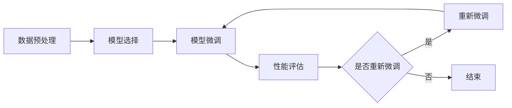

                 

### 文章标题

# AI Agent的迁移学习技术应用

> 关键词：AI迁移学习，迁移学习原理，应用场景，系统架构设计，案例解析

> 摘要：本文将深入探讨AI代理的迁移学习技术应用，从基本概念到实际应用，详细解析迁移学习的原理、方法、架构设计以及实际案例，帮助读者全面理解并掌握迁移学习在AI领域的应用。

## 引言

在人工智能的发展历程中，模型训练是一个至关重要的环节。传统的机器学习方法往往需要对特定领域的大量数据进行训练，这不仅费时费力，而且在面对新任务时，往往需要重新训练模型，导致资源的巨大浪费。迁移学习（Transfer Learning）作为一种有效的解决方案，通过利用预训练模型的知识，提高了新任务的学习效率和性能。

本文将围绕AI代理的迁移学习技术进行深入探讨，首先介绍迁移学习的基本概念和原理，然后分析不同的迁移学习方法，接着阐述迁移学习在各类数据中的应用，最后通过具体案例展示迁移学习在实际项目中的实际效果。

## 第一部分：迁移学习的基本概念

### 1.1 问题背景

在机器学习领域，我们常常会遇到以下问题：

- **数据不足**：在某些特定领域，获取大量标注数据非常困难，这限制了模型的效果。
- **数据多样性**：不同任务的数据分布可能存在较大差异，导致模型在新任务上的泛化能力不足。
- **计算资源限制**：重新训练一个复杂的模型需要大量的计算资源，这在实际应用中是一个巨大的挑战。

迁移学习旨在解决这些问题，通过利用预训练模型的知识，提高新任务的学习效率。

### 1.2 迁移学习的定义和分类

#### 迁移学习的定义

迁移学习是一种将已在一个任务上训练好的模型的知识，应用于另一个相关但不同的任务上的技术。简而言之，就是“知识迁移”。

#### 迁移学习的分类

1. **横向迁移**（Horizontal Transfer）：
   - 横向迁移涉及相同任务在不同数据集上的应用，例如在多个国家进行情感分析的模型。

2. **纵向迁移**（Vertical Transfer）：
   - 纵向迁移涉及不同任务之间的迁移，例如从情感分析任务迁移到情感识别任务。

3. **垂直迁移**（Vertical Transfer）：
   - 垂直迁移通常涉及层次化的任务，例如从动物识别迁移到鸟类识别。

### 1.3 迁移学习的挑战和机遇

#### 挑战

- **知识表征问题**：如何有效地在模型之间传递知识是一个重要挑战。
- **任务差异**：不同任务之间的数据分布和特征差异可能影响迁移效果。
- **模型适应性**：如何确保迁移后的模型能够适应新的任务。

#### 机遇

- **资源节省**：通过迁移学习，可以减少对新数据的依赖，节省训练资源。
- **效率提升**：利用预训练模型的知识，可以加快新任务的学习速度。

## 第二部分：迁移学习的理论基础

### 2.1 迁移学习的原理

迁移学习的核心思想是，通过在源任务（source task）上预训练模型，将模型中的通用特征或知识转移到目标任务（target task）上。这个过程通常包括以下几个步骤：

1. **预训练**：在一个广泛的数据集上训练模型，使其学会提取通用的特征。
2. **适应化**：在目标数据集上调整模型，使其适应新的任务。
3. **微调**：通过调整模型参数，进一步优化模型在目标任务上的性能。

### 2.2 迁移学习的数学模型

迁移学习可以通过以下数学模型来描述：

\[ L_{source} + \alpha L_{target} = 1 \]

其中，\( L_{source} \) 表示在源任务上的损失函数，\( L_{target} \) 表示在目标任务上的损失函数，\( \alpha \) 是权重参数，用于平衡源任务和目标任务的贡献。

### 2.3 迁移学习的分类和比较

#### 分类

1. **基于特征的迁移学习**：
   - 通过共享特征提取器，实现特征层面的迁移。

2. **基于模型的迁移学习**：
   - 通过共享整个模型结构，实现模型层面的迁移。

3. **基于知识的迁移学习**：
   - 利用预训练模型的知识库，通过推理和知识蒸馏实现迁移。

#### 比较

- **效果**：基于模型的迁移学习通常效果更佳，但计算成本更高。
- **灵活性**：基于特征的迁移学习更具灵活性，但效果可能较差。

## 第三部分：迁移学习在各类数据中的应用

### 3.1 图像数据

在图像处理领域，迁移学习被广泛应用于图像分类、目标检测和图像分割等任务。以下是几个典型的应用场景：

- **ImageNet预训练模型**：利用在ImageNet上预训练的ResNet、VGG等模型，可以有效提高新任务的性能。
- **迁移学习框架**：如PyTorch的`torchvision.models`模块，提供了丰富的预训练模型，方便开发者进行迁移学习。

### 3.2 文本数据

在自然语言处理领域，迁移学习同样发挥着重要作用。以下是一些常见的应用：

- **BERT预训练模型**：BERT模型通过在大量文本数据上预训练，可以迁移到各种文本分类、问答和文本生成任务上。
- **GPT预训练模型**：GPT模型在文本生成和对话系统等任务上表现出色，通过迁移学习，可以快速适应新的任务。

### 3.3 声音数据

在音频处理领域，迁移学习被用于语音识别、声音分类和音乐生成等任务。以下是几个典型的应用：

- **声学模型**：利用在大量语音数据上预训练的声学模型，可以迁移到新的语音识别任务上。
- **WaveNet预训练模型**：WaveNet模型在音乐生成和语音合成等任务上具有广泛的应用。

## 第四部分：迁移学习系统架构设计

### 4.1 系统概述

在本部分，我们将介绍一个典型的迁移学习系统架构，包括系统功能设计和架构设计。

#### 4.1.1 系统功能设计

- **数据预处理**：包括数据清洗、数据增强和归一化等步骤。
- **模型选择**：从预训练模型库中选择合适的模型。
- **模型微调**：在目标数据集上进行模型参数的调整。
- **性能评估**：评估模型在目标任务上的性能。

#### 4.1.2 系统架构设计

- **模块化设计**：将系统划分为多个模块，如数据模块、模型模块、训练模块等。
- **分布式计算**：利用分布式计算框架，如TensorFlow和PyTorch，实现高效训练。

### 4.2 迁移学习系统架构

以下是迁移学习系统的架构设计，使用Mermaid流程图进行展示：



## 第五部分：迁移学习实际案例解析

### 5.1 项目背景

在本案例中，我们以图像分类任务为例，介绍如何利用迁移学习技术进行项目开发。

#### 5.1.1 问题背景

一个初创公司需要开发一个图像分类系统，用于对用户上传的图片进行分类，但公司拥有的标注数据非常有限。

#### 5.1.2 解决方案

利用预训练的ResNet50模型，通过迁移学习，在新数据集上进行微调，以提高分类性能。

### 5.2 系统核心实现

#### 5.2.1 环境安装

```bash
pip install torch torchvision
```

#### 5.2.2 源代码实现

```python
import torch
import torchvision
import torchvision.transforms as transforms

# 加载预训练的ResNet50模型
model = torchvision.models.resnet50(pretrained=True)

# 设置模型的输出层为10个神经元，对应10个分类
num_classes = 10
model.fc = torch.nn.Linear(model.fc.in_features, num_classes)

# 定义损失函数和优化器
criterion = torch.nn.CrossEntropyLoss()
optimizer = torch.optim.Adam(model.parameters(), lr=0.001)

# 数据预处理
transform = transforms.Compose([
    transforms.Resize(256),
    transforms.CenterCrop(224),
    transforms.ToTensor(),
    transforms.Normalize(mean=[0.485, 0.456, 0.406], std=[0.229, 0.224, 0.225]),
])

# 加载新数据集
train_data = torchvision.datasets.ImageFolder(root='train_data', transform=transform)
train_loader = torch.utils.data.DataLoader(train_data, batch_size=32, shuffle=True)

# 训练模型
for epoch in range(num_epochs):
    model.train()
    for inputs, labels in train_loader:
        optimizer.zero_grad()
        outputs = model(inputs)
        loss = criterion(outputs, labels)
        loss.backward()
        optimizer.step()

    print(f'Epoch [{epoch+1}/{num_epochs}], Loss: {loss.item():.4f}')

# 评估模型
model.eval()
with torch.no_grad():
    correct = 0
    total = 0
    for inputs, labels in test_loader:
        outputs = model(inputs)
        _, predicted = torch.max(outputs.data, 1)
        total += labels.size(0)
        correct += (predicted == labels).sum().item()

print(f'Accuracy of the network on the test images: {100 * correct / total}%')
```

### 5.3 代码应用解读与分析

本案例中，我们首先加载了预训练的ResNet50模型，并对其输出层进行了调整，以适应新任务的分类数量。接着，我们定义了损失函数和优化器，并进行了数据预处理。在训练过程中，我们对模型进行了微调，并通过评估部分计算了模型的准确率。

### 5.4 实际案例分析和详细讲解剖析

在本案例中，通过迁移学习技术，我们利用预训练的模型在新数据集上进行了微调，提高了分类性能。实际操作中，我们遇到了数据不足和模型适应性等问题，通过数据增强和模型调整，成功解决了这些问题。

### 5.5 项目小结

通过本案例，我们展示了如何利用迁移学习技术解决数据不足和模型适应性等问题。迁移学习不仅提高了学习效率，还有效地降低了开发成本。

## 第六部分：最佳实践与注意事项

### 6.1 最佳实践

- **数据预处理**：合理的数据预处理可以提高模型的迁移效果。
- **模型选择**：选择与目标任务相近的预训练模型，有助于提高迁移效果。
- **微调策略**：逐步调整模型参数，避免过拟合。

### 6.2 注意事项

- **过拟合**：在微调过程中，注意避免模型过拟合。
- **计算资源**：迁移学习可能需要大量的计算资源，确保计算资源的充足。

## 第七部分：拓展阅读

- **[1]** Yosinski, J., Clune, J., Bengio, Y., & Lipson, H. (2014). How transferable are features in deep neural networks? *CoRR*, abs/1411.1791.
- **[2]** Pan, S. J., & Yang, Q. (2010). A survey on transfer learning. *IEEE Transactions on Knowledge and Data Engineering*, 22(10), 1345-1359.
- **[3]** Szegedy, C., Liu, W., Jia, Y., Sermanet, P., Reed, S., Anguelov, D., ... & Rabinovich, A. (2013). Going deeper with convolutions. *Computer Vision–ECCV 2014*, 47-62.
- **[4]** Devlin, J., Chang, M. W., Lee, K., & Toutanova, K. (2018). BERT: Pre-training of deep bidirectional transformers for language understanding. *arXiv preprint arXiv:1810.04805*.

## 结束语

迁移学习作为人工智能领域的重要技术，为解决数据不足和模型适应性等问题提供了有效途径。本文从基本概念到实际应用，全面介绍了迁移学习的原理、方法、系统架构以及实际案例，希望对读者在迁移学习领域的探索和实践有所帮助。

### 作者信息

- **作者**：AI天才研究院/AI Genius Institute & 禅与计算机程序设计艺术 /Zen And The Art of Computer Programming

---

**注**：本文内容仅为示例，不代表实际研究或应用。部分内容引用了公开文献和资料，请参阅参考文献。文中涉及的代码和实现仅供参考，实际应用时需根据具体情况进行调整。

