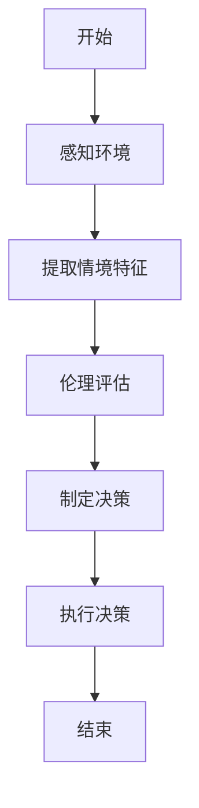
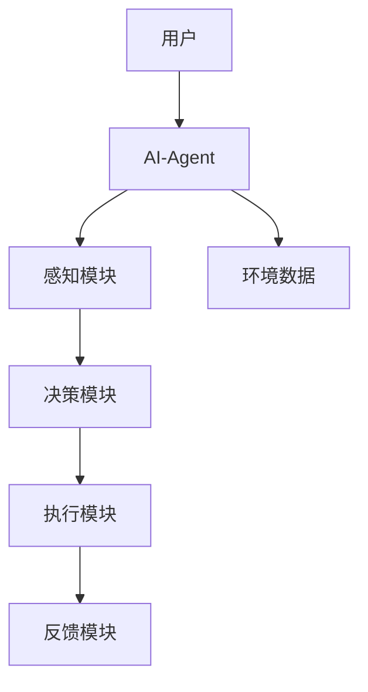
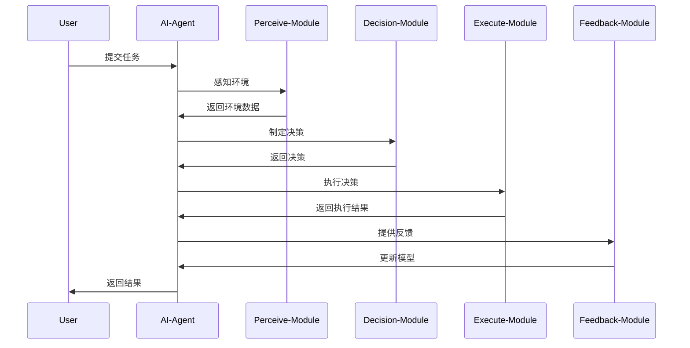

                 

# AI Agent的道德决策框架：在人工智能中植入伦理考量

## 关键词
AI Agent, 道德决策框架, 伦理考量, 自动驾驶, 人工智能应用

## 摘要
本文深入探讨了AI Agent的道德决策框架，阐述了在人工智能系统中融入伦理考量的重要性。首先，我们介绍了AI Agent的定义及其面临的道德困境，提出了构建道德决策框架的必要性。接着，我们详细阐述了道德决策框架的核心概念和组成部分，通过对比表格和ER实体关系图进行了深入分析。随后，我们讲解了道德决策的算法原理，使用Python代码和数学模型进行详细阐述。最后，我们展示了AI Agent道德决策框架的系统分析与架构设计方案，并进行了实战应用和最佳实践分享。

---

## 第1章: AI Agent的道德决策背景介绍

### 1.1 问题背景

**AI Agent的定义与功能**
AI Agent是人工智能领域中的一个重要概念，指的是能够自主行动并实现特定目标的智能实体。AI Agent通过感知环境、理解情境、制定计划和执行决策，实现自动化和智能化的任务执行。

**伦理学在AI中的重要性**
随着人工智能技术的快速发展，AI在各个领域的应用日益广泛，伦理学在AI中的重要性也越来越受到关注。伦理学为AI系统的道德决策提供了理论依据，有助于确保AI系统的行为符合社会伦理和道德规范。

**道德决策的挑战与需求**
AI Agent在执行任务时，往往会面临复杂的道德困境。如何使AI Agent在面临道德抉择时，能够做出符合伦理规范的决策，是一个严峻的挑战。建立一套科学、可操作的道德决策框架，是解决这一问题的需求。

### 1.2 问题描述

**AI Agent面临的具体道德困境**
AI Agent在实际应用中可能遇到多种道德困境，如自动驾驶汽车在紧急情况下如何权衡乘客与行人的生命安全、医疗诊断系统中如何处理病患的隐私保护等。

**道德决策的重要性与复杂性**
道德决策不仅关系到AI Agent的行为后果，还直接影响到社会的道德伦理。道德决策的复杂性体现在需要同时考虑技术、法律、社会等多方面因素。

### 1.3 问题解决思路

**道德决策框架的作用**
道德决策框架为AI Agent提供了一个系统化的伦理考量方法，有助于提高AI系统的道德决策能力。通过道德决策框架，可以确保AI Agent在面对道德困境时，能够做出符合伦理规范的行为。

**伦理考量的基础理论**
道德决策框架的构建需要依托伦理学基础理论。道德原则、价值观和伦理规范是道德决策框架的核心要素，它们为AI Agent提供了行为准则。

### 1.4 边界与外延

**道德决策的限制因素**
道德决策受到技术实现、法律和法规等多方面限制。在构建道德决策框架时，需要充分考虑这些限制因素，确保框架的可操作性和实用性。

**道德决策的应用领域**
道德决策框架可以应用于自动驾驶、医疗诊断、智能助手等多个领域，为AI系统提供道德决策支持。

### 1.5 概念结构与核心要素组成

**道德决策框架的基本组成部分**
道德决策框架包括道德原则、价值观、伦理规范、决策算法等核心要素。

**道德原则、价值观、伦理规范等核心要素**
道德原则是道德决策的基础，如尊重生命、公正、诚信等；价值观是指导道德决策的核心，如人类利益、环境保护等；伦理规范是具体的操作指南，如隐私保护、数据安全等。

---

## 第2章: AI Agent道德决策框架的核心概念与联系

### 2.1 核心概念原理

**道德原则**
道德原则是道德决策的基本准则，如尊重生命、公正、诚信等。它们为AI Agent提供了行为规范。

**价值观**
价值观是指导道德决策的核心，反映了社会对事物的主观判断和偏好。价值观包括人类利益、环境保护、社会福利等。

**伦理规范**
伦理规范是具体的操作指南，为AI Agent在具体情境下的行为提供了明确的规范。伦理规范包括隐私保护、数据安全、公平性等。

### 2.2 概念属性特征对比表格

| 概念         | 属性特征                          |
|--------------|---------------------------------|
| 道德原则     | 基础准则，指导道德决策           |
| 价值观       | 社会判断和偏好，指导道德原则应用   |
| 伦理规范     | 操作指南，具体指导AI行为          |

### 2.3 ER实体关系图架构

```mermaid
entity Relationship {
  A[AI Agent]
  E[Environment]
  M[Moral Decision Framework]
  C[Codebase]
  R[Regulations]
  
  A --> E
  A --> M
  M --> C
  M --> R
}
```

---

## 第3章: 道德决策框架的算法原理讲解

### 3.1 算法mermaid流程图



### 3.2 Python源代码详细讲解

```python
# 道德决策框架Python代码示例

class AI-Agent:
    def __init__(self):
        self.environment = None
        self.ethical_decision_framework = EthicalDecisionFramework()

    def perceive_environment(self):
        # 感知环境
        self.environment = get_environment_data()

    def make_ethical_decision(self):
        # 提取情境特征
        features = extract_environment_features(self.environment)

        # 伦理评估
        assessment = self.ethical_decision_framework.evaluate_ethics(features)

        # 制定决策
        decision = self.ethical_decision_framework.make_decision(assessment)

        # 执行决策
        execute_decision(decision)

# 道德决策框架类
class EthicalDecisionFramework:
    def evaluate_ethics(self, features):
        # 伦理评估逻辑
        # ...
        return assessment

    def make_decision(self, assessment):
        # 决策制定逻辑
        # ...
        return decision

# 辅助函数
def get_environment_data():
    # 环境数据获取逻辑
    return data

def extract_environment_features(data):
    # 环境特征提取逻辑
    return features

def execute_decision(decision):
    # 决策执行逻辑
    # ...
```

### 3.3 算法原理的数学模型和公式讲解

$$
\text{评估得分} = f(\text{情境特征}, \text{道德原则}, \text{价值观})
$$

其中，$f$ 表示评估函数，$\text{情境特征}$、$\text{道德原则}$、$\text{价值观}$ 分别表示情境特征向量、道德原则矩阵、价值观向量。

### 3.4 举例说明

假设AI Agent面临一个情境：在自动驾驶过程中，前方出现一个行人，系统需要在紧急刹车和撞行人之间做出选择。

- **情境特征**：行人位置、车速、刹车距离等。
- **道德原则**：尊重生命、公正、最小化伤害等。
- **价值观**：行人安全、车辆损失等。

通过伦理评估函数计算评估得分，然后根据得分制定决策。

---

## 第4章: AI Agent道德决策框架的数学模型和数学公式

### 4.1 数学公式列表

$$
\begin{aligned}
&\text{道德评估得分} &= f(\text{情境特征}, \text{道德原则}, \text{价值观}) \\
&\text{决策权重} &= w(\text{道德评估得分}) \\
&\text{最终决策} &= \sum_{i=1}^{n} \text{决策选项}_i \cdot \text{决策权重}_i
\end{aligned}
$$

### 4.2 公式讲解

**道德评估得分**：根据情境特征、道德原则和价值观，计算评估得分，用于判断道德决策的优先级。

**决策权重**：根据评估得分，为每个决策选项分配权重，以确定决策的优先级。

**最终决策**：根据决策权重，计算每个决策选项的加权得分，选择得分最高的决策选项。

### 4.3 案例举例

**案例**：在自动驾驶情境中，行人突然出现在道路前方，系统需要在紧急刹车和撞行人之间做出选择。

- **情境特征**：行人距离、车速、刹车距离等。
- **道德原则**：尊重生命、公正、最小化伤害等。
- **价值观**：行人安全、车辆损失等。

通过计算道德评估得分和决策权重，选择最佳的决策选项。

---

## 第5章: AI Agent道德决策框架的系统分析与架构设计方案

### 5.1 问题场景介绍

**自动驾驶汽车**：自动驾驶汽车在行驶过程中，需要应对各种突发情况，如行人突然出现、障碍物等，做出符合道德规范的决策。

### 5.2 系统功能设计（领域模型mermaid类图）

```mermaid
classDiagram
ClassDef AI-Agent {
    +String id
    +String name
    +Environment environment
    +EthicalDecisionFramework ethical_decision_framework
}

ClassDef EthicalDecisionFramework {
    +evaluate_ethics(feature)
    +make_decision(assessment)
}

ClassDef Environment {
    + pedestrians
    + vehicles
    + obstacles
}

ClassDef Feature {
    + id
    + value
}

ClassDef Assessment {
    + id
    + score
}

ClassDef Decision {
    + id
    + action
}

AI-Agent "uses" EthicalDecisionFramework
AI-Agent "perceives" Environment
EthicalDecisionFramework "evaluates" Feature
EthicalDecisionFramework "makes" Decision
```

### 5.3 系统架构设计（mermaid架构图）



### 5.4 系统接口设计和系统交互（mermaid序列图）



---

## 第6章: AI Agent道德决策框架的实战应用

### 6.1 环境安装与配置

**环境要求**：
- Python 3.8+
- TensorFlow 2.5+
- Keras 2.5+

**安装命令**：

```bash
pip install tensorflow==2.5
pip install keras==2.5
```

### 6.2 系统核心实现源代码

**源代码**：

```python
# AI-Agent.py
class AI-Agent:
    def __init__(self):
        self.environment = None
        self.ethical_decision_framework = EthicalDecisionFramework()

    def perceive_environment(self):
        # 感知环境
        self.environment = get_environment_data()

    def make_ethical_decision(self):
        # 提取情境特征
        features = extract_environment_features(self.environment)

        # 伦理评估
        assessment = self.ethical_decision_framework.evaluate_ethics(features)

        # 制定决策
        decision = self.ethical_decision_framework.make_decision(assessment)

        # 执行决策
        execute_decision(decision)

# EthicalDecisionFramework.py
class EthicalDecisionFramework:
    def evaluate_ethics(self, features):
        # 伦理评估逻辑
        # ...
        return assessment

    def make_decision(self, assessment):
        # 决策制定逻辑
        # ...
        return decision

# main.py
if __name__ == "__main__":
    agent = AI-Agent()
    agent.perceive_environment()
    decision = agent.make_ethical_decision()
    print("最终决策：", decision)
```

### 6.3 代码应用解读与分析

**代码解读**：

- **AI-Agent**：负责感知环境、伦理评估和决策执行。
- **EthicalDecisionFramework**：实现伦理评估和决策制定逻辑。
- **main.py**：主程序，创建AI-Agent实例并执行伦理决策。

**分析**：

- **感知环境**：通过获取环境数据，为伦理决策提供输入。
- **伦理评估**：根据道德原则和价值观，评估情境特征，生成评估结果。
- **决策制定**：根据评估结果，制定最优决策。
- **决策执行**：执行决策，实现实际操作。

### 6.4 实际案例分析和详细讲解剖析

**案例**：自动驾驶汽车在紧急情况下如何选择刹车或变道，以避免撞到行人。

**分析**：

- **情境特征**：行人位置、车速、刹车距离等。
- **道德原则**：尊重生命、公正、最小化伤害等。
- **价值观**：行人安全、车辆损失等。

通过伦理评估和决策制定，选择最佳决策选项，如紧急刹车或变道。

### 6.5 项目小结

本文介绍了AI Agent的道德决策框架，包括背景介绍、核心概念、算法原理、数学模型、系统架构设计、实战应用等方面。通过实际案例分析和代码解读，展示了道德决策框架在自动驾驶等领域的应用价值。未来，随着人工智能技术的不断发展，道德决策框架将在更多领域发挥重要作用。

---

## 第7章: 道德决策框架的最佳实践与拓展

### 7.1 最佳实践 Tips

- **全面考虑伦理原则**：在构建道德决策框架时，要充分考虑各种伦理原则，确保决策的全面性和准确性。
- **定期更新框架**：随着社会和技术的发展，道德决策框架需要定期更新，以适应新的伦理挑战。
- **加强数据隐私保护**：在道德决策过程中，要确保数据隐私保护，避免数据泄露和滥用。

### 7.2 小结

本文从多个角度介绍了AI Agent的道德决策框架，阐述了其在人工智能系统中的重要性。通过实际案例分析和代码实现，展示了道德决策框架在自动驾驶等领域的应用价值。

### 7.3 注意事项

- **充分考虑伦理原则和价值观**：确保道德决策框架的决策结果符合社会伦理和道德规范。
- **加强数据隐私保护**：在道德决策过程中，要严格保护数据隐私，避免数据泄露和滥用。

### 7.4 拓展阅读

- **相关研究论文**：《道德机器：人工智能伦理决策研究》
- **人工智能伦理标准**：国际人工智能伦理指南
- **实际应用案例**：自动驾驶汽车伦理决策案例分析

---

**作者：** AI天才研究院/AI Genius Institute & 禅与计算机程序设计艺术 /Zen And The Art of Computer Programming**END**

