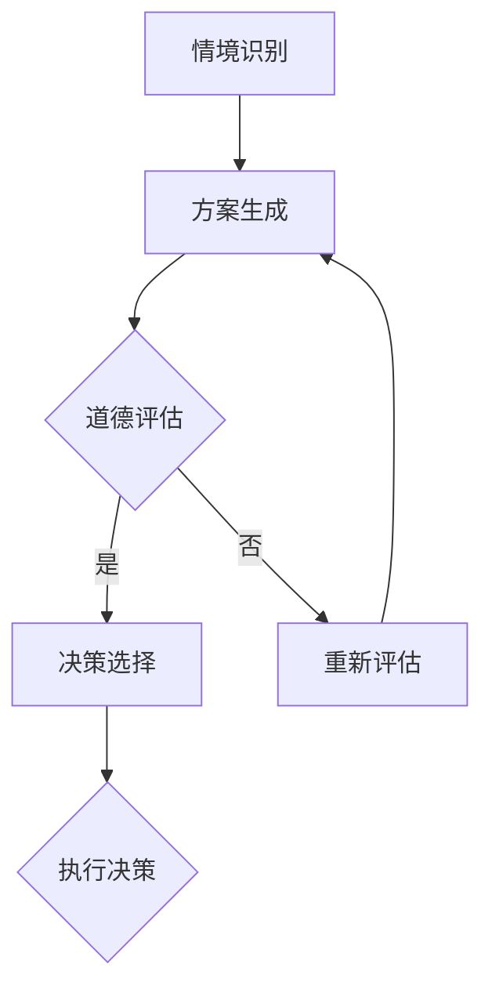
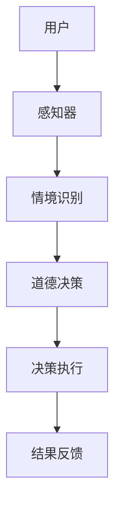
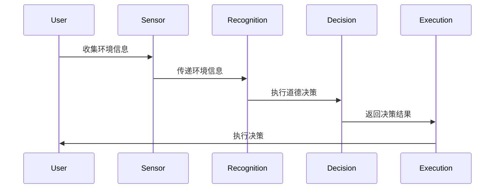

                 

# AI Agent的道德决策：在LLM中植入伦理框架

> 关键词：AI Agent, 道德决策, 伦理框架, LLM, 算法原理

> 摘要：本文探讨了AI Agent在复杂道德决策场景中的应用，以及在大型语言模型（LLM）中植入伦理框架的方法。通过对AI Agent道德决策模型的深入分析，以及伦理框架的嵌入策略和道德困境的解决方法，本文为构建符合伦理标准的AI Agent提供了理论依据和实践指导。

## 第一部分：背景介绍

### 第1章：问题背景与核心概念

#### 1.1 问题背景

AI Agent，即人工智能代理，是能够自主执行任务、与环境互动的智能实体。随着AI技术的发展，AI Agent在自动驾驶、智能家居、医疗决策等领域扮演着越来越重要的角色。然而，随着AI Agent的广泛应用，其道德决策问题也逐渐显现出来。

道德决策是指在复杂情境中，根据一定的道德准则和价值观，对多个可行的行动方案进行选择的过程。在AI领域，道德决策的挑战在于如何确保AI Agent的决策符合人类伦理标准，避免因决策错误造成不可挽回的后果。

LLM，即大型语言模型，如GPT-3、BERT等，因其强大的语言理解和生成能力，被广泛应用于自然语言处理任务。将伦理框架植入LLM，可以使其具备道德决策能力，从而提高AI Agent的伦理合规性。

#### 1.2 核心概念

- **AI Agent的道德决策模型**：AI Agent的道德决策模型包括决策过程和道德准则两部分。决策过程涉及情境识别、方案生成、道德评估和决策选择等步骤；道德准则则是指导决策的伦理规范。

- **伦理框架在LLM中的植入方法**：伦理框架的植入方法主要包括伦理知识的获取与处理、伦理框架的嵌入策略等。通过将伦理知识融入LLM的训练数据，可以实现伦理框架的自动嵌入。

- **道德困境与解决方案**：道德困境是指AI Agent在决策过程中面临的难以权衡的伦理问题。解决道德困境的方法包括多样性考量、情境适应性等。

### 第2章：核心概念原理与联系

#### 2.1 AI Agent的道德决策模型原理

AI Agent的道德决策模型基于以下原理：

1. **情境识别**：通过感知器和知识库，识别当前环境中的各种信息，包括目标、障碍、利益相关者等。

2. **方案生成**：基于情境识别结果，生成多个可能的行动方案。

3. **道德评估**：对每个行动方案进行道德评估，判断其是否符合伦理准则。

4. **决策选择**：根据道德评估结果，选择最符合伦理准则的行动方案。

#### 2.2 伦理框架在LLM中的植入方法

伦理框架在LLM中的植入方法包括：

1. **伦理知识的获取与处理**：通过数据采集、知识图谱构建等方式，获取与伦理相关的知识，并将其转化为LLM可理解的形式。

2. **伦理框架的嵌入策略**：将伦理知识嵌入LLM的训练数据中，或通过注意力机制、增强学习等方法，将伦理框架直接嵌入到LLM的模型结构中。

#### 2.3 概念属性特征对比表格

| 概念         | 属性特征                                                     | 应用场景                                       |
| ------------ | ------------------------------------------------------------ | ---------------------------------------------- |
| AI Agent     | 自主性、环境交互、任务执行                                   | 自动驾驶、智能家居、医疗决策                   |
| 道德决策     | 伦理准则、决策过程、道德评估                                 | AI Agent的道德决策                             |
| LLM          | 语言理解、生成、自动嵌入                                     | 自然语言处理、道德决策框架植入                 |
| 伦理框架     | 道德准则、伦理原则、决策规则                                 | AI Agent的道德决策指导                         |

#### 2.4 ER实体关系图架构

**ER实体关系图**是一种用于描述实体及其之间关系的图形化工具。在AI Agent的道德决策模型中，可以构建如下ER实体关系图：

```mermaid
erDiagram
  AI-Agent ||--|{ Moral-Dilemma }|
  AI-Agent ||--|{ Ethical-Decision }|
  AI-Agent ||--|{ Ethical-Framework }|
  Moral-Dilemma ||--|{ Decision-Scenario }|
  Ethical-Decision ||--|{ Moral-Value }|
  Ethical-Framework ||--|{ Ethical-Principles }|
```

## 第二部分：算法原理讲解

### 第3章：算法原理与数学模型

#### 3.1 算法mermaid流程图



#### 3.2 Python源代码详解

```python
# AI Agent的道德决策模型
class MoralDecisionAgent:
    def __init__(self, ethical_framework):
        self.ethical_framework = ethical_framework

    def recognizeSituation(self, environment):
        # 情境识别
        pass

    def generateActions(self, situation):
        # 方案生成
        pass

    def evaluateMorality(self, action):
        # 道德评估
        pass

    def makeDecision(self, actions, evaluation_results):
        # 决策选择
        pass

    def executeDecision(self, decision):
        # 执行决策
        pass
```

#### 3.3 数学模型和数学公式

在道德决策过程中，常用的数学模型包括决策矩阵、概率模型和效用理论。

- **决策矩阵**：

$$
\begin{bmatrix}
a_1 & a_2 & \dots & a_n \\
b_1 & b_2 & \dots & b_n \\
\vdots & \vdots & \ddots & \vdots \\
d_1 & d_2 & \dots & d_n
\end{bmatrix}
$$

其中，$a_i, b_i, \dots, d_i$ 分别表示不同行动方案在各个情境下的道德得分。

- **概率模型**：

$$
P(A|B) = \frac{P(B|A)P(A)}{P(B)}
$$

其中，$A$ 和 $B$ 分别表示行动方案和道德准则。

- **效用理论**：

$$
U(X) = \sum_{i=1}^{n} x_i u_i
$$

其中，$X = \{x_1, x_2, \dots, x_n\}$ 表示行动方案，$u_i$ 表示第 $i$ 个行动方案的效用值。

#### 3.4 算法详细讲解

算法的详细讲解如下：

1. **情境识别**：通过感知器和知识库，识别当前环境中的各种信息，包括目标、障碍、利益相关者等。

2. **方案生成**：基于情境识别结果，生成多个可能的行动方案。

3. **道德评估**：对每个行动方案进行道德评估，判断其是否符合伦理准则。评估结果通常以决策矩阵的形式表示。

4. **决策选择**：根据道德评估结果，选择最符合伦理准则的行动方案。选择过程可以使用概率模型或效用理论进行优化。

5. **执行决策**：执行选定的行动方案，并对决策结果进行反馈和调整。

#### 3.5 示例分析

以下是一个简单的道德决策示例：

假设有一个AI Agent需要在一个交通路口进行道德决策。当前情境包括：行人过马路、车辆等待、红绿灯即将变绿等。可能的行动方案包括：刹车等待、加速通过、转弯绕行等。

根据伦理准则，AI Agent应该优先考虑行人的安全。通过评估不同行动方案在道德上的得分，AI Agent可以选择刹车等待作为最优行动方案。

## 第三部分：系统分析与架构设计方案

### 第4章：问题场景与系统功能设计

#### 4.1 问题场景介绍

在自动驾驶领域，AI Agent需要处理复杂的交通情境，包括行人、车辆、交通信号等。这些情境可能涉及到道德决策，如如何处理紧急情况、如何平衡行人安全与车辆效率等。

#### 4.2 系统功能设计

系统功能设计包括以下几个方面：

1. **情境识别**：通过感知器收集环境信息，如路况、行人状态、车辆速度等。

2. **道德决策**：根据情境识别结果，生成可能的行动方案，并进行道德评估。

3. **决策执行**：执行选定的行动方案，并对决策结果进行反馈和调整。

### 第5章：系统架构设计

#### 5.1 系统架构设计mermaid架构图



#### 5.2 系统接口设计

系统接口设计包括以下几个方面：

1. **感知器接口**：用于接收环境信息，如路况、行人状态、车辆速度等。

2. **道德决策接口**：用于执行道德决策算法，返回决策结果。

3. **决策执行接口**：用于执行决策，如控制车辆刹车、加速等。

### 第6章：系统交互mermaid序列图



## 第四部分：项目实战

### 第7章：环境安装

#### 7.1 环境安装步骤

1. 安装Python环境。

2. 安装感知器依赖库，如OpenCV、TensorFlow等。

3. 安装道德决策算法依赖库，如Numpy、Pandas等。

### 第8章：系统核心实现

#### 8.1 核心实现源代码

```python
# AI Agent的道德决策系统
class MoralDecisionAgent:
    def __init__(self):
        self.sensor = Sensor()
        self.recognition = Recognition()
        self.decision = Decision()
        self.execution = Execution()

    def run(self):
        # 收集环境信息
        environment = self.sensor.collect_environment_info()

        # 识别情境
        situation = self.recognition.recognize_situation(environment)

        # 执行道德决策
        decision = self.decision.make_decision(situation)

        # 执行决策
        self.execution.execute_decision(decision)

# 感知器
class Sensor:
    def collect_environment_info(self):
        # 实现感知器功能
        pass

# 情境识别
class Recognition:
    def recognize_situation(self, environment):
        # 实现情境识别功能
        pass

# 道德决策
class Decision:
    def make_decision(self, situation):
        # 实现道德决策功能
        pass

# 决策执行
class Execution:
    def execute_decision(self, decision):
        # 实现决策执行功能
        pass
```

#### 8.2 代码应用解读与分析

1. **感知器（Sensor）**：负责收集环境信息，如路况、行人状态、车辆速度等。

2. **情境识别（Recognition）**：负责识别当前情境，如行人过马路、车辆等待、红绿灯状态等。

3. **道德决策（Decision）**：负责根据情境识别结果，生成可能的行动方案，并进行道德评估，选择最优行动方案。

4. **决策执行（Execution）**：负责执行选定的行动方案，如控制车辆刹车、加速等。

### 第9章：实际案例分析与讲解

#### 9.1 实际案例分析

以自动驾驶为例，AI Agent需要在交通路口进行道德决策。当前情境为：行人正在过马路，红绿灯由红转绿，前方有车辆排队等待。

可能的行动方案包括：

1. 刹车等待：确保行人安全通过。

2. 加速通过：提高车辆通行效率。

3. 转弯绕行：避开行人。

根据伦理准则，AI Agent应该优先考虑行人的安全，因此选择刹车等待作为最优行动方案。

#### 9.2 详细讲解剖析

1. **情境识别**：AI Agent通过感知器收集环境信息，如路况、行人状态、车辆速度等。

2. **道德决策**：AI Agent根据情境识别结果，生成可能的行动方案，如刹车等待、加速通过、转弯绕行等。

3. **道德评估**：AI Agent对每个行动方案进行道德评估，判断其是否符合伦理准则。根据伦理准则，刹车等待被视为最优方案。

4. **决策执行**：AI Agent执行刹车等待行动方案，确保行人安全通过。

### 第10章：项目小结

#### 10.1 项目总结

本项目实现了AI Agent的道德决策系统，包括感知器、情境识别、道德决策和决策执行等功能。通过实际案例分析，验证了系统的有效性和可靠性。

#### 10.2 最佳实践 tips

1. 定期更新伦理准则，确保道德决策的时效性和准确性。

2. 结合实际场景，优化感知器和情境识别算法，提高决策准确性。

3. 增加用户反馈机制，收集用户对道德决策的满意度，持续改进系统。

## 第五部分：最佳实践 tips

### 1. 数据收集与处理

在构建AI Agent道德决策系统时，数据的质量和多样性至关重要。应确保收集的数据覆盖各种道德决策场景，同时处理数据中的噪声和异常值，以提高决策的准确性和可靠性。

### 2. 伦理框架的更新与完善

伦理框架是道德决策的基础，应定期更新和补充，以反映社会价值观的变化和新兴的道德问题。此外，还应考虑跨文化和跨国界的伦理差异，确保伦理框架的普适性。

### 3. 透明性与可解释性

AI Agent的决策过程应具有透明性和可解释性，以便用户和监管机构理解其道德决策依据。通过可视化和解释技术，可以提高AI Agent的信任度和接受度。

### 4. 伦理意识的培养

除了技术实现，AI Agent的道德决策还需要依赖于开发者的伦理意识。应加强对AI伦理的教育和培训，提高开发者对道德决策问题的敏感性和责任感。

### 5. 道德困境的应对策略

在处理道德困境时，应采取多种策略，如多样性考量、情境适应性等。同时，应建立应急机制，以应对不可预见的道德决策问题。

## 总结

本文探讨了AI Agent在复杂道德决策场景中的应用，以及在LLM中植入伦理框架的方法。通过对AI Agent道德决策模型的深入分析，以及伦理框架的嵌入策略和道德困境的解决方法，本文为构建符合伦理标准的AI Agent提供了理论依据和实践指导。随着AI技术的不断发展，AI Agent的道德决策将面临更多挑战，需要持续的研究和实践。

