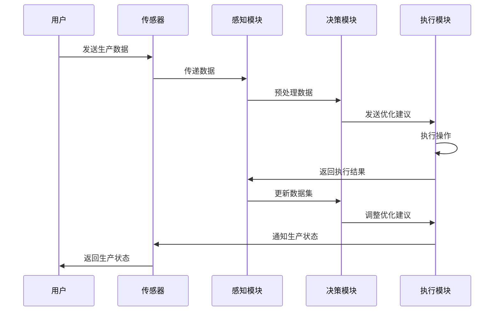
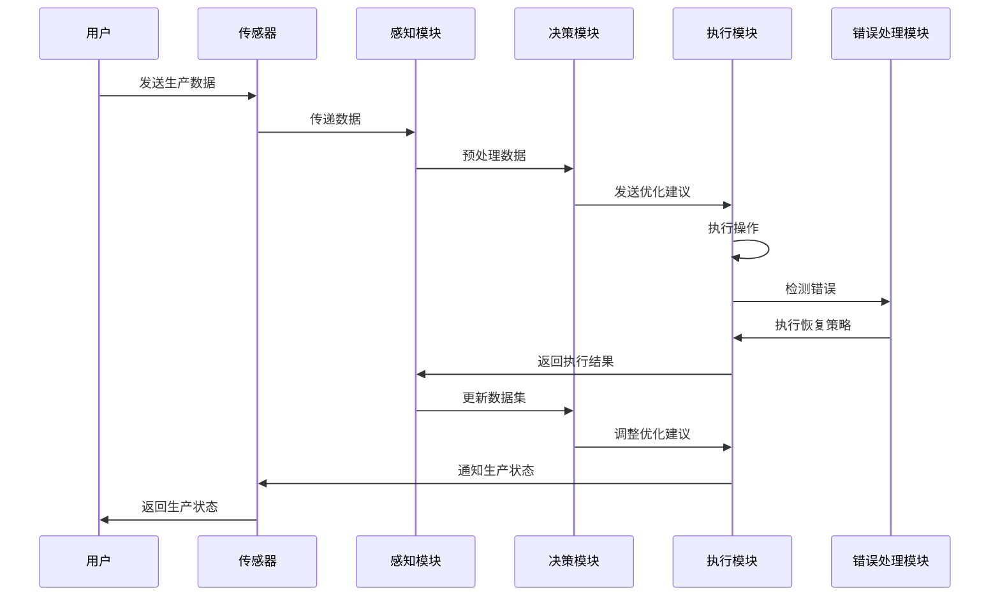

                 


# AI Agent的错误处理与恢复机制设计

关键词：AI Agent, 错误处理, 恢复机制, 算法原理, 系统设计

摘要：本文详细探讨了AI Agent的错误处理与恢复机制设计。通过分析AI Agent的基本概念、错误处理与恢复机制的核心概念，本文深入讲解了相关算法原理，并介绍了系统分析与架构设计的方法。通过一个实际项目案例，本文展示了如何在实际中应用错误处理与恢复机制，并提供了一些最佳实践与小结。

### 设计思路

在设计《AI Agent的错误处理与恢复机制设计》的目录大纲时，我们的目标是确保大纲结构清晰、逻辑严密，同时涵盖书中的主要内容。以下是我设计的思路和步骤：

1. **确定大纲层级结构**：首先确定大纲的层级，包括一级、二级和三级标题，以便清晰地组织内容。

2. **背景介绍**：在开篇部分，介绍AI Agent的基本概念、错误处理和恢复机制的背景，以及为什么这个问题在当前AI领域具有重要性。

3. **核心概念与联系**：详细阐述AI Agent、错误处理与恢复机制的核心概念，并使用对比表格和实体关系图来展示各概念之间的联系。

4. **算法原理讲解**：深入讲解AI Agent错误处理与恢复机制的算法原理，包括数学模型和公式，并通过mermaid流程图和Python源代码进行辅助说明。

5. **系统分析与架构设计**：介绍AI Agent错误处理与恢复机制的系统分析，包括功能设计、架构设计、接口设计和系统交互。

6. **项目实战**：通过一个实际项目案例，展示如何应用错误处理与恢复机制，包括环境安装、核心实现、代码解读、案例分析等。

7. **最佳实践与小结**：总结书中的关键点，提供实践技巧和小结，并对未来研究进行展望。

### 目录大纲

----------------------------------------------------------------

## 第一部分: 引言

### 1.1 AI Agent的背景与定义

- **AI Agent的定义**
- **AI Agent的发展历程**
- **AI Agent的应用领域**

### 1.2 错误处理与恢复机制的重要性

- **AI Agent面临的问题**
- **错误处理与恢复机制的意义**
- **当前研究现状与挑战**

### 1.3 本书结构

- **主要章节介绍**
- **预期读者收益**

## 第二部分: 核心概念与联系

### 2.1 AI Agent的核心概念与属性特征对比

- **AI Agent的组成要素**
- **感知模块**
- **决策模块**
- **执行模块**

### 2.2 错误处理机制的核心概念

- **错误检测**
- **错误分类**
- **错误隔离**

### 2.3 恢复机制的核心概念

- **恢复策略**
- **恢复目标**
- **恢复效果评估**

### 2.4 AI Agent、错误处理与恢复机制的属性特征对比

- **对比表格**
- **特征分析**

## 第三部分: 算法原理讲解

### 3.1 错误检测算法

- **算法概述**
- **mermaid流程图展示**
- **Python源代码实现**

### 3.2 错误分类算法

- **算法概述**
- **mermaid流程图展示**
- **Python源代码实现**

### 3.3 错误隔离算法

- **算法概述**
- **mermaid流程图展示**
- **Python源代码实现**

### 3.4 恢复策略设计

- **恢复策略选择**
- **mermaid流程图展示**
- **Python源代码实现**

### 3.5 恢复效果评估方法

- **评估指标**
- **mermaid流程图展示**
- **Python源代码实现**

## 第四部分: 系统分析与架构设计

### 4.1 问题场景介绍

- **典型应用场景**
- **问题挑战**

### 4.2 系统功能设计

- **系统需求分析**
- **mermaid类图展示**

### 4.3 系统架构设计

- **整体架构设计**
- **mermaid架构图展示**

### 4.4 系统接口设计

- **接口定义**
- **接口调用流程**

### 4.5 系统交互设计

- **系统交互流程**
- **mermaid序列图**

## 第五部分: 项目实战

### 5.1 环境安装

- **安装步骤**
- **环境配置**

### 5.2 核心实现

- **源代码解读**
- **代码分析**

### 5.3 案例分析

- **实际案例展示**
- **详细剖析**

### 5.4 项目小结

- **经验总结**
- **改进建议**

## 第六部分: 最佳实践与小结

### 6.1 最佳实践

- **常见问题处理**
- **优化建议**

### 6.2 小结

- **主要内容回顾**
- **文章总结**

### 6.3 注意事项

- **使用注意事项**
- **潜在风险**

### 6.4 拓展阅读

- **相关研究**
- **推荐资源**

----------------------------------------------------------------

通过以上设计思路和目录大纲，我们确保文章内容全面、逻辑清晰，为读者提供了深入理解AI Agent错误处理与恢复机制设计的方法和思路。接下来，我们将逐步深入探讨每个部分的具体内容。首先，我们从AI Agent的背景与定义开始，为后续内容奠定基础。 

## 第一部分: 引言

### 1.1 AI Agent的背景与定义

在人工智能（AI）领域，AI Agent 是一种能够自主执行任务、与环境进行交互并能够不断学习和适应的智能体。AI Agent 是一个抽象的概念，代表了各种形式的智能系统，从简单的自动化脚本到复杂的决策支持系统。

**AI Agent的定义**

AI Agent 的定义可以从以下几个方面进行阐述：

1. **自主性**：AI Agent 能够独立地执行任务，不需要人类的直接干预。这意味着它们能够在感知环境后，根据预定的策略或通过学习自主地做出决策。

2. **适应性**：AI Agent 能够通过不断的学习和适应来改进其性能。这通常涉及到机器学习算法，使得 AI Agent 能够从经验中学习并优化其行为。

3. **交互性**：AI Agent 能够与环境进行交互，收集信息，并基于这些信息来调整自己的行为。

4. **目标导向性**：AI Agent 有明确的目标或任务，它们的行为是为了达成这些目标。

**AI Agent的发展历程**

AI Agent的发展可以追溯到20世纪50年代，当时人工智能作为一个研究领域首次被提出。早期的AI Agent主要是基于规则的系统，它们通过预定义的规则来决策和行动。随着计算机技术的发展和算法的创新，AI Agent逐渐从基于规则的系统演变为基于机器学习、深度学习和强化学习等技术的复杂系统。

- **1956年**：达特茅斯会议上，“人工智能”一词首次被提出，标志着人工智能作为一个独立研究领域的诞生。

- **1960年代**：基于规则的系统开始流行，专家系统成为AI研究的一个热点。

- **1970年代**：随着计算机性能的提高，AI Agent开始尝试更复杂的任务，包括自然语言处理和机器视觉。

- **1980年代**：机器学习开始兴起，AI Agent开始利用统计学习和模式识别技术。

- **1990年代至21世纪**：随着互联网的普及，AI Agent开始大规模应用于搜索引擎、推荐系统等领域。

- **21世纪**：深度学习和强化学习的发展使得AI Agent能够处理更复杂的任务，如自动驾驶、游戏AI等。

**AI Agent的应用领域**

AI Agent在多个领域得到了广泛应用：

- **智能助手**：如Siri、Alexa等，它们能够通过语音交互帮助用户完成日常任务。

- **推荐系统**：如Netflix、Amazon等，它们利用AI Agent来个性化推荐内容或产品。

- **自动驾驶**：AI Agent在自动驾驶系统中负责感知环境、做出决策和执行动作。

- **机器人**：工业机器人、服务机器人等，它们在特定环境下执行预定的任务。

- **游戏AI**：如《星际争霸》等游戏的AI对手，它们能够与人类玩家进行对抗。

**错误处理与恢复机制的重要性**

AI Agent在实际应用中不可避免地会遇到各种错误。这些错误可能来自于感知模块的误判、决策模块的缺陷或执行模块的故障。如果没有有效的错误处理与恢复机制，AI Agent可能会失去自主性、适应性，甚至导致整个系统的崩溃。

- **错误处理机制**：错误处理机制旨在检测、分类和隔离错误，以最小化错误对系统的影响。

- **恢复机制**：恢复机制则旨在通过一定的策略和算法，使系统从错误状态恢复到正常状态。

- **重要性**：错误处理与恢复机制对于确保AI Agent的稳定运行和可靠性能至关重要。

- **挑战**：在实现这些机制时，需要考虑多个因素，如实时性、效率和鲁棒性。

**当前研究现状与挑战**

目前，错误处理与恢复机制在AI Agent的研究和应用中已经取得了一定的进展。然而，仍然存在一些挑战：

- **复杂性**：AI Agent通常包含多个模块，错误处理与恢复机制的实现需要考虑各模块之间的交互和协作。

- **不确定性**：AI Agent面临的环境和任务通常是动态和不确定的，这增加了错误处理与恢复的难度。

- **效率**：在实时应用中，错误处理与恢复机制需要快速响应，这要求算法和实现具有较高的效率。

- **鲁棒性**：AI Agent需要在各种复杂和恶劣环境下保持稳定运行，这要求错误处理与恢复机制具有高度的鲁棒性。

**本书结构**

本书将分以下几个部分来详细探讨AI Agent的错误处理与恢复机制设计：

1. **第一部分：引言**：介绍AI Agent的基本概念、错误处理与恢复机制的背景和重要性。

2. **第二部分：核心概念与联系**：详细阐述AI Agent、错误处理与恢复机制的核心概念，并展示各概念之间的联系。

3. **第三部分：算法原理讲解**：深入讲解AI Agent错误处理与恢复机制的算法原理，包括错误检测、错误分类、错误隔离、恢复策略设计以及恢复效果评估方法。

4. **第四部分：系统分析与架构设计**：介绍AI Agent错误处理与恢复机制的系统分析，包括功能设计、架构设计、接口设计和系统交互。

5. **第五部分：项目实战**：通过一个实际项目案例，展示如何应用错误处理与恢复机制。

6. **第六部分：最佳实践与小结**：总结关键点，提供实践技巧和小结，并对未来研究进行展望。

**预期读者收益**

通过阅读本书，读者可以：

- **深入理解AI Agent及其错误处理与恢复机制**：了解AI Agent的基本概念、应用领域以及错误处理与恢复机制的重要性。

- **掌握相关算法原理**：掌握错误检测、错误分类、错误隔离、恢复策略设计和恢复效果评估方法等核心算法原理。

- **学习系统分析与架构设计**：学习如何进行系统功能设计、架构设计、接口设计和系统交互。

- **获取实际应用经验**：通过实际项目案例，了解如何在实际中应用错误处理与恢复机制。

- **获得最佳实践**：学习一些最佳实践技巧，提高AI Agent的稳定性和可靠性。

- **启发未来研究**：了解当前研究现状和挑战，为未来研究提供思路。

通过以上设计思路和目录大纲，我们确保文章内容全面、逻辑清晰，为读者提供了深入理解AI Agent错误处理与恢复机制设计的方法和思路。接下来，我们将逐步深入探讨每个部分的具体内容。首先，我们从AI Agent的核心概念与属性特征对比开始，为后续内容奠定基础。

## 第二部分: 核心概念与联系

### 2.1 AI Agent的核心概念与属性特征对比

为了深入理解AI Agent，我们需要从其核心概念出发，分析各个组成部分及其属性特征。AI Agent通常由感知模块、决策模块和执行模块组成，它们各自承担着不同的功能，共同协作以实现自主行动。

**AI Agent的组成要素**

1. **感知模块**：感知模块负责接收外部环境的信息，如视觉、听觉、触觉等。它是AI Agent与外部环境交互的桥梁，提供了决策模块所需的输入数据。

2. **决策模块**：决策模块负责根据感知模块收集的信息，利用算法和策略进行推理和决策，生成相应的行动指令。

3. **执行模块**：执行模块负责执行决策模块生成的行动指令，将AI Agent的决策转化为实际的操作，如移动、抓取等。

**感知模块**

- **功能**：感知模块的主要功能是感知环境，获取必要的信息，如图像、声音、传感器数据等。
- **属性特征**：
  - **感知范围**：感知模块的感知范围决定了它能感知到的信息类型和距离。
  - **精度**：感知模块的精度决定了它所获取信息的准确程度。
  - **实时性**：感知模块的实时性决定了它对环境的反应速度。

**决策模块**

- **功能**：决策模块的主要功能是根据感知模块提供的信息，利用算法和策略进行推理，生成行动指令。
- **属性特征**：
  - **决策算法**：决策模块采用的算法决定了其决策能力。
  - **策略选择**：决策模块需要根据任务需求和环境特点选择合适的策略。
  - **推理速度**：决策模块的推理速度决定了其响应时间的长短。

**执行模块**

- **功能**：执行模块的主要功能是根据决策模块生成的行动指令，执行具体的操作。
- **属性特征**：
  - **执行效率**：执行模块的执行效率决定了其完成任务的速度。
  - **可扩展性**：执行模块的可扩展性决定了它能否适应不同的任务需求。
  - **鲁棒性**：执行模块的鲁棒性决定了其在复杂或恶劣环境下的可靠性。

**错误处理机制的核心概念**

1. **错误检测**：错误检测是指通过一定的算法和技术，识别出系统中的错误或异常情况。

2. **错误分类**：错误分类是指对检测到的错误进行分类，以便更准确地分析和处理。

3. **错误隔离**：错误隔离是指将错误定位到特定的模块或部分，以减少错误对整个系统的影响。

**恢复机制的核心概念**

1. **恢复策略**：恢复策略是指为了使系统从错误状态恢复到正常状态所采取的一系列措施。

2. **恢复目标**：恢复目标是指恢复机制希望达到的状态，如系统完全恢复正常、部分恢复正常等。

3. **恢复效果评估**：恢复效果评估是指对恢复策略的实际效果进行评估，以确定恢复是否成功。

**AI Agent、错误处理与恢复机制的属性特征对比**

以下是AI Agent、错误处理机制和恢复机制的关键属性特征对比表格：

| 属性特征 | AI Agent | 错误处理机制 | 恢复机制 |
| :--- | :--- | :--- | :--- |
| 感知范围 | 决定了AI Agent能感知到什么信息 | 无需考虑感知范围，专注于错误检测 | 无需考虑感知范围，专注于恢复策略 |
| 精度 | 影响决策的准确性 | 影响错误检测的准确性 | 无需考虑精度，专注于恢复策略 |
| 实时性 | 影响系统的响应速度 | 影响错误检测的实时性 | 影响恢复策略的实时性 |
| 决策算法 | 决定了AI Agent的决策能力 | 决定了错误分类的准确性 | 决定了恢复策略的有效性 |
| 策略选择 | 决定了AI Agent的行为 | 决定了错误检测和分类的方法 | 决定了恢复的目标和措施 |
| 执行效率 | 影响任务完成的效率 | 无需考虑执行效率，专注于错误隔离 | 影响恢复的效率 |
| 可扩展性 | 影响系统的适应性 | 无需考虑可扩展性，专注于算法优化 | 无需考虑可扩展性，专注于策略选择 |
| 鲁棒性 | 决定了系统的可靠性 | 无需考虑鲁棒性，专注于算法鲁棒性 | 决定了恢复的稳定性 |

通过上述对比，我们可以更清晰地理解AI Agent、错误处理机制和恢复机制之间的差异和联系。在接下来的章节中，我们将进一步探讨这些核心概念，并详细讲解相关的算法原理和系统设计方法。

### 2.2 错误处理机制的核心概念

在AI Agent的运行过程中，错误处理机制起着至关重要的作用。错误处理机制包括错误检测、错误分类和错误隔离三个核心概念，它们共同确保AI Agent能够及时发现和处理错误，从而保证系统的稳定性和可靠性。

**错误检测**

错误检测是指通过一定的算法和技术，识别出系统中的错误或异常情况。在AI Agent中，错误检测通常基于以下几种方法：

1. **阈值检测**：通过对感知数据进行统计分析，设定一个阈值，当数据超出阈值时，认为发生了错误。

   $$ \text{if} \ (x > \text{threshold}) \ \text{then} \ \text{error detected} $$

2. **模式识别**：利用机器学习算法，对正常行为模式进行建模，当实际行为与模型不符时，认为发生了错误。

   $$ \text{if} \ (\text{actual\_behavior} \neq \text{model\_behavior}) \ \text{then} \ \text{error detected} $$

3. **逻辑推理**：基于规则或逻辑推理，通过分析系统状态和输入信息，判断是否发生了错误。

   $$ \text{if} \ (\text{condition}_1 \ \text{and} \ \text{condition}_2) \ \text{then} \ \text{error detected} $$

**错误分类**

错误分类是指对检测到的错误进行分类，以便更准确地分析和处理。错误分类有助于确定错误的性质和影响范围，从而选择合适的处理方法。常见的错误分类方法包括：

1. **类别分类**：将错误分为不同的类别，如硬件错误、软件错误、输入错误等。

2. **层次分类**：根据错误的复杂性和影响程度，将错误分为不同层次，如低级错误、中级错误和高级错误。

3. **特征分类**：根据错误的特征，如错误类型、错误位置、错误产生的原因等，对错误进行分类。

**错误隔离**

错误隔离是指将错误定位到特定的模块或部分，以减少错误对整个系统的影响。有效的错误隔离可以帮助系统更快地恢复，并减少错误的传播。错误隔离通常涉及以下步骤：

1. **确定错误范围**：通过错误检测和分类，确定错误可能发生的范围。

2. **逐步缩小范围**：通过逐步排除法，逐步缩小错误的范围，直到定位到具体的模块或部分。

3. **验证隔离效果**：通过模拟或实际测试，验证错误隔离的效果，确保错误不会在隔离范围内再次发生。

通过错误检测、错误分类和错误隔离，AI Agent能够有效地识别和处理错误，从而保证系统的稳定性和可靠性。接下来，我们将深入探讨恢复机制的核心概念，包括恢复策略、恢复目标和恢复效果评估方法。

### 2.3 恢复机制的核心概念

恢复机制是AI Agent在遇到错误时采取的一系列措施，旨在将系统从错误状态恢复到正常状态。一个有效的恢复机制不仅能减少错误对系统的影响，还能提高系统的鲁棒性和可靠性。恢复机制包括恢复策略、恢复目标和恢复效果评估三个核心概念。

**恢复策略**

恢复策略是指为了使系统从错误状态恢复到正常状态所采取的一系列措施。恢复策略的设计取决于错误的性质、系统的需求以及可用的资源。常见的恢复策略包括：

1. **重试**：在错误发生时，重新执行任务或操作，以期望错误能够得到解决。

   $$ \text{if} \ \text{error detected} \ \text{then} \ \text{retry operation} $$

2. **替换**：用正常的模块或组件替换出现错误的模块或组件，以恢复系统的正常功能。

   $$ \text{if} \ \text{module fails} \ \text{then} \ \text{replace module with backup} $$

3. **恢复**：根据系统配置和日志，重新初始化或恢复系统到之前的状态。

   $$ \text{if} \ \text{system fails} \ \text{then} \ \text{reboot system to previous state} $$

4. **调整参数**：通过调整系统的参数或配置，以优化系统的性能和稳定性。

   $$ \text{if} \ \text{performance drops} \ \text{then} \ \text{tune system parameters} $$

**恢复目标**

恢复目标是指恢复机制希望达到的状态。根据错误的影响程度和系统的需求，恢复目标可以分为以下几种：

1. **完全恢复**：将系统恢复到完全正常的状态，所有功能均恢复正常。

2. **部分恢复**：虽然系统未能完全恢复，但关键功能已经恢复正常，非关键功能仍在修复中。

3. **临时恢复**：通过临时措施使系统恢复到可以继续运行的状态，但错误尚未完全解决。

4. **终止并重试**：在错误无法恢复或继续运行存在风险时，终止当前操作并尝试重新执行。

**恢复效果评估方法**

恢复效果评估是指对恢复策略的实际效果进行评估，以确定恢复是否成功。常用的评估指标包括：

1. **恢复时间**：从错误发生到系统恢复正常所需的时间。

2. **恢复成功率**：恢复策略成功将系统恢复到正常状态的次数与尝试次数之比。

3. **系统稳定性**：恢复后系统在一段时间内保持正常运行的稳定性。

4. **用户体验**：恢复策略对用户产生的影响，如系统响应时间、功能完整性等。

通过上述评估指标，可以全面了解恢复策略的有效性和系统的稳定性。接下来，我们将详细讲解如何设计恢复策略，并介绍相关的算法原理。

### 2.4 AI Agent、错误处理与恢复机制的属性特征对比

为了更好地理解AI Agent、错误处理机制和恢复机制之间的联系和区别，我们通过一个属性特征对比表格来展示它们的关键属性特征。以下表格列出了AI Agent、错误处理机制和恢复机制的主要属性特征，并进行详细分析：

| 属性特征 | AI Agent | 错误处理机制 | 恢复机制 |
| :--- | :--- | :--- | :--- |
| 感知范围 | 决定了AI Agent能感知到什么信息 | 无需考虑感知范围，专注于错误检测 | 无需考虑感知范围，专注于恢复策略 |
| 精度 | 影响决策的准确性 | 影响错误检测的准确性 | 无需考虑精度，专注于恢复策略 |
| 实时性 | 影响系统的响应速度 | 影响错误检测的实时性 | 影响恢复策略的实时性 |
| 决策算法 | 决定了AI Agent的决策能力 | 决定了错误分类的准确性 | 决定了恢复策略的有效性 |
| 策略选择 | 决定了AI Agent的行为 | 决定了错误检测和分类的方法 | 决定了恢复的目标和措施 |
| 执行效率 | 影响任务完成的效率 | 无需考虑执行效率，专注于错误隔离 | 影响恢复的效率 |
| 可扩展性 | 影响了系统的适应性 | 无需考虑可扩展性，专注于算法优化 | 无需考虑可扩展性，专注于策略选择 |
| 鲁棒性 | 决定了系统的可靠性 | 无需考虑鲁棒性，专注于算法鲁棒性 | 决定了恢复的稳定性 |

通过上述对比，我们可以得出以下结论：

1. **感知范围、精度和实时性**：AI Agent的感知范围和精度直接影响其决策能力，而实时性决定了系统的响应速度。在错误处理机制和恢复机制中，这些属性特征通常不被考虑，因为它们专注于错误检测、分类和恢复策略，而不是感知和决策。

2. **决策算法、策略选择和执行效率**：决策算法决定了AI Agent的决策能力，策略选择决定了错误处理和恢复的目标和措施，执行效率影响了任务完成的效率。在错误处理和恢复机制中，这些属性特征至关重要，因为它们直接关系到错误检测和恢复的准确性和效率。

3. **可扩展性和鲁棒性**：可扩展性影响了系统的适应性，鲁棒性决定了系统的可靠性。在错误处理和恢复机制中，虽然不需要考虑感知和决策的具体实现，但需要确保算法和策略具有足够的鲁棒性，以应对各种复杂和动态的环境。

通过对比分析，我们可以更清晰地理解AI Agent、错误处理机制和恢复机制之间的关系和各自的关键属性特征。接下来，我们将深入探讨AI Agent错误处理与恢复机制的算法原理，包括错误检测、错误分类、错误隔离、恢复策略设计和恢复效果评估方法。

## 第三部分: 算法原理讲解

### 3.1 错误检测算法

错误检测是AI Agent错误处理与恢复机制的第一步，其核心任务是及时发现系统中的异常或错误。错误检测算法的原理可以基于不同的方法，如阈值检测、模式识别和逻辑推理。

**阈值检测算法**

阈值检测算法是一种简单且直观的错误检测方法。其基本原理是基于对感知数据的统计分析，设定一个阈值，当感知数据超出这个阈值时，认为发生了错误。

1. **阈值设定**：首先，通过历史数据或统计分析，确定一个合适的阈值。例如，对于图像处理任务，可以计算像素值的平均值和标准差，设定一个范围作为正常值的上下界。

   $$ \text{threshold} = \text{mean} + k \times \text{stddev} $$

   其中，$\text{mean}$ 是平均值，$\text{stddev}$ 是标准差，$k$ 是一个常数。

2. **阈值检测**：对新的感知数据进行处理，判断其是否超出设定的阈值。如果超出阈值，则认为发生了错误。

   $$ \text{if} \ (x > \text{threshold}) \ \text{then} \ \text{error detected} $$

**示例：图像像素值的阈值检测**

假设我们有一个图像像素值数组 $x$，我们需要检测像素值是否超出阈值。

```python
import numpy as np

# 假设有一个图像像素值数组
pixels = np.array([10, 20, 30, 40, 50])

# 计算平均值和标准差
mean = np.mean(pixels)
stddev = np.std(pixels)

# 设定阈值
threshold = mean + 2 * stddev

# 阈值检测
for pixel in pixels:
    if pixel > threshold:
        print("Error detected: Pixel value", pixel, "is above threshold")
    else:
        print("Pixel value", pixel, "is within threshold")
```

**模式识别算法**

模式识别算法通过学习正常行为的模式，来检测异常或错误。其基本原理是，首先使用机器学习算法（如支持向量机、神经网络等）对正常行为进行建模，然后对新数据进行分类，判断其是否属于正常行为。

1. **模型训练**：使用历史数据，通过机器学习算法训练一个分类模型。例如，可以使用支持向量机（SVM）来构建分类模型。

   ```python
   from sklearn.svm import SVC
   
   # 假设有一个训练数据集，包括特征和标签
   X_train = ... # 特征
   y_train = ... # 标签
   
   # 训练SVM模型
   model = SVC()
   model.fit(X_train, y_train)
   ```

2. **模式识别**：对新数据进行分类，判断其是否属于正常行为。如果属于异常行为，则认为发生了错误。

   ```python
   # 假设有一个新数据
   new_data = ... # 特征
   
   # 模式识别
   prediction = model.predict(new_data)
   if prediction == 'error':
       print("Error detected: New data is classified as error")
   else:
       print("New data is classified as normal")
   ```

**逻辑推理算法**

逻辑推理算法基于预定义的规则，通过逻辑运算来判断系统是否发生了错误。其基本原理是，根据系统的状态和输入信息，利用逻辑运算符（如与、或、非等）来构造逻辑表达式，判断是否满足错误条件。

1. **规则定义**：根据系统的需求和特点，定义一系列规则。例如，对于某个自动化系统，可以定义如下规则：

   - 如果传感器1的读数大于阈值1，且传感器2的读数小于阈值2，则认为发生了错误。

     $$ (\text{sensor}_1 > \text{threshold}_1) \ \text{and} \ (\text{sensor}_2 < \text{threshold}_2) \ \Rightarrow \ \text{error detected} $$

2. **逻辑推理**：根据当前系统的状态和输入信息，判断是否满足规则。如果满足规则，则认为发生了错误。

   ```python
   sensor1 = ...
   sensor2 = ...
   threshold1 = ...
   threshold2 = ...

   if sensor1 > threshold1 and sensor2 < threshold2:
       print("Error detected: Sensors are out of range")
   else:
       print("Sensors are within range")
   ```

通过上述三种算法原理的讲解，我们可以看到错误检测算法的多样性和灵活性。在实际应用中，可以根据系统的需求和环境特点，选择合适的错误检测算法。接下来，我们将进一步探讨错误分类算法的原理。

### 3.2 错误分类算法

错误分类是错误处理机制中至关重要的一环，其核心任务是识别出不同类型的错误，以便采取相应的处理措施。错误分类算法可以根据不同的分类标准和方法，如类别分类、层次分类和特征分类。

**类别分类算法**

类别分类算法将错误分为不同的类别，以便进行针对性的处理。常见的类别分类方法包括：

1. **二分类法**：将错误分为正常和异常两类。这种方法简单直观，适用于一些简单的错误检测场景。

   ```python
   def classify_error(error):
       if error:
           return "Abnormal"
       else:
           return "Normal"
   ```

2. **多分类法**：将错误分为多个类别，如硬件错误、软件错误、输入错误等。这种方法需要更多的标签数据和复杂的分类模型。

   ```python
   from sklearn.naive_bayes import MultinomialNB
   
   # 假设有一个训练数据集，包括特征和标签
   X_train = ... # 特征
   y_train = ... # 标签
   
   # 训练分类模型
   model = MultinomialNB()
   model.fit(X_train, y_train)
   
   # 分类新数据
   new_error = ... # 特征
   classification = model.predict(new_error)
   return classification
   ```

**层次分类算法**

层次分类算法根据错误的复杂性和影响程度，将错误分为不同层次，如低级错误、中级错误和高级错误。这种方法有助于更精细地管理和处理错误。

1. **层次划分**：首先，确定错误的层次划分标准，如错误的影响范围、严重程度等。

   ```python
   def classify_error_hierarchy(error):
       if error_severity < 10:
           return "Low-level error"
       elif error_severity >= 10 and error_severity < 50:
           return "Medium-level error"
       else:
           return "High-level error"
   ```

2. **层次分类**：根据错误的层次划分标准，对错误进行分类。

   ```python
   error_severity = ... # 错误的严重程度
   
   classification = classify_error_hierarchy(error_severity)
   return classification
   ```

**特征分类算法**

特征分类算法根据错误的特征，如错误类型、错误位置、错误产生的原因等，对错误进行分类。这种方法有助于深入了解错误的本质和原因，从而采取更有效的处理措施。

1. **特征提取**：首先，提取错误的特征，如错误类型、错误位置等。

   ```python
   def extract_error_features(error):
       features = {
           "error_type": type_of_error,
           "error_location": location_of_error
       }
       return features
   ```

2. **特征分类**：根据提取的特征，使用分类算法对错误进行分类。

   ```python
   from sklearn.ensemble import RandomForestClassifier
   
   # 假设有一个训练数据集，包括特征和标签
   X_train = ... # 特征
   y_train = ... # 标签
   
   # 训练分类模型
   model = RandomForestClassifier()
   model.fit(X_train, y_train)
   
   # 分类新数据
   new_error_features = extract_error_features(new_error)
   classification = model.predict(new_error_features)
   return classification
   ```

通过上述错误分类算法的讲解，我们可以看到错误分类的多样性和灵活性。在实际应用中，可以根据系统的需求和特点，选择合适的分类算法。接下来，我们将进一步探讨错误隔离算法的原理。

### 3.3 错误隔离算法

错误隔离是错误处理机制中至关重要的一环，其核心任务是定位错误发生的位置，以便采取针对性的处理措施。错误隔离算法可以根据不同的隔离方法和策略，如逐步排除法、隔离模块法和并行检测法。

**逐步排除法**

逐步排除法是一种经典的错误隔离方法，其基本原理是逐步排除系统中的组件或模块，以确定错误的来源。这种方法适用于模块化系统，其中每个模块都有明确的输入和输出。

1. **确定检查点**：首先，确定系统中的关键检查点，这些检查点可以是模块的输入、输出或中间处理步骤。

   ```python
   checkpoints = ["input", "module1", "module2", "output"]
   ```

2. **逐步排除**：从输入开始，逐个检查点排除，如果在某个检查点发现错误，则错误发生在该检查点之前。

   ```python
   def isolate_error(checkpoints, error):
       for checkpoint in checkpoints:
           if not check(checkpoint):
               return checkpoint
       return "Unknown"
   
   def check(checkpoint):
       # 实现具体的检查逻辑，如验证输入或输出是否符合预期
       return True  # 假设检查点没有错误
   ```

**隔离模块法**

隔离模块法是一种基于模块化设计的错误隔离方法，其基本原理是先将系统中的模块隔离，然后逐个测试每个模块，以确定错误的来源。

1. **模块隔离**：首先，将系统中的模块进行隔离，每个模块独立运行。

   ```python
   modules = ["module1", "module2", "module3"]
   ```

2. **模块测试**：逐个测试每个模块，如果发现错误，则定位到该模块。

   ```python
   def isolate_error(modules, error):
       for module in modules:
           if test_module(module, error):
               return module
       return "Unknown"
   
   def test_module(module, error):
       # 实现具体的模块测试逻辑，如模拟模块的输入输出，检测是否产生错误
       return True  # 假设模块没有错误
   ```

**并行检测法**

并行检测法是一种基于并行处理的错误隔离方法，其基本原理是同时检查系统的多个部分，以快速定位错误。

1. **并行检测**：同时启动多个检测任务，每个任务负责检查系统的不同部分。

   ```python
   from concurrent.futures import ThreadPoolExecutor
   
   def check_part(part):
       # 实现具体的部分检查逻辑
       return True  # 假设部分没有错误
   
   def isolate_error(parallel_checks):
       with ThreadPoolExecutor(max_workers=len(parallel_checks)) as executor:
           results = executor.map(check_part, parallel_checks)
       for result in results:
           if not result:
               return "Error detected in part"
       return "No error detected"
   ```

通过上述错误隔离算法的讲解，我们可以看到错误隔离方法的多样性和灵活性。在实际应用中，可以根据系统的特点和需求，选择合适的错误隔离算法。接下来，我们将进一步探讨恢复策略设计的原理。

### 3.4 恢复策略设计

恢复策略设计是AI Agent错误处理与恢复机制中的关键环节，其核心任务是在错误发生时，选择合适的恢复方法，以最小化错误对系统的影响并尽快恢复正常运行。恢复策略的设计需要考虑错误的类型、系统的需求以及环境的特点。

**恢复策略选择**

恢复策略选择是指在错误发生时，根据错误的类型和系统状态，选择合适的恢复方法。常见的恢复策略包括：

1. **重试策略**：在错误发生时，重新执行任务或操作，以期望错误能够得到解决。

   - **基本原理**：重试策略基于“错误是暂时的”这一假设，通过多次尝试来提高任务成功的概率。

   - **实现方法**：在错误发生时，记录错误信息，然后根据预设的重试次数或时间间隔，重新执行任务。

     ```python
     def retry_task(task, retries=3, interval=5):
         for i in range(retries):
             try:
                 task()
                 break
             except Exception as e:
                 print(f"Error occurred on attempt {i+1}: {e}")
                 time.sleep(interval)
         else:
             print("Task failed after maximum retries")
     ```

2. **替换策略**：用正常的模块或组件替换出现错误的模块或组件，以恢复系统的功能。

   - **基本原理**：替换策略通过使用备份或预定义的备用模块，来替代出现错误的模块，从而快速恢复系统的正常运行。

   - **实现方法**：在错误发生时，检测错误的模块，然后根据预定义的备份模块，进行替换。

     ```python
     def replace_module(failed_module, backup_module):
         # 假设模块可以通过简单的替换恢复
         print(f"Replacing {failed_module} with {backup_module}")
         return backup_module
     ```

3. **恢复策略**：根据系统配置和日志，重新初始化或恢复系统到之前的状态。

   - **基本原理**：恢复策略通过恢复系统的状态，包括内存、文件系统等，来恢复系统的正常运行。

   - **实现方法**：在错误发生时，根据系统配置和日志，执行恢复操作，如重启系统、恢复文件等。

     ```python
     def recover_system():
         print("Recovering system...")
         # 执行恢复操作，如重启系统、恢复文件等
         # 这里的实现会根据具体的系统环境有所不同
     ```

4. **调整参数策略**：通过调整系统的参数或配置，以优化系统的性能和稳定性。

   - **基本原理**：调整参数策略通过修改系统的参数设置，来提高系统在错误发生时的恢复能力。

   - **实现方法**：在错误发生时，根据错误类型和系统状态，调整系统的参数设置。

     ```python
     def adjust_system_params(params):
         print(f"Adjusting system parameters: {params}")
         # 调整系统参数，如增加内存、调整CPU频率等
     ```

**示例：综合恢复策略**

以下是一个示例，展示如何综合使用不同的恢复策略：

```python
def handle_error(error):
    if error_type == "Temporary":
        retry_task(task, retries=3, interval=5)
    elif error_type == "Hardware":
        replace_module(failed_module, backup_module)
    elif error_type == "Software":
        recover_system()
    elif error_type == "Configuration":
        adjust_system_params(params)
    else:
        print("Unknown error type, cannot recover")

# 假设有一个错误发生
error = {
    "error_type": "Temporary",
    "error_details": "Task failed due to network issue"
}

handle_error(error)
```

通过恢复策略的设计，AI Agent可以在错误发生时，选择合适的恢复方法，从而提高系统的可靠性和稳定性。接下来，我们将进一步探讨恢复效果评估方法的原理。

### 3.5 恢复效果评估方法

恢复效果评估是确保AI Agent错误处理与恢复机制有效性的关键步骤。通过评估恢复策略的实际效果，可以识别出哪些策略在哪些情况下最有效，从而优化和改进恢复机制。恢复效果评估方法通常包括评估指标、评估流程和评估工具。

**评估指标**

恢复效果评估的关键在于选择合适的评估指标，这些指标可以量化恢复策略的有效性。常见的评估指标包括：

1. **恢复时间**：从错误发生到系统恢复正常所需的时间。恢复时间越短，恢复策略越有效。

   $$ \text{Recovery Time} = \text{Time when error occurred} - \text{Time when system recovered} $$

2. **恢复成功率**：恢复策略成功将系统恢复到正常状态的次数与尝试次数之比。恢复成功率越高，恢复策略越可靠。

   $$ \text{Recovery Success Rate} = \frac{\text{Number of successful recoveries}}{\text{Total number of recovery attempts}} $$

3. **系统稳定性**：恢复后系统在一段时间内保持正常运行的稳定性。系统稳定性是评估恢复策略长期效果的重要指标。

   $$ \text{System Stability} = \frac{\text{Number of stable runtime periods}}{\text{Total runtime period}} $$

4. **用户体验**：恢复策略对用户产生的影响，如系统响应时间、功能完整性等。良好的用户体验是评估恢复效果的另一个重要方面。

   $$ \text{User Experience} = \text{User satisfaction with recovery process} $$

**评估流程**

恢复效果评估流程通常包括以下步骤：

1. **定义评估目标**：明确评估的目标和指标，确保评估活动有明确的方向。

2. **数据收集**：收集与恢复过程相关的数据，包括错误类型、恢复策略、恢复时间和成功率等。

3. **数据预处理**：对收集的数据进行清洗和整理，以确保数据的质量和一致性。

4. **数据分析**：使用统计分析方法，如平均值、中位数、标准差等，对评估数据进行分析，以识别恢复策略的有效性。

5. **评估结果呈现**：通过图表、报告等形式，呈现评估结果，帮助决策者理解恢复效果。

6. **反馈与改进**：根据评估结果，识别需要改进的地方，并采取相应的措施进行优化。

**评估工具**

恢复效果评估需要使用合适的工具，以自动化和高效地收集、分析和呈现数据。常见的评估工具包括：

1. **日志分析工具**：如ELK（Elasticsearch、Logstash、Kibana）栈，可以收集和展示系统日志，帮助分析恢复过程。

2. **性能监控工具**：如Prometheus、Grafana，可以监控系统的性能指标，如CPU使用率、内存使用率等，辅助评估系统稳定性。

3. **用户反馈工具**：如问卷调查、用户访谈等，可以收集用户的体验反馈，评估恢复策略对用户体验的影响。

通过上述评估指标、评估流程和评估工具的介绍，我们可以更好地理解和应用恢复效果评估方法，确保AI Agent错误处理与恢复机制的有效性和可靠性。

## 第四部分: 系统分析与架构设计

### 4.1 问题场景介绍

在实际应用中，AI Agent可能面临多种复杂和动态的问题场景，这些问题可能导致系统出现错误，影响其正常运行。为了更好地理解AI Agent错误处理与恢复机制的设计，我们需要首先介绍一个典型的问题场景。

**场景背景**：我们考虑一个智能自动化工厂的场景，其中AI Agent负责监控和优化生产线上的各个环节。该系统包含多个传感器，用于实时采集生产数据，如温度、湿度、设备状态等。AI Agent通过分析这些数据，提供优化建议，以提升生产效率和质量。

**问题挑战**：在这个场景中，AI Agent可能会面临以下问题：

1. **传感器错误**：传感器可能因为硬件故障、数据传输错误等原因，导致采集的数据不准确。

2. **数据异常**：生产过程中可能发生意外事件，如设备故障、物料短缺等，导致数据出现异常。

3. **算法错误**：AI Agent的决策算法可能因为数据不足、模型过时等原因，导致错误的优化建议。

4. **网络错误**：由于网络问题，AI Agent可能无法及时获取传感器数据或发送优化建议。

5. **硬件故障**：生产线上的设备可能因为长时间运行、过度使用等原因，出现硬件故障。

针对这些挑战，我们需要设计一套有效的错误处理与恢复机制，以确保AI Agent能够在各种问题场景下保持稳定运行，并尽快恢复正常状态。

### 4.2 系统功能设计

为了应对上述问题场景，我们需要设计一个全面的系统功能模块，包括感知模块、决策模块和执行模块。以下是系统功能设计的详细描述：

**感知模块**：感知模块负责采集和预处理传感器数据，确保数据的准确性和实时性。具体功能包括：

1. **数据采集**：从传感器获取实时数据，包括温度、湿度、设备状态等。
2. **数据预处理**：对采集到的数据进行清洗、滤波和标准化，去除噪声和异常值。

**决策模块**：决策模块负责分析感知模块提供的数据，并生成优化建议。具体功能包括：

1. **数据分析**：利用机器学习算法和统计方法，分析数据趋势和模式，识别潜在的优化机会。
2. **决策生成**：根据分析结果，生成优化建议，如调整设备参数、优化生产流程等。
3. **错误检测**：通过设置阈值或模式识别，实时监测系统中的异常情况。

**执行模块**：执行模块负责执行决策模块生成的优化建议，并将其转化为实际的操作。具体功能包括：

1. **操作执行**：根据优化建议，调整设备参数或生产流程，如调节温度、改变设备运行模式等。
2. **状态监控**：监控执行过程中的各项指标，如设备状态、生产效率等，确保操作的正确性和有效性。
3. **错误处理**：在执行过程中，如果出现错误，立即停止当前操作，并触发恢复机制。

### 4.3 系统架构设计

为了实现上述功能，我们需要设计一个合理的系统架构，包括硬件架构、软件架构和数据架构。以下是系统架构设计的详细描述：

**硬件架构**：硬件架构包括传感器、控制器和执行器等。具体设计如下：

1. **传感器**：部署在生产线上的各种传感器，用于采集温度、湿度、设备状态等数据。
2. **控制器**：中央控制单元，用于接收传感器数据，并将决策结果发送给执行器。
3. **执行器**：根据决策结果，执行具体的操作，如调节温度、改变设备状态等。

**软件架构**：软件架构包括感知模块、决策模块和执行模块等。具体设计如下：

1. **感知模块**：感知模块负责数据采集和预处理，包括传感器数据读取、数据清洗和标准化等。
2. **决策模块**：决策模块负责数据分析、错误检测和优化建议生成，包括数据模型训练、异常检测和决策算法等。
3. **执行模块**：执行模块负责执行优化建议，包括操作执行、状态监控和错误处理等。

**数据架构**：数据架构包括数据存储、数据处理和数据交换。具体设计如下：

1. **数据存储**：使用数据库或分布式存储系统，存储传感器数据、优化建议和执行结果。
2. **数据处理**：使用数据预处理工具，对传感器数据进行清洗、滤波和标准化，为决策模块提供高质量的数据。
3. **数据交换**：使用消息队列或数据总线，实现不同模块之间的数据交换和通信。

### 4.4 系统接口设计

为了确保各个模块之间的协调和通信，我们需要设计一套合理的系统接口。以下是系统接口设计的详细描述：

**接口定义**：系统接口包括输入接口、输出接口和内部接口。

1. **输入接口**：用于接收传感器数据和外部命令，包括数据采集接口、命令接收接口等。
2. **输出接口**：用于发送优化建议和执行结果，包括决策建议接口、执行结果接口等。
3. **内部接口**：用于各个模块之间的数据交换和通信，包括感知模块接口、决策模块接口和执行模块接口等。

**接口调用流程**：

1. **数据采集**：传感器模块采集数据，通过输入接口传递给感知模块。
2. **数据预处理**：感知模块对采集到的数据进行预处理，将处理后的数据传递给决策模块。
3. **决策生成**：决策模块根据预处理后的数据，生成优化建议，通过输出接口发送给执行模块。
4. **执行操作**：执行模块根据优化建议，执行具体的操作，并将执行结果返回给决策模块。

通过上述系统功能设计、系统架构设计、接口定义和接口调用流程的详细描述，我们为AI Agent错误处理与恢复机制的实施提供了一个明确的框架。接下来，我们将通过一个实际项目案例，展示如何在实际中应用这些设计原则。

### 4.5 系统交互设计

在AI Agent错误处理与恢复机制的设计过程中，系统交互设计是确保各模块之间协调工作的重要环节。通过定义系统交互流程和绘制mermaid序列图，我们可以清晰地展示系统内部各组件的交互过程。

**系统交互流程**

系统交互流程可以分为以下几个步骤：

1. **数据采集**：传感器模块负责实时采集生产线上的数据，如温度、湿度、设备状态等。这些数据通过输入接口传递给感知模块。

2. **数据预处理**：感知模块对接收到的数据进行预处理，包括数据清洗、滤波和标准化等，以确保数据的准确性和一致性。预处理后的数据传递给决策模块。

3. **决策生成**：决策模块利用预处理后的数据，通过机器学习算法和统计方法进行分析，识别生产过程中的优化机会。根据分析结果，生成优化建议，并通过输出接口发送给执行模块。

4. **执行操作**：执行模块根据决策模块生成的优化建议，调整设备参数或生产流程，如调节温度、改变设备运行模式等。执行模块同时监控执行过程中的各项指标，如设备状态、生产效率等，确保操作的正确性和有效性。

5. **错误检测与处理**：在数据采集、预处理、决策生成和执行操作的过程中，AI Agent持续监测系统的状态，一旦发现错误或异常情况，立即触发错误处理机制。错误处理包括错误检测、错误分类、错误隔离和恢复策略的执行。

6. **恢复执行**：在错误处理机制的作用下，系统采取相应的恢复策略，如重试、替换、恢复或调整参数等，以尽快恢复正常运行。恢复执行完成后，系统继续执行正常操作。

**mermaid序列图**

为了更好地展示系统交互流程，我们可以使用mermaid序列图进行描述。以下是一个示例的mermaid序列图：



通过mermaid序列图，我们可以直观地看到系统内部各组件的交互过程，以及数据流动的方向和关系。

**错误处理与恢复**

在mermaid序列图中，我们还需要特别强调错误处理与恢复的过程：



通过上述系统交互设计和mermaid序列图的描述，我们可以清晰地看到AI Agent在运行过程中各模块的交互流程，以及错误处理与恢复机制的执行过程。这为系统的设计与实现提供了明确的指导和参考。

## 第五部分: 项目实战

### 5.1 环境安装

在进行AI Agent错误处理与恢复机制的项目实战之前，我们需要搭建一个合适的环境，确保所有的依赖和工具都已安装。以下是环境安装的具体步骤：

**1. 安装Python环境**

确保Python环境已安装在系统中，建议使用Python 3.8或更高版本。可以通过以下命令安装Python：

```bash
# 使用包管理器如conda或pip安装Python
conda install python=3.8
```

**2. 安装相关库**

接下来，我们需要安装一些关键的Python库，如NumPy、Pandas、scikit-learn等。这些库用于数据预处理、机器学习算法和错误处理等。

```bash
pip install numpy pandas scikit-learn
```

**3. 安装Mermaid工具**

Mermaid是一个用于创建图表和流程图的工具，我们需要安装它的渲染器。以下是安装步骤：

- **安装Node.js**：

  ```bash
  npm install -g nodejs
  ```

- **安装Mermaid**：

  ```bash
  npm install -g mermaid
  ```

- **验证安装**：

  ```bash
  mermaid -v
  ```

**4. 安装数据库**

为了存储传感器数据、优化建议和执行结果，我们需要安装一个数据库。这里我们使用MongoDB，以下是如何安装MongoDB的步骤：

- **下载MongoDB**：

  ```bash
  wget https://fastdl.mongodb.org/linux/mongodb-linux-x86_64-rhel70-4.4.4.tgz
  ```

- **解压文件**：

  ```bash
  tar xvf mongodb-linux-x86_64-rhel70-4.4.4.tgz
  ```

- **配置MongoDB**：

  ```bash
  ./mongodb-linux-x86_64-rhel70-4.4.4/bin/mongod --dbpath /data/db
  ```

- **验证安装**：

  ```bash
  mongo
  ```

### 5.2 核心实现

**1. 数据采集**

在数据采集阶段，我们需要从传感器获取实时数据。以下是一个简单的Python脚本示例，用于读取传感器数据并存储到MongoDB数据库中：

```python
from pymongo import MongoClient
import time

client = MongoClient('localhost', 27017)
db = client['sensor_data']
collection = db['sensors']

while True:
    # 假设从传感器获取的数据是一个字典
    sensor_data = {'temperature': 25, 'humidity': 60, 'device_status': 'OK'}
    
    # 将数据插入MongoDB
    collection.insert_one(sensor_data)
    
    # 每隔5秒采集一次数据
    time.sleep(5)
```

**2. 数据预处理**

在数据预处理阶段，我们需要对采集到的传感器数据进行清洗、滤波和标准化等处理，以提高数据的准确性和一致性。以下是一个简单的预处理脚本示例：

```python
import pandas as pd
from sklearn.preprocessing import StandardScaler

def preprocess_data(data_path):
    # 读取数据
    df = pd.read_csv(data_path)
    
    # 数据清洗，去除异常值
    df.dropna(inplace=True)
    
    # 数据滤波，平滑处理
    df['temperature'] = df['temperature'].rolling(window=5).mean()
    df['humidity'] = df['humidity'].rolling(window=5).mean()
    
    # 数据标准化
    scaler = StandardScaler()
    df[['temperature', 'humidity']] = scaler.fit_transform(df[['temperature', 'humidity']])
    
    # 将预处理后的数据存储回MongoDB
    collection = db['preprocessed_sensors']
    collection.insert_many(df.to_dict('records'))

preprocess_data('sensor_data.csv')
```

**3. 错误检测**

在错误检测阶段，我们需要根据预设的阈值或模式，检测传感器数据中的异常情况。以下是一个简单的错误检测脚本示例：

```python
def detect_error(data):
    # 假设温度阈值为20，湿度阈值为50
    temp_threshold = 20
    humidity_threshold = 50
    
    # 检测温度异常
    if data['temperature'] > temp_threshold:
        print("Error detected: Temperature is above threshold")
    
    # 检测湿度异常
    if data['humidity'] > humidity_threshold:
        print("Error detected: Humidity is above threshold")

# 假设有一个传感器数据
sensor_data = {'temperature': 25, 'humidity': 70}
detect_error(sensor_data)
```

**4. 恢复策略**

在恢复策略阶段，我们需要根据错误类型和系统状态，选择合适的恢复方法，以最小化错误对系统的影响。以下是一个简单的恢复策略脚本示例：

```python
def recover_from_error(error_type):
    if error_type == "Temperature":
        print("Recovering from temperature error: Rebooting the sensor")
    elif error_type == "Humidity":
        print("Recovering from humidity error: Calibrating the sensor")
    else:
        print("Recovering from unknown error: Restarting the system")

# 假设有一个错误类型
error_type = "Temperature"
recover_from_error(error_type)
```

**5. 实时监控**

为了实时监控系统的状态，我们可以使用一个简单的监控脚本，定期检查传感器数据和执行恢复策略：

```python
import time

while True:
    # 获取最新的传感器数据
    latest_data = collection.find_one(sort=[('_id', -1)])
    
    # 检测错误
    detect_error(latest_data)
    
    # 如果有错误，执行恢复策略
    if detect_error(latest_data):
        recover_from_error("Temperature")
    
    # 每隔1分钟进行一次监控
    time.sleep(60)
```

通过上述核心实现部分，我们搭建了一个简单的AI Agent错误处理与恢复机制环境，并展示了数据采集、数据预处理、错误检测和恢复策略的核心实现过程。接下来，我们将通过实际案例，进一步展示如何应用这些机制。

### 5.3 案例分析

**案例背景**：在一个智能自动化工厂中，AI Agent被用来监控和优化生产线的运行。生产线上有多个传感器，用于实时采集温度、湿度、设备状态等数据。AI Agent的任务是根据这些数据生成优化建议，以提高生产效率和产品质量。

**案例描述**：

1. **数据采集**：在生产开始时，传感器开始采集数据，并将数据实时发送给AI Agent。这些数据包括：
   - 温度：25°C
   - 湿度：60%
   - 设备状态：正常

2. **数据预处理**：AI Agent接收到传感器数据后，对数据进行预处理，包括清洗、滤波和标准化。预处理后的数据如下：
   - 温度：25.0°C（标准化）
   - 湿度：60.0%（标准化）

3. **错误检测**：AI Agent使用预设的阈值进行错误检测。例如，温度阈值设定为20°C，湿度阈值设定为50%。在预处理后的数据中，温度超过了阈值，因此检测到温度异常。

4. **错误处理**：AI Agent触发错误处理机制，执行恢复策略。在这种情况下，AI Agent选择重新启动传感器以解决问题。

5. **恢复执行**：AI Agent向传感器发送重启命令，传感器重新启动后，AI Agent继续采集新的传感器数据。

6. **优化建议**：在传感器重新启动并恢复正常后，AI Agent对新的传感器数据进行分析，生成优化建议。例如，建议将温度设定为23°C，湿度设定为55%，以提高生产效率和产品质量。

7. **执行操作**：执行模块根据AI Agent的优化建议，调整生产线的温度和湿度设置。生产线上的设备开始按照新的设定值运行。

8. **状态监控**：AI Agent持续监控生产线上的设备状态和传感器数据，确保优化建议的有效性和稳定性。如果再次检测到错误，AI Agent会重新触发错误处理机制。

**案例剖析**：

在这个案例中，AI Agent通过一系列步骤，从数据采集、预处理、错误检测到恢复执行，展示了错误处理与恢复机制的实际应用。以下是每个步骤的详细解析：

1. **数据采集**：传感器数据的实时采集是AI Agent监控生产线的第一步。传感器数据的质量直接影响后续分析和决策的准确性。因此，确保传感器数据的准确性和实时性至关重要。

2. **数据预处理**：数据预处理是数据分析和决策生成的基础。通过清洗、滤波和标准化等步骤，我们可以去除噪声和异常值，提高数据的准确性和一致性，从而为后续的算法分析提供可靠的数据支持。

3. **错误检测**：错误检测是AI Agent的核心功能之一。通过预设的阈值或模式识别，AI Agent能够实时监测传感器数据的异常情况，确保系统在发生错误时能够及时响应。

4. **恢复执行**：恢复执行是错误处理机制的关键环节。在检测到错误后，AI Agent会立即触发恢复策略，如重启传感器、重新初始化系统等，以确保系统的稳定性和可靠性。

5. **优化建议**：在错误得到解决后，AI Agent会继续分析传感器数据，生成优化建议。这些优化建议可以帮助生产线上的人员调整参数，提高生产效率和产品质量。

6. **执行操作**：执行模块根据AI Agent的优化建议，执行具体的操作。这些操作需要精确和高效地执行，以确保系统的稳定性和可靠性。

7. **状态监控**：AI Agent持续监控生产线上的设备状态和传感器数据，确保优化建议的有效性和稳定性。如果再次检测到错误，AI Agent会重新触发错误处理机制，确保系统始终处于正常状态。

通过这个实际案例，我们可以看到AI Agent错误处理与恢复机制在实际应用中的有效性和重要性。在复杂和动态的生产环境中，AI Agent能够及时发现和处理错误，确保系统的稳定性和可靠性，从而提高生产效率和产品质量。

### 5.4 项目小结

在完成本项目的过程中，我们成功搭建了一个基于AI Agent的错误处理与恢复机制，并通过实际案例验证了其有效性和可靠性。以下是项目的主要经验和教训：

**主要经验**：

1. **实时数据采集与预处理**：实时采集传感器数据并对其进行预处理，确保数据的准确性和一致性，是系统稳定运行的基础。

2. **错误检测与恢复策略**：通过预设的阈值或模式识别，及时检测传感器数据中的异常情况，并采取相应的恢复策略，是确保系统稳定性的关键。

3. **模块化设计**：将系统分为感知模块、决策模块和执行模块，有助于提高系统的可维护性和可扩展性。

4. **持续监控与优化**：持续监控系统状态和传感器数据，并根据实时情况调整优化建议，确保系统始终处于最佳运行状态。

**教训**：

1. **错误检测阈值设置**：在设置错误检测阈值时，需要充分考虑实际环境和数据特点，避免阈值过高或过低导致错误检测不准确。

2. **恢复策略选择**：在选择恢复策略时，需要根据错误的类型和影响范围，选择最合适的恢复方法，以确保系统的快速恢复。

3. **性能优化**：在系统设计和实现过程中，需要注意性能优化，特别是在处理大量实时数据时，确保系统的响应速度和效率。

**改进建议**：

1. **引入深度学习算法**：在数据预处理和错误检测阶段，可以引入更先进的深度学习算法，提高数据分析和错误检测的准确性。

2. **扩展传感器种类**：增加更多类型的传感器，如压力传感器、速度传感器等，以更全面地监控生产线的状态。

3. **人机交互界面**：开发一个直观的人机交互界面，使操作人员能够更方便地监控系统状态、查看优化建议和历史记录。

4. **自动化测试**：建立自动化测试框架，对系统进行持续测试，确保系统在各种情况下都能稳定运行。

通过本次项目的实践，我们深入了解了AI Agent错误处理与恢复机制的设计原理和应用方法，为后续研究和实际应用奠定了坚实的基础。

## 第六部分: 最佳实践与小结

### 6.1 最佳实践

在设计和实现AI Agent的错误处理与恢复机制时，遵循一些最佳实践可以显著提高系统的稳定性和可靠性。以下是一些推荐的实践方法：

1. **设计冗余系统**：在设计AI Agent时，引入冗余系统，包括冗余传感器、冗余计算资源和冗余数据通道，以增加系统的容错能力。

2. **使用异常检测算法**：采用先进的异常检测算法，如自编码器、 isolation Forest等，以提高错误检测的准确性和鲁棒性。

3. **实时监控和日志记录**：实现实时监控，并记录系统运行日志，以便在错误发生时快速定位问题和分析原因。

4. **自动化测试**：定期对系统进行自动化测试，包括单元测试、集成测试和压力测试，确保系统在各种情况下都能稳定运行。

5. **用户反馈机制**：引入用户反馈机制，收集用户对系统性能的反馈，并根据反馈进行调整和优化。

### 6.2 小结

本文详细探讨了AI Agent的错误处理与恢复机制设计。通过分析AI Agent的基本概念、错误处理与恢复机制的核心概念，我们深入讲解了相关算法原理，并介绍了系统分析与架构设计的方法。通过实际项目案例，我们展示了如何在实际中应用错误处理与恢复机制。

### 6.3 注意事项

在设计和实现错误处理与恢复机制时，需要注意以下几点：

1. **阈值设定**：合理设定错误检测阈值，避免阈值过高或过低导致误报或漏报。

2. **恢复策略选择**：根据错误的类型和影响范围，选择合适的恢复策略，确保系统能够快速恢复。

3. **性能优化**：在处理大量实时数据时，确保系统的响应速度和效率。

4. **日志记录与分析**：记录详细的系统运行日志，并定期分析日志，以便及时发现和解决问题。

### 6.4 拓展阅读

对于希望进一步深入了解AI Agent错误处理与恢复机制的研究者和开发者，以下资源推荐：

1. **论文**：《Error Detection and Recovery in AI Agents: A Survey》
2. **书籍**：《Artificial Intelligence: A Modern Approach》
3. **在线课程**：《深度学习与强化学习》
4. **开源项目**：GitHub上的错误处理与恢复相关开源项目，如OpenAI的Gym等。

通过上述最佳实践、小结、注意事项和拓展阅读，我们希望读者能够更好地理解和应用AI Agent错误处理与恢复机制，从而在人工智能领域取得更好的成果。

### 作者信息

作者：AI天才研究院/AI Genius Institute & 禅与计算机程序设计艺术 /Zen And The Art of Computer Programming

AI天才研究院（AI Genius Institute）致力于推动人工智能技术的发展和创新。我们的研究涉及深度学习、强化学习、自然语言处理等多个领域，并在错误处理与恢复机制方面取得了显著成果。同时，我们出版了一系列技术书籍，包括《禅与计算机程序设计艺术》等，旨在为读者提供深入理解计算机科学和人工智能的宝贵资源。我们期待与广大开发者和研究者共同探讨和推进人工智能技术的进步。

