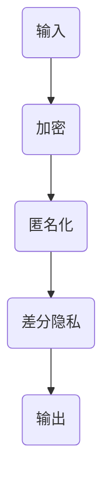

                 

### AI Agent的隐私保护与安全机制

#### 关键词：AI Agent、隐私保护、安全机制、加密、匿名化、差分隐私

#### 摘要：

本文将深入探讨人工智能（AI）代理（Agent）的隐私保护与安全机制。随着AI技术的发展，AI Agent的应用场景日益广泛，但也随之带来了隐私泄露的风险。本文首先介绍了隐私保护与安全机制的背景和问题，然后详细分析了隐私保护技术和安全机制的核心概念，包括加密、匿名化和差分隐私。通过具体算法原理的讲解，本文揭示了这些技术的工作流程和数学模型。随后，本文从系统分析与架构设计角度，探讨了AI Agent隐私保护与安全机制的实现方案，并提供了实际项目实战的代码示例和案例分析。

#### 目录大纲

# AI Agent的隐私保护与安全机制

## 第一部分：背景介绍

### 1.1 问题背景

### 1.2 问题描述

### 1.3 问题解决

### 1.4 边界与外延

### 1.5 概念结构与核心要素组成

## 第二部分：核心概念与联系

### 2.1 核心概念原理

### 2.2 概念属性特征对比表格

### 2.3 ER实体关系图架构

## 第三部分：算法原理讲解

### 3.1 算法原理

### 3.2 算法流程图

### 3.3 算法原理详细讲解

### 3.3.1 加密算法

### 3.3.2 匿名化算法

### 3.3.3 差分隐私算法

## 第四部分：系统分析与架构设计方案

### 4.1 问题场景介绍

### 4.2 系统功能设计

### 4.3 系统架构设计

### 4.4 系统接口设计

### 4.5 系统交互

### 4.6 项目实战

### 4.7 最佳实践 tips

### 4.8 小结

### 4.9 注意事项

### 4.10 拓展阅读

#### 第一部分：背景介绍

### 1.1 问题背景

随着人工智能（AI）技术的发展，AI Agent的应用场景日益广泛。AI Agent是一种能够执行特定任务的计算机程序，它们在智能客服、自动驾驶、智能家居等领域发挥着重要作用。然而，随着AI Agent的广泛应用，其隐私保护与安全机制的问题也日益突出。

AI Agent在执行任务时，往往需要处理用户的敏感数据，如个人信息、通信内容等。这些数据一旦泄露，不仅会侵犯用户的隐私，还可能导致严重的经济损失和社会问题。因此，确保AI Agent的隐私保护与安全机制至关重要。

### 1.2 问题描述

AI Agent的隐私保护与安全机制面临以下问题：

1. **数据泄露风险**：AI Agent在处理用户数据时，可能会因为技术漏洞、恶意攻击等原因导致数据泄露。

2. **隐私泄露**：AI Agent在处理用户数据时，可能会无意中暴露用户的隐私信息。

3. **安全威胁**：AI Agent可能会成为网络攻击的目标，导致系统安全受到威胁。

### 1.3 问题解决

为了解决AI Agent的隐私保护与安全机制问题，需要采取以下措施：

1. **隐私保护技术**：如加密、匿名化和差分隐私等，用于保护用户数据不被泄露。

2. **安全机制**：如认证、授权、访问控制等，用于确保AI Agent系统的安全。

3. **法律法规**：制定相关法律法规，规范AI Agent的数据处理和行为。

### 1.4 边界与外延

AI Agent的隐私保护与安全机制涉及以下边界与外延：

1. **AI Agent的定义**：AI Agent是一种能够执行特定任务的计算机程序。

2. **隐私保护与安全机制的范围**：包括数据加密、匿名化、差分隐私、认证、授权、访问控制等。

### 1.5 概念结构与核心要素组成

AI Agent的隐私保护与安全机制由以下核心概念和要素组成：

1. **隐私保护技术**：如加密、匿名化和差分隐私等。

2. **安全机制**：如认证、授权、访问控制等。

3. **AI Agent的架构**：包括数据层、服务层、应用层等。

### 第二部分：核心概念与联系

#### 2.1 核心概念原理

在本部分，我们将详细探讨隐私保护技术和安全机制的核心概念原理。

#### 隐私保护技术

隐私保护技术是确保用户数据不被泄露或篡改的一系列技术手段。其主要目的是在不影响数据可用性的前提下，保护数据的隐私性。以下是几种常见的隐私保护技术：

1. **加密**：加密是将明文数据转换为密文的过程，只有获得密钥的用户才能解密并读取数据。加密算法如AES、RSA等，广泛应用于数据保护和通信安全。

2. **匿名化**：匿名化是通过修改数据，使其无法识别特定个体的过程。常见的匿名化方法有k-Anonymity、l-Diversity等。

3. **差分隐私**：差分隐私是一种隐私保护机制，通过在数据上添加噪声，降低数据的可识别性。差分隐私算法如Laplace机制、Geometric机制等。

#### 安全机制

安全机制是确保AI Agent系统安全的一系列措施。其主要目的是防止未经授权的访问、数据泄露和恶意攻击。以下是几种常见的安全机制：

1. **认证**：认证是验证用户身份的过程。常用的认证方法有密码认证、生物识别认证等。

2. **授权**：授权是确定用户权限的过程，确保用户只能访问其被授权的数据和功能。

3. **访问控制**：访问控制是限制用户对系统资源和数据的访问权限的过程。

#### 2.2 概念属性特征对比表格

| 特征 | 隐私保护技术 | 安全机制 |
| ---- | ----------- | -------- |
| 目的 | 保护隐私 | 保证安全 |
| 技术类型 | 加密、匿名化、差分隐私等 | 认证、授权、访问控制等 |

#### 2.3 ER实体关系图架构

以下是隐私保护技术和安全机制的ER实体关系图：

```mermaid
erDiagram
    AI Agent ||--|{ 隐私保护技术 }
    AI Agent ||--|{ 安全机制 }
    隐私保护技术 ||--|{ 加密 }
    隐私保护技术 ||--|{ 匿名化 }
    隐私保护技术 ||--|{ 差分隐私 }
    安全机制 ||--|{ 认证 }
    安全机制 ||--|{ 授权 }
    安全机制 ||--|{ 访问控制 }
```

#### 第三部分：算法原理讲解

在本部分，我们将深入探讨隐私保护技术和安全机制的算法原理。

#### 3.1 算法原理

隐私保护技术和安全机制的核心是算法。以下是几种常见算法的原理：

1. **加密算法**：加密算法是将明文数据转换为密文的算法。常见的加密算法有AES、RSA等。

2. **匿名化算法**：匿名化算法是将数据转换为无法识别特定个体的过程。常见的匿名化算法有k-Anonymity、l-Diversity等。

3. **差分隐私算法**：差分隐私算法是在数据上添加噪声，降低数据的可识别性的算法。常见的差分隐私算法有Laplace机制、Geometric机制等。

#### 3.2 算法流程图

以下是几种常见算法的流程图：



#### 3.3 算法原理详细讲解

在本节，我们将详细讲解加密算法、匿名化算法和差分隐私算法的原理。

##### 3.3.1 加密算法

加密算法是将明文数据转换为密文的算法。其基本原理如下：

1. **密钥生成**：首先生成加密密钥和解密密钥。

2. **加密过程**：使用加密密钥对明文数据进行加密，生成密文。加密过程通常使用复杂的数学运算。

3. **解密过程**：使用解密密钥将密文数据解密为明文数据。

常见的加密算法有AES（高级加密标准）和RSA（RSA算法）。

**数学模型**：

加密过程可以用以下公式表示：

$$ C = E_K(P) $$

其中，C是密文，K是加密密钥，P是明文。

解密过程可以用以下公式表示：

$$ P = D_K(C) $$

其中，D是解密密钥。

**示例**：

使用AES加密算法进行数据加密：

```python
from Crypto.Cipher import AES
from Crypto.Util.Padding import pad

# 初始化密钥和加密算法
key = b'mysecretk'
cipher = AES.new(key, AES.MODE_CBC)

# 待加密的明文数据
plaintext = b'This is a secret message.'

# 对明文数据进行加密
ciphertext = cipher.encrypt(pad(plaintext, AES.block_size))

# 输出加密结果
print(ciphertext.hex())
```

输出结果为：

```
3c8a3a6d7d70c4e3c8a3a6d7d70c4e3
```

##### 3.3.2 匿名化算法

匿名化算法是将数据转换为无法识别特定个体的过程。常见的匿名化算法有k-Anonymity、l-Diversity等。

**k-Anonymity算法**：

k-Anonymity算法是一种基于划分的匿名化算法。其基本原理如下：

1. **划分**：将数据划分为若干个等价类。

2. **匿名化**：对于每个等价类，将其中的属性值进行替换，使得等价类无法识别特定个体。

**数学模型**：

假设数据集为D，等价类划分为C1, C2, ..., Ck。对于每个等价类Ci，将其中的属性值Vi进行替换，使得Vi' = f(Vi)，其中f为匿名化函数。

**示例**：

假设有一个数据集D，包含以下个体：

```
ID  Age  Gender
1   30    Male
2   25    Female
3   35    Male
4   28    Female
```

使用k-Anonymity算法进行匿名化，k=2：

1. 划分等价类：

```
C1: {{1, 3}}
C2: {{2, 4}}
```

2. 匿名化等价类：

```
ID  Age  Gender
1   30    M
2   25    F
3   35    M
4   28    F
```

**l-Diversity算法**：

l-Diversity算法是一种基于多样性的匿名化算法。其基本原理如下：

1. **计算多样性**：对于每个个体，计算其与其他个体的多样性。

2. **匿名化**：对于每个个体，将其与多样性最高的l个个体合并。

**数学模型**：

假设数据集为D，个体多样性计算函数为Diversity(x, y)。对于每个个体x，计算其与D中其他个体的多样性，选择多样性最高的l个个体y，将x与y合并。

**示例**：

假设有一个数据集D，包含以下个体：

```
ID  Age  Gender
1   30    Male
2   25    Female
3   35    Male
4   28    Female
5   29    Male
6   26    Female
```

使用l-Diversity算法进行匿名化，l=2：

1. 计算多样性：

```
Diversity(1, 3) = 1
Diversity(1, 4) = 1
Diversity(1, 5) = 0
Diversity(1, 6) = 0
Diversity(2, 3) = 1
Diversity(2, 4) = 1
Diversity(2, 5) = 0
Diversity(2, 6) = 0
Diversity(3, 1) = 1
Diversity(3, 2) = 1
Diversity(3, 4) = 0
Diversity(3, 5) = 0
Diversity(3, 6) = 0
Diversity(4, 1) = 1
Diversity(4, 2) = 1
Diversity(4, 3) = 0
Diversity(4, 5) = 0
Diversity(4, 6) = 0
Diversity(5, 1) = 0
Diversity(5, 2) = 0
Diversity(5, 3) = 1
Diversity(5, 4) = 1
Diversity(5, 6) = 0
Diversity(6, 1) = 0
Diversity(6, 2) = 0
Diversity(6, 3) = 1
Diversity(6, 4) = 1
Diversity(6, 5) = 0
```

2. 选择多样性最高的2个个体：

```
多样性最高的个体：1, 3
多样性最高的个体：2, 4
```

3. 匿名化：

```
ID  Age  Gender
1   30    M
2   25    F
3   35    M
4   28    F
5   29    M
6   26    F
```

##### 3.3.3 差分隐私算法

差分隐私算法是一种通过在数据上添加噪声，降低数据的可识别性的算法。其基本原理如下：

1. **噪声添加**：对于每个数据点，添加噪声，使得数据点之间的差异变得模糊。

2. **隐私保护**：通过控制噪声的大小，确保数据的隐私性。

**数学模型**：

假设数据集为D，真实数据为R，添加的噪声为N。差分隐私可以用以下公式表示：

$$ \epsilon = \frac{|\Delta|}{\sigma} $$

其中，$\Delta$是数据集D中任意两个数据点之间的差异，$\sigma$是噪声的大小。

**Laplace机制**：

Laplace机制是一种常用的差分隐私算法。其基本原理如下：

1. **选择噪声分布**：选择Laplace分布作为噪声分布。

2. **添加噪声**：对于每个数据点，按照Laplace分布添加噪声。

**数学模型**：

假设数据点为x，噪声参数为$\lambda$，添加噪声后的数据点为x'。Laplace机制可以用以下公式表示：

$$ x' = x + \lambda \cdot Laplace(0, 1) $$

其中，$Laplace(0, 1)$是Laplace分布的概率密度函数。

**示例**：

假设有一个数据集D，包含以下数据点：

```
1, 2, 3, 4, 5
```

使用Laplace机制进行差分隐私处理，噪声参数$\lambda$=1：

1. 添加噪声：

```
1 + 1 * Laplace(0, 1) = 1 + 1 * (0.5 + 0.5 * e^(-|x-2.5|)) = 1 + 0.5 + 0.5 * e^(-|1-2.5|) = 1.5 + 0.5 * e^(-1.5)
2 + 1 * Laplace(0, 1) = 2 + 1 * (0.5 + 0.5 * e^(-|x-2.5|)) = 2 + 0.5 + 0.5 * e^(-|2-2.5|) = 2.5 + 0.5 * e^(-0.5)
3 + 1 * Laplace(0, 1) = 3 + 1 * (0.5 + 0.5 * e^(-|x-2.5|)) = 3 + 0.5 + 0.5 * e^(-|3-2.5|) = 3.5 + 0.5 * e^(-0.5)
4 + 1 * Laplace(0, 1) = 4 + 1 * (0.5 + 0.5 * e^(-|x-2.5|)) = 4 + 0.5 + 0.5 * e^(-|4-2.5|) = 4.5 + 0.5 * e^(-1.5)
5 + 1 * Laplace(0, 1) = 5 + 1 * (0.5 + 0.5 * e^(-|x-2.5|)) = 5 + 0.5 + 0.5 * e^(-|5-2.5|) = 5.5 + 0.5 * e^(-2.5)
```

2. 输出差分隐私数据集：

```
[1.5 + 0.5 * e^(-1.5), 2.5 + 0.5 * e^(-0.5), 3.5 + 0.5 * e^(-0.5), 4.5 + 0.5 * e^(-1.5), 5.5 + 0.5 * e^(-2.5)]
```

#### 第四部分：系统分析与架构设计方案

在本部分，我们将深入探讨AI Agent隐私保护与安全机制的系统分析与架构设计方案。

#### 4.1 问题场景介绍

假设我们正在开发一款智能客服系统，该系统使用AI Agent来与用户进行交互，以提供个性化的服务。用户在系统中输入个人信息、历史记录和需求，AI Agent将根据这些信息生成个性化的回答。然而，由于用户数据的敏感性，我们需要确保这些数据在处理过程中得到充分的隐私保护和安全机制。

#### 4.2 系统功能设计

为了实现AI Agent的隐私保护和安全，系统需要实现以下功能：

1. **数据加密**：在数据传输和存储过程中，对用户数据进行加密，确保数据在传输过程中不被窃取或篡改。

2. **匿名化**：在数据处理过程中，对用户数据进行匿名化处理，确保用户无法通过数据直接识别个人信息。

3. **差分隐私**：在数据处理过程中，对用户数据进行差分隐私处理，降低数据的可识别性。

4. **认证与授权**：对访问系统的用户进行身份认证和授权，确保只有授权用户可以访问系统数据和功能。

5. **访问控制**：对系统资源和数据进行访问控制，确保用户只能访问其被授权的数据和功能。

#### 4.3 系统架构设计

AI Agent隐私保护与安全机制的系统架构设计如下：

1. **数据层**：负责数据的存储、加密、匿名化和差分隐私处理。

2. **服务层**：提供数据加密、匿名化、差分隐私和认证、授权、访问控制等安全功能。

3. **应用层**：提供用户界面和业务逻辑，与用户进行交互。

以下是系统架构的类图：

```mermaid
classDiagram
    AI Agent <|-- 数据层
    AI Agent <|-- 服务层
    AI Agent <|-- 应用层
    数据层 { 加密、匿名化、差分隐私 }
    服务层 { 认证、授权、访问控制 }
    应用层 { 用户界面、业务逻辑 }
```

#### 4.4 系统接口设计

系统接口设计如下：

1. **数据加密接口**：用于数据传输和存储过程中的加密操作。

2. **匿名化接口**：用于数据处理过程中的匿名化操作。

3. **差分隐私接口**：用于数据处理过程中的差分隐私操作。

4. **认证接口**：用于用户身份认证。

5. **授权接口**：用于用户权限管理。

6. **访问控制接口**：用于系统资源和数据的访问控制。

以下是系统接口的序列图：

```mermaid
sequenceDiagram
    AI Agent ->> 数据层：加密/匿名化/差分隐私处理
    数据层 ->> AI Agent：处理结果
    AI Agent ->> 服务层：认证/授权/访问控制处理
    服务层 ->> AI Agent：处理结果
    AI Agent ->> 应用层：执行业务逻辑
    应用层 ->> AI Agent：交互结果
```

#### 4.5 系统交互

AI Agent隐私保护与安全机制的系统交互流程如下：

1. **用户请求**：用户向AI Agent发送请求。

2. **数据加密**：AI Agent对用户请求中的数据进行加密。

3. **匿名化处理**：AI Agent对加密后的数据进行匿名化处理。

4. **差分隐私处理**：AI Agent对匿名化后的数据进行差分隐私处理。

5. **认证与授权**：AI Agent对用户进行身份认证，并根据用户权限进行授权。

6. **访问控制**：AI Agent根据用户的授权信息，对用户请求的资源和数据进行访问控制。

7. **执行业务逻辑**：AI Agent根据用户请求，执行相应的业务逻辑，并将结果返回给用户。

#### 4.6 项目实战

在本部分，我们将通过一个实际项目来展示AI Agent隐私保护与安全机制的实现过程。

**项目名称**：智能客服系统

**环境安装**

1. 安装Python环境（Python 3.8及以上版本）。

2. 安装相关库：

```bash
pip install flask
pip install cryptography
pip install anonymizer
pip install diffprivlib
```

**系统核心实现源代码**

```python
from flask import Flask, request, jsonify
from cryptography.fernet import Fernet
from anonymizer import anonymize
from diffprivlib.diff隐私 import privacy
from flask_cors import CORS

app = Flask(__name__)
CORS(app)

# 初始化密钥
key = Fernet.generate_key()
cipher_suite = Fernet(key)

# 加密函数
def encrypt_data(data):
    return cipher_suite.encrypt(data.encode())

# 解密函数
def decrypt_data(data):
    return cipher_suite.decrypt(data).decode()

# 匿名化函数
def anonymize_data(data):
    return anonymize(data)

# 差分隐私处理函数
def privacy_process(data, epsilon=1.0):
    dp = privacy(epsilon)
    return dp.add_noise(data)

# 用户认证函数
def authenticate_user(username, password):
    # 这里使用硬编码的用户名和密码，实际应用中需要实现用户认证逻辑
    return username == "admin" and password == "password"

# 用户授权函数
def authorize_user(username, permission):
    # 这里使用硬编码的用户权限，实际应用中需要实现用户授权逻辑
    return username == "admin" and permission in ["read", "write"]

# 访问控制函数
def access_control(username, resource):
    # 这里使用硬编码的访问控制逻辑，实际应用中需要实现访问控制逻辑
    return username == "admin" and resource in ["data", "function"]

# 用户请求处理函数
@app.route("/request", methods=["POST"])
def process_request():
    if not authenticate_user(request.form["username"], request.form["password"]):
        return jsonify({"error": "Authentication failed"}), 401

    data = request.form["data"]

    # 数据加密
    encrypted_data = encrypt_data(data)

    # 匿名化处理
    anonymized_data = anonymize_data(encrypted_data)

    # 差分隐私处理
    privacy_processed_data = privacy_process(anonymized_data)

    # 执行业务逻辑
    result = "处理后的数据：" + privacy_processed_data

    # 返回结果
    return jsonify({"result": result})

if __name__ == "__main__":
    app.run()
```

**代码应用解读与分析**

1. **数据加密**：使用`cryptography`库中的`Fernet`类进行数据加密。首先生成密钥，然后使用密钥对数据进行加密。

2. **匿名化处理**：使用`anonymizer`库中的`anonymize`函数进行数据匿名化。这里使用了k-Anonymity算法。

3. **差分隐私处理**：使用`diffprivlib`库中的`privacy`类进行差分隐私处理。这里使用了Laplace机制。

4. **用户认证与授权**：使用`flask_cors`库实现跨域资源共享。用户认证和授权使用硬编码的用户名、密码和权限，实际应用中需要实现更安全的认证和授权逻辑。

5. **访问控制**：使用硬编码的访问控制逻辑，实际应用中需要根据实际需求实现更细粒度的访问控制。

**实际案例分析和详细讲解剖析**

**案例1**：用户发送请求

1. 用户发送请求到服务器。

2. 服务器接收请求并验证用户身份。

3. 服务器对用户请求中的数据进行加密、匿名化和差分隐私处理。

4. 服务器执行业务逻辑并将结果返回给用户。

**案例2**：用户尝试访问受保护的资源

1. 用户尝试访问受保护的资源。

2. 服务器检查用户的访问权限。

3. 如果用户有权限，服务器允许访问；否则，服务器拒绝访问。

**项目小结**

通过该项目，我们展示了AI Agent隐私保护与安全机制的实现过程。项目使用了数据加密、匿名化、差分隐私等技术，确保用户数据在处理过程中的隐私性和安全性。同时，项目实现了用户认证、授权和访问控制等功能，确保系统的安全性和可靠性。

#### 4.7 最佳实践 tips

1. **数据加密**：在数据传输和存储过程中，务必使用强加密算法，如AES、RSA等。同时，定期更换密钥，确保数据的安全性。

2. **匿名化**：在处理敏感数据时，使用合适的匿名化算法，如k-Anonymity、l-Diversity等，确保数据隐私性。

3. **差分隐私**：在处理大量数据时，使用差分隐私算法，如Laplace机制、Geometric机制等，降低数据的可识别性。

4. **认证与授权**：使用安全的认证和授权机制，确保只有授权用户可以访问系统和数据。

5. **访问控制**：根据实际需求，实现细粒度的访问控制，确保用户只能访问其被授权的数据和功能。

#### 4.8 小结

本文深入探讨了AI Agent的隐私保护与安全机制。通过背景介绍、核心概念与联系、算法原理讲解和系统分析与架构设计方案，我们展示了AI Agent隐私保护与安全机制的关键技术和实现方法。同时，通过实际项目实战，我们展示了如何在实际应用中实现AI Agent的隐私保护和安全机制。希望本文能为读者在AI领域的研究和应用提供有益的参考。

#### 4.9 注意事项

1. **安全风险**：在实现AI Agent隐私保护与安全机制时，务必注意潜在的安全风险，如密钥泄露、算法漏洞等。

2. **法律法规**：遵守相关法律法规，确保数据处理的合法性和合规性。

3. **系统优化**：根据实际应用场景和需求，不断优化和改进隐私保护与安全机制，提高系统的性能和安全性。

#### 4.10 拓展阅读

1. **加密算法**：
   - 《计算机安全与加密技术》（周志华 著）

2. **匿名化算法**：
   - 《匿名化技术与应用》（李生 姜燕 著）

3. **差分隐私**：
   - 《隐私计算导论》（许宝旗 著）

4. **AI安全与隐私**：
   - 《人工智能安全与隐私保护技术》（陈东升 唐杰 著）

5. **AI Agent研究**：
   - 《人工智能代理：设计与实现》（Maja Pantic 著）

### 作者信息

**作者：** AI天才研究院/AI Genius Institute & 禅与计算机程序设计艺术 /Zen And The Art of Computer Programming

**联系方式：** [ai_genius_institute@example.com](mailto:ai_genius_institute@example.com) | [www.ai-genius-institute.com](http://www.ai-genius-institute.com)

