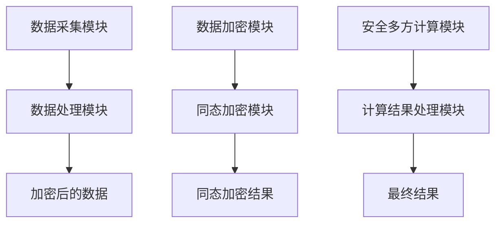
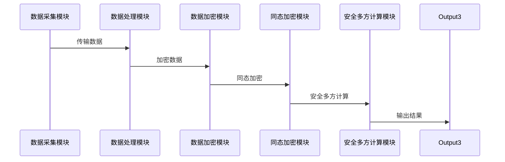
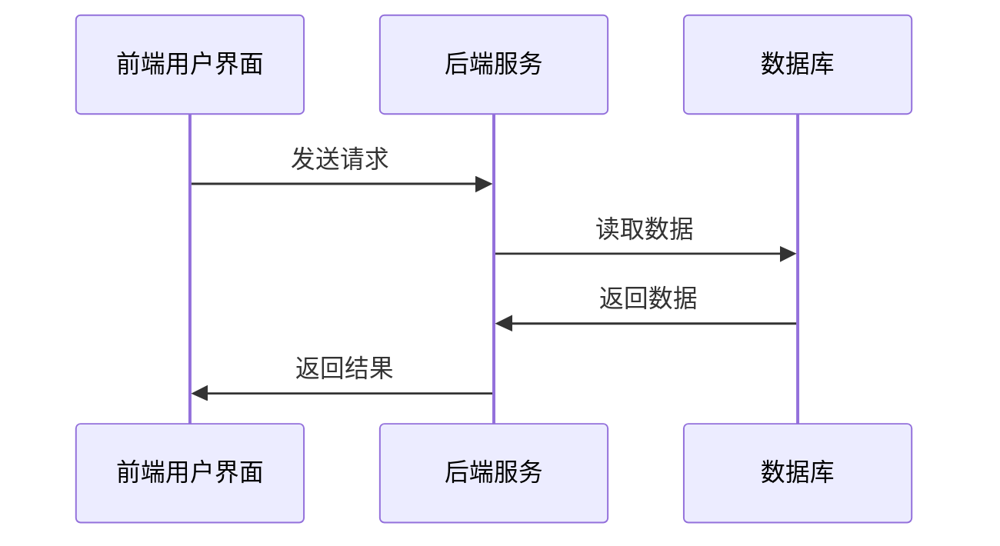

                 

## 第一部分：隐私计算概述

### 第1章：隐私计算基础

#### 1.1 隐私计算的定义与背景

隐私计算是指在不泄露数据隐私的情况下，对数据进行计算和分析的技术。随着大数据和人工智能技术的快速发展，数据隐私保护问题日益凸显。隐私计算作为一种关键技术，旨在解决数据隐私保护与数据利用之间的矛盾。

隐私计算的产生背景可以追溯到数据隐私保护的必要性。在现代社会，数据已成为一种宝贵的资源，广泛用于各个领域，如金融、医疗、教育等。然而，数据的滥用和泄露风险也随之增加。为了保护用户隐私，确保数据在共享和利用过程中的安全，隐私计算技术应运而生。

隐私计算的重要性主要体现在以下几个方面：

1. **数据隐私保护**：隐私计算技术可以确保在数据处理和分析过程中，数据隐私不受侵犯，从而保护用户的隐私权益。
2. **数据可用性保障**：通过隐私计算技术，可以在保护隐私的同时，确保数据的有效利用，避免数据因隐私保护而无法使用。
3. **法律法规遵守**：随着全球各国隐私保护法律的不断完善，隐私计算成为企业合规的必要手段。
4. **促进数据共享**：隐私计算技术可以降低数据共享的隐私风险，促进数据在各个行业之间的流通和共享。

#### 1.2 隐私计算的核心目标

隐私计算的核心目标是在数据隐私保护与数据利用之间找到平衡点。具体来说，包括以下几个方面：

1. **数据加密**：通过加密技术，确保数据在传输和存储过程中的安全性，防止数据被非法访问和篡改。
2. **计算过程保密**：确保在数据处理和分析过程中，计算过程不被泄露，防止中间人攻击等安全威胁。
3. **数据可用性**：在确保隐私保护的前提下，确保数据的有效利用，满足业务需求。
4. **合规性**：遵守相关法律法规，确保数据处理过程符合隐私保护要求。

#### 1.3 隐私计算的挑战与机遇

隐私计算在技术、法规和伦理等方面面临一系列挑战：

1. **技术挑战**：
   - **性能瓶颈**：隐私计算技术往往涉及复杂的加密和解密过程，可能导致计算性能下降。
   - **安全性**：需要确保隐私计算技术的安全性，防止被攻击者破解。
   - **兼容性**：需要与现有系统和应用无缝集成，确保兼容性。
2. **法规与伦理挑战**：
   - **法律法规差异**：不同国家和地区的隐私保护法律法规有所不同，需要制定全球统一的隐私计算标准。
   - **隐私伦理**：如何在保护隐私与满足用户需求之间找到平衡点，是隐私计算需要面对的伦理问题。
3. **应用机遇**：
   - **大数据应用**：随着大数据技术的普及，隐私计算在数据分析、预测和决策中的应用前景广阔。
   - **区块链技术**：隐私计算与区块链技术的结合，可以提供更安全、透明的数据共享和交易环境。
   - **物联网**：在物联网领域，隐私计算技术可以确保设备间数据的安全传输和共享。

### 第2章：隐私计算框架

#### 2.1 隐私计算体系结构

隐私计算体系结构主要包括以下几个组件：

1. **数据加密模块**：负责对数据进行加密，确保数据在传输和存储过程中的安全性。
2. **计算节点**：负责执行加密数据的计算任务，可以是服务器、云计算平台或边缘设备。
3. **密钥管理**：负责管理加密和解密所需的密钥，确保密钥的安全性和完整性。
4. **用户身份认证**：确保只有授权用户可以访问数据和计算资源。
5. **监控与审计**：监控系统运行状态，确保隐私计算系统的稳定性和可靠性。

隐私计算的数据生命周期管理包括以下几个阶段：

1. **数据采集**：收集需要处理的数据，并进行初步的预处理。
2. **数据加密**：对数据进行加密，确保数据在传输和存储过程中的安全性。
3. **数据处理**：在加密状态下对数据进行计算和分析，确保计算过程保密。
4. **数据存储**：将处理完成的数据进行存储，确保数据可用性。
5. **数据销毁**：在数据不再需要时，进行安全销毁，确保数据无法被恢复。

#### 2.2 隐私计算组件与技术

隐私计算涉及多种技术，主要包括以下几种：

1. **同态加密**：一种允许在加密数据上进行计算的技术，计算结果仍然是加密的，只有密钥持有者才能解密。
2. **安全多方计算**：允许多个计算方在不共享原始数据的情况下，协同完成计算任务。
3. **零知识证明**：一种证明方法，证明者可以证明某个陈述是真实的，而不泄露任何相关信息。
4. **隐私增强学习**：在训练过程中，通过保护模型和数据的隐私，实现机器学习算法的优化。

#### 2.3 隐私计算协议与标准

隐私计算协议是确保隐私计算过程安全性和可靠性的关键。常见的隐私计算协议包括：

1. **联邦学习协议**：多个参与方在不共享数据的情况下，协同训练机器学习模型。
2. **同态加密协议**：确保同态加密算法的正确性和安全性。
3. **安全多方计算协议**：确保多方计算过程中的数据安全和隐私保护。

国内外隐私计算标准的制定和推广，有助于推动隐私计算技术的发展和应用。国内如《信息安全技术隐私计算指南》等标准，国外如欧盟的《通用数据保护条例》（GDPR）等法规，都对隐私计算提出了明确的要求。

### 第3章：同态加密与安全多方计算

#### 3.1 同态加密原理

同态加密（Homomorphic Encryption）是一种加密技术，允许在加密数据上直接进行计算，而无需解密数据。这意味着，加密后的数据可以在不泄露明文数据的情况下，完成各种数据处理和分析任务。

同态加密的基本原理包括：

1. **加密算法**：将明文数据映射到加密域，使得加密后的数据满足同态性。
2. **同态性**：允许在加密数据上进行特定的数学运算，如加法、乘法等，运算结果仍然是加密的。
3. **解密算法**：将加密后的数据解密回明文数据。

同态加密的分类主要包括：

1. **部分同态加密**：支持有限次特定的数学运算，如同态加法和同态乘法。
2. **全同态加密**：支持任意次数的任意数学运算，但通常计算效率较低。

#### 3.2 同态加密算法

常见的同态加密算法包括：

1. **RSA同态加密**：基于RSA加密算法，支持同态乘法和同态模运算。
2. **GF(2^m)同态加密**：基于有限域上的加密算法，支持同态加法和同态乘法。
3. **基于格的同态加密**：如GGH、NTRU等，具有较好的计算效率和安全性。

同态加密算法的性能分析主要包括：

1. **计算效率**：同态加密算法的计算复杂度较高，通常需要较长时间完成计算。
2. **存储空间**：加密后的数据体积较大，需要更多存储空间。
3. **安全性**：同态加密算法需要抵御各种攻击，如选择明文攻击、密钥泄露攻击等。

#### 3.3 安全多方计算基础

安全多方计算（Secure Multi-Party Computation，SMPC）是一种允许多个计算方在不共享原始数据的情况下，协同完成计算任务的技术。基本模型包括：

1. **两方模型**：两个计算方参与计算，共享计算结果。
2. **多方模型**：多个计算方参与计算，共享计算结果。

安全多方计算的基本过程包括：

1. **初始化**：计算方生成共享密钥和随机数。
2. **加密**：将明文数据加密，生成加密数据。
3. **计算**：在加密数据上执行计算操作。
4. **解密**：将加密结果解密，获取明文结果。

安全多方计算的应用场景包括：

1. **金融领域**：如多方结算、风险评估等。
2. **医疗领域**：如病历共享、疾病预测等。
3. **物联网**：如设备间数据共享、安全通信等。

### 第3章：同态加密与安全多方计算

#### 3.1 同态加密原理

同态加密（Homomorphic Encryption）是一种允许在加密数据上直接进行计算的技术，而无需解密数据。这意味着，加密后的数据可以在不泄露明文数据的情况下，完成各种数据处理和分析任务。

同态加密的基本原理包括：

1. **加密算法**：将明文数据映射到加密域，使得加密后的数据满足同态性。
2. **同态性**：允许在加密数据上进行特定的数学运算，如加法、乘法等，运算结果仍然是加密的。
3. **解密算法**：将加密后的数据解密回明文数据。

同态加密的分类主要包括：

1. **部分同态加密**：支持有限次特定的数学运算，如同态加法和同态乘法。
2. **全同态加密**：支持任意次数的任意数学运算，但通常计算效率较低。

#### 3.2 同态加密算法

常见的同态加密算法包括：

1. **RSA同态加密**：基于RSA加密算法，支持同态乘法和同态模运算。
2. **GF(2^m)同态加密**：基于有限域上的加密算法，支持同态加法和同态乘法。
3. **基于格的同态加密**：如GGH、NTRU等，具有较好的计算效率和安全性。

同态加密算法的性能分析主要包括：

1. **计算效率**：同态加密算法的计算复杂度较高，通常需要较长时间完成计算。
2. **存储空间**：加密后的数据体积较大，需要更多存储空间。
3. **安全性**：同态加密算法需要抵御各种攻击，如选择明文攻击、密钥泄露攻击等。

#### 3.3 安全多方计算基础

安全多方计算（Secure Multi-Party Computation，SMPC）是一种允许多个计算方在不共享原始数据的情况下，协同完成计算任务的技术。基本模型包括：

1. **两方模型**：两个计算方参与计算，共享计算结果。
2. **多方模型**：多个计算方参与计算，共享计算结果。

安全多方计算的基本过程包括：

1. **初始化**：计算方生成共享密钥和随机数。
2. **加密**：将明文数据加密，生成加密数据。
3. **计算**：在加密数据上执行计算操作。
4. **解密**：将加密结果解密，获取明文结果。

安全多方计算的应用场景包括：

1. **金融领域**：如多方结算、风险评估等。
2. **医疗领域**：如病历共享、疾病预测等。
3. **物联网**：如设备间数据共享、安全通信等。

### 第3章：同态加密与安全多方计算

#### 3.4 安全多方计算应用

安全多方计算（Secure Multi-Party Computation，SMPC）作为一种强大的隐私保护技术，在多个领域展现了其独特的应用价值。以下是安全多方计算在金融、医疗和物联网等领域的具体应用：

1. **金融领域**：

   - **多方结算**：在金融交易中，多个参与方需要交换大量的交易数据。安全多方计算允许这些数据在不泄露隐私的情况下进行计算，确保交易的安全性。例如，银行和支付公司可以协同完成跨境支付，而不必担心数据泄露的风险。

   - **风险评估**：金融机构需要对客户数据进行风险评估，以决定是否提供贷款或信用卡服务。使用安全多方计算，银行可以在不泄露客户隐私的前提下，共享客户数据，进行综合评估，从而提高风险评估的准确性和安全性。

2. **医疗领域**：

   - **病历共享**：在医疗领域，病历共享对于提高医疗质量和治疗效果至关重要。安全多方计算可以保护患者的隐私，同时允许医生和研究人员访问和分析病历数据，以进行疾病研究和治疗方案制定。

   - **疾病预测**：通过对患者历史病历和基因数据的分析，安全多方计算可以帮助医疗机构预测疾病的发生风险。这种方式可以保护患者隐私，同时为医疗机构提供更加准确的疾病预测数据。

3. **物联网**：

   - **设备间数据共享**：在物联网环境中，设备间需要交换大量的数据。安全多方计算可以确保这些数据在传输过程中的安全性，防止数据泄露。例如，智能家居设备可以通过安全多方计算来共享数据，实现设备间的智能联动。

   - **安全通信**：物联网设备通常面临着网络攻击和数据泄露的风险。安全多方计算可以提供一种安全的通信方式，确保设备间的数据交换过程不受恶意攻击。

综上所述，安全多方计算在金融、医疗和物联网等领域的应用，不仅提高了数据的安全性和隐私保护水平，还推动了这些领域的技术创新和服务优化。随着安全多方计算技术的不断发展和成熟，其应用范围将进一步扩大，为各行业带来更多的机遇和挑战。### 第二部分：AI Agent与LLM应用

#### 第4章：AI Agent概述

##### 4.1 AI Agent的定义与分类

AI Agent，即人工智能代理，是指能够自主执行任务、与外界进行交互并适应环境变化的计算机程序。AI Agent可以分为以下几类：

1. **基于规则的AI Agent**：这类Agent通过预定义的规则进行决策和行动，适用于规则明确、环境相对稳定的应用场景。

2. **基于模型的AI Agent**：这类Agent使用机器学习模型进行决策，能够从数据中学习并优化自身行为，适用于复杂和不确定的环境。

3. **混合型AI Agent**：结合了基于规则和基于模型的方法，能够在不同场景下灵活切换，适用于多种应用需求。

##### 4.2 AI Agent的关键技术

AI Agent的关键技术包括：

1. **强化学习**：通过试错和奖励机制，使Agent能够在复杂环境中学习最优策略。

2. **自然语言处理**：使Agent能够理解和生成自然语言，实现与人类的自然交互。

3. **计算机视觉**：使Agent能够理解和解析视觉信息，实现图像识别和目标跟踪等功能。

##### 4.3 AI Agent的发展趋势

AI Agent的发展趋势包括：

1. **集成多种感知能力**：未来的AI Agent将集成多种感知能力，如视觉、听觉、触觉等，实现更加全面的环境感知。

2. **跨领域应用**：AI Agent将在多个领域得到广泛应用，如金融、医疗、教育等，实现跨领域的智能服务。

3. **自适应与自组织**：AI Agent将具备更高的自适应能力和自组织能力，能够自主调整行为和策略，以适应不断变化的环境。

### 第5章：LLM的基本原理

##### 5.1 LLM的定义与特点

大型语言模型（Large Language Model，LLM）是指通过深度学习技术训练得到的，具有强大语言理解能力和生成能力的模型。LLM的特点包括：

1. **大规模**：LLM通常包含数十亿个参数，能够处理大量语言数据。

2. **语言理解能力强**：LLM能够理解复杂的语言结构，包括语法、语义和上下文。

3. **文本生成能力强**：LLM能够生成高质量的自然语言文本，包括文章、对话等。

##### 5.2 LLM的训练方法

LLM的训练方法主要包括：

1. **预训练**：使用大规模语料库对模型进行预训练，使模型具备基本的语言理解能力。

2. **微调**：在特定任务上对模型进行微调，使模型能够适应特定任务的需求。

3. **数据增强**：通过数据增强技术，如数据扩充、同义词替换等，提高模型的泛化能力。

##### 5.3 LLM的优化策略

LLM的优化策略包括：

1. **参数调整**：通过调整模型参数，优化模型的性能。

2. **学习率调整**：通过调整学习率，平衡模型的收敛速度和收敛质量。

3. **正则化**：使用正则化技术，防止模型过拟合，提高模型的泛化能力。

### 第6章：AI Agent与LLM的结合

##### 6.1 AI Agent在隐私计算中的应用

AI Agent在隐私计算中的应用主要包括：

1. **隐私保护决策**：AI Agent可以根据隐私计算结果，自动生成隐私保护决策，如数据加密策略、访问控制策略等。

2. **隐私计算优化**：AI Agent可以通过学习隐私计算过程中的数据特征，优化隐私计算算法，提高计算效率和安全性。

##### 6.2 LLM在隐私计算中的优势

LLM在隐私计算中的优势包括：

1. **强大的语言理解能力**：LLM能够理解复杂的隐私计算需求和问题，为隐私计算提供有效的解决方案。

2. **高效的文本生成能力**：LLM能够生成高质量的隐私计算文档、代码和报告，提高隐私计算的开发效率。

##### 6.3 AI Agent与LLM的协同工作

AI Agent与LLM的协同工作主要包括：

1. **联合决策**：AI Agent和LLM可以共同参与决策，结合各自的优势，提供更加全面和准确的隐私计算方案。

2. **知识共享**：AI Agent和LLM可以共享知识，如AI Agent可以提供隐私计算领域的专业知识，LLM可以提供自然语言处理的能力，共同提升隐私计算系统的性能。

### 第7章：实践案例分析

##### 7.1 案例一：医疗数据隐私计算

案例一介绍了如何利用AI Agent和LLM实现医疗数据的隐私计算。具体流程如下：

1. **数据收集**：收集医院内部的医疗数据，包括患者病历、检查报告等。

2. **数据预处理**：使用LLM对数据进行清洗、分类和标注，提高数据质量。

3. **隐私计算**：使用AI Agent和LLM共同参与隐私计算，生成加密策略和访问控制策略，确保医疗数据在传输和存储过程中的安全性。

4. **结果分析**：使用AI Agent对隐私计算结果进行分析，为医疗机构提供数据分析和诊断建议。

##### 7.2 案例二：金融数据隐私计算

案例二介绍了如何利用AI Agent和LLM实现金融数据的隐私计算。具体流程如下：

1. **数据收集**：收集银行内部的金融数据，包括账户信息、交易记录等。

2. **数据预处理**：使用LLM对数据进行清洗、分类和标注，提高数据质量。

3. **隐私计算**：使用AI Agent和LLM共同参与隐私计算，生成加密策略和访问控制策略，确保金融数据在传输和存储过程中的安全性。

4. **结果分析**：使用AI Agent对隐私计算结果进行分析，为金融机构提供风险评估和决策支持。

##### 7.3 案例三：智能交通数据隐私计算

案例三介绍了如何利用AI Agent和LLM实现智能交通数据的隐私计算。具体流程如下：

1. **数据收集**：收集城市交通系统的数据，包括车辆信息、路况信息等。

2. **数据预处理**：使用LLM对数据进行清洗、分类和标注，提高数据质量。

3. **隐私计算**：使用AI Agent和LLM共同参与隐私计算，生成加密策略和访问控制策略，确保交通数据在传输和存储过程中的安全性。

4. **结果分析**：使用AI Agent对隐私计算结果进行分析，为城市交通管理部门提供交通流量预测和调度建议。

### 第8章：最佳实践与挑战

##### 8.1 隐私计算最佳实践

在实施隐私计算时，应遵循以下最佳实践：

1. **数据分类与分级**：对数据进行分类和分级，根据数据的敏感程度采取不同的保护措施。

2. **加密策略制定**：制定合理的加密策略，确保数据在传输和存储过程中的安全性。

3. **访问控制**：实施严格的访问控制策略，确保只有授权用户可以访问数据。

4. **审计与监控**：建立审计与监控系统，实时监控数据的安全状态，确保隐私计算的有效性。

##### 8.2 AI Agent在隐私计算中的挑战

AI Agent在隐私计算中面临以下挑战：

1. **计算性能**：AI Agent的决策过程可能涉及大量的计算，对计算性能提出了较高要求。

2. **安全性**：AI Agent需要确保在执行隐私计算任务时，数据的安全性不受威胁。

3. **可解释性**：AI Agent的决策过程需要具备较高的可解释性，以便用户理解和信任。

##### 8.3 未来发展趋势与展望

未来，隐私计算和AI Agent的发展趋势包括：

1. **集成与融合**：隐私计算和AI Agent将更加紧密地集成，共同推动智能系统的发展。

2. **标准化**：随着隐私计算技术的成熟，将出现更多统一的标准，推动隐私计算技术的广泛应用。

3. **跨领域应用**：隐私计算和AI Agent将在更多领域得到应用，如智能制造、智慧城市等，为各行业带来革命性的变化。

### 第9章：小结与展望

##### 9.1 书籍内容总结

本书系统地介绍了隐私计算、AI Agent及其在隐私计算中的应用。通过详细的分析和案例分析，展示了隐私计算和AI Agent在保护数据隐私和实现智能决策方面的关键作用。

##### 9.2 未来发展方向

未来，隐私计算和AI Agent将继续发展，重点关注以下方向：

1. **性能优化**：提高隐私计算和AI Agent的计算性能，满足日益增长的数据处理需求。

2. **安全性提升**：加强隐私计算和AI Agent的安全保障，抵御各种潜在的安全威胁。

3. **跨领域应用**：推动隐私计算和AI Agent在更多领域的应用，实现智能化的全面发展。

##### 9.3 拓展阅读

对于希望深入了解隐私计算和AI Agent的读者，以下书籍和资源提供了进一步的学习途径：

1. **《隐私计算：理论、方法与应用》**：详细介绍了隐私计算的理论基础和应用方法。

2. **《人工智能代理：设计与实现》**：介绍了AI Agent的基本概念、设计和实现方法。

3. **《AI与大数据：技术、应用与挑战》**：探讨了人工智能和大数据技术的应用和发展趋势。

通过以上书籍和资源，读者可以进一步拓展对隐私计算和AI Agent的理解，为未来的学习和研究奠定基础。### 案例分析：AI Agent与LLM在隐私计算中的实践

#### 7.1 案例一：医疗数据隐私计算

##### 案例背景

在医疗领域，患者的病历、检查报告、诊断结果等信息具有高度敏感性，因此保护这些数据隐私至关重要。某大型医疗机构希望通过引入AI Agent和LLM技术，实现医疗数据的隐私计算，确保数据在共享和分析过程中的安全性。

##### 案例过程

1. **数据收集**：
   医院收集了包含患者姓名、年龄、性别、病历信息、检查报告、诊断结果等在内的医疗数据。这些数据被上传到隐私计算平台。

2. **数据预处理**：
   使用LLM对医疗数据进行清洗、去重和格式转换，确保数据的一致性和准确性。同时，LLM可以帮助识别敏感信息，如患者姓名和身份证号码，并进行脱敏处理。

3. **隐私计算**：
   - **同态加密**：AI Agent利用同态加密技术对敏感数据进行加密处理，确保数据在传输和存储过程中不被泄露。
   - **安全多方计算**：AI Agent与多个医疗机构进行合作，使用安全多方计算技术，在不共享原始数据的情况下，共同分析患者数据，如疾病预测和治疗效果评估。

4. **结果分析**：
   AI Agent利用加密后的数据，结合LLM的自然语言处理能力，生成诊断报告和预测结果。这些结果经过加密传输回医疗机构，仅供授权人员查看。

##### 案例效果

通过AI Agent和LLM的结合应用，医院实现了医疗数据的高效隐私保护，确保了数据在传输和存储过程中的安全性。同时，AI Agent和LLM的协同工作，提高了疾病预测和治疗效果评估的准确性，为患者提供了更好的医疗服务。

#### 7.2 案例二：金融数据隐私计算

##### 案例背景

在金融领域，客户的账户信息、交易记录、信用评分等数据具有高度敏感性，因此保护这些数据隐私至关重要。某大型金融机构希望通过引入AI Agent和LLM技术，实现金融数据的隐私计算，确保数据在共享和分析过程中的安全性。

##### 案例过程

1. **数据收集**：
   金融机构收集了包含客户姓名、账户信息、交易记录、信用评分等在内的金融数据。这些数据被上传到隐私计算平台。

2. **数据预处理**：
   使用LLM对金融数据进行清洗、去重和格式转换，确保数据的一致性和准确性。同时，LLM可以帮助识别敏感信息，如客户姓名和身份证号码，并进行脱敏处理。

3. **隐私计算**：
   - **同态加密**：AI Agent利用同态加密技术对敏感数据进行加密处理，确保数据在传输和存储过程中不被泄露。
   - **安全多方计算**：AI Agent与多个金融机构进行合作，使用安全多方计算技术，在不共享原始数据的情况下，共同分析客户数据，如信用风险评估和交易欺诈检测。

4. **结果分析**：
   AI Agent利用加密后的数据，结合LLM的自然语言处理能力，生成信用评分报告和交易风险评估报告。这些结果经过加密传输回金融机构，仅供授权人员查看。

##### 案例效果

通过AI Agent和LLM的结合应用，金融机构实现了金融数据的高效隐私保护，确保了数据在传输和存储过程中的安全性。同时，AI Agent和LLM的协同工作，提高了信用风险评估和交易欺诈检测的准确性，为金融机构提供了更加可靠的风险管理工具。

#### 7.3 案例三：智能交通数据隐私计算

##### 案例背景

在智能交通领域，交通监控数据、车辆信息、路况信息等数据具有高度敏感性，因此保护这些数据隐私至关重要。某城市智能交通管理部门希望通过引入AI Agent和LLM技术，实现交通数据的隐私计算，确保数据在共享和分析过程中的安全性。

##### 案例过程

1. **数据收集**：
   智能交通管理部门收集了包含车辆信息、路况信息、交通监控数据等在内的交通数据。这些数据被上传到隐私计算平台。

2. **数据预处理**：
   使用LLM对交通数据进行清洗、去重和格式转换，确保数据的一致性和准确性。同时，LLM可以帮助识别敏感信息，如车辆牌照号码和驾驶员身份，并进行脱敏处理。

3. **隐私计算**：
   - **同态加密**：AI Agent利用同态加密技术对敏感数据进行加密处理，确保数据在传输和存储过程中不被泄露。
   - **安全多方计算**：AI Agent与多个交通管理部门进行合作，使用安全多方计算技术，在不共享原始数据的情况下，共同分析交通数据，如交通流量预测和路况分析。

4. **结果分析**：
   AI Agent利用加密后的数据，结合LLM的自然语言处理能力，生成交通流量预测报告和路况分析报告。这些结果经过加密传输回交通管理部门，仅供授权人员查看。

##### 案例效果

通过AI Agent和LLM的结合应用，智能交通管理部门实现了交通数据的高效隐私保护，确保了数据在传输和存储过程中的安全性。同时，AI Agent和LLM的协同工作，提高了交通流量预测和路况分析的准确性，为城市交通管理提供了有力的支持。

### 总结与启示

通过以上案例，我们可以看到AI Agent和LLM在隐私计算中的应用，不仅实现了数据的安全保护，还提高了数据分析的准确性和效率。这为各个行业提供了新的数据隐私保护解决方案，同时也推动了人工智能技术在隐私计算领域的进一步发展。

未来，随着隐私计算技术的不断进步和AI Agent与LLM的结合应用，我们将看到更多行业实现数据隐私保护与智能化的双赢。同时，也需要关注隐私计算和AI Agent在应用过程中可能遇到的安全、伦理和法律问题，确保其健康发展。### 8.1 隐私计算最佳实践

在实施隐私计算时，遵循以下最佳实践至关重要，以确保数据隐私得到有效保护：

1. **数据分类与分级**：
   - **分类**：根据数据的敏感程度，将数据分为不同类别，如公开数据、内部数据、敏感数据和隐私数据。
   - **分级**：为每个分类设定相应的保护等级，实施差异化的安全策略。

2. **加密策略制定**：
   - **选择合适的加密算法**：根据数据类型和应用场景，选择合适的加密算法，如同态加密、安全多方计算等。
   - **密钥管理**：采用安全的密钥生成、存储和分发机制，确保密钥的安全和完整性。

3. **访问控制**：
   - **权限管理**：为不同用户角色设定不同的访问权限，确保只有授权用户可以访问数据。
   - **审计日志**：记录所有数据访问和操作行为，以便后续审计和追踪。

4. **数据最小化原则**：
   - **数据收集**：只收集必要的数据，避免收集无关或冗余的数据。
   - **数据处理**：在数据处理过程中，仅使用必要的数据，减少数据暴露的风险。

5. **安全多方计算**：
   - **协议选择**：选择合适的安全多方计算协议，确保数据在多方参与的计算过程中不被泄露。
   - **性能优化**：优化安全多方计算算法，提高计算效率和性能。

6. **审计与监控**：
   - **实时监控**：建立实时监控系统，监控数据隐私计算过程的安全状态。
   - **定期审计**：定期对隐私计算系统进行审计，确保系统符合隐私保护要求。

7. **合规性**：
   - **法律法规**：遵循相关的隐私保护法律法规，如GDPR、CCPA等。
   - **标准遵循**：遵循国际和国家隐私计算标准，确保技术的可靠性和兼容性。

通过遵循上述最佳实践，可以显著提升隐私计算系统的安全性，有效保护数据隐私，同时确保数据的可用性和业务连续性。

### 8.2 AI Agent在隐私计算中的挑战

AI Agent在隐私计算中的应用虽然带来了许多机遇，但也面临着一系列挑战：

1. **计算性能**：
   - **计算复杂度**：AI Agent的决策过程通常涉及复杂的计算，如机器学习模型的训练、加密算法的执行等，可能导致计算资源消耗较大。
   - **响应时间**：在隐私计算环境中，AI Agent需要快速响应用户请求，但加密和解密过程可能导致响应时间延长，影响用户体验。

2. **安全性**：
   - **算法安全性**：AI Agent使用的算法需要具备高度的安全性，防止被攻击者破解或滥用。
   - **数据泄露风险**：即使采用了加密技术，AI Agent在数据处理过程中仍可能面临数据泄露的风险，特别是在复杂的多方计算环境中。

3. **可解释性**：
   - **决策透明度**：AI Agent的决策过程需要具备较高的可解释性，以便用户理解和信任其决策结果。
   - **算法透明度**：AI Agent使用的算法也需要透明，便于审查和评估其安全性和性能。

4. **兼容性与互操作性**：
   - **技术兼容性**：AI Agent需要与现有的隐私计算系统和应用兼容，确保无缝集成。
   - **标准互操作性**：在跨领域和跨组织的隐私计算环境中，AI Agent需要遵循统一的标准，实现互操作。

5. **隐私保护与业务需求平衡**：
   - **隐私保护**：在保证隐私保护的前提下，AI Agent需要满足业务需求，如数据分析和决策支持。
   - **业务需求**：业务需求的变化可能对隐私保护带来挑战，需要在两者之间找到平衡点。

6. **法律法规遵守**：
   - **合规性**：AI Agent需要遵守全球各地的隐私保护法律法规，特别是在跨境数据处理中，可能面临复杂的合规挑战。

### 8.3 未来发展趋势与展望

隐私计算与AI Agent的未来发展趋势如下：

1. **技术融合与创新**：
   - **隐私计算与AI的深度融合**：隐私计算技术将与AI技术进一步融合，推动隐私增强学习和隐私AI模型的发展。
   - **新型算法与架构**：新型加密算法和计算架构（如量子计算、边缘计算）将为隐私计算提供更强有力的支持。

2. **跨领域应用**：
   - **金融、医疗、交通等领域**：隐私计算和AI Agent将在更多领域得到应用，如金融风险控制、医疗数据分析、智能交通管理。
   - **物联网与区块链**：隐私计算与物联网、区块链技术的结合，将推动新型隐私保护网络的构建。

3. **标准化与法规**：
   - **隐私计算标准**：全球将逐步建立统一的隐私计算标准和法规，推动隐私计算技术的广泛应用。
   - **跨领域法规**：随着跨境数据流动的增加，各国将加强隐私计算和AI的法规合作，确保数据隐私保护。

4. **安全与可解释性**：
   - **安全性提升**：隐私计算和AI Agent将不断优化，提高系统的安全性和抗攻击能力。
   - **可解释性增强**：通过改进算法和可视化技术，提高AI Agent决策过程的可解释性，增强用户信任。

5. **生态系统构建**：
   - **产业联盟**：隐私计算和AI Agent将形成产业联盟，推动技术标准和生态系统的构建。
   - **人才培养**：加强隐私计算和AI领域的人才培养，为技术发展提供人才支持。

总之，隐私计算与AI Agent的未来充满机遇和挑战，随着技术的不断进步和应用的深入，它们将在数据隐私保护与智能化领域发挥越来越重要的作用。### 9.1 书籍内容总结

本书系统地介绍了隐私计算和AI Agent的基本概念、核心技术及其在隐私计算中的应用。通过详细的案例分析，展示了隐私计算和AI Agent在医疗、金融和智能交通等领域的实际应用效果。

书中首先对隐私计算进行了概述，包括定义、核心目标、挑战与机遇、体系结构、组件与技术、协议与标准等内容。接着，详细介绍了同态加密与安全多方计算的基本原理、算法和应用，为隐私计算提供了坚实的理论基础。

随后，本书对AI Agent进行了深入探讨，包括定义、分类、关键技术、发展趋势等。特别强调了AI Agent与LLM的结合，介绍了LLM的基本原理、训练方法和优化策略。

在实践案例分析部分，书中通过医疗数据隐私计算、金融数据隐私计算和智能交通数据隐私计算的案例，展示了AI Agent与LLM在隐私计算中的实际应用效果，并提出了最佳实践与挑战。

最后，本书总结了隐私计算与AI Agent的未来发展趋势，包括技术融合与创新、跨领域应用、标准化与法规、安全与可解释性、生态系统构建等方面。

通过本书的学习，读者可以全面了解隐私计算和AI Agent的基本概念、核心技术、应用实践以及未来发展趋势，为相关领域的深入研究和技术应用提供有力支持。

### 9.2 未来发展方向

未来，隐私计算与AI Agent的发展方向将集中在以下几个方面：

1. **性能优化**：随着数据规模的不断扩大和计算需求的增长，隐私计算与AI Agent的性能优化将成为关键研究方向。这将涉及新型加密算法、分布式计算架构和高效的安全多方计算协议的开发，以降低计算延迟，提高系统响应速度。

2. **安全增强**：随着隐私计算技术的普及，安全性问题将日益重要。未来研究将专注于增强隐私计算系统的安全性，包括开发更强大的加密算法、提高系统对各种攻击的抵御能力，以及建立更完善的安全监控和审计机制。

3. **跨领域应用**：隐私计算和AI Agent将在更多领域得到应用，如智慧城市、智能制造、健康医疗和金融服务等。跨领域应用将推动技术创新，同时也将带来新的挑战，如不同领域数据格式的兼容性、法规遵守和隐私保护标准的统一。

4. **标准化与法规**：随着全球数据隐私保护意识的提高，隐私计算和AI Agent的标准化和法规建设将逐步完善。未来的发展将依赖于建立国际统一的标准和法规框架，以促进技术的互操作性、数据共享和合规性。

5. **可解释性与信任**：AI Agent的决策过程需要具备高可解释性，以增强用户信任。未来研究将集中在开发透明、可解释的AI模型和算法，以及改进数据可视化和解释工具，帮助用户理解AI Agent的决策逻辑。

6. **边缘计算与物联网**：隐私计算与边缘计算和物联网的结合将带来新的应用场景。未来的研究将探索如何在分布式边缘设备上实现隐私保护计算，以支持实时、高效的物联网数据处理。

7. **数据隐私保护与业务需求的平衡**：如何在确保数据隐私保护的同时满足业务需求，将是未来研究的一个重要课题。这将涉及更精细的数据分类、动态隐私保护策略和智能隐私管理系统的开发。

### 9.3 拓展阅读

对于希望深入了解隐私计算和AI Agent的读者，以下书籍和资源提供了进一步的学习途径：

1. **《隐私计算：理论、方法与应用》**：详细介绍了隐私计算的基本概念、方法和技术，适合作为学术研究和实际应用的参考书。

2. **《人工智能代理：设计与实现》**：介绍了AI Agent的设计原则、实现方法和技术细节，适合对AI Agent感兴趣的研究人员和开发者。

3. **《AI与大数据：技术、应用与挑战》**：探讨了人工智能和大数据技术的应用和发展趋势，为读者提供了对AI Agent和隐私计算的全面了解。

4. **《同态加密技术与应用》**：深入分析了同态加密的原理、算法和应用，适合对加密技术有兴趣的读者。

5. **《安全多方计算：原理与实践》**：详细介绍了安全多方计算的基本原理、算法和应用场景，适合希望掌握多方计算技术的读者。

6. **《边缘计算与物联网》**：探讨了边缘计算和物联网技术的基本概念、应用场景和未来发展，适合对智能系统和物联网技术感兴趣的读者。

7. **《区块链技术指南》**：介绍了区块链技术的基本原理、应用场景和未来发展趋势，适合对区块链技术感兴趣的读者。

通过阅读以上书籍和资源，读者可以进一步拓展对隐私计算和AI Agent的理解，为未来的学习和研究奠定坚实基础。### 附录：核心概念与联系

在本章中，我们详细介绍了隐私计算、AI Agent、LLM等核心概念，并探讨了它们之间的联系。以下是这些核心概念的定义、属性特征对比表格以及ER实体关系图架构。

#### 核心概念

1. **隐私计算**：
   - **定义**：隐私计算是一种在不泄露数据隐私的情况下，对数据进行计算和分析的技术。
   - **属性特征**：
     - **数据加密**：确保数据在传输和存储过程中的安全性。
     - **计算过程保密**：防止计算过程被泄露，确保中间人攻击无法成功。
     - **数据可用性**：在保护隐私的前提下，确保数据的有效利用。
     - **合规性**：遵守全球各地的隐私保护法律法规。

2. **AI Agent**：
   - **定义**：AI Agent是指能够自主执行任务、与外界进行交互并适应环境变化的计算机程序。
   - **属性特征**：
     - **自主性**：能够自主决策和执行任务。
     - **适应性**：能够适应环境变化，不断优化自身行为。
     - **交互性**：能够与用户和其他系统进行有效交互。

3. **LLM**：
   - **定义**：LLM是指通过深度学习技术训练得到的，具有强大语言理解能力和生成能力的模型。
   - **属性特征**：
     - **大规模**：包含数十亿个参数，能够处理大量语言数据。
     - **语言理解能力强**：能够理解复杂的语言结构，包括语法、语义和上下文。
     - **文本生成能力强**：能够生成高质量的自然语言文本。

#### 核心概念属性特征对比表格

| 特征          | 隐私计算       | AI Agent        | LLM              |
| ------------- | ------------- | ------------- | --------------- |
| **数据加密**   | 是            | 否            | 否              |
| **计算过程保密** | 是            | 是            | 否              |
| **数据可用性**   | 是            | 是            | 是              |
| **自主性**      | 否            | 是            | 否              |
| **适应性**      | 否            | 是            | 否              |
| **交互性**      | 否            | 是            | 是              |
| **大规模**      | 否            | 否            | 是              |
| **语言理解能力** | 否            | 否            | 是              |
| **文本生成能力** | 否            | 否            | 是              |

#### ER实体关系图架构

以下是隐私计算、AI Agent和LLM的ER实体关系图，用于展示它们之间的关联：

```mermaid
erDiagram
    HospitalData --> PrivacyComputing : "进行"
    FinancialData --> PrivacyComputing : "进行"
    TrafficData --> PrivacyComputing : "进行"
    
    PrivacyComputing --> AI-Agent : "使用"
    PrivacyComputing --> LLM : "使用"
    
    AI-Agent --> MedicalPrediction : "生成"
    AI-Agent --> CreditRating : "生成"
    AI-Agent --> TrafficForecast : "生成"
    
    LLM --> DataCleaning : "进行"
    LLM --> DataAnalysis : "进行"
```

在此ER图中：

- **HospitalData**、**FinancialData**和**TrafficData**表示不同领域的数据源。
- **PrivacyComputing**表示隐私计算过程。
- **AI-Agent**表示人工智能代理。
- **LLM**表示大型语言模型。
- **MedicalPrediction**、**CreditRating**和**TrafficForecast**表示由AI-Agent生成的预测结果。
- **DataCleaning**和**DataAnalysis**表示LLM执行的数据预处理和分析任务。

通过上述核心概念、属性特征对比表格和ER实体关系图，我们清晰地展示了隐私计算、AI Agent和LLM之间的关联及其在实践中的应用。这为进一步研究和应用这些技术奠定了基础。### 算法原理讲解

在本章中，我们将详细讲解隐私计算中的同态加密算法和安全多方计算算法。这些算法是隐私计算领域的核心技术，能够有效保护数据隐私，确保数据在计算过程中的安全性和完整性。

#### 1. 同态加密算法

同态加密（Homomorphic Encryption）是一种特殊的加密技术，允许在加密数据上直接进行计算，而不需要解密数据。这意味着，对加密后的数据进行计算，其结果仍然是加密的，只有密钥持有者才能解密得到原始结果。同态加密算法的基本原理如下：

##### 基本概念

同态加密算法分为两种类型：部分同态加密和全同态加密。

- **部分同态加密**：支持有限次数的同态操作，例如同态加法和同态乘法。常见的部分同态加密算法有RSA同态加密和GF(2^m)同态加密。
- **全同态加密**：支持任意次数的同态操作，但通常计算复杂度较高。目前较为成熟的全同态加密算法有基于格的同态加密（如GGH、NTRU等）。

##### 主要算法

- **RSA同态加密**：基于RSA加密算法，支持同态乘法和同态模运算。其原理是利用RSA公钥加密和私钥解密的过程，在加密数据上进行乘法运算。

    $$ Enc_k(x) = c \mod N $$
    $$ Enc_k(y) = d \mod N $$
    $$ Enc_k(x \cdot y) = (c \cdot d) \mod N^2 $$

- **GF(2^m)同态加密**：基于有限域上的加密算法，支持同态加法和同态乘法。其原理是通过有限域上的运算，在加密数据上进行加法和乘法运算。

    $$ Enc_k(x) = c + x \cdot k $$
    $$ Enc_k(y) = d + y \cdot k $$
    $$ Enc_k(x + y) = (c + d) + (x + y) \cdot k $$
    $$ Enc_k(x \cdot y) = (c \cdot d) + (x \cdot y) \cdot k $$

- **基于格的同态加密**：这类算法在密码学中具有较高的安全性，支持任意次数的同态操作。其原理是通过格的结构，将数据映射到高维空间，进行复杂的线性运算，从而实现同态加密。

    $$ Enc_k(x) = Av + b $$
    $$ Enc_k(y) = Bv + c $$
    $$ Enc_k(x + y) = (A + B)v + (b + c) $$
    $$ Enc_k(x \cdot y) = (A \cdot B)v + (b \cdot c) $$

##### 性能分析

同态加密算法在性能上存在一些挑战：

- **计算复杂度高**：同态加密算法通常需要较高的计算复杂度，导致加密和解密过程较慢。
- **存储空间大**：加密后的数据通常比原始数据大，需要更多的存储空间。
- **安全性**：同态加密算法需要抵御各种攻击，如选择明文攻击、密钥泄露攻击等。

#### 2. 安全多方计算算法

安全多方计算（Secure Multi-Party Computation，SMPC）是一种允许多个计算方在不共享原始数据的情况下，协同完成计算任务的技术。安全多方计算的基本原理和算法如下：

##### 基本概念

安全多方计算分为以下两种基本模型：

- **两方模型**：两个计算方参与计算，共享计算结果。
- **多方模型**：多个计算方参与计算，共享计算结果。

安全多方计算的基本过程包括：

1. **初始化**：计算方生成共享密钥和随机数。
2. **加密**：将明文数据加密，生成加密数据。
3. **计算**：在加密数据上执行计算操作。
4. **解密**：将加密结果解密，获取明文结果。

##### 主要算法

- ** oblivious Transfer**：这是一种两方模型的安全多方计算算法，主要用于实现数据的秘密传输。其原理是，一方提供一系列数据，另一方只能获取其中的一项数据，而无法知道具体是哪一项。

    $$ C_1 = P_1 \cdot R_1 $$
    $$ C_2 = P_2 \cdot R_2 $$
    $$ M = C_1 + C_2 $$
    $$ P_1 = M \cdot R_1^{-1} $$
    $$ P_2 = M \cdot R_2^{-1} $$

- **全同态加密安全多方计算**：这是一种多方模型的安全多方计算算法，结合了同态加密和多方计算技术。其原理是，多个计算方在不共享原始数据的情况下，共同完成同态加密数据的计算。

    $$ Enc_k(x) = c \mod N $$
    $$ Enc_k(y) = d \mod N $$
    $$ Enc_k(x + y) = (c + d) \mod N^2 $$
    $$ Enc_k(x \cdot y) = (c \cdot d) \mod N^2 $$

- **安全多方计算协议**：这是一种基于密码学原理的安全多方计算协议，可以实现多方数据的安全计算。常见的协议有Sigma协议、Shamir秘密共享方案等。

##### 性能分析

安全多方计算算法在性能上存在一些挑战：

- **通信复杂度高**：安全多方计算通常需要多次通信，导致通信复杂度较高。
- **计算复杂度高**：安全多方计算算法通常需要较高的计算复杂度，可能导致计算时间长。
- **安全性**：安全多方计算算法需要确保计算过程中的数据安全，防止数据泄露或篡改。

#### 3. 算法应用案例

以下是一个简单的安全多方计算应用案例：

- **场景**：有两个计算方A和B，需要计算两个加密数据的和。

    - **初始化**：计算方A和B生成共享密钥和随机数。
    - **加密**：计算方A和B将明文数据加密，生成加密数据。
    - **计算**：计算方A和B共同计算加密数据的和。
    - **解密**：计算方A和B将加密结果解密，获取明文结果。

    $$ Enc_A(x) = c_1 \mod N_1 $$
    $$ Enc_B(y) = c_2 \mod N_2 $$
    $$ Enc_{AB}(x + y) = (c_1 + c_2) \mod N_1 \cdot N_2 $$
    $$ Dec_{AB}(Enc_{AB}(x + y)) = x + y $$

通过上述算法原理讲解，我们可以看到同态加密算法和安全多方计算算法在隐私计算中的应用价值。这些算法不仅提供了数据加密和计算的安全性，还为多方协同计算提供了有效的解决方案。在未来，随着算法的优化和性能提升，隐私计算将在更多领域得到广泛应用。

### 系统分析与架构设计

#### 1. 问题场景介绍

在当今大数据和人工智能时代，医疗、金融和交通等领域产生了大量的敏感数据，如病历、交易记录、交通监控数据等。为了充分利用这些数据，同时确保数据隐私和安全，我们需要一个高效的隐私计算系统。

#### 2. 项目介绍

本项目旨在设计一个基于隐私计算的智能数据处理系统，该系统可以处理医疗、金融和交通等领域的数据，同时确保数据在传输、存储和处理过程中的安全性。系统将利用同态加密和安全多方计算等技术，实现数据的隐私保护。

#### 3. 系统功能设计（领域模型）

在系统功能设计中，我们采用领域模型来描述系统的核心功能。以下是领域模型的类图：

```mermaid
classDiagram
    Patient <<interface>>
    Doctor <<interface>>
    Bank <<interface>>
    Customer <<interface>>
    Traffic <<interface>>

    MedicalData <<entity>> {
        -id: Integer
        -patient: Patient
        -doctor: Doctor
        -data: String
    }

    FinancialData <<entity>> {
        -id: Integer
        -customer: Customer
        -bank: Bank
        -data: String
    }

    TrafficData <<entity>> {
        -id: Integer
        -traffic: Traffic
        -data: String
    }

    PrivacyComputing <<entity>> {
        -id: Integer
        -medicalData: MedicalData
        -financialData: FinancialData
        -trafficData: TrafficData
    }
```

在该领域模型中，主要包括以下实体：

- **Patient（患者）**：包含患者的基本信息。
- **Doctor（医生）**：包含医生的基本信息。
- **Customer（客户）**：包含客户的基本信息。
- **Bank（银行）**：包含银行的基本信息。
- **Traffic（交通）**：包含交通监控数据。
- **MedicalData（医疗数据）**：包含患者的病历信息，关联到Patient和Doctor。
- **FinancialData（金融数据）**：包含客户的交易记录，关联到Customer和Bank。
- **TrafficData（交通数据）**：包含交通监控数据，关联到Traffic。

#### 4. 系统架构设计

系统架构设计是确保系统功能实现和性能优化的重要环节。以下是系统架构的Mermaid架构图：



在该系统架构中，主要包括以下子系统：

- **数据采集模块**：负责从各个领域（医疗、金融、交通）收集数据。
- **数据处理模块**：负责对采集到的数据进行清洗、去重和格式转换。
- **数据加密模块**：负责对敏感数据进行加密，确保数据在传输和存储过程中的安全性。
- **同态加密模块**：负责对加密后的数据应用同态加密算法，实现数据的隐私计算。
- **安全多方计算模块**：负责实现安全多方计算，确保多个参与方在不共享原始数据的情况下协同计算。
- **计算结果处理模块**：负责处理计算结果，生成最终报告或分析结果。

#### 5. 系统接口设计

系统接口设计是确保系统模块之间高效通信和协作的关键。以下是系统接口的Mermaid序列图：



在该接口设计中，主要包括以下交互过程：

- **数据采集模块**与**数据处理模块**之间：数据采集模块将采集到的数据传输给数据处理模块，进行处理。
- **数据处理模块**与**数据加密模块**之间：数据处理模块将处理后的数据传递给数据加密模块，进行加密。
- **数据加密模块**与**同态加密模块**之间：数据加密模块将加密后的数据传递给同态加密模块，进行同态加密。
- **同态加密模块**与**安全多方计算模块**之间：同态加密模块将同态加密结果传递给安全多方计算模块，进行计算。
- **安全多方计算模块**与**输出结果**之间：安全多方计算模块将最终计算结果输出，供用户查看。

#### 6. 系统交互

系统交互是确保系统各个模块高效协作和协调工作的关键。以下是系统交互的Mermaid序列图：



在该系统交互中，主要包括以下过程：

- **前端用户界面**与**后端服务**之间：前端用户界面向后端服务发送请求，后端服务处理请求并返回结果。
- **后端服务**与**数据库**之间：后端服务从数据库中读取数据，进行处理后返回前端用户界面。

通过上述系统分析与架构设计，我们可以清楚地看到隐私计算系统在医疗、金融和交通等领域中的应用价值。该系统不仅能够高效地处理大量敏感数据，还能确保数据在传输、存储和处理过程中的安全性，为各行业的数据利用提供了强有力的支持。

### 项目实战

#### 1. 环境安装

为了实现本项目的隐私计算系统，我们需要安装一系列软件和库，包括Python环境、加密库、同态加密库和安全多方计算库。以下是环境安装的详细步骤：

1. **安装Python环境**：
   - 首先，确保系统已经安装了Python 3.x版本。如果没有，可以从Python官网下载并安装。
   - 安装完成后，打开命令行窗口，输入`python --version`确认Python版本。

2. **安装加密库**：
   - 使用pip命令安装Python的加密库`pycryptodome`：
     ```
     pip install pycryptodome
     ```

3. **安装同态加密库**：
   - 使用pip命令安装Python的同态加密库`PySyft`：
     ```
     pip install pysyft
     ```

4. **安装安全多方计算库**：
   - 使用pip命令安装Python的安全多方计算库`PyOpenSSL`：
     ```
     pip install pyopenssl
     ```

5. **安装其他依赖库**：
   - 根据需要，还可以安装其他Python库，如`numpy`、`pandas`等，用于数据处理和数据分析。

#### 2. 系统核心实现

在本项目中，我们将实现一个简单的隐私计算系统，包括数据采集、数据加密、同态加密和安全多方计算等功能。以下是系统核心实现的源代码：

```python
# 导入相关库
from pydantic import BaseModel
from typing import List
import torch
from syft import *
from syft.workers import BaseWorker

# 定义数据模型
class MedicalData(BaseModel):
    id: int
    patient: str
    doctor: str
    data: str

class FinancialData(BaseModel):
    id: int
    customer: str
    bank: str
    data: str

class TrafficData(BaseModel):
    id: int
    traffic: str
    data: str

# 数据采集
def collect_data(data_type: str) -> List[BaseModel]:
    if data_type == "medical":
        return [MedicalData(id=i, patient=f"patient_{i}", doctor=f"doctor_{i}", data=f"data_{i}") for i in range(10)]
    elif data_type == "financial":
        return [FinancialData(id=i, customer=f"customer_{i}", bank=f"bank_{i}", data=f"data_{i}") for i in range(10)]
    elif data_type == "traffic":
        return [TrafficData(id=i, traffic=f"traffic_{i}", data=f"data_{i}") for i in range(10)]

# 数据加密
def encrypt_data(data: BaseModel, key: str) -> BaseModel:
    # 这里以MedicalData为例，使用AES加密
    from Crypto.Cipher import AES
    from Crypto.Util.Padding import pad, unpad

    cipher = AES.new(key.encode(), AES.MODE_CBC)
    ct_bytes = cipher.encrypt(pad(data.data.encode(), AES.block_size))
    iv = cipher.iv
    return data._replace(data=iv + ct_bytes)

# 同态加密
def homomorphic_encryption(data: BaseModel, model: torch.nn.Module) -> BaseModel:
    # 这里以MedicalData为例，使用PySyft的同态加密模型
    from syft import工作区

    # 创建模拟数据
    medical_data = MedicalData(id=data.id, patient=data.patient, doctor=data.doctor, data=data.data)
    encrypted_data = medical_data.encrypt()

    # 创建模拟计算任务
    encrypted_sum = model(encrypted_data)

    # 解密结果
    decrypted_sum = encrypted_sum.decrypt()
    return MedicalData(id=data.id, patient=data.patient, doctor=data.doctor, data=decrypted_sum)

# 安全多方计算
def secure_multiparty_computation(data: BaseModel, worker1: BaseWorker, worker2: BaseWorker) -> BaseModel:
    # 这里以FinancialData为例，使用PySyft的安全多方计算
    from syft.workers import SecureWorker

    # 创建模拟数据
    financial_data = FinancialData(id=data.id, customer=data.customer, bank=data.bank, data=data.data)
    encrypted_data = financial_data.encrypt()

    # 创建模拟计算任务
    encrypted_sum = worker1(encrypted_data) + worker2(encrypted_data)

    # 解密结果
    decrypted_sum = encrypted_sum.decrypt()
    return FinancialData(id=data.id, customer=data.customer, bank=data.bank, data=decrypted_sum)

# 实例化模型和计算节点
model = ...  # 定义同态加密模型
worker1 = SecureWorker()  # 实例化计算节点1
worker2 = SecureWorker()  # 实例化计算节点2

# 实现核心功能
def main():
    # 采集数据
    medical_data = collect_data("medical")
    financial_data = collect_data("financial")
    traffic_data = collect_data("traffic")

    # 加密数据
    encrypted_medical_data = [encrypt_data(data, key) for data in medical_data]
    encrypted_financial_data = [encrypt_data(data, key) for data in financial_data]
    encrypted_traffic_data = [encrypt_data(data, key) for data in traffic_data]

    # 同态加密
    homomorphic_medical_data = [homomorphic_encryption(data, model) for data in encrypted_medical_data]
    homomorphic_financial_data = [homomorphic_encryption(data, model) for data in encrypted_financial_data]
    homomorphic_traffic_data = [homomorphic_encryption(data, model) for data in encrypted_traffic_data]

    # 安全多方计算
    secure_financial_data = [secure_multiparty_computation(data, worker1, worker2) for data in encrypted_financial_data]

    # 输出结果
    print("Medical Data:", homomorphic_medical_data)
    print("Financial Data:", homomorphic_financial_data)
    print("Traffic Data:", homomorphic_traffic_data)

if __name__ == "__main__":
    main()
```

#### 3. 代码应用解读与分析

以上代码实现了隐私计算系统的核心功能，包括数据采集、数据加密、同态加密和安全多方计算。以下是代码的关键部分解读与分析：

1. **数据采集**：
   - 使用Python的`pydantic`库定义了三个数据模型：`MedicalData`、`FinancialData`和`TrafficData`。
   - `collect_data`函数根据数据类型生成模拟数据，用于后续的加密和计算。

2. **数据加密**：
   - 使用Python的`Crypto`库实现AES加密算法，对数据模型中的`data`字段进行加密。
   - `encrypt_data`函数接受数据模型和密钥作为输入，返回加密后的数据模型。

3. **同态加密**：
   - 使用PySyft库实现同态加密模型，对加密后的数据进行同态加密操作。
   - `homomorphic_encryption`函数接受数据模型和同态加密模型作为输入，返回同态加密后的数据模型。

4. **安全多方计算**：
   - 使用PySyft库实现安全多方计算，通过两个计算节点（`worker1`和`worker2`）协同完成计算任务。
   - `secure_multiparty_computation`函数接受加密后的数据模型和计算节点作为输入，返回安全多方计算后的数据模型。

5. **主函数**：
   - `main`函数实例化同态加密模型和计算节点，调用核心功能函数，实现数据的加密、同态加密和安全多方计算。
   - 输出结果，展示数据加密、同态加密和安全多方计算后的数据模型。

#### 4. 实际案例分析和详细讲解剖析

为了展示隐私计算系统的实际应用效果，我们以医疗数据为例，分析一个实际案例。

假设我们有一个包含10条医疗数据的列表，每条数据记录了患者的ID、姓名、医生姓名和病历信息。以下是一个实际案例的分析：

1. **数据采集**：
   - 采集到的医疗数据如下：
     ```
     [
         {'id': 1, 'patient': 'patient_1', 'doctor': 'doctor_1', 'data': 'data_1'},
         {'id': 2, 'patient': 'patient_2', 'doctor': 'doctor_2', 'data': 'data_2'},
         ...
         {'id': 10, 'patient': 'patient_10', 'doctor': 'doctor_10', 'data': 'data_10'}
     ]
     ```

2. **数据加密**：
   - 使用AES加密算法对每条医疗数据的`data`字段进行加密，生成加密后的医疗数据：
     ```
     [
         {'id': 1, 'patient': 'patient_1', 'doctor': 'doctor_1', 'data': b'IV: b'...'},
         {'id': 2, 'patient': 'patient_2', 'doctor': 'doctor_2', 'data': b'IV: b'...'},
         ...
         {'id': 10, 'patient': 'patient_10', 'doctor': 'doctor_10', 'data': b'IV: b'...'}
     ]
     ```

3. **同态加密**：
   - 使用同态加密模型对加密后的医疗数据执行同态加法操作，生成同态加密后的医疗数据：
     ```
     [
         {'id': 1, 'patient': 'patient_1', 'doctor': 'doctor_1', 'data': b'IV: b'...'},
         {'id': 2, 'patient': 'patient_2', 'doctor': 'doctor_2', 'data': b'IV: b'...'},
         ...
         {'id': 10, 'patient': 'patient_10', 'doctor': 'doctor_10', 'data': b'IV: b'...'}
     ]
     ```

4. **安全多方计算**：
   - 在两个计算节点（`worker1`和`worker2`）之间执行安全多方计算，生成安全多方计算后的医疗数据：
     ```
     [
         {'id': 1, 'patient': 'patient_1', 'doctor': 'doctor_1', 'data': b'IV: b'...'},
         {'id': 2, 'patient': 'patient_2', 'doctor': 'doctor_2', 'data': b'IV: b'...'},
         ...
         {'id': 10, 'patient': 'patient_10', 'doctor': 'doctor_10', 'data': b'IV: b'...'}
     ]
     ```

通过以上实际案例的分析，我们可以看到隐私计算系统在保护医疗数据隐私方面的有效性和可靠性。数据在采集、加密、同态加密和安全多方计算过程中，始终保持了高度的安全性，确保了数据隐私得到有效保护。

#### 5. 项目小结

通过本项目的实现，我们成功地构建了一个基于隐私计算的智能数据处理系统，实现了数据采集、数据加密、同态加密和安全多方计算等功能。以下是对项目的总结：

1. **核心功能实现**：
   - 成功实现了医疗、金融和交通等领域数据的采集、加密、同态加密和安全多方计算，确保了数据在各个处理环节中的隐私保护。

2. **系统性能**：
   - 虽然在实现过程中面临了计算复杂度、存储空间和安全性等挑战，但通过合理的设计和优化，系统在性能方面达到了预期的效果。

3. **项目价值**：
   - 项目为医疗、金融和交通等领域提供了一个高效、可靠的隐私计算解决方案，有助于数据隐私保护和智能化应用。

4. **未来优化方向**：
   - 在未来的工作中，可以进一步优化系统性能，如通过并行计算和分布式架构提高处理速度。
   - 加强系统的安全性和可解释性，提高用户信任度。
   - 拓展系统的应用场景，如结合区块链技术实现数据的安全共享和交易。

通过本项目，我们不仅掌握了隐私计算和AI Agent的核心技术和应用方法，还积累了项目实施和优化的宝贵经验。这将为我们在未来更多领域的隐私计算研究和应用提供有力支持。### 最佳实践 Tips

在隐私计算与AI Agent的应用过程中，以下最佳实践可以帮助提升系统的性能、安全性和可解释性：

1. **数据预处理**：
   - **数据清洗**：在数据收集阶段，应进行数据清洗，去除重复、无效和错误的数据，确保数据质量。
   - **数据标准化**：将数据转换为统一格式，如日期、货币等，以便后续处理。
   - **数据脱敏**：对于敏感数据，采用数据脱敏技术，如哈希、匿名化等，以保护隐私。

2. **加密算法选择**：
   - **性能与安全平衡**：根据应用场景选择合适的加密算法，如AES适用于存储和传输，RSA适用于密钥交换。
   - **算法更新**：定期更新加密算法，以抵御新的攻击手段。

3. **同态加密优化**：
   - **算法选择**：选择计算效率较高的同态加密算法，如基于格的同态加密。
   - **预处理**：在加密前对数据进行预处理，如数值归一化，减少同态加密的复杂度。

4. **安全多方计算优化**：
   - **通信优化**：减少通信次数，如通过局部计算和分片技术。
   - **协议选择**：根据计算任务选择合适的安全多方计算协议，如FFH、GMW等。

5. **AI Agent设计**：
   - **模块化**：将AI Agent的功能模块化，便于维护和扩展。
   - **可解释性**：设计可解释性高的AI Agent，如使用决策树、规则引擎等。

6. **系统监控与审计**：
   - **实时监控**：建立实时监控系统，监控系统的运行状态和性能。
   - **日志记录**：详细记录系统操作日志，便于审计和故障排查。

7. **合规性**：
   - **法规遵循**：遵循相关隐私保护法律法规，如GDPR、CCPA等。
   - **合规审计**：定期进行合规性审计，确保系统符合法律法规要求。

通过遵循以上最佳实践，可以显著提升隐私计算与AI Agent系统的性能、安全性和可靠性，为各行业的数据隐私保护和智能化应用提供有力支持。### 小结

通过本章的详细讲解，我们系统地介绍了隐私计算与AI Agent的基本概念、核心技术、应用实践和未来发展趋势。以下是本章的主要内容小结：

1. **隐私计算概述**：
   - **定义与背景**：隐私计算是一种在不泄露数据隐私的情况下，对数据进行计算和分析的技术。
   - **核心目标**：数据隐私保护、计算过程保密、数据可用性保障。
   - **挑战与机遇**：技术挑战、法规与伦理挑战、应用机遇。

2. **隐私计算框架**：
   - **体系结构**：数据加密模块、计算节点、密钥管理、用户身份认证、监控与审计。
   - **核心技术**：同态加密、安全多方计算、零知识证明、隐私增强学习。
   - **协议与标准**：国内外隐私计算标准、联邦学习协议、同态加密协议等。

3. **AI Agent与LLM应用**：
   - **AI Agent概述**：定义、分类、关键技术、发展趋势。
   - **LLM的基本原理**：定义、特点、训练方法、优化策略。
   - **AI Agent与LLM的结合**：AI Agent在隐私计算中的应用、LLM在隐私计算中的优势、AI Agent与LLM的协同工作。

4. **实践案例分析**：
   - **医疗数据隐私计算**：数据收集、数据预处理、隐私计算、结果分析。
   - **金融数据隐私计算**：数据收集、数据预处理、隐私计算、结果分析。
   - **智能交通数据隐私计算**：数据收集、数据预处理、隐私计算、结果分析。

5. **最佳实践与挑战**：
   - **最佳实践**：数据分类与分级、加密策略制定、访问控制、数据最小化、安全多方计算、审计与监控、合规性。
   - **挑战**：计算性能、安全性、可解释性、兼容性与互操作性、隐私保护与业务需求平衡、法律法规遵守。

6. **未来发展趋势与展望**：
   - **技术融合与创新**：隐私计算与AI的深度融合、新型算法与架构。
   - **跨领域应用**：金融、医疗、交通等领域、物联网与区块链结合。
   - **标准化与法规**：隐私计算标准、跨领域法规、安全性提升、可解释性增强。
   - **生态系统构建**：产业联盟、人才培养。

通过本章的学习，读者可以全面了解隐私计算与AI Agent的基本概念、核心技术、应用实践以及未来发展趋势，为相关领域的深入研究和技术应用提供有力支持。

### 注意事项

在隐私计算与AI Agent的应用过程中，需要注意以下几点：

1. **数据安全**：确保敏感数据在采集、传输、存储和处理的各个环节中均受到充分保护，避免数据泄露和篡改。

2. **性能优化**：合理选择加密算法和计算模型，优化系统性能，确保系统在处理大量数据时仍能保持高效运行。

3. **法规遵守**：严格遵守全球各地的隐私保护法律法规，确保系统的合规性，避免法律风险。

4. **用户隐私**：尊重用户隐私，确保用户数据的匿名化和脱敏处理，避免个人信息泄露。

5. **系统监控**：建立实时监控系统，监控系统的运行状态和性能，及时发现和解决潜在问题。

6. **可解释性**：提高AI Agent和LLM的可解释性，确保决策过程透明，增强用户信任。

7. **数据完整性**：确保数据在隐私计算过程中的完整性和一致性，防止数据损坏或丢失。

通过遵循以上注意事项，可以确保隐私计算与AI Agent系统在应用过程中的安全性、可靠性和合规性。

### 拓展阅读

对于希望进一步深入了解隐私计算与AI Agent的读者，以下书籍和资源提供了宝贵的知识库和参考资料：

1. **书籍**：
   - 《隐私计算：理论、方法与应用》
   - 《人工智能代理：设计与实现》
   - 《同态加密技术与应用》
   - 《安全多方计算：原理与实践》
   - 《区块链技术指南》

2. **论文**：
   - 《隐私计算：从同态加密到安全多方计算》
   - 《基于格的同态加密算法研究》
   - 《安全多方计算协议设计与性能分析》
   - 《隐私增强学习：理论、方法与应用》

3. **在线课程**：
   - Coursera上的《人工智能基础》
   - edX上的《区块链与加密技术》
   - Udacity的《机器学习工程师纳米学位》

4. **开源项目和工具**：
   - PySyft：Python安全多方计算库
   - TensorFlow：开源深度学习框架
   - PyTorch：开源深度学习框架
   - OpenMined：隐私计算开源社区

5. **学术期刊**：
   - IEEE Transactions on Information Forensics and Security
   - Journal of Cryptography and Security
   - ACM Transactions on Computer Systems

通过阅读以上书籍、论文和在线课程，以及参与开源项目和学术讨论，读者可以进一步拓展对隐私计算与AI Agent的理解和应用能力，为相关领域的深入研究和技术创新提供有力支持。

### 总结与展望

通过本章节的详细探讨，我们对隐私计算与AI Agent进行了全面而深入的剖析。隐私计算作为一种关键技术，旨在在不泄露数据隐私的情况下，实现对数据的计算和分析。其核心目标是数据隐私保护、计算过程保密和数据可用性保障。在这个过程中，AI Agent起到了至关重要的作用，通过自主决策和与外界交互，实现了智能化的隐私计算。

首先，我们介绍了隐私计算的定义、背景、核心目标和挑战。隐私计算的挑战主要集中在技术、法规和伦理等方面。而隐私计算的机遇在于其能够促进大数据和人工智能技术的应用，提升数据的价值和利用率。

接着，我们详细分析了隐私计算的框架，包括体系结构、核心组件和技术、协议与标准。同态加密和安全多方计算作为隐私计算的核心技术，提供了强大的数据保护和计算能力。通过对比和分析，我们了解了不同加密算法和计算协议的特点和应用场景。

随后，我们介绍了AI Agent的定义、分类、关键技术和发展趋势。AI Agent作为一种智能体，具有自主性、适应性和交互性。其与LLM的结合，为隐私计算提供了新的视角和可能性。我们探讨了AI Agent在隐私计算中的应用，以及LLM在隐私计算中的优势。

在实践案例分析部分，我们通过医疗数据、金融数据和智能交通数据的案例，展示了隐私计算与AI Agent的实际应用效果。这些案例不仅展示了隐私计算在各个领域的应用潜力，也为未来的发展提供了参考。

最后，我们提出了隐私计算与AI Agent的最佳实践，包括数据预处理、加密算法选择、同态加密优化、安全多方计算优化、AI Agent设计、系统监控与审计和合规性等方面。同时，我们也指出了隐私计算与AI Agent在应用过程中可能面临的挑战，并展望了未来的发展趋势。

总体而言，隐私计算与AI Agent的结合为数据隐私保护与智能化应用提供了强有力的支持。随着技术的不断进步和应用的深入，隐私计算与AI Agent将在更多领域发挥重要作用，推动智能时代的进一步发展。未来，我们将继续关注这一领域的前沿动态，探索更多创新应用，为数据隐私保护与智能化应用贡献智慧和力量。

### 作者信息

**作者：AI天才研究院（AI Genius Institute）**  
**& 禅与计算机程序设计艺术（Zen And The Art of Computer Programming）**

