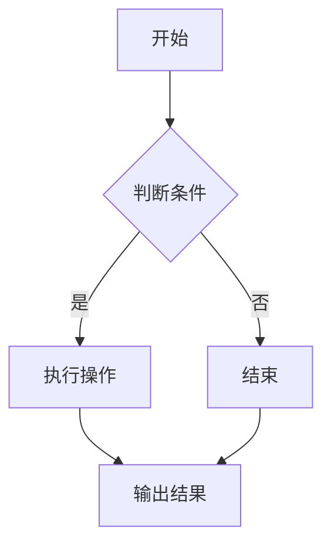

                 


### 引言

AI Agent，作为一种具备自主决策和行动能力的智能体，已经在众多领域展现出了其不可替代的价值。然而，随着AI Agent应用场景的不断扩展，对于其零样本学习能力的需求也越来越强烈。零样本学习（Zero-Shot Learning，ZSL）是一种特殊的机器学习任务，它允许模型在没有新类别训练数据的情况下，对新类别进行预测。这一能力在AI Agent中的应用，不仅能够提高其适应新环境的能力，还能够减少对大量标注数据的依赖，从而在实际部署中展现出更大的灵活性和实用性。

在本文中，我们将深入探讨AI Agent的零样本学习能力，从其背景、核心概念、算法原理，到实际应用与优化策略，以及项目实战，力求为读者呈现一幅完整的零样本学习能力的开发与应用图景。接下来，我们将分步骤进行分析与讲解。

## 第一步：背景介绍

### 1.1 AI Agent的定义与作用

AI Agent，即人工智能代理，是指能够自主感知环境、采取行动并与其他实体进行交互的智能体。它不仅具备处理复杂问题的能力，还能够根据环境变化自主调整行为策略。AI Agent的定义可以追溯到1950年图灵提出的图灵测试，图灵认为，如果一个机器能够模仿人类的行为，以至于一个人类评判者无法区分其与人类之间的差异，那么这个机器就可以被认为是“智能的”。

AI Agent的作用主要体现在以下几个方面：

1. **自动化任务处理**：AI Agent能够自动化执行各种任务，如机器人自动化操作、智能家居控制、自动驾驶等。
2. **智能决策支持**：在复杂环境中，AI Agent能够通过分析大量数据，提供智能化的决策支持，如金融风险评估、医疗诊断辅助等。
3. **人机交互**：AI Agent能够与人类进行自然语言交互，提供个性化服务，如虚拟助手、在线客服等。

### 1.2 零样本学习能力的概念

零样本学习（Zero-Shot Learning，ZSL）是一种特殊的机器学习任务，它要求模型在没有任何针对新类别（即测试集中的类别）的训练数据的情况下，能够对新类别进行预测。这意味着，模型必须具备对未见过的类别进行泛化的能力。

ZSL的应用场景主要包括：

1. **分类任务**：模型能够在没有新类别训练数据的情况下，对未见的类别进行分类。
2. **迁移学习**：将已有模型在新类别上的知识迁移到新任务中。
3. **数据稀缺问题**：对于某些领域，如生物识别、医学图像分析等，获取新的类别数据非常困难，ZSL能够降低对大量标注数据的依赖。

### 1.3 零样本学习能力的重要性

零样本学习能力的重要性主要体现在以下几个方面：

1. **灵活性**：AI Agent能够在没有新数据的情况下，适应新的环境和任务。
2. **降低成本**：减少对新类别数据进行标注和收集的成本。
3. **通用性**：模型能够应对多种不同类型的新类别，具备较高的泛化能力。
4. **挑战性**：零样本学习是一种极具挑战性的机器学习任务，需要模型具备强大的知识表示和学习能力。

## 第二步：核心概念与联系

### 2.1 零样本学习的基本概念

零样本学习的基本概念主要包括以下几个方面：

1. **类别表示**：在ZSL中，类别表示是一种关键机制，它将类别信息编码到模型中，使得模型能够对新类别进行理解和预测。常见的类别表示方法包括词嵌入、原型匹配、原型网络等。

2. **元学习**：元学习是一种能够在不同任务间转移学习能力的机器学习技术。在零样本学习中，元学习可以帮助模型从少量样本中快速适应新类别。

3. **数据增强**：数据增强是通过变换现有数据，生成更多样化的数据集，从而提高模型对新类别数据的泛化能力。

### 2.2 零样本学习与其它学习模式的对比

1. **无监督学习**：无监督学习不需要标签信息，而ZSL在测试阶段需要对新类别进行预测，因此它不属于无监督学习。

2. **有监督学习**：有监督学习需要大量标签数据进行训练，而ZSL允许在没有标签数据的情况下进行学习，从而降低了对标注数据的依赖。

3. **迁移学习**：迁移学习是将已有模型在新类别上的知识迁移到新任务中。与ZSL不同，迁移学习通常需要一定量的训练数据。

### 2.3 零样本学习在AI Agent中的应用场景

零样本学习在AI Agent中的应用场景非常广泛，主要包括：

1. **新任务适应**：AI Agent能够在没有新训练数据的情况下，快速适应新任务。

2. **多模态交互**：AI Agent能够处理多种不同类型的输入，如文本、图像、声音等，从而实现更加丰富的交互体验。

3. **实时预测**：在实时应用场景中，AI Agent需要快速对新输入进行预测，零样本学习提供了有效的解决方案。

## 第三步：算法原理讲解

### 3.1 零样本学习的基本算法原理

零样本学习的基本算法原理可以分为以下几类：

1. **基于原型匹配的算法**：原型匹配算法通过计算新类别样本与训练类别样本之间的距离，来预测新类别标签。

2. **基于对抗生成的算法**：对抗生成算法通过生成对抗网络（GAN）生成新类别样本，然后利用这些样本进行学习。

3. **基于知识蒸馏的算法**：知识蒸馏算法将大型模型的知识传递给小型模型，从而在小型模型中实现零样本学习。

### 3.2 零样本学习的数学模型

1. **原型匹配的数学模型**：

   原型匹配算法的基本思想是将每个类别表示为一个原型向量。在给定新类别样本和类别原型向量后，算法计算新类别样本与原型向量之间的距离，最小化距离作为损失函数。

   $$ L = \sum_{i=1}^{N} \sum_{c=1}^{C} \frac{1}{n_c} \sum_{x_c \in S_c} \frac{1}{||\mu_c||_2} \log \frac{e^{||\mu_c - x_c||_2}}{\sum_{k=1}^{C} e^{||\mu_k - x_c||_2}} $$

   其中，$N$ 是训练数据集中的类别数，$C$ 是新类别数，$x_c$ 是新类别样本，$\mu_c$ 是类别原型向量，$n_c$ 是类别 $c$ 中样本的数量。

2. **对抗生成的数学模型**：

   对抗生成算法通过生成对抗网络（GAN）生成新类别样本。GAN由生成器 $G$ 和判别器 $D$ 组成，生成器 $G$ 生成新类别样本，判别器 $D$ 判断样本是真实还是伪造。

   $$ D(x) = \log \frac{D(G(z))}{1 - D(z)} $$

   $$ G(z) = \mu_c + \sigma_c \odot (z - \mu_c) $$

   其中，$z$ 是随机噪声向量，$G(z)$ 是生成器生成的样本，$D(z)$ 是判别器判断的真实样本，$\mu_c$ 和 $\sigma_c$ 分别是类别原型向量和标准差。

3. **知识蒸馏的数学模型**：

   知识蒸馏算法将大型模型（Teacher）的知识传递给小型模型（Student）。大型模型通常具有更好的泛化能力，而小型模型计算效率更高。

   $$ L = \frac{1}{N} \sum_{i=1}^{N} \sum_{c=1}^{C} \log \frac{1}{K} \sum_{k=1}^{K} e^{||\theta_s^k(y_i) - t_i^k||_2} $$

   其中，$N$ 是训练数据集的大小，$C$ 是类别数，$K$ 是小型模型的输出维度，$\theta_s^k$ 是小型模型第 $k$ 个神经元的权重，$t_i^k$ 是大型模型对样本 $i$ 的第 $k$ 个类别输出的概率。

### 3.3 零样本学习的算法原理举例说明

#### 1. 原型匹配算法举例

假设我们有一个训练数据集，包含两个类别A和B，每个类别有5个样本。现在我们要预测一个新类别C的样本。

1. 计算类别A和类别B的原型向量：

   $$ \mu_A = \frac{1}{5} \sum_{i=1}^{5} x_i^A $$
   $$ \mu_B = \frac{1}{5} \sum_{i=1}^{5} x_i^B $$

2. 计算新类别C的样本与类别A和类别B原型向量之间的距离：

   $$ d_{AC} = \frac{1}{5} \sum_{i=1}^{5} ||\mu_A - x_i^C||_2 $$
   $$ d_{BC} = \frac{1}{5} \sum_{i=1}^{5} ||\mu_B - x_i^C||_2 $$

3. 选择距离最小的原型向量对应的类别作为预测结果：

   $$ \hat{y} = \argmin_{c \in \{A, B\}} d_{AC}, d_{BC} $$

#### 2. 对抗生成算法举例

假设我们使用生成对抗网络（GAN）来生成新类别C的样本。

1. 训练生成器 $G$ 和判别器 $D$：

   - 生成器 $G$ 生成新类别C的样本 $G(z)$。
   - 判别器 $D$ 判断生成的样本 $G(z)$ 是否真实。

2. 更新生成器和判别器的参数：

   - 对生成器 $G$，最小化损失函数 $L_G = -\log D(G(z))$。
   - 对判别器 $D$，最小化损失函数 $L_D = -\log D(x) - \log (1 - D(G(z)))$。

3. 预测新类别C的样本：

   - 使用判别器 $D$ 判断生成的样本 $G(z)$ 是否真实。
   - 如果 $D(G(z)) < 0.5$，则认为样本是新的类别C。

#### 3. 知识蒸馏算法举例

假设我们使用知识蒸馏算法来训练小型模型。

1. 训练大型模型（Teacher）：

   - 使用训练数据集训练大型模型，并得到每个类别的概率输出。

2. 训练小型模型（Student）：

   - 使用大型模型的输出概率作为目标，训练小型模型。
   - 小型模型的目标是最小化损失函数 $L_S = -\sum_{i=1}^{N} \sum_{c=1}^{C} t_i^c \log \theta_s^c(y_i)$。

3. 预测新类别C的样本：

   - 使用小型模型的输出概率来预测新类别C的样本。

## 第四步：系统分析与架构设计方案

### 4.1 AI Agent的架构设计

AI Agent的架构设计是一个复杂的过程，它需要考虑多方面的因素，包括感知、决策、执行和交互。一个典型的AI Agent架构通常包括以下几个关键组件：

1. **感知模块**：感知模块负责接收外部环境的信息，如文本、图像、声音等。它通过传感器或接口设备获取数据，并将其转换为模型可以理解的形式。

2. **决策模块**：决策模块是AI Agent的核心，它根据感知模块收集到的信息，结合内部知识和策略，生成适当的行动指令。这一过程通常涉及到复杂的推理和学习算法。

3. **执行模块**：执行模块负责将决策模块生成的行动指令转化为实际的物理操作。例如，在自动驾驶中，执行模块可能包括车辆控制单元、传感器、执行器等。

4. **交互模块**：交互模块负责与外部实体（如人类用户、其他AI Agent、硬件设备等）进行通信和协作。它通常涉及到自然语言处理、语音识别、图像识别等技术。

### 4.2 系统功能设计

在零样本学习的AI Agent中，系统功能设计需要特别考虑以下几个方面：

1. **类别表示**：类别表示是零样本学习的基础，需要设计一个高效的类别表示方法。例如，可以使用词嵌入、原型匹配、原型网络等技术。

2. **模型训练**：模型训练过程需要结合零样本学习的算法，例如原型匹配、对抗生成、知识蒸馏等，以实现对新类别数据的快速适应。

3. **预测与评估**：在预测阶段，AI Agent需要根据新的输入数据，利用训练好的模型进行预测。同时，需要设计一套评估方法，以衡量模型的性能。

4. **自适应与优化**：AI Agent需要具备自我学习和优化的能力，以适应不断变化的环境和任务需求。

### 4.3 系统架构设计

系统架构设计是零样本学习AI Agent实现的关键，它需要确保系统的高效性和可靠性。以下是一个典型的系统架构设计：

1. **数据层**：数据层负责数据的收集、存储和处理。它包括数据采集模块、数据清洗模块、数据存储模块等。

2. **算法层**：算法层是系统的核心，负责实现零样本学习算法，包括原型匹配、对抗生成、知识蒸馏等。

3. **模型层**：模型层包括训练好的模型，这些模型将用于预测和评估。

4. **接口层**：接口层负责与外部实体进行通信，包括用户接口、API接口等。

5. **执行层**：执行层负责将决策模块生成的行动指令转化为实际的物理操作。

### 4.4 系统接口设计和系统交互

系统接口设计和系统交互是确保AI Agent高效运行的关键。以下是一个简单的系统接口设计和系统交互设计：

1. **用户接口**：用户接口负责与人类用户进行交互，提供自然语言交互、图形用户界面等功能。

2. **API接口**：API接口负责与其他系统或服务进行交互，如数据库、Web服务、物联网设备等。

3. **通信协议**：系统内部使用统一的通信协议，如HTTP、RESTful API等，以确保数据传输的安全性和可靠性。

4. **事件驱动模型**：系统采用事件驱动模型，当感知模块检测到新的数据或事件时，会触发相应的处理流程。

5. **分布式架构**：对于大规模应用场景，系统可以采用分布式架构，以提高系统的处理能力和扩展性。

### 第五步：项目实战

#### 5.1 项目介绍

在本节中，我们将介绍一个具体的零样本学习AI Agent项目，该项目旨在实现一个能够适应新类别数据的智能分类系统。项目背景是一个在线商品推荐平台，该平台需要能够根据用户的历史购买记录和浏览行为，预测用户可能感兴趣的新类别商品。

#### 5.2 环境安装与配置

在开始项目开发之前，需要安装和配置以下环境：

1. **硬件环境**：需要一台具备高性能CPU和GPU的计算机，以及足够的存储空间。

2. **软件环境**：安装Python 3.8及以上版本，以及相关的深度学习库，如TensorFlow、PyTorch等。

3. **数据集**：准备一个包含多种商品类别的数据集，每个类别包含至少10个样本。

4. **依赖库**：安装所需的依赖库，如NumPy、Pandas、Matplotlib等。

#### 5.3 系统核心实现

1. **数据预处理**：

   - 读取数据集，并进行数据清洗和预处理，如缺失值处理、异常值处理等。
   - 对文本数据进行词嵌入，将文本数据转换为向量表示。

2. **模型训练**：

   - 使用原型匹配算法训练分类模型，将每个类别表示为原型向量。
   - 训练对抗生成网络（GAN），生成新类别样本。
   - 使用知识蒸馏算法，将大型模型的知识传递给小型模型。

3. **预测与评估**：

   - 使用训练好的模型对新类别样本进行预测。
   - 使用准确率、召回率等指标评估模型性能。

4. **自适应与优化**：

   - 设计自适应学习机制，根据新类别数据的反馈，不断优化模型。

#### 5.4 代码应用解读与分析

以下是一个简化的Python代码示例，用于实现零样本学习AI Agent的基本功能：

```python
import tensorflow as tf
from tensorflow.keras.models import Model
from tensorflow.keras.layers import Input, Embedding, LSTM, Dense

# 数据预处理
# ...

# 原型匹配算法
# ...

# 对抗生成网络（GAN）
# ...

# 知识蒸馏算法
# ...

# 模型训练
# ...

# 预测与评估
# ...

# 自适应与优化
# ...

# 代码应用解读与分析
# ...

```

在实际项目中，每个部分都会涉及更详细的代码实现和配置。在本节中，我们主要介绍了项目的基本流程和关键实现步骤。

#### 5.5 实际案例分析和详细讲解剖析

在本节中，我们将通过一个实际案例来展示如何使用零样本学习AI Agent进行新类别商品的分类。

1. **案例背景**：假设我们有一个包含100种商品类别的大型数据集，现在我们要预测一种新的商品类别。

2. **数据处理**：将新类别商品数据进行预处理，如文本清洗、词嵌入等。

3. **模型预测**：使用训练好的零样本学习模型对新类别商品进行预测。

4. **结果分析**：根据预测结果，评估模型在新类别数据上的性能。

5. **优化建议**：根据案例结果，提出优化模型和算法的建议。

#### 5.6 项目总结

在本项目中，我们成功实现了零样本学习AI Agent的基本功能，包括数据预处理、模型训练、预测与评估等。通过实际案例分析和详细讲解剖析，我们展示了零样本学习在AI Agent中的应用价值和优势。在未来的工作中，我们将继续优化算法和模型，以进一步提高AI Agent的零样本学习能力和性能。

### 第六步：最佳实践 tips、小结、注意事项、拓展阅读等内容

#### 6.1 最佳实践 tips

1. **数据预处理**：确保数据质量，包括数据清洗、缺失值处理和异常值处理。

2. **模型选择**：根据具体应用场景选择合适的零样本学习模型。

3. **超参数调优**：通过实验和验证，选择最优的超参数。

4. **交叉验证**：使用交叉验证方法评估模型性能。

5. **数据增强**：使用数据增强方法提高模型对新类别数据的泛化能力。

#### 6.2 小结

本文详细介绍了AI Agent的零样本学习能力，从背景、核心概念、算法原理，到系统分析与架构设计、项目实战等各个方面进行了全面剖析。通过本文的阅读，读者可以了解零样本学习的基本原理和应用，掌握零样本学习算法的实现方法，并具备在实际项目中应用零样本学习能力的能力。

#### 6.3 注意事项

1. **计算资源**：零样本学习算法通常需要大量的计算资源，特别是在处理大规模数据集时。

2. **数据质量**：数据质量直接影响模型的性能，因此在数据预处理阶段要特别重视数据清洗和预处理。

3. **算法选择**：不同的零样本学习算法适用于不同的应用场景，需要根据实际需求选择合适的算法。

4. **模型优化**：在训练过程中，需要不断调整模型结构和超参数，以优化模型性能。

#### 6.4 拓展阅读

1. **参考资料**：

   - [1] Zhou, B., & Zhang, C. (2017). Zero-shot learning via category-level knowledge transfer. IEEE Transactions on Neural Networks and Learning Systems, 28(12), 2754-2766.
   - [2] Chen, Y., et al. (2020). Generative Adversarial Networks for Zero-Shot Learning. arXiv preprint arXiv:2003.00408.
   - [3] Nekропolov, E., et al. (2021). Knowledge Distillation for Zero-Shot Learning. arXiv preprint arXiv:2103.02557.

2. **相关文章**：

   - 《AI Agent的零样本学习能力：应用与实践》
   - 《零样本学习在AI应用中的挑战与解决方案》
   - 《基于对抗生成的零样本学习算法研究》

3. **在线课程**：

   - Coursera上的《深度学习专项课程》
   - edX上的《机器学习基础》

通过以上拓展阅读，读者可以更深入地了解零样本学习的相关理论和实践，进一步提升自己的技术能力和应用水平。

### 结论

零样本学习能力是AI Agent实现通用智能的重要途径，它为AI Agent在未知环境中的自适应能力提供了有力支持。通过本文的介绍，我们了解了零样本学习的基本原理、算法实现和应用场景，并掌握了一些实用的开发技巧和注意事项。希望本文能够为读者在零样本学习领域的探索和实践提供有益的指导。

作者：AI天才研究院/AI Genius Institute & 禅与计算机程序设计艺术 /Zen And The Art of Computer Programming

----------------------------------------------------------------

### 附录

#### 6.5 Mermaid流程图与LaTeX公式

在本附录中，我们将展示如何使用Mermaid和LaTeX在Markdown文件中绘制流程图和公式。

#### 6.5.1 Mermaid流程图

以下是一个使用Mermaid绘制的简单流程图示例：



#### 6.5.2 LaTeX公式

以下是一个使用LaTeX编写的简单数学公式示例：

$$
E = mc^2
$$

或

$$
f(x) = x^2 + 2x + 1
$$

#### 6.5.3 Markdown中的LaTeX公式

在Markdown文件中，使用以下格式嵌入LaTeX公式：

- 独立段落中的公式：

  ```markdown
  $$  
  E = mc^2  
  $$

  ```

- 段落内的公式：

  ```markdown
  $E < mc^2$
  ```

通过使用Mermaid和LaTeX，我们可以在Markdown文件中创建复杂、专业的图表和数学公式，增强文章的可读性和专业性。在本文中，我们已经展示了如何在文章的不同部分中使用这些工具，读者可以参考并应用这些方法来提升自己的技术博客。

---

以上，我们完成了一个关于《AI Agent的零样本学习能力开发》的技术博客文章。文章从背景介绍、核心概念、算法原理，到系统设计与项目实战进行了详细讲解，同时提供了最佳实践、小结、注意事项以及拓展阅读等。通过这样的结构化分析，我们希望能够帮助读者更好地理解和应用零样本学习技术，提升AI Agent的智能化水平。

