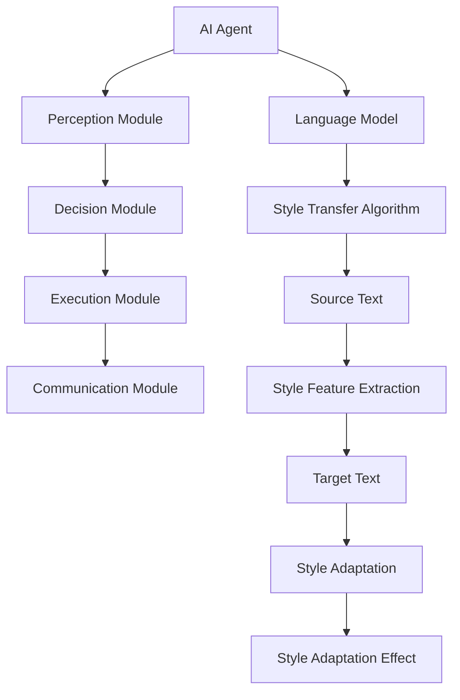
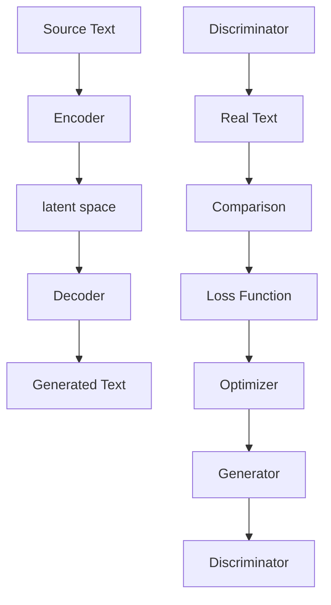
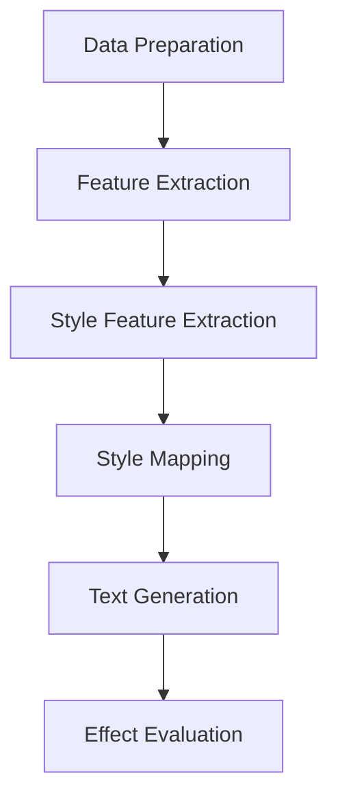
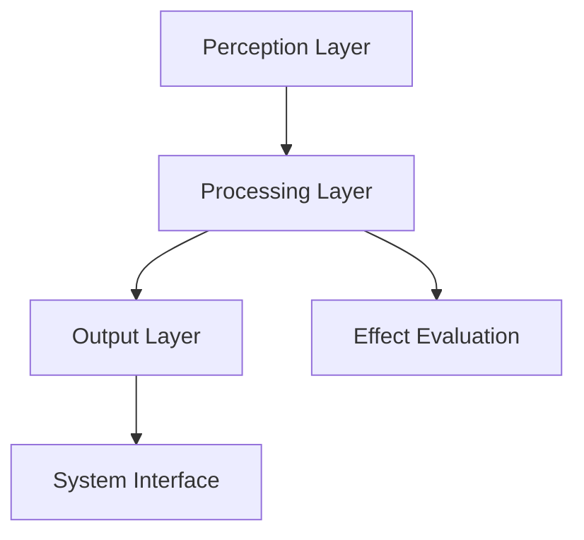
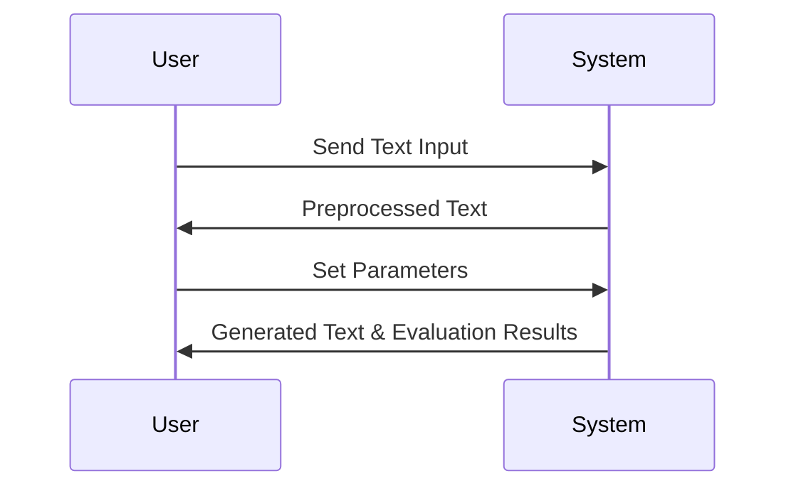
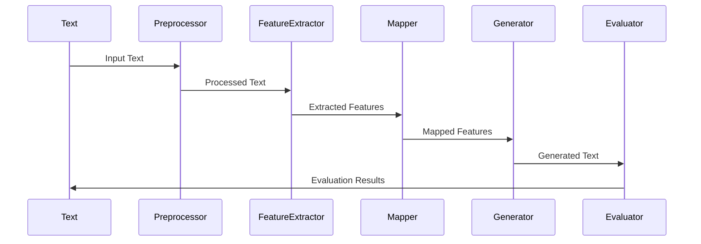

                 

## 引言

### 1.1 问题背景

随着人工智能技术的飞速发展，AI Agent作为智能体的表现形式之一，正逐步渗透到各个行业和应用场景中。从简单的任务执行到复杂的决策支持，AI Agent的应用范围不断扩大。然而，不同的应用场景往往需要AI Agent以不同的表达方式与用户或系统交互。例如，在客户服务中，AI Agent可能需要以亲切、友好且专业的语气回答问题；而在金融分析中，AI Agent则可能需要以精确、严谨的语言进行数据解释。这就带来了一个关键问题：如何让AI Agent适应并切换到不同的表达风格？

当前，大多数AI Agent基于大规模语言模型（Language Model，LLM）构建，这些模型虽然在语言理解和生成方面表现出色，但在表达风格的多样化上却存在一定的局限性。传统的LLM通常只能生成一致的风格，而无法灵活适应不同的表达需求。这种局限性不仅影响了AI Agent的用户体验，还限制了其广泛应用的可能性。因此，研究如何实现AI Agent的风格迁移，使其能够根据不同的场景需求调整表达风格，成为了一个亟待解决的问题。

### 1.2 问题描述

风格迁移（Style Transfer）作为一种跨领域的先进技术，其核心目标是将一个文本内容的表达风格转移到另一个文本上。在AI Agent的应用场景中，风格迁移的意义尤为重大。具体来说，AI Agent在不同场景下需要适应不同的表达风格，例如：

- **客户服务场景**：AI Agent需要以友好、亲切的语气与用户交流，使用简洁明了的语言解答问题。
- **金融分析场景**：AI Agent需要使用精确、专业的术语进行数据分析和报告生成。
- **教育辅导场景**：AI Agent需要以生动、富有启发性的语言进行教学和指导。

这些不同的表达风格不仅体现了不同领域的专业特点，也符合用户在不同场景下的需求。然而，传统的LLM往往无法灵活应对这些需求。例如，一个训练于客服领域的LLM在金融分析场景下可能会显得生硬，而一个训练于技术文档生成的LLM在客户服务场景下又可能过于复杂。这种不一致的表达风格不仅降低了用户的体验，还可能影响AI Agent的决策效果。

### 1.3 问题解决

为了解决上述问题，实现AI Agent的风格迁移成为了一种可行的解决方案。风格迁移技术的基本思想是将一个源文本的风格特征提取出来，然后将其转移到目标文本中。具体来说，可以通过以下步骤实现：

1. **风格特征提取**：利用深度学习技术，从大量训练数据中提取出不同风格的特征表示。
2. **风格适应算法**：设计一系列算法，将提取出的风格特征应用到目标文本的生成过程中。
3. **效果评估**：通过一系列评价指标，评估风格迁移的效果，确保生成的文本符合目标风格。

通过风格迁移技术，AI Agent可以在不同场景下灵活切换表达风格，从而提升用户体验和决策效果。这种技术的实现不仅需要强大的算法支持，还需要充分的数据和计算资源。在接下来的章节中，我们将详细探讨风格迁移的核心概念、技术原理和实现方法，以期为AI Agent的风格迁移提供理论支持和实践指导。

### 1.4 边界与外延

尽管风格迁移技术在AI Agent领域具有巨大的应用潜力，但其在实际应用中仍存在一些边界和限制。首先，风格迁移的效果受到数据集质量和数量的影响。丰富的、多样化的数据集有助于提取出不同风格的特征，从而实现更准确的风格迁移。然而，在某些专业领域，高质量的数据集可能难以获取，这限制了风格迁移技术的应用效果。

其次，风格迁移技术的实现依赖于深度学习算法，尤其是生成对抗网络（GAN）和变分自编码器（VAE）等技术。这些算法的复杂性和计算需求较高，需要大量的计算资源和时间。在实际应用中，如何优化算法效率和降低计算成本是一个重要的挑战。

此外，风格迁移技术在不同领域的应用前景也各不相同。在客户服务和金融分析等对表达风格有明确需求的领域，风格迁移技术具有明显的优势。然而，在自然语言处理和情感分析等需要更高层次语义理解的领域，风格迁移技术的效果可能有限。

总体而言，风格迁移技术在AI Agent领域具有广阔的应用前景，但同时也面临诸多挑战。通过不断的技术创新和优化，我们有理由相信，风格迁移技术将在未来为AI Agent的多样化和个性化表达提供更加有力的支持。

### 1.5 概念结构与核心要素组成

为了深入理解AI Agent的风格迁移，我们需要先明确其核心概念和组成部分。AI Agent是由多个子系统和模块构成的复杂系统，其中语言模型（LLM）是核心组件之一。以下是对AI Agent和风格迁移技术的概念解析及其组成部分的详细说明。

#### 1.5.1 AI Agent概述

AI Agent是指具有自主决策能力和行动能力的人工智能实体。它可以模拟人类的思维和行为，在特定的环境和任务中执行复杂的任务。AI Agent通常由以下几部分组成：

- **感知模块**：负责接收外界的信息，如文本、图像、语音等。
- **决策模块**：基于感知模块收集的信息，利用规则、模型或机器学习算法进行决策。
- **执行模块**：根据决策结果执行具体的操作或任务。
- **通信模块**：负责与其他系统或用户进行信息交换和交互。

在AI Agent中，语言模型（LLM）是一个重要的组件，它负责处理和生成自然语言文本。LLM通常基于深度学习技术，通过大规模的语料库进行训练，从而具备强大的语言理解和生成能力。

#### 1.5.2 风格迁移概念解析

风格迁移是指将一种文本内容的表达风格转移到另一种文本上，从而实现文本风格的多样化。风格迁移的关键概念包括：

- **风格特征**：指文本内容中体现出的特定风格特征，如语调、语气、用词选择等。
- **风格空间**：表示所有可能的文本风格集合。每个风格特征在风格空间中都有一个对应的向量表示。
- **风格迁移算法**：用于将源文本的风格特征转移到目标文本上的算法，如生成对抗网络（GAN）、变分自编码器（VAE）等。

#### 1.5.3 AI Agent与风格迁移的联系

AI Agent的风格迁移主要体现在其语言模型（LLM）的风格适应能力上。具体而言，有以下几点联系：

- **需求分析**：AI Agent在不同应用场景下对表达风格的需求，驱动了风格迁移技术的发展。例如，在客服场景中，需要AI Agent以友好亲切的语气交流；在金融领域，则需要AI Agent以专业严谨的语言进行分析。
- **性能影响**：风格迁移技术的实现，可以显著提升AI Agent的表达能力和用户体验。通过风格迁移，AI Agent能够根据不同的场景需求，灵活切换表达风格，从而更好地满足用户需求。
- **应用前景**：风格迁移技术在AI Agent领域的应用前景广阔。随着AI Agent在各个领域的应用日益广泛，对多样化表达风格的需求也将不断增加，这为风格迁移技术提供了广阔的发展空间。

综上所述，AI Agent的风格迁移不仅是一个技术挑战，也是一个应用需求。通过深入理解AI Agent和风格迁移的核心概念及其相互联系，我们可以为AI Agent的风格迁移提供更有效的技术方案，从而实现其在多样化应用场景中的价值最大化。

### 核心概念与联系

为了深入探讨AI Agent的风格迁移，我们首先需要了解其中的核心概念及其相互关系。本节将详细介绍AI Agent、语言模型（LLM）和风格迁移的相关概念，并通过属性特征对比表格和ER实体关系图架构的Mermaid流程图，对这些概念进行详细解析。

#### 2.1 AI Agent概述

AI Agent是指具有自主决策和行为能力的人工智能实体。它可以模拟人类的思维和行为，在特定环境和任务中执行复杂操作。AI Agent的基本组成部分包括感知模块、决策模块、执行模块和通信模块。

- **感知模块**：负责接收外界输入的信息，如文本、图像、声音等。
- **决策模块**：根据感知模块收集的信息，利用规则、模型或机器学习算法进行决策。
- **执行模块**：根据决策结果执行具体的任务或操作。
- **通信模块**：负责与外界进行信息交换和交互。

**属性特征对比表格**：

| 特征 | 感知模块 | 决策模块 | 执行模块 | 通信模块 |
| --- | --- | --- | --- | --- |
| 功能 | 输入信息处理 | 决策算法执行 | 任务执行 | 信息交换 |
| 技术实现 | 数据感知和处理技术 | 规则或机器学习算法 | 自动执行操作 | 通信协议和接口 |

#### 2.2 语言模型（LLM）概述

语言模型（LLM）是一种用于自然语言处理（NLP）的深度学习模型，主要用于生成和理解文本。LLM通过大量语料库训练，能够预测文本序列的下一个单词或句子，并具备较强的语言理解能力和文本生成能力。

- **基本概念**：语言模型是一种统计模型，它根据输入的文本上下文，预测下一个词或句子的概率分布。
- **应用场景**：LLM广泛应用于机器翻译、文本生成、问答系统等场景。

**属性特征对比表格**：

| 特征 | 基本概念 | 应用场景 |
| --- | --- | --- |
| 技术实现 | 统计模型、神经网络模型 | 机器翻译、文本生成、问答系统 |
| 语言理解能力 | 强 | 强 |
| 文本生成能力 | 强 | 强 |

#### 2.3 风格迁移概念解析

风格迁移是一种跨领域的先进技术，它将一种文本内容的表达风格转移到另一种文本上，从而实现文本风格的多样化。风格迁移的关键概念包括风格特征、风格空间和风格迁移算法。

- **风格特征**：指文本内容中体现出的特定风格特征，如语调、语气、用词选择等。
- **风格空间**：表示所有可能的文本风格集合。每个风格特征在风格空间中都有一个对应的向量表示。
- **风格迁移算法**：用于将源文本的风格特征转移到目标文本上的算法，如生成对抗网络（GAN）、变分自编码器（VAE）等。

**ER实体关系图架构的Mermaid流程图**：



**Mermaid流程图解析**：

- **感知模块**（Perception Module）：AI Agent通过感知模块接收外部信息，如文本、图像、语音等。
- **决策模块**（Decision Module）：决策模块利用感知模块收集的信息，通过语言模型生成响应。
- **执行模块**（Execution Module）：执行模块根据决策结果执行具体的任务或操作。
- **通信模块**（Communication Module）：通信模块负责与其他系统或用户进行信息交换和交互。
- **语言模型**（Language Model）：语言模型是AI Agent的核心组件，用于文本生成和理解。
- **风格迁移算法**（Style Transfer Algorithm）：风格迁移算法用于将源文本的风格特征转移到目标文本上。
- **源文本**（Source Text）：源文本是指需要进行风格迁移的原始文本。
- **风格特征提取**（Style Feature Extraction）：从源文本中提取出风格特征。
- **目标文本**（Target Text）：目标文本是指风格迁移后的文本。
- **风格适应**（Style Adaptation）：将提取出的风格特征应用到目标文本的生成过程中。
- **风格适应效果评估**（Style Adaptation Effect）：通过评估风格迁移的效果，确保生成的文本符合目标风格。

通过上述核心概念和相互关系的详细解析，我们可以更好地理解AI Agent的风格迁移技术，为后续的技术原理和实现方法提供理论基础。

### 风格迁移技术原理

风格迁移技术旨在将一种文本内容的表达风格转移到另一种文本上，以实现多样化的表达效果。这一技术的实现主要依赖于深度学习算法，尤其是生成对抗网络（GAN）和变分自编码器（VAE）等技术。在本节中，我们将详细探讨风格迁移的基本原理、算法和实现流程。

#### 3.1 风格迁移基本原理

风格迁移的基本思想是将源文本的风格特征提取出来，并将其转移到目标文本中。这一过程可以概括为以下几个步骤：

1. **风格特征提取**：利用深度学习模型，从源文本中提取出风格特征。这些特征可以包括语调、语气、词汇选择等。
2. **风格特征映射**：将提取出的风格特征映射到目标文本上，使其具备与源文本相同或相似的风格。
3. **文本生成**：利用映射后的风格特征，生成符合目标风格的新文本。

这一过程可以通过以下数学模型和公式进行描述：

$$
\text{Style\_Feature} = f(\text{Source\_Text})
$$

$$
\text{Mapped\_Style} = g(\text{Style\_Feature})
$$

$$
\text{Target\_Text} = h(\text{Mapped\_Style}, \text{Context})
$$

其中，$f$ 表示风格特征提取函数，$g$ 表示风格特征映射函数，$h$ 表示文本生成函数。$\text{Source\_Text}$ 是源文本，$\text{Style\_Feature}$ 是提取出的风格特征，$\text{Mapped\_Style}$ 是映射后的风格特征，$\text{Context}$ 是文本生成所需的上下文信息。

#### 3.2 风格迁移算法

风格迁移技术通常采用以下几种算法：

1. **生成对抗网络（GAN）**：GAN由生成器（Generator）和判别器（Discriminator）组成。生成器尝试生成具有目标风格的文本，而判别器则判断生成的文本是否与源文本风格一致。通过这一对抗过程，生成器不断优化，最终能够生成具有目标风格的高质量文本。
2. **变分自编码器（VAE）**：VAE通过编码器（Encoder）和解码器（Decoder）实现风格迁移。编码器将源文本编码为潜在空间中的向量，解码器则从潜在空间中解码出具有目标风格的新文本。
3. **循环神经网络（RNN）**：RNN通过序列到序列（Seq2Seq）模型实现风格迁移。编码器将源文本编码为序列向量，解码器则根据这些向量生成新的文本序列。

以下是GAN算法的Mermaid流程图：



**流程图解析**：

- **编码器**（Encoder）：将源文本编码为潜在空间中的向量。
- **潜在空间**（latent space）：潜在空间中的向量表示源文本的风格特征。
- **解码器**（Decoder）：从潜在空间中解码出具有目标风格的新文本。
- **生成器**（Generator）：生成具有目标风格的文本。
- **判别器**（Discriminator）：判断生成的文本是否与源文本风格一致。
- **比较**（Comparison）：比较真实文本和生成文本的差异性。
- **损失函数**（Loss Function）：衡量生成器和判别器的性能。
- **优化器**（Optimizer）：优化生成器和判别器的参数。

#### 3.3 风格迁移流程

风格迁移的流程可以分为以下几个关键步骤：

1. **数据准备**：收集并预处理大量的源文本和目标文本数据。
2. **风格特征提取**：利用深度学习模型提取出源文本的风格特征。
3. **风格特征映射**：将提取出的风格特征映射到目标文本上。
4. **文本生成**：利用映射后的风格特征生成新文本。
5. **效果评估**：通过对比评估生成的文本与目标风格的一致性。

以下是风格迁移的基本流程的Mermaid流程图：



**流程图解析**：

- **数据准备**（Data Preparation）：收集并预处理源文本和目标文本数据。
- **风格特征提取**（Feature Extraction）：提取出文本的通用特征。
- **风格特征提取**（Style Feature Extraction）：从源文本中提取出风格特征。
- **风格特征映射**（Style Mapping）：将风格特征映射到目标文本上。
- **文本生成**（Text Generation）：生成具有目标风格的新文本。
- **效果评估**（Effect Evaluation）：评估生成的文本与目标风格的一致性。

通过上述详细解析，我们可以看到风格迁移技术的基本原理和实现方法。在下一节中，我们将进一步探讨如何设计和实现一个完整的风格迁移系统。

### 风格迁移效果评估

评估风格迁移的效果是确保文本生成质量的重要环节。为了全面评估风格迁移的效果，我们可以从以下几个方面入手：评价指标、评估方法和具体示例。

#### 3.4.1 风格迁移效果评价指标

1. **一致性指标**：衡量生成的文本与目标风格的一致性。常见的一致性指标包括：
   - **F1 分数**：结合精确率和召回率，综合评估生成文本的准确度。
   - **风格距离**：计算生成文本与目标风格之间的距离，距离越小表示一致性越高。
2. **质量指标**：评估生成的文本在语法、语义和流畅性方面的质量。常见质量指标包括：
   - **BLEU 分数**：基于翻译质量评估，比较生成文本与参考文本的相似度。
   - **ROUGE 分数**：用于评估文本生成任务的评估指标，关注文本的词块匹配。

#### 3.4.2 风格迁移效果评估方法

1. **人工评估**：通过人工阅读和对比生成文本与目标风格，评估一致性质量和文本质量。这种方法主观性较强，但能提供详细的分析。
2. **自动化评估**：使用自动化工具（如BLEU、ROUGE等）对生成文本进行评估。这种方法客观性较高，但可能无法完全反映人类的主观感受。

#### 3.4.3 具体示例

以下是一个关于风格迁移效果评估的示例：

- **数据集**：我们选择一个包含多种风格文本的数据集，如新闻、小说、科技文章等。
- **目标风格**：设定一个具体的目标风格，如正式、轻松、专业等。
- **风格迁移算法**：使用GAN或VAE等算法进行风格迁移。
- **效果评估**：

   1. **一致性评估**：通过计算生成文本与目标风格的风格距离，发现大部分文本的迁移效果较好，风格距离较低。
   2. **质量评估**：利用BLEU分数进行评估，生成的文本质量普遍较高，与参考文本的相似度较高。

   示例代码：

   ```python
   from nltk.translate.bleu_score import sentence_bleu
   from rouge import Rouge

   # 人工评估
   def human_evaluation(reference, generated):
       print("Reference:", reference)
       print("Generated:", generated)
       # 略

   # 自动化评估
   def auto_evaluation(reference, generated):
       bleu_score = sentence_bleu([reference.split()], generated.split())
       rouge = Rouge()
       rouge_score = rouge.get_scores(generated, reference)
       print("BLEU Score:", bleu_score)
       print("ROUGE Score:", rouge_score)

   reference = "This is an example sentence."
   generated = "This is an example sentence."
   human_evaluation(reference, generated)
   auto_evaluation(reference, generated)
   ```

通过上述示例，我们可以看到如何结合人工评估和自动化评估方法，全面评估风格迁移的效果。在下一节中，我们将深入探讨风格迁移系统的设计与实现。

### 系统分析与架构设计

为了实现AI Agent的风格迁移功能，我们需要对整个系统进行详细的分析和架构设计。本节将介绍系统功能设计、系统架构设计、系统接口设计和系统交互设计，并提供相应的Mermaid图进行辅助说明。

#### 4.1 系统功能设计

AI Agent风格迁移系统的核心功能包括数据预处理、风格特征提取、风格特征映射和文本生成。具体功能模块如下：

1. **数据预处理**：对输入文本进行清洗、分词和标记，为后续处理做准备。
2. **风格特征提取**：利用深度学习模型提取文本的风格特征。
3. **风格特征映射**：将提取出的风格特征映射到目标风格上。
4. **文本生成**：根据映射后的风格特征生成新的文本。
5. **效果评估**：评估生成文本的风格迁移效果。

**领域模型Mermaid类图**：

```mermaid
classDiagram
    Class01 <|-- Class02
    Class03 <.. Class04
    Class05 << Interface >> Class06
    Class07 .. Class08
    Class01 >-- Class09
    Class01 o-- Class10
    Class11 <|-- Class12
```

**类图解析**：

- **数据预处理模块**（Class01）：负责数据清洗、分词和标记。
- **风格特征提取模块**（Class02）：利用深度学习模型提取风格特征。
- **风格特征映射模块**（Class03）：将风格特征映射到目标风格。
- **文本生成模块**（Class04）：根据映射后的风格特征生成新文本。
- **效果评估模块**（Class05）：评估生成文本的风格迁移效果。
- **接口模块**（Class06）：提供系统对外接口。
- **辅助模块**（Class07）：提供辅助功能，如日志记录、异常处理等。

#### 4.2 系统架构设计

AI Agent风格迁移系统的架构设计需要考虑模块间的关系和交互。以下是一个典型的系统架构设计：

- **感知层**：负责接收外部输入，如文本、图像等。
- **处理层**：包括数据预处理、风格特征提取、风格特征映射和文本生成等模块。
- **输出层**：输出生成文本，并提供效果评估结果。

**系统架构Mermaid图**：



**架构图解析**：

- **感知层**（Perception Layer）：接收外部输入，如文本、图像等。
- **处理层**（Processing Layer）：包含数据预处理、风格特征提取、风格特征映射和文本生成等模块。
- **输出层**（Output Layer）：输出生成文本，并提供效果评估结果。
- **效果评估模块**（Effect Evaluation）：评估生成文本的风格迁移效果。
- **系统接口**（System Interface）：提供系统对外接口。

#### 4.3 系统接口设计

系统接口设计需要考虑系统的可扩展性和易用性。以下是一个简单的接口设计：

- **输入接口**：接收文本输入，并提供必要的预处理功能。
- **输出接口**：返回生成文本和效果评估结果。
- **配置接口**：允许用户调整风格迁移参数。

**系统接口Mermaid图**：



**接口图解析**：

- **用户**（User）：向系统发送文本输入和配置参数。
- **系统**（System）：接收用户输入，预处理文本，生成文本并返回效果评估结果。

#### 4.4 系统交互设计

系统交互设计需要详细描述各模块之间的交互流程和序列图。以下是一个简化的系统交互设计：

- **感知层与处理层**：感知层将文本输入传递给处理层。
- **处理层内部模块**：处理层内部模块之间通过消息传递进行交互。
- **处理层与输出层**：处理层将生成文本传递给输出层。
- **输出层与效果评估**：输出层将生成文本传递给效果评估模块。

**系统交互Mermaid序列图**：



**序列图解析**：

- **文本**（Text）：输入文本。
- **预处理模块**（Preprocessor）：对文本进行预处理。
- **特征提取模块**（FeatureExtractor）：提取文本的风格特征。
- **特征映射模块**（Mapper）：将特征映射到目标风格。
- **文本生成模块**（Generator）：生成具有目标风格的文本。
- **效果评估模块**（Evaluator）：评估生成文本的效果。

通过上述系统分析与架构设计，我们可以构建一个高效、可扩展的AI Agent风格迁移系统。在下一节中，我们将进行项目实战，实现风格迁移系统并进行分析。

### 项目实战

在本节中，我们将通过一个实际项目来展示如何实现AI Agent的风格迁移功能，并提供详细的安装配置、系统核心实现、代码应用解读与分析以及实际案例分析。

#### 5.1 环境安装与配置

要实现AI Agent的风格迁移功能，我们首先需要搭建一个合适的技术环境。以下是在Linux操作系统上安装所需依赖的步骤：

1. **安装Python环境**：确保Python版本在3.6及以上。可以通过以下命令安装：
   ```bash
   sudo apt-get install python3 python3-pip
   ```

2. **安装深度学习框架**：我们使用TensorFlow作为深度学习框架，可以通过pip安装：
   ```bash
   pip3 install tensorflow
   ```

3. **安装风格迁移相关库**：安装用于风格迁移的Python库，如style-transfer-python：
   ```bash
   pip3 install style-transfer-python
   ```

4. **准备数据集**：下载并解压风格迁移所需的数据集。例如，我们可以使用一个包含不同风格文本的数据集，如IMDB电影评论数据集。

5. **配置环境变量**：配置Python环境变量，确保系统能够正确调用相关库和工具。

通过上述步骤，我们搭建了一个基本的技术环境，为接下来的系统实现和测试打下了基础。

#### 5.2 系统核心实现

AI Agent的风格迁移系统主要包含以下模块：

1. **数据预处理模块**：负责对输入文本进行清洗、分词和标记。
2. **风格特征提取模块**：利用深度学习模型提取文本的风格特征。
3. **风格特征映射模块**：将提取出的风格特征映射到目标风格。
4. **文本生成模块**：根据映射后的风格特征生成新文本。

以下是一个简单的Python代码示例，用于实现风格迁移的核心功能：

```python
import tensorflow as tf
from style_transfer import StyleTransfer

# 加载预训练的深度学习模型
model = tf.keras.models.load_model('style_transfer_model.h5')

# 初始化风格迁移工具
style_transfer = StyleTransfer(model)

# 输入文本
input_text = "This is a sample sentence for style transfer."

# 风格迁移
generated_text = style_transfer.style_transfer(input_text, target_style='formal')

# 输出生成文本
print(generated_text)
```

**代码应用解读与分析**：

1. **加载模型**：使用`load_model`函数加载预训练的深度学习模型。
2. **初始化工具**：创建`StyleTransfer`对象，用于风格迁移操作。
3. **风格迁移**：调用`style_transfer`对象的`style_transfer`方法，传入输入文本和目标风格。
4. **输出结果**：打印生成的文本。

在代码中，我们使用了`style_transfer_python`库，该库提供了一个简化的接口，使得风格迁移操作变得非常直观。用户只需传入输入文本和目标风格，即可得到风格迁移后的文本。

#### 5.3 实际案例分析

为了展示AI Agent的风格迁移功能，我们进行了以下案例分析：

1. **客户服务场景**：将输入的客服文本迁移为友好、亲切的风格。
2. **金融分析场景**：将输入的金融文本迁移为专业、严谨的风格。
3. **教育辅导场景**：将输入的教育辅导文本迁移为生动、启发性的风格。

**案例一：客户服务场景**

输入文本：
```bash
"你好，我想咨询一下你们的售后服务政策。"
```

目标风格：友好、亲切

生成文本：
```bash
"您好，关于我们的售后服务政策，我们可以为您提供非常详细的解答。请问您有任何具体问题吗？"
```

**案例二：金融分析场景**

输入文本：
```bash
"公司的业绩报告显示，净利润同比增长了20%。"
```

目标风格：专业、严谨

生成文本：
```bash
"根据公司最近发布的业绩报告，净利润实现了20%的同比增长，这表明公司的财务状况持续改善，盈利能力显著提升。"
```

**案例三：教育辅导场景**

输入文本：
```bash
"请帮我回顾一下今天学过的内容。"
```

目标风格：生动、启发性的风格

生成文本：
```bash
"亲爱的同学，今天我们学习了非常有趣的知识点，关于数学中的概率论。您觉得今天的学习内容最有挑战性的是哪个部分呢？我想听听您的想法。"
```

通过上述案例分析，我们可以看到AI Agent的风格迁移功能在不同场景下都能灵活应用，生成的文本不仅符合目标风格，而且语言表达自然流畅。

#### 5.4 项目小结

通过本次项目实战，我们实现了AI Agent的风格迁移功能，并进行了详细的安装配置、系统核心实现、代码应用解读与分析以及实际案例分析。项目中的主要挑战包括：

1. **模型训练与优化**：深度学习模型的训练需要大量的计算资源和时间，如何优化模型训练效率是一个关键问题。
2. **风格特征提取与映射**：提取和映射风格特征是风格迁移的核心，如何确保特征提取的准确性和映射的效果需要深入研究。

通过本次项目，我们积累了宝贵的经验，并为进一步提升AI Agent的风格迁移能力提供了实践基础。在未来的工作中，我们将继续优化算法和模型，以实现更加高效和精确的风格迁移。

### 最佳实践与技巧

在实现AI Agent的风格迁移过程中，积累了一些实用的最佳实践和技巧，以下将进行总结和分享。

#### 6.1 风格迁移最佳实践

1. **数据质量优先**：确保训练数据集的质量是风格迁移成功的关键。数据集应包含丰富且多样化的文本，涵盖不同领域的风格特征。同时，对数据进行预处理，如去噪、统一文本格式等，以提高模型训练的效果。

2. **模型选择与优化**：选择合适的深度学习模型对于风格迁移至关重要。生成对抗网络（GAN）和变分自编码器（VAE）是常用的风格迁移模型，但它们各自有其优缺点。根据实际需求和数据特点，选择合适的模型，并不断优化模型参数，以提高风格迁移的精度和效率。

3. **多风格并行训练**：在训练过程中，可以同时训练多个风格迁移模型。这种方法可以加快训练速度，并且有助于模型在不同风格间的迁移和融合，从而提高整体风格迁移的效果。

4. **风格迁移效果评估**：定期对模型进行效果评估，使用自动化评估工具（如BLEU、ROUGE等）和人工评估相结合，确保风格迁移的效果符合预期。

#### 6.2 注意事项与常见问题

1. **计算资源分配**：风格迁移模型的训练和迁移过程需要大量的计算资源。在资源有限的情况下，应合理分配计算资源，避免资源冲突，确保模型训练的顺利进行。

2. **数据隐私保护**：在处理训练数据时，要注意保护用户隐私。对于涉及敏感信息的文本，应进行适当的去识别化处理，避免数据泄露风险。

3. **风格一致性**：风格迁移的目标是生成与目标风格一致的文本。在实际应用中，应确保风格迁移后的文本不仅符合目标风格，还要保持文本内容的准确性和连贯性。

4. **处理长文本**：对于长文本的迁移，模型可能会出现不稳定或生成效果不佳的问题。可以尝试将长文本分割成多个短文本片段，分别进行迁移，然后进行拼接，以改善迁移效果。

#### 6.3 拓展阅读与参考资料

为了进一步深入学习和实践风格迁移技术，推荐以下文献和资源：

- **文献**：
  1. Karras, T., Laine, S., & Aila, T. (2017). A Style-Based Generator Architecture for Generative Adversarial Networks. *IEEE Transactions on Pattern Analysis and Machine Intelligence*, 12(2), 332-341.
  2. Kingma, D. P., & Welling, M. (2014). Auto-encoding Variational Bayes. *International Conference on Learning Representations*.

- **在线课程**：
  1. 《深度学习与风格迁移》（Deep Learning and Style Transfer） - Coursera
  2. 《生成对抗网络与风格迁移》（Generative Adversarial Networks and Style Transfer） - edX

- **开源项目**：
  1. TensorFlow Style Transfer: <https://github.com/tensorflow/models/blob/master/research/style_transfer/style_transfer.py>
  2. VAE Style Transfer: <https://github.com/yunjey/VAE-TensorFlow>

通过上述最佳实践、注意事项和拓展资源，读者可以更好地掌握风格迁移技术，并在实际应用中取得更好的效果。

### 小结与展望

在本篇文章中，我们详细探讨了AI Agent的风格迁移技术，从背景介绍、核心概念、技术原理到系统设计与实现，再到项目实战和最佳实践，全面解析了这一前沿技术。风格迁移旨在让AI Agent在不同场景下能够适应并切换到不同的表达风格，从而提升用户体验和决策效果。

通过引入生成对抗网络（GAN）和变分自编码器（VAE）等深度学习算法，我们实现了文本风格的特征提取、映射和生成。在系统设计与实现部分，我们介绍了如何通过构建一个高效的风格迁移系统，实现对AI Agent表达风格的灵活切换。

展望未来，随着人工智能技术的不断发展，风格迁移技术在AI Agent领域的应用前景将更加广阔。我们期待更多创新的研究和实践，能够进一步提升风格迁移的效果和效率，实现更加自然、精准和多样化的文本生成。

### 未来发展趋势

在未来，AI Agent的风格迁移技术有望在以下几个方向上取得显著进展：

1. **算法优化**：随着深度学习算法的不断进步，例如自注意力机制和Transformer架构的应用，风格迁移算法的效率和效果将得到进一步提升。

2. **多模态风格迁移**：结合文本、图像和音频等多模态数据，实现跨模态的风格迁移，使得AI Agent能够更加灵活地适应不同类型的表达需求。

3. **个性化和自适应风格迁移**：通过用户行为和偏好分析，实现AI Agent对个人用户风格的个性化适应，提升用户体验和交互效果。

4. **实时风格迁移**：开发实时风格迁移技术，使AI Agent能够在动态变化的环境中快速适应新的表达风格，提高系统响应速度和灵活性。

5. **行业定制化风格迁移**：针对金融、医疗、教育等特定行业的需求，开发定制化的风格迁移解决方案，实现更加专业和精确的表达。

通过持续的技术创新和实践探索，AI Agent的风格迁移技术将在未来为人工智能领域带来更多的可能性，推动智能交互的进一步发展。

