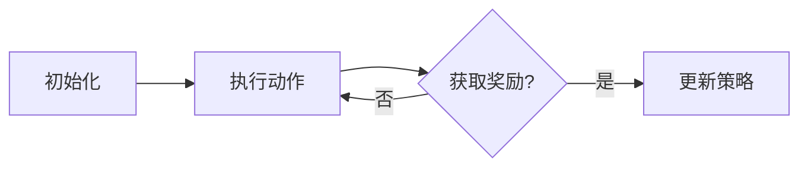
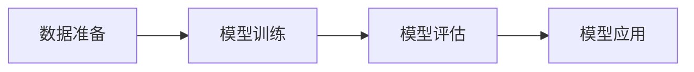
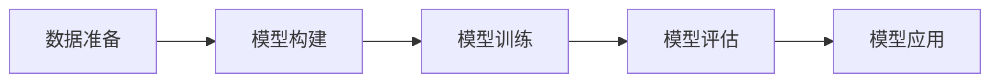

                 

### 第1章 引言

#### 1.1 研究背景

科学研究的本质是探索未知、发现规律，并在此基础上进行理论创新和实践应用。然而，随着科学领域的不断扩展和复杂性的增加，传统的研究方法面临着巨大的挑战。如何从海量数据中提取有价值的信息，如何在复杂系统中找到潜在的规律，如何在多变量情况下进行精确的预测，这些都成为了科学研究中的重要问题。

近年来，人工智能（AI）技术的飞速发展，尤其是机器学习（ML）和深度学习（DL）的突破性进展，为科学研究带来了新的机遇。AI Agent作为一种智能体，能够自主地学习、决策和执行任务，其在科学研究中的应用已经成为了一个热门研究方向。AI Agent能够处理复杂的数据，发现潜在的规律，自动化实验设计，优化决策过程，从而极大地提升科学研究的效果和效率。

AI Agent在科学研究中的应用包括但不限于以下几个领域：

- **数据预处理**：AI Agent能够自动进行数据清洗、去噪、转换和标准化，为后续的数据分析打下良好的基础。
- **模式识别**：AI Agent能够从大量数据中提取特征，进行分类和聚类，帮助科学家发现数据中的隐藏模式。
- **决策支持**：AI Agent能够根据数据分析和模型预测，为科学家提供决策支持，优化实验设计和研究策略。
- **自动化实验设计**：AI Agent能够根据实验目标和数据，自动生成实验方案，并进行实验结果分析。

AI Agent的发展和应用不仅能够提高科学研究的效率，还能够拓展科学研究的深度和广度，推动科学研究的创新发展。

#### 1.2 AI Agent的定义与分类

AI Agent，即人工智能代理，是指能够自主地感知环境、制定计划并采取行动以实现特定目标的智能系统。AI Agent具有以下几个核心特点：

- **自主性**：AI Agent能够自主地感知环境，并根据环境变化自主地调整行为。
- **适应性**：AI Agent能够通过学习适应不同的环境和任务。
- **目标导向性**：AI Agent的行为总是朝着实现特定目标的方向进行。
- **智能性**：AI Agent能够进行复杂的推理、决策和问题求解。

根据AI Agent的功能和结构，我们可以将其分为以下几类：

- **感知型AI Agent**：这类AI Agent主要功能是感知环境，通过传感器收集信息，并将这些信息传递给其他类型的AI Agent。
- **决策型AI Agent**：这类AI Agent主要功能是根据感知到的环境信息和预定的目标，进行决策和规划。
- **执行型AI Agent**：这类AI Agent主要功能是根据决策型AI Agent的决策，执行具体的操作。
- **混合型AI Agent**：这类AI Agent同时具备感知、决策和执行功能，能够自主地完成从感知到执行的全过程。

AI Agent与传统机器学习模型的区别在于，传统机器学习模型通常是被动的，需要根据给定的数据进行训练，然后进行预测或分类。而AI Agent则是主动的，能够自主地感知环境，进行决策和执行，具有更高的灵活性和适应性。

总之，AI Agent在科学研究中的应用前景广阔，能够极大地提高科学研究的效率和质量。在接下来的章节中，我们将进一步探讨AI Agent的基本概念、算法原理及其在科学研究中的应用实例。

---

**本章总结：**

本文章首先介绍了AI Agent在科学研究中的应用背景和重要性，随后详细阐述了AI Agent的定义、分类及其与传统机器学习模型的区别。通过这些背景信息的介绍，为后续章节深入探讨AI Agent的具体应用打下了坚实的基础。在下一章中，我们将进一步探讨AI Agent的基础理论和核心概念。

---

# AI Agent的定义与核心概念

AI Agent，即人工智能代理，是指一种能够自主地感知环境、制定计划并采取行动以实现特定目标的智能系统。AI Agent的核心概念包括自主性、适应性、目标导向性和智能性。以下将详细解释这些核心概念，并探讨AI Agent与传统机器学习模型的区别。

#### 自主性

自主性是AI Agent的一个重要特征。它意味着AI Agent能够独立地感知环境，无需人工干预即可执行任务。自主性使得AI Agent能够适应不断变化的环境，并能够根据环境的变化自主地调整其行为。例如，自动驾驶汽车需要能够自主感知道路情况，并实时调整驾驶策略，以确保行驶安全。

#### 适应性

适应性是指AI Agent能够通过学习适应不同的环境和任务。传统机器学习模型通常需要大量的训练数据，并且只能针对特定的任务进行优化。而AI Agent则能够通过不断学习，适应不同的环境和任务。这种适应性使得AI Agent在复杂和动态的环境中表现出更高的灵活性和鲁棒性。

#### 目标导向性

目标导向性是指AI Agent的行为总是朝着实现特定目标的方向进行。AI Agent通过目标函数来指导其行为，从而确保其行为符合预定的目标。例如，在机器人导航任务中，目标函数可以是到达目的地，AI Agent会根据当前的位置信息和目标函数，制定最优的移动策略。

#### 智能性

智能性是指AI Agent能够进行复杂的推理、决策和问题求解。AI Agent通过智能算法，如深度学习、强化学习等，来模拟人类智能，进行复杂的任务。这种智能性使得AI Agent能够处理复杂的问题，并在不确定的环境中做出合理的决策。

#### AI Agent与传统机器学习模型的区别

传统机器学习模型，如决策树、支持向量机等，通常是被动的，需要根据给定的数据进行训练，然后进行预测或分类。而AI Agent则是主动的，能够自主地感知环境，进行决策和执行。以下是一些具体区别：

- **主动性**：传统机器学习模型是静态的，只能根据输入数据做出决策。而AI Agent是动态的，能够根据环境的变化自主地调整行为。
- **适应性**：传统机器学习模型通常需要大量的训练数据，并且只能针对特定的任务进行优化。而AI Agent则能够通过不断学习，适应不同的环境和任务。
- **目标导向性**：传统机器学习模型通常没有明确的目标函数，而是通过最大化预测准确性来优化模型。而AI Agent具有明确的目标函数，其行为总是朝着实现特定目标的方向进行。
- **智能性**：传统机器学习模型通常只能进行简单的模式识别和预测，而AI Agent能够进行复杂的推理、决策和问题求解。

综上所述，AI Agent与传统机器学习模型相比，具有更高的自主性、适应性和目标导向性，能够更好地模拟人类智能，从而在复杂和动态的环境中表现出更高的灵活性和鲁棒性。这为AI Agent在科学研究中的应用提供了广阔的前景。

---

**本章总结：**

本章详细介绍了AI Agent的定义和核心概念，包括自主性、适应性、目标导向性和智能性。同时，通过与传统机器学习模型的对比，进一步阐述了AI Agent的独特优势。这些核心概念和特点为理解AI Agent在科学研究中的应用奠定了基础。在下一章中，我们将探讨AI Agent的算法原理和数学模型，并使用mermaid和Python代码进行详细讲解。

---

## 第3章 AI Agent的算法原理

AI Agent的算法原理是其核心驱动力，决定了其自主性和智能性。在本章中，我们将深入探讨AI Agent的算法原理，包括常用的算法类型、mermaid流程图描述以及Python代码实例。

#### 3.1 AI Agent算法类型

AI Agent的算法类型多样，根据其应用场景和目标的不同，可以选择不同的算法。以下是一些常用的AI Agent算法：

- **强化学习（Reinforcement Learning, RL）**：强化学习是一种通过试错来学习最优策略的算法。AI Agent通过与环境的交互，不断调整其行为，以实现最大化的回报。
- **监督学习（Supervised Learning）**：监督学习是一种基于已有数据集进行训练的算法。AI Agent通过学习这些数据集，建立预测模型，并在新数据上进行预测。
- **无监督学习（Unsupervised Learning）**：无监督学习是一种没有明确标签的数据学习算法。AI Agent通过分析未标记的数据，发现数据中的潜在结构和模式。
- **深度学习（Deep Learning）**：深度学习是一种基于人工神经网络的学习方法，通过多层神经网络对数据进行处理，实现复杂的特征提取和预测。

#### 3.2 强化学习算法原理

强化学习是一种重要的AI Agent算法，其核心思想是：通过试错学习最优策略。强化学习包括以下几个关键组件：

- **状态（State）**：AI Agent当前所处的环境状态。
- **动作（Action）**：AI Agent可以采取的行为。
- **奖励（Reward）**：AI Agent采取动作后获得的奖励，用于指导AI Agent的学习过程。
- **策略（Policy）**：AI Agent如何从当前状态选择动作的策略。

强化学习算法的基本流程如下：

1. **初始化**：设定初始状态、动作空间和策略。
2. **执行动作**：在当前状态下，根据策略选择一个动作。
3. **获取奖励**：执行动作后，根据环境的反馈获取奖励。
4. **更新策略**：根据奖励更新策略，以最大化未来的总奖励。

下面是一个简单的强化学习算法的mermaid流程图：



#### 3.3 监督学习算法原理

监督学习算法是另一种重要的AI Agent算法，其核心思想是通过学习已有的数据集，建立预测模型。监督学习算法包括以下几个关键组件：

- **输入特征（Input Features）**：输入数据的特征向量。
- **标签（Label）**：输入数据对应的标签或目标值。
- **模型（Model）**：用于预测输出标签的模型。

监督学习算法的基本流程如下：

1. **数据准备**：收集和预处理数据，将数据分为训练集和测试集。
2. **模型训练**：使用训练集数据训练模型，调整模型参数。
3. **模型评估**：使用测试集数据评估模型性能，调整模型参数。
4. **模型应用**：使用训练好的模型对新数据进行预测。

下面是一个简单的监督学习算法的mermaid流程图：



#### 3.4 深度学习算法原理

深度学习算法是监督学习的一种特殊形式，其核心思想是通过多层神经网络对数据进行处理，实现复杂的特征提取和预测。深度学习算法包括以下几个关键组件：

- **输入层（Input Layer）**：接收输入数据的层。
- **隐藏层（Hidden Layers）**：对输入数据进行处理和特征提取的层。
- **输出层（Output Layer）**：输出预测结果的层。

深度学习算法的基本流程如下：

1. **数据准备**：收集和预处理数据，将数据分为训练集和测试集。
2. **模型构建**：设计并构建神经网络模型，包括输入层、隐藏层和输出层。
3. **模型训练**：使用训练集数据训练模型，调整模型参数。
4. **模型评估**：使用测试集数据评估模型性能，调整模型参数。
5. **模型应用**：使用训练好的模型对新数据进行预测。

下面是一个简单的深度学习算法的mermaid流程图：



#### 3.5 Python代码实例

为了更好地理解上述算法原理，我们通过Python代码来具体实现这些算法。以下是一个简单的Python代码实例，展示了强化学习算法的基本实现。

```python
import numpy as np
import random

# 定义环境
class Environment:
    def __init__(self):
        self.state = 0

    def step(self, action):
        if action == 0:
            self.state += 1
        elif action == 1:
            self.state -= 1
        reward = 0
        if self.state == 10:
            reward = 1
        return self.state, reward

# 定义强化学习算法
class QLearningAgent:
    def __init__(self, alpha=0.1, gamma=0.9):
        self.alpha = alpha
        self.gamma = gamma
        self.q_values = {}

    def choose_action(self, state):
        if np.random.rand() < 0.1:
            return random.choice([0, 1])
        else:
            return np.argmax([self.q_values.get((state, action), 0) for action in [0, 1]])

    def learn(self, state, action, reward, next_state, done):
        if done:
            return
        target = reward + self.gamma * np.max([self.q_values.get((next_state, a), 0) for a in [0, 1]])
        current_q_value = self.q_values.get((state, action), 0)
        self.q_values[(state, action)] = current_q_value + self.alpha * (target - current_q_value)

# 实例化环境与智能体
env = Environment()
agent = QLearningAgent(alpha=0.1, gamma=0.9)

# 运行智能体
for episode in range(1000):
    state = env.state
    done = False
    while not done:
        action = agent.choose_action(state)
        next_state, reward = env.step(action)
        agent.learn(state, action, reward, next_state, done)
        state = next_state
        done = next_state == 10
```

通过以上Python代码实例，我们展示了如何使用强化学习算法来实现一个简单的环境互动，并更新智能体的策略。

综上所述，AI Agent的算法原理是其自主性和智能性的核心。通过深入理解强化学习、监督学习和深度学习等算法原理，我们能够更好地应用AI Agent于科学研究，提高研究的效率和质量。

---

**本章总结：**

本章详细介绍了AI Agent的算法原理，包括强化学习、监督学习和深度学习等常见算法类型。通过mermaid流程图和Python代码实例，我们深入探讨了这些算法的基本原理和应用方法。理解AI Agent的算法原理对于实际应用和优化AI Agent在科学研究中的性能至关重要。在下一章中，我们将进一步探讨AI Agent的数学模型和数学公式，并使用LaTeX进行详细讲解。

