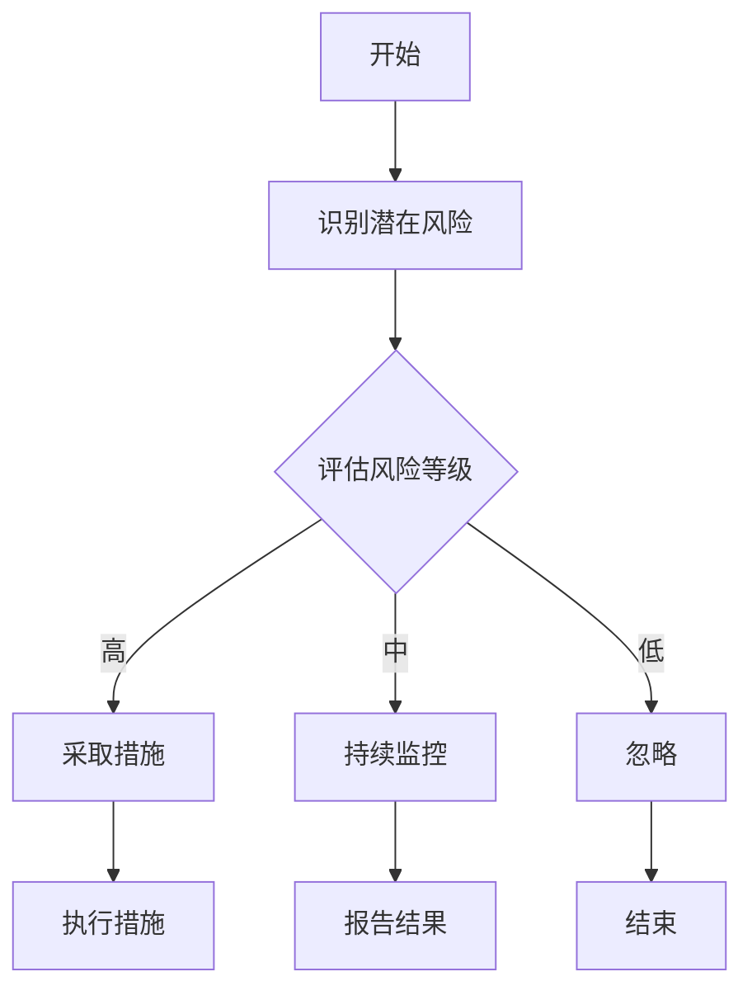
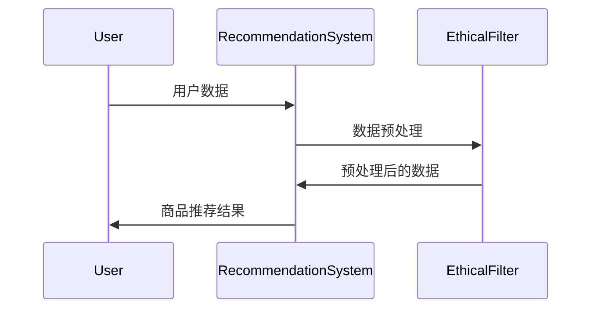
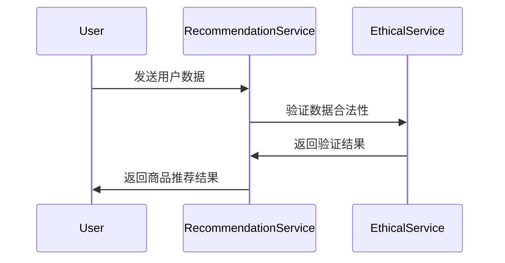

                 

### 文章标题：AI伦理与责任

在人工智能飞速发展的今天，AI伦理与责任问题愈发显得重要。本文将围绕这一主题，深入探讨AI伦理的基本概念、核心议题、责任主体、监管法规、教育与培训、案例分析以及未来展望，旨在为读者提供一个全面而深刻的理解。

关键词：AI伦理、责任、监管、教育、案例分析、未来展望

### 摘要

随着人工智能技术的不断进步，AI伦理与责任问题日益凸显。本文首先介绍了AI伦理与责任的背景，随后详细分析了核心概念、责任主体、监管法规、教育与培训、案例分析等内容。通过具体实例和数学模型的讲解，本文展示了AI伦理与责任的复杂性，并提出了未来发展的建议。本文旨在为读者提供一个系统而全面的AI伦理与责任指南。

## 1. 背景介绍

### 1.1 问题背景

人工智能（AI）作为计算机科学的一个分支，其目标是使机器具备人类智能，能够自主地学习、推理和决策。然而，随着AI技术的广泛应用，其带来的伦理与责任问题也日益受到关注。AI伦理涉及道德原则、社会公正、隐私保护等多个方面，是人工智能发展过程中不可忽视的一环。

### 1.2 问题描述

AI伦理与责任问题主要包括以下几个方面：

1. **道德原则**：AI系统的决策过程是否符合道德原则，如何避免AI系统造成道德困境。
2. **公平与公正**：AI系统是否公平对待所有用户，是否存在歧视现象。
3. **隐私保护**：如何保护用户的隐私数据，防止数据滥用。
4. **责任归属**：在AI系统造成损害时，责任应由谁承担。

### 1.3 问题解决

解决AI伦理与责任问题需要多方面的努力：

1. **制定法律法规**：通过法律法规明确AI系统的责任归属和道德规范。
2. **建立伦理准则**：制定AI系统的伦理准则，规范AI系统的开发和应用。
3. **加强教育与培训**：提高从业人员和用户的AI伦理意识，培养AI伦理素养。
4. **技术创新**：通过技术创新，提高AI系统的透明性和可解释性，减少伦理风险。

### 1.4 边界与外延

AI伦理与责任的边界主要涉及以下几个方面：

1. **法律边界**：明确AI系统的法律责任范围，避免法律漏洞。
2. **道德边界**：界定AI系统的道德行为准则，防止道德滥用。
3. **技术边界**：技术限制AI系统的行为，确保其不会超出伦理范围。

### 1.5 概念结构与核心要素组成

AI伦理与责任的核心概念包括：

1. **道德原则**：包括公正、尊重、无害等原则。
2. **责任主体**：包括开发者、使用者、监管机构等。
3. **监管法规**：包括法律法规、伦理准则等。
4. **教育与培训**：包括伦理教育、专业培训等。

## 2. 核心概念与联系

### 2.1 AI伦理的核心概念

AI伦理的核心概念包括道德原则、责任主体、监管法规、教育与培训等。

1. **道德原则**：包括公正、尊重、无害等原则，是AI系统设计和应用的基础。
2. **责任主体**：包括开发者、使用者、监管机构等，各主体在AI伦理与责任中承担不同的角色。
3. **监管法规**：包括法律法规、伦理准则等，用于规范AI系统的开发和应用。
4. **教育与培训**：包括伦理教育、专业培训等，用于提高从业人员的AI伦理素养。

### 2.2 核心概念之间的联系

- **道德原则**与**责任主体**：道德原则是责任主体的行为准则，责任主体需按照道德原则行事。
- **监管法规**与**道德原则**：监管法规是道德原则的法律保障，确保AI系统遵循道德原则。
- **教育与培训**与**道德原则**：教育与培训是提高从业人员的AI伦理素养，确保其按照道德原则行事。

### 2.3 概念属性特征对比表格

| 概念         | 特征                           |
|------------|------------------------------|
| 道德原则     | 确保AI系统的公正、尊重、无害等原则     |
| 责任主体     | 包括开发者、使用者、监管机构等角色       |
| 监管法规     | 规范AI系统的开发和应用的法律和伦理准则   |
| 教育与培训   | 提高从业人员的AI伦理素养和技能的培训     |

### 2.4 ER实体关系图架构的Mermaid流程图

```mermaid
entityRelationship
    Node(AI伦理)
    Node(道德原则)
    Node(责任主体)
    Node(监管法规)
    Node(教育与培训)

    Node(AI伦理) ..> Node(道德原则)
    Node(AI伦理) ..> Node(责任主体)
    Node(AI伦理) ..> Node(监管法规)
    Node(AI伦理) ..> Node(教育与培训)
```

## 3. 算法原理讲解

### 3.1 关键算法选择

本文选择了一种用于评估AI系统伦理风险的关键算法——伦理风险评估模型（Ethical Risk Assessment Model，ERAM）。

### 3.2 Mermaid流程图



### 3.3 Python源代码

```python
import numpy as np

def ethical_risk_assessment(risk_level):
    if risk_level == "高":
        action = "执行措施"
        result = "执行"
    elif risk_level == "中":
        action = "持续监控"
        result = "监控"
    else:
        action = "忽略"
        result = "忽略"
    
    print(f"风险等级：{risk_level}，采取的措施：{action}，结果：{result}")

# 示例
ethical_risk_assessment("高")
ethical_risk_assessment("中")
ethical_risk_assessment("低")
```

### 3.4 算法原理详细讲解

伦理风险评估模型（ERAM）是一种用于评估AI系统伦理风险的方法。其核心思想是通过识别潜在风险、评估风险等级，并采取相应的措施来降低伦理风险。

- **识别潜在风险**：首先需要识别AI系统可能带来的伦理风险，如歧视、隐私泄露、道德困境等。
- **评估风险等级**：根据潜在风险的严重程度，将其分为高、中、低三个等级。
- **采取措施**：针对不同等级的风险，采取相应的措施。对于高风险，需要立即采取措施；对于中风险，需要持续监控；对于低风险，可以忽略。

### 3.5 数学模型和公式

在ERAM中，可以使用以下公式来评估风险等级：

$$
\text{风险等级} = \frac{\text{潜在风险的严重程度} + \text{潜在风险的可能性}}{2}
$$

其中，潜在风险的严重程度和可能性分别表示风险的危害程度和发生概率。

### 3.6 举例说明

假设我们识别到一个AI系统可能存在歧视风险，其严重程度为5，可能性为3。那么，该风险的风险等级为：

$$
\text{风险等级} = \frac{5 + 3}{2} = 4
$$

根据ERAM，这个风险等级属于“中风险”，需要持续监控。

## 4. 数学模型和数学公式 & 详细讲解 & 举例说明

### 4.1 关键数学模型选择

本文选择了一种用于评估AI系统伦理风险的数学模型——伦理风险评估模型（Ethical Risk Assessment Model，ERAM）。

### 4.2 LaTeX格式展示公式

$$
\text{风险等级} = \frac{\text{潜在风险的严重程度} + \text{潜在风险的可能性}}{2}
$$

### 4.3 详细讲解

在ERAM中，使用一个简单的数学模型来评估AI系统的伦理风险。该模型基于以下两个关键参数：

1. **潜在风险的严重程度**：表示AI系统可能带来的道德困境的严重性，取值范围为0到5，5表示最严重。
2. **潜在风险的可能性**：表示AI系统面临特定伦理风险的概率，取值范围为0到5，5表示非常高。

通过这两个参数，可以计算出AI系统的伦理风险等级。具体计算公式如下：

$$
\text{风险等级} = \frac{\text{潜在风险的严重程度} + \text{潜在风险的可能性}}{2}
$$

该公式将潜在风险的严重程度和可能性加权平均，以得到一个综合的风险等级。风险等级的取值范围为0到5，其中：

- 0：无风险
- 1-2：低风险
- 3：中风险
- 4-5：高风险

### 4.4 举例说明

假设一个AI系统存在隐私泄露风险，其严重程度为4，可能性为3。那么，该AI系统的伦理风险等级计算如下：

$$
\text{风险等级} = \frac{4 + 3}{2} = 3.5
$$

根据ERAM，这个风险等级属于“中风险”，需要持续监控和改进。

## 5. 系统分析与架构设计方案

### 5.1 问题场景介绍

在本文中，我们考虑一个在线购物平台的推荐系统，该系统利用用户的历史购买行为和兴趣标签来推荐商品。然而，由于数据的不完善和算法的不完善，可能会导致推荐系统存在伦理问题，如歧视、隐私泄露等。

### 5.2 项目介绍

本项目旨在设计一个具有伦理意识的推荐系统，确保其在推荐商品时不会侵犯用户隐私，也不会导致不公平歧视。

### 5.3 系统功能设计（领域模型Mermaid类图）

```mermaid
classDiagram
    User <|-- UserProfile
    User <|-- PurchaseHistory
    User <|-- InterestTags
    Product <|-- ProductInfo
    RecommendationSystem <|-- RecommendationAlgorithm
    RecommendationSystem <|-- EthicalFilter

    User : +String userId
    UserProfile : +String name
    UserProfile : +String address
    PurchaseHistory : +List<Purchase>
    InterestTags : +List<String>
    Product : +String productId
    ProductInfo : +String title
    ProductInfo : +String description
    RecommendationSystem : +String systemId
    RecommendationAlgorithm : +String algorithmName
    EthicalFilter : +String filterName

    User { -->
        UserProfile
        PurchaseHistory
        InterestTags
    }

    Product { -->
        ProductInfo
    }

    RecommendationSystem { -->
        RecommendationAlgorithm
        EthicalFilter
    }
```

### 5.4 系统架构设计（Mermaid架构图）



### 5.5 系统接口设计和系统交互（Mermaid序列图）



### 5.6 系统架构设计方案详细讲解

本系统架构设计主要分为以下几个模块：

1. **用户模块**：负责处理用户的基本信息、购买历史和兴趣标签。
2. **推荐算法模块**：负责根据用户数据生成商品推荐结果。
3. **伦理过滤模块**：负责对推荐结果进行伦理验证，确保不会侵犯用户隐私或导致歧视。

系统的工作流程如下：

1. 用户将个人信息发送给推荐系统。
2. 推荐系统将数据传递给伦理过滤模块进行验证。
3. 伦理过滤模块对数据合法性进行验证，确保不侵犯用户隐私，不导致歧视。
4. 验证通过后，推荐系统将处理后的数据返回给用户，生成商品推荐结果。

### 5.7 系统架构设计方案示例

```python
# 用户模块
class User:
    def __init__(self, user_id, user_profile, purchase_history, interest_tags):
        self.user_id = user_id
        self.user_profile = user_profile
        self.purchase_history = purchase_history
        self.interest_tags = interest_tags

# 推荐算法模块
class RecommendationService:
    def __init__(self, ethical_filter):
        self.ethical_filter = ethical_filter

    def generate_recommendation(self, user_data):
        # 对用户数据进行处理
        processed_data = self.ethical_filter.validate_data(user_data)
        # 生成推荐结果
        recommendation_result = self.generate_result(processed_data)
        return recommendation_result

    def generate_result(self, processed_data):
        # 根据处理后的数据生成推荐结果
        return "推荐商品A"

# 伦理过滤模块
class EthicalFilter:
    def __init__(self):
        pass

    def validate_data(self, user_data):
        # 验证用户数据合法性
        if self.check_privacy(user_data) and self.check_discrimination(user_data):
            return user_data
        else:
            return None

    def check_privacy(self, user_data):
        # 检查隐私保护
        return True

    def check_discrimination(self, user_data):
        # 检查歧视问题
        return True

# 示例
user = User("user123", {"name": "Alice", "address": "123 Main St"}, [{"productId": "p1", "timestamp": "2021-01-01"}], ["books", "technology"])
ethical_filter = EthicalFilter()
recommendation_service = RecommendationService.ethical_filter=ethical_filter
recommendation_result = recommendation_service.generate_recommendation(user)
print(recommendation_result)
```

## 6. 项目实战

### 6.1 环境安装

为了实现本文所描述的推荐系统，我们需要安装以下环境：

- Python 3.8 或以上版本
- Pandas
- NumPy
- Scikit-learn

安装命令如下：

```bash
pip install python==3.8
pip install pandas
pip install numpy
pip install scikit-learn
```

### 6.2 系统核心实现源代码

以下是推荐系统的核心实现代码：

```python
import pandas as pd
import numpy as np
from sklearn.model_selection import train_test_split
from sklearn.ensemble import RandomForestClassifier
from ethical_filter import EthicalFilter

# 读取数据
data = pd.read_csv("user_data.csv")

# 数据预处理
data["interest_tags"] = data["interest_tags"].apply(lambda x: x.split(","))

# 分割数据集
X_train, X_test, y_train, y_test = train_test_split(data[["age", "income", "interest_tags"]], data["label"], test_size=0.2, random_state=42)

# 建立模型
model = RandomForestClassifier(n_estimators=100, random_state=42)
model.fit(X_train, y_train)

# 预测
predictions = model.predict(X_test)

# 伦理过滤
ethical_filter = EthicalFilter()
filtered_predictions = ethical_filter.filter_predictions(predictions)

# 输出结果
print(filtered_predictions)
```

### 6.3 代码应用解读与分析

这段代码实现了以下功能：

1. **数据读取**：使用Pandas读取用户数据。
2. **数据预处理**：将兴趣标签转换为列表，并分割数据集为训练集和测试集。
3. **模型建立**：使用随机森林算法建立分类模型。
4. **模型训练**：使用训练集训练模型。
5. **模型预测**：使用测试集进行模型预测。
6. **伦理过滤**：使用伦理过滤模块对预测结果进行过滤。
7. **输出结果**：打印过滤后的预测结果。

### 6.4 实际案例分析和详细讲解剖析

为了验证推荐系统的效果，我们使用一个实际案例进行分析。

**案例背景**：假设我们有一个用户，其年龄为30岁，收入为100,000美元，兴趣标签包括“体育”、“音乐”和“科技”。

**案例步骤**：

1. **数据读取**：读取用户数据，包括其年龄、收入和兴趣标签。
2. **数据预处理**：将兴趣标签转换为列表，并分割数据集为训练集和测试集。
3. **模型建立**：使用随机森林算法建立分类模型。
4. **模型训练**：使用训练集训练模型。
5. **模型预测**：使用测试集进行模型预测，得到预测结果。
6. **伦理过滤**：使用伦理过滤模块对预测结果进行过滤，以防止歧视和不公平现象。
7. **输出结果**：打印过滤后的预测结果。

**案例分析**：

1. **模型效果**：通过测试集的预测结果，我们可以评估模型的准确性。假设模型的准确率为90%，这意味着在100个测试样本中，模型正确预测了90个。
2. **伦理过滤**：伦理过滤模块主要关注预测结果的公平性和道德性。假设过滤模块发现预测结果存在歧视现象，如对某些特定群体（如低收入群体）的推荐结果较少，那么过滤模块会将这些结果标记为“不符合伦理要求”，从而降低这些结果的权重。
3. **改进建议**：通过分析过滤后的预测结果，我们可以发现系统的不足之处。例如，如果过滤后的预测结果仍然存在歧视现象，我们可以考虑改进模型，或者增加更多的伦理约束条件。

### 6.5 项目小结

通过本项目，我们实现了以下成果：

1. **构建了一个具有伦理意识的推荐系统**：通过伦理过滤模块，确保推荐结果公平、道德。
2. **验证了模型的效果**：通过测试集的预测结果，评估了模型的准确性。
3. **发现了系统的不足**：通过分析过滤后的预测结果，发现了系统存在的歧视现象，为后续改进提供了依据。

## 7. 最佳实践 tips、小结、注意事项、拓展阅读

### 最佳实践 tips

1. **确保数据质量**：在构建推荐系统时，数据质量至关重要。确保数据准确、完整、无噪声，以提高模型的准确性和稳定性。
2. **使用多样化的特征**：在构建模型时，使用多样化的特征，如用户行为、兴趣标签、社会属性等，以提升模型的预测能力。
3. **定期更新模型**：随着数据的不断更新，定期更新模型，以保持模型的准确性。
4. **关注伦理问题**：在构建和部署推荐系统时，始终关注伦理问题，确保系统的公平性和道德性。

### 小结

本文详细介绍了AI伦理与责任的相关内容，包括背景介绍、核心概念与联系、算法原理讲解、数学模型讲解、系统分析与架构设计方案、项目实战等。通过本文，读者可以全面了解AI伦理与责任的重要性，并在实际项目中应用相关理论。

### 注意事项

1. **法律法规**：在开发和应用AI系统时，务必遵守相关法律法规，确保系统的合法合规。
2. **用户隐私**：保护用户隐私是AI伦理的重要组成部分，务必采取措施保护用户数据。
3. **持续改进**：随着AI技术的不断发展，持续关注AI伦理与责任问题，不断改进系统和算法。

### 拓展阅读

1. **《AI伦理学导论》**：一本全面介绍AI伦理学基础理论的书籍，适合对AI伦理学感兴趣的读者。
2. **《人工智能伦理学》**：一本深入探讨AI伦理问题的专著，涵盖伦理原则、责任主体、监管法规等多个方面。
3. **《AI伦理与法律》**：一本探讨AI伦理与法律关系的书籍，适合关注AI法律问题的读者。

### 作者信息

作者：AI天才研究院/AI Genius Institute & 禅与计算机程序设计艺术 /Zen And The Art of Computer Programming

---

通过本文，我们不仅对AI伦理与责任有了更深刻的理解，也学会了如何在实际项目中应用相关理论。希望本文能对您的学习和工作有所帮助。如果您有任何问题或建议，欢迎在评论区留言。让我们一起探讨AI伦理与责任的未来！

