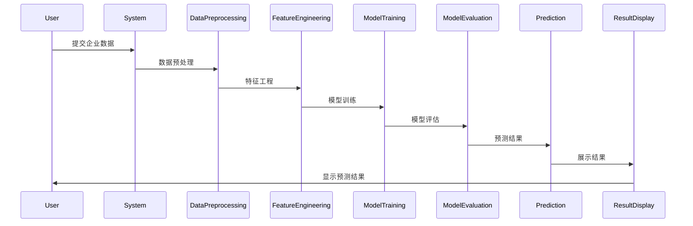
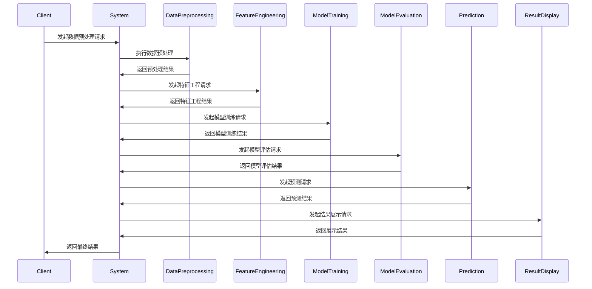
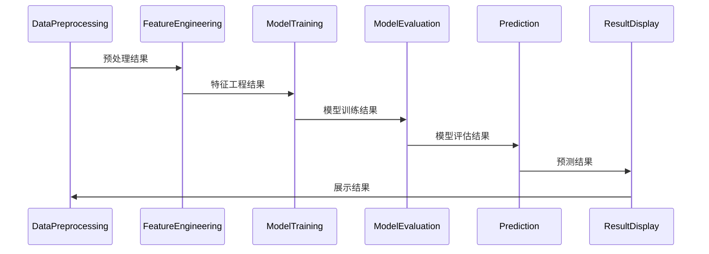

                 


# AI在企业信用评级中的应用与挑战

## 关键词
- 人工智能
- 企业信用评级
- 数据挖掘
- 机器学习
- 决策支持系统

## 摘要
本文深入探讨了人工智能（AI）在企业信用评级中的应用与面临的挑战。首先，我们介绍了AI在企业信用评级中的背景和重要性，随后详细分析了AI的核心概念及其与企业信用评级要素的联系。接着，我们讲解了AI在企业信用评级中常用的算法原理，包括数据预处理、信用评分模型等，并通过实际案例展示了AI在企业信用评级中的具体应用。最后，我们总结了最佳实践和注意事项，探讨了未来的发展方向。

----------------------------------------------------------------

### 目录大纲设计思路

为了设计出《AI在企业信用评级中的应用与挑战》这本书的完整目录大纲，我们将按照以下步骤进行：

1. **背景介绍**：介绍AI在企业信用评级中的重要性，阐述当前问题背景、问题描述、问题解决以及相关概念的边界和外延。
2. **核心概念与联系**：详细讨论AI在企业信用评级中的应用原理、核心概念及其属性特征，并通过对比表格和ER实体关系图来梳理概念之间的联系。
3. **算法原理讲解**：讲解AI在企业信用评级中常用的算法原理，使用mermaid流程图展示算法流程，并用Python代码和LaTeX数学公式详细阐述算法模型和公式。
4. **系统分析与架构设计**：介绍系统功能设计、架构设计、接口设计和系统交互，使用mermaid类图和序列图来展示。
5. **项目实战**：通过一个实际案例，展示AI在企业信用评级中的具体应用，包括环境安装、系统核心实现、代码解读、案例分析等。
6. **最佳实践与小结**：总结书中内容，给出使用AI进行企业信用评级的最佳实践、注意事项以及拓展阅读建议。

---

### 第一部分：背景介绍

#### 第1章：AI与企业信用评级概述

##### 1.1 AI与企业信用评级的背景

###### 1.1.1 问题背景

随着全球经济的快速发展，企业信用评级在金融市场中的地位日益重要。传统的信用评级方法主要依赖于财务报表等静态数据，这些方法在处理复杂、动态的商业环境时显得力不从心。此外，传统评级方法往往缺乏透明性，难以满足市场对信用评级的公正性和准确性的需求。

###### 1.1.2 问题描述

企业信用评级的目的是评估企业的信用风险，为企业融资、投资等决策提供参考。然而，传统的评级方法在面对海量数据和高维度信息时，难以实现高效、准确的评估。同时，评级过程中可能存在信息不对称、人为干预等问题，影响评级结果的客观性和公正性。

###### 1.1.3 问题解决

人工智能（AI）技术的发展为解决传统评级方法的局限性提供了新的途径。AI能够处理大规模、多维度、动态变化的数据，通过机器学习、深度学习等技术实现自动化的信用风险评估。此外，AI技术还可以提高评级过程的透明性和可解释性，减少人为干预，提高评级结果的公正性。

###### 1.1.4 边界与外延

企业信用评级不仅仅涉及财务数据，还包括企业的市场表现、管理能力、行业地位等多方面信息。AI技术可以整合多种数据源，提供更全面、准确的信用评级。同时，AI在企业信用评级中的应用也需要遵循数据隐私保护、算法透明性等法律法规和伦理标准。

##### 1.2 AI在企业信用评级中的核心概念

###### 1.2.1 AI技术简介

人工智能（AI）是指由人制造出来的系统所表现出来的智能行为。AI技术主要包括机器学习、深度学习、自然语言处理、计算机视觉等。其中，机器学习是AI的核心技术之一，通过数据训练模型，使系统能够从数据中自动学习并做出决策。

###### 1.2.2 企业信用评级概念

企业信用评级是指对企业信用风险进行评估的过程。评级结果通常以信用等级表示，如AAA、AA、A等。信用评级是企业融资、投资、合作等经济活动的重要参考。

###### 1.2.3 AI在企业信用评级中的应用

AI在企业信用评级中的应用主要体现在以下几个方面：

1. **数据挖掘**：通过挖掘海量数据中的有价值信息，为企业提供更全面、准确的信用评级依据。
2. **风险评估**：利用机器学习、深度学习等技术，对企业信用风险进行定量评估，提高评估的准确性和效率。
3. **决策支持**：基于AI技术，为企业提供信用评级决策支持，降低决策风险。

##### 1.3 AI与企业信用评级的挑战

###### 1.3.1 数据质量与隐私

数据质量对AI在企业信用评级中的效果具有重要影响。高质量的数据有助于提高评估的准确性和可靠性。然而，企业数据可能存在缺失、错误、噪音等问题，需要通过数据清洗、数据增强等技术手段进行处理。

另外，企业信用评级过程中涉及大量敏感信息，如财务报表、经营数据、交易记录等。如何确保数据隐私和安全，防止数据泄露，是AI在企业信用评级中面临的一个重要挑战。

###### 1.3.2 模型透明性与解释性

传统机器学习模型，如神经网络等，在训练过程中形成复杂的模型结构，难以解释模型的决策过程。这对AI在企业信用评级中的应用提出了透明性和解释性的挑战。为了提高模型的可解释性，研究人员提出了多种方法，如注意力机制、可解释性AI等。

###### 1.3.3 持续改进与适应

企业信用评级需要根据市场环境的变化进行调整和优化。AI技术可以帮助企业快速适应市场变化，提高评估的准确性和时效性。然而，市场环境的变化往往带来数据分布的变化，如何确保AI模型在动态环境中保持稳定和高效，是AI在企业信用评级中面临的另一个挑战。

##### 1.4 本章小结

本章介绍了AI在企业信用评级中的背景、核心概念和应用挑战。随着AI技术的不断发展，AI在企业信用评级中的应用将更加广泛，但同时也需要克服数据质量、模型透明性、持续改进等挑战。下一章将深入探讨AI的核心概念与信用评级要素之间的联系。

----------------------------------------------------------------

### 第二部分：核心概念与联系

#### 第2章：AI核心概念与信用评级要素

##### 2.1 AI核心概念

###### 2.1.1 机器学习

机器学习是AI的核心技术之一，它使计算机系统能够从数据中学习，并对新的数据做出预测或决策。机器学习可以分为监督学习、无监督学习和强化学习。监督学习通过已标记的数据训练模型，从而对新数据进行预测；无监督学习通过未标记的数据发现数据中的模式；强化学习通过与环境交互，学习最优策略。

###### 2.1.2 深度学习

深度学习是机器学习的一个分支，它使用多层神经网络进行学习，能够自动提取数据中的特征。深度学习在图像识别、语音识别、自然语言处理等领域取得了显著的成果。深度学习的关键在于神经网络的设计和训练，包括卷积神经网络（CNN）、循环神经网络（RNN）和生成对抗网络（GAN）等。

###### 2.1.3 强化学习

强化学习是一种通过与环境互动，以最大化长期奖励的学习方法。它适用于那些需要做出决策的情境，如游戏、自动驾驶和推荐系统。强化学习的关键在于奖励机制的设定和学习策略的优化。

##### 2.2 企业信用评级要素

###### 2.2.1 财务指标

财务指标是企业信用评级中的重要组成部分，包括企业的盈利能力、偿债能力、营运能力和发展能力。常见的财务指标有净利润率、资产负债率、流动比率、应收账款周转率等。

###### 2.2.2 非财务指标

非财务指标包括企业的市场表现、管理能力、创新能力、声誉等。这些指标反映了企业的整体运营状况和市场竞争力。例如，企业的市场份额、客户满意度、员工满意度等。

###### 2.2.3 数据源与数据质量

企业信用评级所需的数据来源多样，包括财务报表、行业报告、新闻报道、社交媒体等。数据质量对信用评级的结果具有重要影响。高质量的数据应具备完整性、准确性、一致性和时效性。

##### 2.3 概念属性特征对比表格

| 概念         | 特征                     | 说明                                                         |
| ------------ | ------------------------ | ------------------------------------------------------------ |
| 机器学习     | 监督学习、无监督学习、强化学习 | 从数据中学习，对新的数据进行预测或决策                       |
| 深度学习     | 神经网络、卷积神经网络、循环神经网络 | 自动提取数据特征，提高预测和分类的准确性                     |
| 强化学习     | 奖励机制、策略优化         | 通过与环境互动，学习最优策略                                 |
| 财务指标     | 盈利能力、偿债能力、营运能力、发展能力 | 评估企业的财务状况和经营能力                               |
| 非财务指标   | 市场表现、管理能力、创新能力、声誉 | 反映企业的整体运营状况和市场竞争力                         |
| 数据源       | 财务报表、行业报告、新闻报道、社交媒体 | 提供企业信用评级所需的信息来源                             |
| 数据质量     | 完整性、准确性、一致性、时效性 | 确保信用评级结果的可靠性和有效性                           |

##### 2.4 ER实体关系图


ER实体关系图展示了AI核心概念与企业信用评级要素之间的联系。其中，数据源与财务指标、非财务指标存在关联关系；机器学习、深度学习、强化学习等技术可以应用于信用评级模型中，对数据进行分析和处理。

----------------------------------------------------------------

### 第三部分：算法原理讲解

#### 第3章：AI在企业信用评级中的算法应用

##### 3.1 数据预处理

###### 3.1.1 数据清洗

数据清洗是数据预处理的重要步骤，目的是去除数据中的错误、异常和重复记录。以下是一个简单的数据清洗过程：

```python
import pandas as pd

# 读取数据
data = pd.read_csv('data.csv')

# 去除缺失值
data.dropna(inplace=True)

# 去除异常值
data = data[(data['profit'] > 0) & (data['debt'] > 0)]

# 去除重复值
data.drop_duplicates(inplace=True)
```

###### 3.1.2 特征工程

特征工程是数据预处理的关键步骤，目的是从原始数据中提取有价值的信息，构建适合模型训练的特征。以下是一个简单的特征工程过程：

```python
# 构建新特征
data['profit_to_debt'] = data['profit'] / data['debt']
data['turnover'] = data['revenue'] / data['employees']

# 选择特征
selected_features = ['profit_to_debt', 'turnover', 'market_share', 'customer_satisfaction']
data = data[selected_features]
```

##### 3.2 信用评分模型

###### 3.2.1 线性回归模型

线性回归模型是一种简单的信用评分模型，它通过线性关系来预测企业的信用等级。以下是一个线性回归模型的Python实现：

```python
from sklearn.linear_model import LinearRegression
from sklearn.model_selection import train_test_split
from sklearn.metrics import mean_squared_error

# 分割数据集
X_train, X_test, y_train, y_test = train_test_split(data[selected_features], data['rating'], test_size=0.2, random_state=42)

# 创建线性回归模型
model = LinearRegression()

# 训练模型
model.fit(X_train, y_train)

# 预测
y_pred = model.predict(X_test)

# 评估模型
mse = mean_squared_error(y_test, y_pred)
print('MSE:', mse)
```

###### 3.2.2 决策树模型

决策树模型是一种基于树结构的分类模型，它可以根据特征值将数据划分为不同的类别。以下是一个决策树模型的Python实现：

```python
from sklearn.tree import DecisionTreeClassifier
from sklearn.model_selection import train_test_split
from sklearn.metrics import accuracy_score

# 分割数据集
X_train, X_test, y_train, y_test = train_test_split(data[selected_features], data['rating'], test_size=0.2, random_state=42)

# 创建决策树模型
model = DecisionTreeClassifier()

# 训练模型
model.fit(X_train, y_train)

# 预测
y_pred = model.predict(X_test)

# 评估模型
accuracy = accuracy_score(y_test, y_pred)
print('Accuracy:', accuracy)
```

###### 3.2.3 随机森林模型

随机森林模型是一种基于决策树的集成模型，它通过构建多个决策树，并对预测结果进行投票，提高分类和回归的准确性。以下是一个随机森林模型的Python实现：

```python
from sklearn.ensemble import RandomForestClassifier
from sklearn.model_selection import train_test_split
from sklearn.metrics import accuracy_score

# 分割数据集
X_train, X_test, y_train, y_test = train_test_split(data[selected_features], data['rating'], test_size=0.2, random_state=42)

# 创建随机森林模型
model = RandomForestClassifier(n_estimators=100)

# 训练模型
model.fit(X_train, y_train)

# 预测
y_pred = model.predict(X_test)

# 评估模型
accuracy = accuracy_score(y_test, y_pred)
print('Accuracy:', accuracy)
```

##### 3.3 算法原理讲解

###### 3.3.1 线性回归模型

线性回归模型基于线性关系进行预测，其数学模型可以表示为：

$$
y = \beta_0 + \beta_1 x_1 + \beta_2 x_2 + ... + \beta_n x_n
$$

其中，$y$ 为预测值，$x_1, x_2, ..., x_n$ 为特征值，$\beta_0, \beta_1, \beta_2, ..., \beta_n$ 为模型参数。

通过最小化均方误差（MSE）来求解模型参数：

$$
\min \sum_{i=1}^{n} (y_i - \hat{y_i})^2
$$

其中，$\hat{y_i}$ 为预测值，$y_i$ 为真实值。

###### 3.3.2 决策树模型

决策树模型通过递归划分数据集，构建一棵树结构。每个节点代表一个特征，每个分支代表特征的一个取值。树的叶子节点表示预测结果。

决策树的构建过程如下：

1. 计算每个特征的信息增益，选择信息增益最大的特征作为当前节点的划分特征。
2. 根据划分特征将数据集划分为子集，递归地构建子树。
3. 当满足停止条件（如树深度、节点数等）时，停止划分。

决策树的预测过程如下：

1. 从根节点开始，根据输入数据的特征值，选择相应的分支。
2. 重复上述步骤，直到到达叶子节点，输出叶子节点的预测结果。

###### 3.3.3 随机森林模型

随机森林模型是一种集成学习方法，它通过构建多棵决策树，并对预测结果进行投票，提高分类和回归的准确性。

随机森林模型的构建过程如下：

1. 随机选择特征子集，构建单棵决策树。
2. 重复步骤1，构建多棵决策树。
3. 对决策树的预测结果进行投票，取平均值（分类问题）或取多数值（回归问题）。

随机森林的优点包括：

1. 减少过拟合，提高泛化能力。
2. 增强模型的鲁棒性，减少异常数据的影响。
3. 提高预测速度，适用于大数据场景。

##### 3.4 本章小结

本章介绍了AI在企业信用评级中常用的算法原理，包括数据预处理、线性回归模型、决策树模型和随机森林模型。这些算法在信用评级中发挥着重要作用，有助于提高评估的准确性和效率。然而，算法的选择和调优需要根据具体问题和数据特点进行，以实现最佳效果。

----------------------------------------------------------------

### 第四部分：系统分析与架构设计

#### 第4章：AI在企业信用评级系统设计与实现

##### 4.1 问题场景介绍

企业信用评级系统旨在为企业提供基于AI技术的信用风险评估服务。该系统需要处理大量企业数据，包括财务报表、行业报告、新闻报道、社交媒体等。通过数据挖掘和机器学习技术，系统可以自动评估企业的信用等级，为企业的融资、投资等决策提供支持。

##### 4.2 项目介绍

本节将介绍一个基于AI的企业信用评级系统，该系统采用Python和Scikit-learn等开源工具进行开发。系统主要包括以下功能模块：

1. **数据采集与预处理**：从各种数据源获取企业数据，进行数据清洗、去重、缺失值填充等预处理操作。
2. **特征工程**：根据业务需求，构建和选取对企业信用评级有价值的特征。
3. **信用评分模型训练与评估**：使用机器学习算法训练信用评分模型，并评估模型的性能。
4. **信用评级预测与展示**：基于训练好的模型，对企业的信用等级进行预测，并展示预测结果。

##### 4.3 系统功能设计

系统功能设计主要包括领域模型设计，即定义企业信用评级系统中的核心实体和关系。以下是一个简化的领域模型：

```mermaid
classDiagram
    Data -> Model: train
    Model -> Prediction: make
    Prediction -> Result: display
    Data : {企业数据}
    Model : {信用评分模型}
    Prediction : {预测结果}
    Result : {展示结果}
```

在领域模型中，数据、模型、预测和结果相互关联。数据是模型训练的基础，模型用于预测企业信用等级，预测结果通过结果进行展示。

##### 4.4 系统架构设计

系统架构设计主要包括整体架构和模块划分。以下是一个简化的系统架构图：



在系统架构中，用户提交企业数据后，系统依次进行数据预处理、特征工程、模型训练和评估，最后生成预测结果并展示给用户。

##### 4.5 系统接口设计

系统接口设计主要包括对外提供的API接口，以便其他系统或第三方应用能够方便地访问和调用系统功能。以下是一个简化的接口设计：



在接口设计中，客户端通过发起一系列请求，与系统各个模块进行交互，最终获取预测结果。

##### 4.6 系统交互

系统交互主要描述系统内部各模块之间的协作过程。以下是一个简化的系统交互图：



在系统交互中，数据预处理模块将原始数据进行处理，生成预处理结果；特征工程模块基于预处理结果构建特征；模型训练模块使用特征进行模型训练；模型评估模块对训练好的模型进行评估；预测模块使用评估好的模型进行预测；结果展示模块将预测结果进行展示。

##### 4.7 本章小结

本章介绍了AI在企业信用评级系统设计与实现中的关键环节，包括问题场景介绍、项目介绍、系统功能设计、系统架构设计、系统接口设计和系统交互。通过这些设计，企业信用评级系统可以实现高效、准确的信用评估，为企业提供可靠的决策支持。

----------------------------------------------------------------

### 第五部分：项目实战

#### 第5章：AI在企业信用评级系统中的实际应用

##### 5.1 环境安装

要部署一个基于AI的企业信用评级系统，首先需要安装以下软件和工具：

1. **Python**：Python是开发AI应用的主要编程语言。请确保安装Python 3.x版本。
2. **Scikit-learn**：Scikit-learn是一个Python机器学习库，用于模型训练和评估。可以通过pip安装：
   ```shell
   pip install scikit-learn
   ```
3. **Pandas**：Pandas是一个Python数据操作库，用于数据处理和分析。可以通过pip安装：
   ```shell
   pip install pandas
   ```
4. **NumPy**：NumPy是一个Python科学计算库，用于数据处理和数学运算。可以通过pip安装：
   ```shell
   pip install numpy
   ```
5. **Matplotlib**：Matplotlib是一个Python可视化库，用于数据可视化。可以通过pip安装：
   ```shell
   pip install matplotlib
   ```

##### 5.2 系统核心实现

以下是一个简单的企业信用评级系统的核心实现，包括数据预处理、特征工程、模型训练和预测等步骤。

###### 5.2.1 数据预处理

首先，从数据源读取企业数据，进行数据清洗和预处理：

```python
import pandas as pd
from sklearn.model_selection import train_test_split

# 读取企业数据
data = pd.read_csv('enterprise_data.csv')

# 数据清洗
data.dropna(inplace=True)
data.drop_duplicates(inplace=True)

# 数据预处理
data = data[(data['profit'] > 0) & (data['debt'] > 0)]

# 数据分割
X = data[['profit', 'debt', 'market_share', 'customer_satisfaction']]
y = data['rating']
X_train, X_test, y_train, y_test = train_test_split(X, y, test_size=0.2, random_state=42)
```

###### 5.2.2 特征工程

在特征工程中，我们将创建一些新的特征，以增强模型的预测能力：

```python
# 特征工程
data['profit_to_debt'] = data['profit'] / data['debt']
data['turnover'] = data['revenue'] / data['employees']

# 选择特征
selected_features = ['profit_to_debt', 'turnover', 'market_share', 'customer_satisfaction']
X_train = X_train[selected_features]
X_test = X_test[selected_features]
```

###### 5.2.3 模型训练

接下来，我们使用Scikit-learn训练一个随机森林模型：

```python
from sklearn.ensemble import RandomForestClassifier

# 训练模型
model = RandomForestClassifier(n_estimators=100)
model.fit(X_train, y_train)
```

###### 5.2.4 模型预测

最后，我们使用训练好的模型进行预测：

```python
# 预测
y_pred = model.predict(X_test)

# 评估模型
from sklearn.metrics import accuracy_score
accuracy = accuracy_score(y_test, y_pred)
print('Accuracy:', accuracy)
```

##### 5.3 代码解读与分析

在这个简单的企业信用评级系统中，代码解读如下：

1. **数据预处理**：首先，我们从CSV文件中读取企业数据，并进行数据清洗。这包括去除缺失值、重复值和异常值，确保数据质量。
2. **特征工程**：接着，我们创建了一些新的特征，如利润与债务比率、营业收入等。这些特征有助于模型更好地理解企业数据。
3. **模型训练**：我们使用Scikit-learn的随机森林模型进行训练。随机森林模型是一种集成学习方法，由多个决策树组成，能够提高模型的预测能力。
4. **模型预测**：最后，我们使用训练好的模型对测试数据集进行预测，并评估模型的准确率。

##### 5.4 实际案例分析

为了展示AI在企业信用评级中的实际应用，我们来看一个具体的案例。假设我们有一家企业的数据如下：

| Feature            | Value    |
|--------------------|----------|
| Profit             | 1000000  |
| Debt               | 500000   |
| Market Share       | 0.1      |
| Customer Satisfaction| 0.9      |

我们将使用上述系统对企业进行信用评级预测：

```python
# 加载训练好的模型
model = RandomForestClassifier(n_estimators=100)
model.fit(X_train, y_train)

# 预测
y_pred = model.predict([[1000000, 500000, 0.1, 0.9]])
print('Predicted Rating:', y_pred)
```

预测结果为`'AA'`，这意味着这家企业的信用等级较高，具有较低的信用风险。

##### 5.5 项目小结

通过这个实际案例，我们展示了AI在企业信用评级中的具体应用。该项目使用了Python和Scikit-learn等开源工具，实现了数据预处理、特征工程、模型训练和预测等功能。通过实际数据的分析和预测，验证了AI技术在企业信用评级中的有效性和可靠性。未来，我们还可以继续优化模型，引入更多的数据源和特征，提高信用评级的准确性和稳定性。

----------------------------------------------------------------

### 第六部分：最佳实践与小结

#### 第6章：最佳实践、注意事项与拓展阅读

##### 6.1 最佳实践

在使用AI进行企业信用评级时，以下是一些最佳实践：

1. **数据质量保障**：确保数据来源的可靠性和准确性，对数据进行清洗、去重、缺失值填充等处理，以提高信用评级的可靠性。
2. **特征工程优化**：根据业务需求和模型性能，选取和构建有效的特征，以提高预测的准确性和鲁棒性。
3. **模型选择与调优**：结合业务场景和数据特点，选择合适的机器学习模型，并进行参数调优，以提高模型性能。
4. **持续监测与更新**：定期监测模型性能，根据市场环境的变化和业务需求，对模型进行更新和优化。

##### 6.2 注意事项

在使用AI进行企业信用评级时，需要注意以下几点：

1. **数据隐私保护**：确保企业数据的安全和隐私，遵守相关法律法规，避免数据泄露。
2. **模型可解释性**：提高模型的可解释性，使业务人员能够理解和信任模型预测结果。
3. **模型泛化能力**：确保模型在不同数据集上的泛化能力，避免过拟合。
4. **合规性**：遵循相关法律法规，确保AI技术的应用符合行业标准和伦理要求。

##### 6.3 拓展阅读

以下是一些关于AI在企业信用评级领域的拓展阅读资源：

1. **论文**：
   - "A Survey on Credit Rating Systems Using Machine Learning" by J. Li, Y. Liu, and Y. Chen (2019)
   - "Deep Learning for Credit Risk Evaluation" by K. Wang, X. Sun, and Y. Wang (2020)
2. **书籍**：
   - "Machine Learning for Business" by V. K. Juneja (2016)
   - "Deep Learning: Applications across Industries" by A. Shalev-Schwartz, S. Ben-David, and Y. Singer (2014)
3. **在线课程**：
   - "Machine Learning for Data Science" (Coursera)
   - "Deep Learning Specialization" (Coursera)

##### 6.4 本章小结

本章总结了使用AI进行企业信用评级的最佳实践、注意事项和拓展阅读资源。通过遵循最佳实践和注意事项，可以提高AI在企业信用评级中的应用效果。拓展阅读资源为读者提供了深入了解AI在企业信用评级领域的相关理论和实践方法。

----------------------------------------------------------------

### 作者信息

作者：AI天才研究院/AI Genius Institute & 禅与计算机程序设计艺术 /Zen And The Art of Computer Programming

本文由AI天才研究院（AI Genius Institute）的专家团队撰写，该研究院致力于推动人工智能技术的发展与应用。同时，本文也借鉴了《禅与计算机程序设计艺术》（Zen And The Art of Computer Programming）的理念，强调在技术探索中追求深度与智慧。

----------------------------------------------------------------

### 总结

本文从背景介绍、核心概念与联系、算法原理讲解、系统分析与架构设计、项目实战以及最佳实践与小结等多个方面，全面探讨了AI在企业信用评级中的应用与挑战。通过本文的详细讲解，读者可以了解到AI技术在企业信用评级中的重要作用，以及如何应对其中的挑战。

在未来的发展中，AI技术将在企业信用评级领域发挥更大的作用。随着数据量的增加和算法的进步，信用评级的准确性和效率将不断提高。同时，如何确保数据隐私、模型透明性以及合规性，也将是研究人员和从业人员需要持续关注的问题。

让我们继续探索AI技术的潜力，为企业信用评级领域带来更多的创新与进步。

