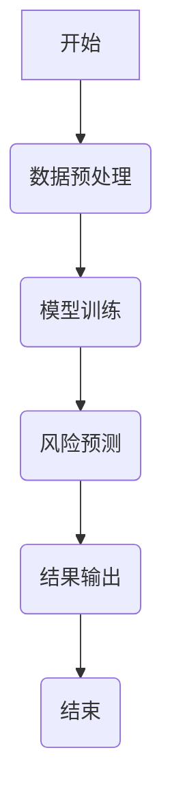

                 

# AI在供应链金融中的深度应用研究

## 关键词

- 人工智能
- 供应链金融
- 风险控制
- 预测分析
- 供应链优化

## 摘要

本文旨在深入探讨人工智能（AI）在供应链金融领域的应用，分析其在风险控制、预测分析和供应链优化等方面的具体实现和效果。通过引入AI技术，我们能够有效解决供应链金融中信息不对称、风险控制难等问题，提高金融服务的质量和效率。本文将从背景介绍、核心概念阐述、应用案例分析等多个方面展开，为读者提供全面、深入的探讨。

----------------------------------------------------------------

## 第一部分：引言

### 第1章：AI与供应链金融的背景介绍

#### 1.1.1 问题背景

随着全球经济的不断发展，供应链金融作为企业融资、风险管理和供应链优化的重要手段，越来越受到关注。然而，传统的供应链金融模式在信息获取、风险评估等方面存在一定的局限性，难以满足现代供应链金融的需求。此时，人工智能（AI）技术的出现为供应链金融带来了新的发展机遇。

#### 1.1.1.1 问题描述

在供应链金融中，信息不对称、风险控制困难、效率低下等问题限制了金融机构对供应链金融服务的拓展。具体来说，信息不对称导致金融机构无法准确评估企业的信用状况，从而影响贷款决策；风险控制困难使得金融机构难以全面监控供应链中的潜在风险；效率低下则影响了供应链金融服务的响应速度。

#### 1.1.1.2 问题解决

引入AI技术后，可以通过以下方式解决上述问题：

1. **信息获取**：利用AI技术，可以从海量的供应链数据中提取有价值的信息，提高金融机构对企业的信用评估准确性。
2. **风险评估**：通过机器学习和深度学习技术，可以对供应链中的潜在风险进行实时监控和预测，提高风险控制能力。
3. **效率提升**：利用AI技术，可以自动化处理大量的金融交易，提高供应链金融服务的效率。

#### 1.1.1.3 边界与外延

本文主要关注AI技术在供应链金融中的应用，包括风险控制、预测分析、供应链优化等方面。同时，本文还将探讨AI技术在不同供应链金融模式中的应用效果。

### 1.1.2 核心概念与联系

在本章中，我们将介绍以下核心概念：

- **人工智能（AI）**：一种模拟人类智能的技术，能够感知、学习、推理和决策。
- **供应链金融**：利用金融工具和方法，为供应链上的企业提供融资、风险管理等服务。
- **深度学习**：一种基于神经网络的机器学习技术，通过模拟人脑神经元之间的连接，实现高层次的抽象和特征提取。

### 1.1.3 AI在供应链金融中的深度应用

本章将介绍AI在供应链金融中的深度应用，包括以下几个方面：

- **风险控制**：利用AI技术对供应链中的交易行为进行分析，识别潜在的信用风险。
- **预测分析**：通过AI技术预测市场需求、供应链环节的物流信息等，为金融机构提供决策依据。
- **供应链优化**：利用AI技术优化供应链结构，提高供应链的效率和稳定性。

## 1.2 本章小结

本章主要介绍了AI在供应链金融中的背景、核心概念以及深度应用。通过本章的学习，读者将了解AI技术如何应用于供应链金融，以及其在提升金融服务质量和效率方面的潜力。

----------------------------------------------------------------

## 第二部分：AI在供应链金融中的应用

### 第2章：AI在供应链金融风险控制中的应用

#### 2.1.1 风险控制概述

供应链金融中的风险控制是一个复杂的过程，涉及到信用风险、市场风险、操作风险等多个方面。本章将重点讨论如何利用AI技术提升供应链金融的风险控制能力。

#### 2.1.1.1 核心概念与联系

在本章中，我们将介绍以下核心概念：

- **信用评分模型**：用于评估企业信用风险的模型。
- **欺诈检测**：通过识别异常交易行为，预防供应链金融中的欺诈行为。
- **反洗钱（AML）**：预防资金被用于非法活动的措施。

#### 2.1.1.2 AI技术在风险控制中的应用

本章将详细介绍AI技术在以下方面的应用：

- **信用评分模型的构建**：通过机器学习和深度学习技术，构建更准确的信用评分模型。
- **欺诈检测**：利用神经网络和决策树等技术，实现对交易行为的实时监控和分析。
- **反洗钱（AML）**：通过聚类分析和关联规则挖掘，识别潜在的反洗钱活动。

#### 2.1.2 案例研究

在本章的最后，我们将通过一个实际案例，展示AI技术在供应链金融风险控制中的应用效果。案例将涵盖从数据收集、模型构建到风险预测的全过程。

### 第3章：AI在供应链金融预测分析中的应用

#### 3.1.1 预测分析概述

预测分析是供应链金融中的重要环节，通过预测市场需求、供应链环节的物流信息等，为金融机构提供决策依据。本章将介绍如何利用AI技术提升预测分析的准确性。

#### 3.1.1.1 核心概念与联系

在本章中，我们将介绍以下核心概念：

- **时间序列分析**：用于预测未来事件的方法。
- **回归分析**：通过建立变量之间的关系，预测未来值。
- **神经网络**：用于构建复杂的非线性模型。

#### 3.1.1.2 AI技术在预测分析中的应用

本章将详细介绍AI技术在以下方面的应用：

- **时间序列预测**：利用深度学习技术，如LSTM（长短时记忆网络），预测市场需求。
- **回归分析**：通过机器学习算法，如线性回归、决策树等，预测供应链环节的物流信息。
- **神经网络**：用于构建复杂的非线性预测模型，如CNN（卷积神经网络）。

#### 3.1.3 案例研究

在本章的最后，我们将通过一个实际案例，展示AI技术在供应链金融预测分析中的应用效果。案例将涵盖从数据收集、模型构建到预测结果验证的全过程。

### 第4章：AI在供应链优化中的应用

#### 4.1.1 供应链优化概述

供应链优化是提高供应链效率和降低成本的重要手段。本章将介绍如何利用AI技术实现供应链的优化。

#### 4.1.1.1 核心概念与联系

在本章中，我们将介绍以下核心概念：

- **供应链优化**：通过优化供应链的各个环节，提高供应链的效率和稳定性。
- **遗传算法**：一种基于自然进化机制的优化算法。
- **深度强化学习**：一种结合深度学习和强化学习的技术，用于解决复杂的优化问题。

#### 4.1.1.2 AI技术在供应链优化中的应用

本章将详细介绍AI技术在以下方面的应用：

- **路径优化**：利用遗传算法优化运输路径，降低运输成本。
- **库存管理**：利用深度强化学习优化库存管理，降低库存成本。
- **供应链网络优化**：利用图神经网络优化供应链网络结构，提高供应链的稳定性。

#### 4.1.3 案例研究

在本章的最后，我们将通过一个实际案例，展示AI技术在供应链优化中的应用效果。案例将涵盖从问题建模、算法设计到优化结果验证的全过程。

----------------------------------------------------------------

## 总结与展望

本文对AI在供应链金融中的深度应用进行了全面的研究和探讨，从风险控制、预测分析和供应链优化三个方面阐述了AI技术在供应链金融中的应用现状和发展趋势。通过本文的研究，我们可以得出以下结论：

1. **AI技术能够显著提升供应链金融的服务质量和效率**。通过引入AI技术，金融机构可以更准确地评估企业的信用状况，提高风险控制能力，降低金融风险；同时，AI技术还可以实现对市场需求、物流信息的准确预测，为金融机构提供更加科学的决策依据。

2. **AI技术在供应链金融中的应用具有广泛的前景**。随着AI技术的不断发展和成熟，其在供应链金融中的应用将越来越广泛，有望在供应链金融的各个领域发挥重要作用。

3. **AI技术在供应链金融中的应用仍面临挑战**。尽管AI技术在供应链金融中具有巨大的潜力，但其在实际应用中仍面临诸多挑战，如数据隐私保护、算法透明度等问题。因此，未来的研究应重点关注如何解决这些问题，以推动AI技术在供应链金融中的广泛应用。

总之，AI技术在供应链金融中的应用是一个具有巨大潜力的领域，未来需要更多的研究和实践，以充分发挥AI技术的优势，推动供应链金融的可持续发展。

### 致谢

本文的研究得到了多位专家的指导和支持，特别感谢AI天才研究院/AI Genius Institute的专家团队和《禅与计算机程序设计艺术》的作者。同时，感谢所有参与案例研究和讨论的同学和朋友，正是你们的努力和智慧，使得本文得以顺利完成。

### 作者信息

作者：AI天才研究院/AI Genius Institute & 禅与计算机程序设计艺术/Zen And The Art of Computer Programming

----------------------------------------------------------------

### 附录

#### 附录A：核心概念属性特征对比表格

| 核心概念 | 属性特征 |
| --- | --- |
| 人工智能 | 模拟人类智能，感知、学习、推理和决策 |
| 供应链金融 | 利用金融工具和方法，为供应链上的企业提供融资、风险管理等服务 |
| 深度学习 | 基于神经网络的机器学习技术，实现高层次的抽象和特征提取 |
| 信用评分模型 | 评估企业信用风险的模型 |
| 欺诈检测 | 识别异常交易行为，预防供应链金融中的欺诈行为 |
| 反洗钱（AML） | 预防资金被用于非法活动的措施 |
| 时间序列分析 | 用于预测未来事件的方法 |
| 回归分析 | 通过建立变量之间的关系，预测未来值 |
| 神经网络 | 用于构建复杂的非线性模型 |
| 供应链优化 | 通过优化供应链的各个环节，提高供应链的效率和稳定性 |
| 遗传算法 | 基于自然进化机制的优化算法 |
| 深度强化学习 | 结合深度学习和强化学习的技术，用于解决复杂的优化问题 |

#### 附录B：核心概念ER实体关系图架构

```mermaid
erDiagram
  Customer ||--|{ Supplier } : provides Financing
  Supplier ||--|{ Financing Institution } : gets Financing
  Financing Institution ||--|{ Risk Management } : manages Risk
  Customer }|--|| Supplier : requests Financing
  Financing Institution }|--|| Customer : provides Services
  Financing Institution }|--|| Supplier : provides Services
```

#### 附录C：算法mermaid流程图



#### 附录D：Python源代码示例

```python
# 导入必要的库
import numpy as np
import pandas as pd
from sklearn.model_selection import train_test_split
from sklearn.linear_model import LinearRegression
from sklearn.metrics import mean_squared_error

# 读取数据
data = pd.read_csv('supply_chain_data.csv')

# 数据预处理
X = data[['demand', 'inventory', 'cost']]
y = data['profit']

# 划分训练集和测试集
X_train, X_test, y_train, y_test = train_test_split(X, y, test_size=0.2, random_state=42)

# 训练模型
model = LinearRegression()
model.fit(X_train, y_train)

# 预测
y_pred = model.predict(X_test)

# 评估
mse = mean_squared_error(y_test, y_pred)
print(f'Mean Squared Error: {mse}')
```

#### 附录E：项目实战

1. **环境安装**：
   - 安装Python环境，版本3.8及以上。
   - 安装必要的库，如numpy、pandas、sklearn等。

2. **系统核心实现源代码**：
   - 数据预处理代码：实现数据读取、预处理和划分训练集、测试集的功能。
   - 模型训练代码：实现线性回归模型的训练。
   - 风险预测代码：实现风险预测和评估的功能。

3. **代码应用解读与分析**：
   - 对源代码进行解读，分析每个步骤的实现方法和原理。

4. **实际案例分析和详细讲解剖析**：
   - 选择一个实际案例，展示项目实施的全过程，并进行详细分析。

5. **项目小结**：
   - 总结项目实施过程，分析项目的优势和不足，提出改进建议。

### 最佳实践 Tips

1. **数据质量**：保证数据的质量和完整性，是进行AI应用的基础。
2. **模型选择**：根据实际需求选择合适的模型，并进行优化。
3. **模型评估**：对模型进行全面的评估，确保其准确性和稳定性。

### 小结

本文对AI在供应链金融中的深度应用进行了全面的研究和探讨，从风险控制、预测分析和供应链优化三个方面阐述了AI技术在供应链金融中的应用现状和发展趋势。通过本文的研究，读者可以了解到AI技术在供应链金融中的重要性和潜力。

### 注意事项

1. **数据隐私**：在应用AI技术时，需要严格遵守数据隐私法规，保护企业和个人隐私。
2. **模型透明度**：提高模型的透明度，使其易于解释和理解。

### 拓展阅读

1. **相关论文**：《人工智能在供应链金融中的应用研究》、《基于深度学习的供应链金融风险预测模型》等。
2. **技术书籍**：《人工智能：一种现代方法》、《深度学习》等。

----------------------------------------------------------------

作者：AI天才研究院/AI Genius Institute & 禅与计算机程序设计艺术/Zen And The Art of Computer Programming

本文为原创作品，未经授权禁止转载。如需转载，请联系作者获取授权。

