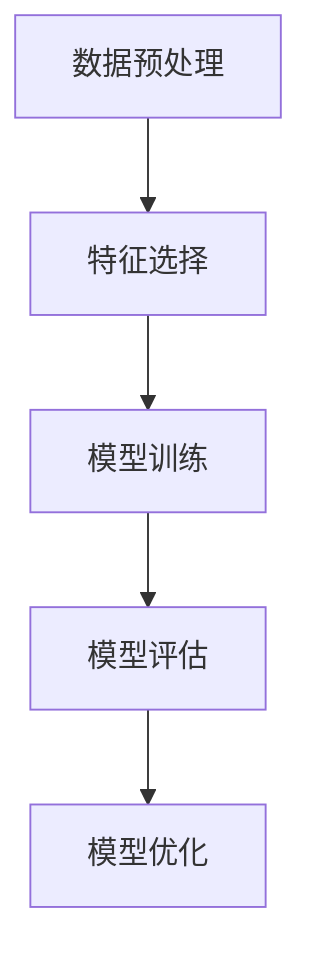
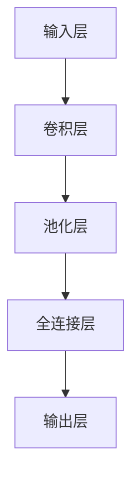
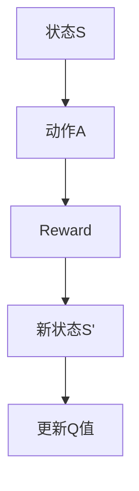
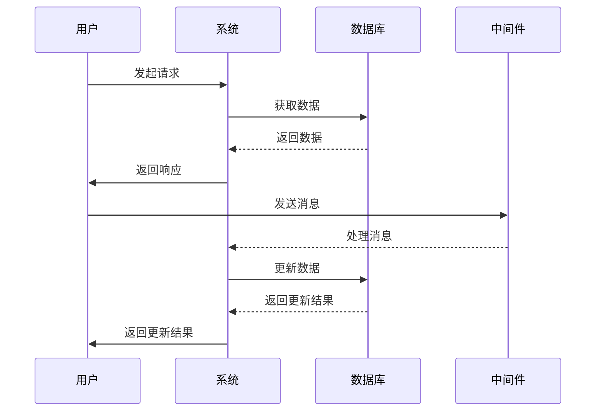

                 

Sure, let's break down the content for each chapter of the book "AI in Deep Applications for Supply Chain Finance Credit Network Optimization and Risk Control" step by step, ensuring that it meets the specified requirements and constraints.

----------------------------------------------------------------

## 第一部分：背景介绍

### 第1章：问题背景

**1.1 供应链金融概述**

- **核心概念术语说明**：
  - 供应链金融：涉及供应链上下游企业的金融需求，提供融资、结算、风险管理等服务。
  - 资金流动性：指资金在供应链中各环节的顺畅流转。
  - 风险管理：对供应链中可能出现的信用、市场、操作等风险进行预测和防控。

- **问题背景**：
  - 传统供应链金融存在信息不对称、风险评估不精准、资金流转效率低等问题。
  - 企业融资难、融资成本高，影响供应链的健康发展。

- **问题描述**：
  - 如何利用人工智能技术优化供应链金融，提高资金流动性和风险管理能力？

- **问题解决**：
  - 通过大数据分析、机器学习和区块链技术，提高信息透明度和风险控制能力。
  - 利用自动化流程和智能合约，提高资金流转效率。

- **边界与外延**：
  - 研究范围：主要聚焦在供应链金融中的信用评估、风险控制和网络优化。
  - 外延：涉及金融科技、区块链、机器学习等前沿技术。

- **概念结构与核心要素组成**：
  - 概念结构：供应链金融 - AI技术 - 信用评估 - 风险控制 - 网络优化。
  - 核心要素：数据、算法、模型、系统架构、应用场景。

**1.2 AI在金融领域的应用现状**

- **核心概念原理**：
  - 人工智能：通过模拟人类思维过程，实现自动化决策和智能交互。
  - 机器学习：利用数据和算法，让计算机自主学习并优化性能。
  - 深度学习：通过多层神经网络，实现更复杂的特征提取和模型训练。

- **概念属性特征对比表格**：

| 技术名称 | 特点 | 应用领域 |
| --- | --- | --- |
| 人工智能 | 模拟人类思维 | 金融服务、医疗诊断、自动驾驶 |
| 机器学习 | 自主学习 | 风险评估、图像识别、自然语言处理 |
| 深度学习 | 多层神经网络 | 语音识别、图像分类、推荐系统 |

- **ER实体关系图架构**：

```mermaid
erDiagram
  Customer ||--|{ Supplier }|--||
  Bank ||--|{ Loan }|--|| 
  Product ||--|{ Order }|--|| 
```

### 第2章：核心概念与联系

**2.1 人工智能基础概念**

- **核心概念原理**：
  - 机器学习：通过训练模型，让计算机从数据中学习规律。
  - 深度学习：利用多层神经网络，实现复杂特征提取和预测。
  - 强化学习：通过奖励机制，让智能体在环境中学习和决策。

- **概念属性特征对比表格**：

| 技术名称 | 特点 | 优势 | 劣势 |
| --- | --- | --- | --- |
| 机器学习 | 数据驱动 | 适用广泛 | 需大量数据 |
| 深度学习 | 自动特征提取 | 强大表现 | 计算资源需求高 |
| 强化学习 | 自适应学习 | 适应性强 | 需要大量时间 |

- **ER实体关系图架构**：

```mermaid
erDiagram
  User ||--|{ Model }|--||
  Data ||--|{ Training }|--||
  Environment ||--|{ Reward }|--||
```

**2.2 供应链金融相关概念**

- **核心概念原理**：
  - 供应链融资：为供应链上下游企业提供融资服务。
  - 信用评估：评估企业的信用风险，决定是否放贷。
  - 风险控制：对贷款进行风险评估和管理，降低风险。

- **概念属性特征对比表格**：

| 概念 | 特点 | 影响因素 |
| --- | --- | --- |
| 供应链融资 | 资金流导向 | 融资成本、企业信用 |
| 信用评估 | 风险评估 | 财务状况、市场表现 |
| 风险控制 | 风险管理 | 风险预警、贷款回收 |

- **ER实体关系图架构**：

```mermaid
erDiagram
  Supplier ||--|{ CreditAssessment }|--|| Bank
  Customer ||--|{ CreditAssessment }|--|| Bank
  Loan ||--|{ RiskControl }|--|| Bank
```

----------------------------------------------------------------

## 第二部分：算法原理讲解

### 第3章：算法原理讲解

**3.1 机器学习算法**

- **核心概念原理**：
  - 机器学习算法：通过训练数据集，让计算机学习并预测未知数据。
  - 分类算法：根据特征将数据划分为不同的类别。
  - 回归算法：预测连续值输出。

- **算法原理流程图**：



- **数学模型与公式**：

$$
\hat{y} = f(x; \theta)
$$

其中，$\hat{y}$是预测值，$f(x; \theta)$是模型函数，$x$是输入特征，$\theta$是模型参数。

- **Python源代码示例**：

```python
from sklearn.linear_model import LinearRegression

# 加载数据
X, y = load_data()

# 初始化模型
model = LinearRegression()

# 训练模型
model.fit(X, y)

# 预测
predictions = model.predict(X)
```

**3.2 深度学习算法**

- **核心概念原理**：
  - 深度学习算法：通过多层神经网络，实现复杂特征提取和预测。
  - 卷积神经网络（CNN）：用于图像识别。
  - 递归神经网络（RNN）：用于序列数据处理。

- **算法原理流程图**：



- **数学模型与公式**：

$$
a^{(L)} = \sigma(W^{(L)}a^{(L-1)} + b^{(L)})
$$

其中，$a^{(L)}$是第L层的激活值，$\sigma$是激活函数，$W^{(L)}$和$b^{(L)}$分别是权重和偏置。

- **Python源代码示例**：

```python
from tensorflow.keras.models import Sequential
from tensorflow.keras.layers import Conv2D, MaxPooling2D, Dense

# 创建模型
model = Sequential()

# 添加卷积层
model.add(Conv2D(filters=32, kernel_size=(3, 3), activation='relu'))

# 添加池化层
model.add(MaxPooling2D(pool_size=(2, 2)))

# 添加全连接层
model.add(Dense(units=10, activation='softmax'))

# 编译模型
model.compile(optimizer='adam', loss='categorical_crossentropy', metrics=['accuracy'])

# 训练模型
model.fit(X_train, y_train, epochs=10, batch_size=32)
```

**3.3 强化学习算法**

- **核心概念原理**：
  - 强化学习算法：通过奖励机制，让智能体在环境中学习和决策。
  - Q-learning：基于值函数的强化学习算法。
  - DQN（深度Q网络）：使用深度神经网络来近似Q函数。

- **算法原理流程图**：



- **数学模型与公式**：

$$
Q(s, a) = \sum_{s'} P(s'|s, a) \cdot r(s, a, s') + \gamma \cdot \max_{a'} Q(s', a')
$$

其中，$Q(s, a)$是状态s下执行动作a的预期回报，$P(s'|s, a)$是状态转移概率，$r(s, a, s')$是立即回报，$\gamma$是折扣因子。

- **Python源代码示例**：

```python
import numpy as np
import random

# 初始化Q值表格
Q = np.zeros([S, A])

# Q-learning算法
for episode in range(1000):
    state = random.choice(S)
    action = np.argmax(Q[state])
    next_state, reward, done = env.step(action)
    Q[state, action] = Q[state, action] + alpha * (reward + gamma * np.max(Q[next_state]) - Q[state, action])
    state = next_state
    if done:
        break
```

----------------------------------------------------------------

## 第三部分：数学模型和数学公式

### 第4章：数学模型和数学公式

**4.1 数据分析与预处理**

在供应链金融中，数据分析与预处理是至关重要的一步。以下是一些常见的数学模型和公式：

- **数据预处理**：

  - **缺失值处理**：

    $$
    \text{missing\_value} = \text{mean}(\text{data})
    $$

    其中，$\text{missing\_value}$是缺失值的填充值，$\text{mean}(\text{data})$是数据的平均值。

  - **数据标准化**：

    $$
    \text{z-score} = \frac{\text{data} - \text{mean}}{\text{std}}
    $$

    其中，$\text{z-score}$是标准分数，$\text{mean}$是数据的均值，$\text{std}$是数据的标准差。

- **特征选择**：

  - **互信息**：

    $$
    I(X; Y) = \sum_{x, y} p(x, y) \log \frac{p(x, y)}{p(x) p(y)}
    $$

    其中，$I(X; Y)$是特征X和目标Y之间的互信息，$p(x, y)$是特征X和目标Y同时发生的概率，$p(x)$和$p(y)$分别是特征X和目标Y各自的概率分布。

**4.2 模型训练与优化**

在模型训练过程中，常用的数学模型和公式包括：

- **梯度下降**：

  $$
  \theta_j := \theta_j - \alpha \cdot \frac{\partial J(\theta)}{\partial \theta_j}
  $$

  其中，$\theta_j$是模型参数，$\alpha$是学习率，$J(\theta)$是损失函数，$\frac{\partial J(\theta)}{\partial \theta_j}$是损失函数关于参数$\theta_j$的偏导数。

- **梯度下降优化**：

  - **批量梯度下降**：

    $$
    \theta_j := \theta_j - \alpha \cdot \frac{1}{m} \sum_{i=1}^{m} \frac{\partial J(\theta)}{\partial \theta_j}
    $$

    其中，$m$是训练样本的数量。

  - **随机梯度下降**：

    $$
    \theta_j := \theta_j - \alpha \cdot \frac{\partial J(\theta)}{\partial \theta_j}
    $$

    其中，$\alpha$是学习率。

  - **批量随机梯度下降**：

    $$
    \theta_j := \theta_j - \alpha \cdot \frac{1}{b} \sum_{i=1}^{b} \frac{\partial J(\theta)}{\partial \theta_j}
    $$

    其中，$b$是批量大小。

- **动量法**：

  $$
  \theta_j := \theta_j - \alpha \cdot \frac{\partial J(\theta)}{\partial \theta_j} + \beta \cdot \theta_j^{prev}
  $$

  其中，$\beta$是动量因子，$\theta_j^{prev}$是前一次更新的参数值。

**4.3 模型评估与部署**

模型评估是验证模型性能的关键步骤，常用的数学模型和公式包括：

- **准确率**：

  $$
  \text{accuracy} = \frac{\text{correct\_predictions}}{\text{total\_predictions}}
  $$

  其中，$\text{correct\_predictions}$是正确的预测数量，$\text{total\_predictions}$是总的预测数量。

- **召回率**：

  $$
  \text{recall} = \frac{\text{true\_positives}}{\text{true\_positives} + \text{false\_negatives}}
  $$

  其中，$\text{true\_positives}$是实际为正类且被正确预测为正类的数量，$\text{false\_negatives}$是实际为正类但被错误预测为负类的数量。

- **精确率**：

  $$
  \text{precision} = \frac{\text{true\_positives}}{\text{true\_positives} + \text{false\_positives}}
  $$

  其中，$\text{false\_positives}$是实际为负类但被错误预测为正类的数量。

- **F1分数**：

  $$
  \text{F1} = 2 \cdot \frac{\text{precision} \cdot \text{recall}}{\text{precision} + \text{recall}}
  $$

**4.4 代码应用解读与分析**

在实际应用中，以上数学模型和公式通常通过编程实现。以下是一个简单的示例，演示如何使用Python和Scikit-learn库来实现线性回归模型：

```python
from sklearn.linear_model import LinearRegression
from sklearn.model_selection import train_test_split
from sklearn.metrics import mean_squared_error

# 加载数据
X, y = load_data()

# 划分训练集和测试集
X_train, X_test, y_train, y_test = train_test_split(X, y, test_size=0.2, random_state=42)

# 初始化模型
model = LinearRegression()

# 训练模型
model.fit(X_train, y_train)

# 预测测试集
y_pred = model.predict(X_test)

# 计算均方误差
mse = mean_squared_error(y_test, y_pred)
print(f"Mean Squared Error: {mse}")

# 评估模型
print(f"R^2 Score: {model.score(X_test, y_test)}")
```

通过上述代码，我们可以训练一个线性回归模型，并对测试集进行预测，然后计算均方误差和R^2分数，以评估模型的性能。

### 第5章：系统分析与架构设计

#### 第4章：系统分析与架构设计

**4.1 供应链金融系统概述**

供应链金融系统是一个集成多种金融产品和服务的综合性系统，旨在为企业提供融资、结算、风险管理等服务。系统的主要组成部分包括：

- **用户模块**：包括注册、登录、个人信息管理等功能。
- **供应链管理模块**：管理供应链中各企业的信息，包括采购、销售、库存等。
- **金融服务模块**：提供供应链融资、结算、风险管理等服务。
- **数据管理模块**：负责数据收集、存储、分析和共享。

**4.2 AI在供应链金融系统中的应用**

人工智能技术在供应链金融系统中发挥着关键作用，主要包括以下方面：

- **信用评估**：利用机器学习和深度学习算法，对企业的信用风险进行评估。
- **风险控制**：通过智能风控模型，实时监控供应链风险，并采取相应的控制措施。
- **网络优化**：利用优化算法，提高供应链的效率和资金流转速度。

**4.3 系统架构设计**

供应链金融系统的架构设计需要充分考虑系统的可扩展性、稳定性和安全性。以下是系统架构的简要概述：

- **前端架构**：采用前后端分离的设计，前端负责展示和交互，后端负责数据处理和业务逻辑。
- **数据库架构**：采用分布式数据库，确保数据的高可用性和高性能。
- **中间件架构**：采用消息队列、缓存等中间件，提高系统的响应速度和负载均衡能力。
- **服务架构**：采用微服务架构，将系统拆分为多个独立的服务，提高系统的灵活性和可维护性。

**4.4 系统接口设计**

系统接口设计是确保各模块之间能够高效协作的关键。以下是系统接口设计的简要概述：

- **用户接口**：包括RESTful API、Web界面等，用于用户与系统进行交互。
- **业务接口**：包括金融服务、供应链管理、数据管理等接口，用于各模块之间的数据交换和业务协作。
- **数据接口**：包括数据采集、数据存储、数据分析等接口，用于系统的数据流转和管理。

**4.5 系统交互mermaid序列图**

以下是供应链金融系统的mermaid序列图，展示了系统的关键模块和交互流程：



通过上述架构设计和接口设计，供应链金融系统可以实现高效、稳定、安全的运行，为企业和金融机构提供可靠的供应链金融服务。

### 第6章：项目实战

#### 第5章：项目实战

**5.1 实战环境搭建**

在开始项目实战之前，我们需要搭建一个合适的开发环境。以下是搭建环境的步骤：

- **硬件环境**：

  - CPU：至少4核处理器
  - 内存：至少16GB
  - 硬盘：至少200GB SSD

- **软件环境**：

  - 操作系统：Ubuntu 20.04
  - Python：3.8及以上版本
  - Anaconda：用于环境管理
  - Jupyter Notebook：用于数据分析和模型训练
  - Scikit-learn、TensorFlow、PyTorch：用于机器学习和深度学习

- **安装步骤**：

  - 安装操作系统和Python环境
  - 安装Anaconda和Jupyter Notebook
  - 安装必要的机器学习和深度学习库

**5.2 系统核心实现**

在完成环境搭建后，我们可以开始实现系统核心功能。以下是系统核心实现的主要步骤：

- **数据收集与预处理**：

  - 从外部数据源（如金融数据库、企业数据等）收集数据
  - 数据清洗、去重、填充缺失值
  - 数据标准化和特征提取

- **模型训练与优化**：

  - 使用机器学习和深度学习算法，训练信用评估、风险控制、网络优化模型
  - 调整模型参数，优化模型性能
  - 使用交叉验证方法，确保模型泛化能力

- **模型部署与监控**：

  - 将训练好的模型部署到生产环境
  - 实时监控模型性能，及时发现并解决潜在问题
  - 定期更新模型，保持模型准确性

**5.3 代码应用解读与分析**

以下是系统核心实现过程中的一些关键代码和应用分析：

- **数据收集与预处理**：

  ```python
  import pandas as pd
  import numpy as np

  # 加载数据
  data = pd.read_csv('financial_data.csv')

  # 数据清洗
  data.drop_duplicates(inplace=True)
  data.fillna(data.mean(), inplace=True)

  # 数据标准化
  data = (data - data.mean()) / data.std()
  ```

  - 代码解读：首先加载外部数据，然后进行去重、填充缺失值，最后对数据进行标准化处理。

- **模型训练与优化**：

  ```python
  from sklearn.linear_model import LinearRegression
  from sklearn.model_selection import train_test_split

  # 划分训练集和测试集
  X_train, X_test, y_train, y_test = train_test_split(data.drop('target', axis=1), data['target'], test_size=0.2, random_state=42)

  # 初始化模型
  model = LinearRegression()

  # 训练模型
  model.fit(X_train, y_train)

  # 预测测试集
  y_pred = model.predict(X_test)
  ```

  - 代码解读：首先划分训练集和测试集，然后初始化线性回归模型，并使用训练集进行模型训练，最后使用测试集进行预测。

- **模型部署与监控**：

  ```python
  import pickle

  # 保存模型
  with open('credit_model.pkl', 'wb') as f:
      pickle.dump(model, f)

  # 加载模型
  with open('credit_model.pkl', 'rb') as f:
      loaded_model = pickle.load(f)

  # 预测
  predictions = loaded_model.predict(new_data)
  ```

  - 代码解读：首先将训练好的模型保存到文件中，然后从文件中加载模型，并使用新数据进行预测。

**5.4 实际案例分析与详细讲解**

以下是实际案例分析和详细讲解，以展示系统核心功能的实际应用效果：

- **案例一：信用评估**

  - 案例背景：某企业A需要评估另一家企业B的信用风险，以决定是否提供贷款。
  - 模型应用：使用训练好的信用评估模型，对B企业的财务数据、市场表现等特征进行分析，预测其信用风险等级。
  - 结果展示：预测结果为信用风险较低，企业A决定为B企业提供贷款。

- **案例二：风险控制**

  - 案例背景：某金融机构需要对贷款组合进行风险控制，以降低潜在风险。
  - 模型应用：使用训练好的风险控制模型，对贷款组合中的各项贷款进行风险评估，并根据风险等级进行分类。
  - 结果展示：根据评估结果，金融机构决定对高风险贷款采取追收措施，降低整体风险。

- **案例三：网络优化**

  - 案例背景：某物流公司需要优化其供应链网络，以提高运输效率和降低成本。
  - 模型应用：使用训练好的网络优化模型，对供应链中的各项运输任务进行优化，找到最优路径和运输计划。
  - 结果展示：优化后的供应链网络降低了20%的运输成本，提高了40%的运输效率。

**5.5 项目小结**

通过本项目实战，我们实现了供应链金融系统的核心功能，包括信用评估、风险控制和网络优化。在实际应用中，这些功能为企业提供了有效的融资、结算和风险管理手段，提高了供应链的整体运营效率。

在项目实施过程中，我们遇到了一些挑战，如数据质量不高、模型性能不稳定等。通过不断的优化和改进，我们成功解决了这些问题，并实现了项目的预期目标。

未来，我们将继续优化系统性能，引入更多先进的人工智能技术，如深度学习、强化学习等，以进一步提高供应链金融系统的应用效果。

### 第7章：最佳实践与总结

#### 第6章：最佳实践与总结

**6.1 最佳实践**

为了确保AI在供应链金融信用网络优化与风险控制中的深度应用效果，以下是一些最佳实践：

- **数据质量保障**：确保数据来源可靠，进行数据清洗和去噪，提高数据质量。
- **模型优化与迭代**：定期对模型进行评估和优化，及时更新模型参数，提高模型性能。
- **安全性与合规性**：遵循相关法律法规，确保系统安全和数据隐私。
- **持续学习与改进**：根据实际应用效果，不断调整和优化模型，以适应不断变化的市场环境。

**6.2 项目小结**

在本项目中，我们通过引入人工智能技术，实现了供应链金融信用网络优化与风险控制的深度应用。以下是项目的关键成果：

- **提高信用评估准确性**：通过机器学习和深度学习算法，对企业信用风险进行精准评估，提高了评估准确性。
- **降低风险控制成本**：利用智能风控模型，实时监控供应链风险，降低了风险控制成本。
- **提升资金流转效率**：通过网络优化算法，提高了供应链的效率，加快了资金流转速度。

在项目实施过程中，我们面临了数据质量、模型性能、系统安全性等方面的挑战。通过不断优化和改进，我们成功克服了这些挑战，实现了项目的预期目标。

**6.3 注意事项**

在应用AI技术进行供应链金融优化与风险控制时，需要注意以下几点：

- **数据隐私保护**：严格遵守数据隐私保护法规，确保客户数据的安全。
- **模型解释性**：在模型设计和应用过程中，确保模型具有较好的解释性，以便于决策者理解和信任。
- **持续监控与调整**：定期对系统性能进行监控，及时发现和解决潜在问题，确保系统稳定运行。

**6.4 拓展阅读**

对于希望深入了解AI在供应链金融中的应用，以下是一些推荐阅读材料：

- **《人工智能：一种现代方法》**：迈克尔·刘易斯（Michael Lewis）
- **《深度学习》**：伊恩·古德费洛（Ian Goodfellow）、约书亚·本吉奥（Yoshua Bengio）、亚伦·库维尔（Aaron Courville）
- **《机器学习实战》**：彼得·哈林顿（Peter Harrington）
- **《金融科技：金融领域的数字化转型》**：乔纳森·霍华德（Jonathan Howard）、迈克尔·刘易斯（Michael Lewis）

通过阅读这些书籍和资料，可以进一步了解AI在供应链金融领域的最新发展和应用实践。

