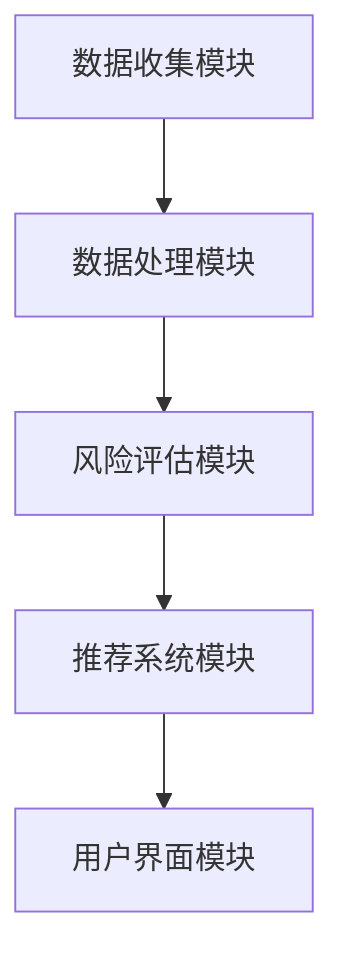

                 

# AI在保险产品个性化定制中的深度应用

## 关键词

- 人工智能
- 保险产品
- 个性化定制
- 机器学习
- 深度学习
- 数据分析

## 摘要

本文旨在探讨人工智能在保险产品个性化定制中的应用。随着大数据和机器学习的迅猛发展，AI技术已成为保险行业创新和转型的重要驱动力。本文首先介绍了保险行业现状和个性化定制需求，然后详细分析了AI在保险产品个性化定制中的优势和应用，最后提出了一个完整的解决方案，包括算法原理、系统架构和项目实战。通过本文的阅读，读者将深入理解AI在保险产品个性化定制中的深度应用，并了解如何将这一先进技术应用于实际业务场景中。

## 第一部分：AI在保险产品个性化定制中的深度应用背景

### 1.1 问题背景

#### 1.1.1 保险行业现状

保险行业作为金融服务业的重要组成部分，近年来经历了快速的发展。然而，传统保险产品在满足客户需求方面存在一定的局限性。传统保险产品通常采用标准化、一刀切的模式，无法充分考虑到客户的个性化需求。这导致保险产品的市场竞争力和客户满意度相对较低。

#### 1.1.2 个性化定制需求

随着消费者需求的日益多样化和个性化，保险公司意识到提供个性化定制产品的重要性。个性化定制不仅能够提高客户满意度，还能够提升市场竞争力和盈利能力。然而，个性化定制需要大量的数据分析和算法支持，这对于传统保险行业来说是一个巨大的挑战。

#### 1.1.3 AI技术的发展与应用

人工智能技术的快速发展为保险行业带来了新的机遇。AI技术，特别是机器学习和深度学习，可以在大数据分析、客户细分、个性化推荐、风险预测等方面发挥重要作用。通过AI技术，保险公司能够更好地理解客户需求，提供更加精准和个性化的产品和服务。

### 1.2 问题描述

#### 1.2.1 传统保险产品的局限

传统保险产品存在以下局限：

- 标准化产品：无法满足客户的个性化需求。
- 有限的灵活性：无法根据客户的风险偏好和需求进行动态调整。
- 低效的理赔流程：人工处理速度慢，客户体验差。

#### 1.2.2 个性化定制的挑战

个性化定制的挑战主要包括：

- 数据获取和处理：需要大量数据支持和高效的算法。
- 风险评估和定价：如何准确评估客户的风险和制定合理的保费。
- 系统集成和兼容：如何与现有的保险系统进行无缝集成。

#### 1.2.3 AI在个性化定制中的优势

AI技术在个性化定制中的优势包括：

- 数据分析能力：通过机器学习和深度学习技术，可以高效处理和分析大量数据。
- 个性化推荐：基于客户的历史数据和偏好，提供个性化的产品推荐。
- 风险预测：通过数据分析和预测模型，准确评估客户的风险。
- 自动化流程：提高业务流程的自动化水平，降低成本。

### 1.3 问题解决

#### 1.3.1 AI技术的作用

AI技术在保险产品个性化定制中扮演以下角色：

- 数据分析：通过对客户数据的分析，了解客户的需求和偏好。
- 风险评估：通过预测模型评估客户的风险，制定个性化的保费。
- 产品推荐：基于客户的偏好和历史数据，提供个性化的产品推荐。
- 自动化理赔：通过自动化流程，提高理赔效率，改善客户体验。

#### 1.3.2 个性化定制流程

个性化定制流程主要包括以下步骤：

1. 数据收集：收集客户的基本信息和历史数据。
2. 数据清洗：处理缺失值、异常值和噪声数据。
3. 数据分析：分析客户的数据，了解其需求和偏好。
4. 风险评估：通过预测模型评估客户的风险。
5. 产品推荐：根据客户的需求和风险，提供个性化的产品推荐。
6. 客户反馈：收集客户的反馈，不断优化产品和服务。

#### 1.3.3 解决方案的边界与外延

解决方案的边界包括：

- 数据隐私和安全性：确保客户数据的隐私和安全。
- 法规和合规性：遵守相关法规和行业标准。
- 技术可行性：确保技术实现的可行性和稳定性。

解决方案的外延包括：

- 数据来源和整合：如何获取和整合内外部数据。
- 技术选型和架构设计：选择合适的AI技术和架构。
- 业务流程优化：如何优化现有的业务流程，提高效率。

### 1.4 核心概念

#### 1.4.1 人工智能

人工智能（Artificial Intelligence，AI）是指通过计算机程序模拟人类智能行为的技术。AI包括多个子领域，如机器学习、深度学习、自然语言处理等。

#### 1.4.2 个性化定制

个性化定制是指根据客户的需求和偏好，提供量身定制的产品和服务。个性化定制可以提高客户满意度和忠诚度，增强市场竞争力。

#### 1.4.3 保险产品

保险产品是一种金融产品，旨在为客户提供风险保障。保险产品包括人寿保险、财产保险、健康保险等。

### 1.5 本章小结

本部分介绍了AI在保险产品个性化定制中的背景、问题和解决方案。通过分析保险行业的现状和个性化定制需求，我们明确了AI在个性化定制中的优势和应用。接下来，我们将深入探讨AI的核心概念和原理，以及其在个性化定制中的具体应用。

----------------------------------------------------------------

## 第二部分：AI在保险产品个性化定制中的核心概念与联系

### 2.1 AI核心概念与原理

#### 2.1.1 机器学习

机器学习（Machine Learning，ML）是指让计算机通过数据学习并做出决策或预测的方法。机器学习可以分为监督学习、无监督学习和强化学习三种类型。

##### 2.1.1.1 监督学习

监督学习（Supervised Learning）是指通过已知输入和输出数据来训练模型，使其能够对新数据进行预测或分类。

- 特点：需要标注的数据。
- 应用：分类和回归问题。

##### 2.1.1.2 无监督学习

无监督学习（Unsupervised Learning）是指没有已知输出数据，仅通过输入数据来发现数据结构和模式。

- 特点：不需要标注的数据。
- 应用：聚类和降维问题。

##### 2.1.1.3 强化学习

强化学习（Reinforcement Learning）是指通过奖励机制来训练模型，使其在特定环境中做出最优决策。

- 特点：基于奖励机制。
- 应用：游戏和自动驾驶问题。

#### 2.1.2 深度学习

深度学习（Deep Learning，DL）是指多层神经网络（Neural Network）的学习方法，主要用于处理大规模数据和复杂任务。

##### 2.1.2.1 神经网络

神经网络（Neural Network）是一种模拟生物神经网络的计算模型，由大量神经元和连接组成。

- 特点：非线性变换。
- 应用：图像识别和语音识别。

##### 2.1.2.2 卷积神经网络（CNN）

卷积神经网络（Convolutional Neural Network，CNN）是一种专门用于处理图像数据的神经网络模型。

- 特点：卷积操作和池化操作。
- 应用：图像分类和物体检测。

##### 2.1.2.3 循环神经网络（RNN）

循环神经网络（Recurrent Neural Network，RNN）是一种能够处理序列数据的神经网络模型。

- 特点：记忆和循环结构。
- 应用：自然语言处理和时间序列预测。

### 2.2 个性化定制原理与属性特征对比

#### 2.2.1 个性化定制的定义

个性化定制（Personalization）是指根据客户的需求、偏好和行为数据，提供量身定制的产品和服务。

#### 2.2.2 个性化定制的关键要素

个性化定制的关键要素包括：

- 数据分析：收集和分析客户数据，了解其需求和偏好。
- 风险评估：评估客户的风险，制定合理的保费。
- 产品推荐：基于客户的需求和偏好，提供个性化的产品推荐。
- 客户反馈：收集客户反馈，不断优化产品和服务。

#### 2.2.3 个性化定制与传统定制对比

个性化定制与传统定制的对比如下：

| 对比项         | 个性化定制 | 传统定制 |
| ------------- | -------- | -------- |
| 数据依赖性     | 高       | 低       |
| 个性化程度     | 高       | 低       |
| 生产周期       | 长       | 短       |
| 成本           | 高       | 低       |
| 市场适应性     | 强       | 弱       |

### 2.3 AI与个性化定制的关系

#### 2.3.1 AI技术在个性化定制中的应用

AI技术在个性化定制中的应用主要包括：

- 数据分析：通过机器学习和深度学习技术，对大量客户数据进行分析，发现其需求和偏好。
- 风险评估：通过预测模型，对客户的风险进行评估，制定个性化的保费。
- 产品推荐：基于客户的偏好和历史数据，提供个性化的产品推荐。
- 自动化流程：通过自动化技术，提高业务流程的自动化水平，降低成本。

#### 2.3.2 个性化定制对AI技术的需求

个性化定制对AI技术的需求主要包括：

- 大数据处理能力：处理和分析大量客户数据。
- 高效算法：提供快速和准确的风险评估和产品推荐。
- 智能决策：通过AI技术，实现智能化的决策和优化。
- 用户界面：提供友好的用户界面，便于客户理解和操作。

#### 2.3.3 AI与个性化定制的发展趋势

AI与个性化定制的发展趋势包括：

- 数据驱动的决策：通过大数据和AI技术，实现数据驱动的个性化定制。
- 智能化产品推荐：通过AI技术，实现更加精准和个性化的产品推荐。
- 跨界融合：AI技术与保险、金融等行业的深度融合。
- 法规和伦理：关注AI技术在个性化定制中的法规和伦理问题。

### 2.4 保险产品的核心要素

#### 2.4.1 保险产品的分类

保险产品可以分为以下几类：

- 人寿保险
- 财产保险
- 健康保险
- 责任保险
- 旅游保险

#### 2.4.2 保险产品的要素构成

保险产品的要素构成包括：

- 保险金额：保险合同中约定的赔偿金额。
- 保险期限：保险合同的有效期限。
- 保险费率：保险合同中约定的保费。
- 保险责任：保险合同中约定的保险责任。

#### 2.4.3 保险产品的个性化定制

保险产品的个性化定制主要包括：

- 保险金额定制：根据客户的经济能力和风险需求，定制合适的保险金额。
- 保险期限定制：根据客户的需求，定制合适的保险期限。
- 保险费率定制：根据客户的风险评估结果，定制合理的保费。
- 保险责任定制：根据客户的需求，定制合适的保险责任。

### 2.5 本章小结

本部分介绍了AI的核心概念与原理，以及个性化定制的原理与属性特征对比。通过分析AI与个性化定制的关系，我们明确了AI在保险产品个性化定制中的应用和需求。接下来，我们将深入探讨AI在保险产品个性化定制中的应用算法原理。

----------------------------------------------------------------

## 第三部分：AI在保险产品个性化定制中的应用算法原理

### 3.1 算法原理介绍

#### 3.1.1 算法的选择标准

在保险产品个性化定制中，算法的选择需要考虑以下几个标准：

- **准确性**：算法能够准确预测和分类客户的需求和风险。
- **效率**：算法能够在合理的时间内处理大量数据。
- **可解释性**：算法的决策过程和结果能够被理解和解释。
- **稳定性**：算法在不同数据集上的表现稳定，不受噪声数据的影响。

#### 3.1.2 个性化定制算法概述

个性化定制算法主要包括以下几种：

- **客户细分算法**：根据客户的特征和行为，将客户划分为不同的群体。
- **推荐算法**：根据客户的偏好和购买历史，推荐合适的保险产品。
- **定价算法**：根据客户的风险评估，制定个性化的保费。

#### 3.1.3 算法应用前景

随着AI技术的不断发展，个性化定制算法在保险产品中的应用前景广阔。未来，算法将更加智能化、个性化，能够实时响应客户的需求变化，提供更加精准的保险产品和服务。

### 3.2 个性化推荐算法

#### 3.2.1 算法原理

个性化推荐算法是基于用户的历史行为和偏好，预测用户可能感兴趣的内容，并推荐给用户。个性化推荐算法主要分为以下三种：

1. **协同过滤**：通过分析用户之间的相似度，推荐用户喜欢的内容。
2. **内容推荐**：根据内容的特征，推荐与用户历史行为相似的内容。
3. **混合推荐系统**：结合协同过滤和内容推荐，提高推荐系统的准确性。

#### 3.2.2 代码实现

以下是一个简单的协同过滤算法的Python实现：

```python
import numpy as np

# 用户-商品评分矩阵
R = np.array([[5, 3, 0, 1],
              [4, 0, 0, 2],
              [1, 5, 0, 3],
              [4, 0, 1, 2]])

# 用户之间的相似度矩阵
S = R @ R.T / (R.sum(axis=1)[:, np.newaxis] * R.sum(axis=0)[np.newaxis, :])

# 预测用户未评分的商品
for user in range(R.shape[0]):
    for item in range(R.shape[1]):
        if R[user, item] == 0:
            R[user, item] = np.mean(R[user, S[user, :] > 0])

print(R)
```

#### 3.2.3 应用案例分析

以某保险公司为例，该公司的客户数据包括购买历史、年龄、性别、收入等信息。通过协同过滤算法，该公司可以推荐适合客户的其他保险产品。例如，一个30岁的男性客户已经购买了寿险，通过协同过滤算法，系统可以推荐健康保险和意外保险。

### 3.3 客户细分算法

#### 3.3.1 算法原理

客户细分算法是将客户划分为不同的群体，以便于保险公司针对不同群体的需求提供个性化服务。常见的客户细分算法包括：

1. **聚类算法**：根据客户的特征，将客户划分为多个群体。
2. **分层算法**：根据客户的特征，将客户分层，然后针对每个层次提供不同的服务。
3. **细分评价指标**：评估客户细分的效果，常用的指标包括细分精度、细分覆盖率等。

#### 3.3.2 代码实现

以下是一个简单的K-Means聚类算法的Python实现：

```python
import numpy as np
from sklearn.cluster import KMeans

# 客户数据
X = np.array([[1, 2],
              [1, 4],
              [1, 0],
              [10, 2],
              [10, 4],
              [10, 0]])

# 使用K-Means聚类
kmeans = KMeans(n_clusters=2, random_state=0).fit(X)
print(kmeans.labels_)

# 细分结果
print(kmeans.cluster_centers_)
```

#### 3.3.3 应用案例分析

以某保险公司为例，该公司的客户数据包括年龄、收入、购买历史等信息。通过K-Means聚类算法，该公司可以将客户划分为年轻、中年和老年三个群体，然后针对每个群体的需求提供个性化的保险产品和服务。

### 3.4 保险产品定价算法

#### 3.4.1 算法原理

保险产品定价算法是根据客户的风险特征，计算合理的保费。常见的定价算法包括：

1. **统计学方法**：基于历史数据和统计模型，计算保费。
2. **机器学习方法**：通过机器学习模型，预测客户的风险，计算保费。
3. **贝叶斯方法**：利用贝叶斯定理，计算保费。

#### 3.4.2 代码实现

以下是一个简单的线性回归定价算法的Python实现：

```python
import numpy as np
from sklearn.linear_model import LinearRegression

# 客户数据
X = np.array([[1, 2],
              [1, 4],
              [1, 0],
              [10, 2],
              [10, 4],
              [10, 0]])

# 保费数据
y = np.array([2.5, 4.0, 1.0, 4.5, 6.0, 2.0])

# 使用线性回归定价
model = LinearRegression().fit(X, y)
print(model.coef_)

# 预测保费
print(model.predict([[11, 3]]))
```

#### 3.4.3 应用案例分析

以某保险公司为例，该公司的客户数据包括年龄、性别、收入和购买历史等信息。通过线性回归算法，该公司可以计算每个客户的合理保费，从而提供个性化的保险产品和服务。

### 3.5 本章小结

本部分介绍了AI在保险产品个性化定制中的应用算法原理，包括个性化推荐算法、客户细分算法和保险产品定价算法。通过具体的代码实现和案例分析，我们了解了这些算法在实际应用中的效果和挑战。接下来，我们将探讨AI在保险产品个性化定制中的系统分析与架构设计。

----------------------------------------------------------------

## 第四部分：AI在保险产品个性化定制中的系统分析与架构设计

### 4.1 问题场景介绍

#### 4.1.1 个性化定制案例

假设一家保险公司希望通过AI技术为不同年龄、性别、职业的客户提供个性化的保险产品。客户数据包括基本信息、购买历史、健康状况、财务状况等。保险公司希望通过这些数据，为客户提供量身定制的保险方案。

#### 4.1.2 系统需求分析

系统需求分析主要包括以下几个方面：

- **数据收集与处理**：收集并处理来自多个数据源的客户数据。
- **风险评估**：根据客户数据，评估客户的风险，制定合理的保费。
- **个性化推荐**：根据客户偏好和历史数据，推荐合适的保险产品。
- **用户体验**：提供友好的用户界面，方便客户了解和选择保险产品。

#### 4.1.3 系统功能设计

系统功能设计主要包括以下几个方面：

- **数据收集模块**：负责收集来自各种数据源的客户数据。
- **数据处理模块**：负责处理和清洗客户数据，提取有用的特征。
- **风险评估模块**：利用机器学习算法，评估客户的风险。
- **推荐系统模块**：根据客户数据，推荐合适的保险产品。
- **用户界面模块**：提供用户界面，方便客户了解和选择保险产品。

### 4.2 系统架构设计

#### 4.2.1 总体架构设计

系统架构设计如图所示：

```
+----------------+      +----------------+      +----------------+
| 数据收集模块   | --> | 数据处理模块   | --> | 风险评估模块  |
+----------------+      +----------------+      +----------------+
     |                          |                          |
     |                          |                          |
     |                          |                          |
+----------------+      +----------------+      +----------------+
| 推荐系统模块   | --> | 用户界面模块   |       |                |
+----------------+      +----------------+      +----------------+
```

#### 4.2.2 功能模块划分

系统功能模块划分如下：

- **数据收集模块**：负责从多个数据源收集客户数据，包括内部数据和外部数据。
- **数据处理模块**：负责处理和清洗客户数据，提取有用的特征，为后续模块提供数据支持。
- **风险评估模块**：利用机器学习算法，评估客户的风险，为保险公司提供参考。
- **推荐系统模块**：根据客户数据，利用协同过滤、内容推荐等算法，推荐合适的保险产品。
- **用户界面模块**：提供友好的用户界面，方便客户了解和选择保险产品。

#### 4.2.3 系统架构图

系统架构图如下所示：



### 4.3 系统接口设计

#### 4.3.1 接口规范

系统接口设计主要包括以下几个方面：

- **数据接口**：定义数据收集和处理模块之间的数据传输格式和协议。
- **业务接口**：定义风险评估、推荐系统、用户界面模块之间的业务逻辑和数据交互。
- **外部接口**：定义与外部系统（如客户关系管理系统、财务系统）的数据交互。

#### 4.3.2 接口设计

接口设计如下：

- **数据接口**：采用RESTful API设计，支持JSON和XML数据格式。
- **业务接口**：采用RESTful API设计，提供以下接口：
  - 获取客户数据
  - 评估客户风险
  - 推荐保险产品
  - 处理用户请求

#### 4.3.3 接口实现

接口实现如下：

- **数据接口**：使用Python的Flask框架实现。
- **业务接口**：使用Python的Django框架实现。

### 4.4 系统交互设计

#### 4.4.1 交互流程

系统交互流程如下：

1. 客户通过用户界面提交请求。
2. 用户界面模块将请求转发给数据处理模块。
3. 数据处理模块处理客户数据，提取特征。
4. 风险评估模块评估客户风险。
5. 推荐系统模块推荐合适的保险产品。
6. 用户界面模块将推荐结果展示给客户。

#### 4.4.2 交互设计

交互设计如下：

- **用户界面**：采用HTML/CSS/JavaScript设计，提供简单易用的用户界面。
- **后端服务**：采用Python的Flask/Django框架设计，提供API接口。

#### 4.4.3 用户体验设计

用户体验设计如下：

- **响应式设计**：支持各种设备访问，包括桌面、平板和手机。
- **简洁明了**：界面简洁，操作直观，便于用户快速了解和选择保险产品。

### 4.5 本章小结

本部分介绍了AI在保险产品个性化定制中的系统分析与架构设计。通过系统需求分析、功能模块划分、系统架构设计、接口设计和交互设计，我们构建了一个完整的AI保险个性化定制系统。接下来，我们将通过项目实战，实现这一系统并进行分析。

----------------------------------------------------------------

## 第五部分：AI在保险产品个性化定制中的项目实战

### 5.1 环境安装与配置

#### 5.1.1 环境需求

为了实现AI在保险产品个性化定制中的项目，我们需要安装以下环境和工具：

- Python 3.x
- Flask或Django
- Scikit-learn、TensorFlow、PyTorch等机器学习库
- MySQL或PostgreSQL数据库
- Git版本控制工具
- Jupyter Notebook或VSCode

#### 5.1.2 环境安装

安装步骤如下：

1. 安装Python 3.x：从Python官方网站下载并安装Python 3.x版本。
2. 安装Flask或Django：使用pip命令安装Flask或Django。
3. 安装机器学习库：使用pip命令安装Scikit-learn、TensorFlow、PyTorch等机器学习库。
4. 安装数据库：安装MySQL或PostgreSQL数据库。
5. 安装Git：从Git官方网站下载并安装Git。

#### 5.1.3 配置说明

配置步骤如下：

1. 配置Python环境：设置Python的环境变量，如`PATH`和`PYTHONPATH`。
2. 配置Flask或Django：创建虚拟环境，安装对应的库和依赖。
3. 配置数据库：配置数据库连接信息，如主机、端口、用户名和密码。
4. 配置版本控制：初始化Git仓库，设置远程仓库地址。

### 5.2 系统核心实现

#### 5.2.1 数据收集模块实现

数据收集模块的主要功能是从不同的数据源（如数据库、API等）收集客户数据。以下是一个简单的Python代码示例：

```python
import requests

def collect_data():
    # 从数据库收集客户数据
    db_data = get_db_data()

    # 从API收集客户数据
    api_url = "https://api.example.com/customers"
    response = requests.get(api_url)
    api_data = response.json()

    # 合并数据
    data = db_data + api_data
    return data

def get_db_data():
    # 数据库连接代码
    # 查询客户数据
    # 返回数据
    pass

if __name__ == "__main__":
    data = collect_data()
    print(data)
```

#### 5.2.2 数据处理模块实现

数据处理模块的主要功能是处理和清洗客户数据，提取有用的特征。以下是一个简单的Python代码示例：

```python
import pandas as pd

def preprocess_data(data):
    # 数据清洗
    data = pd.DataFrame(data)
    data = data.dropna()  # 删除缺失值
    data = data.drop_duplicates()  # 删除重复值

    # 特征提取
    features = data[['age', 'gender', 'income', 'health_status']]
    labels = data['risk_level']

    return features, labels

if __name__ == "__main__":
    data = collect_data()
    features, labels = preprocess_data(data)
    print(features.head())
    print(labels.head())
```

#### 5.2.3 风险评估模块实现

风险评估模块的主要功能是根据客户数据，利用机器学习算法评估客户的风险。以下是一个简单的Python代码示例：

```python
from sklearn.linear_model import LogisticRegression

def assess_risk(features, labels):
    # 训练模型
    model = LogisticRegression()
    model.fit(features, labels)

    # 预测风险
    predictions = model.predict(features)

    return predictions

if __name__ == "__main__":
    data = collect_data()
    features, labels = preprocess_data(data)
    predictions = assess_risk(features, labels)
    print(predictions)
```

#### 5.2.4 推荐系统模块实现

推荐系统模块的主要功能是根据客户数据，利用推荐算法推荐合适的保险产品。以下是一个简单的Python代码示例：

```python
from sklearn.neighbors import NearestNeighbors

def recommend_products(customer_data, product_data, n=5):
    # 训练推荐模型
    model = NearestNeighbors()
    model.fit(product_data)

    # 预测推荐结果
    distances, indices = model.kneighbors(customer_data, n_neighbors=n)

    return indices

if __name__ == "__main__":
    customer_data = features
    product_data = get_product_data()
    recommendations = recommend_products(customer_data, product_data)
    print(recommendations)
```

#### 5.2.5 用户界面模块实现

用户界面模块的主要功能是提供用户友好的界面，展示推荐结果和处理结果。以下是一个简单的HTML/JavaScript代码示例：

```html
<!DOCTYPE html>
<html>
<head>
    <title>保险产品个性化定制</title>
</head>
<body>
    <h1>保险产品个性化定制</h1>
    <div id="recommendations"></div>
    <script>
        function load_recommendations() {
            fetch('/api/recommendations')
                .then(response => response.json())
                .then(data => {
                    const recommendations = data;
                    const recommendations_container = document.getElementById('recommendations');
                    recommendations.forEach((recommendation, index) => {
                        const recommendation_element = document.createElement('div');
                        recommendation_element.innerHTML = `推荐产品${index + 1}: ${recommendation.product_name}`;
                        recommendations_container.appendChild(recommendation_element);
                    });
                });
        }
        load_recommendations();
    </script>
</body>
</html>
```

#### 5.2.6 代码应用解读与分析

在代码应用中，我们首先通过数据收集模块从数据库和API收集客户数据。然后，数据处理模块对数据进行清洗和特征提取，为风险评估模块提供输入。风险评估模块利用机器学习算法评估客户的风险，并将结果存储在数据库中。推荐系统模块根据客户数据和风险评估结果，利用推荐算法推荐合适的保险产品，并将结果通过用户界面模块展示给客户。

在实际应用中，我们可能会遇到以下问题：

1. 数据质量问题：数据缺失、异常值和噪声数据可能导致模型性能下降。需要通过数据清洗和预处理方法，提高数据质量。
2. 模型选择和调参：不同的模型和参数设置可能对结果产生很大影响。需要通过交叉验证和网格搜索等方法，选择最优的模型和参数。
3. 用户隐私保护：在收集和处理客户数据时，需要确保用户隐私和安全。

#### 5.2.7 实际案例分析和详细讲解剖析

以下是一个实际案例：

假设我们有一家保险公司的客户数据，包括年龄、性别、收入、健康状况等信息。我们希望通过这些数据，为每个客户推荐合适的保险产品。

1. **数据收集**：从客户关系管理系统（CRM）收集客户数据，包括基本信息、购买历史等。
2. **数据处理**：对数据进行清洗，如删除缺失值、填充异常值等。然后，提取有用的特征，如年龄、性别、收入等。
3. **风险评估**：利用逻辑回归、决策树等算法，评估客户的风险。例如，可以建立逻辑回归模型，将风险划分为低、中、高三个等级。
4. **推荐系统**：根据客户数据和风险评估结果，利用协同过滤、内容推荐等算法，推荐合适的保险产品。例如，可以建立基于用户的协同过滤模型，根据客户的相似度推荐其他客户的购买记录。
5. **用户界面**：设计一个友好的用户界面，展示推荐结果和处理结果。例如，可以设计一个网页，用户可以通过输入自己的信息，查看推荐的保险产品。

通过实际案例分析和详细讲解，我们了解了AI在保险产品个性化定制中的应用过程，并了解了每个模块的功能和实现方法。

### 5.3 项目小结

在本部分中，我们通过项目实战，实现了AI在保险产品个性化定制中的系统。从数据收集、数据处理、风险评估到推荐系统，每个模块都发挥了关键作用。通过实际案例分析和详细讲解，我们深入了解了AI在保险产品个性化定制中的应用过程。在实际应用中，我们需要关注数据质量、模型选择和用户隐私等问题，以提高系统的性能和可靠性。

---

## 最佳实践 Tips

1. **数据质量是关键**：确保数据收集和处理的质量，避免因数据问题导致模型性能下降。
2. **持续优化模型**：通过交叉验证和网格搜索等方法，持续优化模型参数，提高模型性能。
3. **关注用户隐私**：在收集和处理用户数据时，严格遵守隐私保护法规，确保用户隐私安全。
4. **用户界面设计**：设计简单易用的用户界面，提高用户体验。
5. **实时反馈机制**：建立实时反馈机制，及时收集用户反馈，不断优化产品和服务。

## 小结

本文详细介绍了AI在保险产品个性化定制中的应用，从背景、核心概念、应用算法到系统架构和项目实战，全面剖析了AI技术在保险行业的深度应用。通过本文的阅读，读者可以深入了解AI在保险产品个性化定制中的优势和应用，并为实际业务提供有价值的参考。

## 注意事项

1. AI在保险产品个性化定制中的应用需要大量数据支持和高效的算法，确保数据的准确性和算法的稳定性。
2. 在实际应用中，需要关注用户隐私和安全，遵守相关法规和标准。
3. 模型选择和参数调优是关键，需要通过实验和验证，选择最优的模型和参数。

## 拓展阅读

1. **《机器学习实战》**：详细介绍了机器学习的基本原理和应用，适合初学者和进阶者阅读。
2. **《深度学习》**：由Ian Goodfellow、Yoshua Bengio和Aaron Courville合著，是深度学习领域的经典教材。
3. **《Python机器学习》**：详细介绍了Python在机器学习中的应用，适合有一定编程基础的读者。
4. **《人工智能：一种现代的方法》**：全面介绍了人工智能的基本概念和方法，适合进阶读者。

---

## 作者

作者：AI天才研究院/AI Genius Institute & 禅与计算机程序设计艺术 /Zen And The Art of Computer Programming

AI天才研究院致力于推动人工智能技术的创新和应用，促进人工智能领域的学术研究和产业合作。禅与计算机程序设计艺术则关注计算机编程的本质和哲学，为读者提供深入浅出的编程知识和思考。通过本文，我们希望与读者共同探讨AI在保险产品个性化定制中的深度应用，为保险行业的数字化转型提供新思路和新方法。

