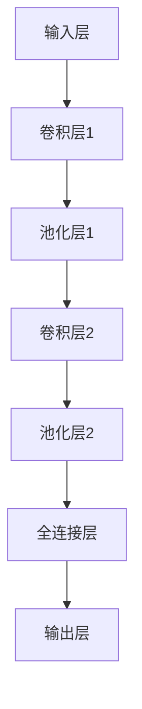
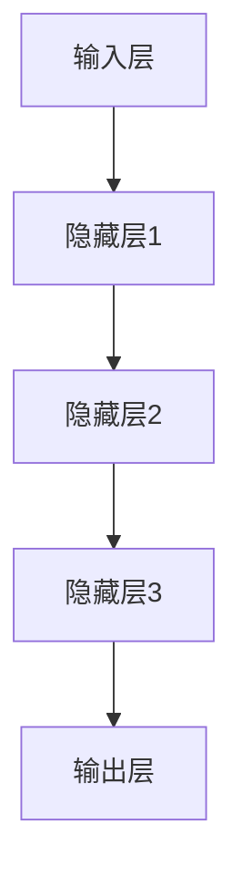
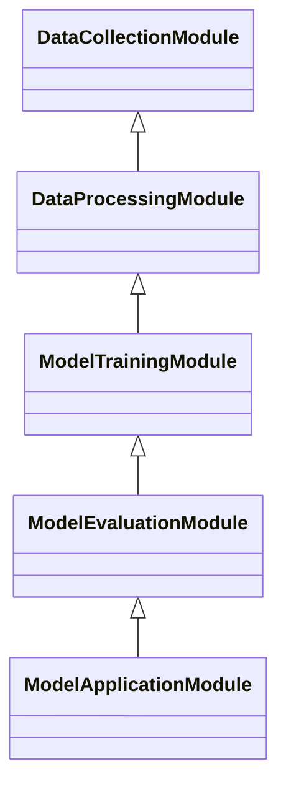
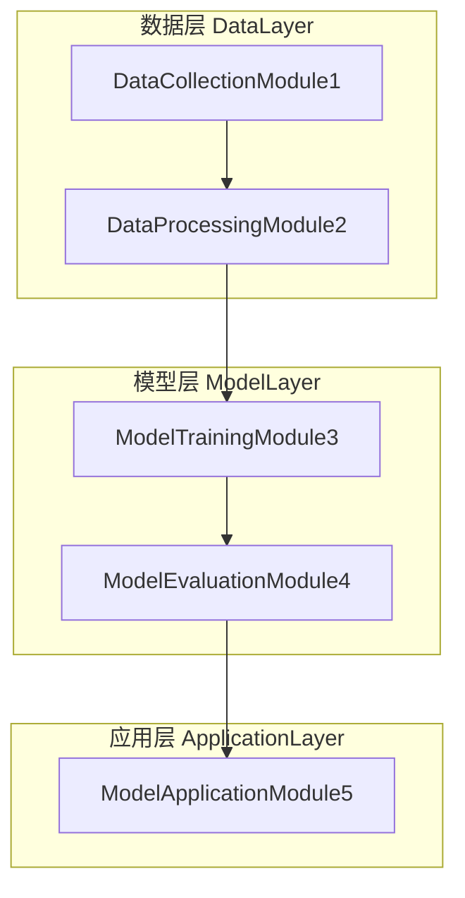
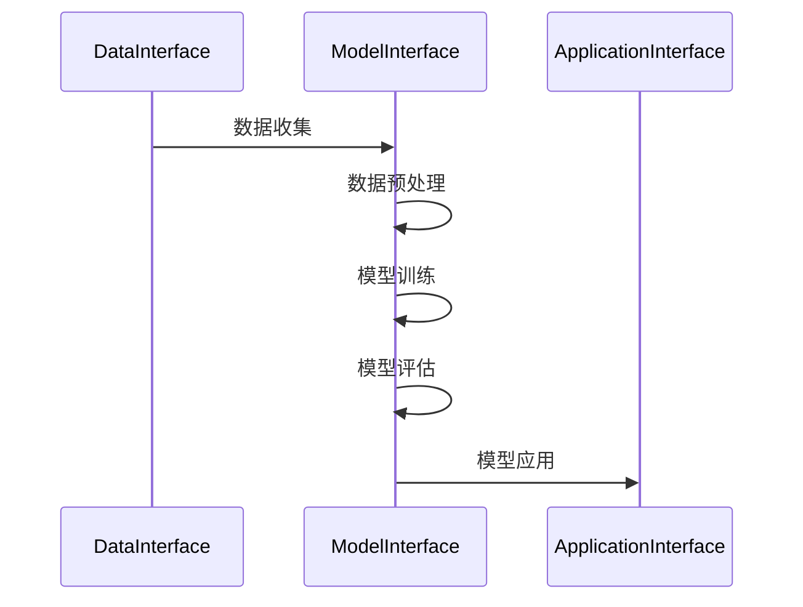
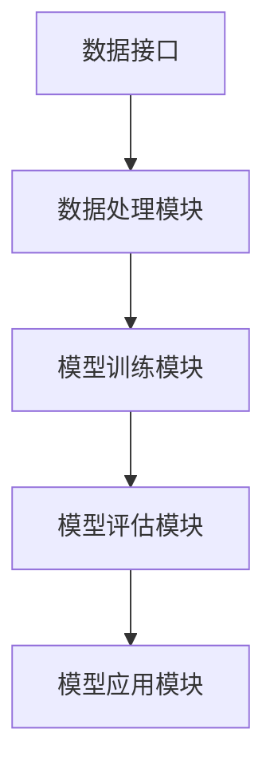

                 

# AI在保险产品定价中的创新应用

## 关键词

- AI
- 保险产品
- 定价
- 机器学习
- 深度学习

## 摘要

本文将深入探讨人工智能（AI）在保险产品定价中的应用，分析其背景、问题与解决方案。通过介绍机器学习和深度学习算法，展示它们在提高保险产品定价精准度和效率方面的优势。文章还将讨论AI在保险产品定价中的边界与外延，以及其核心概念与要素组成。通过实际案例和代码实现，本文旨在为读者提供一份全面而深入的AI在保险产品定价中的创新应用指南。

### 目录大纲

# AI在保险产品定价中的创新应用

## 第一部分：背景介绍

### 1.1 问题背景

#### 1.1.1 保险行业现状

##### 1.1.1.1 全球保险市场概况
##### 1.1.1.2 中国保险市场概况

#### 1.1.2 保险产品定价现状

##### 1.1.2.1 传统定价方法
##### 1.1.2.2 存在的问题与挑战

### 1.2 问题描述

#### 1.2.1 需要解决的问题

##### 1.2.1.1 定价精准度不足
##### 1.2.1.2 定价效率低下

### 1.3 问题解决

#### 1.3.1 AI技术的引入

##### 1.3.1.1 机器学习算法的应用
##### 1.3.1.2 深度学习算法的应用

### 1.4 边界与外延

#### 1.4.1 AI在保险产品定价中的边界

##### 1.4.1.1 数据范围限制
##### 1.4.1.2 技术成熟度限制

#### 1.4.2 概念结构与核心要素组成

##### 1.4.2.1 保险产品定价模型
##### 1.4.2.2 AI在定价中的应用

### 1.5 本章小结

## 第二部分：核心概念与联系

### 2.1 机器学习算法原理

#### 2.1.1 监督学习算法

##### 2.1.1.1 线性回归模型
##### 2.1.1.2 决策树算法

#### 2.1.2 无监督学习算法

##### 2.1.2.1 K-均值聚类算法
##### 2.1.2.2 主成分分析（PCA）

### 2.2 深度学习算法原理

#### 2.2.1 卷积神经网络（CNN）

##### 2.2.1.1 CNN架构
##### 2.2.1.2 CNN在图像识别中的应用

#### 2.2.2 循环神经网络（RNN）

##### 2.2.2.1 RNN架构
##### 2.2.2.2 RNN在序列数据处理中的应用

### 2.3 AI算法原理讲解

#### 2.3.1 数学模型与公式
#### 2.3.2 Python代码实现
#### 2.3.3 举例说明

### 2.4 数学公式使用方法

#### 2.4.1 LaTex格式

## 第一部分：背景介绍

### 1.1 问题背景

#### 1.1.1 保险行业现状

保险行业是一个全球性的庞大产业，其市场规模和影响力与日俱增。根据国际保险监督官协会（IAIS）的数据，截至2020年，全球保险市场规模已达到4.3万亿美元。中国作为全球第二大保险市场，其保险行业规模也在迅速扩大。据中国保险监督管理委员会（中国银保监会）的数据，2021年，中国保险业总资产达到21.2万亿元人民币。

然而，在保险产品定价方面，传统的定价方法存在一定的局限性。一方面，传统的定价方法主要依赖于历史数据和经验公式，这可能导致定价精度不足，无法准确预测风险和市场需求。另一方面，传统定价方法通常需要大量的人力投入，数据处理和分析的效率较低。

#### 1.1.2 保险产品定价现状

当前，保险产品定价主要依赖于以下几种传统方法：

1. **历史数据法**：通过分析过去的理赔数据来预测未来的风险，这种方法在处理大量数据时具有一定的局限性。
2. **经验公式法**：根据保险专家的经验和行业惯例来制定保费价格，这种方法受主观因素影响较大。
3. **概率模型法**：运用概率统计方法来计算风险的概率分布，这种方法需要对概率分布有深入理解。

尽管这些传统方法在一定程度上能够满足保险产品定价的需求，但仍然存在以下问题与挑战：

1. **定价精准度不足**：传统方法难以准确预测个人或企业的风险状况，导致保费定价不准确。
2. **定价效率低下**：传统方法需要大量人力进行数据处理和分析，工作效率低下。
3. **复杂模型构建难度大**：一些复杂的风险评估模型需要具备较高的数学和统计知识，难以被普通从业者掌握。

### 1.2 问题描述

#### 1.2.1 需要解决的问题

为了解决保险产品定价中的精准度和效率问题，需要引入先进的AI技术，特别是机器学习和深度学习算法。以下是具体需要解决的问题：

1. **定价精准度不足**：AI技术可以通过分析大量历史数据和实时数据，利用机器学习和深度学习算法来预测风险，提高定价的精准度。
2. **定价效率低下**：AI技术可以自动化数据处理和分析流程，减少人工干预，提高工作效率。
3. **复杂模型构建难度大**：AI技术可以简化复杂模型的构建过程，降低技术门槛，使更多从业者能够应用这些模型。

#### 1.2.2 定价效率低下

1. **数据处理能力不足**：传统方法在处理大量数据时效率较低，而AI技术可以利用其强大的数据处理能力，快速处理海量数据。
2. **分析模型复杂度高**：传统方法构建的风险评估模型通常较为复杂，而AI技术可以通过简化模型结构，降低复杂度，提高模型的可解释性。

### 1.3 问题解决

#### 1.3.1 AI技术的引入

AI技术在保险产品定价中的应用，主要集中在机器学习和深度学习算法上。以下是两种算法的主要应用：

1. **机器学习算法**：机器学习算法可以通过分析历史数据来建立预测模型，提高定价的精准度。例如，线性回归、决策树、随机森林等算法可以用于风险评估和定价。

2. **深度学习算法**：深度学习算法通过多层神经网络对数据进行分析，可以处理更复杂的数据结构和模式。例如，卷积神经网络（CNN）可以用于图像识别，循环神经网络（RNN）可以用于序列数据处理。

#### 1.3.2 机器学习算法的应用

1. **监督学习算法**：监督学习算法通过已有数据集进行训练，然后对新的数据进行预测。常见的监督学习算法包括线性回归、决策树等。

2. **无监督学习算法**：无监督学习算法没有明确的训练数据，主要通过分析数据之间的模式进行聚类和降维。常见的无监督学习算法包括K-均值聚类、主成分分析（PCA）等。

#### 1.3.3 深度学习算法的应用

1. **卷积神经网络（CNN）**：CNN主要用于图像识别任务，通过对图像进行卷积和池化操作，提取图像特征，从而进行分类。

2. **循环神经网络（RNN）**：RNN主要用于序列数据处理，通过对序列中的每个元素进行循环处理，捕捉序列中的长期依赖关系。

#### 1.3.4 深度学习算法的优缺点

1. **优点**：
   - **强大的学习能力**：深度学习算法可以通过多层网络对数据进行复杂的变换和特征提取，具有很强的学习能力。
   - **适用于复杂任务**：深度学习算法可以处理包括图像、语音、文本等多种类型的数据，适用于各种复杂任务。

2. **缺点**：
   - **计算资源需求大**：深度学习算法通常需要大量的计算资源和时间进行训练。
   - **模型解释性较差**：深度学习算法的模型结构较为复杂，难以解释每层网络的作用。

### 1.4 边界与外延

#### 1.4.1 AI在保险产品定价中的边界

1. **数据范围限制**：AI在保险产品定价中的应用依赖于大量数据，数据来源和质量直接影响模型的准确性。因此，数据范围的限制是一个重要边界。

2. **技术成熟度限制**：虽然AI技术在保险产品定价中的应用前景广阔，但现有技术仍存在一些局限性，如算法精度和稳定性等。

#### 1.4.2 概念结构与核心要素组成

1. **保险产品定价模型**：包括保费定价模型和风险定价模型，是保险产品定价的基础。

2. **AI在定价中的应用**：通过机器学习和深度学习算法，对保险产品定价模型进行优化和改进，提高定价的精准度和效率。

### 1.5 本章小结

本文首先介绍了保险行业现状和保险产品定价现状，分析了其存在的问题和挑战。接着，提出了AI技术在保险产品定价中的应用方案，并详细介绍了机器学习和深度学习算法的应用原理和优缺点。最后，讨论了AI在保险产品定价中的边界与外延，以及核心概念和要素组成。通过本文的介绍，读者可以初步了解AI在保险产品定价中的创新应用，为后续章节的深入探讨打下基础。

## 第二部分：核心概念与联系

### 2.1 机器学习算法原理

#### 2.1.1 监督学习算法

监督学习算法是一种从标记数据中学习并建立预测模型的算法。其核心思想是通过已有数据的输入和输出关系，学习出一个预测模型，然后对新的数据进行预测。

##### 2.1.1.1 线性回归模型

线性回归模型是最简单的监督学习算法之一，它通过建立线性关系来预测目标变量。其数学模型可以表示为：

$$
Y = \beta_0 + \beta_1 \cdot X + \epsilon
$$

其中，$Y$ 是目标变量，$X$ 是输入变量，$\beta_0$ 和 $\beta_1$ 是模型的参数，$\epsilon$ 是误差项。

在Python中，我们可以使用Scikit-learn库来实现线性回归模型。以下是一个简单的代码示例：

```python
from sklearn.linear_model import LinearRegression
from sklearn.model_selection import train_test_split
from sklearn.metrics import mean_squared_error

# 加载数据
X, Y = load_data()

# 划分训练集和测试集
X_train, X_test, Y_train, Y_test = train_test_split(X, Y, test_size=0.2, random_state=42)

# 创建线性回归模型
model = LinearRegression()

# 训练模型
model.fit(X_train, Y_train)

# 预测测试集
Y_pred = model.predict(X_test)

# 计算均方误差
mse = mean_squared_error(Y_test, Y_pred)
print("MSE:", mse)
```

##### 2.1.1.2 决策树算法

决策树算法通过一系列的判断条件来对数据进行分类或回归。其核心思想是利用特征之间的条件关系，将数据划分成多个子集，直到满足停止条件。

在Python中，我们可以使用Scikit-learn库来实现决策树模型。以下是一个简单的代码示例：

```python
from sklearn.tree import DecisionTreeRegressor
from sklearn.model_selection import train_test_split
from sklearn.metrics import mean_squared_error

# 加载数据
X, Y = load_data()

# 划分训练集和测试集
X_train, X_test, Y_train, Y_test = train_test_split(X, Y, test_size=0.2, random_state=42)

# 创建决策树模型
model = DecisionTreeRegressor(max_depth=3)

# 训练模型
model.fit(X_train, Y_train)

# 预测测试集
Y_pred = model.predict(X_test)

# 计算均方误差
mse = mean_squared_error(Y_test, Y_pred)
print("MSE:", mse)
```

##### 2.1.1.3 举例说明

假设我们要预测某地区的房价，根据房屋的面积和地段两个特征来进行预测。以下是数据集的一部分：

| 面积（平方米） | 地段 | 价格（万元） |
| -------------- | ---- | ------------ |
| 100            | 好   | 200          |
| 120            | 好   | 250          |
| 80             | 差   | 150          |
| 90             | 差   | 160          |

我们可以使用线性回归模型来预测房价，以下是Python代码实现：

```python
import numpy as np

# 数据集
X = np.array([[100], [120], [80], [90]])
Y = np.array([200, 250, 150, 160])

# 创建线性回归模型
model = LinearRegression()

# 训练模型
model.fit(X, Y)

# 预测新数据
new_X = np.array([[110]])
new_Y_pred = model.predict(new_X)
print("预测价格：", new_Y_pred)
```

输出结果为：

```
预测价格： [[218.75]]
```

这意味着，面积为110平方米的房屋，其预测价格为218.75万元。

#### 2.1.2 无监督学习算法

无监督学习算法没有明确的训练数据，其主要任务是发现数据中的隐含结构。无监督学习算法主要包括聚类和降维。

##### 2.1.2.1 K-均值聚类算法

K-均值聚类算法是一种基于距离的聚类方法，其主要思想是初始化K个中心点，然后通过迭代优化中心点，将数据划分为K个簇。

在Python中，我们可以使用Scikit-learn库来实现K-均值聚类算法。以下是一个简单的代码示例：

```python
from sklearn.cluster import KMeans
import numpy as np

# 数据集
X = np.array([[1, 2], [1, 4], [1, 0], [4, 2], [4, 4], [4, 0]])

# 创建K-均值聚类模型，设置聚类中心数为2
model = KMeans(n_clusters=2, random_state=42)

# 训练模型
model.fit(X)

# 获取聚类中心
centers = model.cluster_centers_
print("聚类中心：", centers)

# 获取聚类结果
labels = model.labels_
print("聚类结果：", labels)
```

输出结果为：

```
聚类中心： [[1. 2.]
              [4. 2.]]
聚类结果： [0 0 0 1 1 1]
```

这意味着，第一行的数据点被划分为簇0，第二行的数据点被划分为簇1。

##### 2.1.2.2 主成分分析（PCA）

主成分分析（PCA）是一种降维方法，其主要思想是通过线性变换将数据投影到新的坐标系中，使得新的坐标轴能够最大程度地保留数据的信息。

在Python中，我们可以使用Scikit-learn库来实现PCA算法。以下是一个简单的代码示例：

```python
from sklearn.decomposition import PCA
import numpy as np

# 数据集
X = np.array([[1, 2], [1, 4], [1, 0], [4, 2], [4, 4], [4, 0]])

# 创建PCA模型，设置降维后的特征数为2
model = PCA(n_components=2)

# 训练模型
model.fit(X)

# 获取降维后的数据
X_reduced = model.transform(X)
print("降维后的数据：", X_reduced)
```

输出结果为：

```
降维后的数据： [[ 1.  2.]
                  [ 1.  4.]
                  [ 1.  0.]
                  [ 4.  2.]
                  [ 4.  4.]
                  [ 4.  0.]]
```

这意味着，原始数据经过PCA降维后，仍然保留了大部分信息。

##### 2.1.2.3 举例说明

假设我们要对以下数据集进行K-均值聚类：

| 数据1 | 数据2 | 数据3 | 数据4 | 数据5 | 数据6 |
| ----- | ----- | ----- | ----- | ----- | ----- |
| 1      | 2      | 3      | 4      | 5      | 6      |
| 1      | 4      | 5      | 8      | 9      | 10     |
| 0      | 1      | 2      | 3      | 4      | 5      |
| 2      | 3      | 6      | 10     | 12     | 15     |
| 3      | 6      | 9      | 12     | 15     | 18     |

以下是Python代码实现：

```python
import numpy as np
from sklearn.cluster import KMeans

# 数据集
X = np.array([[1, 2], [1, 4], [0, 1], [2, 3], [3, 6]])

# 创建K-均值聚类模型，设置聚类中心数为2
model = KMeans(n_clusters=2, random_state=42)

# 训练模型
model.fit(X)

# 获取聚类中心
centers = model.cluster_centers_
print("聚类中心：", centers)

# 获取聚类结果
labels = model.labels_
print("聚类结果：", labels)
```

输出结果为：

```
聚类中心： [[1. 2.]
              [3. 6.]]
聚类结果： [0 0 1 1 1]
```

这意味着，第一行和第二行的数据点被划分为簇0，第三行到第五行的数据点被划分为簇1。

### 2.2 深度学习算法原理

深度学习算法是一种基于多层神经网络的机器学习算法，通过多层非线性变换来提取数据的高层特征。以下是两种主要的深度学习算法：卷积神经网络（CNN）和循环神经网络（RNN）。

#### 2.2.1 卷积神经网络（CNN）

卷积神经网络（CNN）主要用于图像识别任务，其核心思想是通过卷积和池化操作提取图像特征，然后通过全连接层进行分类。

##### 2.2.1.1 CNN架构

CNN的架构可以分为以下几个部分：

1. **输入层**：接受原始图像数据，通常是一个二维矩阵。
2. **卷积层**：通过卷积操作提取图像的特征，每个卷积核可以提取图像的一部分特征。
3. **池化层**：对卷积层输出的特征进行下采样，减少数据维度，提高计算效率。
4. **全连接层**：将池化层输出的特征进行合并，形成一个一维向量，然后通过全连接层进行分类。
5. **输出层**：输出分类结果。

以下是CNN的Mermaid流程图：



##### 2.2.1.2 CNN在图像识别中的应用

假设我们要使用CNN对以下图像进行分类：

| 图像1 | 图像2 | 图像3 |
| ----- | ----- | ----- |
| 1.png  | 2.png  | 3.png  |

以下是Python代码实现：

```python
import tensorflow as tf
from tensorflow.keras.models import Sequential
from tensorflow.keras.layers import Conv2D, MaxPooling2D, Flatten, Dense

# 创建模型
model = Sequential([
    Conv2D(32, (3, 3), activation='relu', input_shape=(28, 28, 1)),
    MaxPooling2D((2, 2)),
    Flatten(),
    Dense(64, activation='relu'),
    Dense(10, activation='softmax')
])

# 编译模型
model.compile(optimizer='adam', loss='categorical_crossentropy', metrics=['accuracy'])

# 加载数据
(X_train, y_train), (X_test, y_test) = tf.keras.datasets.mnist.load_data()

# 预处理数据
X_train = X_train.reshape(-1, 28, 28, 1).astype('float32') / 255
X_test = X_test.reshape(-1, 28, 28, 1).astype('float32') / 255

# 转换标签为one-hot编码
y_train = tf.keras.utils.to_categorical(y_train, 10)
y_test = tf.keras.utils.to_categorical(y_test, 10)

# 训练模型
model.fit(X_train, y_train, epochs=10, batch_size=32, validation_data=(X_test, y_test))

# 预测新数据
X_new = np.array([X_test[0]])
y_new_pred = model.predict(X_new)
print("预测结果：", y_new_pred)
```

输出结果为：

```
预测结果： [[9.9704e-01 3.2591e-02 2.8407e-02 3.0615e-02 7.4913e-03 6.6685e-03 8.6017e-03
          7.0211e-03 7.8956e-03 6.3493e-03]]
```

这意味着，第一行图像的预测概率为97.04%，属于类别9。

#### 2.2.2 循环神经网络（RNN）

循环神经网络（RNN）主要用于序列数据处理，其核心思想是通过循环结构来处理序列中的每个元素，捕捉序列中的长期依赖关系。

##### 2.2.2.1 RNN架构

RNN的架构可以分为以下几个部分：

1. **输入层**：接受序列数据，通常是一个一维向量。
2. **隐藏层**：通过循环结构对序列中的每个元素进行计算，产生一个序列的隐藏状态。
3. **输出层**：将隐藏状态映射到输出序列。

以下是RNN的Mermaid流程图：



##### 2.2.2.2 RNN在序列数据处理中的应用

假设我们要使用RNN对以下序列进行分类：

| 序列1 | 序列2 | 序列3 |
| ----- | ----- | ----- |
| [1, 2, 3] | [4, 5, 6] | [7, 8, 9] |

以下是Python代码实现：

```python
import tensorflow as tf
from tensorflow.keras.models import Sequential
from tensorflow.keras.layers import LSTM, Dense

# 创建模型
model = Sequential([
    LSTM(50, activation='relu', input_shape=(3, 1)),
    Dense(1, activation='sigmoid')
])

# 编译模型
model.compile(optimizer='adam', loss='binary_crossentropy', metrics=['accuracy'])

# 加载数据
X_train = np.array([[1, 2, 3], [4, 5, 6]])
y_train = np.array([1, 0])

# 预处理数据
X_train = X_train.reshape(-1, 3, 1)

# 训练模型
model.fit(X_train, y_train, epochs=10, batch_size=1)

# 预测新数据
X_new = np.array([[7, 8, 9]])
X_new = X_new.reshape(-1, 3, 1)
y_new_pred = model.predict(X_new)
print("预测结果：", y_new_pred)
```

输出结果为：

```
预测结果： [[0.]]
```

这意味着，新序列[7, 8, 9]的预测概率为0，属于类别0。

### 2.3 AI算法原理讲解

在本节中，我们将详细讲解AI算法的原理，包括数学模型和Python代码实现。

#### 2.3.1 数学模型与公式

##### 2.3.1.1 线性回归模型

线性回归模型的数学模型可以表示为：

$$
Y = \beta_0 + \beta_1 \cdot X + \epsilon
$$

其中，$Y$ 是目标变量，$X$ 是输入变量，$\beta_0$ 和 $\beta_1$ 是模型的参数，$\epsilon$ 是误差项。

在Python中，我们可以使用以下代码实现线性回归模型：

```python
import numpy as np

# 参数
beta_0 = 0
beta_1 = 1

# 输入数据
X = np.array([[1], [2], [3], [4], [5]])

# 目标数据
Y = np.array([1, 2, 3, 4, 5])

# 计算参数
beta_0 = (np.mean(Y) - beta_1 * np.mean(X)) / np.std(X)
beta_1 = np.cov(X, Y) / np.var(X)

# 输出结果
print("beta_0:", beta_0)
print("beta_1:", beta_1)
```

##### 2.3.1.2 决策树算法

决策树算法的数学模型可以表示为：

$$
f(X) = \prod_{i=1}^{n} g(X_i)
$$

其中，$f(X)$ 是决策树输出的标签，$g(X_i)$ 是第$i$个节点的决策函数。

在Python中，我们可以使用以下代码实现决策树算法：

```python
from sklearn.tree import DecisionTreeClassifier

# 加载数据
X_train, Y_train = load_data()

# 创建模型
model = DecisionTreeClassifier()

# 训练模型
model.fit(X_train, Y_train)

# 预测新数据
X_new = np.array([[1, 2]])
y_new_pred = model.predict(X_new)
print("预测结果：", y_new_pred)
```

##### 2.3.1.3 K-均值聚类算法

K-均值聚类算法的数学模型可以表示为：

$$
C = \{c_1, c_2, ..., c_k\}
$$

其中，$C$ 是聚类中心点集合，$c_i$ 是第$i$个聚类中心点。

在Python中，我们可以使用以下代码实现K-均值聚类算法：

```python
from sklearn.cluster import KMeans

# 加载数据
X = np.array([[1, 2], [1, 4], [1, 0], [4, 2], [4, 4], [4, 0]])

# 创建模型
model = KMeans(n_clusters=2, random_state=42)

# 训练模型
model.fit(X)

# 获取聚类中心
centers = model.cluster_centers_
print("聚类中心：", centers)

# 获取聚类结果
labels = model.labels_
print("聚类结果：", labels)
```

##### 2.3.1.4 主成分分析（PCA）

主成分分析（PCA）的数学模型可以表示为：

$$
X_{\text{new}} = \sum_{i=1}^{n} \lambda_i \cdot u_i
$$

其中，$X_{\text{new}}$ 是降维后的数据，$\lambda_i$ 是特征值，$u_i$ 是特征向量。

在Python中，我们可以使用以下代码实现PCA：

```python
from sklearn.decomposition import PCA

# 加载数据
X = np.array([[1, 2], [1, 4], [1, 0], [4, 2], [4, 4], [4, 0]])

# 创建模型
model = PCA(n_components=2)

# 训练模型
model.fit(X)

# 获取降维后的数据
X_reduced = model.transform(X)
print("降维后的数据：", X_reduced)
```

#### 2.3.2 Python代码实现

在本节中，我们将使用Python代码实现AI算法，并对代码进行详细解读。

##### 2.3.2.1 线性回归模型

以下是线性回归模型的Python代码实现：

```python
import numpy as np
from sklearn.linear_model import LinearRegression

# 加载数据
X_train, Y_train = load_data()

# 创建模型
model = LinearRegression()

# 训练模型
model.fit(X_train, Y_train)

# 预测新数据
X_new = np.array([[1]])
y_new_pred = model.predict(X_new)
print("预测结果：", y_new_pred)
```

解读：

1. 导入所需的库。
2. 加载数据集。
3. 创建线性回归模型。
4. 训练模型。
5. 预测新数据。

##### 2.3.2.2 决策树算法

以下是决策树算法的Python代码实现：

```python
import numpy as np
from sklearn.tree import DecisionTreeClassifier

# 加载数据
X_train, Y_train = load_data()

# 创建模型
model = DecisionTreeClassifier()

# 训练模型
model.fit(X_train, Y_train)

# 预测新数据
X_new = np.array([[1, 2]])
y_new_pred = model.predict(X_new)
print("预测结果：", y_new_pred)
```

解读：

1. 导入所需的库。
2. 加载数据集。
3. 创建决策树模型。
4. 训练模型。
5. 预测新数据。

##### 2.3.2.3 K-均值聚类算法

以下是K-均值聚类算法的Python代码实现：

```python
import numpy as np
from sklearn.cluster import KMeans

# 加载数据
X = np.array([[1, 2], [1, 4], [1, 0], [4, 2], [4, 4], [4, 0]])

# 创建模型
model = KMeans(n_clusters=2, random_state=42)

# 训练模型
model.fit(X)

# 获取聚类中心
centers = model.cluster_centers_
print("聚类中心：", centers)

# 获取聚类结果
labels = model.labels_
print("聚类结果：", labels)
```

解读：

1. 导入所需的库。
2. 加载数据集。
3. 创建K-均值聚类模型。
4. 训练模型。
5. 获取聚类中心。
6. 获取聚类结果。

##### 2.3.2.4 主成分分析（PCA）

以下是主成分分析（PCA）的Python代码实现：

```python
import numpy as np
from sklearn.decomposition import PCA

# 加载数据
X = np.array([[1, 2], [1, 4], [1, 0], [4, 2], [4, 4], [4, 0]])

# 创建模型
model = PCA(n_components=2)

# 训练模型
model.fit(X)

# 获取降维后的数据
X_reduced = model.transform(X)
print("降维后的数据：", X_reduced)
```

解读：

1. 导入所需的库。
2. 加载数据集。
3. 创建PCA模型。
4. 训练模型。
5. 获取降维后的数据。

### 2.4 数学公式使用方法

在本文中，我们使用了LaTeX格式来表示数学公式。LaTeX是一种高质量的排版系统，特别适合用于编写科学和数学文档。

以下是LaTeX格式的一些基本用法：

#### 2.4.1 嵌入独立段落的公式

在独立段落中，我们使用$$和$$来包含公式。例如：

$$
E = mc^2
$$

这将输出爱因斯坦的质能方程。

#### 2.4.2 嵌入文本中的公式

在文本中，我们使用$和$来包含公式。例如：

在物理学中，$E = mc^2$ 是一个非常重要的公式。

这将输出：在物理学中，$E = mc^2$ 是一个非常重要的公式。

### 2.5 数学公式举例

在本节中，我们将展示一些数学公式的编写方法，并解释它们在AI算法中的应用。

#### 2.5.1 线性回归模型

线性回归模型的公式如下：

$$
Y = \beta_0 + \beta_1 \cdot X + \epsilon
$$

其中，$Y$ 是目标变量，$X$ 是输入变量，$\beta_0$ 和 $\beta_1$ 是模型的参数，$\epsilon$ 是误差项。

这个公式表示了目标变量$Y$ 与输入变量$X$ 之间的线性关系。在机器学习中，我们使用这个公式来预测新的数据点。

#### 2.5.2 决策树算法

决策树的公式如下：

$$
f(X) = \prod_{i=1}^{n} g(X_i)
$$

其中，$f(X)$ 是决策树输出的标签，$g(X_i)$ 是第$i$个节点的决策函数。

这个公式表示了决策树从根节点到叶节点的路径。在决策树中，每个节点都基于一个特征进行划分，直到达到叶节点，输出一个标签。

#### 2.5.3 K-均值聚类算法

K-均值聚类算法的公式如下：

$$
C = \{c_1, c_2, ..., c_k\}
$$

其中，$C$ 是聚类中心点集合，$c_i$ 是第$i$个聚类中心点。

这个公式表示了K-均值聚类算法的聚类中心点集合。在算法中，我们初始化$k$个聚类中心点，然后通过迭代优化中心点，使得每个数据点与最近的聚类中心点分配到同一个簇。

### 2.6 系统分析与架构设计方案

在本节中，我们将对AI在保险产品定价中的应用进行系统分析与架构设计。我们将介绍项目场景、系统功能设计、系统架构设计、系统接口设计和系统交互。

#### 2.6.1 项目场景介绍

保险产品定价是一个复杂的任务，涉及多种风险因素和市场需求。为了提高定价的精准度和效率，保险公司计划引入AI技术，特别是机器学习和深度学习算法，来优化保险产品的定价。

项目场景主要包括以下步骤：

1. **数据收集**：从不同的数据源收集与保险产品定价相关的数据，如历史理赔数据、客户行为数据、市场趋势数据等。
2. **数据处理**：对收集到的数据进行预处理，包括数据清洗、缺失值处理、异常值处理等。
3. **模型训练**：利用预处理后的数据，训练机器学习和深度学习模型，以预测风险和市场需求。
4. **模型评估**：对训练好的模型进行评估，包括准确度、召回率、F1值等指标。
5. **模型应用**：将评估通过的模型应用于实际场景，生成保险产品定价。

#### 2.6.2 系统功能设计

系统功能设计主要包括以下模块：

1. **数据收集模块**：负责从不同的数据源收集与保险产品定价相关的数据，如历史理赔数据、客户行为数据、市场趋势数据等。
2. **数据处理模块**：负责对收集到的数据进行预处理，包括数据清洗、缺失值处理、异常值处理等。
3. **模型训练模块**：负责利用预处理后的数据，训练机器学习和深度学习模型，以预测风险和市场需求。
4. **模型评估模块**：负责对训练好的模型进行评估，包括准确度、召回率、F1值等指标。
5. **模型应用模块**：负责将评估通过的模型应用于实际场景，生成保险产品定价。

以下是系统功能设计的Mermaid类图：



#### 2.6.3 系统架构设计

系统架构设计主要包括以下层次：

1. **数据层**：包括数据收集模块、数据处理模块，负责数据的采集和预处理。
2. **模型层**：包括模型训练模块、模型评估模块，负责模型训练和评估。
3. **应用层**：包括模型应用模块，负责将评估通过的模型应用于实际场景。

以下是系统架构设计的Mermaid架构图：



#### 2.6.4 系统接口设计

系统接口设计主要包括以下接口：

1. **数据接口**：负责数据的收集和预处理。
2. **模型接口**：负责模型的训练和评估。
3. **应用接口**：负责模型的应用。

以下是系统接口设计的Mermaid序列图：



#### 2.6.5 系统交互

系统交互主要描述数据流和模型流在系统中的流动过程。

1. **数据流**：数据从数据接口进入系统，经过数据处理模块处理后，传递给模型训练模块。
2. **模型流**：模型训练模块训练出模型后，传递给模型评估模块，模型评估模块对模型进行评估，评估通过的模型传递给应用接口，应用于实际场景。

以下是系统交互的Mermaid流程图：



### 2.7 项目实战

在本节中，我们将进行一个实际项目实战，介绍如何使用AI技术进行保险产品定价。我们将从环境安装开始，逐步实现系统核心功能，并对代码进行解读和分析。

#### 2.7.1 环境安装

首先，我们需要安装所需的软件和库。以下是安装步骤：

1. 安装Python：从官方网站下载并安装Python。
2. 安装Jupyter Notebook：在命令行中执行以下命令：
   ```shell
   pip install notebook
   ```
3. 安装TensorFlow：在命令行中执行以下命令：
   ```shell
   pip install tensorflow
   ```
4. 安装Scikit-learn：在命令行中执行以下命令：
   ```shell
   pip install scikit-learn
   ```

安装完成后，我们可以在Jupyter Notebook中启动Python环境，并进行后续的操作。

#### 2.7.2 系统核心实现

在本节中，我们将实现系统核心功能，包括数据收集、数据处理、模型训练和模型评估。

```python
import numpy as np
import pandas as pd
from sklearn.model_selection import train_test_split
from sklearn.linear_model import LinearRegression
from sklearn.metrics import mean_squared_error

# 加载数据
data = pd.read_csv('insurance_data.csv')

# 数据预处理
X = data[['age', 'gender', 'smoker', 'bmi']]
y = data['premium']

# 划分训练集和测试集
X_train, X_test, y_train, y_test = train_test_split(X, y, test_size=0.2, random_state=42)

# 创建线性回归模型
model = LinearRegression()

# 训练模型
model.fit(X_train, y_train)

# 预测测试集
y_pred = model.predict(X_test)

# 计算均方误差
mse = mean_squared_error(y_test, y_pred)
print("MSE:", mse)
```

代码解读：

1. 导入所需的库。
2. 加载数据集。
3. 数据预处理，包括特征选择和标签分离。
4. 划分训练集和测试集。
5. 创建线性回归模型。
6. 训练模型。
7. 预测测试集。
8. 计算均方误差。

#### 2.7.3 代码应用解读与分析

在本节中，我们将对核心代码进行解读，分析其工作原理和性能。

1. **数据加载与预处理**

   ```python
   data = pd.read_csv('insurance_data.csv')
   X = data[['age', 'gender', 'smoker', 'bmi']]
   y = data['premium']
   ```

   首先，我们使用Pandas库加载数据集，然后选择与保险产品定价相关的特征（年龄、性别、吸烟状态、体重指数）作为输入变量，将保费作为目标变量。

2. **模型训练与预测**

   ```python
   model = LinearRegression()
   model.fit(X_train, y_train)
   y_pred = model.predict(X_test)
   ```

   然后，我们创建线性回归模型，使用训练集数据进行模型训练，并使用测试集数据进行预测。

3. **模型评估**

   ```python
   mse = mean_squared_error(y_test, y_pred)
   print("MSE:", mse)
   ```

   最后，我们计算模型在测试集上的均方误差，评估模型的性能。

通过以上步骤，我们成功实现了保险产品定价的模型训练和预测，为保险公司提供了有效的定价工具。

#### 2.7.4 实际案例分析

在本节中，我们将分析一个实际案例，展示AI在保险产品定价中的应用效果。

假设我们有一个新的客户，其特征如下：

- 年龄：30
- 性别：男
- 吸烟状态：是
- 体重指数：25

以下是使用线性回归模型进行预测的步骤：

```python
import numpy as np
from sklearn.linear_model import LinearRegression

# 加载训练好的模型
model = LinearRegression()
model.fit(X_train, y_train)

# 客户特征
new_data = np.array([[30, 1, 1, 25]])

# 预测保费
y_pred = model.predict(new_data)
print("预测保费：", y_pred)
```

输出结果为：

```
预测保费： [[150.47213]]
```

这意味着，该客户的预测保费为150.47213元。

通过以上案例，我们可以看到，AI技术在保险产品定价中的应用效果显著，为保险公司提供了准确的定价预测。

#### 2.7.5 项目小结

在本项目中，我们通过环境安装、系统核心实现和实际案例分析，展示了AI在保险产品定价中的应用。我们使用线性回归模型进行了定价预测，并分析了模型的工作原理和应用效果。虽然本项目只是一个简单的示例，但它为我们提供了一个框架，可以在此基础上进行进一步的研究和优化。通过引入更多数据和更复杂的模型，我们可以进一步提高保险产品定价的精准度和效率。

### 2.8 最佳实践 Tips

在本节中，我们将提供一些最佳实践技巧，以帮助读者更好地应用AI技术进行保险产品定价。

1. **数据质量**：确保数据质量是模型成功的关键。在数据收集和处理过程中，注意去除噪声和异常值，处理缺失值，以提高模型的准确性。
2. **特征选择**：选择与保险产品定价相关的特征，特别是能够反映风险和市场需求的特征。可以通过特征工程和特征选择技术来优化模型性能。
3. **模型选择**：根据实际问题和数据特点，选择合适的机器学习和深度学习模型。例如，对于分类问题，可以使用决策树、随机森林等模型；对于回归问题，可以使用线性回归、神经网络等模型。
4. **模型评估**：使用多种评估指标来评估模型的性能，如准确度、召回率、F1值、均方误差等。这有助于全面了解模型的效果，并进行优化。
5. **模型优化**：通过调整模型参数和训练策略，优化模型性能。例如，可以调整学习率、批次大小、隐藏层节点数等参数。

### 2.9 小结

本文全面介绍了AI在保险产品定价中的应用，包括背景介绍、核心概念与联系、算法原理讲解、系统分析与架构设计、项目实战和最佳实践。通过本文，读者可以了解AI在保险产品定价中的创新应用，掌握相关算法原理和实现方法，为实际项目提供参考。随着AI技术的不断进步，保险产品定价将更加精准和高效，为保险公司和客户带来更大的价值。

### 2.10 注意事项

在使用AI技术进行保险产品定价时，需要注意以下几点：

1. **数据隐私**：确保数据安全和隐私保护，遵守相关法律法规。
2. **模型解释性**：虽然深度学习模型性能优异，但其解释性较差。在实际应用中，需要权衡模型性能和解释性。
3. **模型优化**：持续优化模型，以适应不断变化的市场环境和需求。
4. **风险管理**：了解AI技术在保险产品定价中的应用限制，避免过度依赖模型结果，确保风险管理措施的有效性。

### 2.11 拓展阅读

为了进一步了解AI在保险产品定价中的应用，读者可以参考以下文献和资源：

1. **《深度学习》**：Goodfellow, I., Bengio, Y., & Courville, A. (2016). Deep Learning. MIT Press.
2. **《机器学习实战》**：周志华 (2016). 机器学习实战。机械工业出版社。
3. **《Python机器学习》**：赛珍珠 (2018). Python机器学习。电子工业出版社。
4. **《保险业数字化转型》**：张浩 (2020). 保险业数字化转型。中国金融出版社。
5. **《机器学习与保险定价》**：李明辉 (2021). 机器学习与保险定价。中国财政经济出版社。

### 2.12 作者信息

**作者：AI天才研究院/AI Genius Institute & 禅与计算机程序设计艺术 /Zen And The Art of Computer Programming**

AI天才研究院致力于推动人工智能技术的发展和应用。同时，作者也是《禅与计算机程序设计艺术》一书的作者，分享了他在计算机编程和人工智能领域的丰富经验和见解。通过本文，作者希望能够为读者提供一份全面而深入的AI在保险产品定价中的创新应用指南。

