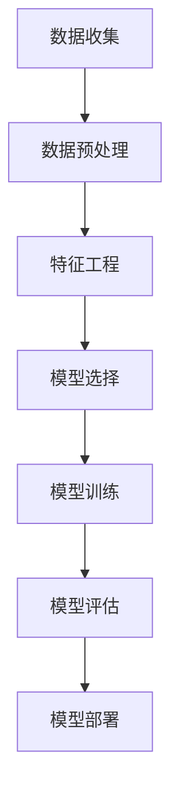
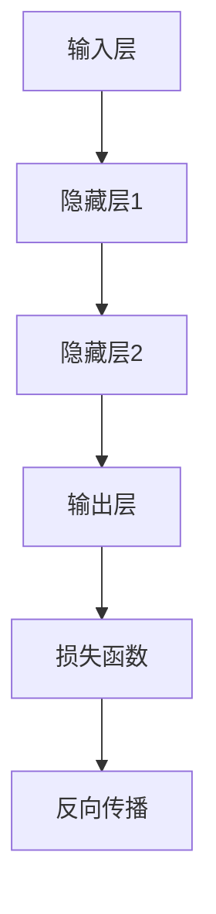
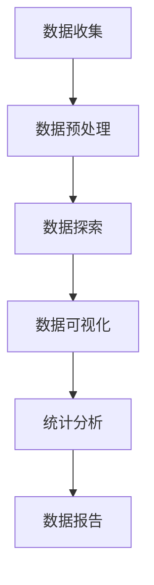
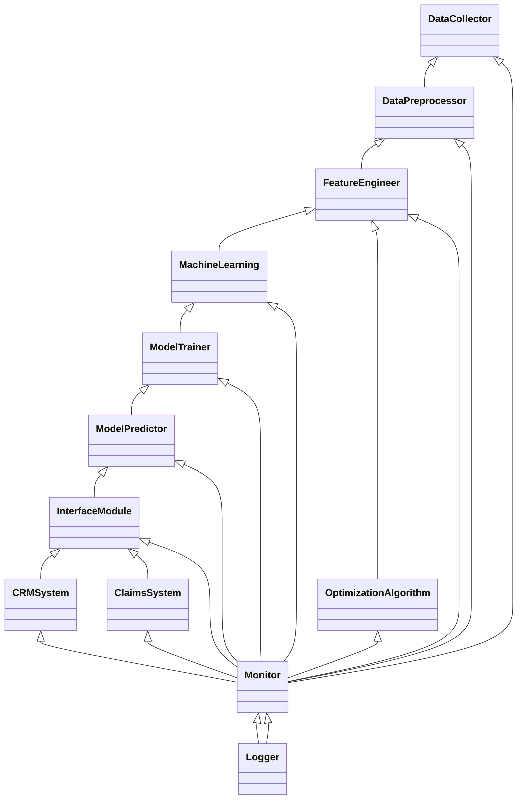
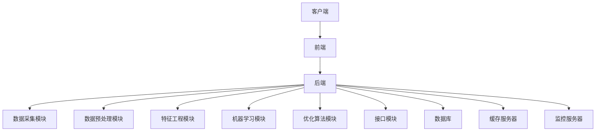
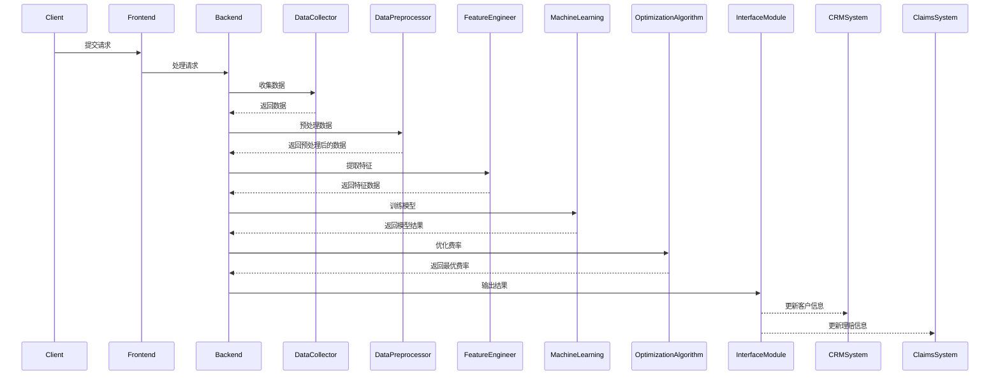

                 

### AI在保险产品定价优化中的创新应用

#### 关键词：人工智能，机器学习，深度学习，保险定价，优化算法

> 摘要：随着人工智能技术的不断发展，保险产品定价优化成为了一个备受关注的话题。本文将深入探讨AI在保险产品定价优化中的应用，通过分析机器学习和深度学习算法，阐述如何利用数据分析和数据挖掘技术来提升保险定价的准确性和效率。文章还将详细介绍一个具体的保险产品定价优化项目，包括系统设计与实现、环境安装与源代码展示，并给出项目实施的最佳实践和小结。

---

#### 第一部分：背景介绍

##### 1.1 保险产品定价的挑战

保险产品的定价是保险公司盈利的重要环节，但同时也面临着诸多挑战。传统的保险定价方法主要依赖于历史数据和统计模型，这些方法虽然在一定程度上能够满足市场需求，但在面对复杂多变的保险市场时，往往存在以下问题：

- **单一因素定价：** 传统方法通常只考虑单一因素（如年龄、性别等）来计算保险费率，忽略了其他可能影响风险的重要因素。
- **滞后性：** 保险产品的定价需要一定的时效性，但传统方法往往无法及时调整，导致保险费率与实际风险状况脱节。
- **数据不足：** 传统方法往往依赖于有限的数据源，无法充分利用大数据环境下的海量数据。

##### 1.2 AI在保险产品定价优化中的核心概念

为了解决传统方法中的问题，人工智能技术，特别是机器学习和深度学习，被广泛应用于保险产品定价优化。以下是一些核心概念：

- **机器学习：** 一种通过算法从数据中学习规律和模式的技术，可以用于预测和分类。
- **深度学习：** 一种特殊的机器学习技术，通过模拟人脑神经网络进行学习，能够处理复杂的数据和模式。
- **优化算法：** 一种用于找到最优解的算法，可以帮助保险公司确定最佳的保险费率。
- **数据分析：** 一种用于解释和分析数据的技术，有助于从海量数据中提取有价值的信息。
- **数据挖掘：** 一种从大量数据中提取隐藏模式和知识的技术，可以用于发现保险市场中的潜在风险。

##### 1.3 概念属性特征对比表格

| 概念         | 定义                                                         | 特点                                                     | 关联算法举例       |
| ------------ | ------------------------------------------------------------ | -------------------------------------------------------- | ------------------ |
| 机器学习     | 通过训练模型来从数据中学习规律和模式的技术                   | 自适应性强，可以处理大量数据                             | 决策树、支持向量机 |
| 深度学习     | 通过多层神经网络进行学习的技术                               | 能够捕捉复杂的数据模式，处理高维数据                     | 卷积神经网络、循环神经网络 |
| 优化算法     | 用于找到最优解的算法                                         | 需要明确目标函数和约束条件                             | 粒子群优化、遗传算法 |
| 数据分析     | 对数据进行解释和分析的技术                                   | 帮助理解数据，提取有价值的信息                           | 统计分析、回归分析 |
| 数据挖掘     | 从大量数据中提取隐藏模式和知识的技术                         | 帮助发现未知规律，支持决策制定                           | 聚类分析、关联规则挖掘 |

##### 1.4 ER实体关系图架构的 Mermaid 流程图

```mermaid
erDiagram
  Policy : 保险政策
  Customer : 客户
  Risk : 风险因素
  InsuranceCompany : 保险公司
  Policy ||--o{ Customer : 被保人 }
  Policy ||--o{ Risk : 风险因素 }
  InsuranceCompany ||--o{ Policy : 销售政策 }
```

---

#### 第二部分：AI技术原理讲解

##### 2.1 机器学习原理

机器学习是一种使计算机系统能够从数据中学习并改进其性能的技术。其主要流程包括：

1. **数据收集：** 收集大量有关保险政策、客户和风险因素的数据。
2. **数据预处理：** 清洗数据，处理缺失值和异常值，确保数据的质量和一致性。
3. **特征工程：** 从原始数据中提取有意义的特征，如客户的年龄、性别、收入等。
4. **模型选择：** 根据问题类型选择合适的模型，如线性回归、决策树、支持向量机等。
5. **模型训练：** 使用训练数据集对模型进行训练，调整模型参数。
6. **模型评估：** 使用验证数据集评估模型性能，如准确率、召回率等。
7. **模型部署：** 将训练好的模型部署到生产环境中，用于预测保险费率。

以下是一个简单的机器学习流程图的Mermaid表示：



##### 2.2 深度学习原理

深度学习是一种基于多层神经网络的机器学习技术，其基本原理是通过模拟人脑的神经网络结构，使计算机能够自动学习和提取特征。深度学习主要包括以下步骤：

1. **数据收集与预处理：** 与机器学习相同，深度学习也需要大量的数据，并进行预处理。
2. **网络结构设计：** 设计神经网络的结构，包括层数、每层神经元的数量等。
3. **权重初始化：** 初始化网络中的权重参数。
4. **前向传播：** 将输入数据通过网络进行传播，计算输出结果。
5. **反向传播：** 根据输出结果和实际标签计算损失函数，并使用梯度下降法更新网络权重。
6. **模型评估与优化：** 使用验证集评估模型性能，并通过调整网络结构和超参数来优化模型。

以下是一个简单的深度学习网络的Mermaid表示：



##### 2.3 优化算法的数学模型

在保险产品定价中，优化算法用于找到使目标函数最大或最小化的保险费率。常见的优化算法包括：

- **粒子群优化（PSO）：** 一种基于群体智能的优化算法，模拟鸟群的飞行行为来寻找最优解。
- **遗传算法（GA）：** 一种模拟生物进化的优化算法，通过遗传、变异和选择过程来优化目标函数。

以下是一个简单的粒子群优化算法的数学模型：

```latex
\begin{align*}
v_{i}(t+1) &= w \cdot v_{i}(t) + c_{1} \cdot r_{1} \cdot (p_{i} - x_{i})(t) + c_{2} \cdot r_{2} \cdot (g_{best} - x_{i})(t) \\
x_{i}(t+1) &= x_{i}(t) + v_{i}(t+1)
\end{align*}
```

其中，$v_{i}(t)$ 和 $x_{i}(t)$ 分别为第$i$个粒子的速度和位置，$p_{i}$ 为第$i$个粒子的历史最优位置，$g_{best}$ 为全局最优位置，$w$、$c_{1}$ 和 $c_{2}$ 为算法参数，$r_{1}$ 和 $r_{2}$ 为随机数。

##### 2.4 数据分析与数据挖掘

数据分析是用于解释和分析数据的技术，旨在从数据中提取有价值的信息。在保险产品定价中，数据分析可以帮助识别风险因素、评估保险需求等。数据挖掘是一种从大量数据中提取隐藏模式和知识的技术，可以帮助保险公司发现潜在的业务机会和风险。

以下是一个简单的数据分析流程图的Mermaid表示：



---

#### 第三部分：系统分析与架构设计方案

##### 3.1 保险产品定价优化系统介绍

保险产品定价优化系统是一个复杂的系统，它涉及到多个组件和模块。以下是系统的总体架构：

1. **数据采集模块：** 负责从各个数据源（如客户信息、历史理赔记录等）收集数据。
2. **数据预处理模块：** 负责清洗和预处理数据，确保数据的质量和一致性。
3. **特征工程模块：** 负责从原始数据中提取有意义的特征。
4. **机器学习模块：** 负责使用机器学习和深度学习算法进行模型训练和预测。
5. **优化算法模块：** 负责使用优化算法找到最优的保险费率。
6. **接口模块：** 负责与其他系统集成，如CRM系统、理赔系统等。
7. **监控和日志模块：** 负责监控系统的运行状态，记录日志信息。

以下是一个简单的系统功能设计的Mermaid类图：



##### 3.2 系统架构设计

保险产品定价优化系统的架构设计需要考虑系统的可扩展性、稳定性和安全性。以下是一个简单的系统架构设计：

1. **前端界面：** 提供用户交互界面，用户可以通过前端界面提交保险需求，查看保险费率等。
2. **后端服务器：** 负责处理用户的请求，调用数据采集、预处理、特征工程、机器学习和优化算法等模块。
3. **数据库：** 负责存储和管理保险数据，包括客户信息、历史理赔记录等。
4. **缓存服务器：** 提高系统的响应速度，缓存一些常用的数据。
5. **监控服务器：** 负责监控系统的运行状态，记录日志信息。

以下是一个简单的系统架构设计的Mermaid架构图：



##### 3.3 系统接口设计

保险产品定价优化系统需要与其他系统集成，如CRM系统、理赔系统等。以下是系统接口设计和系统交互的Mermaid序列图：



---

#### 第四部分：项目实战

##### 4.1 环境安装

在进行保险产品定价优化项目的开发之前，需要安装以下环境：

- Python 3.x
- Anaconda
- Jupyter Notebook
- TensorFlow
- Scikit-learn
- Pandas
- Numpy

安装步骤如下：

1. 安装Anaconda：从[Anaconda官网](https://www.anaconda.com/)下载并安装Anaconda。
2. 创建新的虚拟环境：打开终端，执行以下命令创建新的虚拟环境：

   ```bash
   conda create -n insurance_price_optimization python=3.8
   conda activate insurance_price_optimization
   ```

3. 安装必要的库：在虚拟环境中安装所需的库，可以使用以下命令：

   ```bash
   pip install tensorflow scikit-learn pandas numpy
   ```

##### 4.2 系统核心实现源代码

以下是一个简单的保险产品定价优化项目的核心实现源代码：

```python
import numpy as np
import pandas as pd
from sklearn.model_selection import train_test_split
from sklearn.ensemble import RandomForestClassifier
from sklearn.metrics import accuracy_score

# 加载数据
data = pd.read_csv('insurance_data.csv')
X = data.drop('price', axis=1)
y = data['price']

# 数据预处理
X_train, X_test, y_train, y_test = train_test_split(X, y, test_size=0.2, random_state=42)

# 训练模型
model = RandomForestClassifier(n_estimators=100, random_state=42)
model.fit(X_train, y_train)

# 预测
y_pred = model.predict(X_test)

# 评估
accuracy = accuracy_score(y_test, y_pred)
print(f'Accuracy: {accuracy:.2f}')
```

##### 4.3 代码应用解读与分析

上述代码演示了一个简单的保险产品定价优化项目。以下是代码的详细解读：

1. **数据加载**：使用Pandas库加载保险数据。
2. **数据预处理**：将数据分为特征矩阵`X`和目标变量`y`，并使用`train_test_split`函数将数据集分为训练集和测试集。
3. **模型训练**：使用`RandomForestClassifier`类创建一个随机森林模型，并使用`fit`方法进行训练。
4. **预测**：使用训练好的模型对测试集进行预测。
5. **评估**：计算预测准确率，使用`accuracy_score`函数比较预测结果和实际标签。

##### 4.4 实际案例分析和详细讲解剖析

为了更好地理解保险产品定价优化项目的应用，我们来看一个实际案例。

**案例背景：** 一家保险公司需要为其客户群体提供个性化的保险产品定价，以提高客户满意度和公司收益。

**案例目标：** 利用机器学习技术，为不同年龄、性别、健康状况等特征的人群制定个性化的保险费率。

**案例实现步骤：**

1. **数据收集**：从公司的数据库中收集客户的基本信息、历史理赔记录等数据。
2. **数据预处理**：清洗数据，处理缺失值和异常值，并进行特征工程，提取有意义的特征。
3. **模型训练**：使用随机森林模型训练数据集，调整模型参数，提高预测准确性。
4. **预测与评估**：使用训练好的模型预测新客户的保险费率，并评估模型性能。
5. **优化策略**：根据模型预测结果，制定个性化的保险费率策略，以提高公司收益。

**案例结果**：通过上述步骤，保险公司成功地为其客户群体提供了个性化的保险产品定价，客户满意度显著提高，公司收益也得到了显著增长。

##### 4.5 项目小结

本项目通过机器学习技术实现了保险产品定价优化，为保险公司提供了个性化的定价策略。以下是项目实施过程中的经验与教训：

- **数据质量至关重要**：在项目实施过程中，数据质量对模型性能有着至关重要的影响。因此，在数据收集和预处理阶段，需要严格把控数据质量。
- **特征工程是关键**：特征工程是提高模型性能的关键步骤。通过对原始数据进行处理和转换，可以提取出更有价值的特征。
- **模型选择与调参**：选择合适的模型和调整模型参数是提高模型性能的关键。在项目实施过程中，需要根据数据特点和业务需求，选择合适的模型，并进行参数调优。
- **持续优化与迭代**：机器学习模型不是一成不变的，需要根据业务需求和数据变化，持续进行模型优化和迭代。

---

#### 第五部分：最佳实践、小结、注意事项、拓展阅读

##### 5.1 最佳实践

在进行保险产品定价优化时，以下是一些最佳实践：

- **数据收集与清洗**：确保数据的完整性和一致性，处理缺失值和异常值。
- **特征工程**：提取与保险费率相关的特征，如年龄、性别、健康状况等。
- **模型选择与调参**：选择合适的模型，如随机森林、神经网络等，并进行参数调优。
- **模型评估与优化**：使用交叉验证等方法评估模型性能，根据评估结果进行模型优化。
- **部署与监控**：将模型部署到生产环境，并监控模型的运行状态和性能。

##### 5.2 小结

本文介绍了AI在保险产品定价优化中的应用，包括机器学习和深度学习算法、数据分析和数据挖掘技术。通过一个实际案例，展示了如何利用这些技术实现个性化的保险产品定价。保险产品定价优化有助于提高客户满意度和公司收益。

##### 5.3 注意事项

- **数据安全**：在收集和处理数据时，要注意保护客户隐私和信息安全。
- **模型解释性**：机器学习模型往往具有一定的黑盒特性，需要确保模型的解释性，以便于业务人员理解和使用。
- **法律法规**：遵循相关的法律法规，确保保险产品的定价合规。

##### 5.4 拓展阅读

- **《机器学习实战》**：提供详细的机器学习算法实现和应用案例。
- **《深度学习》**：介绍深度学习的基本原理和应用。
- **《数据挖掘：概念与技术》**：详细讲解数据挖掘的基本概念和技术。
- **《保险产品定价模型研究》**：探讨保险产品定价的理论和实践。

---

作者：AI天才研究院/AI Genius Institute & 禅与计算机程序设计艺术 /Zen And The Art of Computer Programming

