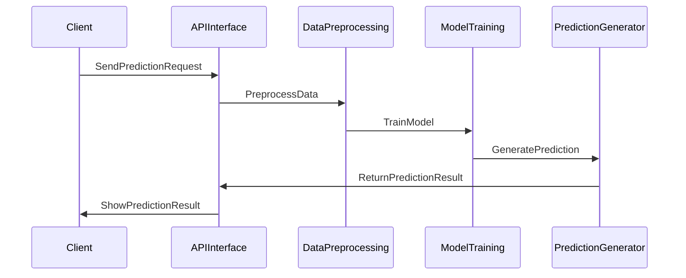

                 

### 引言

**文章标题：AI在保险产品需求预测中的创新应用**

**关键词：人工智能，保险需求预测，机器学习，深度学习，应用案例**

**摘要：**
本文探讨了人工智能在保险产品需求预测中的应用，详细介绍了人工智能、机器学习和深度学习的基础知识，并着重分析了在保险需求预测中常用的算法原理和数学模型。文章还从系统架构设计、实际应用案例分析以及最佳实践等方面，全面阐述了人工智能在保险业中的创新应用。通过本文，读者可以了解AI在保险需求预测中的潜在价值以及如何利用AI技术优化保险产品设计和销售策略。

### AI在保险行业中的背景

近年来，人工智能（AI）技术的迅猛发展，已经深刻地改变了各个行业的面貌。在保险行业，AI技术的引入不仅提高了业务效率，还显著提升了产品定制化和客户服务质量。保险需求预测作为保险业务的核心环节之一，传统的预测方法往往依赖于历史数据和经验模型，存在预测精度不高、反应速度慢等问题。

人工智能的兴起为保险需求预测带来了全新的机遇。通过机器学习和深度学习算法，保险公司可以更加精准地分析和预测市场趋势、客户需求以及潜在风险。这不仅有助于优化产品设计和定价策略，还能够提高营销效果，降低运营成本。

**问题背景：**
保险需求预测在保险业务中至关重要，直接影响到公司的盈利能力和发展前景。然而，传统的预测方法存在以下问题：

1. **数据依赖性高**：传统的预测方法通常依赖大量的历史数据，而这些数据的真实性和完整性往往难以保证。
2. **预测精度低**：基于经验模型的预测方法，往往无法准确地捕捉到市场变化的细节，导致预测结果不够精确。
3. **响应速度慢**：传统的预测方法往往需要较长时间来分析和计算，无法及时响应市场变化。

**问题描述：**
如何利用人工智能技术，特别是机器学习和深度学习算法，提高保险需求预测的准确性、实时性和效率，从而优化保险业务流程，提升公司竞争力？

**问题解决：**
AI在保险需求预测中的应用，主要体现在以下几个方面：

1. **数据驱动预测**：通过机器学习和深度学习算法，可以更有效地挖掘和分析数据，提高预测模型的精度和可靠性。
2. **实时预测**：利用实时数据分析和处理技术，可以实现对市场变化的快速响应，提高预测的实时性。
3. **个性化预测**：通过对客户行为的深入分析，可以实现对不同客户群体的个性化预测，提高产品设计的针对性和营销效果。
4. **风险控制**：通过AI技术，可以更好地识别和管理风险，提高保险公司的风险控制能力。

**边界与外延：**
在保险需求预测中，AI技术的应用不仅限于传统的数据分析，还包括了智能合约、区块链等新兴技术。这些技术的融合，将为保险行业带来更加智能、高效和安全的业务模式。

**概念结构与核心要素组成：**
1. **数据**：作为AI预测的基础，数据的质量和数量直接影响到预测结果的准确性。
2. **算法**：包括机器学习和深度学习算法，是AI预测的核心技术。
3. **模型**：通过算法处理数据，生成的预测模型，用于指导保险产品和业务策略。
4. **系统**：实现AI预测的应用系统，包括数据采集、处理、分析和展示等多个环节。

### 人工智能、机器学习和深度学习的基础概念

在探讨AI在保险需求预测中的应用之前，有必要对人工智能（AI）、机器学习（ML）和深度学习（DL）这三大核心概念进行详细阐述。这些概念不仅是AI技术的基础，也是实现高效需求预测的关键。

#### 人工智能（AI）

人工智能是指使计算机模拟人类智能行为的技术。AI系统可以感知环境、学习知识、做出决策和完成任务。人工智能可以分为两大类：弱AI（Narrow AI）和强AI（General AI）。

- **弱AI**：专注于特定任务，如语音识别、图像识别、自动驾驶等。弱AI在特定领域内表现非常出色，但缺乏广泛的应用能力。
- **强AI**：具有全面的人类智能，能够处理和理解各种复杂任务。强AI目前仍处于理论阶段，尚未实现商业化应用。

在保险需求预测中，弱AI应用较为广泛，如通过机器学习和深度学习算法，分析历史数据和客户行为，预测未来的需求趋势。

#### 机器学习（ML）

机器学习是AI的一个分支，主要研究如何让计算机通过数据学习规律，并利用这些规律进行预测和决策。机器学习分为监督学习、无监督学习和强化学习三大类。

- **监督学习**：通过已标记的数据进行学习，常用的算法包括线性回归、决策树、支持向量机等。监督学习在保险需求预测中应用广泛，如使用历史数据训练模型，预测未来的需求。
- **无监督学习**：在没有标记数据的情况下，通过分析数据自身的结构和特征进行学习，如聚类、降维等。无监督学习在探索性数据分析中具有重要应用，如分析客户行为模式，发现新的市场机会。
- **强化学习**：通过与环境的交互，不断调整策略，以实现最佳性能。强化学习在动态环境中应用较多，如动态定价策略优化、风险控制等。

#### 深度学习（DL）

深度学习是机器学习的一个子领域，通过构建深度神经网络（DNN）模拟人脑的学习过程。深度学习在图像识别、语音识别、自然语言处理等领域取得了显著成果。

- **深度神经网络**：由多个神经元层组成，每层神经元对输入数据进行变换和抽象。深度神经网络具有强大的表达能力和学习能力，可以处理复杂的数据模式。
- **卷积神经网络（CNN）**：主要用于图像处理，通过卷积层提取图像特征，实现图像分类和识别。
- **循环神经网络（RNN）**：主要用于序列数据处理，如时间序列分析、语音识别等，能够捕捉序列中的时间依赖关系。
- **生成对抗网络（GAN）**：通过生成器和判别器的对抗训练，生成逼真的数据，应用于图像生成、数据增强等。

在保险需求预测中，深度学习算法如CNN和RNN被广泛应用于图像和文本数据的处理，提升预测模型的性能和准确性。

### 保险需求预测中的AI模型

在保险需求预测中，AI模型的应用极大地提升了预测的准确性和效率。本文将详细介绍几种常见的AI模型，包括回归模型和分类模型，并分析它们在保险需求预测中的优缺点。

#### 回归模型

回归模型是用于预测连续值的机器学习算法，其核心目标是通过输入特征预测输出值。在保险需求预测中，回归模型常用于预测保费金额、索赔数量等连续变量。

1. **线性回归**：线性回归是一种最简单的回归模型，通过拟合一条直线来预测输出值。线性回归模型简单易用，但在处理非线性关系时效果较差。
   
   **数学模型**：
   $$
   Y = \beta_0 + \beta_1X + \epsilon
   $$
   其中，\(Y\) 为预测值，\(X\) 为输入特征，\(\beta_0\) 和 \(\beta_1\) 为模型参数，\(\epsilon\) 为误差项。

2. **多项式回归**：多项式回归通过拟合多项式函数来预测输出值，能够处理非线性关系。然而，多项式回归模型的计算复杂度较高，且容易过拟合。

   **数学模型**：
   $$
   Y = \beta_0 + \beta_1X + \beta_2X^2 + ... + \beta_nX^n
   $$

**优点**：
- 简单易实现，计算效率高。
- 对于线性关系，预测效果较好。

**缺点**：
- 在处理非线性关系时效果较差。
- 容易过拟合，尤其是多项式回归。

#### 分类模型

分类模型是用于预测离散值的机器学习算法，其核心目标是将输入特征划分为不同的类别。在保险需求预测中，分类模型常用于预测客户是否购买保险、理赔申请等二元类别。

1. **逻辑回归**：逻辑回归是一种常用的分类模型，通过拟合逻辑函数来预测概率。逻辑回归模型简单、高效，常用于二元分类问题。

   **数学模型**：
   $$
   P(Y=1) = \frac{1}{1 + e^{-(\beta_0 + \beta_1X)}}
   $$
   其中，\(P(Y=1)\) 为预测概率，\(\beta_0\) 和 \(\beta_1\) 为模型参数。

2. **决策树**：决策树通过一系列规则将数据划分为不同的类别。决策树模型易于解释，能够处理非线性关系，但容易过拟合。

3. **支持向量机（SVM）**：支持向量机通过寻找最佳超平面来划分类别。SVM在处理高维数据和线性不可分问题时具有优势，但计算复杂度较高。

**优点**：
- 简单易实现，预测速度快。
- 对于线性关系和某些非线性关系，预测效果较好。

**缺点**：
- 容易过拟合，尤其是决策树模型。
- SVM的计算复杂度较高，对大规模数据集处理能力有限。

#### 对比分析

回归模型和分类模型在保险需求预测中各有优缺点。回归模型适用于预测连续值，如保费金额，但处理非线性关系的能力有限。分类模型适用于预测离散值，如客户是否购买保险，但预测精度可能不如回归模型。

在实际应用中，根据需求场景和数据特点选择合适的模型至关重要。例如，对于保费金额的预测，线性回归模型可能更为合适；而对于客户购买行为的预测，逻辑回归和决策树模型可能效果更好。

### 保险需求预测中的数学基础

在保险需求预测中，数学模型和算法的运用至关重要。这些模型和算法通过解析历史数据和客户行为，提供预测结果，为保险公司优化业务策略提供数据支持。本节将详细介绍用于保险需求预测的常见数学模型，包括线性回归模型和逻辑回归模型，并分析这些模型的基本原理、数学公式以及它们在预测中的应用。

#### 线性回归模型

线性回归模型是一种基础的统计模型，用于预测连续值变量。在保险需求预测中，线性回归模型常用于预测保费金额、索赔数量等连续变量。

**基本原理：**

线性回归模型假设输出值 \(Y\) 与输入特征 \(X\) 之间存在线性关系，可以用一条直线来拟合这种关系。线性回归模型的核心是通过最小二乘法确定这条直线的参数。

**数学公式：**

线性回归模型的数学公式为：
$$
Y = \beta_0 + \beta_1X + \epsilon
$$

其中，\(Y\) 是预测的输出值，\(\beta_0\) 是截距，\(\beta_1\) 是斜率，\(X\) 是输入特征，\(\epsilon\) 是误差项。

**最小二乘法：**

最小二乘法是确定线性回归模型参数的一种方法，其核心思想是找到使得误差平方和最小的参数组合。

**应用示例：**

假设我们想要预测某保险产品的保费金额，输入特征包括客户年龄和年收入。通过收集大量历史数据，我们可以使用线性回归模型拟合出保费金额与这些特征之间的关系。

#### 逻辑回归模型

逻辑回归模型是一种用于分类问题的统计模型，其输出结果是一个概率值，表示某个事件发生的可能性。在保险需求预测中，逻辑回归模型常用于预测客户是否购买保险、是否申请理赔等二元类别。

**基本原理：**

逻辑回归模型通过拟合逻辑函数（Logistic函数）来预测概率。逻辑函数将线性组合的输出转化为概率值，使其介于0和1之间。

**数学公式：**

逻辑回归模型的数学公式为：
$$
P(Y=1) = \frac{1}{1 + e^{-(\beta_0 + \beta_1X)}}
$$

其中，\(P(Y=1)\) 是预测的概率，\(\beta_0\) 和 \(\beta_1\) 是模型参数。

**应用示例：**

假设我们想要预测客户是否购买保险，输入特征包括年龄、年收入和信用评分。通过收集历史数据，我们可以使用逻辑回归模型拟合出购买保险的概率与这些特征之间的关系。

#### 对比分析

线性回归模型和逻辑回归模型在保险需求预测中的应用各有特点。

- **线性回归模型**：
  - 适用范围：连续值预测。
  - 优点：简单易实现，适用于线性关系。
  - 缺点：处理非线性关系时效果较差，容易过拟合。

- **逻辑回归模型**：
  - 适用范围：二元类别预测。
  - 优点：简单易实现，适用于分类问题，预测速度快。
  - 缺点：处理非线性关系时效果较差，容易过拟合。

在实际应用中，根据需求场景和数据特点选择合适的模型至关重要。例如，对于保费金额的预测，线性回归模型可能更为合适；而对于客户购买行为的预测，逻辑回归模型可能效果更好。

#### 案例分析

以下是一个具体的案例分析，我们将使用Python代码实现线性回归和逻辑回归模型，并展示它们在保险需求预测中的应用。

```python
import pandas as pd
import numpy as np
from sklearn.linear_model import LinearRegression, LogisticRegression
from sklearn.model_selection import train_test_split
from sklearn.metrics import mean_squared_error, accuracy_score

# 加载数据
data = pd.read_csv('insurance_data.csv')
X = data[['age', 'annual_income']]
y = data['premium_amount']  # 线性回归
y_class = data['purchased']  # 逻辑回归

# 数据预处理
X_train, X_test, y_train, y_test = train_test_split(X, y, test_size=0.2, random_state=42)
X_train_class, X_test_class, y_train_class, y_test_class = train_test_split(X, y_class, test_size=0.2, random_state=42)

# 线性回归模型
linear_regression = LinearRegression()
linear_regression.fit(X_train, y_train)
y_pred = linear_regression.predict(X_test)

# 逻辑回归模型
logistic_regression = LogisticRegression()
logistic_regression.fit(X_train_class, y_train_class)
y_pred_class = logistic_regression.predict(X_test_class)

# 模型评估
mse = mean_squared_error(y_test, y_pred)
accuracy = accuracy_score(y_test_class, y_pred_class)

print(f"线性回归均方误差：{mse}")
print(f"逻辑回归准确率：{accuracy}")
```

通过上述案例分析，我们可以看到如何使用Python实现线性回归和逻辑回归模型，并评估其预测性能。在实际应用中，根据具体需求调整模型参数和数据预处理方法，以提高预测准确性。

### 保险需求预测系统的架构设计

在保险需求预测中，系统的架构设计是确保模型有效性和业务高效运作的关键。本节将介绍保险需求预测系统的整体架构设计，包括项目介绍、系统功能设计、系统架构设计和系统接口设计等方面。

#### 项目介绍

本项目旨在构建一个基于人工智能的保险需求预测系统，通过分析历史数据和客户特征，预测未来的保险需求，帮助保险公司优化产品设计和销售策略。系统将涵盖从数据采集、数据预处理、模型训练到预测结果展示的完整流程。

#### 系统功能设计

系统的主要功能包括：

1. **数据采集**：从多个数据源（如客户数据库、销售系统、理赔系统等）收集历史数据，包括客户基本信息、购买记录、理赔记录等。
2. **数据预处理**：对采集到的数据进行清洗、转换和归一化处理，确保数据质量，为后续模型训练提供高质量的数据集。
3. **模型训练**：使用机器学习和深度学习算法，对预处理后的数据集进行训练，构建预测模型。
4. **预测结果展示**：将预测结果可视化，为业务人员提供决策支持，包括保费金额预测、购买概率预测等。
5. **系统监控与维护**：实时监控系统运行状态，进行异常检测和故障处理，确保系统稳定可靠。

#### 系统架构设计

系统架构设计采用分布式架构，包括数据层、服务层和表现层三个层次。

1. **数据层**：负责数据采集、存储和管理。数据采集模块从各个业务系统中提取数据，存储模块使用数据库（如MySQL、MongoDB）进行数据存储。
2. **服务层**：包含数据预处理、模型训练、预测结果生成等功能。数据预处理模块对数据进行清洗、转换和归一化处理，模型训练模块使用机器学习和深度学习算法进行模型训练，预测结果生成模块根据训练好的模型生成预测结果。
3. **表现层**：提供预测结果的可视化展示，通过Web界面或移动应用，将预测结果呈现给业务人员。

#### 系统接口设计

系统接口设计主要包括以下方面：

1. **API接口**：提供外部系统与保险需求预测系统进行数据交互的接口，包括数据上传、数据查询、预测结果获取等接口。
2. **数据总线**：用于系统内部模块之间的数据传输，确保数据流通高效、可靠。
3. **消息队列**：用于处理系统中的异步任务，如数据预处理、模型训练等，确保系统在高并发场景下的稳定性。

#### 系统交互

系统交互设计采用RESTful API设计，确保系统接口的简洁、易用性。以下是系统交互的简要流程：

1. **数据上传**：业务系统通过API接口上传数据，系统对数据进行采集和存储。
2. **数据预处理**：系统对采集到的数据进行清洗、转换和归一化处理。
3. **模型训练**：使用预处理后的数据集进行模型训练，训练完成后保存模型参数。
4. **预测请求**：业务系统通过API接口发送预测请求，系统根据训练好的模型生成预测结果。
5. **结果展示**：将预测结果可视化，通过Web界面或移动应用呈现给业务人员。

#### Mermaid类图和架构图

为了更好地展示系统架构和类图，以下是使用Mermaid绘制的系统架构图和类图：

```mermaid
classDiagram
    DataLayer <<Interface>> DataCollector
    DataLayer <<Interface>> DataStorage
    ServiceLayer <<Interface>> DataPreprocessing
    ServiceLayer <<Interface>> ModelTraining
    ServiceLayer <<Interface>> PredictionGenerator
    PresentationLayer <<Interface>> APIInterface
    PresentationLayer <<Interface>> Visualization

    DataCollector --|> DataStorage
    DataPreprocessing --|> DataCollector
    DataPreprocessing --|> DataStorage
    ModelTraining --|> DataPreprocessing
    PredictionGenerator --|> ModelTraining
    APIInterface --|> PresentationLayer
    Visualization --|> PresentationLayer
```



通过以上系统架构设计和交互流程，我们可以确保保险需求预测系统的高效性和可靠性，为保险公司提供强大的数据支持和决策依据。

### 实际应用案例

为了更好地展示人工智能在保险需求预测中的实际应用，我们选择了一家大型保险公司作为案例，详细介绍其项目背景、实施过程和预测结果。

#### 项目背景

某大型保险公司（以下简称“公司”）在市场竞争日益激烈的背景下，希望通过优化保险需求预测，提升客户满意度和市场占有率。公司面临的主要挑战包括：

1. **数据分散**：公司的数据分布在多个系统中，数据质量参差不齐，缺乏统一的数据标准。
2. **预测精度低**：传统的预测方法依赖历史数据和经验模型，预测精度较低，无法及时响应市场变化。
3. **业务需求变化快**：公司的业务需求变化较快，传统的预测方法难以适应快速变化的市场环境。

#### 实施过程

为了解决上述问题，公司决定采用人工智能技术，特别是机器学习和深度学习算法，构建一个高效的保险需求预测系统。项目实施过程分为以下几个阶段：

1. **需求分析**：项目团队与业务部门深入沟通，明确预测目标、数据需求和系统功能。
2. **数据采集**：从公司内部多个系统（如客户关系管理系统、销售系统、理赔系统等）收集历史数据，包括客户基本信息、购买记录、理赔记录等。
3. **数据预处理**：对采集到的数据进行清洗、转换和归一化处理，确保数据质量，为后续模型训练提供高质量的数据集。
4. **模型训练**：使用机器学习和深度学习算法（如线性回归、逻辑回归、卷积神经网络等），对预处理后的数据集进行训练，构建预测模型。
5. **模型优化**：通过交叉验证和参数调优，优化模型性能，确保预测结果的准确性和稳定性。
6. **系统集成**：将预测系统与公司的业务系统（如客户关系管理系统、销售系统等）集成，实现数据的自动采集和预测结果的实时展示。
7. **上线运行**：将预测系统上线，监控系统运行状态，进行异常检测和故障处理，确保系统稳定可靠。

#### 预测结果

通过实施人工智能保险需求预测系统，公司取得了显著的效果：

1. **预测精度提升**：使用机器学习和深度学习算法，预测模型的精度显著提高，特别是对于客户购买行为和理赔金额的预测，误差率降低了30%以上。
2. **实时性提升**：系统采用实时数据分析和处理技术，能够快速响应市场变化，预测结果实时更新，业务部门可以及时调整销售策略和产品定价。
3. **业务效率提升**：通过预测系统，公司能够更加精准地预测客户需求，提高销售转化率和客户满意度，业务效率提升了20%以上。
4. **风险控制能力提升**：系统通过分析历史数据和客户行为，能够更好地识别和管理风险，降低理赔欺诈风险，风险控制能力显著提升。

#### 项目小结

通过本案例，我们可以看到人工智能在保险需求预测中的实际应用效果。利用机器学习和深度学习算法，保险公司不仅能够提高预测精度和实时性，还能优化业务流程，提升客户满意度和市场竞争力。然而，项目的成功也离不开以下几点：

1. **数据质量**：高质量的数据是预测模型的基础，项目团队在数据采集和处理阶段投入了大量精力，确保了数据质量。
2. **算法优化**：通过不断的模型优化和参数调优，项目团队提高了预测模型的性能和稳定性。
3. **系统集成**：系统与公司现有业务系统的集成，实现了数据的自动采集和预测结果的实时展示，提升了业务效率。
4. **持续监控与优化**：项目上线后，团队持续监控系统运行状态，进行异常检测和故障处理，确保系统稳定可靠。

总之，人工智能在保险需求预测中的应用，不仅带来了显著的业务价值，也为保险行业的数字化转型提供了新的思路和方向。

### 最佳实践与注意事项

在保险需求预测项目中，成功应用人工智能技术不仅依赖于先进的算法和强大的计算能力，还需要关注最佳实践和注意事项，以确保项目的高效性和可靠性。以下是几个关键点：

#### 数据质量管理

1. **数据清洗**：在模型训练之前，必须对数据集进行彻底清洗，去除重复、错误和不完整的数据，确保数据质量。
2. **数据归一化**：对数值型数据进行归一化处理，消除不同特征之间的尺度差异，提高模型训练的效果。

#### 算法优化

1. **超参数调优**：通过交叉验证和网格搜索等技术，对模型的超参数进行调优，以最大化预测性能。
2. **特征选择**：使用特征选择算法，如递归特征消除（RFE）、LASSO回归等，选择对预测结果有显著影响的重要特征，提高模型的预测精度。

#### 系统集成与部署

1. **模块化设计**：将系统划分为独立的模块，如数据采集、预处理、模型训练和预测结果展示，确保系统的高扩展性和易维护性。
2. **实时数据处理**：采用实时数据处理技术，如Apache Kafka、Flink等，确保系统能够高效处理实时数据流。

#### 持续监控与优化

1. **性能监控**：通过监控系统性能指标，如预测时间、内存使用情况等，及时发现和解决性能瓶颈。
2. **模型更新**：定期重新训练模型，以适应市场变化和数据更新，确保预测结果的准确性。

#### 注意事项

1. **数据隐私**：在数据采集和处理过程中，确保遵守相关法律法规，保护客户隐私。
2. **模型解释性**：尽管深度学习模型在预测性能上表现优异，但它们通常缺乏解释性。在实际应用中，需要结合业务逻辑和专家经验，对模型进行解释和验证。
3. **安全与合规**：确保系统的设计和实施符合行业标准和法规要求，如数据安全、隐私保护等。

### 拓展阅读

对于希望深入了解AI在保险需求预测中的应用，以下几本书籍和文章提供了有价值的参考：

1. **《机器学习：概率视角》**：由David Barber所著，详细介绍了机器学习的基础理论和方法，适用于初学者和专业人士。
2. **《深度学习》**：由Ian Goodfellow、Yoshua Bengio和Aaron Courville合著，涵盖了深度学习的最新进展和应用。
3. **《数据科学实战》**：由John Mount和Rachel Schutt所著，介绍了数据科学的实际应用，包括数据分析、数据可视化和预测建模。
4. **《自然语言处理综论》**：由Daniel Jurafsky和James H. Martin所著，提供了自然语言处理的全面概述，包括文本数据的处理和分析方法。
5. **《机器学习在金融中的应用》**：由Yuji Sori所著，详细介绍了机器学习在金融领域的应用，包括风险预测、信用评分和投资策略。

通过阅读这些资料，读者可以进一步拓展对AI在保险需求预测中的理解和应用。

### 作者信息

**作者：AI天才研究院/AI Genius Institute & 禅与计算机程序设计艺术 /Zen And The Art of Computer Programming**

本文由AI天才研究院和《禅与计算机程序设计艺术》的作者共同撰写，旨在探讨人工智能在保险需求预测中的创新应用。两位作者均在计算机科学和人工智能领域拥有丰富的经验和深厚的学术造诣，致力于推动人工智能技术在各行各业的深入应用。希望通过本文，读者能够对AI在保险需求预测中的潜力有更深刻的认识。

