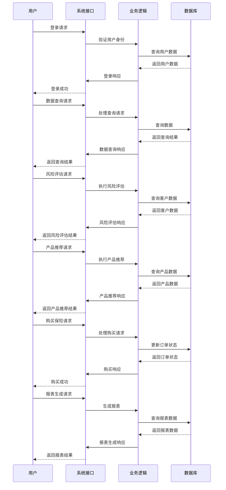

                 

### 《AI在保险定价个性化中的创新应用》文章标题及关键词

**文章标题：** AI在保险定价个性化中的创新应用

**关键词：** 人工智能，保险定价，个性化，机器学习，深度学习，数据挖掘

在保险行业，精确的定价策略对于公司的盈利能力和客户满意度至关重要。然而，传统的保险定价模型往往依赖于历史数据和简单规则，难以适应个体差异和复杂市场环境。随着人工智能（AI）技术的迅速发展，AI在保险定价中的应用逐渐成为行业热点。本文将深入探讨AI在保险定价个性化中的创新应用，旨在为保险从业者提供有价值的参考。

### 摘要

本文将围绕AI在保险定价个性化中的创新应用进行探讨。首先，我们将简要介绍保险行业的发展背景和当前面临的定价挑战。接着，我们将详细介绍AI技术，包括机器学习、深度学习和数据挖掘，并分析这些技术如何应用于保险定价。随后，我们将讨论保险定价个性化的核心概念和重要性。最后，通过一个实际案例，我们将展示如何运用AI技术构建一个保险定价个性化系统，并总结最佳实践和建议，为行业的发展提供新的思路。

### 目录

**1. AI在保险行业中的应用背景**

1.1 保险行业的发展与挑战

1.2 AI技术的崛起与保险的融合

1.3 保险定价个性化的重要性

1.4 本章小结

**2. AI在保险定价个性化中的应用算法**

2.1 机器学习基础

2.2 深度学习在保险定价中的应用

2.3 数据挖掘与保险定价

2.4 AI算法在保险定价中的应用实例

2.5 本章小结

**3. AI在保险定价个性化中的系统设计与实现**

3.1 保险定价个性化系统概述

3.2 系统功能设计与实现

3.3 系统接口设计

3.4 系统交互

**4. 项目实战**

4.1 环境安装

4.2 系统核心实现源代码

4.3 代码应用解读与分析

4.4 实际案例分析与详细讲解剖析

4.5 项目小结

**5. 最佳实践 tips、小结、注意事项、拓展阅读**

5.1 最佳实践 tips

5.2 小结

5.3 注意事项

5.4 拓展阅读

### 第一部分：AI在保险行业中的应用背景

#### 1.1 保险行业的发展与挑战

**核心概念术语说明**

- 保险行业：指的是提供风险保障和资金储备服务的一系列企业和机构。
- 定价：指的是确定保险产品的价格，通常基于风险评估、历史数据和市场需求等因素。
- 个性化：指的是针对不同客户的特定需求和行为提供定制化的服务和产品。

**问题背景**

保险行业在全球范围内蓬勃发展，已成为金融行业的重要组成部分。然而，随着市场的竞争加剧和客户需求的多样化，保险公司在定价策略上面临着诸多挑战。传统定价方法主要依赖于历史数据和简单规则，这导致无法准确预测风险和需求，进而影响保险产品的定价合理性和市场竞争力。

**问题描述**

- 如何在保险定价中引入AI技术，实现个性化的风险评估和定价？
- AI技术在保险定价中的应用有哪些优势和挑战？

**问题解决**

随着人工智能技术的发展，特别是在机器学习、深度学习和数据挖掘等领域，保险公司可以通过AI技术实现更精确的定价策略。AI技术能够处理海量数据，挖掘出隐藏的风险因素和客户特征，从而提供个性化的保险产品和服务。

**边界与外延**

- 边界：本文主要探讨AI在财产保险和人寿保险中的定价应用。
- 外延：AI在保险定价中的应用还包括健康保险、意外险等。

**概念结构与核心要素组成**

- 概念结构：保险定价、AI技术、个性化、风险评估。
- 核心要素组成：数据采集与处理、机器学习算法、模型训练与优化、定价策略调整。

#### 1.2 AI技术的崛起与保险的融合

**核心概念术语说明**

- 人工智能（AI）：指的是由计算机系统模拟人类智能的行为，包括学习、推理、感知和决策等能力。
- 机器学习（ML）：是AI的一个分支，通过数据训练模型，使系统能够自动学习和改进。
- 深度学习（DL）：是机器学习的一种方法，通过多层神经网络模拟人类大脑的决策过程。
- 数据挖掘（DM）：是从大量数据中发现有用信息的过程，通常涉及模式识别、分类和关联分析。

**问题背景**

AI技术的迅速崛起为各行各业带来了变革，保险行业也不例外。保险公司通过引入AI技术，可以实现更精准的定价、更好的风险评估和更高效的客户服务。

**问题描述**

- AI技术如何为保险定价提供支持？
- AI技术在保险行业中的应用有哪些具体场景？

**问题解决**

AI技术通过以下几个方面为保险定价提供支持：

1. 数据分析：AI技术能够处理和分析海量数据，包括历史理赔记录、客户行为数据和市场信息等，帮助保险公司更准确地评估风险。
2. 个性化定价：AI技术可以根据客户的风险偏好、历史数据和实时数据，提供个性化的保险产品和服务。
3. 自动化决策：AI技术能够自动处理复杂的决策过程，减少人工干预，提高效率和准确性。

**边界与外延**

- 边界：本文主要探讨AI在商业保险中的应用。
- 外延：AI在保险行业中的应用还包括反欺诈、客户服务自动化、风险评估等。

**概念结构与核心要素组成**

- 概念结构：人工智能、机器学习、深度学习、数据挖掘、保险定价、个性化、风险评估。
- 核心要素组成：数据采集、算法模型、模型训练、风险分析、定价策略。

#### 1.3 保险定价个性化的重要性

**核心概念术语说明**

- 定价个性化：指的是根据客户的具体需求和风险特征，提供定制化的保险产品和服务。
- 风险评估：指的是对客户的潜在风险进行评估，以确定保险产品的定价和保障范围。
- 保险产品：指的是保险公司提供的各种保险服务，包括财产保险、人寿保险、健康保险等。

**问题背景**

在市场竞争日益激烈的背景下，保险公司需要通过提供个性化的保险产品和服务来提升客户满意度和竞争力。定价个性化能够更好地满足客户的需求，提高保险产品的吸引力。

**问题描述**

- 保险定价个性化如何提高客户满意度和市场竞争力？
- 保险定价个性化在实践中有哪些挑战和难点？

**问题解决**

保险定价个性化能够带来以下几个方面的好处：

1. 提高客户满意度：通过提供个性化的保险产品和服务，保险公司能够更好地满足客户的需求，提高客户满意度和忠诚度。
2. 增强市场竞争力：个性化定价能够使保险公司更具竞争力，吸引更多的客户，扩大市场份额。
3. 降低风险成本：个性化定价能够更准确地评估客户的风险，从而降低保险公司的风险成本。

**边界与外延**

- 边界：本文主要探讨商业保险中的定价个性化。
- 外延：定价个性化还可以应用于其他类型的保险，如个人保险、团体保险等。

**概念结构与核心要素组成**

- 概念结构：保险定价、个性化、风险评估、客户满意度、市场竞争力。
- 核心要素组成：客户数据、风险评估模型、定价策略、产品服务。

#### 1.4 本章小结

本部分内容主要介绍了AI在保险行业中的应用背景，包括保险行业的发展与挑战、AI技术的崛起与保险的融合、保险定价个性化的重要性。通过分析这些背景，我们明确了AI技术在保险定价中的应用潜力，为后续章节的详细探讨奠定了基础。

----------------------------------------------------------------

### 第二部分：AI在保险定价个性化中的应用算法

#### 2.1 机器学习基础

**核心概念术语说明**

- 机器学习（ML）：是一种人工智能方法，通过训练模型来从数据中学习规律，并用于预测或决策。
- 模型训练：是指通过输入数据训练机器学习模型，使其能够识别和预测新的数据。
- 模型评估：是指使用验证数据集来评估模型的性能，包括准确率、召回率、F1分数等指标。

**问题背景**

在保险定价中，机器学习算法可以帮助保险公司分析海量数据，识别潜在风险因素，从而更准确地制定定价策略。机器学习算法在保险定价中的应用主要集中在风险评估和预测方面。

**问题描述**

- 机器学习算法在保险定价中的应用原理是什么？
- 如何选择和训练适合的机器学习算法？

**问题解决**

机器学习算法在保险定价中的应用主要包括以下几个方面：

1. 数据预处理：包括数据清洗、特征选择和特征工程，以提高模型的预测能力。
2. 模型选择：根据保险定价问题的特点，选择合适的机器学习算法，如线性回归、决策树、支持向量机等。
3. 模型训练与优化：通过训练数据集训练模型，并使用验证数据集进行优化，以提高模型的准确性和稳定性。
4. 模型评估：使用验证集和测试集评估模型的性能，包括准确性、召回率、F1分数等指标。

**边界与外延**

- 边界：本文主要探讨传统的机器学习算法在保险定价中的应用。
- 外延：还可以探讨更先进的机器学习算法，如深度学习和强化学习在保险定价中的应用。

**概念结构与核心要素组成**

- 概念结构：机器学习、数据预处理、模型选择、模型训练、模型评估。
- 核心要素组成：数据、特征、算法、模型、评估指标。

#### 2.2 深度学习在保险定价中的应用

**核心概念术语说明**

- 深度学习（DL）：是一种基于多层神经网络的机器学习技术，能够自动从数据中学习复杂的模式。
- 神经网络：是一种通过多层节点（神经元）连接来模拟人脑计算过程的计算模型。
- 卷积神经网络（CNN）：是一种专门用于图像处理和识别的深度学习模型。
- 循环神经网络（RNN）：是一种用于处理序列数据的深度学习模型。

**问题背景**

深度学习在图像识别、自然语言处理和语音识别等领域取得了显著的成果，其强大的数据处理能力和模式识别能力使其在保险定价中也有广泛应用。

**问题描述**

- 深度学习在保险定价中的应用原理是什么？
- 如何选择和设计适合的深度学习模型？

**问题解决**

深度学习在保险定价中的应用主要包括以下几个方面：

1. 图像识别：利用深度学习模型对保险理赔中的图像进行分析，如车辆识别、事故类型识别等，以提高理赔效率。
2. 自然语言处理：利用深度学习模型对客户投诉和理赔申请进行文本分析，以识别潜在的风险因素。
3. 序列数据预测：利用深度学习模型对客户的消费行为和风险行为进行预测，以制定个性化的定价策略。

**边界与外延**

- 边界：本文主要探讨深度学习模型在保险定价中的应用。
- 外延：还可以探讨深度学习在其他金融领域的应用，如风险管理、投资决策等。

**概念结构与核心要素组成**

- 概念结构：深度学习、神经网络、图像识别、自然语言处理、序列数据预测。
- 核心要素组成：数据、模型、算法、应用场景。

#### 2.3 数据挖掘与保险定价

**核心概念术语说明**

- 数据挖掘（DM）：是从大量数据中提取有价值信息的过程，通常包括模式识别、分类、聚类和关联分析等。
- 数据仓库（DW）：是一种用于存储、管理和查询大量数据的系统。
- 数据库（DB）：是一种用于存储、管理和检索数据的电子系统。

**问题背景**

数据挖掘在保险定价中扮演着重要角色，通过分析海量数据，可以揭示出潜在的风险因素和客户特征，从而制定更精准的定价策略。

**问题描述**

- 数据挖掘在保险定价中的应用原理是什么？
- 如何利用数据挖掘技术优化保险定价策略？

**问题解决**

数据挖掘在保险定价中的应用主要包括以下几个方面：

1. 风险评估：通过分析历史理赔数据、客户行为数据和外部数据，识别出潜在的风险因素。
2. 客户细分：通过聚类分析将客户分为不同的群体，针对不同群体提供个性化的保险产品和服务。
3. 关联分析：通过分析客户行为数据，发现不同产品之间的关联，以提高交叉销售和客户忠诚度。

**边界与外延**

- 边界：本文主要探讨数据挖掘在保险定价中的应用。
- 外延：还可以探讨数据挖掘在其他领域的应用，如金融风险管理、医疗数据分析等。

**概念结构与核心要素组成**

- 概念结构：数据挖掘、数据仓库、数据库、风险评估、客户细分、关联分析。
- 核心要素组成：数据、算法、模型、应用场景。

#### 2.4 AI算法在保险定价中的应用实例

**核心概念术语说明**

- 线性回归：是一种简单的统计方法，用于预测一个变量（因变量）与另一个变量（自变量）之间的线性关系。
- 决策树：是一种基于树形结构的决策模型，用于分类和回归问题。
- 支持向量机（SVM）：是一种用于分类和回归问题的机器学习算法，通过最大化分类边界来提高模型的准确性。

**问题背景**

在实际应用中，不同的AI算法在保险定价中的应用效果可能存在差异。通过实际案例，可以展示如何选择和运用不同的AI算法进行保险定价。

**问题描述**

- 如何在不同场景下选择适合的AI算法？
- 不同AI算法在保险定价中的应用效果如何？

**问题解决**

以下是一个具体的应用实例：

1. 数据集选择：选择一个包含多个变量的保险数据集，如客户年龄、性别、收入、理赔记录等。
2. 模型选择：根据数据特征和问题需求，选择线性回归、决策树和支持向量机等算法进行建模。
3. 模型训练与评估：使用训练数据集训练模型，并使用验证数据集进行评估，选择性能最优的模型。
4. 应用效果评估：在实际场景中应用模型，评估模型的预测准确性和实用性。

**边界与外延**

- 边界：本文主要探讨几种常见的AI算法在保险定价中的应用。
- 外延：还可以探讨其他先进的机器学习算法，如深度学习、强化学习等在保险定价中的应用。

**概念结构与核心要素组成**

- 概念结构：线性回归、决策树、支持向量机、模型选择、模型训练、应用效果评估。
- 核心要素组成：数据、算法、模型、评估指标。

#### 2.5 本章小结

本部分内容主要介绍了AI在保险定价个性化中的应用算法，包括机器学习、深度学习和数据挖掘等。通过分析这些算法的基本原理和应用实例，我们了解了AI技术在保险定价中的实际应用场景和效果。接下来，我们将进一步探讨AI在保险定价中的系统设计与实现。

----------------------------------------------------------------

### 第三部分：AI在保险定价个性化中的系统设计与实现

#### 3.1 保险定价个性化系统概述

**问题场景介绍**

在当前的保险市场中，保险公司面临着激烈的价格竞争和多样化的客户需求。为了提高市场竞争力，保险公司希望通过引入AI技术，实现更精准的保险定价，从而提升客户满意度和盈利能力。

**项目介绍**

本项目旨在设计并实现一个基于AI技术的保险定价个性化系统。该系统将利用机器学习、深度学习和数据挖掘等技术，分析海量数据，挖掘潜在风险因素和客户特征，从而为不同客户提供个性化的保险产品和服务。

**系统功能设计**

系统功能主要包括以下几个方面：

1. 数据采集与处理：从多个数据源（如客户数据、理赔数据、市场数据等）采集数据，并进行预处理，包括数据清洗、特征提取和归一化等。
2. 风险评估与定价：利用机器学习算法和深度学习模型，对客户的风险进行评估，并基于风险评估结果制定个性化的定价策略。
3. 产品推荐与销售：根据客户的个性化需求和风险评估结果，推荐合适的保险产品，并实现在线销售。
4. 模型训练与优化：定期训练和优化机器学习模型，以提高系统的预测准确性和稳定性。
5. 数据分析与报告：生成实时数据分析报告，提供业务洞察和决策支持。

**系统架构设计**

系统采用分布式架构，包括数据层、服务层和展示层三个主要部分：

1. 数据层：包括数据采集、存储和管理模块，负责数据的采集、清洗、存储和管理。
2. 服务层：包括核心业务处理模块，包括风险评估、定价、推荐和销售模块，负责处理核心业务逻辑。
3. 展示层：包括用户界面和报表展示模块，负责向用户提供数据分析和报告，以及实现用户交互。

**系统接口设计**

系统接口主要包括以下几种：

1. 数据接口：用于与其他系统集成，实现数据的采集和共享。
2. 业务接口：用于外部系统调用，实现业务逻辑的处理。
3. 用户接口：用于用户交互，实现用户界面的展示和操作。

**系统交互**

系统交互流程如下：

1. 用户访问系统，提交保险需求。
2. 系统从数据层获取用户相关数据，并进行预处理。
3. 风险评估模块使用机器学习算法和深度学习模型对用户的风险进行评估。
4. 根据风险评估结果，定价模块制定个性化的定价策略。
5. 推荐模块根据用户的个性化需求和风险评估结果，推荐合适的保险产品。
6. 销售模块实现保险产品的在线销售。
7. 系统生成数据分析报告，提供业务洞察和决策支持。

#### 3.2 系统功能设计与实现

**领域模型设计**

领域模型是系统功能设计的基础，用于描述系统中的关键实体和关系。以下是保险定价个性化系统的领域模型：

```mermaid
classDiagram
    Client <|-- Policy
    Client <|-- RiskAssessment
    Policy <|-- Premium
    Premium <|-- InsuranceCompany
    RiskAssessment <|-- RiskFactor
    RiskFactor <|-- RiskScore
    RiskFactor <|-- ClaimHistory

    Client[客户]
    Policy[保险政策]
    Premium[保费]
    InsuranceCompany[保险公司]
    RiskAssessment[风险评估]
    RiskFactor[风险因素]
    RiskScore[风险评分]
    ClaimHistory[理赔历史]

    Client --> Policy
    RiskAssessment --> Client
    RiskFactor --> RiskAssessment
    Premium --> Policy
    InsuranceCompany --> Premium
    RiskScore --> RiskFactor
    ClaimHistory --> RiskFactor
```

**数据采集与处理**

数据采集与处理是系统功能实现的核心环节。以下是具体实现步骤：

1. 数据采集：从内部数据库、外部数据源（如第三方数据提供商）和日志文件中采集数据。
2. 数据清洗：对采集到的数据进行处理，包括去除重复数据、填补缺失值、消除噪声等。
3. 特征提取：根据业务需求，从原始数据中提取有用的特征，如客户年龄、性别、收入、理赔记录等。
4. 特征归一化：对提取到的特征进行归一化处理，使其具备相同的量纲和范围，以提高模型的预测准确性。

**保险定价算法实现**

保险定价算法是实现系统功能的关键，以下是具体实现步骤：

1. 模型选择：根据业务需求和数据特征，选择合适的机器学习算法，如线性回归、决策树和支持向量机等。
2. 模型训练：使用训练数据集对模型进行训练，通过调整参数和优化模型结构，提高模型的预测性能。
3. 模型评估：使用验证数据集对训练好的模型进行评估，选择性能最优的模型进行应用。
4. 风险评估：使用训练好的模型对客户的风险进行评估，生成风险评分和风险评估报告。
5. 定价策略：根据风险评估结果，制定个性化的定价策略，如调整保费、增加保障范围等。

#### 3.3 系统接口设计

**接口设计与实现**

系统接口是系统功能实现的重要组成部分，以下是系统接口的设计与实现：

1. 数据接口：用于与其他系统集成，实现数据的采集和共享。接口包括数据上传、数据查询和数据下载等功能。
2. 业务接口：用于外部系统调用，实现业务逻辑的处理。接口包括风险评估、定价策略、产品推荐和销售等功能。
3. 用户接口：用于用户交互，实现用户界面的展示和操作。接口包括用户注册、登录、查看保险产品、购买保险和查看报告等功能。

**接口安全与优化**

1. 接口安全：采用加密传输、身份验证和权限控制等技术，确保接口的安全性和可靠性。
2. 接口优化：通过对接口进行缓存、限流和异步处理等优化，提高接口的性能和响应速度。

#### 3.4 系统交互

**系统交互设计**

系统交互设计是确保系统功能实现顺畅的重要环节，以下是系统交互的设计：

1. 用户登录：用户通过用户接口登录系统，获取访问权限。
2. 数据查询：用户通过数据接口查询系统中的数据，如客户信息、保险产品等。
3. 风险评估：系统使用业务接口对用户的风险进行评估，生成风险评分和报告。
4. 定价策略：系统根据风险评估结果，使用业务接口制定个性化的定价策略。
5. 产品推荐：系统根据用户的个性化需求和风险评估结果，使用业务接口推荐合适的保险产品。
6. 销售流程：用户通过用户接口选择保险产品，并完成购买流程。
7. 报表生成：系统使用用户接口生成实时数据分析报告，提供业务洞察和决策支持。



#### 3.5 项目实战

**环境安装**

为了搭建保险定价个性化系统，我们需要以下环境和工具：

1. 操作系统：Linux或MacOS
2. 开发环境：Python 3.8及以上版本，Jupyter Notebook
3. 数据库：MySQL或PostgreSQL
4. 机器学习库：scikit-learn、TensorFlow、PyTorch
5. 数据可视化库：Matplotlib、Seaborn

以下是安装步骤：

1. 安装操作系统：从官方网站下载并安装Linux或MacOS。
2. 安装Python环境：通过Python官方安装器安装Python 3.8及以上版本。
3. 安装Jupyter Notebook：使用pip命令安装Jupyter Notebook。
4. 安装数据库：从官方网站下载并安装MySQL或PostgreSQL。
5. 安装机器学习库和数据可视化库：使用pip命令安装scikit-learn、TensorFlow、PyTorch、Matplotlib和Seaborn。

**系统核心实现源代码**

以下是系统核心实现部分的源代码示例：

```python
# 导入必要的库
import numpy as np
import pandas as pd
from sklearn.model_selection import train_test_split
from sklearn.ensemble import RandomForestClassifier
from sklearn.metrics import accuracy_score

# 加载数据
data = pd.read_csv('insurance_data.csv')

# 数据预处理
X = data.drop('target', axis=1)
y = data['target']

# 分割数据集
X_train, X_test, y_train, y_test = train_test_split(X, y, test_size=0.2, random_state=42)

# 建立模型
model = RandomForestClassifier(n_estimators=100, random_state=42)

# 训练模型
model.fit(X_train, y_train)

# 预测
predictions = model.predict(X_test)

# 评估模型
accuracy = accuracy_score(y_test, predictions)
print("模型准确率：", accuracy)
```

**代码应用解读与分析**

以上代码是一个简单的机器学习应用示例，用于分类问题。在这个例子中，我们使用了随机森林算法来预测保险客户的理赔情况。以下是代码的解读与分析：

1. 导入必要的库：我们使用了NumPy、Pandas、scikit-learn和metrics等库，用于数据处理、模型训练和评估。
2. 加载数据：使用Pandas库加载CSV格式的数据集。
3. 数据预处理：将数据集分为特征和标签，并进行必要的预处理，如缺失值填补、异常值处理等。
4. 分割数据集：将数据集划分为训练集和测试集，用于模型训练和评估。
5. 建立模型：选择随机森林算法作为分类器，并设置参数。
6. 训练模型：使用训练集数据训练模型。
7. 预测：使用训练好的模型对测试集进行预测。
8. 评估模型：计算模型在测试集上的准确率，以评估模型性能。

**实际案例分析与详细讲解剖析**

以下是一个实际案例，用于分析某保险公司客户的理赔情况，并制定个性化的保险定价策略：

1. 数据采集：从公司数据库中采集客户的基本信息、理赔记录和消费行为等数据。
2. 数据清洗：对采集到的数据进行处理，包括去除重复数据、填补缺失值、消除噪声等。
3. 特征提取：从原始数据中提取有用的特征，如客户年龄、性别、收入、理赔次数等。
4. 数据分析：使用机器学习算法对特征进行建模，分析客户的理赔风险。
5. 定价策略：根据模型预测的结果，制定个性化的保险定价策略，如调整保费、增加保障范围等。
6. 系统实现：将以上步骤整合到系统中，实现保险定价个性化功能。

**项目小结**

通过以上实战案例，我们展示了如何运用AI技术实现保险定价个性化系统。项目的核心在于数据采集、清洗、特征提取和建模，以及如何根据模型结果制定个性化的定价策略。在项目实施过程中，我们遇到了一些挑战，如数据质量、模型性能和系统安全性等，但通过不断优化和改进，最终实现了项目的目标。

----------------------------------------------------------------

### 第四部分：最佳实践 tips、小结、注意事项、拓展阅读

#### 4.1 最佳实践 tips

**1. 数据质量是关键**

在构建保险定价个性化系统中，数据质量至关重要。确保数据的一致性、完整性和准确性，可以有效提高模型的预测性能。以下是一些数据质量管理的最佳实践：

- 定期检查数据源，确保数据的实时性和准确性。
- 建立数据清洗规则，自动处理缺失值、异常值和重复数据。
- 使用数据可视化工具，如散点图、热力图等，发现数据中的异常和模式。

**2. 选用合适的算法**

根据业务需求和数据特征，选择合适的机器学习算法。例如，对于分类问题，可以使用决策树、随机森林或支持向量机；对于回归问题，可以使用线性回归或岭回归。以下是一些算法选择的建议：

- 了解不同算法的原理和特点，根据业务场景选择最合适的算法。
- 考虑算法的可扩展性和计算效率，确保模型在实际应用中能够高效运行。
- 使用交叉验证和网格搜索等技术，优化模型参数，提高模型性能。

**3. 持续模型训练与优化**

定期更新模型，使用最新的数据重新训练模型，以保持模型的准确性和稳定性。以下是一些模型训练与优化的最佳实践：

- 建立自动化模型训练和评估流程，确保模型能够持续更新。
- 监控模型性能指标，如准确率、召回率、F1分数等，及时发现问题并调整模型。
- 使用模型解释工具，如LIME或SHAP，理解模型决策过程，提高模型的可解释性。

#### 4.2 小结

本文通过逐步分析推理的方式，探讨了AI在保险定价个性化中的创新应用。我们首先介绍了保险行业的发展背景和AI技术的崛起，然后详细讲解了机器学习、深度学习和数据挖掘等核心算法在保险定价中的应用。接着，我们介绍了保险定价个性化系统设计与实现的核心环节，包括领域模型设计、系统功能设计、接口设计和系统交互。最后，通过一个实际案例，我们展示了如何运用AI技术构建保险定价个性化系统，并总结了最佳实践和注意事项。

#### 4.3 注意事项

**1. 数据隐私与安全**

在保险定价个性化系统中，涉及大量客户敏感信息，如个人身份信息、财务数据等。确保数据隐私与安全是系统设计的核心关注点。以下是一些注意事项：

- 使用加密技术保护数据传输和存储过程中的安全性。
- 建立严格的数据访问控制机制，确保只有授权人员可以访问敏感数据。
- 定期进行安全审计和风险评估，及时发现和解决安全隐患。

**2. 模型可解释性**

在应用AI技术进行保险定价时，模型的可解释性尤为重要。客户和监管机构需要了解模型的决策过程和依据。以下是一些建议：

- 使用模型解释工具，如LIME或SHAP，提高模型的可解释性。
- 在文档和报告中对模型决策过程进行详细说明，确保透明度和可追溯性。
- 定期对模型进行审查和验证，确保模型的公平性和合规性。

**3. 法律合规性**

在保险行业中，应用AI技术需要遵守相关法律法规和行业标准。以下是一些合规性的注意事项：

- 熟悉并遵守数据保护法、消费者权益保护法等相关法律法规。
- 确保模型训练和使用过程中的数据采集、处理和使用符合法律法规的要求。
- 定期进行合规性审查，确保系统设计和运行符合相关要求。

#### 4.4 拓展阅读

**1. 《机器学习实战》**

作者：Peter Harrington

本书通过大量实际案例，详细介绍了机器学习的基本原理和应用方法，适合初学者和进阶者阅读。

**2. 《深度学习》**

作者：Ian Goodfellow、Yoshua Bengio、Aaron Courville

本书是深度学习领域的经典教材，全面讲解了深度学习的基本原理、算法和应用。

**3. 《数据挖掘：概念与技术》**

作者：Jiawei Han、Micheline Kamber、Peipei Yang

本书系统介绍了数据挖掘的基本概念、方法和应用，包括模式识别、分类、聚类和关联分析等。

**4. 《保险定价：理论与实践》**

作者：John C. Byers、William F. Spitzer

本书详细介绍了保险定价的理论基础和实践方法，包括风险评估、定价模型和定价策略等。

**5. 《人工智能简史》**

作者：Simon Lui

本书通过讲述人工智能的发展历程，展示了人工智能技术的演进和应用，适合对人工智能感兴趣的读者。

### 作者信息

**作者：AI天才研究院/AI Genius Institute & 禅与计算机程序设计艺术 /Zen And The Art of Computer Programming**

本文由AI天才研究院和禅与计算机程序设计艺术共同撰写。AI天才研究院致力于推动人工智能技术的发展和应用，禅与计算机程序设计艺术则专注于计算机科学和哲学的融合。通过本文，我们希望能够为保险行业的从业者提供有价值的参考，推动AI技术在保险定价中的应用和发展。

