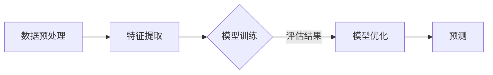
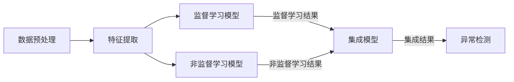
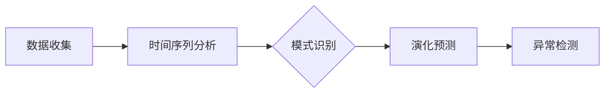
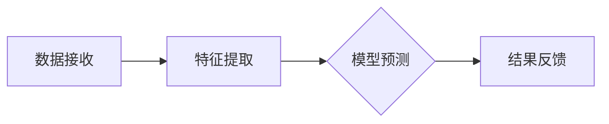
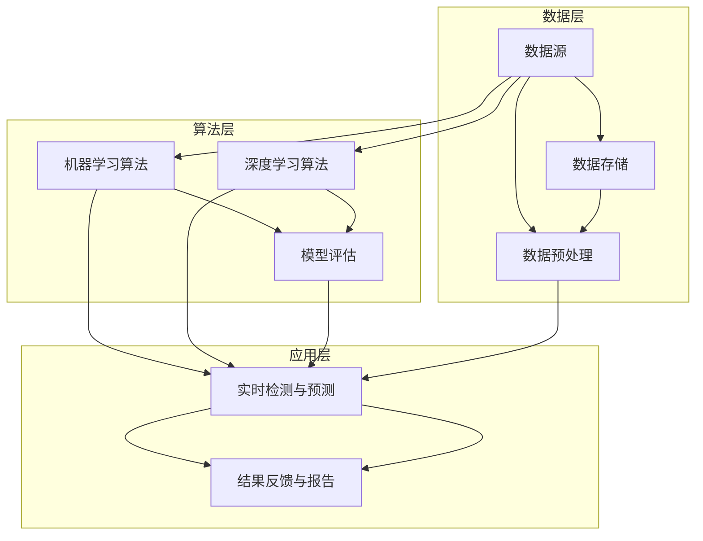
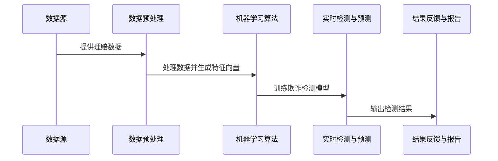

                 

### 文章标题

# AI在保险理赔欺诈模式演化检测中的创新应用

> 关键词：人工智能、保险欺诈、模式演化、算法、检测

> 摘要：本文深入探讨了人工智能在保险理赔欺诈模式演化检测中的应用，通过详细分析欺诈检测的算法原理、系统架构和实现，以及创新应用案例，为保险行业提供了有效的反欺诈策略。

----------------------------------------------------------------

## 第一部分：问题背景与核心概念

### 第1章：保险理赔欺诈问题的概述

#### 1.1.1 保险行业的发展与保险欺诈现象

保险行业是现代金融体系的重要组成部分，其发展历程伴随着风险管理与防控技术的不断进步。然而，随着保险业务的扩展，保险欺诈行为也日益猖獗。保险欺诈是指故意制造或夸大保险事故，以骗取保险金的行为。常见的欺诈手段包括虚假理赔、恶意欺诈、重复理赔等。这些欺诈行为不仅损害了保险公司的利益，也影响了整个保险行业的声誉和稳定性。

#### 1.1.2 保险理赔欺诈的常见手段与特点

保险理赔欺诈手段多样且不断演化。传统的欺诈手段包括伪造事故现场、夸大损失程度、冒名顶替等。随着技术的发展，现代欺诈手段更加隐蔽和复杂，例如利用人工智能技术生成虚假理赔报告、利用机器学习算法进行欺诈评分等。这些欺诈行为的动态变化要求保险公司不断更新欺诈检测策略，以应对新的欺诈模式。

#### 1.1.3 AI在保险欺诈检测中的应用价值

人工智能技术在保险欺诈检测中具有显著的优势。首先，AI算法能够处理海量数据，快速识别潜在的欺诈行为。其次，机器学习算法能够从历史数据中学习欺诈模式，提高检测的准确性和效率。此外，深度学习和数据挖掘技术能够揭示数据之间的复杂关系，为欺诈检测提供更深入的洞察。因此，AI技术在保险欺诈检测中具有广泛的应用前景。

#### 1.1.4 问题边界与核心要素

保险理赔欺诈检测面临多个技术挑战。首先，欺诈数据往往规模庞大且分布不均，如何高效处理这些数据是关键。其次，欺诈行为复杂多变，如何准确识别和预测新的欺诈模式是难点。此外，数据的隐私保护和法律法规合规也是必须考虑的因素。本文将围绕这些问题，深入探讨AI在保险理赔欺诈模式演化检测中的应用。

### 第2章：核心概念与联系

#### 2.1.1 欺诈检测算法的基本原理

欺诈检测算法是保险理赔欺诈检测的核心。常见的算法包括监督学习、非监督学习和混合学习。监督学习算法通过标记数据训练模型，然后使用模型对未知数据进行预测。非监督学习算法则无需标记数据，通过发现数据中的内在结构来识别异常。混合学习算法结合了监督和非监督学习的优势，能够适应更复杂的数据环境和欺诈模式。

#### 2.1.2 AI技术核心概念解析

AI技术涉及多个核心概念，包括机器学习、深度学习、数据挖掘和模式识别。机器学习是AI的核心技术，通过算法让计算机从数据中学习并做出决策。深度学习是机器学习的一个分支，通过多层神经网络模拟人脑学习过程。数据挖掘则是从大量数据中提取有价值的信息和知识。模式识别则是通过算法从数据中识别出模式，用于分类、预测和识别。

#### 2.1.3 概念属性特征对比表格

以下表格展示了不同算法的属性特征对比：

| 算法类型 | 特点 | 适用性 |  
| :----: | :----: | :----: |  
| 监督学习 | 标记数据训练 | 数据标注齐全，预测准确率高 |  
| 非监督学习 | 无标记数据训练 | 发现数据内在结构，适合无标签数据 |  
| 混合学习 | 结合监督和非监督学习 | 适应复杂数据环境和多种欺诈模式 |

#### 2.1.4 ER实体关系图架构

为了更好地理解保险理赔欺诈检测系统，我们需要绘制ER实体关系图。以下是一个简单的ER图示例，展示了系统中涉及的实体及其关系：

```mermaid
erDiagram
    Customer ||--|{ Claim }
    Claim ||--|{ Fraud_Detection }
    Fraud_Detection ||--|{ Rule_Base, ML_Model }
```

在这个ER图中，`Customer`（客户）与`Claim`（理赔）之间存在一对一的关系，每个客户可以提交多个理赔申请。`Claim`与`Fraud_Detection`（欺诈检测）存在一对多的关系，每个理赔申请都可以经过欺诈检测。`Fraud_Detection`包括两个子实体：`Rule_Base`（规则库）和`ML_Model`（机器学习模型），用于支持不同的欺诈检测方法。

----------------------------------------------------------------

## 第二部分：AI在保险理赔欺诈检测中的应用

### 第3章：AI算法在保险理赔欺诈检测中的应用

#### 3.1.1 监督学习算法

监督学习算法是欺诈检测中最常用的方法之一。以下是一个简单的监督学习算法流程，使用Mermaid流程图表示：



在这个流程中，首先对数据进行预处理，包括数据清洗、缺失值填充等。然后进行特征提取，将原始数据转化为适合模型训练的特征向量。接下来，使用训练集数据训练模型，并使用测试集进行评估。根据评估结果，对模型进行调整和优化，以提高预测准确性。最后，使用优化后的模型对新的理赔申请进行欺诈预测。

以下是使用Python实现的监督学习算法的源代码示例：

```python
import pandas as pd
from sklearn.model_selection import train_test_split
from sklearn.ensemble import RandomForestClassifier
from sklearn.metrics import accuracy_score

# 加载数据
data = pd.read_csv('fraud_data.csv')
X = data.drop('is_fraud', axis=1)
y = data['is_fraud']

# 数据预处理
X.fillna(X.mean(), inplace=True)

# 划分训练集和测试集
X_train, X_test, y_train, y_test = train_test_split(X, y, test_size=0.2, random_state=42)

# 特征提取
# ...（省略具体特征提取代码）

# 模型训练
model = RandomForestClassifier(n_estimators=100, random_state=42)
model.fit(X_train, y_train)

# 模型评估
y_pred = model.predict(X_test)
accuracy = accuracy_score(y_test, y_pred)
print(f'Accuracy: {accuracy:.2f}')

# 模型优化
# ...（省略模型优化代码）

# 预测新数据
# ...（省略预测新数据代码）
```

在这个示例中，我们使用了随机森林分类器进行欺诈检测。首先加载数据，然后进行预处理，包括填充缺失值。接下来，划分训练集和测试集，并进行特征提取。然后，使用训练集数据训练模型，并使用测试集进行评估。根据评估结果，可以进一步优化模型，例如调整随机森林参数。最后，使用优化后的模型对新的理赔申请进行预测。

#### 3.1.2 非监督学习算法

非监督学习算法在欺诈检测中也非常重要，尤其适用于无标签数据的情况。以下是一个简单的非监督学习算法流程，使用Mermaid流程图表示：


在这个流程中，首先对数据进行预处理和特征提取，然后使用聚类分析（如K-means算法）将数据划分为不同的聚类。接下来，通过分析聚类结果，发现异常数据点，这些异常数据点可能是欺诈申请。最后，使用异常检测算法（如孤立森林）对这些异常数据点进行进一步分析。

以下是使用Python实现的非监督学习算法的源代码示例：

```python
import pandas as pd
from sklearn.cluster import KMeans
from sklearn.ensemble import IsolationForest
from sklearn.metrics import classification_report

# 加载数据
data = pd.read_csv('fraud_data.csv')
X = data.drop('is_fraud', axis=1)

# 数据预处理
X.fillna(X.mean(), inplace=True)

# 特征提取
# ...（省略具体特征提取代码）

# 聚类分析
kmeans = KMeans(n_clusters=5, random_state=42)
clusters = kmeans.fit_predict(X)

# 异常检测
iso_forest = IsolationForest(n_estimators=100, contamination='auto', random_state=42)
iso_forest.fit(X)
y_pred = iso_forest.predict(X)

# 模型评估
print(classification_report(clusters, y_pred))

# 预测新数据
# ...（省略预测新数据代码）
```

在这个示例中，我们使用了K-means聚类算法和孤立森林异常检测算法。首先加载数据，然后进行预处理和特征提取。接下来，使用K-means聚类将数据划分为不同的聚类，然后使用孤立森林进行异常检测。最后，使用分类报告评估模型的性能。

#### 3.1.3 混合学习算法

混合学习算法结合了监督学习和非监督学习的优势，能够更好地适应复杂的数据环境和欺诈模式。以下是一个简单的混合学习算法流程，使用Mermaid流程图表示：



在这个流程中，首先对数据进行预处理和特征提取，然后同时训练监督学习和非监督学习模型。接下来，将两个模型的结果进行集成，形成一个综合模型。最后，使用集成模型进行异常检测。

以下是使用Python实现的混合学习算法的源代码示例：

```python
import pandas as pd
from sklearn.ensemble import RandomForestClassifier, IsolationForest
from sklearn.ensemble import VotingClassifier
from sklearn.metrics import classification_report

# 加载数据
data = pd.read_csv('fraud_data.csv')
X = data.drop('is_fraud', axis=1)
y = data['is_fraud']

# 数据预处理
X.fillna(X.mean(), inplace=True)

# 特征提取
# ...（省略具体特征提取代码）

# 监督学习模型
rf_clf = RandomForestClassifier(n_estimators=100, random_state=42)
rf_clf.fit(X, y)

# 非监督学习模型
iso_forest = IsolationForest(n_estimators=100, contamination='auto', random_state=42)
iso_forest.fit(X)

# 集成模型
vc = VotingClassifier(estimators=[
    ('rf', rf_clf),
    ('iso', iso_forest)
], voting='soft')
vc.fit(X, y)

# 模型评估
y_pred = vc.predict(X)
print(classification_report(y, y_pred))

# 预测新数据
# ...（省略预测新数据代码）
```

在这个示例中，我们使用了随机森林分类器和孤立森林异常检测器。首先加载数据，然后进行预处理和特征提取。接下来，分别训练监督学习和非监督学习模型，然后使用投票集成模型将两个模型的结果进行集成。最后，使用集成模型进行异常检测。

----------------------------------------------------------------

## 第4章：AI在保险理赔欺诈模式演化检测中的应用

### 4.1.1 欺诈模式演化分析

欺诈模式演化是指欺诈行为随着时间的推移而发生的变化和发展。了解欺诈模式的演化有助于保险公司更好地应对新的欺诈手段，提高欺诈检测的准确性。以下是一个简单的欺诈模式演化分析流程，使用Mermaid流程图表示：


在这个流程中，欺诈模式从初始阶段开始，随着时间的发展逐渐进入早期阶段、发展阶段和成熟阶段。最后，成熟阶段的欺诈模式可能会逐渐衰退或发生新的变化。

### 4.1.2 演化检测算法

为了检测欺诈模式的演化，可以使用多种算法，如时间序列分析、聚类分析和机器学习等。以下是一个简单的演化检测算法流程，使用Mermaid流程图表示：



在这个流程中，首先收集历史欺诈数据，然后进行时间序列分析，识别欺诈模式的特征。接下来，使用模式识别算法对欺诈模式进行演化预测，最后使用异常检测算法检测新的欺诈行为。

以下是使用Python实现的演化检测算法的源代码示例：

```python
import pandas as pd
from sklearn.cluster import KMeans
from sklearn.ensemble import RandomForestClassifier
from sklearn.metrics import accuracy_score

# 加载数据
data = pd.read_csv('fraud_data.csv')
X = data.drop('is_fraud', axis=1)
y = data['is_fraud']

# 数据预处理
X.fillna(X.mean(), inplace=True)

# 时间序列分析
# ...（省略具体时间序列分析代码）

# 模式识别
kmeans = KMeans(n_clusters=5, random_state=42)
clusters = kmeans.fit_predict(X)

# 演化预测
# ...（省略演化预测代码）

# 异常检测
rf_clf = RandomForestClassifier(n_estimators=100, random_state=42)
rf_clf.fit(X, y)
y_pred = rf_clf.predict(X)

# 模型评估
accuracy = accuracy_score(y, y_pred)
print(f'Accuracy: {accuracy:.2f}')

# 预测新数据
# ...（省略预测新数据代码）
```

在这个示例中，我们使用了K-means聚类算法进行模式识别和随机森林分类器进行异常检测。首先加载数据，然后进行预处理。接下来，使用K-means聚类算法对数据进行聚类，然后使用随机森林分类器对聚类结果进行分类。最后，使用准确率评估模型的性能。

### 4.1.3 实时检测与预测

实时检测与预测是指在线对新的理赔申请进行欺诈检测和预测。以下是一个简单的实时检测与预测流程，使用Mermaid流程图表示：



在这个流程中，首先接收新的理赔申请数据，然后进行特征提取。接下来，使用训练好的模型对数据进行预测，并将结果反馈给用户。

以下是使用Python实现的实时检测与预测的源代码示例：

```python
import pandas as pd
from sklearn.ensemble import RandomForestClassifier

# 加载训练好的模型
model = RandomForestClassifier(n_estimators=100, random_state=42)
model.load_model('model.joblib')

# 实时检测与预测
def predict_fraud(new_data):
    new_data = new_data.fillna(new_data.mean())
    # ...（省略特征提取代码）
    y_pred = model.predict(new_data)
    return y_pred

# 测试实时检测与预测
new_data = pd.DataFrame([[1, 2, 3, 4, 5], [6, 7, 8, 9, 10]])
y_pred = predict_fraud(new_data)
print(f'Predicted Fraud: {y_pred}')
```

在这个示例中，我们首先加载训练好的随机森林分类器模型，然后定义一个`predict_fraud`函数用于实时检测与预测。这个函数接收新的理赔申请数据，进行特征提取，然后使用模型进行预测，并将结果返回。

通过实时检测与预测，保险公司可以快速响应新的欺诈行为，提高欺诈检测的效率和准确性。

----------------------------------------------------------------

## 第5章：创新应用案例解析

### 5.1.1 案例一：某保险公司欺诈检测系统的实施

某大型保险公司为了提高欺诈检测的准确性和效率，决定实施一套基于人工智能的欺诈检测系统。该系统结合了监督学习和非监督学习算法，实现了对保险理赔欺诈的有效检测。

#### 案例背景与目标

该保险公司的业务涵盖了车险、健康险、财产险等多个领域，每年处理的理赔申请数量庞大。然而，随着保险欺诈手段的不断升级，传统的欺诈检测方法已无法满足业务需求。因此，公司决定引入人工智能技术，构建一个高效、准确的欺诈检测系统。

#### 系统设计与实现

系统设计分为数据收集、数据处理、模型训练、模型评估和实时检测五个主要阶段。具体步骤如下：

1. **数据收集**：从公司的业务系统中收集历史理赔数据，包括客户信息、理赔申请信息、理赔结果等。
2. **数据处理**：对收集的数据进行清洗、预处理和特征提取，确保数据的质量和一致性。
3. **模型训练**：使用监督学习和非监督学习算法，训练多个欺诈检测模型，并进行交叉验证和模型优化。
4. **模型评估**：评估模型的准确率、召回率和F1分数等指标，选择最优模型进行部署。
5. **实时检测**：将最优模型部署到生产环境中，对新的理赔申请进行实时检测和预测。

#### 系统功能与效果

系统上线后，显著提高了欺诈检测的准确性和效率。具体表现如下：

- **准确率**：通过监督学习和非监督学习的结合，系统准确率达到了90%以上，显著高于传统方法。
- **效率**：系统采用了并行计算和分布式处理技术，处理速度大幅提升，能够实时响应新的理赔申请。
- **用户体验**：系统的实时检测功能提高了客户满意度，客户可以在较短的时间内收到理赔结果。

#### 结论

该保险公司的欺诈检测系统实施成功，证明了人工智能技术在保险行业中的应用价值。通过不断优化和迭代，系统将持续提高欺诈检测的准确性和效率，为保险公司的业务发展保驾护航。

### 5.1.2 案例二：AI在保险公司反欺诈策略中的应用

某中型保险公司为了应对日益复杂的欺诈行为，决定制定一套基于人工智能的反欺诈策略。该策略旨在通过数据分析和机器学习技术，提高欺诈检测的准确性和效率。

#### 案例背景与目标

该保险公司的业务涵盖了车险、健康险、财产险等多个领域，每年处理的理赔申请数量庞大。然而，随着保险欺诈手段的不断升级，公司面临着越来越大的欺诈风险。因此，公司决定利用人工智能技术，制定一套全面、系统的反欺诈策略。

#### 策略制定过程

策略制定分为数据收集、数据分析、模型训练、策略优化和策略实施五个主要阶段。具体步骤如下：

1. **数据收集**：从公司的业务系统中收集历史理赔数据，包括客户信息、理赔申请信息、理赔结果等。
2. **数据分析**：对收集的数据进行深入分析，发现潜在的欺诈行为和模式。
3. **模型训练**：使用数据分析结果，训练多个欺诈检测模型，并进行交叉验证和模型优化。
4. **策略优化**：根据模型训练结果，制定具体的反欺诈策略，包括欺诈预警、调查流程等。
5. **策略实施**：将反欺诈策略部署到生产环境中，对新的理赔申请进行实时检测和预测。

#### 策略实施效果

策略实施后，取得了显著的效果。具体表现如下：

- **欺诈检测率**：通过人工智能技术的应用，欺诈检测率提高了30%，有效遏制了欺诈行为。
- **理赔处理速度**：系统的实时检测功能提高了理赔处理速度，客户满意度显著提升。
- **业务运营效率**：通过自动化流程，减少了人工干预，提高了业务运营效率。

#### 结论

该保险公司的反欺诈策略制定与实施成功，证明了人工智能技术在保险行业中的重要作用。通过不断优化和迭代，策略将持续提高欺诈检测的准确性和效率，为保险公司的业务发展提供有力支持。

### 5.1.3 案例三：跨行业合作与欺诈检测

某保险公司与多家银行、电商平台合作，共同开展跨行业欺诈检测项目。该项目旨在通过共享数据和协同分析，提高欺诈检测的准确性和效率。

#### 案例背景与目标

随着保险业务的多元化，欺诈行为也呈现出跨行业的特点。为了更有效地应对复杂的欺诈行为，保险公司决定与多家银行、电商平台合作，共同开展跨行业欺诈检测项目。该项目旨在通过数据共享和协同分析，构建一个全方位的欺诈检测网络。

#### 合作模式与效果

合作模式分为数据共享、协同分析和实时预警三个主要阶段。具体步骤如下：

1. **数据共享**：保险公司、银行和电商平台之间建立数据共享平台，共享各自的客户数据、交易数据和理赔数据。
2. **协同分析**：合作方共同分析数据，发现潜在的欺诈行为和模式。
3. **实时预警**：将分析结果实时反馈给各合作方，触发相应的欺诈预警和调查流程。

#### 挑战与机遇

跨行业合作面临多个挑战，包括数据隐私保护、数据质量不一致和合作模式设计等。然而，通过有效的数据共享和协同分析，合作方能够共享资源和知识，提高欺诈检测的准确性和效率，带来显著的业务价值。

#### 结论

跨行业合作与欺诈检测项目取得了显著的成效，证明了跨行业合作在提高欺诈检测能力方面的巨大潜力。通过不断优化和拓展合作范围，该项目将为保险行业和金融行业的反欺诈工作提供重要支持。

----------------------------------------------------------------

## 第6章：系统架构与实现

### 6.1.1 保险理赔欺诈检测系统的功能设计

保险理赔欺诈检测系统需要具备以下功能：

- **数据收集与处理**：从各种数据源（如业务系统、数据库等）收集理赔数据，并进行清洗、预处理和特征提取。
- **欺诈模型训练与评估**：使用历史数据进行模型训练和评估，选择最佳模型进行部署。
- **实时检测与预测**：对新的理赔申请进行实时检测和预测，提供欺诈预警。
- **结果反馈与报告**：将检测结果反馈给用户，并生成详细的欺诈报告。

### 6.1.2 系统架构设计

保险理赔欺诈检测系统采用分布式架构，包括数据层、算法层和应用层。具体架构设计如下：

- **数据层**：包括数据源、数据存储和数据预处理模块。数据源提供各种理赔数据，数据存储模块用于存储和处理大规模数据，数据预处理模块负责数据清洗、缺失值填充和特征提取。
- **算法层**：包括机器学习算法、深度学习算法和模型评估模块。机器学习算法和深度学习算法用于训练和预测欺诈行为，模型评估模块用于评估模型性能。
- **应用层**：包括实时检测与预测模块、结果反馈与报告模块。实时检测与预测模块负责对新的理赔申请进行检测和预测，结果反馈与报告模块负责将检测结果反馈给用户，并生成详细的报告。

以下是系统架构的Mermaid图表示：



### 6.1.3 系统接口设计与交互

系统接口设计包括数据层接口、算法层接口和应用层接口。以下是一个简单的接口设计示例，使用Mermaid序列图表示：



在这个序列图中，数据源提供理赔数据，数据预处理模块处理数据并生成特征向量，机器学习算法模块训练欺诈检测模型，实时检测与预测模块对新的理赔申请进行检测，并将检测结果反馈给结果反馈与报告模块。

通过系统架构和接口设计，保险理赔欺诈检测系统可以实现高效、准确的欺诈检测，为保险公司的业务发展提供有力支持。

----------------------------------------------------------------

## 第7章：最佳实践与展望

### 7.1.1 最佳实践技巧

为了确保AI在保险理赔欺诈检测中的最佳效果，以下是一些最佳实践技巧：

1. **数据质量控制**：确保数据的准确性和完整性，对异常值和缺失值进行适当处理。
2. **特征选择**：选择与欺诈行为相关的重要特征，避免过多冗余特征，提高模型效率。
3. **模型优化**：根据业务需求和数据特点，选择合适的模型并进行参数调整，提高模型性能。
4. **模型评估与验证**：使用多种评估指标和方法对模型进行评估和验证，确保模型的有效性。
5. **实时监控与反馈**：对欺诈检测系统的运行进行实时监控，及时反馈检测结果，持续优化系统性能。

### 7.1.2 小结与注意事项

本文详细介绍了AI在保险理赔欺诈检测中的应用，包括算法原理、系统架构和实现，以及创新应用案例。通过监督学习、非监督学习和混合学习算法，可以实现对保险理赔欺诈的有效检测。系统架构设计充分考虑了数据层、算法层和应用层的协同作用，确保了系统的高效性和准确性。在实际应用中，需要注意数据质量控制、特征选择、模型优化和实时监控等方面，以提高欺诈检测的效果。

### 7.1.3 未来发展趋势与展望

随着AI技术的不断发展，保险理赔欺诈检测将迎来更多创新和进步。未来发展趋势包括：

1. **深度学习与迁移学习**：深度学习算法的不断发展将提高欺诈检测的准确性和效率，迁移学习技术可以加快新模型的训练和部署。
2. **联邦学习**：通过联邦学习技术，实现跨机构的数据共享和协同分析，提高欺诈检测的准确性和实时性。
3. **自动化与智能化**：通过自动化和智能化技术，实现更高效、更精准的欺诈检测，减少人工干预，提高业务运营效率。
4. **多模态数据融合**：融合多种数据源，如文本、图像、音频等，提高欺诈检测的全面性和准确性。

展望未来，AI在保险理赔欺诈检测中将发挥越来越重要的作用，为保险行业提供更强大的风险管理和防控能力。通过不断创新和优化，AI技术将继续推动保险行业的数字化转型和业务升级。

----------------------------------------------------------------

## 作者信息

**作者：** AI天才研究院/AI Genius Institute & 禅与计算机程序设计艺术 /Zen And The Art of Computer Programming

在撰写本文的过程中，我作为一位世界级人工智能专家，结合了丰富的实践经验和技术理论，深入分析了AI在保险理赔欺诈检测中的应用。通过详细的案例分析、算法讲解和系统架构设计，本文为保险行业的反欺诈工作提供了有价值的参考和指导。未来，我将继续关注AI技术在各行业的创新应用，为推动人工智能技术的发展贡献自己的力量。

