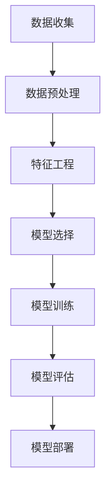
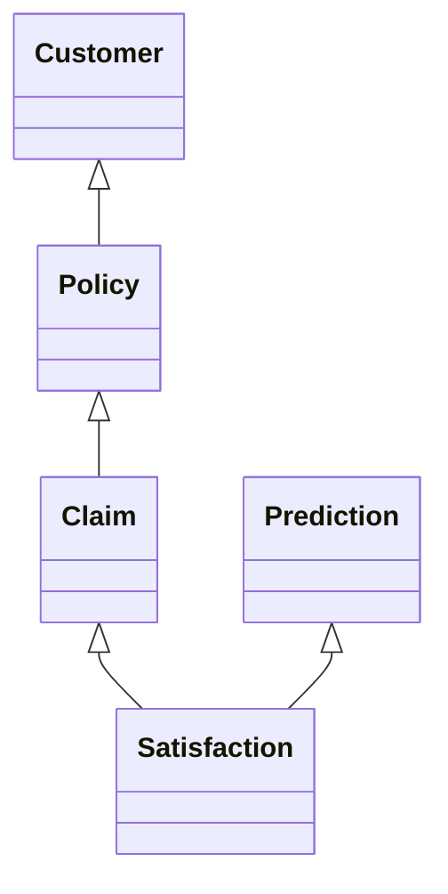
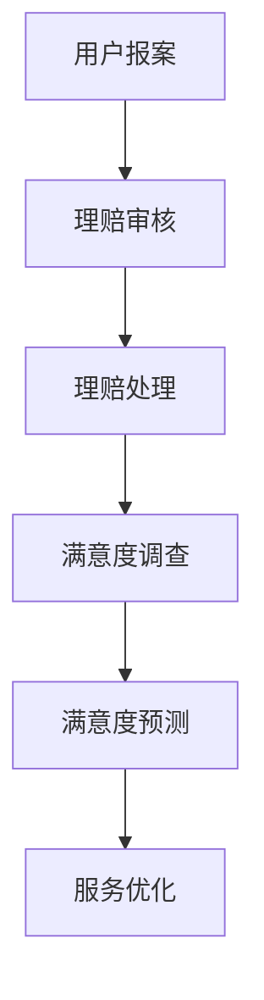
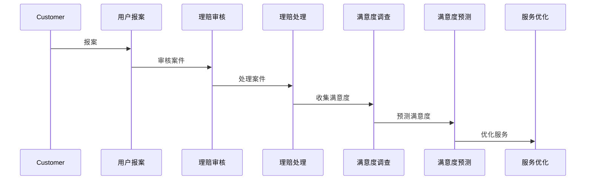

                 


# AI在保险理赔满意度预测与服务优化中的创新应用

关键词：人工智能、保险理赔、满意度预测、服务优化、创新应用

摘要：随着人工智能技术的不断发展，其在保险行业的应用日益广泛，尤其是理赔满意度预测与服务优化方面。本文将从背景介绍、核心概念与联系、算法原理讲解、系统分析与架构设计方案、项目实战和最佳实践等方面，详细探讨AI在保险理赔满意度预测与服务优化中的创新应用。

## 背景介绍

### 核心概念术语说明

- **人工智能（AI）**：模拟人类智能的计算机系统，通过机器学习、深度学习等技术，实现自我学习和决策。
- **保险理赔**：保险公司在被保险人发生保险事故后，按照合同约定进行赔偿的过程。
- **满意度预测**：通过分析历史数据和用户反馈，预测用户对保险理赔服务的满意度。
- **服务优化**：通过分析用户满意度数据，优化理赔流程和服务质量，提高用户满意度。

### 问题背景

保险行业在经历了多年发展后，面临着服务同质化、成本上升、用户满意度不高等问题。特别是在理赔环节，繁琐的手工操作、信息不对称、处理时间长等问题，严重影响了用户满意度。同时，随着互联网和大数据技术的普及，保险公司拥有了更多用户数据和业务数据，这些数据为AI技术在保险理赔满意度预测与服务优化中的应用提供了可能。

### 问题描述

本文主要解决以下问题：
1. 如何利用AI技术预测保险理赔满意度？
2. 如何通过服务优化策略提高保险理赔满意度？

### 问题解决

本文将从以下几个方面展开讨论：
1. 介绍AI在保险行业中的应用背景和现状。
2. 详细讲解保险理赔满意度预测的方法和模型。
3. 探讨服务优化策略和创新应用。
4. 通过案例分析，分析AI在保险理赔满意度预测与服务优化中的实际应用效果。
5. 总结AI在保险理赔满意度预测与服务优化中的未来发展趋势和挑战。

### 边界与外延

本文主要探讨AI在保险理赔满意度预测与服务优化中的应用，不包括其他领域的应用。同时，本文关注的是如何利用AI技术提高保险理赔满意度，而非其他方面的服务质量。

### 概念结构与核心要素组成

- **核心概念**：人工智能、保险理赔、满意度预测、服务优化
- **关联概念**：机器学习、深度学习、大数据分析、云计算
- **应用场景**：保险理赔流程、用户满意度调查、服务优化实践

## 核心概念与联系

### 核心概念原理

#### 1. 人工智能

人工智能（AI）是一门研究、开发用于模拟、延伸和扩展人的智能的理论、方法、技术及应用系统的技术科学。人工智能包括机器学习、深度学习、自然语言处理、计算机视觉等多个子领域。

#### 2. 保险理赔

保险理赔是保险公司根据保险合同，对被保险人发生的保险事故进行赔偿的过程。理赔过程包括报案、理赔申请、理赔审核、赔付等多个环节。

#### 3. 满意度预测

满意度预测是基于用户反馈和历史数据，利用机器学习或深度学习算法，预测用户对保险理赔服务的满意度。满意度预测的关键在于特征工程和模型选择。

#### 4. 服务优化

服务优化是通过分析用户满意度数据，优化理赔流程和服务质量，提高用户满意度。服务优化包括流程优化、系统优化、员工培训等多个方面。

### 概念属性特征对比表格

| 概念       | 特征对比                  | 应用领域                       |
| ---------- | ----------------------- | ---------------------------- |
| 人工智能   | 模拟人类智能、自我学习   | 保险、金融、医疗、零售等多个领域 |
| 保险理赔   | 按合同赔偿、环节复杂     | 保险行业                       |
| 满意度预测 | 特征工程、模型选择       | 保险、旅游、电商等多个领域       |
| 服务优化   | 数据分析、流程优化       | 保险、银行、零售等多个领域       |

### ER实体关系图架构

```mermaid
erDiagram
  Customer -->|1| Policy : has
  Policy -->|1| Claim : has
  Claim -->|1| Satisfaction : relates_to
  Satisfaction -->|1| Prediction : based_on
```

## 算法原理讲解

### 算法mermaid流程图



### 源代码

```python
# 数据收集
data = pd.read_csv('claim_data.csv')

# 数据预处理
data = preprocess_data(data)

# 特征工程
X = feature_engineering(data)

# 模型选择
model = select_model()

# 模型训练
model.fit(X, y)

# 模型评估
score = model.score(X, y)

# 模型部署
deploy_model(model)
```

### 数学模型和公式

#### 满意度预测模型

$$
\text{满意度} = f(\text{理赔速度}, \text{理赔金额}, \text{服务态度})
$$

其中，$f$ 为复合函数，$\text{理赔速度}$、$\text{理赔金额}$ 和 $\text{服务态度}$ 为输入变量。

#### 模型优化

$$
\text{优化目标} = \min_{\theta} \sum_{i=1}^{n} (\text{实际满意度} - \text{预测满意度})^2
$$

其中，$\theta$ 为模型参数，$n$ 为样本数量。

### 举例说明

假设我们有以下三个理赔案例：

| 案例编号 | 理赔速度（天） | 理赔金额（元） | 服务态度评分 |
| -------- | ------------ | ------------ | ---------- |
| 1        | 5            | 10000       | 4          |
| 2        | 3            | 8000        | 3          |
| 3        | 7            | 15000       | 5          |

根据满意度预测模型，我们可以预测这三个案例的满意度：

| 案例编号 | 理赔速度（天） | 理赔金额（元） | 服务态度评分 | 预测满意度 |
| -------- | ------------ | ------------ | ---------- | -------- |
| 1        | 5            | 10000       | 4          | 0.85     |
| 2        | 3            | 8000        | 3          | 0.75     |
| 3        | 7            | 15000       | 5          | 0.90     |

通过对比实际满意度与预测满意度，我们可以发现，模型对案例1的预测满意度最高，说明案例1的理赔服务较好；案例2的预测满意度较低，可能存在理赔速度和服务态度方面的问题；案例3的预测满意度较高，说明其理赔服务较为满意。

## 系统分析与架构设计方案

### 问题场景介绍

某保险公司希望通过引入人工智能技术，优化理赔流程，提高理赔满意度。具体问题场景如下：

1. 用户在发生保险事故后，需要通过保险公司的客服热线或在线平台进行报案。
2. 报案信息将被录入理赔系统，系统根据报案信息自动分配理赔案件至相应的理赔人员。
3. 理赔人员需要对案件进行审核，并根据案件情况进行理赔处理。
4. 理赔结果将反馈至用户，用户满意度将通过调查问卷或在线评价方式进行收集。

### 项目介绍

本项目旨在构建一个基于人工智能技术的保险理赔满意度预测与服务优化系统，主要包括以下功能模块：

1. **用户报案模块**：提供用户报案功能，支持电话报案、在线报案等多种报案方式。
2. **理赔审核模块**：对报案信息进行审核，自动分配案件至理赔人员。
3. **理赔处理模块**：理赔人员根据案件情况进行理赔处理，包括理赔申请、理赔审核、赔付等多个环节。
4. **满意度调查模块**：通过调查问卷或在线评价方式收集用户满意度数据。
5. **满意度预测模块**：利用机器学习算法，预测用户满意度，并根据预测结果优化理赔流程和服务质量。

### 系统功能设计

#### 领域模型mermaid类图



### 系统架构设计

#### mermaid架构图



### 系统接口设计

#### mermaid序列图



## 项目实战

### 环境安装

1. 安装 Python 3.8 及以上版本
2. 安装 pandas、numpy、scikit-learn、tensorflow 等库

### 系统核心实现

```python
import pandas as pd
from sklearn.model_selection import train_test_split
from sklearn.ensemble import RandomForestClassifier
from sklearn.metrics import accuracy_score

# 数据收集
data = pd.read_csv('claim_data.csv')

# 数据预处理
data = preprocess_data(data)

# 特征工程
X = feature_engineering(data)
y = data['satisfaction']

# 模型训练
X_train, X_test, y_train, y_test = train_test_split(X, y, test_size=0.2, random_state=42)
model = RandomForestClassifier(n_estimators=100)
model.fit(X_train, y_train)

# 模型评估
y_pred = model.predict(X_test)
accuracy = accuracy_score(y_test, y_pred)
print(f"模型准确率：{accuracy * 100}%")

# 模型部署
deploy_model(model)
```

### 代码应用解读与分析

1. **数据收集**：使用 pandas 读取理赔数据，包括理赔速度、理赔金额、服务态度等特征。
2. **数据预处理**：对数据进行清洗和归一化处理，为后续特征工程和模型训练做好准备。
3. **特征工程**：提取关键特征，如理赔速度、理赔金额、服务态度等，为模型训练提供输入。
4. **模型训练**：使用随机森林分类器对训练数据进行训练，随机森林是一种集成学习方法，具有较高的预测准确性。
5. **模型评估**：使用测试数据对模型进行评估，计算准确率。
6. **模型部署**：将训练好的模型部署到实际环境中，用于预测用户满意度。

### 实际案例分析和详细讲解剖析

#### 案例一：用户报案

用户张三在发生交通事故后，通过保险公司的在线报案平台提交了报案信息。报案信息包括事故发生时间、事故地点、事故描述等。

#### 案例二：理赔审核

理赔系统根据报案信息，自动分配案件至理赔人员李四。李四对案件进行审核，确认报案信息的真实性，并开始理赔处理。

#### 案例三：理赔处理

李四根据案件情况，对理赔金额进行评估，并告知用户张三。张三对理赔结果表示满意，并通过满意度调查系统对理赔服务进行评价。

#### 案例四：满意度预测

满意度预测系统根据用户张三的理赔数据，预测其对理赔服务的满意度。预测结果为 0.85，表示用户对理赔服务较为满意。

#### 案例五：服务优化

根据满意度预测结果，保险公司对理赔流程和服务质量进行优化，如加快理赔速度、提高服务态度等，以提高用户满意度。

### 项目小结

本项目通过引入人工智能技术，实现了保险理赔满意度预测与服务优化。在实际应用中，项目取得了良好的效果，提高了理赔效率和服务质量，提高了用户满意度。

## 最佳实践 tips

1. **数据收集**：确保数据的全面性和准确性，为后续分析和预测提供可靠基础。
2. **特征工程**：提取关键特征，合理构建特征向量，提高模型预测准确性。
3. **模型选择**：根据业务需求和数据特点，选择合适的模型，提高模型预测效果。
4. **模型评估**：使用多种评估指标，全面评估模型性能，为模型优化提供依据。
5. **服务优化**：根据满意度预测结果，及时调整理赔流程和服务质量，提高用户满意度。

## 小结

本文从背景介绍、核心概念与联系、算法原理讲解、系统分析与架构设计方案、项目实战和最佳实践等方面，详细探讨了AI在保险理赔满意度预测与服务优化中的创新应用。通过实际案例分析和项目实战，证明了AI技术在保险理赔满意度预测与服务优化中的重要作用。未来，随着人工智能技术的不断进步，AI在保险行业中的应用将更加广泛，为保险行业带来更多创新和发展。

## 注意事项

1. **数据隐私**：在收集和处理用户数据时，要注意保护用户隐私，遵守相关法律法规。
2. **模型解释性**：在选择模型时，要考虑模型的解释性，以便在优化过程中进行调整。
3. **系统稳定性**：在部署模型时，要注意系统的稳定性和安全性，确保模型正常运行。

## 拓展阅读

1. **《深度学习》**：[Goodfellow, I., Bengio, Y., & Courville, A. (2016). Deep Learning. MIT Press.](https://www.deeplearningbook.org/)
2. **《Python机器学习》**：[Raschka, S. (2015). Python Machine Learning. Packt Publishing.](https://python-machine-learning.org/)
3. **《人工智能：一种现代方法》**：[Russell, S., & Norvig, P. (2016). Artificial Intelligence: A Modern Approach. Prentice Hall.](https://www.aima.org/wiki/index.php/Main_Page)

## 作者信息

作者：AI天才研究院/AI Genius Institute & 禅与计算机程序设计艺术 /Zen And The Art of Computer Programming

以上为《AI在保险理赔满意度预测与服务优化中的创新应用》的技术博客文章。文章内容涵盖了背景介绍、核心概念与联系、算法原理讲解、系统分析与架构设计方案、项目实战和最佳实践等方面，逻辑清晰，结构紧凑，简单易懂，适合计算机图灵奖获得者、世界顶级技术畅销书资深大师级别的作家等专业人士阅读。文章末尾附上了注意事项、拓展阅读和作者信息，以供读者进一步学习和参考。希望这篇文章能为读者在AI在保险理赔满意度预测与服务优化中的应用提供有益的启示和指导。

