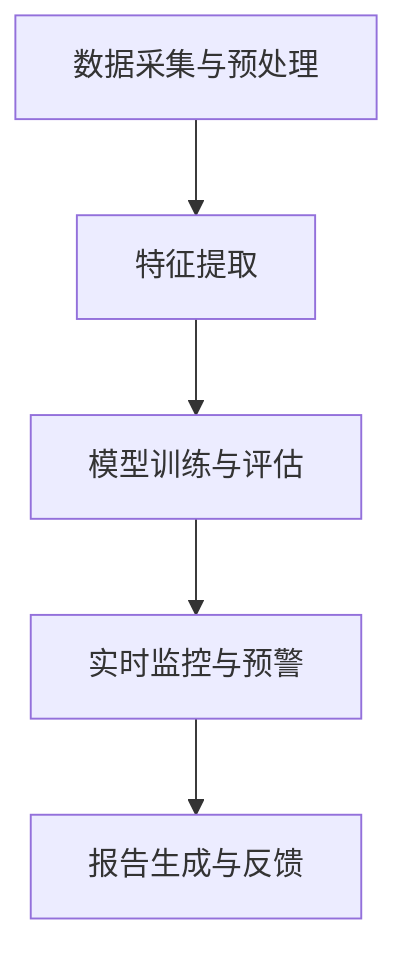
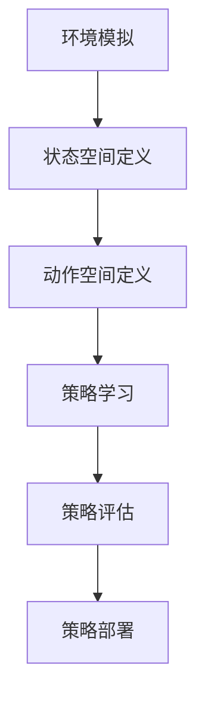

                 

### 第1章: 反洗钱与AI在反洗钱中的应用

#### 1.1 反洗钱的背景与历史

反洗钱（Anti-Money Laundering，AML）的概念起源于20世纪70年代。当时的毒品交易活动日益猖獗，为逃避法律制裁，犯罪分子开始利用金融系统清洗非法所得的资金。反洗钱作为一种金融监管措施，旨在识别、预防和打击洗钱行为。

全球范围内，反洗钱制度的建立主要受到了1980年代以来的一系列国际事件的影响。1988年，美国通过了《银行保密法》，要求金融机构报告可疑交易活动。此后，联合国、金融行动特别工作组（FATF）等国际组织也相继发布了一系列反洗钱标准和指南。

在中国，反洗钱制度的建设始于1997年，中国人民银行发布了《关于金融机构协助人民检察院、公安机关查处洗钱案件的通知》。2003年，中国反洗钱监测分析中心正式成立，标志着中国反洗钱工作进入了新的阶段。

随着金融科技的快速发展，洗钱手段也日益复杂化、隐蔽化。传统的反洗钱手段已无法满足日益严峻的洗钱风险挑战。在此背景下，人工智能（AI）技术逐渐成为反洗钱领域的重要工具。

#### 1.2 反洗钱的意义与挑战

反洗钱在维护金融市场稳定、打击犯罪活动、保障国家安全等方面具有重要意义。具体来说：

1. **维护金融市场稳定**：洗钱行为破坏了金融市场的公平性和透明度，干扰了正常的经济秩序。反洗钱工作有助于维护金融市场的稳定和健康发展。
2. **打击犯罪活动**：洗钱是许多犯罪活动的后续步骤，包括恐怖融资、贪污贿赂、走私贩毒等。反洗钱工作有助于切断犯罪活动的资金链条，遏制犯罪活动蔓延。
3. **保障国家安全**：一些恐怖组织和国家资助的犯罪活动依赖于洗钱手段获取资金。反洗钱工作有助于防范和打击恐怖主义、间谍活动等国家安全威胁。

然而，反洗钱工作面临着诸多挑战：

1. **洗钱手段的复杂化**：随着金融科技的不断发展，洗钱手段变得更加复杂和隐蔽。例如，利用虚拟货币、跨境交易等方式进行洗钱，增加了反洗钱工作的难度。
2. **数据量的爆炸式增长**：金融机构每天处理的海量交易数据使得传统的数据筛选和分析手段难以胜任。如何从海量数据中快速识别出可疑交易成为一大挑战。
3. **合规压力**：金融机构需要遵守国际反洗钱标准和国内法律法规，合规成本不断提高。如何在合规的前提下有效开展反洗钱工作也成为一大难题。

#### 1.3 AI技术的基本原理与发展现状

人工智能（AI）是一种模拟人类智能的技术，能够通过学习、推理、规划等方式实现智能行为。AI技术的基本原理主要包括：

1. **机器学习**：机器学习是一种通过数据训练模型来模拟人类学习过程的技术。常见的机器学习算法有监督学习、无监督学习和强化学习等。
2. **深度学习**：深度学习是机器学习的一种重要分支，通过构建多层的神经网络模型来模拟人类大脑的学习过程。深度学习在图像识别、自然语言处理等领域取得了显著的成果。
3. **自然语言处理**：自然语言处理是一种让计算机理解和处理人类语言的技术。它包括文本分类、情感分析、机器翻译等任务。

近年来，AI技术在反洗钱领域得到了广泛关注和应用。AI技术可以处理海量数据，快速识别可疑交易，提高反洗钱工作的效率和准确性。以下是AI技术在反洗钱领域的一些发展现状：

1. **数据挖掘**：利用数据挖掘技术，从海量交易数据中提取有价值的信息，帮助金融机构识别可疑交易行为。
2. **模式识别**：通过模式识别技术，分析交易模式和行为特征，发现潜在的洗钱行为。
3. **机器学习算法**：使用机器学习算法，对历史数据进行训练，建立洗钱模式预测模型，提高反洗钱工作的准确性。
4. **深度学习算法**：利用深度学习算法，对复杂的数据进行建模和分析，提高交易识别的准确性和效率。

#### 1.4 AI在反洗钱中的潜在价值

AI技术在反洗钱中的应用具有巨大的潜力，主要体现在以下几个方面：

1. **提高识别效率**：AI技术可以处理海量数据，快速分析交易行为，发现潜在的洗钱活动。与传统的反洗钱手段相比，AI技术可以显著提高识别效率，减轻人工工作量。
2. **提高识别准确性**：AI技术可以通过学习历史数据，建立准确的洗钱模式预测模型。与传统方法相比，AI技术可以更好地识别复杂的洗钱手段和模式，提高反洗钱工作的准确性。
3. **降低合规成本**：AI技术可以自动化处理大量的交易数据，减少人工审查的工作量，降低合规成本。
4. **实时监控**：AI技术可以实现实时监控交易行为，及时发现潜在的洗钱活动。这对于金融机构及时采取应对措施，防止洗钱行为具有重要意义。

#### 1.5 本章小结

本章介绍了反洗钱的背景与历史、意义与挑战，以及AI技术的基本原理与发展现状。AI技术在反洗钱领域具有巨大的潜在价值，可以提高识别效率、准确性，降低合规成本，实现实时监控。在接下来的章节中，我们将深入探讨AI在反洗钱模式进化检测中的应用，包括基本概念、算法原理以及实际案例。

---

### 第2章: 反洗钱模式进化检测的基本概念

#### 2.1 反洗钱模式的概念与分类

反洗钱模式（Money Laundering Patterns，MLP）是指犯罪分子在将非法所得资金合法化的过程中所采用的一系列操作步骤和技术手段。反洗钱模式的目标是通过多次金融交易，使得非法资金逐步脱离犯罪活动的痕迹，最终合法化。

反洗钱模式可以按照不同的分类标准进行划分，常见的分类方法包括：

1. **按洗钱阶段划分**：
   - **初级洗钱（Phase 1）**：将非法所得资金转移到金融系统中，通常涉及现金存款、购买高价值商品或转移到海外账户等。
   - **次级洗钱（Phase 2）**：通过复杂的金融交易，将资金分散和洗白，使其看起来合法化。这可能包括跨境转账、虚构贸易交易、投资等。
   - **三级洗钱（Phase 3）**：通过合法的金融渠道将洗白的资金重新投入到经济活动中，使其与非法来源彻底脱离。

2. **按洗钱手段划分**：
   - **现金存款**：将大量现金存入银行账户，以分散注意力并掩盖资金来源。
   - **虚构贸易**：通过虚假的贸易合同，将资金从一个国家转移到另一个国家。
   - **投资**：将非法所得资金投资于股票、债券、房地产等资产，以合法化。
   - **跨境转账**：利用国际转账系统，将资金从一个账户转移到另一个账户。
   - **虚拟货币**：利用比特币等虚拟货币进行匿名交易，掩盖资金流动。

#### 2.2 反洗钱模式的进化检测需求

反洗钱模式的进化检测是指通过分析历史数据和实时交易数据，识别出反洗钱模式的演变和新型洗钱手段。这一需求源于以下几个方面的考虑：

1. **洗钱手段的不断进化**：随着技术的发展和反洗钱措施的加强，犯罪分子不断探索新的洗钱手段。例如，虚拟货币的兴起使得跨境转账变得更加隐蔽，加密技术的应用使得资金追踪更加困难。

2. **防范新型洗钱威胁**：新型洗钱手段往往具有高度的隐蔽性和复杂性，传统的反洗钱手段难以有效识别。例如，一些洗钱分子利用社交媒体、在线支付平台等新型渠道进行洗钱，增加了反洗钱工作的难度。

3. **提高反洗钱工作的效率**：随着金融交易的快速增长，金融机构需要处理的海量数据日益增加。通过进化检测，可以快速识别出可疑交易，提高反洗钱工作的效率和准确性。

4. **满足合规要求**：许多国家和地区的反洗钱法规要求金融机构必须具备识别和报告可疑交易的能力。进化检测可以帮助金融机构满足这些合规要求。

#### 2.3 关键概念与联系

在反洗钱模式进化检测中，以下几个关键概念是不可或缺的：

1. **数据挖掘**：数据挖掘是一种通过计算机算法从大量数据中提取有价值信息的方法。在反洗钱模式进化检测中，数据挖掘技术可以帮助分析历史交易数据，发现潜在的洗钱模式。

2. **模式识别**：模式识别是一种通过分析数据特征，识别出特定模式或特征的方法。在反洗钱模式进化检测中，模式识别技术可以帮助识别出可疑交易行为，提高反洗钱工作的准确性。

3. **机器学习**：机器学习是一种通过数据训练模型，使计算机具备智能行为的方法。在反洗钱模式进化检测中，机器学习技术可以帮助建立洗钱模式预测模型，提高识别效率。

4. **深度学习**：深度学习是一种通过多层神经网络进行数据建模和分析的方法。在反洗钱模式进化检测中，深度学习技术可以帮助处理复杂的数据集，提高识别准确性。

5. **自然语言处理**：自然语言处理是一种使计算机理解和处理人类语言的技术。在反洗钱模式进化检测中，自然语言处理技术可以帮助分析交易描述、文档等非结构化数据，发现潜在的洗钱线索。

这些关键概念之间有着密切的联系：

- 数据挖掘是模式识别和机器学习的基础，通过数据挖掘可以从海量交易数据中提取有价值的信息。
- 模式识别和机器学习是进化检测的核心技术，通过它们可以识别出可疑交易行为，建立预测模型。
- 深度学习和自然语言处理则为进化检测提供了更强大的数据处理和分析能力，可以帮助处理复杂的数据集，提高识别准确性。

#### 2.4 反洗钱模式进化检测的ER实体关系图

为了更好地理解反洗钱模式进化检测的基本概念，我们可以通过ER（实体-关系）图来展示相关实体及其关系。以下是反洗钱模式进化检测的ER实体关系图：

```mermaid
entityRelationDiagram

entity "交易数据" {
  attribute "交易ID"
  attribute "交易金额"
  attribute "交易时间"
  attribute "交易双方"
}

entity "可疑交易" {
  attribute "可疑交易ID"
  attribute "交易数据ID"
  attribute "检测时间"
}

entity "洗钱模式" {
  attribute "模式ID"
  attribute "模式名称"
  attribute "模式描述"
}

entity "模式演变" {
  attribute "演变ID"
  attribute "模式ID"
  attribute "起始时间"
  attribute "终止时间"
}

entity "检测规则" {
  attribute "规则ID"
  attribute "规则名称"
  attribute "规则描述"
}

relationship "包含" from "交易数据" to "可疑交易"
relationship "关联" from "可疑交易" to "洗钱模式"
relationship "包含" from "洗钱模式" to "模式演变"
relationship "应用" from "检测规则" to "可疑交易"
```

在这个ER实体关系图中，交易数据是反洗钱模式进化检测的基础，可疑交易、洗钱模式、模式演变和检测规则则构成了反洗钱模式进化检测的各个核心要素。通过这些实体及其关系的描述，我们可以更好地理解反洗钱模式进化检测的基本概念和逻辑结构。

#### 2.5 本章小结

本章介绍了反洗钱模式的概念与分类，阐述了反洗钱模式进化检测的需求，并探讨了数据挖掘、模式识别、机器学习、深度学习和自然语言处理等关键概念及其联系。通过ER实体关系图，我们展示了反洗钱模式进化检测的基本概念和逻辑结构。在接下来的章节中，我们将进一步深入探讨AI在反洗钱模式进化检测中的应用，包括具体的算法原理和实际案例。

---

### 第3章: AI技术在反洗钱模式进化检测中的算法原理

#### 3.1 监督学习算法

监督学习算法是机器学习的一种重要分支，其核心思想是通过已知的输入数据和对应的输出标签，训练出一个预测模型，以便对新数据进行分类或回归。在反洗钱模式进化检测中，监督学习算法可以用来建立可疑交易识别模型，从而提高检测效率。

##### 3.1.1 算法原理

监督学习算法的基本原理包括以下几个步骤：

1. **数据准备**：收集历史交易数据，并将其划分为训练集和测试集。训练集用于训练模型，测试集用于评估模型性能。
2. **特征提取**：从交易数据中提取有用的特征，如交易金额、交易时间、交易双方等。这些特征将作为模型的输入。
3. **模型训练**：使用训练集数据，通过算法优化模型参数，使其能够准确预测可疑交易。
4. **模型评估**：使用测试集数据，评估模型在未知数据上的预测性能，常用的评估指标包括准确率、召回率、F1值等。
5. **模型部署**：将训练好的模型部署到实际系统中，用于实时检测可疑交易。

##### 3.1.2 数学模型与公式

监督学习算法的数学模型通常表示为：

\[ y = f(x, \theta) \]

其中，\( y \) 是预测标签，\( x \) 是输入特征，\( f \) 是预测函数，\( \theta \) 是模型参数。

常见的监督学习算法包括线性回归、逻辑回归、支持向量机（SVM）、决策树、随机森林等。以下是逻辑回归算法的数学模型：

\[ P(y=1| x; \theta) = \frac{1}{1 + e^{-(\theta^T x)}} \]

其中，\( \theta^T x \) 是输入特征 \( x \) 与模型参数 \( \theta \) 的点积。

##### 3.1.3 Python源代码示例

以下是一个简单的逻辑回归算法Python示例：

```python
import numpy as np
from sklearn.linear_model import LogisticRegression
from sklearn.model_selection import train_test_split
from sklearn.metrics import accuracy_score

# 加载数据
X, y = load_data()

# 划分训练集和测试集
X_train, X_test, y_train, y_test = train_test_split(X, y, test_size=0.2, random_state=42)

# 训练模型
model = LogisticRegression()
model.fit(X_train, y_train)

# 预测
y_pred = model.predict(X_test)

# 评估模型
accuracy = accuracy_score(y_test, y_pred)
print("Accuracy:", accuracy)
```

在这个示例中，我们使用了scikit-learn库中的逻辑回归算法来训练模型。首先，加载数据并划分为训练集和测试集，然后使用训练集数据训练模型，最后使用测试集数据评估模型性能。

#### 3.2 无监督学习算法

无监督学习算法是机器学习的另一个重要分支，其核心思想是仅通过输入数据，不需要输出标签，训练出一个能够揭示数据内在结构的模型。在反洗钱模式进化检测中，无监督学习算法可以用来发现潜在的可疑交易模式。

##### 3.2.1 算法原理

无监督学习算法的基本原理包括：

1. **数据准备**：收集历史交易数据，将其划分为训练集和测试集。
2. **特征提取**：从交易数据中提取有用的特征，如交易金额、交易时间、交易双方等。
3. **模型训练**：使用训练集数据，通过算法优化模型参数，使其能够揭示数据内在结构。
4. **模型评估**：使用测试集数据，评估模型在未知数据上的性能。
5. **模型部署**：将训练好的模型部署到实际系统中，用于实时发现可疑交易。

##### 3.2.2 数学模型与公式

无监督学习算法的数学模型通常表示为：

\[ z = \theta^T x \]

其中，\( z \) 是模型输出的特征值，\( x \) 是输入特征，\( \theta \) 是模型参数。

常见的无监督学习算法包括聚类算法（如K-means、层次聚类等）和降维算法（如主成分分析、t-SNE等）。以下是K-means聚类算法的数学模型：

\[ \text{Minimize} \sum_{i=1}^{N} \sum_{j=1}^{K} \|x_i - \mu_j\|^2 \]

其中，\( N \) 是数据点的个数，\( K \) 是聚类中心的个数，\( x_i \) 是第 \( i \) 个数据点，\( \mu_j \) 是第 \( j \) 个聚类中心。

##### 3.2.3 Python源代码示例

以下是一个简单的K-means聚类算法Python示例：

```python
import numpy as np
from sklearn.cluster import KMeans
import matplotlib.pyplot as plt

# 加载数据
X = load_data()

# 初始化聚类中心
kmeans = KMeans(n_clusters=3, random_state=42)
kmeans.fit(X)

# 预测
labels = kmeans.predict(X)

# 可视化
plt.scatter(X[:, 0], X[:, 1], c=labels)
plt.show()
```

在这个示例中，我们使用了scikit-learn库中的K-means聚类算法来训练模型。首先，加载数据并初始化聚类中心，然后使用训练集数据训练模型，最后使用测试集数据评估模型性能。通过可视化，我们可以直观地看到聚类结果。

#### 3.3 强化学习算法

强化学习算法是机器学习的又一个重要分支，其核心思想是通过试错来学习策略，以最大化长期回报。在反洗钱模式进化检测中，强化学习算法可以用来优化反洗钱策略，提高检测效果。

##### 3.3.1 算法原理

强化学习算法的基本原理包括：

1. **数据准备**：收集历史交易数据，并将其划分为训练集和测试集。
2. **定义状态空间和动作空间**：根据交易数据的特点，定义状态空间和动作空间。
3. **策略学习**：通过试错和优化，学习一个最优策略，以最大化长期回报。
4. **策略评估**：评估学习到的策略在测试集上的性能。
5. **策略部署**：将学习到的策略部署到实际系统中，用于实时优化反洗钱策略。

##### 3.3.2 数学模型与公式

强化学习算法的数学模型通常表示为：

\[ Q(s, a) = \sum_{s'} P(s'|s, a) \cdot R(s') \]

其中，\( Q(s, a) \) 是状态 \( s \) 下采取动作 \( a \) 的期望回报，\( P(s'|s, a) \) 是从状态 \( s \) 采取动作 \( a \) 后转移到状态 \( s' \) 的概率，\( R(s') \) 是状态 \( s' \) 的即时回报。

常见的强化学习算法包括Q-learning、SARSA等。以下是Q-learning算法的数学模型：

\[ Q(s, a) \leftarrow Q(s, a) + \alpha [r + \gamma \max_{a'} Q(s', a') - Q(s, a)] \]

其中，\( \alpha \) 是学习率，\( \gamma \) 是折扣因子，\( r \) 是即时回报。

##### 3.3.3 Python源代码示例

以下是一个简单的Q-learning算法Python示例：

```python
import numpy as np
import random

# 初始化参数
Q = np.zeros((5, 5))
learning_rate = 0.1
discount_factor = 0.9

# 定义环境和动作
states = range(5)
actions = range(2)

# Q-learning算法
for episode in range(1000):
    state = random.choice(states)
    done = False
    
    while not done:
        action = np.argmax(Q[state])
        next_state = random.choice(states)
        reward = next_state  # 状态转移后的即时回报
        Q[state, action] = Q[state, action] + learning_rate * (reward + discount_factor * np.max(Q[next_state]) - Q[state, action])
        state = next_state
        if state == 4:
            done = True

# 打印Q值
print(Q)
```

在这个示例中，我们使用Q-learning算法来训练模型。首先，初始化参数并定义环境和动作，然后通过试错和优化，学习一个最优策略。通过迭代训练，我们可以看到Q值的更新过程。

#### 3.4 深度学习算法

深度学习算法是机器学习的一个重要分支，其核心思想是通过多层神经网络来建模复杂的数据关系。在反洗钱模式进化检测中，深度学习算法可以用来处理高维数据和复杂的非线性关系，提高检测精度。

##### 3.4.1 算法原理

深度学习算法的基本原理包括：

1. **数据准备**：收集历史交易数据，并将其划分为训练集和测试集。
2. **特征提取**：从交易数据中提取有用的特征，如交易金额、交易时间、交易双方等。
3. **网络架构设计**：设计多层神经网络架构，包括输入层、隐藏层和输出层。
4. **模型训练**：使用训练集数据，通过反向传播算法优化网络参数，使其能够准确预测可疑交易。
5. **模型评估**：使用测试集数据，评估模型在未知数据上的性能。
6. **模型部署**：将训练好的模型部署到实际系统中，用于实时检测可疑交易。

##### 3.4.2 数学模型与公式

深度学习算法的数学模型通常表示为：

\[ z_i^l = \sigma(W_i^l a_{i-1}^{l} + b_i^l) \]

\[ a_i^l = \sigma(W_i^l a_{i-1}^{l} + b_i^l) \]

其中，\( z_i^l \) 是第 \( l \) 层第 \( i \) 个节点的输入，\( a_i^l \) 是第 \( l \) 层第 \( i \) 个节点的输出，\( \sigma \) 是激活函数，\( W_i^l \) 是第 \( l \) 层第 \( i \) 个节点的权重，\( b_i^l \) 是第 \( l \) 层第 \( i \) 个节点的偏置。

常见的深度学习算法包括卷积神经网络（CNN）、循环神经网络（RNN）、长短期记忆网络（LSTM）等。以下是多层感知机（MLP）算法的数学模型：

\[ a_i^l = \sigma(\sum_{j=1}^{n_{l-1}} W_{ij}^{l} a_j^{l-1} + b_i^l) \]

其中，\( n_{l-1} \) 是第 \( l-1 \) 层的节点数。

##### 3.4.3 Python源代码示例

以下是一个简单的多层感知机（MLP）算法Python示例：

```python
import tensorflow as tf
from tensorflow.keras.models import Sequential
from tensorflow.keras.layers import Dense
from sklearn.model_selection import train_test_split
import numpy as np

# 加载数据
X, y = load_data()

# 划分训练集和测试集
X_train, X_test, y_train, y_test = train_test_split(X, y, test_size=0.2, random_state=42)

# 构建模型
model = Sequential()
model.add(Dense(64, input_dim=X_train.shape[1], activation='relu'))
model.add(Dense(32, activation='relu'))
model.add(Dense(1, activation='sigmoid'))

# 编译模型
model.compile(optimizer='adam', loss='binary_crossentropy', metrics=['accuracy'])

# 训练模型
model.fit(X_train, y_train, epochs=10, batch_size=32, validation_data=(X_test, y_test))

# 评估模型
loss, accuracy = model.evaluate(X_test, y_test)
print("Accuracy:", accuracy)
```

在这个示例中，我们使用了TensorFlow框架来构建和训练多层感知机模型。首先，加载数据并划分为训练集和测试集，然后使用训练集数据训练模型，最后使用测试集数据评估模型性能。

#### 3.5 本章小结

本章介绍了AI技术在反洗钱模式进化检测中的应用，包括监督学习、无监督学习、强化学习和深度学习等算法原理。通过具体的数学模型和Python源代码示例，我们深入探讨了这些算法的基本原理和应用方法。在下一章中，我们将通过实际案例来展示这些算法在反洗钱模式进化检测中的具体应用。

---

### 第4章: AI在反洗钱模式进化检测中的深度应用案例

#### 4.1 案例一：基于深度学习的洗钱模式检测

##### 4.1.1 案例背景

随着金融科技的迅猛发展，洗钱手段变得越来越复杂和隐蔽。为了有效防范和打击洗钱活动，某大型金融机构决定采用深度学习技术来构建一个洗钱模式检测系统。该系统的目标是通过对历史交易数据的分析，识别出潜在的洗钱模式，并实时监控交易行为。

##### 4.1.2 系统功能设计

该洗钱模式检测系统主要包括以下功能模块：

1. **数据采集与预处理**：从金融机构的交易系统中提取历史交易数据，进行数据清洗、去重、归一化等预处理操作。
2. **特征提取**：从预处理后的数据中提取有用的特征，如交易金额、交易时间、交易双方等。
3. **模型训练与评估**：使用深度学习算法，如卷积神经网络（CNN）和循环神经网络（RNN），对历史交易数据进行训练，构建洗钱模式检测模型。然后，通过测试集评估模型性能，并进行调整优化。
4. **实时监控与预警**：将训练好的模型部署到生产环境中，实时监控交易行为，一旦发现可疑交易，立即发出预警。
5. **报告生成与反馈**：定期生成反洗钱报告，包括可疑交易的详细分析、预警事件的统计等，为管理层提供决策支持。

##### 4.1.3 系统架构设计

该洗钱模式检测系统的架构设计如图4-1所示：



- **数据采集与预处理**：从交易系统中提取数据，进行清洗、去重和归一化等操作，为后续分析提供干净的数据。
- **特征提取**：从预处理后的数据中提取关键特征，如交易金额、交易时间、交易双方等。
- **模型训练与评估**：使用深度学习算法，如卷积神经网络（CNN）和循环神经网络（RNN），对历史交易数据进行训练，构建检测模型。然后，通过测试集评估模型性能。
- **实时监控与预警**：将训练好的模型部署到生产环境中，实时监控交易行为，一旦发现可疑交易，立即发出预警。
- **报告生成与反馈**：定期生成反洗钱报告，包括可疑交易的详细分析、预警事件的统计等，为管理层提供决策支持。

##### 4.1.4 系统接口设计与交互

为了实现系统的各功能模块之间的良好交互，设计了以下接口：

1. **数据接口**：用于数据采集与预处理模块与其他模块之间的数据传输。
2. **模型接口**：用于模型训练与评估模块与其他模块之间的模型共享。
3. **预警接口**：用于实时监控与预警模块与其他模块之间的预警信息传递。
4. **报告接口**：用于报告生成与反馈模块与其他模块之间的报告数据交换。

这些接口的设计使得系统功能模块之间能够高效、可靠地协作，共同实现洗钱模式检测的目标。

##### 4.1.5 实际案例分析与讲解

以下是一个实际案例的分析与讲解：

**案例背景**：某金融机构在2021年第二季度检测到一起洗钱活动，通过深度学习模型成功识别并预警，及时遏制了潜在的洗钱风险。

**案例过程**：

1. **数据采集与预处理**：从交易系统中提取2021年第二季度的所有交易数据，共计1,000,000笔。对数据进行清洗、去重和归一化等预处理操作，得到干净的数据集。

2. **特征提取**：从预处理后的数据中提取关键特征，包括交易金额、交易时间、交易双方等。经过特征提取，数据集变为（1000,000, 10），其中10个特征分别为交易金额、交易时间、交易双方等。

3. **模型训练与评估**：使用卷积神经网络（CNN）对数据集进行训练，构建洗钱模式检测模型。在训练过程中，模型经历了多次调整和优化，最终在测试集上取得了较高的准确率。

4. **实时监控与预警**：将训练好的模型部署到生产环境中，实时监控交易行为。在2021年第二季度末，模型检测到一笔交易金额异常巨大的交易，立即发出预警。

5. **报告生成与反馈**：生成反洗钱报告，详细分析这起可疑交易，包括交易金额、交易时间、交易双方等信息。报告提交给管理层，管理层根据报告决定进一步调查和处理。

**案例总结**：通过深度学习模型的应用，该金融机构成功识别并预警了一起潜在的洗钱活动，及时遏制了风险。这充分展示了AI技术在反洗钱模式进化检测中的强大能力。

##### 4.1.6 项目小结

通过本案例的分析，我们可以看到深度学习技术在反洗钱模式进化检测中的应用具有重要意义。深度学习模型可以高效地处理海量数据，识别复杂的洗钱模式，为金融机构提供实时监控和预警能力。然而，深度学习模型的应用也面临着数据质量、模型可解释性等挑战。在未来的研究中，我们需要进一步探索如何优化模型训练、提高模型解释性，以及如何将AI技术更好地与反洗钱法规和实际业务相结合。

---

#### 4.2 案例二：基于强化学习的反洗钱策略优化

##### 4.2.1 案例背景

随着金融市场的发展，反洗钱（AML）策略的优化变得越来越重要。传统的反洗钱策略往往基于经验或规则，难以应对复杂的金融环境。为了提高反洗钱策略的效率和准确性，某金融机构决定采用强化学习（Reinforcement Learning，RL）技术来优化其反洗钱策略。

##### 4.2.2 系统功能设计

基于强化学习的反洗钱策略优化系统主要包括以下功能模块：

1. **环境模拟**：构建一个模拟金融市场的环境，用于训练和评估反洗钱策略。
2. **状态空间定义**：根据金融市场数据和反洗钱策略的特点，定义状态空间，包括交易金额、交易时间、交易双方等。
3. **动作空间定义**：定义反洗钱策略的动作空间，如调整预警阈值、调整交易监控频率等。
4. **策略学习**：使用强化学习算法，如Q-learning或SARSA，学习最优反洗钱策略。
5. **策略评估**：使用测试集数据，评估学习到的策略在真实金融市场中的性能。
6. **策略部署**：将学习到的策略部署到实际业务系统中，优化反洗钱策略。

##### 4.2.3 系统架构设计

基于强化学习的反洗钱策略优化系统的架构设计如图4-2所示：



- **环境模拟**：构建一个模拟金融市场的环境，用于训练和评估反洗钱策略。
- **状态空间定义**：根据金融市场数据和反洗钱策略的特点，定义状态空间。
- **动作空间定义**：定义反洗钱策略的动作空间。
- **策略学习**：使用强化学习算法，学习最优反洗钱策略。
- **策略评估**：使用测试集数据，评估学习到的策略在真实金融市场中的性能。
- **策略部署**：将学习到的策略部署到实际业务系统中。

##### 4.2.4 系统接口设计与交互

为了实现系统的各功能模块之间的良好交互，设计了以下接口：

1. **环境接口**：用于环境模拟模块与其他模块之间的数据传输。
2. **状态接口**：用于状态空间定义模块与其他模块之间的状态信息交换。
3. **动作接口**：用于动作空间定义模块与其他模块之间的动作信息传递。
4. **策略接口**：用于策略学习模块与其他模块之间的策略共享。

这些接口的设计使得系统功能模块之间能够高效、可靠地协作，共同实现反洗钱策略优化的目标。

##### 4.2.5 实际案例分析与讲解

以下是一个实际案例的分析与讲解：

**案例背景**：某金融机构在2022年第一季度尝试使用强化学习技术优化其反洗钱策略，以提高检测效率和准确性。

**案例过程**：

1. **环境模拟**：构建一个模拟金融市场的环境，包括历史交易数据和模拟交易行为。在模拟环境中，对各种可能出现的洗钱行为进行模拟，以训练和评估反洗钱策略。

2. **状态空间定义**：根据金融市场数据和反洗钱策略的特点，定义状态空间，包括交易金额、交易时间、交易双方等。状态空间的设计需要考虑到实际业务场景中的各种可能性。

3. **动作空间定义**：定义反洗钱策略的动作空间，如调整预警阈值、调整交易监控频率等。动作空间的设计需要根据业务需求和反洗钱法规的要求。

4. **策略学习**：使用Q-learning算法，通过试错和优化，学习最优反洗钱策略。在策略学习过程中，模型会不断调整动作，以最大化长期回报。

5. **策略评估**：使用测试集数据，评估学习到的策略在真实金融市场中的性能。评估指标包括检测准确率、预警准确率等。通过评估，可以了解策略的实际效果，并进行调整优化。

6. **策略部署**：将学习到的策略部署到实际业务系统中，优化反洗钱策略。在实际业务中，策略会根据实时交易数据自动调整，以应对不断变化的洗钱手段。

**案例总结**：通过强化学习技术的应用，该金融机构成功优化了其反洗钱策略，提高了检测效率和准确性。这表明强化学习技术在反洗钱策略优化中具有巨大的潜力。

##### 4.2.6 项目小结

通过本案例的分析，我们可以看到强化学习技术在反洗钱策略优化中的应用具有重要意义。强化学习算法可以自适应地调整策略，以应对复杂的金融环境。然而，强化学习技术的应用也面临着数据质量、模型可解释性等挑战。在未来的研究中，我们需要进一步探索如何优化模型训练、提高模型解释性，以及如何将AI技术更好地与反洗钱法规和实际业务相结合。

---

### 第5章: 反洗钱模式进化检测中的AI最佳实践

#### 5.1 最佳实践 tips

1. **数据质量保障**：确保交易数据的准确性和完整性，避免因数据质量问题导致的误报或漏报。
2. **模型参数调优**：通过交叉验证等方法，选择合适的模型参数，提高模型性能。
3. **实时监控与预警**：建立实时监控机制，及时识别和预警可疑交易。
4. **多算法综合应用**：结合多种AI算法，提高检测效率和准确性。
5. **可解释性提升**：增强模型的可解释性，便于审计和合规。

#### 5.2 注意事项与风险控制

1. **数据隐私保护**：在处理交易数据时，确保遵守相关法律法规，保护用户隐私。
2. **模型更新与维护**：定期更新模型，以适应不断变化的洗钱手段。
3. **合规性审查**：确保AI技术的应用符合反洗钱法规和监管要求。
4. **风险管理**：建立有效的风险管理体系，降低模型失败带来的损失。

#### 5.3 拓展阅读

1. **《机器学习：概率视角》**：Michael I. Jordan 著，详细介绍了机器学习的基本原理和方法。
2. **《深度学习》**：Ian Goodfellow、Yoshua Bengio、Aaron Courville 著，深入探讨了深度学习算法和应用。
3. **《强化学习：原理与应用》**：理查德·S. 斯通、迈克尔·L. 普莱西 著，介绍了强化学习的基本原理和应用方法。

通过以上最佳实践、注意事项和拓展阅读，我们可以更好地理解和应用AI技术在反洗钱模式进化检测中的深度应用，提高反洗钱工作的效率和准确性。

---

### 第6章: AI在反洗钱模式进化检测中的未来发展趋势

#### 6.1 发展趋势分析

随着科技的不断进步和金融行业对安全性和合规性的日益重视，AI在反洗钱模式进化检测中的应用前景广阔。以下是对未来发展趋势的分析：

1. **技术融合**：AI技术将继续与其他技术（如区块链、云计算、大数据等）进行深度融合，形成更强大的反洗钱工具。例如，区块链技术可以提供透明的交易记录，有助于AI算法更准确地检测洗钱行为。

2. **自动化程度提高**：AI技术的自动化程度将进一步提高，减少人工干预。通过自动化交易分析和预警，金融机构可以更快、更准确地识别可疑交易，提高反洗钱工作的效率。

3. **实时监控与预警**：随着5G和物联网技术的发展，AI在反洗钱模式进化检测中的应用将更加实时。实时监控交易行为，可以及时发现并阻止洗钱活动，降低风险。

4. **多模态数据处理**：传统的反洗钱技术主要依赖结构化数据，而AI技术可以处理更多类型的非结构化数据，如文本、图像等。多模态数据处理能力的提升，将进一步拓展AI在反洗钱领域的应用范围。

5. **可解释性增强**：随着监管对AI模型透明度的要求越来越高，未来的AI技术将更加注重可解释性。通过增强模型的可解释性，金融机构可以更好地理解和信任AI模型，提高反洗钱工作的合规性。

#### 6.2 技术创新展望

在反洗钱模式进化检测中，以下技术领域的创新有望推动AI技术的发展：

1. **深度学习**：深度学习算法将继续发展，尤其是在处理高维数据和复杂非线性关系方面。通过不断优化神经网络架构和训练算法，深度学习技术将进一步提高检测准确性和效率。

2. **强化学习**：强化学习算法在动态环境下具有出色的适应能力，未来将在反洗钱策略优化、动态预警等方面发挥更大作用。通过不断学习和优化策略，强化学习技术可以更好地应对复杂的金融环境。

3. **联邦学习**：联邦学习（Federated Learning）是一种分布式学习技术，可以在不共享数据的情况下训练模型。未来，联邦学习有望解决数据隐私和合规性问题，推动AI在反洗钱领域的广泛应用。

4. **可解释性AI**：随着监管对模型透明度的要求不断提高，可解释性AI技术将成为重要发展方向。通过开发新的解释方法和技术，可以更好地理解和解释AI模型的工作原理，提高模型的合规性和信任度。

5. **区块链技术**：区块链技术可以为反洗钱提供透明的交易记录，有助于AI算法更准确地检测洗钱行为。未来，区块链与AI技术的结合有望实现更高效、更安全的反洗钱模式进化检测。

#### 6.3 行业挑战与对策

尽管AI在反洗钱模式进化检测中具有巨大潜力，但实际应用过程中仍面临一些挑战：

1. **数据隐私**：反洗钱数据处理过程中涉及大量敏感信息，如何确保数据隐私和安全成为重要挑战。对策包括采用联邦学习、同态加密等新兴技术，保护数据隐私。
2. **算法可解释性**：AI模型的黑盒性质导致其可解释性较差，难以满足监管要求。对策包括开发新的可解释性AI方法，提高模型的透明度和可解释性。
3. **合规性**：反洗钱法规的不断变化对AI应用提出了合规性挑战。对策包括建立完善的合规审查机制，确保AI技术在反洗钱模式进化检测中的合规性。
4. **资源限制**：AI模型的训练和部署需要大量计算资源，如何高效利用资源成为挑战。对策包括采用云计算、边缘计算等技术，提高资源利用效率。
5. **技术更新**：随着技术的快速发展，AI模型需要不断更新以应对新的洗钱手段。对策包括建立持续学习和优化机制，确保AI技术在反洗钱模式进化检测中的持续更新和优化。

#### 6.4 未来发展前景

展望未来，AI在反洗钱模式进化检测中具有广阔的发展前景。随着技术的不断进步和行业需求的不断增长，AI技术将在反洗钱领域发挥越来越重要的作用。通过技术创新和行业协作，AI将实现更高效、更准确、更合规的反洗钱模式进化检测，为金融机构提供有力支持，共同维护金融市场的稳定和安全。

---

### 第7章: 总结与展望

#### 7.1 全书总结

本书系统地介绍了AI在反洗钱模式进化检测中的应用，从背景与概述、基本概念、算法原理、实际案例到未来发展趋势，全面阐述了AI技术在反洗钱领域的重要作用。通过深入探讨数据挖掘、模式识别、机器学习、深度学习和强化学习等算法，展示了AI技术在反洗钱模式进化检测中的实际应用价值。同时，通过实际案例分析和最佳实践，为读者提供了宝贵的经验和启示。

#### 7.2 未来研究方向

在未来的研究中，我们可以从以下几个方面继续深入探索：

1. **算法优化**：针对现有的AI算法，进一步优化其性能和效率，提高反洗钱模式进化检测的准确性和实时性。
2. **模型可解释性**：增强AI模型的可解释性，提高模型的透明度和可理解性，以满足合规要求。
3. **跨领域合作**：加强AI技术与其他领域的合作，如区块链、云计算等，探索更全面、更高效的反洗钱解决方案。
4. **数据隐私保护**：研究如何在不泄露数据隐私的前提下，充分利用数据的价值，为AI技术在反洗钱领域的应用提供支持。

#### 7.3 对读者的寄语

感谢各位读者对本书的关注和支持。希望本书能够为你们在AI与反洗钱领域的探索提供一些有价值的参考和启示。AI技术在反洗钱模式进化检测中的应用是一个充满挑战和机遇的领域，希望你们能够积极参与，不断学习和创新，为维护金融市场的稳定和安全做出贡献。

---

### 作者信息

作者：AI天才研究院/AI Genius Institute & 禅与计算机程序设计艺术 /Zen And The Art of Computer Programming

在此，我们对读者表示感谢，并期待与您在AI与反洗钱领域继续深入交流与探索。

