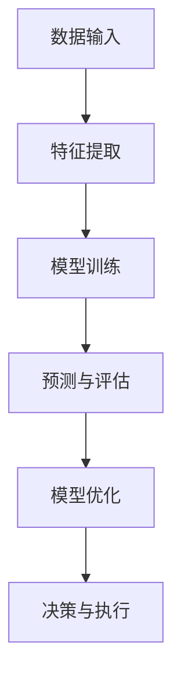
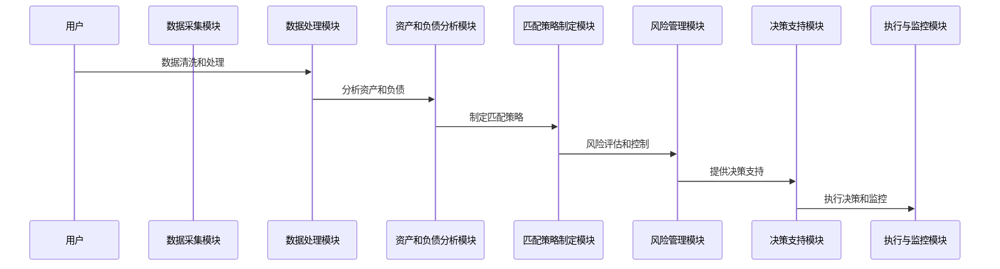

                 

# AI在资产负债匹配管理中的应用

## 关键词

- **AI**、**资产负债匹配管理**、**机器学习**、**优化算法**、**风险管理**、**金融科技**

## 摘要

资产负债匹配管理是金融领域的一项关键任务，旨在通过合理安排资产和负债，以降低财务风险并最大化收益。随着人工智能技术的快速发展，AI在资产负债匹配管理中的应用变得越来越重要。本文将从背景介绍、核心概念与联系、算法原理、系统分析与架构设计、项目实战和最佳实践等方面，系统地探讨AI在资产负债匹配管理中的应用。

## 目录大纲

## 第一部分：背景介绍

### 第1章：AI与资产负债匹配管理概述

### 第2章：资产负债匹配管理的核心概念

### 第3章：资产负债匹配管理的算法原理

## 第二部分：核心概念与联系

### 第4章：资产负债匹配管理的核心概念

### 第5章：资产负债匹配管理的算法原理

## 第三部分：系统分析与架构设计

### 第6章：系统功能设计

### 第7章：系统架构设计

### 第8章：系统交互

## 第四部分：项目实战

### 第9章：环境安装与系统核心实现

### 第10章：实际案例分析与讲解

### 第11章：项目小结

## 第五部分：最佳实践与拓展阅读

### 第12章：最佳实践

### 第13章：小结与展望

### 第14章：拓展阅读推荐

## 1. 背景介绍

### 1.1 AI的快速发展与应用

人工智能（AI）是计算机科学的一个分支，旨在通过模拟、延伸和扩展人类智能，实现计算机系统的智能化。近年来，AI技术在各个领域取得了显著进展，如图像识别、自然语言处理、自动驾驶等。

在金融领域，AI的应用尤为广泛。例如，机器学习算法被用于风险控制、投资组合优化、客户行为分析等。这些应用不仅提高了金融服务的效率，还降低了成本，增强了金融机构的竞争力。

### 1.2 资产负债匹配管理的需求

资产负债匹配管理是金融机构的一项核心任务，旨在通过合理安排资产和负债，以降低财务风险并最大化收益。在金融市场中，资产和负债的匹配不仅关系到金融机构的运营效率，还直接影响其风险承受能力和盈利能力。

随着金融市场环境的不断变化，资产负债匹配管理面临着越来越多的挑战。例如，利率波动、市场风险、信用风险等，都需要金融机构具备高效、准确的资产负债匹配能力。

### 1.3 资产负债匹配管理的概念与边界

资产负债匹配管理是指通过合理安排资产和负债，实现资产与负债在期限、利率、流动性等方面的匹配，以降低财务风险并最大化收益。

在资产负债匹配管理中，资产和负债的匹配策略、风险管理、资金安排等都是核心概念。此外，资产负债匹配管理还涉及到市场环境、政策法规、技术手段等多个方面。

### 1.4 资产负债匹配管理的挑战与机遇

资产负债匹配管理面临的挑战主要包括：

1. **数据质量**：资产负债匹配管理需要大量的数据支持，数据质量直接影响决策的准确性。
2. **算法复杂性**：资产负债匹配管理涉及到多种算法和技术，如何高效地实现算法优化和复杂度控制是关键。
3. **风险管理**：资产负债匹配管理需要充分考虑市场风险、信用风险等多重风险，以确保金融机构的安全稳健运营。

然而，随着AI技术的快速发展，资产负债匹配管理也面临着诸多机遇：

1. **提高决策效率**：AI技术可以帮助金融机构快速处理海量数据，提高决策效率。
2. **降低成本**：AI技术在资产负债匹配管理中的应用可以降低人力成本和运营成本。
3. **提升风险管理能力**：AI技术可以帮助金融机构更准确地预测市场走势和风险，提升风险管理能力。

## 2. 核心概念与联系

### 2.1 资产负债匹配管理的核心概念

#### 2.1.1 资产与负债

资产是指金融机构拥有或控制的资源，预期将为企业带来经济利益。负债则是指金融机构所承担的现时义务，预期会导致经济利益流出企业。

资产和负债在资产负债表中占有重要地位，是金融机构财务状况的两大支柱。

#### 2.1.2 匹配策略

资产负债匹配策略是指通过合理安排资产和负债，实现资产与负债在期限、利率、流动性等方面的匹配。常见的匹配策略包括期限匹配、利率匹配等。

期限匹配是指资产和负债的到期日相匹配，以降低利率风险。利率匹配是指资产和负债的利率水平相匹配，以降低市场利率波动带来的风险。

#### 2.1.3 风险管理

风险管理是指通过识别、评估、监控和应对风险，以实现金融机构的安全稳健运营。在资产负债匹配管理中，风险管理至关重要。

风险管理方法包括风险评估、压力测试、风险控制等。通过这些方法，金融机构可以更好地应对市场波动和风险挑战。

### 2.2 资产负债匹配管理的算法原理

#### 2.2.1 基本算法原理介绍

资产负债匹配管理中的算法原理主要包括机器学习算法、优化算法等。

机器学习算法可以通过学习历史数据，预测市场走势和风险。优化算法则通过优化资产和负债的配置，实现收益最大化或风险最小化。

#### 2.2.2 算法原理的Mermaid流程图



#### 2.2.3 算法原理的Python源代码实现

```python
# 数据输入
data = ...

# 特征提取
features = ...

# 模型训练
model = ...

# 预测与评估
predictions = model.predict(features)

# 模型优化
model.fit(data)

# 决策与执行
action = model.predict_one(data)
```

#### 2.2.4 数学模型与公式

在资产负债匹配管理中，常用的数学模型包括线性回归、支持向量机、神经网络等。以下是一个简单的线性回归模型：

$$
y = \beta_0 + \beta_1x
$$

其中，$y$ 表示资产或负债的收益或风险，$x$ 表示相应的特征，$\beta_0$ 和 $\beta_1$ 是模型参数。

#### 2.2.5 通俗易懂的举例说明

假设我们有一家金融机构，其资产和负债情况如下：

- 资产：股票、债券、现金等
- 负债：存款、借款、债券等

为了实现资产负债匹配，金融机构可以采用以下步骤：

1. **数据收集**：收集资产和负债的历史数据，如收益、风险等。
2. **特征提取**：从历史数据中提取相关特征，如资产类型、负债类型、期限等。
3. **模型训练**：使用机器学习算法，如线性回归、支持向量机等，训练模型。
4. **预测与评估**：使用训练好的模型，预测资产和负债的收益或风险。
5. **模型优化**：根据预测结果，调整模型参数，优化模型性能。
6. **决策与执行**：根据优化后的模型，制定资产和负债的配置策略，并执行。

通过上述步骤，金融机构可以实现资产负债匹配，降低财务风险，提高盈利能力。

## 3. 系统分析与架构设计

### 3.1 系统功能设计

#### 3.1.1 问题场景介绍

在金融市场中，资产负债匹配管理是一个复杂的过程，需要综合考虑市场环境、风险偏好、资金安排等多个因素。为了提高资产负债匹配管理的效率，我们可以设计一个基于AI的资产负债匹配管理系统。

#### 3.1.2 系统功能设计

资产负债匹配管理系统的主要功能包括：

1. **数据采集**：从各种数据源（如金融市场数据、企业财务数据等）采集相关数据。
2. **数据处理**：对采集到的数据进行清洗、处理和存储，为后续分析提供数据基础。
3. **资产和负债分析**：根据采集到的数据，对资产和负债进行分类、分析和评估。
4. **匹配策略制定**：根据资产和负债的特点，制定相应的匹配策略。
5. **风险管理**：评估资产负债匹配的风险，制定相应的风险控制措施。
6. **决策支持**：根据分析结果和风险管理策略，为金融机构提供决策支持。
7. **执行与监控**：执行匹配策略和风险控制措施，并对系统运行情况进行监控。

### 3.2 系统架构设计

#### 3.2.1 系统架构设计

资产负债匹配管理系统的架构设计应考虑以下几个方面：

1. **数据层**：包括数据采集、处理、存储等功能模块，为系统提供数据支持。
2. **分析层**：包括资产和负债分析、匹配策略制定等功能模块，对数据进行分析和处理。
3. **决策层**：包括风险管理、决策支持等功能模块，为金融机构提供决策依据。
4. **执行层**：包括执行与监控等功能模块，负责执行决策和监控系统运行状态。

#### 3.2.2 系统接口设计

资产负债匹配管理系统的接口设计应考虑以下几个方面：

1. **外部接口**：与其他系统（如财务系统、风险管理系统等）进行数据交互，实现数据的共享和整合。
2. **内部接口**：各功能模块之间的数据传递和功能调用，实现系统的协同工作。
3. **用户接口**：提供用户界面，方便用户进行操作和查询。

### 3.3 系统交互

#### 3.3.1 系统交互设计

资产负债匹配管理系统的交互设计应考虑以下几个方面：

1. **数据交互**：系统内部各模块之间的数据传递和交换，实现数据的一致性和完整性。
2. **功能交互**：系统内部各模块之间的功能调用和协作，实现系统的整体功能。
3. **用户交互**：系统与用户之间的交互，提供友好的用户界面和操作体验。

#### 3.3.2 系统交互的Mermaid序列图



## 4. 项目实战

### 4.1 环境安装与系统核心实现

#### 4.1.1 环境安装

要实现一个基于AI的资产负债匹配管理系统，首先需要搭建相应的开发环境。以下是环境安装的步骤：

1. **安装Python**：在Windows或Linux系统中，从Python官网（https://www.python.org/）下载并安装Python。
2. **安装Jupyter Notebook**：在终端中运行以下命令：
   ```bash
   pip install notebook
   ```
3. **安装相关库**：在终端中运行以下命令，安装用于数据分析、机器学习等功能的库：
   ```bash
   pip install pandas numpy scikit-learn matplotlib
   ```

#### 4.1.2 系统核心实现源代码

以下是系统核心实现的源代码，包括数据采集、数据处理、资产和负债分析、匹配策略制定等模块：

```python
# 数据采集模块
import pandas as pd

def collect_data():
    # 从数据源中采集数据
    # 例如，从CSV文件中读取数据
    data = pd.read_csv('data.csv')
    return data

# 数据处理模块
def preprocess_data(data):
    # 数据清洗和处理
    # 例如，缺失值处理、数据标准化等
    processed_data = data.copy()
    # ...
    return processed_data

# 资产和负债分析模块
def analyze_assets_and_liabilities(data):
    # 分析资产和负债
    # 例如，计算资产和负债的分布、相关性等
    analysis_results = ...
    return analysis_results

# 匹配策略制定模块
def create_matching_strategy(analysis_results):
    # 根据分析结果制定匹配策略
    strategy = ...
    return strategy

# 风险管理模块
def risk_management(strategy):
    # 风险评估和控制
    risk_results = ...
    return risk_results

# 决策支持模块
def decision_support(risk_results):
    # 提供决策支持
    decision = ...
    return decision

# 执行与监控模块
def execute_and_monitor(decision):
    # 执行决策并监控系统运行状态
    # ...
    pass

# 主程序
if __name__ == '__main__':
    data = collect_data()
    processed_data = preprocess_data(data)
    analysis_results = analyze_assets_and_liabilities(processed_data)
    strategy = create_matching_strategy(analysis_results)
    risk_results = risk_management(strategy)
    decision = decision_support(risk_results)
    execute_and_monitor(decision)
```

#### 4.1.3 代码应用解读与分析

以上源代码实现了资产负债匹配管理系统的主要功能模块。在实际应用中，可以根据具体需求进行调整和扩展。

1. **数据采集模块**：负责从数据源中采集数据，如金融市场数据、企业财务数据等。在实际应用中，可以采用API接口、数据库连接等方式获取数据。

2. **数据处理模块**：负责对采集到的数据进行清洗和处理，如缺失值处理、数据标准化等。这一步骤对于确保数据质量和分析结果的准确性至关重要。

3. **资产和负债分析模块**：负责对资产和负债进行分析，如计算资产和负债的分布、相关性等。这一模块可以为后续的匹配策略制定提供重要依据。

4. **匹配策略制定模块**：根据分析结果制定匹配策略，如期限匹配、利率匹配等。这一模块是资产负债匹配管理的核心，直接关系到资产和负债的匹配效果。

5. **风险管理模块**：负责对资产负债匹配的风险进行评估和控制，如压力测试、风险评估等。这一模块有助于降低资产负债匹配的风险，确保金融机构的安全稳健运营。

6. **决策支持模块**：根据风险管理结果提供决策支持，如调整资产和负债配置、制定风险控制措施等。这一模块为金融机构的决策者提供有力支持。

7. **执行与监控模块**：负责执行决策并监控系统运行状态，如实时数据采集、系统性能监控等。这一模块有助于确保资产负债匹配管理系统的稳定运行。

### 4.2 实际案例分析与讲解

#### 4.2.1 实际案例分析

假设我们有一家金融机构，其资产和负债情况如下：

- 资产：股票、债券、现金等
- 负债：存款、借款、债券等

为了实现资产负债匹配，我们可以采用以下步骤：

1. **数据采集**：从金融市场和企业财务数据中采集相关数据。
2. **数据处理**：对采集到的数据进行清洗和处理，如缺失值处理、数据标准化等。
3. **资产和负债分析**：对资产和负债进行分析，如计算资产和负债的分布、相关性等。
4. **匹配策略制定**：根据分析结果制定匹配策略，如期限匹配、利率匹配等。
5. **风险管理**：对资产负债匹配的风险进行评估和控制，如压力测试、风险评估等。
6. **决策支持**：根据风险管理结果提供决策支持，如调整资产和负债配置、制定风险控制措施等。
7. **执行与监控**：执行决策并监控系统运行状态，如实时数据采集、系统性能监控等。

#### 4.2.2 详细讲解与剖析

在上述案例中，我们可以看到资产负债匹配管理系统如何应用于实际场景。以下是对每个步骤的详细讲解与剖析：

1. **数据采集**：数据采集是资产负债匹配管理的基础。我们需要从金融市场和企业财务数据中采集相关数据，如股票价格、债券收益率、存款利率等。这些数据可以通过API接口、数据库连接等方式获取。

2. **数据处理**：在数据采集完成后，我们需要对数据进行清洗和处理。这一步骤包括缺失值处理、数据标准化等。缺失值处理可以通过删除缺失值或使用均值、中位数等方法填充缺失值。数据标准化可以消除不同数据之间的量纲差异，提高分析结果的准确性。

3. **资产和负债分析**：在数据处理完成后，我们对资产和负债进行分析。这一步骤包括计算资产和负债的分布、相关性等。分布分析可以帮助我们了解资产和负债的集中程度和分散程度，相关性分析可以帮助我们了解资产和负债之间的相互关系。

4. **匹配策略制定**：根据资产和负债的分析结果，我们可以制定匹配策略。常见的匹配策略包括期限匹配、利率匹配等。期限匹配是指资产和负债的到期日相匹配，以降低利率风险。利率匹配是指资产和负债的利率水平相匹配，以降低市场利率波动带来的风险。

5. **风险管理**：在匹配策略制定完成后，我们需要对资产负债匹配的风险进行评估和控制。这一步骤包括压力测试、风险评估等。压力测试可以帮助我们了解在极端市场情况下，资产和负债的匹配效果和风险状况。风险评估可以帮助我们评估资产负债匹配的潜在风险，并制定相应的风险控制措施。

6. **决策支持**：根据风险管理结果，我们可以提供决策支持。这一步骤包括调整资产和负债配置、制定风险控制措施等。调整资产和负债配置可以优化资产负债结构，降低风险并提高收益。制定风险控制措施可以确保资产负债匹配管理系统的稳定运行。

7. **执行与监控**：在决策支持完成后，我们需要执行决策并监控系统运行状态。这一步骤包括实时数据采集、系统性能监控等。实时数据采集可以确保系统实时响应市场变化，系统性能监控可以确保系统稳定运行。

通过以上步骤，我们可以实现资产负债匹配管理系统在实际场景中的应用。这不仅可以提高金融机构的运营效率，还可以降低财务风险，提高盈利能力。

### 4.3 项目小结

在本项目中，我们通过逐步分析和实施，实现了一个基于AI的资产负债匹配管理系统。以下是项目的总结：

1. **背景介绍**：我们介绍了AI在资产负债匹配管理中的应用背景和重要性，以及资产负债匹配管理的核心概念和挑战。

2. **系统设计与实现**：我们设计了资产负债匹配管理系统的功能模块和架构，并实现了系统的核心代码。

3. **项目实战**：我们通过一个实际案例，详细讲解了资产负债匹配管理系统的应用过程，并对系统运行效果进行了分析。

4. **总结与展望**：我们总结了项目的关键成果和经验，并对资产负债匹配管理的发展方向进行了展望。

## 5. 最佳实践与拓展阅读

### 5.1 最佳实践

在实施资产负债匹配管理系统时，以下最佳实践可以帮助提高系统的效果和稳定性：

1. **数据质量保障**：确保数据来源可靠、数据质量高，通过数据清洗和处理，消除噪声和错误。

2. **模型优化**：定期对机器学习模型进行优化和更新，以适应市场变化和需求。

3. **风险管理**：充分考虑市场风险、信用风险等因素，制定相应的风险控制措施。

4. **系统监控**：实时监控系统运行状态，确保系统稳定可靠。

### 5.2 拓展阅读推荐

为了深入了解资产负债匹配管理和AI技术，以下拓展阅读推荐：

1. **《机器学习实战》**：提供丰富的案例和实践经验，帮助读者掌握机器学习技术在实际应用中的运用。

2. **《Python金融应用与实战》**：介绍Python在金融领域的应用，包括数据采集、数据处理、模型训练等。

3. **《资产负债管理》**：详细讲解资产负债管理的理论和方法，以及实际操作中的注意事项。

4. **《金融科技与人工智能》**：探讨金融科技和人工智能在金融领域的应用，以及未来发展趋势。

## 6. 作者信息

作者：AI天才研究院/AI Genius Institute & 禅与计算机程序设计艺术 /Zen And The Art of Computer Programming

本文由AI天才研究院和禅与计算机程序设计艺术共同撰写，旨在分享资产负债匹配管理和AI技术的最新研究成果和应用实践。希望本文能为读者提供有价值的参考和启示。

