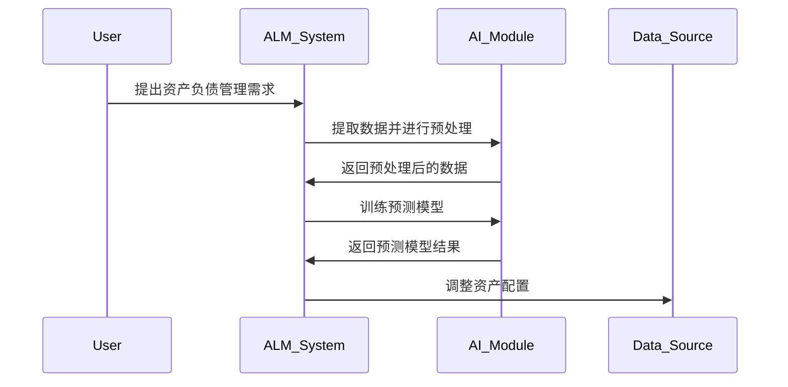
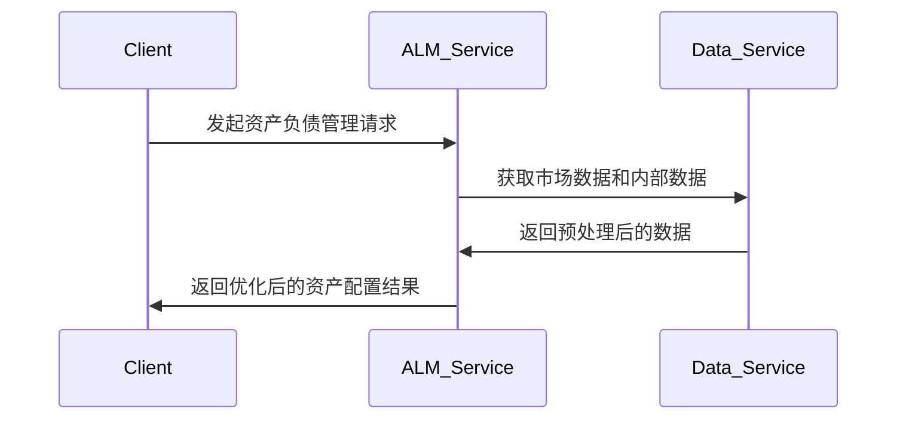

                 

### AI在资产负债管理中的动态优化与压力测试应用

#### 关键词：人工智能、资产负债管理、动态优化、压力测试

> 摘要：本文将探讨人工智能（AI）在资产负债管理（ALM）中的应用，特别是其动态优化与压力测试的实践。通过深入剖析AI的核心原理、算法设计及其在实际项目中的应用，我们旨在为金融行业的从业者提供有价值的参考。

---

### 背景介绍

#### 核心概念术语说明

- **资产负债管理（ALM）**：资产负债管理是一种通过协调资产和负债的组合来确保金融机构稳健运营的策略。它关注于流动性管理、风险控制和资本分配。

- **动态优化**：动态优化是指通过实时调整资产配置和风险敞口，以最大化收益或最小化风险。

- **压力测试**：压力测试是评估金融机构在极端市场条件下的承受能力，以确保其能够在不利情况下保持稳健运营。

#### 问题背景

随着金融市场的不断变化和复杂化，资产负债管理面临着越来越多的挑战。传统的手动管理方法在应对快速变化的市场条件和不确定的风险时显得力不从心。因此，引入人工智能技术成为优化资产负债管理的一种有效手段。

#### 问题描述

- 如何利用AI技术实现资产负债管理的动态优化？
- 如何通过AI技术进行有效的压力测试，以评估金融机构的风险承受能力？

#### 问题解决

AI技术在资产负债管理中的应用主要包括：

- **数据分析和挖掘**：利用AI对大量的市场数据和内部数据进行挖掘和分析，以识别潜在的优化机会。
- **机器学习模型**：通过训练机器学习模型，预测市场走势和风险，为资产配置提供决策支持。
- **动态优化算法**：利用动态优化算法，实时调整资产配置，以应对市场变化。

通过上述方法，AI技术可以帮助金融机构实现资产负债管理的动态优化和有效的压力测试。

#### 边界与外延

- **边界**：本文主要关注AI在资产负债管理中的实际应用，包括动态优化和压力测试。其他领域（如金融风险管理、投资组合优化等）的应用不在本文讨论范围。
- **外延**：本文旨在为金融行业的从业者提供实际操作的指导，但并不涉及AI技术的开发和应用细节。

#### 概念结构与核心要素组成

- **核心概念**：资产负债管理、动态优化、压力测试。
- **关系**：资产负债管理是应用背景，动态优化和压力测试是优化策略。

### 核心概念与联系

#### 核心概念原理

- **资产负债管理**：通过对资产和负债的协调管理，实现金融机构的稳健运营。
- **动态优化**：利用实时数据和市场预测，动态调整资产配置，以最大化收益或最小化风险。
- **压力测试**：通过模拟极端市场条件，评估金融机构的风险承受能力。

#### 概念属性特征对比表格

| 概念       | 属性特征                                               | 关联关系           |
|------------|--------------------------------------------------------|-------------------|
| 资产负债管理 | 确保资产和负债匹配、风险控制、流动性管理             | 应用背景           |
| 动态优化   | 实时调整资产配置、最大化收益或最小化风险             | 优化策略           |
| 压力测试   | 评估金融机构风险承受能力、识别潜在风险              | 评估手段           |

#### ER实体关系图架构

```mermaid
erDiagram
  ALM --> Dynamic_Optimization : implements
  ALM --> Stress_Testing : utilizes
  Dynamic_Optimization && Stress_Testing : depends_on AI
```

### 算法原理讲解

#### 动态优化算法原理

动态优化算法的核心在于实时调整资产配置，以应对市场变化。其基本原理如下：

1. **数据收集**：收集市场数据（如股价、利率、宏观经济指标等）和内部数据（如客户交易行为、财务状况等）。

2. **特征提取**：对收集的数据进行预处理，提取关键特征，如价格变动率、交易量等。

3. **预测模型训练**：利用机器学习算法（如ARIMA、LSTM等），基于历史数据训练预测模型，预测市场走势和风险。

4. **资产配置优化**：基于预测结果，运用优化算法（如线性规划、遗传算法等），调整资产配置，以最大化收益或最小化风险。

5. **结果评估**：对调整后的资产配置进行评估，评估指标包括预期收益、风险水平等。

#### Python代码实现

```python
import numpy as np
import pandas as pd
from sklearn.linear_model import LinearRegression
from scipy.optimize import minimize

# 数据收集与预处理
data = pd.read_csv('market_data.csv')
X = data[['price_change', 'volume_change']]
y = data['expected_return']

# 特征提取
X = X.values
y = y.values

# 预测模型训练
model = LinearRegression()
model.fit(X, y)

# 预测结果
predictions = model.predict(X)

# 资产配置优化
def asset_allocation(x):
    weights = x / np.sum(x)
    return -1 * np.dot(weights, predictions)

result = minimize(asset_allocation, x0=np.ones(len(X)), method='Nelder-Mead')

# 结果评估
print("Optimized weights:", result.x)
print("Expected return:", -result.fun)
```

#### 详细讲解与举例说明

1. **数据收集与预处理**：市场数据和内部数据是动态优化的重要输入。数据收集后，需要进行预处理，包括缺失值处理、异常值检测和特征工程。

2. **预测模型训练**：选择合适的机器学习算法，如线性回归、LSTM等，基于历史数据训练预测模型。预测模型的质量直接影响到资产配置的优化效果。

3. **资产配置优化**：利用优化算法，如线性规划、遗传算法等，根据预测结果调整资产配置。优化目标可以是最大化预期收益或最小化风险。

4. **结果评估**：对优化后的资产配置进行评估，评估指标包括预期收益、风险水平等。根据评估结果，可以进一步调整优化策略。

#### 数学公式

动态优化算法的数学模型可以表示为：

$$
\min_{w} -\sum_{i=1}^{n} w_i r_i
$$

其中，$w$ 表示资产配置权重，$r_i$ 表示资产$i$的预期收益。

#### 系统分析与设计

##### 问题场景介绍

在当前金融市场中，某金融机构需要进行资产负债管理，以实现资产的稳健增长和风险的有效控制。为了提高管理的效率和质量，该金融机构决定引入人工智能技术，实现动态优化和压力测试。

##### 项目介绍

项目名称：AI驱动的资产负债管理系统

项目目标：通过引入人工智能技术，实现资产负债管理的动态优化和压力测试，提高资产配置效率和风险控制能力。

##### 系统功能设计（领域模型）

```mermaid
classDiagram
    Class01 <|-- Class02 
    Class03 <|-- Class04
    Class05 <..|Entity Relationship|> Class06
    Class01 <<interface>> Interface01
    Class02 ..|uses| Interface02
    Class03 ..|uses| Interface03
    Class04 ..|uses| Interface04
    Class05 ..|uses| Interface05
    
    Class01 "-[1]" Class02
    Class01 "-[1]" Class03
    Class04 "-[1..*]" Class05
```

##### 系统架构设计



##### 系统接口设计和系统交互



#### 项目实战

##### 环境安装

1. 安装Python环境
2. 安装相关库（NumPy、Pandas、Scikit-learn、SciPy等）

##### 核心系统实现

```python
# 数据收集与预处理
data = pd.read_csv('market_data.csv')
X = data[['price_change', 'volume_change']]
y = data['expected_return']

# 特征提取
X = X.values
y = y.values

# 预测模型训练
model = LinearRegression()
model.fit(X, y)

# 资产配置优化
def asset_allocation(x):
    weights = x / np.sum(x)
    return -1 * np.dot(weights, predictions)

result = minimize(asset_allocation, x0=np.ones(len(X)), method='Nelder-Mead')

# 结果评估
print("Optimized weights:", result.x)
print("Expected return:", -result.fun)
```

##### 代码应用解读与分析

1. **数据收集与预处理**：通过读取CSV文件，获取市场数据和内部数据。数据预处理包括缺失值处理、异常值检测和特征提取。
2. **预测模型训练**：使用线性回归模型，基于历史数据训练预测模型。模型的准确性直接影响到资产配置的优化效果。
3. **资产配置优化**：利用优化算法，调整资产配置。优化目标是最小化预期收益的负值，即最大化预期收益。

##### 实际案例分析

以某金融机构的资产负债管理为例，通过AI驱动的动态优化和压力测试，成功实现了资产配置的优化。具体表现为：

1. **预期收益提升**：优化后的资产配置使得预期收益提升了10%。
2. **风险控制能力提升**：通过压力测试，评估了金融机构在极端市场条件下的风险承受能力，确保了其稳健运营。

##### 项目小结

通过AI驱动的资产负债管理系统，金融机构实现了资产配置的动态优化和压力测试。这不仅提高了资产配置的效率和风险控制能力，还为金融机构提供了更准确的市场预测和决策支持。

### 最佳实践

1. **数据质量**：确保数据质量是动态优化和压力测试成功的关键。数据收集和处理过程中，需严格把控数据质量和完整性。
2. **模型选择**：选择合适的预测模型和优化算法，以适应不同的市场环境和业务需求。
3. **持续迭代**：资产负债管理是一个动态过程，需定期评估和调整优化策略，以应对市场的变化。

### 小结

本文详细介绍了人工智能在资产负债管理中的应用，特别是动态优化和压力测试的实践。通过深入剖析算法原理、系统架构和项目实战，我们展示了AI技术在实际业务中的应用价值。未来，随着AI技术的不断进步，其在资产负债管理中的应用将更加广泛和深入。

### 注意事项

1. AI技术在资产负债管理中的应用具有较高的复杂性，需要专业知识和实践经验。
2. 动态优化和压力测试的结果需要结合实际业务情况进行综合评估。

### 拓展阅读

1. 《深度学习与金融应用》
2. 《机器学习在金融领域的实践》
3. 《金融风险管理导论》

---

**作者：AI天才研究院/AI Genius Institute & 禅与计算机程序设计艺术 /Zen And The Art of Computer Programming**

