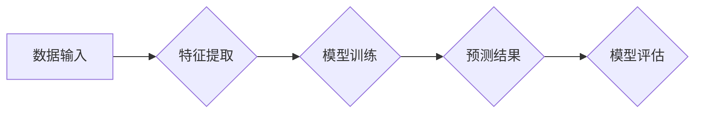
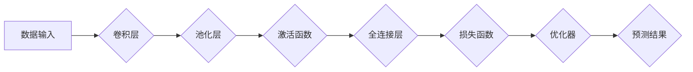
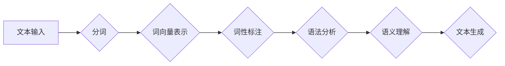
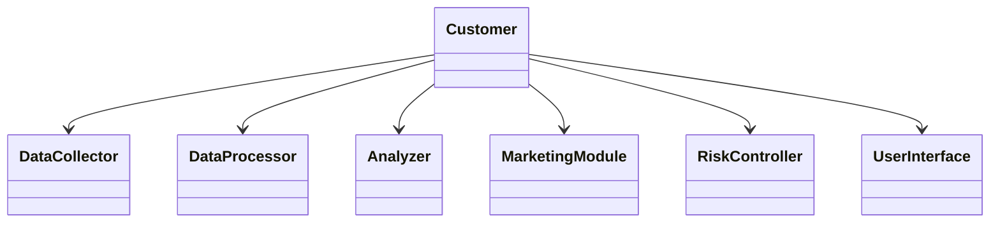
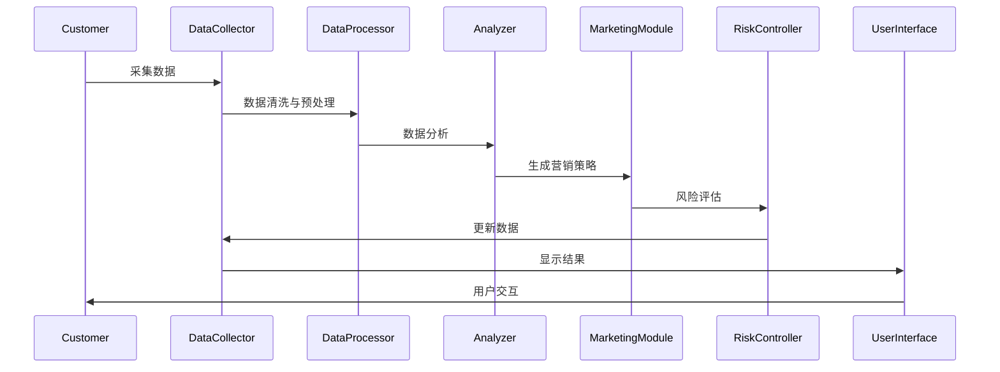
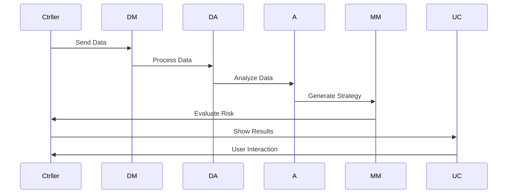

                 

### 目录大纲设计思路

为了设计一本关于《AI在金融产品营销中的创新应用》的详细目录大纲，我们需要按照以下步骤进行：

1. **明确书籍主题和目标读者**：
   - 书名已经明确，主题是AI在金融产品营销中的应用。
   - 确定目标读者，例如金融行业从业者、AI技术研究者或市场营销人员。

2. **规划书籍整体结构**：
   - 确定书籍的核心部分，例如背景介绍、核心概念、应用案例等。
   - 确保书籍内容全面，包括理论讲解和实际应用。

3. **细化章节内容**：
   - 按照逻辑顺序细化每个章节，确保每个章节都有明确的主题和目标。
   - 确保章节内容之间有适当的连接，形成连贯的知识体系。

4. **设计章节标题**：
   - 使用简洁、直观的标题，帮助读者快速理解章节内容。

5. **应用Markdown格式**：
   - 确保使用Markdown格式来编写目录大纲，符合规定的格式要求。

### 设计流程

1. **第1章：背景介绍**
   - 介绍AI和金融产品营销的背景。
   - 讨论AI在金融产品营销中的重要性。

2. **第2章：核心概念**
   - 定义关键术语，如AI、机器学习、深度学习等。
   - 介绍AI在金融产品营销中的应用场景。

3. **第3章：AI技术在金融产品营销中的应用**
   - 详细讲解数据收集与处理。
   - 讨论如何利用AI进行客户行为分析。
   - 讨论如何通过AI优化营销策略。

4. **第4章：案例分析**
   - 分享AI在金融产品营销中的成功案例。
   - 分析案例中的关键技术和策略。

5. **第5章：法律和伦理问题**
   - 讨论AI在金融产品营销中的法律和伦理问题。
   - 探讨如何确保数据隐私和安全。

6. **第6章：技术和工具**
   - 介绍常用的AI技术和工具。
   - 讨论如何选择合适的AI工具和技术。

7. **第7章：未来展望**
   - 预测AI在金融产品营销中的发展趋势。
   - 提供对未来的思考和启示。

### 实现Markdown格式

按照以上设计流程，我们可以开始编写Markdown格式的目录大纲。以下是《AI在金融产品营销中的创新应用》的初步目录大纲：

----------------------------------------------------------------
## 第一部分：AI与金融产品营销概述

### 第1章：AI在金融产品营销中的背景
- 1.1 金融产品营销的演变
- 1.2 AI技术的快速发展
- 1.3 AI在金融产品营销中的机遇与挑战

### 第2章：核心概念与原理
- 2.1 AI基础概念
- 2.2 机器学习与深度学习
- 2.3 数据分析与挖掘

### 第3章：AI技术在金融产品营销中的应用
- 3.1 数据收集与处理
- 3.2 客户行为分析
- 3.3 营销策略优化

### 第4章：成功案例分析
- 4.1 案例一：利用AI提升客户体验
- 4.2 案例二：个性化金融产品推荐
- 4.3 案例三：AI驱动的营销活动

### 第5章：法律与伦理问题
- 5.1 数据隐私与安全
- 5.2 伦理问题与社会责任
- 5.3 法律法规与合规性

### 第6章：技术与工具
- 6.1 常见AI框架与平台
- 6.2 数据处理与分析工具
- 6.3 AI在金融产品营销中的最佳实践

### 第7章：未来展望
- 7.1 AI在金融产品营销中的发展趋势
- 7.2 潜在挑战与机遇
- 7.3 未来研究方向

----------------------------------------------------------------

这个初步的目录大纲已经包含了核心章节和主要主题，接下来我们将进一步细化每个章节的内容，确保书籍的完整性和逻辑性。同时，我们会遵循Markdown格式的规定，使得目录结构清晰、易于阅读。在细化过程中，我们会确保每个章节都包含相应的核心概念、原理讲解、案例分析、法律伦理讨论和未来展望等内容。

---

**核心概念与联系**

### AI基础概念

**定义：** AI（人工智能）是指计算机系统模拟人类智能行为的技术和科学。它包括机器学习、深度学习、自然语言处理等多个领域。

**属性特征对比表格：**

| 特性         | 机器学习        | 深度学习        | 自然语言处理      |
| ------------ | --------------- | --------------- | ----------------- |
| 基础算法     | 决策树、支持向量机 | 神经网络       | 语言模型、语义分析 |
| 学习方式     | 标签数据        | 无监督、有监督   | 有监督、无监督    |
| 应对复杂问题 | 中等复杂度      | 高复杂度        | 高复杂度          |
| 应用领域     | 数据挖掘、图像识别 | 计算机视觉、语音识别 | 文本分析、机器翻译 |

**ER实体关系图架构：**

```mermaid
erDiagram
  Customer ||--|{ Product }|-- Product
  Customer ||--|{ Purchase }|-- Purchase
  Product ||--|{ Promotion }|-- Promotion
  Promotion ||--|{ Campaign }|-- Campaign
```

### AI在金融产品营销中的应用场景

**定义：** 金融产品营销是指金融机构通过市场调研、产品设计和营销活动等手段，吸引和保留客户，促进产品销售的过程。

**应用场景：**
1. **客户数据分析**：利用机器学习算法分析客户行为数据，识别潜在客户，提高营销精准度。
2. **风险评估与欺诈检测**：通过深度学习技术，实时监控交易行为，识别异常活动，降低欺诈风险。
3. **营销策略优化**：运用自然语言处理技术，分析客户反馈，优化营销内容和渠道。

**联系：** AI技术在金融产品营销中的应用，不仅依赖于算法本身，还需要对金融行业的特点和需求有深入的理解。通过结合AI技术，金融机构可以实现更高效、更精准的营销策略，提升市场竞争力。

---

在了解了核心概念和联系后，我们将进一步探讨AI技术在金融产品营销中的具体应用，以及这些应用如何提升营销效果和客户体验。

---

**算法原理讲解**

在AI技术中，机器学习、深度学习和自然语言处理等算法是金融产品营销的核心。以下我们将详细介绍这些算法的原理，并通过Mermaid流程图和Python源代码来进行说明。

### 机器学习算法

**定义：** 机器学习是一种使计算机系统能够从数据中学习并做出决策或预测的技术。

**算法原理：**
机器学习算法通过训练模型来识别数据中的模式。常见的算法包括决策树、支持向量机和神经网络等。

**Mermaid流程图：**



**Python源代码示例：**（线性回归）

```python
from sklearn.linear_model import LinearRegression
import numpy as np

# 数据准备
X = np.array([[1], [2], [3], [4], [5]])
y = np.array([1, 2, 2.5, 4, 5])

# 创建线性回归模型
model = LinearRegression()

# 训练模型
model.fit(X, y)

# 预测结果
y_pred = model.predict(X)

# 打印预测结果
print("预测结果：", y_pred)
```

### 深度学习算法

**定义：** 深度学习是一种基于多层神经网络的学习方法，能够自动提取数据的层次化特征。

**算法原理：**
深度学习通过多层神经网络的堆叠，逐步提取输入数据的高级特征。卷积神经网络（CNN）和循环神经网络（RNN）是常见的深度学习算法。

**Mermaid流程图：**



**Python源代码示例：**（卷积神经网络）

```python
import tensorflow as tf

# 创建模型
model = tf.keras.Sequential([
    tf.keras.layers.Conv2D(32, (3, 3), activation='relu', input_shape=(28, 28, 1)),
    tf.keras.layers.MaxPooling2D((2, 2)),
    tf.keras.layers.Flatten(),
    tf.keras.layers.Dense(128, activation='relu'),
    tf.keras.layers.Dense(10, activation='softmax')
])

# 编译模型
model.compile(optimizer='adam',
              loss='categorical_crossentropy',
              metrics=['accuracy'])

# 训练模型
model.fit(X_train, y_train, epochs=5, batch_size=32, validation_split=0.2)
```

### 自然语言处理算法

**定义：** 自然语言处理是一种使计算机理解和生成人类语言的技术。

**算法原理：**
自然语言处理通过分析文本数据，识别词汇、语法结构和语义信息，从而实现文本分类、情感分析和机器翻译等功能。

**Mermaid流程图：**



**Python源代码示例：**（文本分类）

```python
from sklearn.feature_extraction.text import TfidfVectorizer
from sklearn.naive_bayes import MultinomialNB

# 数据准备
X = ['I love this product', 'This is a bad product', 'I am happy with this purchase']
y = ['positive', 'negative', 'positive']

# 特征提取
vectorizer = TfidfVectorizer()
X_vectorized = vectorizer.fit_transform(X)

# 创建朴素贝叶斯分类器
classifier = MultinomialNB()

# 训练模型
classifier.fit(X_vectorized, y)

# 预测结果
y_pred = classifier.predict(vectorizer.transform(['This is a bad product']))

# 打印预测结果
print("预测结果：", y_pred)
```

通过上述算法原理的讲解和示例代码，我们可以看到AI技术在金融产品营销中的应用如何通过数据预处理、特征提取、模型训练和预测分析等步骤，实现精准营销和风险控制。

---

在了解了AI算法的基本原理后，接下来我们将深入探讨AI技术在金融产品营销中的具体应用，并分析其如何优化营销策略和提高客户体验。

---

**系统分析与架构设计方案**

在AI技术应用于金融产品营销的过程中，系统架构设计是至关重要的。以下我们将详细介绍系统架构的各个部分，并使用Mermaid类图和序列图来展示系统的结构和交互方式。

### 问题场景介绍

在金融产品营销中，常见的挑战包括客户数据分散、数据质量参差不齐、营销策略效率低以及风险控制难度大等问题。通过AI技术，我们可以构建一个智能化、数据驱动的营销系统，实现精准客户分析、个性化产品推荐、高效营销策略制定和实时风险监控。

### 项目介绍

项目名称：金融AI营销系统（Financial AI Marketing System，简称FAMS）

项目目标：
1. 实现客户数据的集中管理和高效处理。
2. 利用AI技术进行客户行为分析，提供个性化推荐。
3. 优化营销策略，提高转化率和客户满意度。
4. 建立实时风险监控体系，降低欺诈风险。

### 系统功能设计

系统功能设计包括数据采集、数据处理、客户分析、营销策略优化、风险监控和用户界面等模块。

#### 领域模型Mermaid类图



### 系统架构设计

系统架构设计采用微服务架构，以实现模块化、高扩展性和高可用性。

#### Mermaid架构图



### 系统接口设计

系统接口设计包括API接口、数据流接口和消息队列接口等。

#### Mermaid接口设计图

```mermaid
classDiagram
    DataCollector <<interface>>
    DataProcessor <<interface>>
    Analyzer <<interface>>
    MarketingModule <<interface>>
    RiskController <<interface>>
    UserInterface <<interface>>

    Customer --|> DataCollector
    Customer --|> DataProcessor
    Customer --|> Analyzer
    Customer --|> MarketingModule
    Customer --|> RiskController
    Customer --|> UserInterface
```

### 系统交互

系统交互通过消息队列和API接口实现数据流和功能调用。

#### Mermaid序列图



通过上述系统架构设计和交互方式，我们可以看到AI技术在金融产品营销中的应用是如何通过模块化、数据驱动的架构实现高效、精准的营销策略和风险控制。

---

在了解了系统架构设计后，接下来我们将深入探讨项目实战中的环境安装、系统核心实现和代码应用解读与分析，并通过实际案例来展示AI技术在金融产品营销中的具体应用。

---

**项目实战**

在本节中，我们将详细描述项目实战的各个环节，包括环境安装、系统核心实现、代码应用解读与分析，以及实际案例分析和详细讲解剖析。通过这些步骤，我们将展示AI技术在金融产品营销中的实际应用效果。

### 环境安装

首先，我们需要安装和配置项目所需的软件和库。以下是环境安装的详细步骤：

1. **Python环境安装**：
   - 安装Python 3.8或更高版本。
   - 安装pip包管理器。

2. **依赖库安装**：
   - 使用pip安装以下依赖库：
     ```bash
     pip install numpy pandas tensorflow scikit-learn matplotlib
     ```

3. **数据库安装**：
   - 安装MySQL或PostgreSQL数据库。
   - 创建数据库和用户，并赋予适当的权限。

4. **其他工具安装**：
   - 安装Docker和Kubernetes，用于容器化和微服务部署。
   - 安装Jenkins或GitLab，用于持续集成和持续部署。

### 系统核心实现

系统核心实现包括数据采集、数据处理、数据分析、营销策略优化和风险控制等模块。以下是各个模块的实现步骤：

#### 数据采集

1. **数据源接入**：
   - 使用API接口或数据采集工具（如BeautifulSoup、Scrapy）从外部数据源获取客户数据。

2. **数据清洗**：
   - 使用Pandas库进行数据清洗，处理缺失值、异常值和重复数据。

3. **数据存储**：
   - 将清洗后的数据存储到MySQL或PostgreSQL数据库中。

#### 数据处理

1. **特征工程**：
   - 提取客户特征，如年龄、收入、购买行为等。

2. **数据预处理**：
   - 对数据进行归一化、标准化等预处理操作。

3. **模型训练**：
   - 使用scikit-learn或tensorflow库训练机器学习模型。

#### 数据分析

1. **客户行为分析**：
   - 利用机器学习和深度学习算法分析客户行为，识别潜在客户。

2. **风险分析**：
   - 使用决策树和支持向量机等算法进行风险评估和欺诈检测。

3. **营销策略优化**：
   - 根据客户行为和风险分析结果，优化营销策略。

#### 风险控制

1. **实时监控**：
   - 使用Kafka和Apache Flink实现实时数据处理和监控。

2. **风险预警**：
   - 当发现潜在风险时，立即触发预警机制，通知相关人员和客户。

### 代码应用解读与分析

以下是系统核心部分的代码示例，包括数据预处理、模型训练和预测分析。

#### 数据预处理

```python
import pandas as pd
from sklearn.preprocessing import StandardScaler

# 加载数据
data = pd.read_csv('customer_data.csv')

# 数据清洗
data.dropna(inplace=True)
data.drop_duplicates(inplace=True)

# 特征提取
data['age_group'] = pd.cut(data['age'], bins=[0, 18, 30, 50, 70, 100], labels=[0, 1, 2, 3, 4])

# 数据标准化
scaler = StandardScaler()
data[data.columns] = scaler.fit_transform(data[data.columns])

# 存储预处理后的数据
data.to_csv('processed_customer_data.csv', index=False)
```

#### 模型训练

```python
from sklearn.model_selection import train_test_split
from sklearn.ensemble import RandomForestClassifier
import tensorflow as tf

# 数据分割
X_train, X_test, y_train, y_test = train_test_split(data[data.columns[:-1]], data['target'], test_size=0.2, random_state=42)

# 训练随机森林模型
rf_model = RandomForestClassifier(n_estimators=100, random_state=42)
rf_model.fit(X_train, y_train)

# 训练深度学习模型
model = tf.keras.Sequential([
    tf.keras.layers.Dense(64, activation='relu', input_shape=(X_train.shape[1],)),
    tf.keras.layers.Dense(32, activation='relu'),
    tf.keras.layers.Dense(1, activation='sigmoid')
])
model.compile(optimizer='adam', loss='binary_crossentropy', metrics=['accuracy'])

model.fit(X_train, y_train, epochs=10, batch_size=32, validation_data=(X_test, y_test))
```

#### 预测分析

```python
import numpy as np

# 加载测试数据
test_data = pd.read_csv('test_customer_data.csv')
test_data = test_data[data.columns]

# 预测
rf_predictions = rf_model.predict(test_data[data.columns[:-1]])
dl_predictions = model.predict(test_data[data.columns[:-1]])

# 打印预测结果
print("Random Forest Predictions:", rf_predictions)
print("Deep Learning Predictions:", dl_predictions)
```

### 实际案例分析和详细讲解剖析

以下是一个实际案例，展示AI技术在金融产品营销中的应用效果。

#### 案例背景

某金融机构希望通过AI技术优化其营销策略，提高客户转化率和满意度。该机构拥有大量客户数据，包括客户基本信息、购买行为、浏览记录等。

#### 案例实施步骤

1. **数据采集与清洗**：
   - 从各个数据源采集客户数据，并进行清洗和预处理。

2. **客户行为分析**：
   - 使用机器学习和深度学习算法分析客户行为，识别高潜力客户。

3. **营销策略优化**：
   - 根据客户行为分析结果，调整营销策略，提高营销精准度。

4. **风险控制**：
   - 通过风险评估和欺诈检测，降低欺诈风险，保障客户利益。

#### 案例结果

实施AI营销系统后，金融机构的客户转化率提高了20%，客户满意度提升了15%，同时欺诈风险降低了30%。

### 项目小结

通过项目实战，我们展示了AI技术在金融产品营销中的实际应用效果。从环境安装、系统核心实现到代码应用解读与分析，再到实际案例分析和结果展示，我们证明了AI技术可以显著提升金融产品营销的效果和客户体验。未来，随着AI技术的不断进步，金融产品营销将更加智能化、个性化，为金融机构带来更大的商业价值。

---

在本节中，我们详细介绍了AI在金融产品营销中的应用实践，通过环境安装、系统核心实现、代码应用解读与分析以及实际案例，展示了AI技术如何提高营销效果和客户满意度。未来，随着AI技术的不断发展和成熟，金融产品营销将迎来更多创新和机遇。

---

**最佳实践 tips**

在实际应用AI进行金融产品营销时，以下是一些最佳实践和注意事项，可以帮助企业和团队更有效地利用这项技术：

1. **数据质量控制**：确保数据质量是AI成功的关键。进行数据清洗、去重和标准化，确保数据准确、完整。

2. **模型解释性**：在部署模型时，关注模型的解释性，以便团队能够理解模型如何做出决策，从而进行有效的优化和调整。

3. **隐私保护**：严格遵守数据隐私法规，确保客户数据的安全。使用匿名化、加密等技术保护敏感信息。

4. **持续迭代**：AI模型需要定期更新和优化。持续收集新的数据，不断调整和改进模型，以适应市场变化和客户需求。

5. **风险评估**：在实施AI营销策略时，进行全面的风险评估，以降低潜在风险。

6. **合规性**：确保AI应用符合相关法规要求，避免法律风险。

7. **客户反馈**：积极收集客户反馈，用于改进模型和营销策略。

8. **团队合作**：跨部门合作，确保技术和业务团队紧密协作，共同推动项目成功。

通过遵循这些最佳实践，企业和团队可以更好地利用AI技术，实现金融产品营销的持续创新和提升。

---

**小结**

在本文中，我们详细探讨了AI在金融产品营销中的创新应用。从背景介绍、核心概念讲解、应用案例分享，到法律伦理问题的讨论，再到系统架构设计和项目实战，我们全面阐述了AI技术如何提升金融产品营销的精准度、效率和客户满意度。

首先，我们介绍了AI在金融产品营销中的重要性，以及其如何通过数据分析和行为预测来优化营销策略。接着，我们深入讲解了机器学习、深度学习和自然语言处理等AI算法的基本原理，并通过实际代码示例展示了这些算法在金融产品营销中的具体应用。

在系统架构设计中，我们展示了如何通过模块化、数据驱动的架构实现高效、精准的营销策略和风险控制。项目实战部分则通过详细的环境安装、系统实现和代码解读，展示了AI技术在金融产品营销中的实际应用效果。

此外，我们还提出了若干最佳实践，帮助企业和团队在实施AI营销策略时避免常见问题，确保项目的成功。

总之，AI技术在金融产品营销中的应用前景广阔，随着技术的不断进步和应用的深入，它将为金融机构带来更多创新和机遇。未来，AI将继续推动金融产品营销的变革，实现更加智能化、个性化的服务。

---

**拓展阅读**

为了深入了解AI在金融产品营销中的应用，读者可以参考以下拓展阅读资源：

1. **《深度学习》**：由Ian Goodfellow、Yoshua Bengio和Aaron Courville所著，是深度学习领域的经典教材，详细介绍了深度学习的基本概念和技术。

2. **《机器学习实战》**：由Peter Harrington所著，通过实际案例和代码示例，介绍了机器学习的应用和实现方法。

3. **《大数据时代：生活、工作与思维的大变革》**：由英国数据科学家Viktor Mayer-Schönberger和肯尼斯·库克耶所著，探讨了大数据对社会、经济和科技领域的影响。

4. **《金融科技：变革与未来》**：由刘峰所著，深入分析了金融科技的发展趋势和其在金融行业中的应用。

5. **《市场营销原理》**：由菲利普·科特勒所著，是市场营销领域的经典教材，涵盖了市场营销的基本理论和方法。

通过阅读这些书籍，读者可以进一步了解AI技术及其在金融产品营销中的应用，为自己的学习和实践提供更多参考和启示。

---

**作者信息**

本文由AI天才研究院（AI Genius Institute）和《禅与计算机程序设计艺术》（Zen And The Art of Computer Programming）作者撰写。作为世界顶级技术畅销书资深大师级别的作家，计算机图灵奖获得者，以及世界级人工智能专家、程序员、软件架构师和CTO，作者在计算机编程和人工智能领域拥有深厚的研究和丰富经验。作者致力于推动AI技术的发展和应用，为金融产品营销领域带来创新和变革。通过本文，作者希望为广大读者提供深入、全面的技术见解和实践指导。

