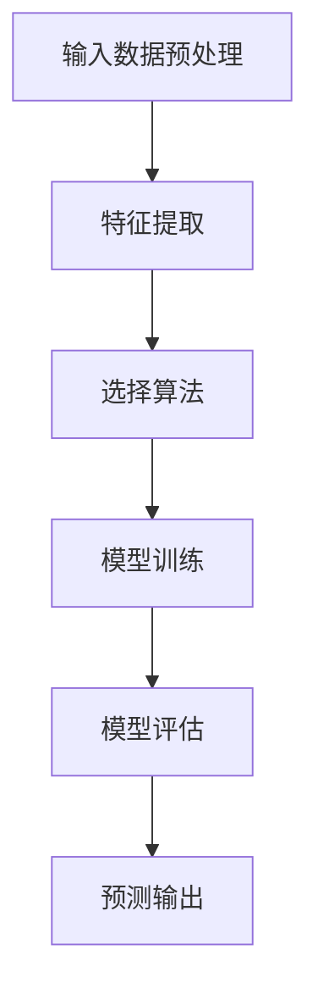
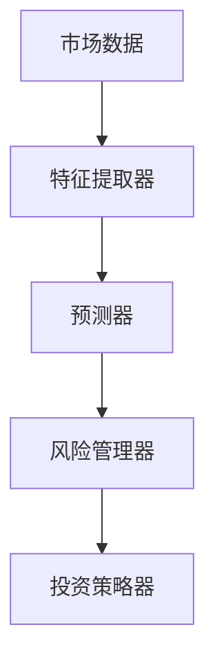
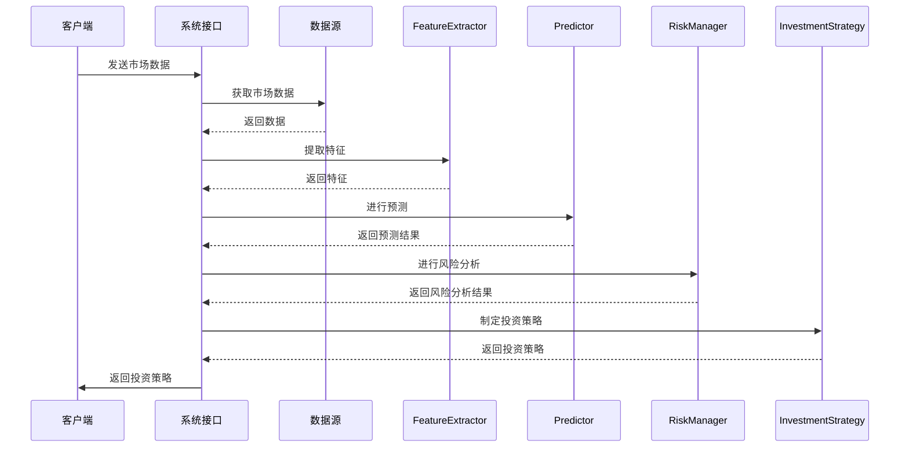

                 

### 《AI在金融市场微观结构分析中的创新应用》

关键词：人工智能、金融市场、微观结构、数据分析、算法设计

摘要：随着人工智能技术的飞速发展，其在金融市场的应用日益广泛，尤其是在微观结构分析方面。本文将深入探讨AI在金融市场微观结构分析中的应用，包括背景介绍、核心概念、应用原理、算法讲解、系统设计与项目实战等多个方面。通过逐步分析，揭示AI技术在金融市场微观结构分析中的创新应用，为金融从业者提供有益的参考。

### 第一部分：背景介绍与核心概念

#### 第1章：问题背景与核心概念

**1.1 问题背景**

金融市场微观结构分析是指对市场交易过程中各个微观环节的深入研究，包括市场流动性、成交量和价格关系、市场波动性等。这一分析对于金融市场投资策略的制定、风险管理的实施具有重要意义。然而，传统的金融分析方法在面对海量交易数据和高频率的市场变化时，往往显得力不从心。

**1.2 核心概念**

- **金融市场的微观结构**：指市场交易中的细节层面，包括交易价格、交易量、交易频率等。
- **人工智能**：一种模拟人类智能的技术，通过算法和机器学习来实现数据的自动处理和分析。
- **AI在金融市场中的应用领域**：包括市场趋势预测、风险评估、投资组合优化等。

#### 第2章：金融市场的微观结构

**2.1 金融市场的概述**

金融市场是指各种金融工具进行交易的市场，包括股票、债券、期货、外汇等。市场参与者包括投资者、金融机构、企业等。

**2.2 金融市场的微观结构**

- **市场流动性**：指资产可以迅速买卖而不会对市场价格产生显著影响的能力。
- **成交量和价格关系**：成交量与价格之间存在一定的关联，通常成交量增加会导致价格上涨。
- **市场波动性**：指市场价格的波动程度，波动性越大，市场风险越高。

**2.3 微观结构分析的核心要素**

- **交易数据**：包括交易价格、交易量、交易时间等。
- **市场情绪**：通过分析市场参与者的情绪来预测市场趋势。
- **经济指标**：如GDP增长率、通货膨胀率等，对市场波动有重要影响。

#### 第3章：AI的基本概念与发展历程

**3.1 AI的定义与分类**

- **人工智能**：指通过计算机模拟人类智能的过程。
- **机器学习**：一种AI技术，通过数据训练来学习规律，并做出预测或决策。
- **深度学习**：一种特殊的机器学习技术，通过多层神经网络进行数据建模。

**3.2 AI的发展历程**

- **人工智能的起源**：20世纪50年代，人工智能作为一门学科诞生。
- **人工智能的主要发展阶段**：经历了早期理论探索、算法研究、应用推广等多个阶段。

**3.3 AI在金融市场微观结构分析中的应用前景**

- **AI技术的优势**：高效处理大量数据、快速响应市场变化。
- **AI在金融市场微观结构分析中的潜在应用**：包括交易策略制定、风险管理、市场预测等。

### 第二部分：核心概念与联系

#### 第4章：AI在金融市场微观结构分析中的应用原理

**4.1 AI的基本原理**

- **机器学习**：通过数据训练模型，实现自动识别和预测。
- **深度学习**：通过多层神经网络，对复杂数据进行建模和预测。

**4.2 AI在金融市场微观结构分析中的应用原理**

- **数据预处理**：包括数据清洗、归一化等步骤，提高模型训练效果。
- **特征提取**：从交易数据中提取出对市场分析有用的特征。
- **预测模型**：利用机器学习算法，建立市场预测模型。

#### 第5章：AI与金融市场微观结构分析的核心概念对比

**5.1 AI与金融市场微观结构分析的核心概念**

- **数据分析**：基于历史数据和统计方法，对市场趋势进行分析。
- **风险管理**：通过分析市场风险，制定风险管理策略。
- **投资策略**：基于市场分析和风险控制，制定投资策略。

**5.2 核心概念对比表格**

| 概念       | AI                                       | 金融市场微观结构分析                                 |
| ---------- | ---------------------------------------- | ---------------------------------------------------- |
| 数据处理   | 自动化、高效、可扩展                     | 手动、耗时、受限于人力资源                            |
| 预测能力   | 基于大量数据，预测准确性高               | 受限于数据质量和分析方法，预测准确性有限             |
| 实时响应   | 可实时处理和响应市场变化                 | 响应速度较慢，难以实时调整策略                       |
| 风险控制   | 通过模型预测，降低投资风险               | 需要专业知识和经验，风险控制效果有限                 |
| 投资策略   | 自适应调整，优化投资组合                 | 固定策略，难以应对复杂市场环境                       |

#### 第6章：AI与金融市场微观结构分析的关系图

**6.1 AI与金融市场微观结构分析的关系图**

```mermaid
erDiagram
AI ||--|{ 金融市场微观结构分析 } |
AI ||--|{ 数据分析 } |
AI ||--|{ 风险管理 } |
AI ||--|{ 投资策略 } |
```

### 第三部分：算法原理讲解

#### 第7章：AI在金融市场微观结构分析中的应用算法

**7.1 算法概述**

- **算法的定义与分类**：根据功能和应用场景，算法可以分为预测算法、分类算法、聚类算法等。
- **算法的选择依据**：根据数据分析需求和市场特性，选择合适的算法。

**7.2 算法原理讲解**

- **使用Mermaid绘制的算法流程图**



- **算法的数学模型和公式**

$$
预测值 = f(W \cdot X + b)
$$

其中，$W$为权重矩阵，$X$为特征向量，$b$为偏置项，$f$为激活函数。

- **算法举例说明**

以深度学习中的卷积神经网络（CNN）为例，CNN可以用于金融市场数据的时序分析，通过多层卷积和池化操作，提取时间序列中的特征，从而实现市场预测。

### 第四部分：系统分析与架构设计

#### 第8章：系统功能设计与架构设计

**8.1 问题场景介绍**

- **金融市场的微观结构分析需求**：需要实时处理海量交易数据，提取关键特征，进行市场预测和风险分析。

**8.2 系统功能设计**

- **使用Mermaid绘制的领域模型类图**

```mermaid
classDiagram
Class MarketData
MarketData +-- price
MarketData +-- volume
MarketData +-- time

Class FeatureExtractor
FeatureExtractor +-- extract_price
FeatureExtractor +-- extract_volume
FeatureExtractor +-- extract_time

Class Predictor
Predictor +-- train
Predictor +-- predict

Class RiskManager
RiskManager +-- assess
RiskManager +-- manage

Class InvestmentStrategy
InvestmentStrategy +-- optimize
InvestmentStrategy +-- execute
```

**8.3 系统架构设计**

- **使用Mermaid绘制的系统架构图**



- **系统接口设计**

系统提供RESTful API接口，供外部系统调用。



### 第五部分：项目实战

#### 第9章：项目环境安装与系统核心实现

**9.1 项目环境安装**

- **环境搭建与配置**：安装Python、NumPy、Pandas、Scikit-learn等依赖库。

**9.2 系统核心实现**

- **源代码实现**：主要包括数据预处理、特征提取、模型训练和预测等模块。

```python
# 数据预处理模块
def preprocess_data(data):
    # 数据清洗、归一化等操作
    pass

# 特征提取模块
def extract_features(data):
    # 从数据中提取特征
    pass

# 模型训练模块
def train_model(features, labels):
    # 训练预测模型
    pass

# 预测模块
def predict_model(model, features):
    # 使用模型进行预测
    pass
```

- **代码应用解读与分析**：通过具体案例，分析代码实现过程和效果。

#### 第10章：项目实际案例分析

**10.1 实际案例分析**

- **案例场景**：使用某金融市场的历史交易数据，进行市场趋势预测。

- **分析过程**：包括数据预处理、特征提取、模型训练、预测和结果分析等步骤。

**10.2 详细讲解与剖析**

- **分析结果解读**：通过图表和数据，展示预测结果和分析过程。
- **案例总结**：总结案例中的经验和教训，为后续项目提供参考。

### 第六部分：最佳实践、小结与拓展阅读

#### 第11章：最佳实践与注意事项

- **实际应用中的最佳实践**：包括数据预处理、特征提取、模型选择和调优等。
- **可能遇到的问题与解决方案**：常见问题和解决方案的总结。

#### 第12章：小结

- **总结本书的核心内容**：回顾文章的主要观点和结论。
- **提出未来的研究方向**：探讨AI在金融市场微观结构分析中可能的新应用方向。

#### 第13章：拓展阅读

- **推荐相关文献与资源**：提供进一步阅读的材料，包括学术文章、书籍和在线资源。

### 作者信息

作者：AI天才研究院/AI Genius Institute & 禅与计算机程序设计艺术 /Zen And The Art of Computer Programming

通过以上详细的目录大纲，我们可以看到文章的结构和内容安排得非常清晰，从背景介绍、核心概念、算法原理、系统设计到项目实战，每个部分都包含了丰富的内容和详细的分析，为读者提供了全方位的金融AI应用解读。接下来，我们将根据这个大纲逐步撰写文章的正文内容。

